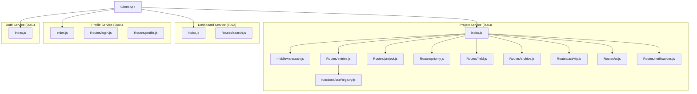
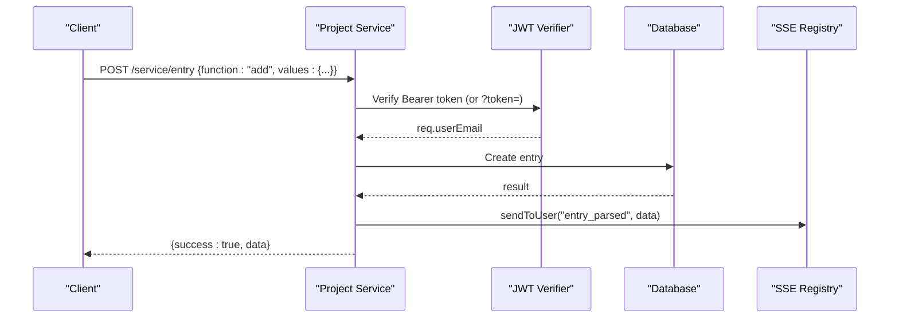
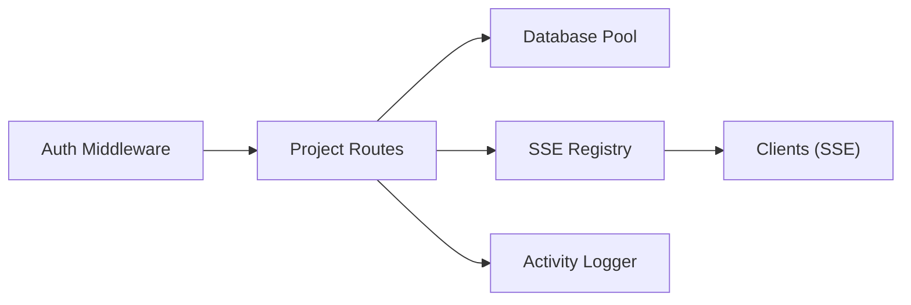

# API Reference

<cite>
**Referenced Files in This Document**
- [services/project-service/src/index.js](file://services/project-service/src/index.js)
- [services/project-service/docs/openapi.yaml](file://services/project-service/docs/openapi.yaml)
- [services/project-service/src/middleware/auth.js](file://services/project-service/src/middleware/auth.js)
- [services/project-service/src/functions/sseRegistry.js](file://services/project-service/src/functions/sseRegistry.js)
- [services/project-service/src/Routes/entries.js](file://services/project-service/src/Routes/entries.js)
- [services/project-service/src/Routes/project.js](file://services/project-service/src/Routes/project.js)
- [services/project-service/src/Routes/priority.js](file://services/project-service/src/Routes/priority.js)
- [services/project-service/src/Routes/field.js](file://services/project-service/src/Routes/field.js)
- [services/project-service/src/Routes/archive.js](file://services/project-service/src/Routes/archive.js)
- [services/project-service/src/Routes/activity.js](file://services/project-service/src/Routes/activity.js)
- [services/project-service/src/Routes/ai.js](file://services/project-service/src/Routes/ai.js)
- [services/project-service/src/Routes/notifications.js](file://services/project-service/src/Routes/notifications.js)
- [services/dashboard-service/src/index.js](file://services/dashboard-service/src/index.js)
- [services/dashboard-service/src/Routes/search.js](file://services/dashboard-service/src/Routes/search.js)
- [services/profile-service/src/index.js](file://services/profile-service/src/index.js)
- [services/profile-service/src/Routes/login.js](file://services/profile-service/src/Routes/login.js)
- [services/profile-service/src/Routes/profile.js](file://services/profile-service/src/Routes/profile.js)
- [services/auth-service/src/index.js](file://services/auth-service/src/index.js)
</cite>

## Table of Contents

1. Introduction
2. Project Structure
3. Core Components
4. Architecture Overview
5. Detailed Component Analysis
6. Dependency Analysis
7. Performance Considerations
8. Troubleshooting Guide
9. Conclusion
10. Appendices

## Introduction

This document provides a comprehensive API reference for the Codacaine microservices, covering REST endpoints, authentication, real-time updates via Server-Sent Events (SSE), OpenAPI 3.0 specification and interactive Swagger UI, request/response schemas, validation rules, error handling patterns, rate limiting notes, versioning strategy, and webhook integrations.

Key services:

- Project Service (port 5003): Projects, entries, fields, archives, activity, AI, notifications, SSE streaming
- Dashboard Service (port 5002): Cross-project search and health ping
- Profile Service (port 5004): User profile management and login helpers
- Auth Service (port 5001): Health check; authentication is handled client-side with Supabase JWTs

Authentication uses Supabase JWT access tokens. Most endpoints require a valid JWT via Authorization header or query parameter (for SSE).

## Project Structure

The system is organized by service under services/. Each service exposes Express routes and middleware. The Project Service includes an embedded OpenAPI 3.0 spec served at /api-docs.

**Diagram sources**

- [services/project-service/src/index.js:23-93](file://services/project-service/src/index.js#L23-L93)
- [services/dashboard-service/src/index.js:9-52](file://services/dashboard-service/src/index.js#L9-L52)
- [services/profile-service/src/index.js:9-55](file://services/profile-service/src/index.js#L9-L55)
- [services/auth-service/src/index.js:39-79](file://services/auth-service/src/index.js#L39-L79)

**Section sources**

- [services/project-service/src/index.js:23-93](file://services/project-service/src/index.js#L23-L93)
- [services/dashboard-service/src/index.js:9-52](file://services/dashboard-service/src/index.js#L9-L52)
- [services/profile-service/src/index.js:9-55](file://services/profile-service/src/index.js#L9-L55)
- [services/auth-service/src/index.js:39-79](file://services/auth-service/src/index.js#L39-L79)

## Core Components

- Authentication middleware verifies Supabase JWTs using JWKS and attaches user email to requests. It supports both Authorization header and query token for SSE.
- RPC-style dispatch pattern: POST to resource endpoints with { function, values } to call specific operations.
- OpenAPI 3.0 spec is loaded from docs/openapi.yaml and served at /api-docs with Swagger UI.
- SSE registry manages long-lived connections per user for real-time events.

**Section sources**

- [services/project-service/src/middleware/auth.js:27-70](file://services/project-service/src/middleware/auth.js#L27-L70)
- [services/project-service/docs/openapi.yaml:1-46](file://services/project-service/docs/openapi.yaml#L1-L46)
- [services/project-service/src/functions/sseRegistry.js:17-74](file://services/project-service/src/functions/sseRegistry.js#L17-L74)

## Architecture Overview

The Project Service centralizes most business logic and exposes multiple resource endpoints. The Dashboard Service provides cross-project search. The Profile Service handles profile data and login checks. The Auth Service provides a health endpoint.

**Diagram sources**

- [services/project-service/src/Routes/entries.js:23-191](file://services/project-service/src/Routes/entries.js#L23-L191)
- [services/project-service/src/middleware/auth.js:27-70](file://services/project-service/src/middleware/auth.js#L27-L70)
- [services/project-service/src/functions/sseRegistry.js:47-74](file://services/project-service/src/functions/sseRegistry.js#L47-L74)

## Detailed Component Analysis

### Authentication and Security

- All /service routes (except explicitly public ones) are protected by requireAuth middleware.
- Token sources:
  - Authorization: Bearer <jwt>
  - Query param token (for SSE where headers cannot be set)
- On success, req.user and req.userEmail are attached.
- Public endpoints:
  - GET / (health)
  - POST /service/notifications/sendPending (public webhook-like trigger)

Error responses:

- 401 Unauthorized when token missing or invalid
- 500 Internal server error on unexpected failures

**Section sources**

- [services/project-service/src/middleware/auth.js:27-70](file://services/project-service/src/middleware/auth.js#L27-L70)
- [services/project-service/src/index.js:76-93](file://services/project-service/src/index.js#L76-L93)

### Project Service Endpoints

#### Health

- GET /
- Response: { service: "project-service", status: "healthy" }

**Section sources**

- [services/project-service/src/index.js:76-78](file://services/project-service/src/index.js#L76-L78)

#### Projects

- POST /service/project
- Body: { function, values }
- Functions: add, edit, delete, getProjects, setColor
- Validation: project_name required for add/edit/delete; new_project_name and old_project_name required for edit; color required for setColor
- Responses:
  - 200 DataResponse
  - 400 ErrorResponse (validation or conflict)
  - 401 ErrorResponse (unauthorized)
  - 500 ErrorResponse (server error)

**Section sources**

- [services/project-service/src/Routes/project.js:20-99](file://services/project-service/src/Routes/project.js#L20-L99)
- [services/project-service/docs/openapi.yaml:281-343](file://services/project-service/docs/openapi.yaml#L281-L343)

#### Entries

- POST /service/entry
- Body: { function, values }
- Functions: add, update, delete, deleteById, get, getAll, sortUnarchived, sortArchived
- Validation: project_name required for add/update/delete/get; entry_id required for deleteById/update; sort_type optional for sorting
- Responses:
  - 200 DataResponse
  - 400 EntryErrorResponse (validation)
  - 401 ErrorResponse (unauthorized)
  - 500 EntryErrorResponse (server error)

**Section sources**

- [services/project-service/src/Routes/entries.js:23-191](file://services/project-service/src/Routes/entries.js#L23-L191)
- [services/project-service/docs/openapi.yaml:344-425](file://services/project-service/docs/openapi.yaml#L344-L425)

#### Natural Language Entry

- POST /service/natural-language-entry
- Body: { text: string }
- Behavior: Parses text into structured entry; pushes parsed data via SSE immediately; logs activity; returns final result
- Responses:
  - 200 DataResponse
  - 401 ErrorResponse
  - 500 ErrorResponse (AI parsing failed)

**Section sources**

- [services/project-service/src/Routes/entries.js:243-325](file://services/project-service/src/Routes/entries.js#L243-L325)
- [services/project-service/docs/openapi.yaml:549-591](file://services/project-service/docs/openapi.yaml#L549-L591)

#### Priority

- POST /service/priority
- Body: { function, values }
- Function: set
- Validation: project_name and entry_id required; priorityValue expected
- Responses:
  - 200 DataResponse
  - 401 ErrorResponse
  - 500 ErrorResponse

**Section sources**

- [services/project-service/src/Routes/priority.js:20-68](file://services/project-service/src/Routes/priority.js#L20-L68)
- [services/project-service/docs/openapi.yaml:592-631](file://services/project-service/docs/openapi.yaml#L592-L631)

#### Fields

- POST /service/field
- Body: { function, values }
- Functions: add, edit, get
- Validation: table_name and field_name required for add/edit; table_name required for get; data_type and is_required optional for add/edit
- Responses:
  - 200 DataResponse
  - 401 ErrorResponse
  - 500 ErrorResponse

**Section sources**

- [services/project-service/src/Routes/field.js:20-95](file://services/project-service/src/Routes/field.js#L20-L95)
- [services/project-service/docs/openapi.yaml:633-687](file://services/project-service/docs/openapi.yaml#L633-L687)

#### Archives

- POST /service/archive
- Body: { function, values }
- Functions: archive_project, unarchive_project, archive_entry, unarchive_entry, getArchives, getUnarchived, getArchivedProjects, getUnarchivedProjects
- Validation: project_name required for archive/unarchive project; project_name and entry_id required for archive/unarchive entry; user_email required for archived projects queries
- Responses:
  - 200 DataResponse
  - 401 ErrorResponse
  - 500 ErrorResponse

**Section sources**

- [services/project-service/src/Routes/archive.js:20-115](file://services/project-service/src/Routes/archive.js#L20-L115)
- [services/project-service/docs/openapi.yaml:689-751](file://services/project-service/docs/openapi.yaml#L689-L751)

#### Activity Log

- POST /service/activity
- Body: { function, values }
- Function: getActivities
- Parameters: limit (default 50)
- Responses:
  - 200 DataResponse
  - 401 ErrorResponse
  - 500 ErrorResponse

**Section sources**

- [services/project-service/src/Routes/activity.js:19-53](file://services/project-service/src/Routes/activity.js#L19-L53)
- [services/project-service/docs/openapi.yaml:753-790](file://services/project-service/docs/openapi.yaml#L753-L790)

#### AI Prompt

- POST /service/ai
- Body: { prompt: string }
- Responses:
  - 200 { success: true, response: string }
  - 401 ErrorResponse
  - 500 ErrorResponse

**Section sources**

- [services/project-service/src/Routes/ai.js:11-39](file://services/project-service/src/Routes/ai.js#L11-L39)
- [services/project-service/docs/openapi.yaml:792-800](file://services/project-service/docs/openapi.yaml#L792-L800)

#### Notifications

- POST /service/notifications
- Body: { function, values }
- Functions: get, history, markRead, markAllRead
- Validation: id required for markRead; limit/offset optional for history
- Responses:
  - 200 DataResponse
  - 400 ErrorResponse
  - 401 ErrorResponse
  - 500 ErrorResponse

- POST /service/notifications/sendPending (public)
- Purpose: Trigger sending pending due-date notification emails (idempotent)
- Responses:
  - 200 DataResponse
  - 500 ErrorResponse

**Section sources**

- [services/project-service/src/Routes/notifications.js:20-98](file://services/project-service/src/Routes/notifications.js#L20-L98)
- [services/project-service/docs/openapi.yaml:426-516](file://services/project-service/docs/openapi.yaml#L426-L516)

#### SSE Stream

- GET /service/nl-stream?token=<jwt>
- Description: Long-lived SSE connection for real-time natural language entry updates
- Events:
  - connected: stream established
  - entry_parsed: parsed entry data pushed after AI completes
  - entry_error: error during parsing
  - : ping: keep-alive comment every 30 seconds
- Responses:
  - 200 text/event-stream
  - 401 ErrorResponse

**Section sources**

- [services/project-service/src/Routes/entries.js:200-233](file://services/project-service/src/Routes/entries.js#L200-L233)
- [services/project-service/docs/openapi.yaml:518-548](file://services/project-service/docs/openapi.yaml#L518-L548)
- [services/project-service/src/functions/sseRegistry.js:17-74](file://services/project-service/src/functions/sseRegistry.js#L17-L74)

### Dashboard Service Endpoints

#### Search

- POST /service/search
- Body: { function, values }
- Functions:
  - searchAll: requires user_email, keyword
  - searchProject: requires user_email, project_name, keyword
  - searchProjects: requires user_email, keyword
- Responses:
  - 200 DataResponse
  - 400 ErrorResponse (missing parameters)
  - 500 ErrorResponse

**Section sources**

- [services/dashboard-service/src/Routes/search.js:19-61](file://services/dashboard-service/src/Routes/search.js#L19-L61)

#### Health Ping

- GET /service/health-ping
- Purpose: Wake instance and ping database; used by CI/CD
- Responses:
  - 200 { status: "ok", ... }
  - 503 { status: "degraded", ... }
  - 500 { status: "error", reason: message }

**Section sources**

- [services/dashboard-service/src/index.js:54-67](file://services/dashboard-service/src/index.js#L54-L67)

### Profile Service Endpoints

#### Login Helper

- POST /service/login
- Body: { function, values }
- Function: checkUser
- Validation: email required
- Responses:
  - 200 Result
  - 400 ErrorResponse (missing email)
  - 500 ErrorResponse

**Section sources**

- [services/profile-service/src/Routes/login.js:19-52](file://services/profile-service/src/Routes/login.js#L19-L52)

#### Profile Management

- POST /service/profile
- Body: { function, values }
- Functions:
  - username: requires email, username
  - email: requires email
  - name: requires email, new_name
  - avatar: requires email, url
  - getProfile: requires email
  - emailNotifications: requires email, enabled (boolean)
  - deleteProfile: requires email
- Responses:
  - 200 Result
  - 400 ErrorResponse (missing parameters)
  - 500 ErrorResponse

**Section sources**

- [services/profile-service/src/Routes/profile.js:31-107](file://services/profile-service/src/Routes/profile.js#L31-L107)

### Auth Service Endpoints

#### Health Check

- GET /
- Response: { service: "auth-service", status: "healthy" }

**Section sources**

- [services/auth-service/src/index.js:50-52](file://services/auth-service/src/index.js#L50-L52)

## Dependency Analysis

- Project Service depends on:
  - JWT verification via jose and Supabase JWKS
  - Database pool for persistence
  - SSE registry for real-time events
  - Activity logging for audit trails
- Dashboard Service depends on:
  - Search functions and database
- Profile Service depends on:
  - Profile functions and database
- Auth Service is minimal and stateless

**Diagram sources**

- [services/project-service/src/middleware/auth.js:27-70](file://services/project-service/src/middleware/auth.js#L27-L70)
- [services/project-service/src/Routes/entries.js:23-191](file://services/project-service/src/Routes/entries.js#L23-L191)
- [services/project-service/src/functions/sseRegistry.js:17-74](file://services/project-service/src/functions/sseRegistry.js#L17-L74)

**Section sources**

- [services/project-service/src/middleware/auth.js:27-70](file://services/project-service/src/middleware/auth.js#L27-L70)
- [services/project-service/src/Routes/entries.js:23-191](file://services/project-service/src/Routes/entries.js#L23-L191)
- [services/project-service/src/functions/sseRegistry.js:17-74](file://services/project-service/src/functions/sseRegistry.js#L17-L74)

## Performance Considerations

- Request body size limit: 5mb on Project Service JSON parser
- SSE keep-alive pings every 30 seconds to prevent timeouts
- Background summary regeneration for updated entries avoids blocking immediate responses
- Global error handlers ensure CORS headers on errors

[No sources needed since this section provides general guidance]

## Troubleshooting Guide

Common issues and resolutions:

- 401 Unauthorized: Ensure Authorization header contains a valid Supabase JWT or pass token query parameter for SSE
- 400 Bad Request: Validate required fields in { function, values }; check types and presence
- 500 Internal Server Error: Review server logs; verify database connectivity and external service configuration (e.g., Brevo for notifications)
- SSE not receiving events: Confirm connection established and token provided; check browser console for EventSource errors; ensure keep-alive pings are received

**Section sources**

- [services/project-service/src/middleware/auth.js:27-70](file://services/project-service/src/middleware/auth.js#L27-L70)
- [services/project-service/src/Routes/entries.js:200-233](file://services/project-service/src/Routes/entries.js#L200-L233)
- [services/project-service/src/Routes/notifications.js:81-98](file://services/project-service/src/Routes/notifications.js#L81-L98)

## Conclusion

Codacaine’s APIs follow a consistent RPC-style dispatch pattern with strong authentication via Supabase JWTs. The Project Service offers comprehensive CRUD for projects, entries, fields, archives, activity, AI prompts, and notifications, plus real-time updates through SSE. The Dashboard and Profile Services provide complementary functionality. OpenAPI 3.0 documentation is available via Swagger UI at /api-docs.

[No sources needed since this section summarizes without analyzing specific files]

## Appendices

### OpenAPI 3.0 Specification and Swagger UI

- Location: /api-docs
- Spec file: docs/openapi.yaml
- Includes security scheme BearerAuth (JWT)
- Schemas: RpcRequest, ErrorResponse, DataResponse, HealthResponse, Project, Entry, ProjectField, ActivityLog, ArchiveEntry, UserProfile, SseEvent

**Section sources**

- [services/project-service/src/index.js:58-75](file://services/project-service/src/index.js#L58-L75)
- [services/project-service/docs/openapi.yaml:1-46](file://services/project-service/docs/openapi.yaml#L1-L46)

### Real-Time Communication (SSE)

- Endpoint: GET /service/nl-stream?token=<jwt>
- Events: connected, entry_parsed, entry_error, : ping
- Use cases: Immediate UI updates after AI parsing before full POST completion

**Section sources**

- [services/project-service/src/Routes/entries.js:200-233](file://services/project-service/src/Routes/entries.js#L200-L233)
- [services/project-service/docs/openapi.yaml:518-548](file://services/project-service/docs/openapi.yaml#L518-L548)

### Webhook Integrations

- Public trigger: POST /service/notifications/sendPending
- Purpose: Send pending due-date notification emails (idempotent)
- Caller: Hourly pg_cron/pg_net poke without user JWT

**Section sources**

- [services/project-service/src/Routes/notifications.js:81-98](file://services/project-service/src/Routes/notifications.js#L81-L98)
- [services/project-service/docs/openapi.yaml:487-516](file://services/project-service/docs/openapi.yaml#L487-L516)

### Rate Limiting

- No explicit rate limiting middleware observed in services
- Consider adding application-level or gateway-level throttling if needed

[No sources needed since this section provides general guidance]

### API Versioning Strategy

- OpenAPI info.version: 1.0.0
- Current practice: In-process versioning via OpenAPI metadata; no URL path versioning observed

**Section sources**

- [services/project-service/docs/openapi.yaml:1-5](file://services/project-service/docs/openapi.yaml#L1-L5)

### Deprecation Policies

- Not explicitly defined in code; consider adopting deprecation headers and migration guides when evolving endpoints

[No sources needed since this section provides general guidance]
