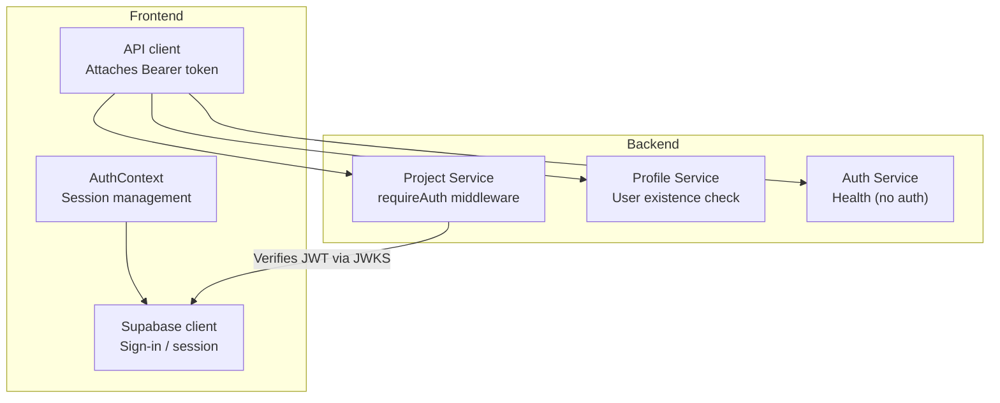
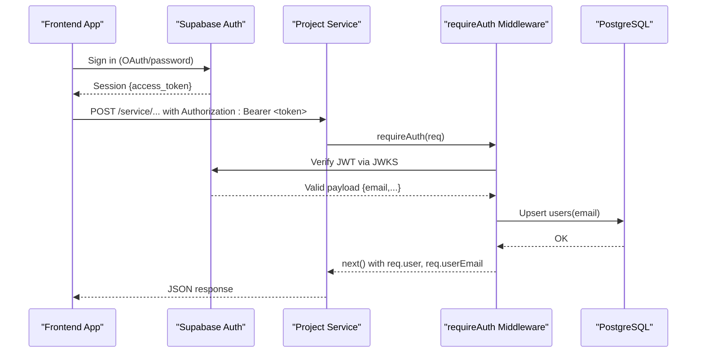
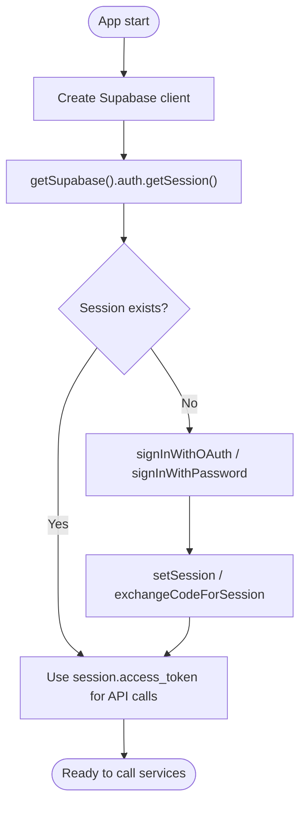
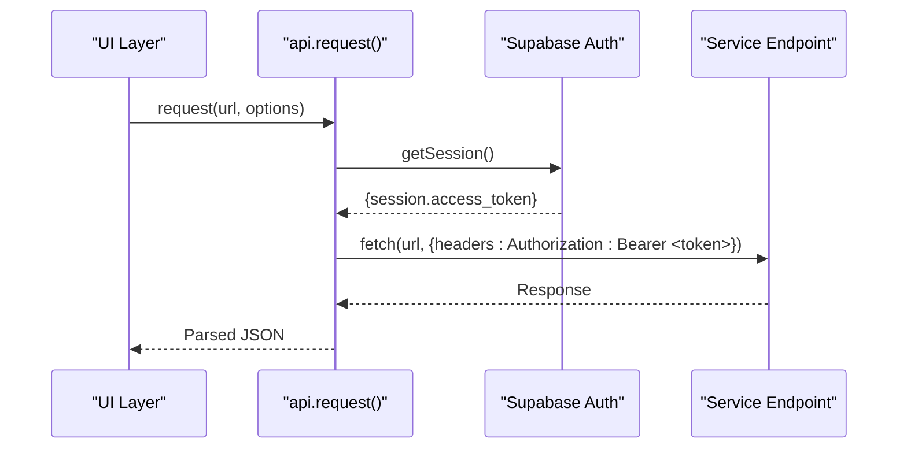
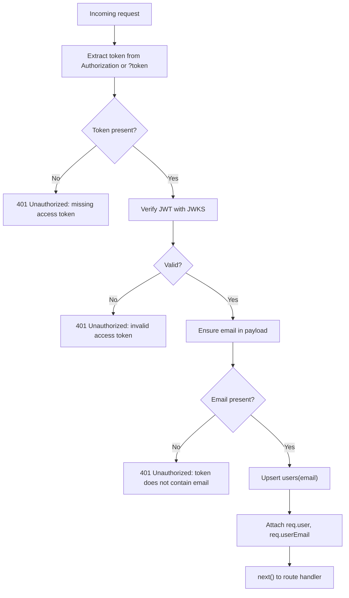
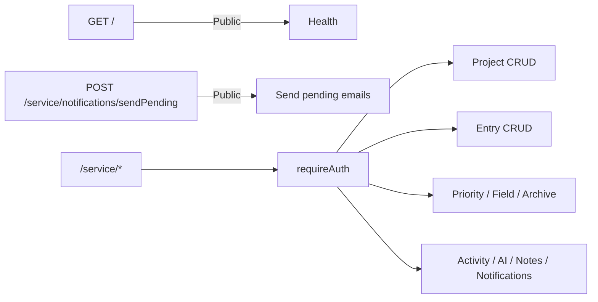
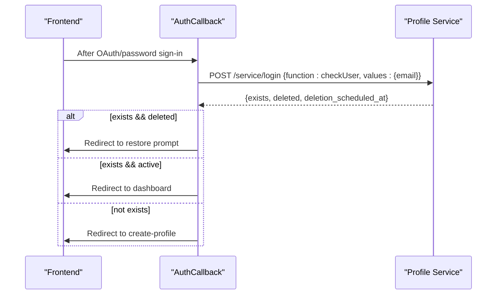
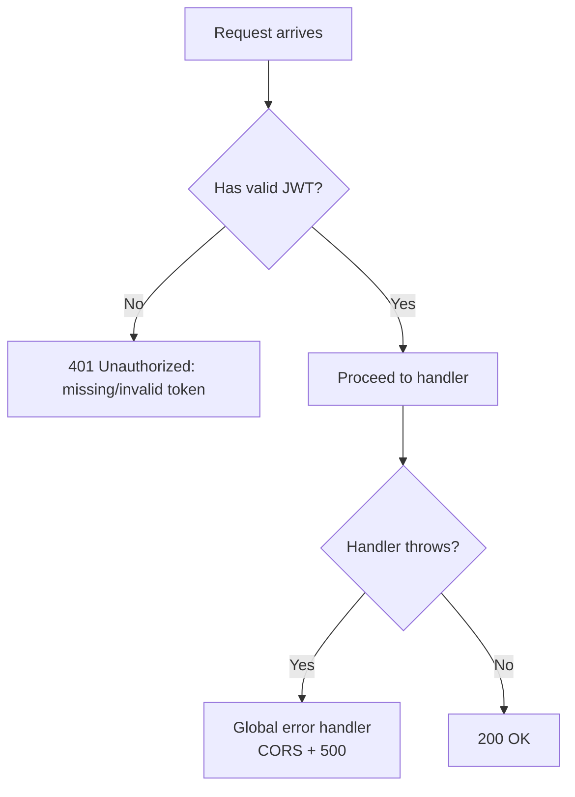
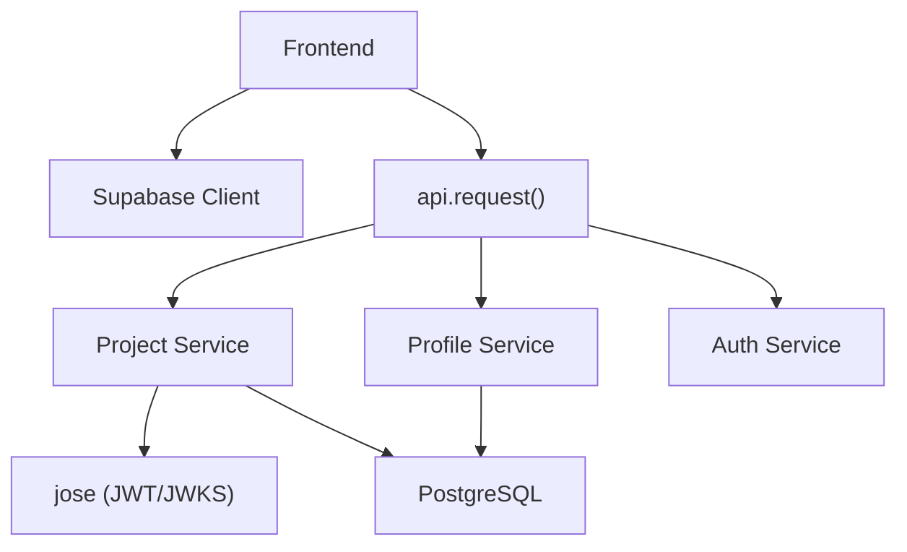

# Authentication & Authorization

<cite>
**Referenced Files in This Document**
- [auth.js](file://services/project-service/src/middleware/auth.js)
- [index.js](file://services/project-service/src/index.js)
- [openapi.yaml](file://services/project-service/docs/openapi.yaml)
- [supabase.ts](file://frontend/src/lib/supabase.ts)
- [AuthContext.tsx](file://frontend/src/context/AuthContext.tsx)
- [api.ts](file://frontend/src/lib/api.ts)
- [AuthCallback.tsx](file://frontend/src/pages/AuthCallback.tsx)
- [login.js](file://services/profile-service/src/functions/login.js)
- [login.js](file://services/profile-service/src/Routes/login.js)
- [index.js](file://services/auth-service/src/index.js)
</cite>

## Table of Contents

1. [Introduction](#introduction)
2. [Project Structure](#project-structure)
3. [Core Components](#core-components)
4. [Architecture Overview](#architecture-overview)
5. [Detailed Component Analysis](#detailed-component-analysis)
6. [Dependency Analysis](#dependency-analysis)
7. [Performance Considerations](#performance-considerations)
8. [Troubleshooting Guide](#troubleshooting-guide)
9. [Conclusion](#conclusion)

## Introduction

This document explains how Codacaine’s microservices authenticate and authorize requests using JWT tokens issued by Supabase Auth. It covers:

- How the frontend obtains and manages sessions via Supabase client-side authentication
- How services validate JWTs using Supabase’s JWKS endpoint
- How BearerAuth is defined and used across APIs
- How middleware protects endpoints and enforces authorization policies
- Examples of authenticated requests, token refresh behavior, and error handling for unauthorized access
- The project-service middleware that validates user permissions and ensures user provisioning

## Project Structure

The authentication flow spans the frontend and backend services:

- Frontend uses Supabase to sign in users and obtain access tokens
- Frontend attaches these tokens to API calls as Bearer tokens
- Backend services verify tokens against Supabase’s JWKS and enforce access control

**Diagram sources**

- [AuthContext.tsx:38-80](file://frontend/src/context/AuthContext.tsx#L38-L80)
- [api.ts:10-57](file://frontend/src/lib/api.ts#L10-L57)
- [auth.js:27-70](file://services/project-service/src/middleware/auth.js#L27-L70)
- [login.js:11-39](file://services/profile-service/src/functions/login.js#L11-L39)
- [index.js:50-57](file://services/auth-service/src/index.js#L50-L57)

**Section sources**

- [AuthContext.tsx:38-80](file://frontend/src/context/AuthContext.tsx#L38-L80)
- [api.ts:10-57](file://frontend/src/lib/api.ts#L10-L57)
- [auth.js:27-70](file://services/project-service/src/middleware/auth.js#L27-L70)
- [login.js:11-39](file://services/profile-service/src/functions/login.js#L11-L39)
- [index.js:50-57](file://services/auth-service/src/index.js#L50-L57)

## Core Components

- Supabase client initialization and session retrieval on the frontend
- Bearer token attachment to all service requests
- JWT verification with JWKS in project-service middleware
- User provisioning and existence checks in profile-service
- Public health endpoints in auth-service

Key responsibilities:

- Frontend: manage sessions, obtain access tokens, attach them to requests
- Project service: validate JWTs, ensure user row exists, protect routes
- Profile service: determine if a user exists or is soft-deleted
- Auth service: provide health checks without requiring authentication

**Section sources**

- [supabase.ts:1-34](file://frontend/src/lib/supabase.ts#L1-L34)
- [api.ts:10-57](file://frontend/src/lib/api.ts#L10-L57)
- [auth.js:27-70](file://services/project-service/src/middleware/auth.js#L27-L70)
- [login.js:11-39](file://services/profile-service/src/functions/login.js#L11-L39)
- [index.js:50-57](file://services/auth-service/src/index.js#L50-L57)

## Architecture Overview

End-to-end request flow from browser to protected service:

**Diagram sources**

- [AuthContext.tsx:82-120](file://frontend/src/context/AuthContext.tsx#L82-L120)
- [api.ts:18-37](file://frontend/src/lib/api.ts#L18-L37)
- [auth.js:27-70](file://services/project-service/src/middleware/auth.js#L27-L70)
- [index.js:85-93](file://services/project-service/src/index.js#L85-L93)

## Detailed Component Analysis

### JWT Acquisition and Session Management (Frontend)

- Supabase client is created from environment variables and validated
- AuthContext initializes session, listens for changes, and exposes sign-in/sign-out methods
- On OAuth or password sign-in, the session includes an access_token used for API calls
- Sign-out clears user cache and disconnects SSE streams

**Diagram sources**

- [supabase.ts:1-34](file://frontend/src/lib/supabase.ts#L1-L34)
- [AuthContext.tsx:38-80](file://frontend/src/context/AuthContext.tsx#L38-L80)
- [AuthCallback.tsx:49-127](file://frontend/src/pages/AuthCallback.tsx#L49-L127)

**Section sources**

- [supabase.ts:1-34](file://frontend/src/lib/supabase.ts#L1-L34)
- [AuthContext.tsx:38-80](file://frontend/src/context/AuthContext.tsx#L38-L80)
- [AuthCallback.tsx:49-127](file://frontend/src/pages/AuthCallback.tsx#L49-L127)

### Attaching Bearer Tokens to Requests

- The API client retrieves the current session and sets Authorization header when present
- All service calls use this helper to ensure consistent authentication

**Diagram sources**

- [api.ts:10-57](file://frontend/src/lib/api.ts#L10-L57)

**Section sources**

- [api.ts:10-57](file://frontend/src/lib/api.ts#L10-L57)

### JWT Verification and Authorization Enforcement (Project Service)

- requireAuth middleware extracts JWT from Authorization header or query parameter (for SSE)
- Verifies signature and claims using Supabase’s JWKS
- Ensures email presence and provisions user row if missing
- Attaches decoded payload and email to request context

**Diagram sources**

- [auth.js:27-70](file://services/project-service/src/middleware/auth.js#L27-L70)

**Section sources**

- [auth.js:27-70](file://services/project-service/src/middleware/auth.js#L27-L70)
- [index.js:85-93](file://services/project-service/src/index.js#L85-L93)

### Protected Routes and OpenAPI Security Scheme

- All /service routes are mounted under requireAuth middleware
- OpenAPI defines BearerAuth security scheme referencing Supabase JWT access tokens
- Health endpoint (/) is public; notification send-pending is explicitly public before requireAuth

**Diagram sources**

- [index.js:76-93](file://services/project-service/src/index.js#L76-L93)
- [openapi.yaml:36-45](file://services/project-service/docs/openapi.yaml#L36-L45)

**Section sources**

- [index.js:76-93](file://services/project-service/src/index.js#L76-L93)
- [openapi.yaml:36-45](file://services/project-service/docs/openapi.yaml#L36-L45)

### User Existence and Soft-Delete Handling (Profile Service)

- After sign-in callback, the frontend checks user existence and deletion status
- Profile service returns whether the user exists, is deleted, and deletion schedule
- Frontend redirects accordingly (dashboard, create-profile, or restore prompt)

**Diagram sources**

- [AuthCallback.tsx:11-37](file://frontend/src/pages/AuthCallback.tsx#L11-L37)
- [login.js:19-49](file://services/profile-service/src/Routes/login.js#L19-L49)
- [login.js:11-39](file://services/profile-service/src/functions/login.js#L11-L39)

**Section sources**

- [AuthCallback.tsx:11-37](file://frontend/src/pages/AuthCallback.tsx#L11-L37)
- [login.js:19-49](file://services/profile-service/src/Routes/login.js#L19-L49)
- [login.js:11-39](file://services/profile-service/src/functions/login.js#L11-L39)

### Token Refresh Mechanisms

- The frontend relies on Supabase client to manage session lifecycle and token refresh
- Access tokens are retrieved per request via getSession() and attached automatically
- No custom refresh logic is implemented in the API client; Supabase handles token renewal

**Section sources**

- [api.ts:18-37](file://frontend/src/lib/api.ts#L18-L37)
- [AuthContext.tsx:38-80](file://frontend/src/context/AuthContext.tsx#L38-L80)

### Error Handling for Unauthorized Access

- Missing or invalid tokens result in 401 responses with descriptive errors
- SSE connections accept tokens via query parameter due to EventSource limitations
- Global error handlers ensure CORS headers are set on error responses

**Diagram sources**

- [auth.js:27-70](file://services/project-service/src/middleware/auth.js#L27-L70)
- [index.js:94-103](file://services/project-service/src/index.js#L94-L103)

**Section sources**

- [auth.js:27-70](file://services/project-service/src/middleware/auth.js#L27-L70)
- [index.js:94-103](file://services/project-service/src/index.js#L94-L103)

## Dependency Analysis

- Frontend depends on Supabase client for authentication and session management
- Project service depends on jose library and Supabase JWKS for JWT verification
- Profile service depends on database pool to check user existence and deletion state
- Auth service provides health checks without authentication dependencies

**Diagram sources**

- [api.ts:10-57](file://frontend/src/lib/api.ts#L10-L57)
- [auth.js:1-2](file://services/project-service/src/middleware/auth.js#L1-L2)
- [login.js:9-39](file://services/profile-service/src/functions/login.js#L9-L39)
- [index.js:50-57](file://services/auth-service/src/index.js#L50-L57)

**Section sources**

- [api.ts:10-57](file://frontend/src/lib/api.ts#L10-L57)
- [auth.js:1-2](file://services/project-service/src/middleware/auth.js#L1-L2)
- [login.js:9-39](file://services/profile-service/src/functions/login.js#L9-L39)
- [index.js:50-57](file://services/auth-service/src/index.js#L50-L57)

## Performance Considerations

- JWKS fetching and caching are handled by jose; key rotation is automatic without service restarts
- JWT verification is fast and stateless; avoid unnecessary re-fetching by relying on jose’s caching
- SSE connections pass tokens via query parameters to accommodate EventSource constraints
- Keep payloads minimal and leverage timeouts in the API client to prevent long-running requests

[No sources needed since this section provides general guidance]

## Troubleshooting Guide

Common issues and resolutions:

- 401 Unauthorized: missing access token
  - Ensure the frontend has a valid session and attaches Authorization header
  - For SSE, include ?token=<JWT> in the URL
- 401 Unauthorized: invalid access token
  - Token may be expired or tampered; refresh session via Supabase client
- 401 Unauthorized: token does not contain email
  - Token payload must include email; verify Supabase configuration and claims
- CORS errors
  - Confirm origin is allowed in service CORS settings
  - Check global error handler sets correct headers on errors

**Section sources**

- [auth.js:27-70](file://services/project-service/src/middleware/auth.js#L27-L70)
- [index.js:94-103](file://services/project-service/src/index.js#L94-L103)

## Conclusion

Codacaine’s authentication and authorization rely on Supabase Auth for identity and JWT issuance, with each backend service independently verifying tokens via JWKS. The project-service middleware enforces access control, ensures user provisioning, and supports both header-based and query-parameter-based authentication for SSE. The frontend manages sessions and attaches Bearer tokens consistently, while profile and auth services support user lifecycle and health checks. This design provides secure, scalable, and maintainable cross-service authorization.

[No sources needed since this section summarizes without analyzing specific files]
