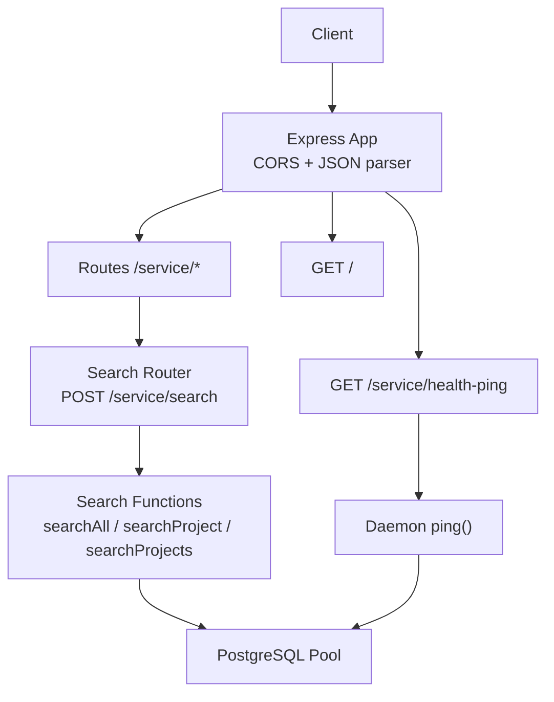
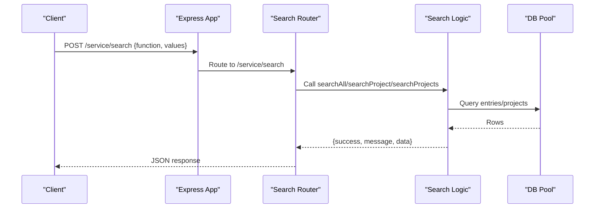
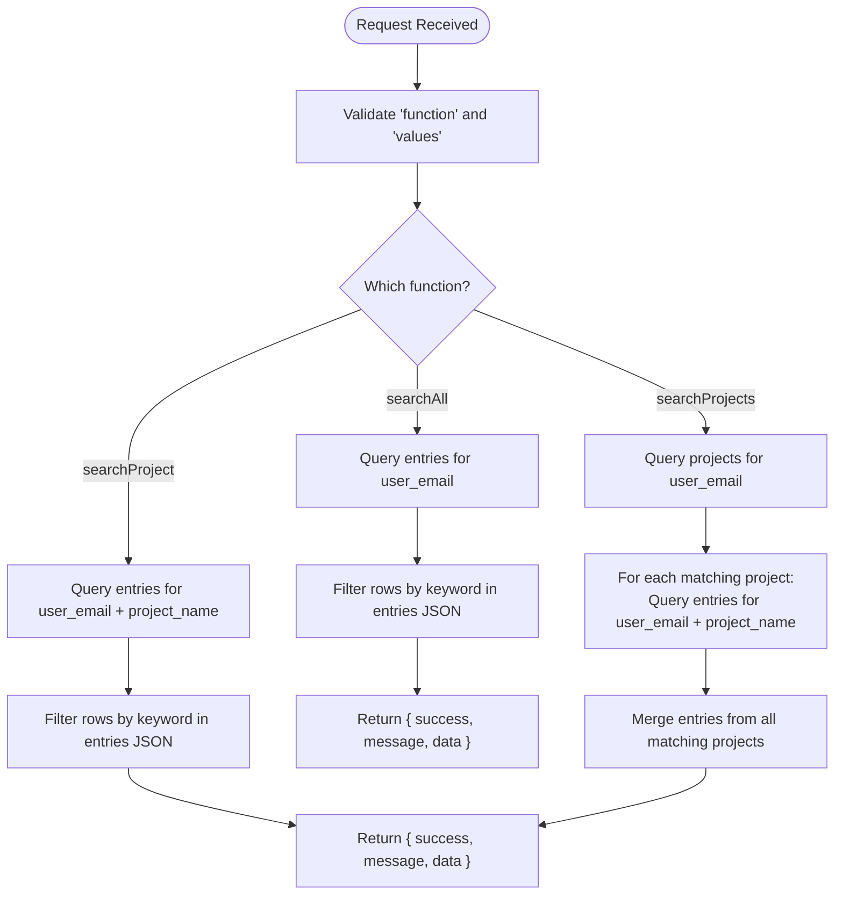
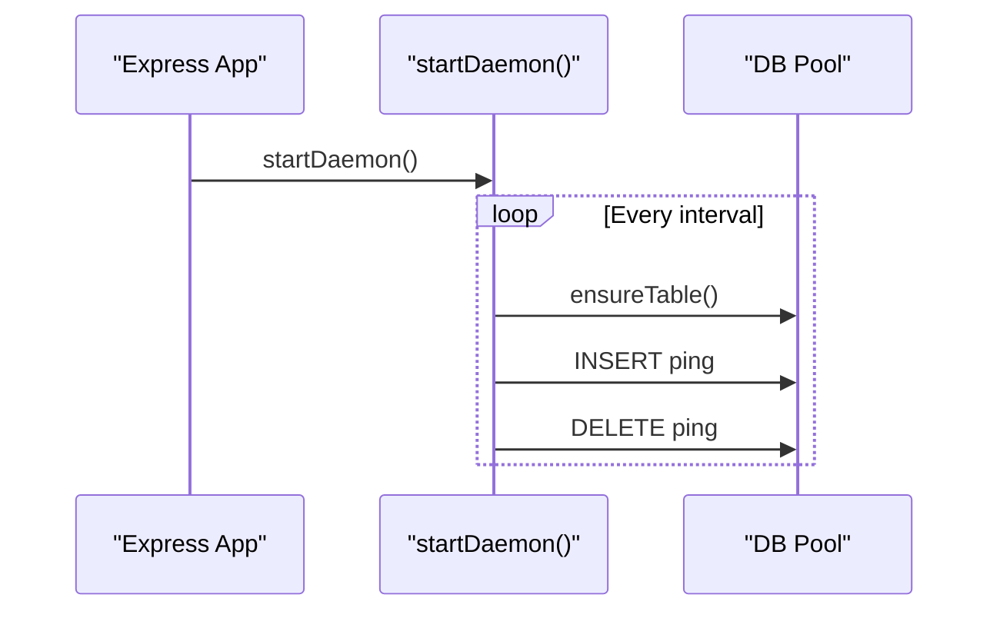
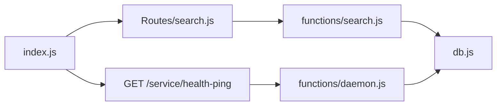

# Dashboard Service API

<cite>
**Referenced Files in This Document**
- [index.js](file://services/dashboard-service/src/index.js)
- [search.js](file://services/dashboard-service/src/Routes/search.js)
- [search.js](file://services/dashboard-service/src/functions/search.js)
- [daemon.js](file://services/dashboard-service/src/functions/daemon.js)
- [db.js](file://services/dashboard-service/src/db.js)
- [config.js](file://services/dashboard-service/src/config.js)
- [package.json](file://services/dashboard-service/package.json)
</cite>

## Table of Contents

1. [Introduction](#introduction)
2. [Project Structure](#project-structure)
3. [Core Components](#core-components)
4. [Architecture Overview](#architecture-overview)
5. [Detailed Component Analysis](#detailed-component-analysis)
6. [Dependency Analysis](#dependency-analysis)
7. [Performance Considerations](#performance-considerations)
8. [Troubleshooting Guide](#troubleshooting-guide)
9. [Conclusion](#conclusion)
10. [Appendices](#appendices)

## Introduction

The Dashboard Service (port 5002) provides cross-project search and health monitoring for the application. It exposes:

- A unified search endpoint that queries entries across a user’s projects, with project-scoped variants.
- A health-ping endpoint used by CI to keep the service and database warm.

It is an Express-based Node.js service that connects to a PostgreSQL-compatible database via a connection pool and runs a background daemon to periodically ping the database.

## Project Structure

The service is organized into clear layers:

- Application bootstrap and middleware configuration
- Route definitions
- Business logic functions
- Database connection management
- Background daemon for health pings

**Diagram sources**

- [index.js:1-87](file://services/dashboard-service/src/index.js#L1-L87)
- [search.js:1-61](file://services/dashboard-service/src/Routes/search.js#L1-L61)
- [search.js:1-78](file://services/dashboard-service/src/functions/search.js#L1-L78)
- [daemon.js:1-135](file://services/dashboard-service/src/functions/daemon.js#L1-L135)
- [db.js:1-32](file://services/dashboard-service/src/db.js#L1-L32)

**Section sources**

- [index.js:1-87](file://services/dashboard-service/src/index.js#L1-L87)
- [package.json:1-43](file://services/dashboard-service/package.json#L1-L43)

## Core Components

- Express app with CORS and JSON parsing, global error handling, and route mounting under /service.
- Search router that dispatches to three search operations based on a function field in the request body.
- Search functions that query the database and filter results client-side.
- Health-ping endpoint that triggers a lightweight database ping via a daemon helper.
- Database module that initializes a PostgreSQL connection pool and verifies connectivity at startup.

Key responsibilities:

- Input validation and routing in the search router.
- Data retrieval and filtering in search functions.
- Service liveness and database availability checks via health-ping.

**Section sources**

- [index.js:1-87](file://services/dashboard-service/src/index.js#L1-L87)
- [search.js:1-61](file://services/dashboard-service/src/Routes/search.js#L1-L61)
- [search.js:1-78](file://services/dashboard-service/src/functions/search.js#L1-L78)
- [daemon.js:1-135](file://services/dashboard-service/src/functions/daemon.js#L1-L135)
- [db.js:1-32](file://services/dashboard-service/src/db.js#L1-L32)

## Architecture Overview

The service follows a simple request-response architecture with a background task:

**Diagram sources**

- [index.js:1-87](file://services/dashboard-service/src/index.js#L1-L87)
- [search.js:1-61](file://services/dashboard-service/src/Routes/search.js#L1-L61)
- [search.js:1-78](file://services/dashboard-service/src/functions/search.js#L1-L78)
- [db.js:1-32](file://services/dashboard-service/src/db.js#L1-L32)

## Detailed Component Analysis

### Search API

- Endpoint: POST /service/search
- Content-Type: application/json
- Request body fields:
  - function: string — one of "searchAll", "searchProject", "searchProjects"
  - values: object — parameters vary by function
    - For "searchAll":
      - user_email: string — required
      - keyword: string — optional; if omitted or empty, returns all non-deleted entries for the user
    - For "searchProject":
      - user_email: string — required
      - project_name: string — required
      - keyword: string — optional; if omitted or empty, returns all non-deleted entries for the project
    - For "searchProjects":
      - user_email: string — required
      - keyword: string — optional; if omitted or empty, returns entries from all non-deleted projects for the user
- Behavior:
  - Filters out deleted entries using a database condition.
  - Performs case-insensitive substring matching on entry content or project names.
  - Returns a consistent envelope: { success, message, data }.
- Error handling:
  - Missing function or required parameters return 400 with an error message.
  - Internal errors return 500 with details.

Example requests:

- Cross-project search:
  - POST /service/search
  - Body: { "function": "searchAll", "values": { "user_email": "user@example.com", "keyword": "login" } }
- Project-scoped search:
  - POST /service/search
  - Body: { "function": "searchProject", "values": { "user_email": "user@example.com", "project_name": "Alpha", "keyword": "task" } }
- Multi-project search:
  - POST /service/search
  - Body: { "function": "searchProjects", "values": { "user_email": "user@example.com", "keyword": "project" } }

Response structure:

- Success:
  - { "success": true, "message": "Entries retrieved successfully", "data": [...] }
- Failure:
  - { "success": false, "message": "<error>" }

Notes:

- The service filters results in memory after fetching rows. For large datasets, consider pagination or server-side full-text search to reduce payload size and improve performance.

**Section sources**

- [search.js:1-61](file://services/dashboard-service/src/Routes/search.js#L1-L61)
- [search.js:1-78](file://services/dashboard-service/src/functions/search.js#L1-L78)

#### Search Flow (Algorithm)

**Diagram sources**

- [search.js:1-78](file://services/dashboard-service/src/functions/search.js#L1-L78)

### Health-Ping API

- Endpoint: GET /service/health-ping
- Purpose:
  - Wakes the Render instance.
  - Pings Supabase to prevent database pause.
- Behavior:
  - Ensures the health_ping table exists.
  - Inserts a row with a fixed message and timestamp.
  - Immediately deletes the inserted row.
  - Returns status ok when successful, degraded when the database is unavailable, and error for unexpected failures.
- Response examples:
  - Success: { "status": "ok", "success": true, "id": <number>, "message": "hello hlulani", "pinged_at": "<timestamp>" }
  - Degraded: { "status": "degraded", "success": false, "reason": "<reason>" }
  - Error: { "status": "error", "reason": "<message>" }

**Section sources**

- [index.js:54-67](file://services/dashboard-service/src/index.js#L54-L67)
- [daemon.js:26-71](file://services/dashboard-service/src/functions/daemon.js#L26-L71)

### Background Daemon

- Runs a periodic task to keep the database active.
- Default interval: every 12 hours (configurable via environment variable).
- Operations per cycle:
  - Ensure health_ping table exists.
  - Insert a ping row.
  - Delete the row immediately.
- Provides helpers to start, stop, check running state, and read configuration.

**Diagram sources**

- [index.js:80-84](file://services/dashboard-service/src/index.js#L80-L84)
- [daemon.js:73-135](file://services/dashboard-service/src/functions/daemon.js#L73-L135)

**Section sources**

- [daemon.js:1-135](file://services/dashboard-service/src/functions/daemon.js#L1-L135)

### Database Connection

- Initializes a PostgreSQL connection pool using DATABASE_URL.
- Verifies connectivity at startup and logs success/failure.
- If DATABASE_URL is missing, warns but allows startup; subsequent DB calls will fail gracefully.

**Section sources**

- [db.js:1-32](file://services/dashboard-service/src/db.js#L1-L32)

## Dependency Analysis

- Express app depends on:
  - CORS middleware for cross-origin requests.
  - JSON body parser.
  - Search routes mounted under /service.
  - Health-ping route bound to daemon.ping().
- Search routes depend on:
  - Search class methods for business logic.
- Search functions depend on:
  - PostgreSQL connection pool for queries.
- Daemon depends on:
  - PostgreSQL connection pool for periodic maintenance.

**Diagram sources**

- [index.js:1-87](file://services/dashboard-service/src/index.js#L1-L87)
- [search.js:1-61](file://services/dashboard-service/src/Routes/search.js#L1-L61)
- [search.js:1-78](file://services/dashboard-service/src/functions/search.js#L1-L78)
- [daemon.js:1-135](file://services/dashboard-service/src/functions/daemon.js#L1-L135)
- [db.js:1-32](file://services/dashboard-service/src/db.js#L1-L32)

**Section sources**

- [index.js:1-87](file://services/dashboard-service/src/index.js#L1-L87)
- [search.js:1-61](file://services/dashboard-service/src/Routes/search.js#L1-L61)
- [search.js:1-78](file://services/dashboard-service/src/functions/search.js#L1-L78)
- [daemon.js:1-135](file://services/dashboard-service/src/functions/daemon.js#L1-L135)
- [db.js:1-32](file://services/dashboard-service/src/db.js#L1-L32)

## Performance Considerations

Current implementation characteristics:

- In-memory filtering: Results are filtered after fetching rows from the database. This can be inefficient for large datasets because it transfers more data than necessary and performs client-side substring matching.
- No built-in rate limiting: The service does not implement request throttling or quotas.
- No caching layer: Responses are generated per request without caching.

Recommendations for large-scale queries:

- Server-side search:
  - Use full-text search indexes on relevant columns to avoid scanning entire tables and to enable efficient substring matching.
  - Add pagination and limit clauses to reduce payload sizes.
- Rate limiting:
  - Introduce a rate limiter to protect against abuse and manage load spikes.
- Caching strategies:
  - Cache frequent search results keyed by user_email, project_name, and normalized keyword with appropriate TTLs.
  - Invalidate caches on write operations to maintain consistency.
- Query optimization:
  - Select only needed fields instead of SELECT *.
  - Leverage database-level filtering where possible before returning results.
- Monitoring:
  - Track query latency and error rates to identify bottlenecks.
  - Use structured logging for observability.

[No sources needed since this section provides general guidance]

## Troubleshooting Guide

Common issues and resolutions:

- Missing DATABASE_URL:
  - The service starts but database calls will fail. Ensure DATABASE_URL is set in the environment.
- Database connection failure:
  - Startup logs indicate pool connection failures. Verify network access, credentials, and SSL settings.
- Health-ping degraded:
  - Indicates the database pool is unavailable or the ping operation failed. Check database connectivity and permissions.
- Search returns empty results:
  - Verify user_email and project_name correctness.
  - Confirm entries exist and are not marked as deleted.
  - Check keyword casing and presence within entries JSON.

Operational notes:

- Global error handler ensures CORS headers are included on error responses for allowed origins.
- The daemon runs independently and does not block request processing.

**Section sources**

- [db.js:5-7](file://services/dashboard-service/src/db.js#L5-L7)
- [db.js:24-29](file://services/dashboard-service/src/db.js#L24-L29)
- [index.js:69-78](file://services/dashboard-service/src/index.js#L69-L78)
- [daemon.js:45-71](file://services/dashboard-service/src/functions/daemon.js#L45-L71)

## Conclusion

The Dashboard Service offers a straightforward API for cross-project search and health monitoring. While effective for small to medium datasets, scaling considerations include implementing server-side search, pagination, rate limiting, and caching to optimize performance and reliability under load.

[No sources needed since this section summarizes without analyzing specific files]

## Appendices

### Environment Variables

- PORT: Service port (default 5002)
- DATABASE_URL: PostgreSQL connection string
- PING_INTERVAL_MS: Daemon ping interval in milliseconds (default 12 hours)

**Section sources**

- [index.js:10](file://services/dashboard-service/src/index.js#L10)
- [db.js:5-17](file://services/dashboard-service/src/db.js#L5-L17)
- [daemon.js:19-21](file://services/dashboard-service/src/functions/daemon.js#L19-L21)
- [daemon.js:77-79](file://services/dashboard-service/src/functions/daemon.js#L77-L79)

### CORS Configuration

- Allowed origins include production domains and local development addresses.
- Credentials are enabled for cross-origin requests.
- Preflight requests are handled explicitly for Express 5 compatibility.

**Section sources**

- [index.js:12-44](file://services/dashboard-service/src/index.js#L12-L44)
