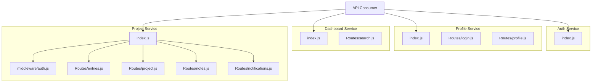
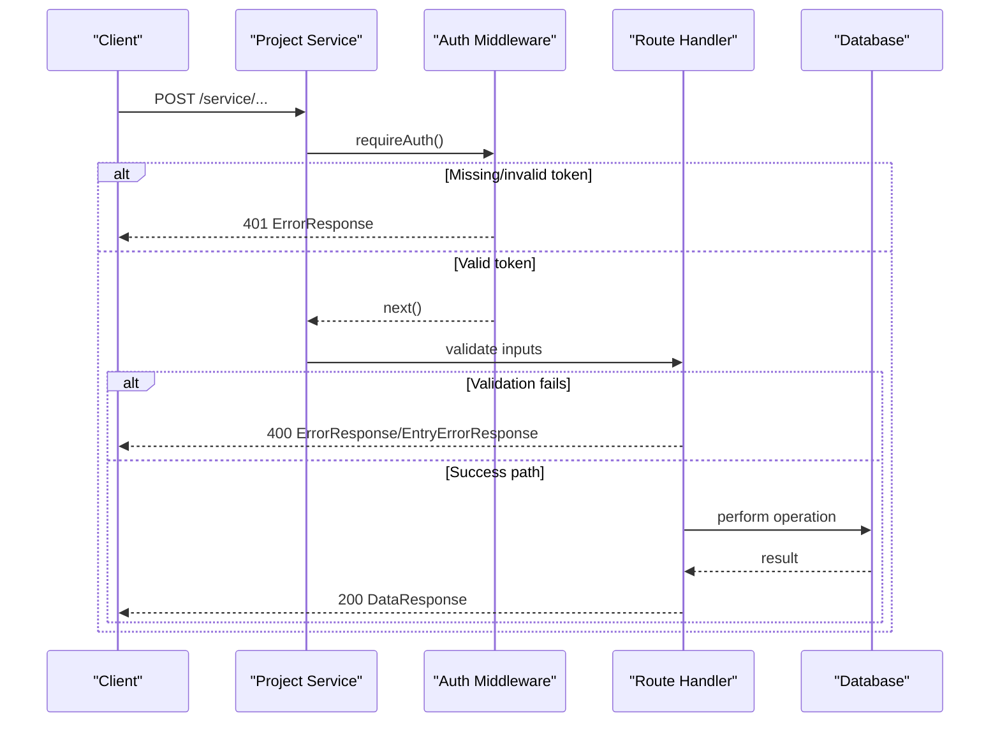
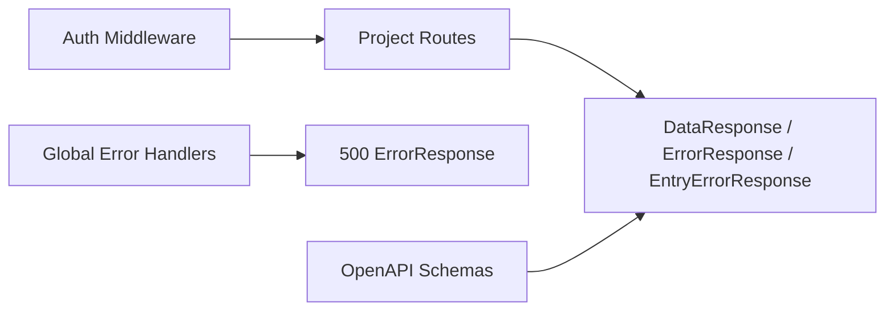

# Error Handling & Status Codes

<cite>
**Referenced Files in This Document**
- [services/auth-service/src/index.js](file://services/auth-service/src/index.js)
- [services/profile-service/src/index.js](file://services/profile-service/src/index.js)
- [services/dashboard-service/src/index.js](file://services/dashboard-service/src/index.js)
- [services/project-service/src/index.js](file://services/project-service/src/index.js)
- [services/project-service/src/middleware/auth.js](file://services/project-service/src/middleware/auth.js)
- [services/project-service/src/Routes/entries.js](file://services/project-service/src/Routes/entries.js)
- [services/project-service/src/Routes/project.js](file://services/project-service/src/Routes/project.js)
- [services/project-service/src/Routes/notes.js](file://services/project-service/src/Routes/notes.js)
- [services/project-service/src/Routes/notifications.js](file://services/project-service/src/Routes/notifications.js)
- [services/profile-service/src/Routes/login.js](file://services/profile-service/src/Routes/login.js)
- [services/profile-service/src/Routes/profile.js](file://services/profile-service/src/Routes/profile.js)
- [services/dashboard-service/src/Routes/search.js](file://services/dashboard-service/src/Routes/search.js)
- [services/project-service/docs/openapi.yaml](file://services/project-service/docs/openapi.yaml)
</cite>

## Table of Contents

1. Introduction
2. Project Structure
3. Core Components
4. Architecture Overview
5. Detailed Component Analysis
6. Dependency Analysis
7. Performance Considerations
8. Troubleshooting Guide
9. Conclusion

## Introduction

This document defines the standardized error handling and status code behavior across all Codacaine microservices. It covers:

- Standardized response schemas: ErrorResponse, EntryErrorResponse, DataResponse
- HTTP status codes (200, 400, 401, 500) and their meanings per service
- Common error scenarios: validation failures, authentication errors, internal server errors
- Error propagation patterns, logging strategies, and debugging approaches for API consumers

The project uses an RPC-style dispatch pattern on POST endpoints with a { function, values } body to call specific operations. Authentication is enforced via JWT middleware where applicable.

## Project Structure

Each microservice exposes Express routes with consistent global error handlers that ensure CORS headers are present even on errors. The Project Service centralizes authentication via middleware; other services handle errors locally or rely on route-level try/catch blocks.

**Diagram sources**

- [services/auth-service/src/index.js:39-82](file://services/auth-service/src/index.js#L39-L82)
- [services/profile-service/src/index.js:9-77](file://services/profile-service/src/index.js#L9-L77)
- [services/dashboard-service/src/index.js:9-87](file://services/dashboard-service/src/index.js#L9-L87)
- [services/project-service/src/index.js:23-108](file://services/project-service/src/index.js#L23-L108)
- [services/project-service/src/middleware/auth.js:27-71](file://services/project-service/src/middleware/auth.js#L27-L71)

**Section sources**

- [services/auth-service/src/index.js:39-82](file://services/auth-service/src/index.js#L39-L82)
- [services/profile-service/src/index.js:9-77](file://services/profile-service/src/index.js#L9-L77)
- [services/dashboard-service/src/index.js:9-87](file://services/dashboard-service/src/index.js#L9-L87)
- [services/project-service/src/index.js:23-108](file://services/project-service/src/index.js#L23-L108)

## Core Components

Standardized response schemas are defined in the OpenAPI specification and used consistently by routes:

- ErrorResponse: { error, details? }
- EntryErrorResponse: { success, error, message? }
- DataResponse: { success, data }

These schemas appear in responses for 200, 400, 401, and 500 across endpoints.

**Section sources**

- [services/project-service/docs/openapi.yaml:47-86](file://services/project-service/docs/openapi.yaml#L47-L86)

## Architecture Overview

Error handling follows a layered approach:

- Route-level validation returns 400 with ErrorResponse or EntryErrorResponse when inputs are invalid.
- Middleware enforces authentication and returns 401 when tokens are missing or invalid.
- Global error handlers catch unhandled exceptions and return 500 with ErrorResponse.
- Some endpoints use SSE to push real-time errors to clients before completing the request cycle.

**Diagram sources**

- [services/project-service/src/middleware/auth.js:27-71](file://services/project-service/src/middleware/auth.js#L27-L71)
- [services/project-service/src/Routes/entries.js:23-191](file://services/project-service/src/Routes/entries.js#L23-L191)
- [services/project-service/src/Routes/project.js:20-99](file://services/project-service/src/Routes/project.js#L20-L99)

## Detailed Component Analysis

### Auth Service

- Health endpoint returns a healthy status.
- Global error handler logs unhandled errors and responds with 500 and ErrorResponse.
- CORS headers are set on error responses for allowed origins.

Common statuses:

- 200: health check success
- 500: unhandled exception

Example error response shape:

- { error: "Internal server error", message: "<err.message>" }

**Section sources**

- [services/auth-service/src/index.js:39-82](file://services/auth-service/src/index.js#L39-L82)

### Profile Service

- Routes validate required fields and return 400 with ErrorResponse when missing.
- Unhandled exceptions return 500 with ErrorResponse.
- Global error handler ensures CORS headers on errors.

Common statuses:

- 200: successful profile operation
- 400: missing parameters or invalid function
- 500: internal server error

Example error response shapes:

- { error: "Function not provided" }
- { error: "Missing required parameters" }
- { error: "Internal Server Error", details: "<error.message>" }

**Section sources**

- [services/profile-service/src/Routes/login.js:19-52](file://services/profile-service/src/Routes/login.js#L19-L52)
- [services/profile-service/src/Routes/profile.js:31-107](file://services/profile-service/src/Routes/profile.js#L31-L107)
- [services/profile-service/src/index.js:57-77](file://services/profile-service/src/index.js#L57-L77)

### Dashboard Service

- Search routes validate inputs and return 400 with ErrorResponse for missing parameters.
- Health-ping endpoint returns 503 when degraded and 500 on unexpected errors.
- Global error handler ensures CORS headers on errors.

Common statuses:

- 200: search results
- 400: missing parameters or invalid function
- 503: degraded health
- 500: internal server error

Example error response shapes:

- { error: "Function not provided" }
- { error: "Missing user_email" }
- { status: "degraded", ... }
- { status: "error", reason: "<err.message>" }

**Section sources**

- [services/dashboard-service/src/Routes/search.js:19-61](file://services/dashboard-service/src/Routes/search.js#L19-L61)
- [services/dashboard-service/src/index.js:54-87](file://services/dashboard-service/src/index.js#L54-L87)

### Project Service

Authentication and error handling:

- requireAuth middleware validates JWT and returns 401 with ErrorResponse if missing or invalid.
- Routes validate inputs and return 400 with ErrorResponse or EntryErrorResponse.
- Global error handler catches unhandled exceptions and returns 500 with ErrorResponse.
- Natural language entry endpoint pushes errors via SSE before responding.

Common statuses:

- 200: successful operation returning DataResponse
- 400: validation failure or invalid function
- 401: unauthorized (missing/invalid JWT)
- 500: internal server error

Example error response shapes:

- { error: "Unauthorized: missing access token" }
- { error: "Unauthorized: invalid access token" }
- { error: "Function not provided" }
- { error: "Missing required parameters" }
- { success: false, error: "Natural language handler uninitialized" }
- { success: false, error: "<error.message>" }

SSE error flow for natural language entries:

- On parsing errors, the route sends an SSE event with error details and then responds with 500.

**Section sources**

- [services/project-service/src/middleware/auth.js:27-71](file://services/project-service/src/middleware/auth.js#L27-L71)
- [services/project-service/src/Routes/entries.js:23-328](file://services/project-service/src/Routes/entries.js#L23-L328)
- [services/project-service/src/Routes/project.js:20-99](file://services/project-service/src/Routes/project.js#L20-L99)
- [services/project-service/src/Routes/notes.js:20-92](file://services/project-service/src/Routes/notes.js#L20-L92)
- [services/project-service/src/Routes/notifications.js:20-98](file://services/project-service/src/Routes/notifications.js#L20-L98)
- [services/project-service/src/index.js:94-108](file://services/project-service/src/index.js#L94-L108)

### Notes and Notifications Endpoints

- Notes: validates required fields and returns 400 with ErrorResponse; unknown functions return 400.
- Notifications: validates required fields; markRead returns 404 when not found; sendPending is public and returns 500 on failure.

Common statuses:

- 200: successful operation
- 400: missing parameters or unknown function
- 404: resource not found (e.g., notification id)
- 500: internal server error

**Section sources**

- [services/project-service/src/Routes/notes.js:20-92](file://services/project-service/src/Routes/notes.js#L20-L92)
- [services/project-service/src/Routes/notifications.js:20-98](file://services/project-service/src/Routes/notifications.js#L20-L98)

## Dependency Analysis

Error handling dependencies:

- Project Service routes depend on requireAuth middleware for 401 handling.
- All services implement global error handlers to standardize 500 responses and ensure CORS headers.
- OpenAPI schemas define consistent response structures consumed by clients.

**Diagram sources**

- [services/project-service/src/middleware/auth.js:27-71](file://services/project-service/src/middleware/auth.js#L27-L71)
- [services/project-service/docs/openapi.yaml:47-86](file://services/project-service/docs/openapi.yaml#L47-L86)
- [services/project-service/src/index.js:94-108](file://services/project-service/src/index.js#L94-L108)

**Section sources**

- [services/project-service/src/middleware/auth.js:27-71](file://services/project-service/src/middleware/auth.js#L27-L71)
- [services/project-service/docs/openapi.yaml:47-86](file://services/project-service/docs/openapi.yaml#L47-L86)

## Performance Considerations

- Use minimal error payloads to reduce bandwidth; include only necessary fields (error, message/details).
- Avoid logging sensitive data in error messages; log full stack traces server-side only.
- For high-throughput services, prefer structured logging and centralized error aggregation.
- SSE-based error delivery reduces perceived latency for long-running operations like natural language parsing.

[No sources needed since this section provides general guidance]

## Troubleshooting Guide

Common scenarios and how to interpret responses:

- Validation failures (400):
  - Missing function or values: { error: "Function not provided" }
  - Missing required parameters: { error: "Missing required parameters" }
  - Invalid function name: { error: "Invalid function" }

- Authentication errors (401):
  - Missing token: { error: "Unauthorized: missing access token" }
  - Invalid token: { error: "Unauthorized: invalid access token" }
  - Token without email: { error: "Unauthorized: token does not contain email" }

- Internal server errors (500):
  - Unhandled exceptions: { error: "Internal server error", message: "<err.message>" }
  - Service uninitialized: { success: false, error: "<Service> service uninitialized" }

- Health and degraded states:
  - Health ping degraded: { status: "degraded", ... }
  - Health ping error: { status: "error", reason: "<err.message>" }

Debugging tips:

- Check CORS headers on error responses; they are added by global error handlers for allowed origins.
- Inspect server logs for "Unhandled error" messages to identify root causes.
- For natural language entry errors, watch SSE events for early error signals before the final response.

**Section sources**

- [services/auth-service/src/index.js:61-82](file://services/auth-service/src/index.js#L61-L82)
- [services/profile-service/src/index.js:57-77](file://services/profile-service/src/index.js#L57-L77)
- [services/dashboard-service/src/index.js:69-87](file://services/dashboard-service/src/index.js#L69-L87)
- [services/project-service/src/index.js:94-108](file://services/project-service/src/index.js#L94-L108)
- [services/project-service/src/middleware/auth.js:27-71](file://services/project-service/src/middleware/auth.js#L27-L71)
- [services/project-service/src/Routes/entries.js:243-328](file://services/project-service/src/Routes/entries.js#L243-L328)

## Conclusion

Codacaine microservices follow a consistent error handling strategy:

- Validate inputs at route boundaries and return 400 with standardized error schemas.
- Enforce authentication centrally and return 401 for missing or invalid tokens.
- Catch unhandled exceptions globally and return 500 with ErrorResponse while ensuring CORS headers.
- Use SSE for real-time error signaling in long-running flows.
  Consumers should rely on the documented schemas (ErrorResponse, EntryErrorResponse, DataResponse) and HTTP status codes to handle errors robustly across all services.

[No sources needed since this section summarizes without analyzing specific files]
