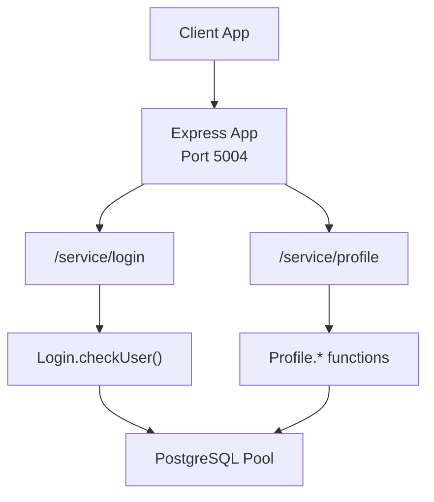
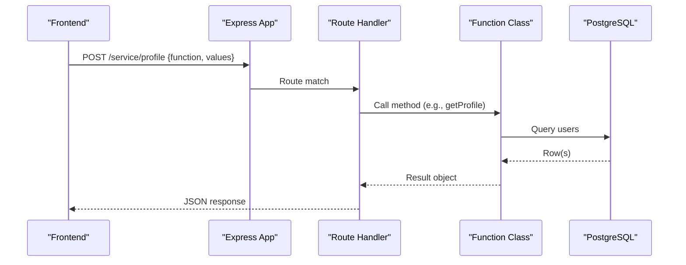
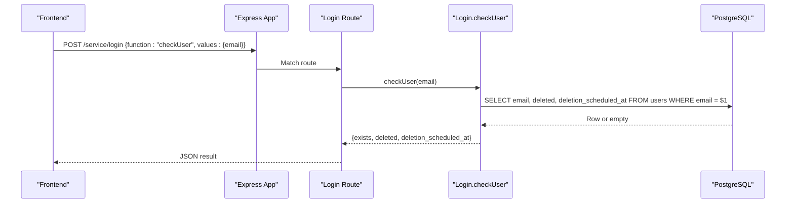
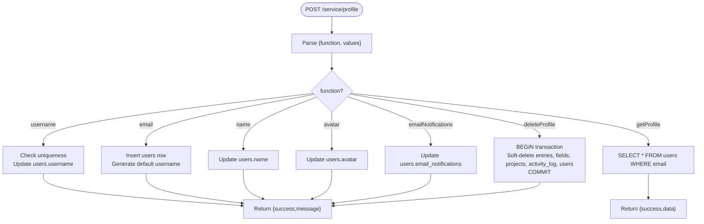
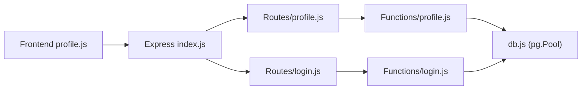

# Profile Service API

<cite>
**Referenced Files in This Document**
- [index.js](file://services/profile-service/src/index.js)
- [config.js](file://services/profile-service/src/config.js)
- [db.js](file://services/profile-service/src/db.js)
- [login.js](file://services/profile-service/src/Routes/login.js)
- [profile.js](file://services/profile-service/src/Routes/profile.js)
- [login.js](file://services/profile-service/src/functions/login.js)
- [profile.js](file://services/profile-service/src/functions/profile.js)
- [000_baseline_full_schema.sql](file://supabase/migrations/000_baseline_full_schema.sql)
- [login.js](file://frontend/src/functions/profile/login.js)
- [profile.js](file://frontend/src/functions/profile/profile.js)
</cite>

## Table of Contents

1. Introduction
2. Project Structure
3. Core Components
4. Architecture Overview
5. Detailed Component Analysis
6. Dependency Analysis
7. Performance Considerations
8. Troubleshooting Guide
9. Conclusion

## Introduction

The Profile Service (port 5004) manages user profiles, avatars, and preferences. It exposes a compact JSON-RPC-style API over HTTP for:

- User existence checks during login flows
- Creating or updating profile fields (username, name, avatar)
- Reading and deleting profiles
- Persisting email notification preferences

Authentication is integrated with Supabase via database triggers and shared schema; the service itself does not implement token validation but relies on callers to enforce authorization at higher layers.

## Project Structure

The service is an Express application that mounts two route modules under a common base path:

- /service/login — login-related operations
- /service/profile — profile CRUD and preferences

**Diagram sources**

- [index.js:1-77](file://services/profile-service/src/index.js#L1-L77)
- [login.js:1-52](file://services/profile-service/src/Routes/login.js#L1-L52)
- [profile.js:1-107](file://services/profile-service/src/Routes/profile.js#L1-L107)
- [login.js:1-40](file://services/profile-service/src/functions/login.js#L1-L40)
- [profile.js:1-208](file://services/profile-service/src/functions/profile.js#L1-L208)
- [db.js:1-32](file://services/profile-service/src/db.js#L1-L32)

**Section sources**

- [index.js:1-77](file://services/profile-service/src/index.js#L1-L77)
- [config.js:1-4](file://services/profile-service/src/config.js#L1-L4)

## Core Components

- Express app with CORS and global error handling
- Route handlers dispatching by a function field in the request body
- Function classes encapsulating business logic and database access
- PostgreSQL connection pool configured for Supabase-hosted databases

Key responsibilities:

- Validate inputs and delegate to function classes
- Return consistent JSON responses with success/error semantics
- Ensure safe preflight handling and CORS headers even on errors

**Section sources**

- [index.js:1-77](file://services/profile-service/src/index.js#L1-L77)
- [db.js:1-32](file://services/profile-service/src/db.js#L1-L32)

## Architecture Overview

The service uses a simple layered design:

- Routes parse requests and call function classes
- Function classes perform SQL queries against the shared users table and related tables
- The database schema enforces constraints and supports soft deletes and lifecycle management

**Diagram sources**

- [profile.js:1-107](file://services/profile-service/src/Routes/profile.js#L1-L107)
- [profile.js:131-154](file://services/profile-service/src/functions/profile.js#L131-L154)
- [db.js:1-32](file://services/profile-service/src/db.js#L1-L32)

## Detailed Component Analysis

### Authentication Integration and Login Flow

- Endpoint: POST /service/login
- Purpose: Check whether a user exists and if they are currently soft-deleted
- Request body:
  - function: string — must be "checkUser"
  - values: object — must include email
- Response:
  - exists: boolean
  - deleted: boolean
  - deletion_scheduled_at: string|null (ISO timestamp when deletion was scheduled)

Behavior:

- Validates presence of function and email
- Queries users table for email and status
- Returns existence and deletion state for frontend routing decisions

**Diagram sources**

- [login.js:1-52](file://services/profile-service/src/Routes/login.js#L1-L52)
- [login.js:1-40](file://services/profile-service/src/functions/login.js#L1-L40)
- [000_baseline_full_schema.sql:29-37](file://supabase/migrations/000_baseline_full_schema.sql#L29-L37)

**Section sources**

- [login.js:1-52](file://services/profile-service/src/Routes/login.js#L1-L52)
- [login.js:1-40](file://services/profile-service/src/functions/login.js#L1-L40)
- [000_baseline_full_schema.sql:29-37](file://supabase/migrations/000_baseline_full_schema.sql#L29-L37)

### Profile CRUD and Preferences

All profile operations are exposed via a single endpoint:

- Endpoint: POST /service/profile
- Request body:
  - function: string — one of: username, email, name, avatar, getProfile, emailNotifications, deleteProfile
  - values: object — varies per function

Supported functions:

- username
  - Purpose: Update username if available
  - Required values: email, username
  - Behavior: Checks uniqueness, updates users.username
  - Response: { success, message }
- email
  - Purpose: Create a new user row during sign-up
  - Required values: email
  - Behavior: Inserts users with default username derived from email prefix
  - Response: { success, message }
- name
  - Purpose: Update display name
  - Required values: email, new_name
  - Behavior: Updates users.name
  - Response: { success, message }
- avatar
  - Purpose: Update avatar URL
  - Required values: email, url
  - Behavior: Updates users.avatar
  - Response: { success, message }
- getProfile
  - Purpose: Read full profile
  - Required values: email
  - Behavior: Selects all columns from users for the given email
  - Response: { success, data } where data is the user row
- emailNotifications
  - Purpose: Persist email notification preference
  - Required values: email, enabled (boolean)
  - Behavior: Updates users.email_notifications
  - Response: { success, message }
- deleteProfile
  - Purpose: Soft-delete user and related data
  - Required values: email
  - Behavior: In a transaction, marks entries, fields, projects, activity_log, and users as deleted
  - Response: { success, message }

**Diagram sources**

- [profile.js:1-107](file://services/profile-service/src/Routes/profile.js#L1-L107)
- [profile.js:1-208](file://services/profile-service/src/functions/profile.js#L1-L208)
- [000_baseline_full_schema.sql:29-37](file://supabase/migrations/000_baseline_full_schema.sql#L29-L37)
- [000_baseline_full_schema.sql:69-119](file://supabase/migrations/000_baseline_full_schema.sql#L69-L119)

**Section sources**

- [profile.js:1-107](file://services/profile-service/src/Routes/profile.js#L1-L107)
- [profile.js:1-208](file://services/profile-service/src/functions/profile.js#L1-L208)
- [000_baseline_full_schema.sql:29-37](file://supabase/migrations/000_baseline_full_schema.sql#L29-L37)
- [000_baseline_full_schema.sql:69-119](file://supabase/migrations/000_baseline_full_schema.sql#L69-L119)

### Data Model: UserProfile Object

The profile object returned by getProfile corresponds to the users table:

- email: string (primary key)
- username: string (unique)
- name: string
- avatar: text (URL or storage reference)
- created_at: timestamptz
- deletion_scheduled_at: timestamptz (nullable)
- deleted: boolean
- email_notifications: boolean (persisted by emailNotifications)

Notes:

- The service reads and writes these fields directly based on the function invoked.
- Soft-delete semantics apply across related tables during deleteProfile.

**Section sources**

- [profile.js:131-154](file://services/profile-service/src/functions/profile.js#L131-L154)
- [000_baseline_full_schema.sql:29-37](file://supabase/migrations/000_baseline_full_schema.sql#L29-L37)

### File Upload Formats

- Avatars are stored as URLs in users.avatar. There is no file upload endpoint in this service.
- Clients should upload files to their storage backend and then call the avatar function with the resulting URL.

**Section sources**

- [profile.js:86-101](file://services/profile-service/src/functions/profile.js#L86-L101)
- [profile.js:63-70](file://services/profile-service/src/Routes/profile.js#L63-L70)

### Error Handling Patterns

- Route-level validation returns 400 with { error: ... } for missing or invalid parameters.
- Function-level errors return { success: false, message: error.message }.
- Global error handler returns 500 with { error: "Internal server error", message: ... } and ensures CORS headers are present.

Common errors:

- Missing function or values
- Missing required fields (e.g., email, username, new_name, url)
- Database connectivity issues
- Unique constraint violations (e.g., duplicate username)

**Section sources**

- [login.js:1-52](file://services/profile-service/src/Routes/login.js#L1-L52)
- [profile.js:1-107](file://services/profile-service/src/Routes/profile.js#L1-L107)
- [index.js:57-72](file://services/profile-service/src/index.js#L57-L72)

### Security Considerations

- Authorization: The service does not validate tokens; ensure callers authenticate and authorize requests at the gateway or middleware layer.
- Input validation: All endpoints validate required fields before processing.
- SQL safety: Parameterized queries are used to prevent injection.
- CORS: Strict allowlist of origins with credentials enabled; preflight options handled globally.
- Privacy: Avoid exposing sensitive fields beyond what is necessary; consider filtering responses if additional sensitive columns are added later.
- Soft deletes: Deletion flow marks records as deleted rather than hard-deleting immediately, supporting grace periods and recovery.

**Section sources**

- [index.js:12-46](file://services/profile-service/src/index.js#L12-L46)
- [login.js:1-40](file://services/profile-service/src/functions/login.js#L1-L40)
- [profile.js:1-208](file://services/profile-service/src/functions/profile.js#L1-L208)

## Dependency Analysis

- Express routes depend on function classes for business logic.
- Function classes depend on the PostgreSQL pool configured in db.js.
- Frontend calls use a base URL constant and send JSON payloads matching the expected contract.

**Diagram sources**

- [index.js:1-77](file://services/profile-service/src/index.js#L1-L77)
- [profile.js:1-107](file://services/profile-service/src/Routes/profile.js#L1-L107)
- [login.js:1-52](file://services/profile-service/src/Routes/login.js#L1-L52)
- [profile.js:1-208](file://services/profile-service/src/functions/profile.js#L1-L208)
- [login.js:1-40](file://services/profile-service/src/functions/login.js#L1-L40)
- [db.js:1-32](file://services/profile-service/src/db.js#L1-L32)

**Section sources**

- [profile.js:1-257](file://frontend/src/functions/profile/profile.js#L1-L257)
- [login.js:1-9](file://frontend/src/functions/profile/login.js#L1-L9)

## Performance Considerations

- Connection pooling: Uses pg.Pool with SSL for Supabase; verify pool sizing for concurrent workloads.
- Minimal queries: Each function performs targeted queries; avoid N+1 patterns by batching where possible.
- Transactional deletes: deleteProfile uses a single transaction to ensure consistency across multiple tables.
- Caching: Frontend caches profile data locally; reduces repeated reads.

[No sources needed since this section provides general guidance]

## Troubleshooting Guide

- 400 Bad Request:
  - Missing function or values
  - Missing required fields (email, username, new_name, url, enabled)
- 500 Internal Server Error:
  - Unhandled exceptions in routes or functions
  - Database connection failures
- CORS errors:
  - Origin not in allowed list
  - Credentials not sent correctly by client
- Soft-delete behavior:
  - Deleted users still exist until purge runs; use deletion_scheduled_at to determine grace period

**Section sources**

- [login.js:1-52](file://services/profile-service/src/Routes/login.js#L1-L52)
- [profile.js:1-107](file://services/profile-service/src/Routes/profile.js#L1-L107)
- [index.js:57-72](file://services/profile-service/src/index.js#L57-L72)

## Conclusion

The Profile Service provides a focused, secure, and efficient API for managing user profiles and preferences. It integrates with Supabase through a shared schema and supports robust lifecycle operations including soft deletes. Clients interact via a simple JSON-RPC-style interface, enabling straightforward integration while maintaining clear separation of concerns between routing, business logic, and data access.
