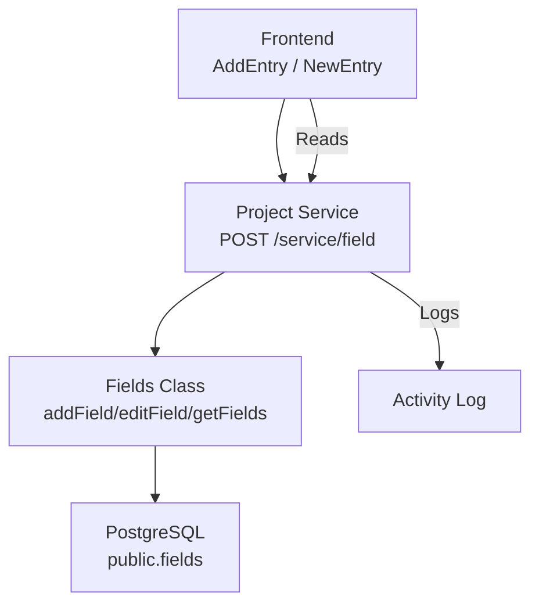
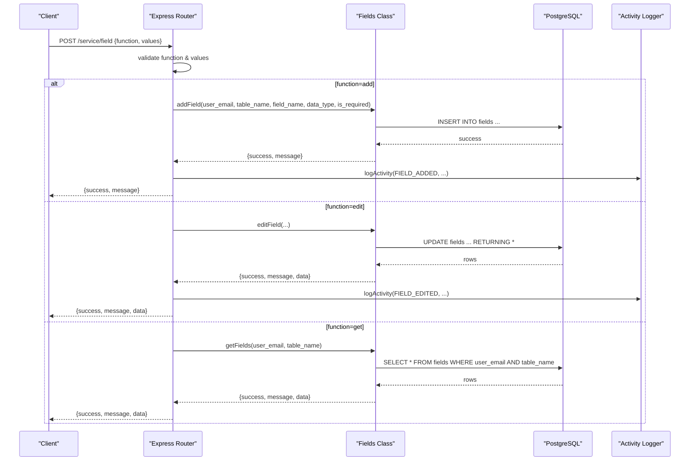
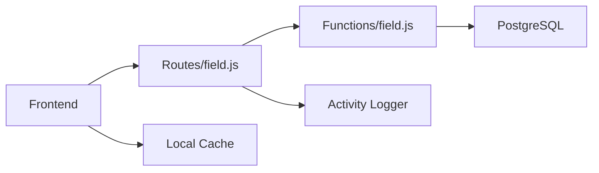

# Custom Fields

<cite>
**Referenced Files in This Document**
- [field.js](file://services/project-service/src/Routes/field.js)
- [field.js](file://services/project-service/src/functions/field.js)
- [000_baseline_full_schema.sql](file://supabase/migrations/000_baseline_full_schema.sql)
- [openapi.yaml](file://services/project-service/docs/openapi.yaml)
- [fields.js](file://frontend/src/functions/project/fields.js)
- [AddEntry.tsx](file://frontend/src/pages/AddEntry.tsx)
- [NewEntry.tsx](file://frontend/src/pages/NewEntry.tsx)
- [CalendarDayModal.tsx](file://frontend/src/pages/CalendarDayModal.tsx)
- [ProjectSettingsPanel.tsx](file://frontend/src/components/ProjectSettingsPanel.tsx)
- [stats.js](file://frontend/src/functions/dashboard/stats.js)
- [field.test.js](file://services/project-service/src/__tests__/field.test.js)
</cite>

## Table of Contents

1. [Introduction](#introduction)
2. [Project Structure](#project-structure)
3. [Core Components](#core-components)
4. [Architecture Overview](#architecture-overview)
5. [Detailed Component Analysis](#detailed-component-analysis)
6. [Dependency Analysis](#dependency-analysis)
7. [Performance Considerations](#performance-considerations)
8. [Troubleshooting Guide](#troubleshooting-guide)
9. [Conclusion](#conclusion)
10. [Appendices](#appendices)

## Introduction

This document provides detailed API documentation for Custom Field management in the Project Service. It covers how to add, edit, and retrieve project-specific custom fields using a unified RPC-style endpoint. It also documents the ProjectField schema, explains how custom fields integrate with entry data structures, and outlines validation rules for field definitions used by the frontend.

## Project Structure

Custom field functionality spans the backend service (routes, functions, database), OpenAPI specification, and frontend integration:

- Backend route dispatches operations to a service class that persists field definitions.
- The database stores field definitions per user and project.
- The frontend calls the API to manage fields and renders dynamic forms based on field definitions.

**Diagram sources**

- [field.js:20-92](file://services/project-service/src/Routes/field.js#L20-L92)
- [field.js:4-58](file://services/project-service/src/functions/field.js#L4-L58)
- [000_baseline_full_schema.sql:97-106](file://supabase/migrations/000_baseline_full_schema.sql#L97-L106)

**Section sources**

- [field.js:20-92](file://services/project-service/src/Routes/field.js#L20-L92)
- [field.js:4-58](file://services/project-service/src/functions/field.js#L4-L58)
- [000_baseline_full_schema.sql:97-106](file://supabase/migrations/000_baseline_full_schema.sql#L97-L106)

## Core Components

- Unified RPC endpoint: POST /service/field with { function, values } to call add, edit, or get.
- Fields service class: encapsulates database operations for adding, editing, and retrieving fields.
- Database schema: public.fields table stores field definitions per user and project.
- Frontend helpers: functions to fetch, add, and edit fields; UI components render dynamic inputs based on data_type and is_required.

Key responsibilities:

- Route layer validates required parameters and maps function names to service methods.
- Service layer performs SQL operations and returns standardized results.
- Frontend caches field definitions and builds forms dynamically.

**Section sources**

- [field.js:20-92](file://services/project-service/src/Routes/field.js#L20-L92)
- [field.js:4-58](file://services/project-service/src/functions/field.js#L4-L58)
- [fields.js:8-77](file://frontend/src/functions/project/fields.js#L8-L77)

## Architecture Overview

The custom fields feature uses an RPC-style pattern where a single endpoint handles multiple operations via a function name and parameter object.

**Diagram sources**

- [field.js:20-92](file://services/project-service/src/Routes/field.js#L20-L92)
- [field.js:4-58](file://services/project-service/src/functions/field.js#L4-L58)

## Detailed Component Analysis

### API Endpoint: POST /service/field

- Purpose: Add, edit, or retrieve custom field definitions for a project.
- Authentication: Requires a valid JWT; user email is extracted from the token.
- Request body:
  - function: one of "add", "edit", "get"
  - values: operation-specific parameters
- Responses:
  - Success: { success: true, message: "...", data?: [...] }
  - Error: { error: "...", details?: "..." }

Operation specifics:

- add(values):
  - Required: table_name, field_name
  - Optional: data_type, is_required
  - Logs activity on success
- edit(values):
  - Required: table_name, field_name
  - Optional: data_type, is_required
  - Updates existing field definition; returns updated row if found
- get(values):
  - Required: table_name
  - Returns all non-deleted fields for the user and project

Examples (conceptual):

- Add numeric field:
  - function: "add"
  - values: { table_name: "My Project", field_name: "Hours", data_type: "number", is_required: false }
- Edit field properties:
  - function: "edit"
  - values: { table_name: "My Project", field_name: "Hours", data_type: "integer", is_required: true }
- Retrieve fields for a project:
  - function: "get"
  - values: { table_name: "My Project" }

**Section sources**

- [field.js:20-92](file://services/project-service/src/Routes/field.js#L20-L92)
- [openapi.yaml:633-687](file://services/project-service/docs/openapi.yaml#L633-L687)

### Fields Service Class

- Methods:
  - addField(user_email, table_name, field_name, data_type, is_required)
  - editField(user_email, table_name, field_name, data_type, is_required)
  - getFields(user_email, table_name)
- Behavior:
  - Validates database pool availability
  - Executes parameterized queries
  - Returns standardized result objects with success flag and messages
  - Handles errors gracefully and logs them

Error handling:

- Missing or invalid parameters are handled at the route level.
- Database errors return failure responses with error messages.
- Soft-delete filtering ensures only active fields are returned.

**Section sources**

- [field.js:4-58](file://services/project-service/src/functions/field.js#L4-L58)
- [field.test.js:19-120](file://services/project-service/src/__tests__/field.test.js#L19-L120)

### Database Schema: public.fields

- Columns:
  - id: UUID primary key
  - user_email: VARCHAR(255), NOT NULL
  - table_name: VARCHAR(100), NOT NULL
  - field_name: VARCHAR(100), NOT NULL
  - data_type: VARCHAR(50), e.g., text, number, boolean, date, custom:...
  - is_required: BOOLEAN, default false
  - deleted: BOOLEAN, default false (soft delete)
  - created_at: TIMESTAMPTZ, default CURRENT_TIMESTAMP

Notes:

- Each field definition is scoped to a user and project (table_name).
- Soft deletion allows hiding fields without permanent removal.
- Data types include built-in types and custom enumerations via custom:... prefix.

**Section sources**

- [000_baseline_full_schema.sql:97-106](file://supabase/migrations/000_baseline_full_schema.sql#L97-L106)

### Frontend Integration

- Fetching fields:
  - getFields(user_email, table_name) calls the API and caches results.
- Adding and editing fields:
  - addField and editField send requests and refresh cache on success.
- Rendering dynamic forms:
  - Input types are derived from data_type (e.g., number, date, boolean).
  - Custom options are supported via data_type starting with "custom:" followed by comma-separated options.
  - Required fields enforce HTML validation when is_required is true.

Validation and parsing:

- parseCustomOptions(data_type) extracts allowed values for custom fields.
- inputTypeForDataType(data_type) maps data types to appropriate HTML input types.
- mergeFieldDefs combines declared field definitions with derived ones from stored entries.

**Section sources**

- [fields.js:8-77](file://frontend/src/functions/project/fields.js#L8-L77)
- [AddEntry.tsx:267-316](file://frontend/src/pages/AddEntry.tsx#L267-L316)
- [NewEntry.tsx:165-187](file://frontend/src/pages/NewEntry.tsx#L165-L187)
- [CalendarDayModal.tsx:44-68](file://frontend/src/pages/CalendarDayModal.tsx#L44-L68)
- [stats.js:250-283](file://frontend/src/functions/dashboard/stats.js#L250-L283)

### Entry Data Integration

- Custom field values are stored within the entries JSONB payload under their respective field names.
- Built-in columns exist at the top level of the entry object; custom fields reside inside entries.
- When reading values, the system checks both top-level fields and nested entries for compatibility.
- Derived fields (e.g., duration) are computed from timestamps and do not require storage.

Data flow:

- On form submission, values for custom fields are collected into the entries object.
- Validation enforces required fields and type-appropriate inputs.
- On retrieval, the frontend merges declared field definitions with actual data to ensure consistent rendering.

**Section sources**

- [stats.js:250-283](file://frontend/src/functions/dashboard/stats.js#L250-L283)
- [AddEntry.tsx:267-316](file://frontend/src/pages/AddEntry.tsx#L267-L316)

## Dependency Analysis

- Route depends on Fields service class for business logic.
- Fields service depends on PostgreSQL connection pool.
- Frontend depends on API endpoints and caches field definitions locally.
- Activity logging is triggered on successful field modifications.

**Diagram sources**

- [field.js:20-92](file://services/project-service/src/Routes/field.js#L20-L92)
- [field.js:4-58](file://services/project-service/src/functions/field.js#L4-L58)

**Section sources**

- [field.js:20-92](file://services/project-service/src/Routes/field.js#L20-L92)
- [field.js:4-58](file://services/project-service/src/functions/field.js#L4-L58)

## Performance Considerations

- Use parameterized queries to prevent SQL injection and optimize execution plans.
- Filter out soft-deleted fields to reduce noise in queries.
- Cache field definitions on the frontend to minimize repeated API calls.
- Avoid unnecessary updates by checking for changes before issuing edit requests.

[No sources needed since this section provides general guidance]

## Troubleshooting Guide

Common issues and resolutions:

- Unauthorized access: Ensure a valid JWT is included in requests.
- Missing parameters: Validate that table_name and field_name are provided for add/edit operations.
- Field not found: Edit operations require an existing field; verify field_name and table_name.
- Database connectivity: Check that the database pool is initialized and accessible.
- Soft-deleted fields: Ensure deleted=false or null when querying active fields.

Diagnostic steps:

- Inspect response messages for specific error details.
- Verify activity logs for FIELD_ADDED and FIELD_EDITED events.
- Confirm field definitions match expected data types and requirements.

**Section sources**

- [field.js:20-92](file://services/project-service/src/Routes/field.js#L20-L92)
- [field.js:4-58](file://services/project-service/src/functions/field.js#L4-L58)
- [field.test.js:19-120](file://services/project-service/src/__tests__/field.test.js#L19-L120)

## Conclusion

Custom fields provide flexible, project-specific extensions to entry data through a robust API and integrated frontend. The design supports dynamic form generation, validation, and persistence while maintaining clear separation between routing, business logic, and data storage. By following the documented patterns, developers can extend projects with tailored data structures and ensure consistency across applications.

[No sources needed since this section summarizes without analyzing specific files]

## Appendices

### API Reference Summary

- Endpoint: POST /service/field
- Operations:
  - add: Create a new field definition
  - edit: Update an existing field definition
  - get: Retrieve all active field definitions for a project

Request format:
{
"function": "add|edit|get",
"values": { ... }
}

Response format:
{
"success": boolean,
"message": string,
"data": array?
}

**Section sources**

- [openapi.yaml:633-687](file://services/project-service/docs/openapi.yaml#L633-L687)

### Supported Data Types

- text: Free-form text input
- number, integer, float: Numeric inputs
- boolean: Checkbox input
- date: Date picker input
- custom:<option1>,<option2>,...: Dropdown with predefined choices

**Section sources**

- [AddEntry.tsx:267-316](file://frontend/src/pages/AddEntry.tsx#L267-L316)
- [NewEntry.tsx:182-187](file://frontend/src/pages/NewEntry.tsx#L182-L187)
- [CalendarDayModal.tsx:44-68](file://frontend/src/pages/CalendarDayModal.tsx#L44-L68)
