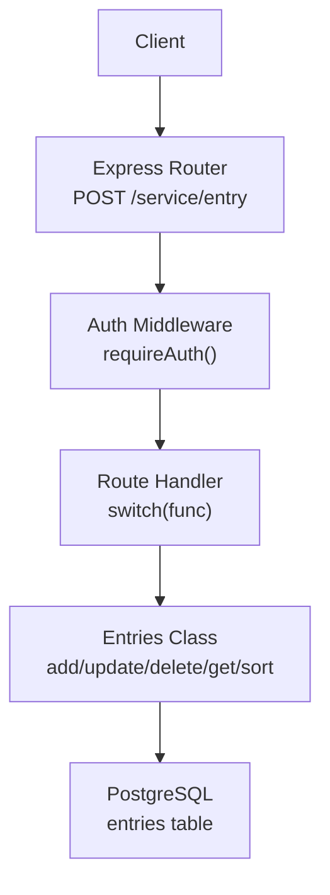
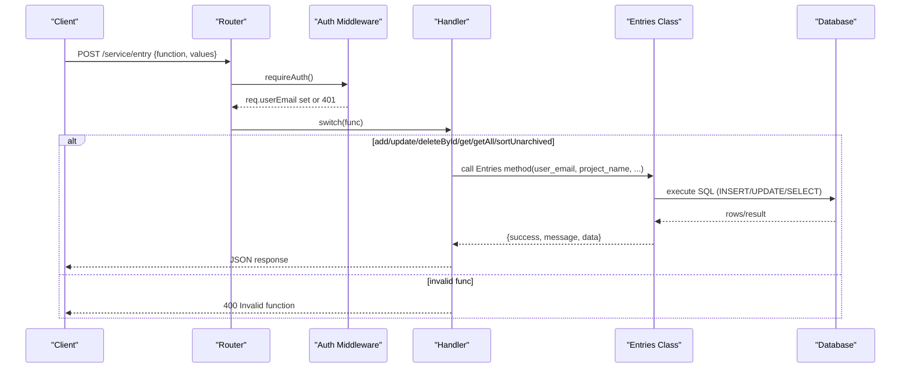
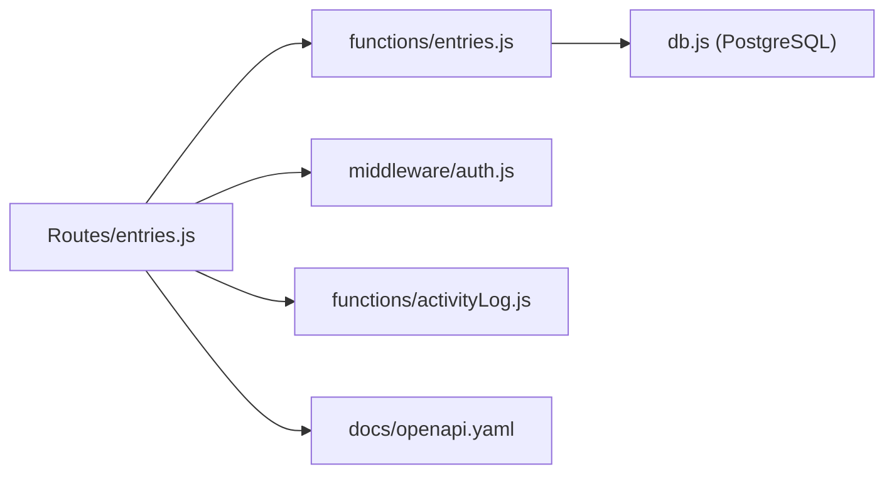

# Entry Management

<cite>
**Referenced Files in This Document**
- [entries.js](file://services/project-service/src/Routes/entries.js)
- [entries.js](file://services/project-service/src/functions/entries.js)
- [auth.js](file://services/project-service/src/middleware/auth.js)
- [000_baseline_full_schema.sql](file://supabase/migrations/000_baseline_full_schema.sql)
- [005_add_soft_delete_column.sql](file://supabase/migrations/005_add_soft_delete_column.sql)
- [openapi.yaml](file://services/project-service/docs/openapi.yaml)
</cite>

## Table of Contents

1. Introduction
2. Project Structure
3. Core Components
4. Architecture Overview
5. Detailed Component Analysis
6. Dependency Analysis
7. Performance Considerations
8. Troubleshooting Guide
9. Conclusion

## Introduction

This document provides comprehensive API documentation for Entry Management operations in the Project Service. It covers all entry CRUD functions (add, update, deleteById, get, getAll, sortUnarchived), the Entry data model, sorting and filtering behavior, error handling scenarios, and authentication requirements. The service uses a single RPC-style endpoint to dispatch multiple operations via a function name and values payload.

## Project Structure

Entry Management is implemented as follows:

- Route handler: POST /service/entry with an RPC-style body { function, values }
- Business logic: Entries class methods for add/update/delete/get/sort
- Data persistence: PostgreSQL entries table with JSONB content and soft-delete flags
- Authentication: JWT middleware validates user identity and attaches req.userEmail

**Diagram sources**

- [entries.js:23-191](file://services/project-service/src/Routes/entries.js#L23-L191)
- [auth.js:27-70](file://services/project-service/src/middleware/auth.js#L27-L70)
- [entries.js:43-399](file://services/project-service/src/functions/entries.js#L43-L399)
- [000_baseline_full_schema.sql:69-94](file://supabase/migrations/000_baseline_full_schema.sql#L69-L94)

**Section sources**

- [entries.js:23-191](file://services/project-service/src/Routes/entries.js#L23-L191)
- [auth.js:27-70](file://services/project-service/src/middleware/auth.js#L27-L70)

## Core Components

- Route dispatcher: Accepts function names add, update, delete, deleteById, get, getAll, sortUnarchived, sortArchived and routes to corresponding business logic.
- Entries class: Implements database operations for creating, updating, deleting, retrieving, and sorting entries.
- Authentication: Ensures requests are authenticated and binds verified user email to the request context.
- Database schema: Defines the entries table structure including JSONB content, timestamps, priority, status, and soft-delete flags.

Key responsibilities:

- Validate required parameters per operation
- Enforce user isolation by user_email
- Perform soft deletes and maintain associated notes
- Provide sorting by due date and priority-based grouping

**Section sources**

- [entries.js:23-191](file://services/project-service/src/Routes/entries.js#L23-L191)
- [entries.js:43-399](file://services/project-service/src/functions/entries.js#L43-L399)
- [auth.js:27-70](file://services/project-service/src/middleware/auth.js#L27-L70)
- [000_baseline_full_schema.sql:69-94](file://supabase/migrations/000_baseline_full_schema.sql#L69-L94)

## Architecture Overview

The Entry Management flow uses an RPC-style pattern on a single endpoint. The route handler inspects the function field and delegates to the appropriate Entries method. All operations enforce user isolation using the verified email from the JWT. Sorting supports due-date ordering and priority-based grouping. Soft deletes are used for removals.

**Diagram sources**

- [entries.js:23-191](file://services/project-service/src/Routes/entries.js#L23-L191)
- [entries.js:43-399](file://services/project-service/src/functions/entries.js#L43-L399)
- [auth.js:27-70](file://services/project-service/src/middleware/auth.js#L27-L70)

## Detailed Component Analysis

### API Endpoint: POST /service/entry

- Purpose: Unified entry management endpoint supporting multiple operations via function dispatch.
- Authentication: Requires a valid Supabase JWT; unauthorized requests receive 401.
- Request body: { function, values } where values vary by operation.
- Supported functions:
  - add: Create a new entry
  - update: Update an existing entry by id
  - delete: Soft-delete by matching entries JSONB content
  - deleteById: Soft-delete by entry id
  - get: Retrieve entries for a specific project
  - getAll: Retrieve all non-deleted entries for the user
  - sortUnarchived: Sort unarchived entries with optional project filter and sort_type
  - sortArchived: Sort archived entries with optional project filter and sort_type

Response shape:

- Success: { success: true, message: string, data?: any }
- Error: { success: false, message: string } or HTTP-level errors like 400/401/500

Examples (described):

- Add entry: function=add, values={ project_name, entry_object, due_date, priority, status, started_at, ended_at, duration, summary, notes }
- Update entry: function=update, values={ project_name, entry_id, new_entry, due_date, priority, status, started_at, ended_at, duration }
- Delete by id: function=deleteById, values={ entry_id }
- Get entries: function=get, values={ project_name }
- Get all entries: function=getAll, values={}
- Sort unarchived: function=sortUnarchived, values={ project_name?, sort_type? }

Notes:

- The user_email is taken from the JWT, not from client input.
- Activity logging is performed for add/update/delete operations.

**Section sources**

- [entries.js:23-191](file://services/project-service/src/Routes/entries.js#L23-L191)
- [openapi.yaml:344-424](file://services/project-service/docs/openapi.yaml#L344-L424)

### Operation: add

- Behavior: Inserts a new entry row with user_email, project_name, entries (JSONB), and optional fields (due_date, priority, status, started_at, ended_at, duration, summary). Notes can be attached if provided.
- Validation: Requires project_name; missing required parameters return 400.
- Side effects: Logs activity; optionally adds notes linked to the created entry.
- Response: Returns inserted row(s) and any added notes.

Example usage (described):

- Create an entry with project_name="WebApp", entry_object={ title: "Fix login bug" }, due_date="2026-09-15T00:00:00Z", priority=1, status="up_next".

**Section sources**

- [entries.js:41-80](file://services/project-service/src/Routes/entries.js#L41-L80)
- [entries.js:43-115](file://services/project-service/src/functions/entries.js#L43-L115)

### Operation: update

- Behavior: Updates an existing entry identified by entry_id within the specified project and user scope. Supports partial updates for entries (must be a structured object), due_date, priority, status, started_at, ended_at, duration, summary.
- Validation: Requires project_name and entry_id; returns 400 if missing. If attempting to replace legacy entry content with a structured update, returns a specific error.
- Side effects: Background summary regeneration may occur when entry content changes; logs activity.
- Response: Updated row(s) or no-change message.

Example usage (described):

- Update entry_id="uuid", project_name="WebApp", new_entry={ title: "Updated task" }, status="in_motion".

**Section sources**

- [entries.js:81-132](file://services/project-service/src/Routes/entries.js#L81-L132)
- [entries.js:117-209](file://services/project-service/src/functions/entries.js#L117-L209)

### Operation: delete

- Behavior: Soft-deletes an entry by matching entries JSONB content under the given project and user scope. Also soft-deletes associated notes.
- Validation: Requires project_name; returns 400 if missing.
- Response: Success or not-found message.

Example usage (described):

- Delete entry by matching entries content in project_name="WebApp".

**Section sources**

- [entries.js:133-142](file://services/project-service/src/Routes/entries.js#L133-L142)
- [entries.js:244-271](file://services/project-service/src/functions/entries.js#L244-L271)

### Operation: deleteById

- Behavior: Soft-deletes an entry by its unique id under the current user scope. Also soft-deletes associated notes.
- Validation: Requires entry_id; returns 400 if missing.
- Response: Success or not-found message.

Example usage (described):

- Delete entry_id="uuid".

**Section sources**

- [entries.js:143-151](file://services/project-service/src/Routes/entries.js#L143-L151)
- [entries.js:273-299](file://services/project-service/src/functions/entries.js#L273-L299)

### Operation: get

- Behavior: Retrieves all non-deleted entries for a specific project and user.
- Validation: Requires project_name; returns 400 if missing.
- Response: List of entries.

Example usage (described):

- Get entries for project_name="WebApp".

**Section sources**

- [entries.js:152-157](file://services/project-service/src/Routes/entries.js#L152-L157)
- [entries.js:211-225](file://services/project-service/src/functions/entries.js#L211-L225)

### Operation: getAll

- Behavior: Retrieves all non-deleted entries for the authenticated user, ordered by creation time descending.
- Response: List of entries.

Example usage (described):

- Get all entries for the current user.

**Section sources**

- [entries.js:158-161](file://services/project-service/src/Routes/entries.js#L158-L161)
- [entries.js:227-242](file://services/project-service/src/functions/entries.js#L227-L242)

### Operation: sortUnarchived

- Behavior: Retrieves unarchived, non-deleted entries for the user, optionally filtered by project_name, sorted by due_date ascending. Supports sort_type:
  - 0: Default order (by due_date)
  - 1: Grouped by priority labels in a defined order
- Response: Sorted list of entries.

Example usage (described):

- Sort unarchived entries for project_name="WebApp" with sort_type=1 to group by priority.

**Section sources**

- [entries.js:162-170](file://services/project-service/src/Routes/entries.js#L162-L170)
- [entries.js:301-348](file://services/project-service/src/functions/entries.js#L301-L348)

### Sorting and Filtering Details

- Sorting criteria:
  - Due date: Entries are ordered by due_date ascending.
  - Priority grouping: When sort_type=1, results are grouped by priority labels in a fixed order.
- Filtering options:
  - Project filter: Optional project_name parameter filters results to a specific project.
  - Scope: All queries are scoped to the authenticated user’s email.
  - Soft-delete: Deleted entries are excluded from results.
  - Archive state: sortUnarchired excludes archived entries; sortArchived includes only archived entries.
- Pagination:
  - Not implemented in these endpoints; clients should handle pagination at the application layer if needed.

**Section sources**

- [entries.js:301-348](file://services/project-service/src/functions/entries.js#L301-L348)
- [entries.js:350-393](file://services/project-service/src/functions/entries.js#L350-L393)

### Entry Data Model

The entries table stores each logbook entry with the following fields:

- id: UUID primary key
- user_email: Email of the owner (enforces user isolation)
- project_name: Associated project
- entries: JSONB payload containing structured entry content
- due_date: Timestamp for due date (nullable)
- priority: Enum type with three levels
- status: String with default value indicating workflow stage
- archived: Boolean flag for archival state
- started_at: Timestamp marking start of work (nullable)
- ended_at: Timestamp marking end of work (nullable)
- duration: Generated interval computed from started_at and ended_at
- deleted: Soft-delete flag
- created_at: Creation timestamp
- summary: Optional text summary

Indexes exist for user_email, project_name, due_date, and archived to optimize queries.

**Section sources**

- [000_baseline_full_schema.sql:69-94](file://supabase/migrations/000_baseline_full_schema.sql#L69-L94)
- [005_add_soft_delete_column.sql:8-9](file://supabase/migrations/005_add_soft_delete_column.sql#L8-L9)

### Authentication and Authorization

- Authentication: Requests must include a valid Supabase JWT via Authorization header or query token for SSE.
- Authorization: Operations are scoped to the authenticated user’s email; users cannot access other users’ entries.
- Unauthorized responses: 401 when token is missing, invalid, or does not contain email.

**Section sources**

- [auth.js:27-70](file://services/project-service/src/middleware/auth.js#L27-L70)
- [entries.js:34-38](file://services/project-service/src/Routes/entries.js#L34-L38)

### Error Handling

Common error scenarios:

- Missing required parameters: Returns 400 with descriptive message
- Unauthorized: Returns 401 when JWT is missing or invalid
- Internal server errors: Returns 500 with error details
- Entry not found: Returns success=false with message indicating not found
- Legacy content update restrictions: Returns specific error when attempting to replace legacy entry content with structured updates

Error responses typically include success=false and a message field describing the issue.

**Section sources**

- [entries.js:23-191](file://services/project-service/src/Routes/entries.js#L23-L191)
- [entries.js:117-209](file://services/project-service/src/functions/entries.js#L117-L209)
- [entries.js:244-299](file://services/project-service/src/functions/entries.js#L244-L299)

## Dependency Analysis

The Entry Management feature depends on several components:

- Express router for HTTP routing
- JWT middleware for authentication
- Entries class for business logic
- PostgreSQL database for persistence
- Activity logging for audit trail
- OpenAPI specification for contract definition

**Diagram sources**

- [entries.js:23-191](file://services/project-service/src/Routes/entries.js#L23-L191)
- [entries.js:43-399](file://services/project-service/src/functions/entries.js#L43-L399)
- [auth.js:27-70](file://services/project-service/src/middleware/auth.js#L27-L70)
- [openapi.yaml:344-424](file://services/project-service/docs/openapi.yaml#L344-L424)

**Section sources**

- [entries.js:23-191](file://services/project-service/src/Routes/entries.js#L23-L191)
- [entries.js:43-399](file://services/project-service/src/functions/entries.js#L43-L399)
- [auth.js:27-70](file://services/project-service/src/middleware/auth.js#L27-L70)

## Performance Considerations

- Queries are indexed on user_email, project_name, due_date, and archived for efficient filtering and sorting.
- Soft-delete avoids physical deletions, reducing write amplification but requiring consistent filtering in queries.
- Sorting by due_date is handled at the database level; priority grouping is done in-memory after retrieval.
- No built-in pagination; large result sets may benefit from client-side pagination or additional server-side limits.

[No sources needed since this section provides general guidance]

## Troubleshooting Guide

Common issues and resolutions:

- 401 Unauthorized: Ensure a valid Supabase JWT is included in the Authorization header or query token for SSE connections.
- 400 Bad Request: Verify that required parameters (e.g., project_name, entry_id) are present and correctly formatted.
- Entry not found: Confirm the entry exists under the current user’s scope and is not already deleted.
- Update restrictions: When updating entries, ensure new_entry is a structured object; legacy content cannot be replaced directly.
- Sorting behavior: sort_type=1 groups by predefined priority labels; default sort_type sorts by due_date ascending.

**Section sources**

- [auth.js:27-70](file://services/project-service/src/middleware/auth.js#L27-L70)
- [entries.js:23-191](file://services/project-service/src/Routes/entries.js#L23-L191)
- [entries.js:117-209](file://services/project-service/src/functions/entries.js#L117-L209)

## Conclusion

Entry Management in the Project Service provides a unified RPC-style API for creating, updating, deleting, retrieving, and sorting entries. The system enforces strong user isolation through JWT-based authentication, uses a flexible JSONB schema for entry content, and supports robust sorting and filtering capabilities. Soft deletes ensure data integrity while allowing recovery. Proper error handling and activity logging support reliable operation and auditing.

[No sources needed since this section summarizes without analyzing specific files]
