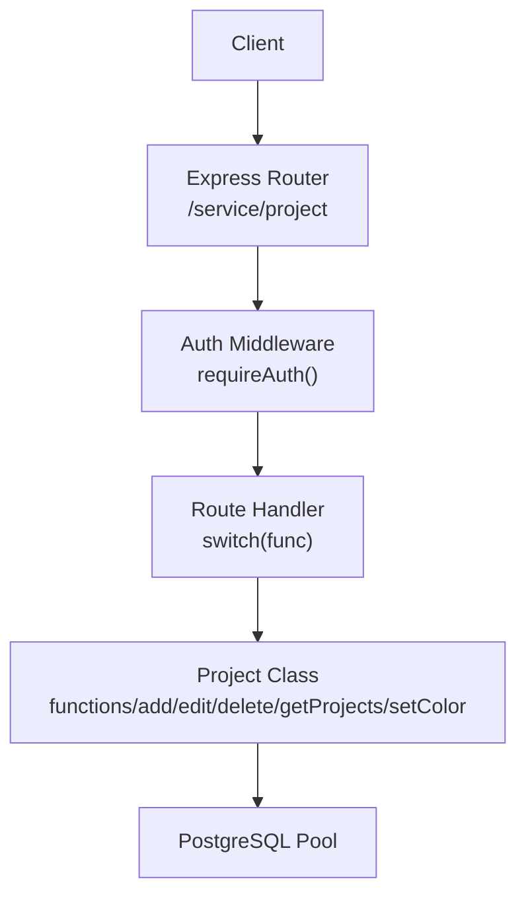
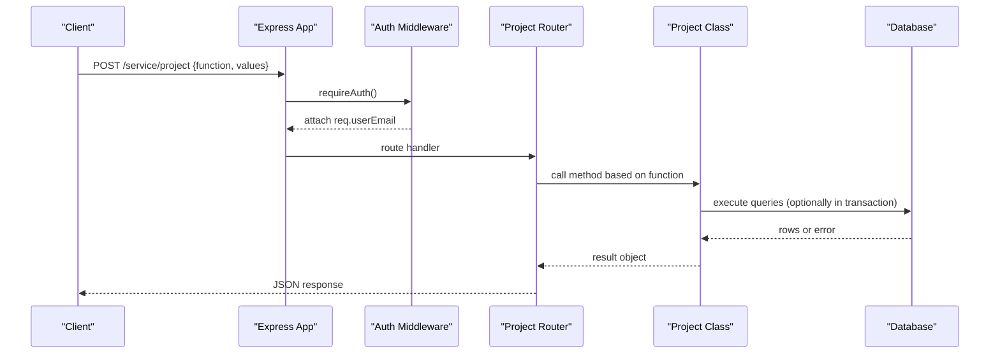
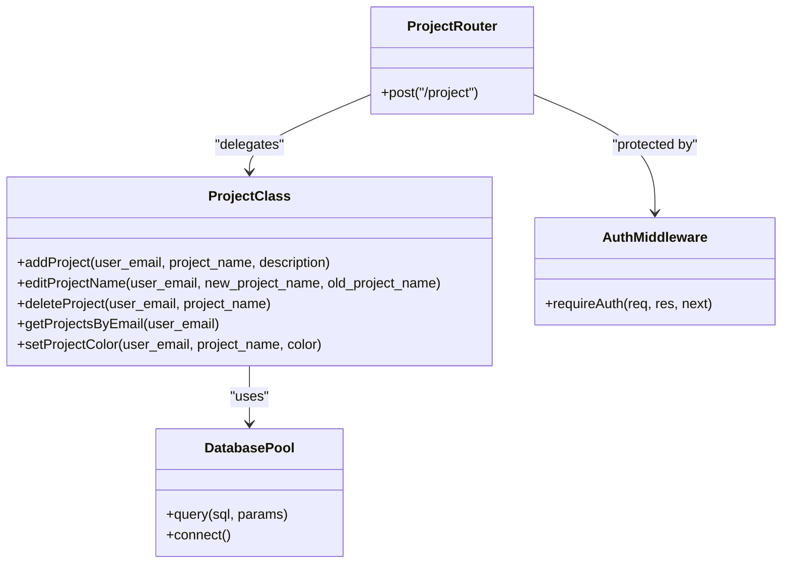

# Project CRUD Operations

<cite>
**Referenced Files in This Document**
- [index.js](file://services/project-service/src/index.js)
- [project.js (Routes)](file://services/project-service/src/Routes/project.js)
- [project.js (Functions)](file://services/project-service/src/functions/project.js)
- [auth.js](file://services/project-service/src/middleware/auth.js)
- [openapi.yaml](file://services/project-service/docs/openapi.yaml)
- [001_add_project_description_and_unique_name.sql](file://supabase/migrations/001_add_project_description_and_unique_name.sql)
- [project.test.js](file://services/project-service/src/__tests__/project.test.js)
</cite>

## Table of Contents

1. [Introduction](#introduction)
2. [Project Structure](#project-structure)
3. [Core Components](#core-components)
4. [Architecture Overview](#architecture-overview)
5. [Detailed Component Analysis](#detailed-component-analysis)
6. [Dependency Analysis](#dependency-analysis)
7. [Performance Considerations](#performance-considerations)
8. [Troubleshooting Guide](#troubleshooting-guide)
9. [Conclusion](#conclusion)

## Introduction

This document provides detailed API documentation for Project CRUD operations exposed by the Project Service. It covers creating projects, renaming existing projects, deleting projects, and retrieving project lists. The service uses an RPC-style dispatch pattern: POST to /service/project with a JSON body containing { function, values }. Authentication is enforced via JWT tokens using Supabase’s JWKS endpoint.

## Project Structure

The Project Service exposes a single unified endpoint for project operations under /service/project. Requests are authenticated via middleware that validates JWTs and attaches the verified user email to the request. The route handler dispatches to specific functions based on the function field in the request payload. Business logic resides in a dedicated class that interacts with the database layer.

**Diagram sources**

- [index.js:83-93](file://services/project-service/src/index.js#L83-L93)
- [project.js (Routes):20-96](file://services/project-service/src/Routes/project.js#L20-L96)
- [project.js (Functions):4-149](file://services/project-service/src/functions/project.js#L4-L149)
- [auth.js:27-70](file://services/project-service/src/middleware/auth.js#L27-L70)

**Section sources**

- [index.js:23-108](file://services/project-service/src/index.js#L23-L108)
- [project.js (Routes):1-99](file://services/project-service/src/Routes/project.js#L1-L99)

## Core Components

- Unified RPC endpoint: POST /service/project accepts { function, values } payloads.
- Supported functions: add, edit, delete, getProjects, setColor.
- Authentication: All /service routes require a valid JWT; verified email is attached to req.userEmail.
- Data model: Projects include name, optional description, timestamps, archive flag, and color.
- Validation: Required fields are validated at the route level; uniqueness constraints are enforced at the database level.

Key behaviors:

- add: Creates a new project with name and optional description. Duplicate names per user return a client error.
- edit: Renames a project and cascades updates to related entries and custom fields within a transaction.
- delete: Soft-deletes a project and all its entries and custom fields within a transaction.
- getProjects: Returns non-deleted projects for the authenticated user, ordered by creation time.
- setColor: Updates the project’s color.

**Section sources**

- [project.js (Routes):20-96](file://services/project-service/src/Routes/project.js#L20-L96)
- [project.js (Functions):4-149](file://services/project-service/src/functions/project.js#L4-L149)
- [openapi.yaml:280-343](file://services/project-service/docs/openapi.yaml#L280-L343)

## Architecture Overview

The Project Service follows a layered architecture:

- Express app mounts CORS, JSON parsing, and Swagger UI.
- All /service routes are protected by requireAuth middleware.
- The project router parses the RPC payload and delegates to the Project class methods.
- The Project class performs database operations using a connection pool, with transactions for multi-step updates.

**Diagram sources**

- [index.js:83-93](file://services/project-service/src/index.js#L83-L93)
- [project.js (Routes):20-96](file://services/project-service/src/Routes/project.js#L20-L96)
- [project.js (Functions):28-69](file://services/project-service/src/functions/project.js#L28-L69)
- [auth.js:27-70](file://services/project-service/src/middleware/auth.js#L27-L70)

## Detailed Component Analysis

### Endpoint: POST /service/project (RPC Dispatch)

- Purpose: Perform project management operations via RPC-style dispatch.
- Authentication: Bearer JWT required; verified email extracted and attached to request.
- Request schema:
  - function: string — operation name (add, edit, delete, getProjects, setColor)
  - values: object — parameters for the operation
- Responses:
  - Success: JSON with success flag and data/message
  - 400: Bad request (missing parameters, invalid function, duplicate project)
  - 401: Unauthorized (missing or invalid JWT)
  - 500: Internal server error

Examples:

- Create a project:
  - function: add
  - values: { project_name: "My Project", description: "Optional description" }
- Rename a project:
  - function: edit
  - values: { new_project_name: "New Name", old_project_name: "My Project" }
- Delete a project:
  - function: delete
  - values: { project_name: "My Project" }
- List projects:
  - function: getProjects
  - values: {}

Validation rules:

- function must be provided; otherwise returns 400.
- add requires project_name; description is optional.
- edit requires both new_project_name and old_project_name.
- delete requires project_name.
- getProjects requires no additional values.
- setColor requires project_name and color.

Error handling:

- Duplicate project names per user return 400 with a clear message.
- Database errors return 500 with details.
- Missing authentication returns 401.

**Section sources**

- [project.js (Routes):20-96](file://services/project-service/src/Routes/project.js#L20-L96)
- [openapi.yaml:280-343](file://services/project-service/docs/openapi.yaml#L280-L343)

### Function: add

- Behavior: Inserts a new project row with user_email, project_name, and optional description.
- Uniqueness: Enforced by a unique constraint on (user_email, project_name).
- Response:
  - Success: { success: true, message: "Project added successfully" }
  - Duplicate: { success: false, message: "A project with this name already exists for your account." }
  - Error: { success: false, message: "<error.message>" }

Example request:
{
"function": "add",
"values": {
"project_name": "My Project",
"description": "Optional description"
}
}

**Section sources**

- [project.js (Functions):4-26](file://services/project-service/src/functions/project.js#L4-L26)
- [001_add_project_description_and_unique_name.sql:12-40](file://supabase/migrations/001_add_project_description_and_unique_name.sql#L12-L40)
- [project.test.js:20-66](file://services/project-service/src/__tests__/project.test.js#L20-L66)

### Function: edit

- Behavior: Renames a project and updates all related entries and custom fields within a transaction.
- Transaction steps:
  - BEGIN
  - Update entries.project_name where old_project_name matches
  - Update fields.table_name where old_project_name matches
  - Update projects.project_name
  - COMMIT
- Response:
  - Success: { success: true, message: "Project name updated successfully" }
  - Error: { success: false, message: "<error.message>" }

Example request:
{
"function": "edit",
"values": {
"new_project_name": "New Name",
"old_project_name": "My Project"
}
}

**Section sources**

- [project.js (Functions):28-69](file://services/project-service/src/functions/project.js#L28-L69)
- [project.test.js:68-99](file://services/project-service/src/__tests__/project.test.js#L68-L99)

### Function: delete

- Behavior: Soft-deletes a project and all its entries and custom fields within a transaction.
- Transaction steps:
  - BEGIN
  - Set entries.deleted = true for matching project
  - Set fields.deleted = true for matching table_name
  - Set projects.deleted = true for matching project
  - COMMIT
- Response:
  - Success: { success: true, message: "Project deleted successfully" }
  - Error: { success: false, message: "<error.message>" }

Example request:
{
"function": "delete",
"values": {
"project_name": "My Project"
}
}

**Section sources**

- [project.js (Functions):106-147](file://services/project-service/src/functions/project.js#L106-L147)
- [project.test.js:123-146](file://services/project-service/src/__tests__/project.test.js#L123-L146)

### Function: getProjects

- Behavior: Retrieves all non-deleted projects for the authenticated user, ordered by creation time descending.
- Response:
  - Success: { success: true, projects: [<array of project objects>] }
  - Error: { success: false, message: "<error.message>" }

Example request:
{
"function": "getProjects",
"values": {}
}

Notes:

- Projects returned exclude soft-deleted rows.
- Each project includes id, user_email, project_name, description, archived, created_at, and potentially other columns from the table.

**Section sources**

- [project.js (Functions):71-87](file://services/project-service/src/functions/project.js#L71-L87)
- [project.test.js:101-121](file://services/project-service/src/__tests__/project.test.js#L101-L121)

### Function: setColor

- Behavior: Updates the project’s color for the specified project and user.
- Response:
  - Success: { success: true, message: "Project color updated" }
  - Error: { success: false, message: "<error.message>" }

Example request:
{
"function": "setColor",
"values": {
"project_name": "My Project",
"color": "#FF5733"
}
}

**Section sources**

- [project.js (Functions):89-104](file://services/project-service/src/functions/project.js#L89-L104)

### Authentication Requirements

- All /service routes require a valid JWT token in the Authorization header as Bearer <token>.
- The middleware verifies the token against Supabase’s JWKS endpoint and attaches:
  - req.user: decoded JWT payload
  - req.userEmail: verified email used for authorization
- If token is missing or invalid, the response is 401 with an error message.

Example headers:
Authorization: Bearer <jwt_token>

**Section sources**

- [auth.js:27-70](file://services/project-service/src/middleware/auth.js#L27-L70)
- [index.js:83-93](file://services/project-service/src/index.js#L83-L93)

### RPC Payload Schema and Examples

- Base schema:
  - function: string
  - values: object
- Add example:
  {
  "function": "add",
  "values": {
  "project_name": "My Project",
  "description": "Optional description"
  }
  }
- Edit example:
  {
  "function": "edit",
  "values": {
  "new_project_name": "New Name",
  "old_project_name": "My Project"
  }
  }
- Delete example:
  {
  "function": "delete",
  "values": {
  "project_name": "My Project"
  }
  }
- GetProjects example:
  {
  "function": "getProjects",
  "values": {}
  }

**Section sources**

- [openapi.yaml:47-58](file://services/project-service/docs/openapi.yaml#L47-L58)
- [openapi.yaml:292-317](file://services/project-service/docs/openapi.yaml#L292-L317)

## Dependency Analysis

- Route handler depends on:
  - Project class for business logic
  - Activity logging for audit trails
- Project class depends on:
  - Database pool for queries
  - Transactions for consistency during rename and delete
- Middleware depends on:
  - jose library for JWT verification
  - Supabase JWKS endpoint for key rotation support

**Diagram sources**

- [project.js (Routes):1-99](file://services/project-service/src/Routes/project.js#L1-L99)
- [project.js (Functions):4-149](file://services/project-service/src/functions/project.js#L4-L149)
- [auth.js:27-70](file://services/project-service/src/middleware/auth.js#L27-L70)

**Section sources**

- [project.js (Routes):1-99](file://services/project-service/src/Routes/project.js#L1-L99)
- [project.js (Functions):4-149](file://services/project-service/src/functions/project.js#L4-L149)
- [auth.js:27-70](file://services/project-service/src/middleware/auth.js#L27-L70)

## Performance Considerations

- Use transactions for multi-step updates (rename, delete) to ensure consistency and reduce partial writes.
- Avoid unnecessary reads; getProjects filters out soft-deleted rows to minimize noise.
- Leverage database-level constraints (unique index) to prevent duplicates efficiently.
- Keep request payloads minimal; only send required fields.

[No sources needed since this section provides general guidance]

## Troubleshooting Guide

Common issues and resolutions:

- 401 Unauthorized:
  - Ensure Authorization header contains a valid Bearer JWT.
  - Verify token has not expired and contains a valid email.
- 400 Bad Request:
  - Check that required fields are present (e.g., project_name for add/delete, both names for edit).
  - Duplicate project name returns a specific message; choose a different name.
- 500 Internal Server Error:
  - Review server logs for database connectivity or query errors.
  - Confirm database migrations have been applied (unique constraints, tables).

Diagnostic tips:

- Validate JWT using a debugger or jwt.io with the correct algorithm and keys from Supabase JWKS.
- Inspect request payloads to ensure they match the expected schema.
- Check activity logs to confirm operations were recorded.

**Section sources**

- [auth.js:27-70](file://services/project-service/src/middleware/auth.js#L27-L70)
- [project.js (Routes):20-96](file://services/project-service/src/Routes/project.js#L20-L96)
- [project.test.js:20-146](file://services/project-service/src/__tests__/project.test.js#L20-L146)

## Conclusion

The Project Service provides a robust, authenticated RPC-style API for managing projects. It supports creating, renaming, deleting, listing, and coloring projects with clear validation and error handling. Transactions ensure data integrity during complex updates, and database constraints enforce uniqueness. Clients should send properly structured requests with valid JWTs to interact with the service reliably.

[No sources needed since this section summarizes without analyzing specific files]
