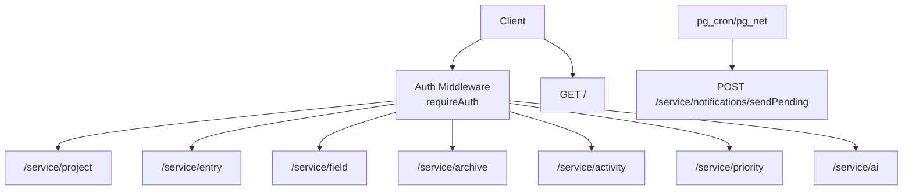
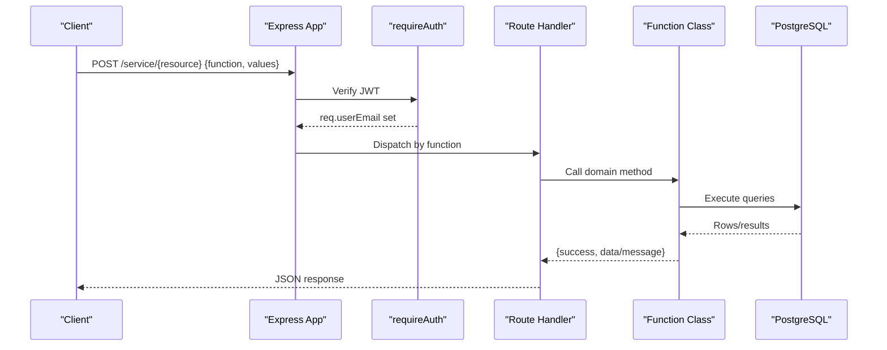
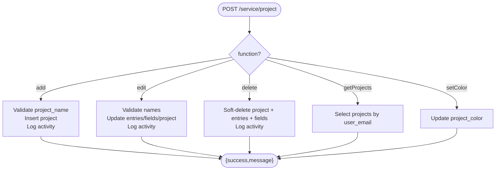
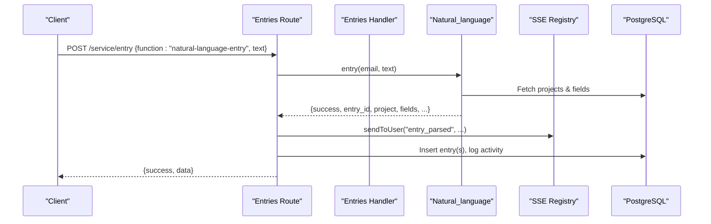
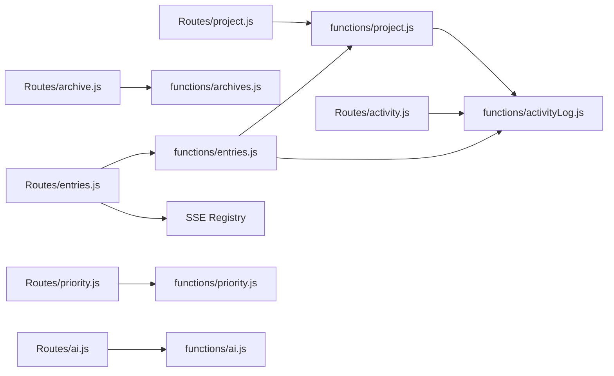

# Project Service API

<cite>
**Referenced Files in This Document**
- [index.js](file://services/project-service/src/index.js)
- [openapi.yaml](file://services/project-service/docs/openapi.yaml)
- [auth.js](file://services/project-service/src/middleware/auth.js)
- [project.js](file://services/project-service/src/Routes/project.js)
- [entries.js](file://services/project-service/src/Routes/entries.js)
- [field.js](file://services/project-service/src/Routes/field.js)
- [archive.js](file://services/project-service/src/Routes/archive.js)
- [activity.js](file://services/project-service/src/Routes/activity.js)
- [priority.js](file://services/project-service/src/Routes/priority.js)
- [ai.js](file://services/project-service/src/Routes/ai.js)
- [project_handler.js](file://services/project-service/src/functions/project.js)
- [entries_handler.js](file://services/project-service/src/functions/entries.js)
- [archives_handler.js](file://services/project-service/src/functions/archives.js)
- [activityLog.js](file://services/project-service/src/functions/activityLog.js)
</cite>

## Table of Contents

1. Introduction
2. Project Structure
3. Core Components
4. Architecture Overview
5. Detailed Component Analysis
6. Dependency Analysis
7. Performance Considerations
8. Troubleshooting Guide
9. Conclusion

## Introduction

This document provides comprehensive API documentation for the Project Service (port 5003). The service exposes RPC-style endpoints that accept POST requests with a { function, values } payload to perform operations on projects, entries, fields, archives, activity logs, priorities, and AI features. Authentication is enforced via JWT using Supabase’s JWKS endpoint. A public health check and a public notification email trigger are available without authentication.

## Project Structure

The service is an Express application that:

- Loads configuration and sets up CORS, JSON parsing, and Swagger UI.
- Mounts route modules under /service, all protected by JWT middleware except specific public routes.
- Exposes a health endpoint at GET /.
- Provides SSE streaming for real-time natural language entry updates.

**Diagram sources**

- [index.js:23-93](file://services/project-service/src/index.js#L23-L93)
- [auth.js:27-70](file://services/project-service/src/middleware/auth.js#L27-L70)

**Section sources**

- [index.js:23-93](file://services/project-service/src/index.js#L23-L93)

## Core Components

- Authentication: JWT verification via jose against Supabase JWKS; attaches req.userEmail to subsequent handlers.
- Routing: Each resource has a dedicated router handling RPC dispatch based on the function field.
- Business logic: Classes in functions/* implement domain operations (projects, entries, fields, archives, activity log, priority).
- Real-time: SSE stream under /service/nl-stream pushes parsed natural language results immediately.
- OpenAPI/Swagger: Spec served at /api-docs describing all endpoints, schemas, and examples.

Key request/response patterns:

- All RPC endpoints accept POST with body { function, values }.
- Successful responses follow { success: true, data?: ... } or { success: true, message: "..." }.
- Error responses include { error: string } or { success: false, error: string, message?: string }.

Authentication requirements:

- All /service/* endpoints require a valid JWT in Authorization: Bearer <token>.
- SSE supports token via query parameter ?token=... due to EventSource limitations.
- Public endpoints: GET / and POST /service/notifications/sendPending.

**Section sources**

- [auth.js:27-70](file://services/project-service/src/middleware/auth.js#L27-L70)
- [openapi.yaml:36-45](file://services/project-service/docs/openapi.yaml#L36-L45)
- [openapi.yaml:266-278](file://services/project-service/docs/openapi.yaml#L266-L278)
- [openapi.yaml:487-516](file://services/project-service/docs/openapi.yaml#L487-L516)

## Architecture Overview

The service uses a layered architecture:

- HTTP layer: Express app with CORS, JSON parser, and Swagger UI.
- Middleware: JWT verification ensures user identity.
- Routes: Resource-specific routers dispatching RPC functions.
- Functions: Domain classes encapsulate database interactions and business rules.
- Data: PostgreSQL via a connection pool; soft deletes and archiving flags manage lifecycle.
- Real-time: SSE registry maintains per-user connections for live updates.

**Diagram sources**

- [index.js:83-93](file://services/project-service/src/index.js#L83-L93)
- [auth.js:27-70](file://services/project-service/src/middleware/auth.js#L27-L70)
- [project.js:20-96](file://services/project-service/src/Routes/project.js#L20-L96)
- [entries.js:23-191](file://services/project-service/src/Routes/entries.js#L23-L191)

## Detailed Component Analysis

### Projects

Endpoint: POST /service/project

- Purpose: Create, rename, delete, list projects, and set project color.
- Authentication: Required (Bearer JWT).
- Request schema: { function, values }
  - add: { project_name, description? }
  - edit: { new_project_name, old_project_name }
  - delete: { project_name }
  - getProjects: {}
  - setColor: { project_name, color }
- Response schema: { success, message?, data?, projects? }
- Validation rules:
  - project_name required for add/edit/delete/setColor.
  - For edit, both new_project_name and old_project_name required.
- Error codes:
  - 400: Missing parameters or duplicate project name.
  - 401: Unauthorized.
  - 500: Internal server error.
- Behavior notes:
  - Renaming updates related entries and custom fields atomically.
  - Deleting performs soft-delete across projects, entries, and fields.
  - Activity logging occurs on create, rename, and delete.

**Diagram sources**

- [project.js:20-96](file://services/project-service/src/Routes/project.js#L20-L96)
- [project_handler.js:4-149](file://services/project-service/src/functions/project.js#L4-L149)
- [activityLog.js:21-36](file://services/project-service/src/functions/activityLog.js#L21-L36)

**Section sources**

- [project.js:20-96](file://services/project-service/src/Routes/project.js#L20-L96)
- [project_handler.js:4-149](file://services/project-service/src/functions/project.js#L4-L149)
- [openapi.yaml:280-343](file://services/project-service/docs/openapi.yaml#L280-L343)

### Entries

Endpoint: POST /service/entry

- Purpose: Create, update, delete, retrieve, sort entries; also handles natural language parsing and SSE streaming.
- Authentication: Required (Bearer JWT).
- Request schema: { function, values }
  - add: { project_name, entry_object, due_date?, priority?, status?, started_at?, ended_at?, duration?, summary?, notes? }
  - update: { project_name, entry_id, new_entry?, due_date?, priority?, status?, started_at?, ended_at?, duration?, summary? }
  - delete: { project_name, entry }
  - deleteById: { entry_id }
  - get: { project_name }
  - getAll: {}
  - sortUnarchived: { project_name?, sort_type? }
  - sortArchived: { project_name?, sort_type? }
- Response schema: { success, message?, data? }
- Validation rules:
  - project_name required for add/update/delete/get/sort*.
  - entry_id required for update/deleteById.
  - new_entry must be a plain object for structured updates.
- Sorting:
  - sort_type 0: default order (due_date ASC).
  - sort_type 1: priority-based ordering using predefined labels.
- Notes:
  - On update, summary regeneration runs asynchronously in background.
  - Natural language parsing triggers SSE events before final response completes.
  - Activity logging on add/update/delete.

**Diagram sources**

- [entries.js:23-328](file://services/project-service/src/Routes/entries.js#L23-L328)
- [entries_handler.js:43-399](file://services/project-service/src/functions/entries.js#L43-L399)
- [entries_handler.js:642-800](file://services/project-service/src/functions/entries.js#L642-L800)

**Section sources**

- [entries.js:23-328](file://services/project-service/src/Routes/entries.js#L23-L328)
- [entries_handler.js:43-399](file://services/project-service/src/functions/entries.js#L43-L399)
- [openapi.yaml:344-425](file://services/project-service/docs/openapi.yaml#L344-L425)

### Custom Fields

Endpoint: POST /service/field

- Purpose: Add, edit, and retrieve custom fields per project.
- Authentication: Required (Bearer JWT).
- Request schema: { function, values }
  - add: { table_name, field_name, data_type?, is_required? }
  - edit: { table_name, field_name, data_type?, is_required? }
  - get: { table_name }
- Response schema: { success, message?, data? }
- Validation rules:
  - table_name and field_name required for add/edit.
  - table_name required for get.
- Behavior notes:
  - Activity logging on add/edit.

**Section sources**

- [field.js:20-95](file://services/project-service/src/Routes/field.js#L20-L95)
- [openapi.yaml:633-687](file://services/project-service/docs/openapi.yaml#L633-L687)

### Archives

Endpoint: POST /service/archive

- Purpose: Archive/unarchive projects and entries; list archived/unarchived items and projects.
- Authentication: Required (Bearer JWT).
- Request schema: { function, values }
  - archive_project: { project_name }
  - unarchive_project: { project_name }
  - archive_entry: { project_name, entry_id }
  - unarchive_entry: { project_name, entry_id }
  - getArchives: { project_name? }
  - getUnarchived: { project_name? }
  - getArchivedProjects: { user_email }
  - getUnarchivedProjects: { user_email }
- Response schema: { success, message?, data? }
- Validation rules:
  - project_name required for archive/unarchive project.
  - project_name and entry_id required for archive/unarchive entry.
  - user_email required for project listing functions.
- Behavior notes:
  - Project archive/unarchive affects both project and its entries atomically.
  - Activity logging on archive/unarchive actions.

**Section sources**

- [archive.js:20-115](file://services/project-service/src/Routes/archive.js#L20-L115)
- [archives_handler.js:4-166](file://services/project-service/src/functions/archives.js#L4-L166)
- [openapi.yaml:689-751](file://services/project-service/docs/openapi.yaml#L689-L751)

### Activity Log

Endpoint: POST /service/activity

- Purpose: Retrieve recent activity entries for the authenticated user.
- Authentication: Required (Bearer JWT).
- Request schema: { function, values }
  - getActivities: { limit? }
- Response schema: { success, data: Array<ActivityLog> }
- Validation rules:
  - limit defaults to 50 if not provided.
- Behavior notes:
  - Activity records are inserted by other endpoints upon key actions.

**Section sources**

- [activity.js:19-53](file://services/project-service/src/Routes/activity.js#L19-L53)
- [activityLog.js:45-63](file://services/project-service/src/functions/activityLog.js#L45-L63)
- [openapi.yaml:753-790](file://services/project-service/docs/openapi.yaml#L753-L790)

### Priority

Endpoint: POST /service/priority

- Purpose: Set entry priority.
- Authentication: Required (Bearer JWT).
- Request schema: { function, values }
  - set: { priorityValue, project_name, entry_id }
- Response schema: { success, message? }
- Validation rules:
  - project_name and entry_id required.
- Behavior notes:
  - Activity logging on successful set.

**Section sources**

- [priority.js:20-68](file://services/project-service/src/Routes/priority.js#L20-L68)
- [openapi.yaml:592-631](file://services/project-service/docs/openapi.yaml#L592-L631)

### AI Prompt

Endpoint: POST /service/ai

- Purpose: Send a generic prompt to the AI backend and receive a text response.
- Authentication: Required (Bearer JWT).
- Request schema: { prompt: string }
- Response schema: { success: boolean, response?: string, error?: string }
- Validation rules:
  - prompt required and must be a string.
- Error codes:
  - 400: Invalid or missing prompt.
  - 401: Unauthorized.
  - 500: AI request failed.

**Section sources**

- [ai.js:11-39](file://services/project-service/src/Routes/ai.js#L11-L39)
- [openapi.yaml:792-800](file://services/project-service/docs/openapi.yaml#L792-L800)

### Natural Language Entry and SSE Stream

Endpoints:

- POST /service/natural-language-entry
- GET /service/nl-stream

Purpose:

- Parse natural language into structured entries and push results in real time via SSE.

Authentication:

- POST requires Bearer JWT.
- GET SSE accepts token via query parameter ?token=<JWT>.

Request/Response:

- POST body: { text: string }
- POST response: { success, entry_id?, project?, fields?, priority?, due_date?, summary?, comment?, multi?, results?, created_new_project?, project_only? }
- SSE events: connected, entry_parsed, entry_error, : ping (keep-alive every 30s)

Behavior:

- Immediately pushes parsed result via SSE before completing the POST response.
- Logs activity after parsing and insertion.

**Section sources**

- [entries.js:193-328](file://services/project-service/src/Routes/entries.js#L193-L328)
- [openapi.yaml:518-584](file://services/project-service/docs/openapi.yaml#L518-L584)

### Notifications

Endpoints:

- POST /service/notifications
- POST /service/notifications/sendPending (public)

Purpose:

- Manage in-app notifications (due-soon/overdue) generated by scheduled jobs.
- Public endpoint triggers sending pending emails idempotently.

Authentication:

- /service/notifications requires Bearer JWT.
- /service/notifications/sendPending is public (no JWT).

Request/Response:

- /service/notifications: { function, values }
  - get: {}
  - markRead: { id }
  - markAllRead: {}
- /service/notifications/sendPending: optional body
- Responses: { success, data? } or { error }

**Section sources**

- [openapi.yaml:426-516](file://services/project-service/docs/openapi.yaml#L426-L516)
- [index.js:79-82](file://services/project-service/src/index.js#L79-L82)

## Dependency Analysis

- Route-to-function mapping:
  - /service/project → functions/project.js
  - /service/entry → functions/entries.js
  - /service/field → functions/field.js (not shown here but referenced)
  - /service/archive → functions/archives.js
  - /service/activity → functions/activityLog.js
  - /service/priority → functions/priority.js (not shown here but referenced)
  - /service/ai → functions/ai.js (not shown here but referenced)
- Shared dependencies:
  - Database pool from db.js
  - JWT verification via jose and Supabase JWKS
  - SSE registry for real-time messaging
  - Activity logging utility for audit trail

**Diagram sources**

- [project.js:1-99](file://services/project-service/src/Routes/project.js#L1-L99)
- [entries.js:1-328](file://services/project-service/src/Routes/entries.js#L1-L328)
- [archive.js:1-115](file://services/project-service/src/Routes/archive.js#L1-L115)
- [activity.js:1-53](file://services/project-service/src/Routes/activity.js#L1-L53)
- [project_handler.js:1-149](file://services/project-service/src/functions/project.js#L1-L149)
- [entries_handler.js:1-399](file://services/project-service/src/functions/entries.js#L1-L399)
- [archives_handler.js:1-166](file://services/project-service/src/functions/archives.js#L1-L166)
- [activityLog.js:1-70](file://services/project-service/src/functions/activityLog.js#L1-L70)

**Section sources**

- [index.js:11-19](file://services/project-service/src/index.js#L11-L19)
- [entries.js:1-16](file://services/project-service/src/Routes/entries.js#L1-L16)

## Performance Considerations

- Batch operations: Project rename and deletion use transactions to minimize round trips and ensure consistency.
- Background processing: Summary regeneration for updated entries runs asynchronously to avoid blocking responses.
- SSE keep-alive: Ping messages every 30 seconds prevent idle timeouts.
- Query optimization: Sorting leverages database ORDER BY and client-side filtering where appropriate.
- Input size limits: JSON body limited to 5MB to accommodate large payloads.

[No sources needed since this section provides general guidance]

## Troubleshooting Guide

Common issues and resolutions:

- 401 Unauthorized:
  - Ensure Authorization header contains a valid Bearer JWT.
  - For SSE, pass token via query parameter ?token=...
- 400 Bad Request:
  - Validate required fields in values for each function.
  - Duplicate project names will return 400.
- 500 Internal Server Error:
  - Check server logs for stack traces.
  - Verify database connectivity and environment variables.
- SSE not receiving events:
  - Confirm connection established and keep-alive pings received.
  - Ensure token is valid and user has active sessions.

**Section sources**

- [auth.js:27-70](file://services/project-service/src/middleware/auth.js#L27-L70)
- [project.js:20-96](file://services/project-service/src/Routes/project.js#L20-L96)
- [entries.js:23-191](file://services/project-service/src/Routes/entries.js#L23-L191)
- [index.js:94-103](file://services/project-service/src/index.js#L94-L103)

## Conclusion

The Project Service offers a robust, secure, and extensible API for managing projects, entries, fields, archives, activity logs, priorities, and AI-driven natural language processing. It enforces strict authentication, provides clear RPC-style contracts, and supports real-time updates via SSE. Use the OpenAPI spec at /api-docs for interactive exploration and integration testing.

[No sources needed since this section summarizes without analyzing specific files]
