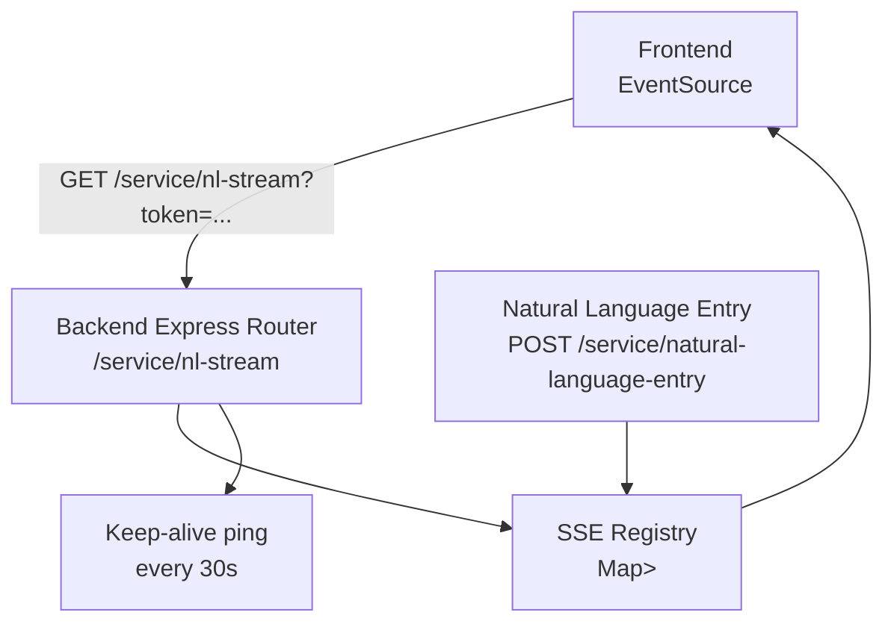
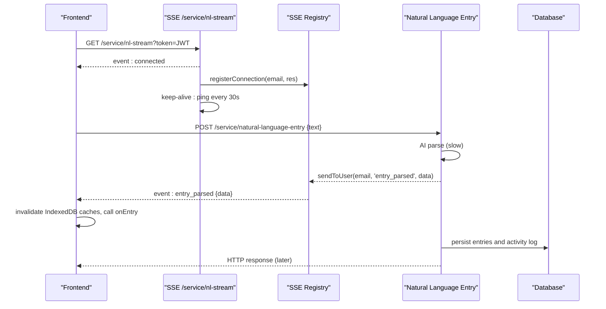
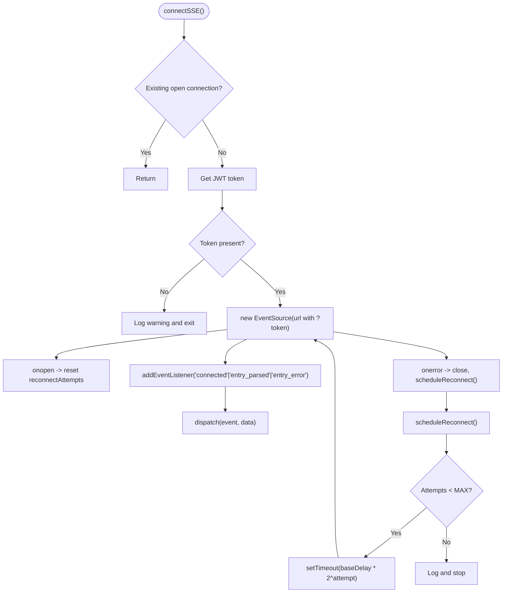
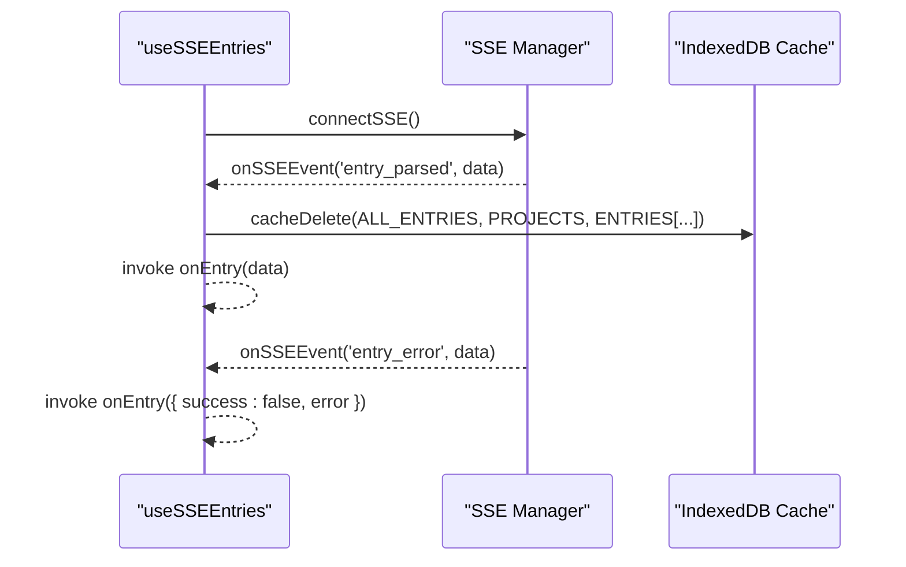
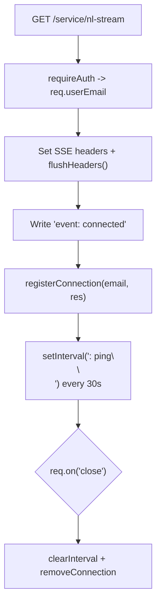
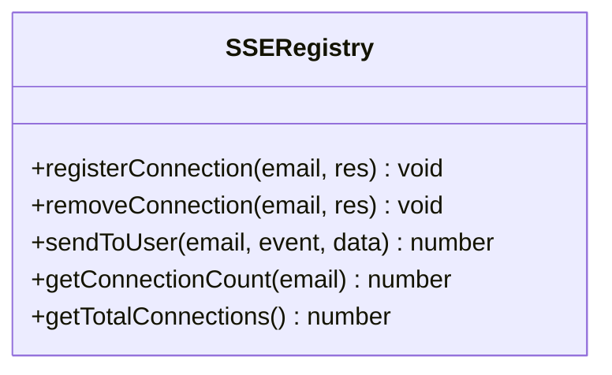
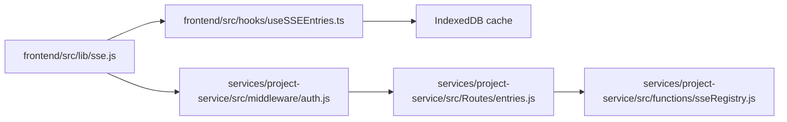

# Real-Time Communication (SSE)

<cite>
**Referenced Files in This Document**
- [sse.js](file://frontend/src/lib/sse.js)
- [useSSEEntries.ts](file://frontend/src/hooks/useSSEEntries.ts)
- [auth.js](file://services/project-service/src/middleware/auth.js)
- [entries.js](file://services/project-service/src/Routes/entries.js)
- [sseRegistry.js](file://services/project-service/src/functions/sseRegistry.js)
- [openapi.yaml](file://services/project-service/docs/openapi.yaml)
- [sse.md](file://docs-site/docs/Architecture/sse.md)
</cite>

## Table of Contents

1. [Introduction](#introduction)
2. [Project Structure](#project-structure)
3. [Core Components](#core-components)
4. [Architecture Overview](#architecture-overview)
5. [Detailed Component Analysis](#detailed-component-analysis)
6. [Dependency Analysis](#dependency-analysis)
7. [Performance Considerations](#performance-considerations)
8. [Troubleshooting Guide](#troubleshooting-guide)
9. [Conclusion](#conclusion)

## Introduction

This document explains the Server-Sent Events (SSE) implementation used by Codacaine to deliver real-time updates for natural language entry parsing. It covers how clients establish a persistent connection to /service/nl-stream with JWT authentication, the event types and message formats exchanged, client-side connection management and reconnection strategy, server-side SSE registry that tracks connections per user, and performance considerations for reliable streaming.

## Project Structure

The SSE feature spans both frontend and backend:

- Frontend:
  - Connection manager and event dispatcher: sse.js
  - React hook integrating SSE with IndexedDB cache invalidation and UI refresh: useSSEEntries.ts
- Backend:
  - Authentication middleware supporting query-token fallback for SSE: auth.js
  - SSE endpoint and integration with natural language processing: entries.js
  - In-memory registry to track active SSE connections per user: sseRegistry.js
  - API contract describing the SSE endpoint and events: openapi.yaml
  - Architecture documentation summarizing flow and rationale: sse.md

**Diagram sources**

- [entries.js:200-233](file://services/project-service/src/Routes/entries.js#L200-L233)
- [sseRegistry.js:17-74](file://services/project-service/src/functions/sseRegistry.js#L17-L74)
- [openapi.yaml:518-547](file://services/project-service/docs/openapi.yaml#L518-L547)

**Section sources**

- [sse.js:1-185](file://frontend/src/lib/sse.js#L1-L185)
- [useSSEEntries.ts:1-108](file://frontend/src/hooks/useSSEEntries.ts#L1-L108)
- [auth.js:27-70](file://services/project-service/src/middleware/auth.js#L27-L70)
- [entries.js:200-233](file://services/project-service/src/Routes/entries.js#L200-L233)
- [sseRegistry.js:1-104](file://services/project-service/src/functions/sseRegistry.js#L1-L104)
- [openapi.yaml:518-547](file://services/project-service/docs/openapi.yaml#L518-L547)
- [sse.md:1-217](file://docs-site/docs/Architecture/sse.md#L1-L217)

## Core Components

- Frontend SSE Manager (sse.js):
  - Opens EventSource to /service/nl-stream with token in query string
  - Handles connected, entry_parsed, entry_error events
  - Implements exponential backoff reconnection up to a maximum number of attempts
  - Provides connectSSE, disconnectSSE, onSSEEvent, isSSEConnected
- React Hook (useSSEEntries.ts):
  - Connects when user is authenticated and enabled
  - Listens for entry_parsed and entry_error
  - Invalidates IndexedDB caches based on affected projects and all-entries
  - Invokes caller-provided callback to refresh UI
- Backend SSE Endpoint (entries.js):
  - GET /service/nl-stream sets SSE headers, sends initial connected event, registers connection, pings every 30 seconds, cleans up on close
- SSE Registry (sseRegistry.js):
  - Tracks active responses per user email
  - sendToUser writes formatted SSE payloads to all matching connections
  - Removes dead connections on write errors
- Authentication (auth.js):
  - Accepts JWT via Authorization header or query parameter for SSE
  - Verifies token using Supabase JWKS and attaches req.userEmail

**Section sources**

- [sse.js:21-185](file://frontend/src/lib/sse.js#L21-L185)
- [useSSEEntries.ts:41-108](file://frontend/src/hooks/useSSEEntries.ts#L41-L108)
- [entries.js:200-233](file://services/project-service/src/Routes/entries.js#L200-L233)
- [sseRegistry.js:17-74](file://services/project-service/src/functions/sseRegistry.js#L17-L74)
- [auth.js:27-70](file://services/project-service/src/middleware/auth.js#L27-L70)

## Architecture Overview

The real-time flow enables near-instant UI updates after AI parsing completes, before the full POST response finishes.

**Diagram sources**

- [entries.js:200-233](file://services/project-service/src/Routes/entries.js#L200-L233)
- [entries.js:243-261](file://services/project-service/src/Routes/entries.js#L243-L261)
- [sseRegistry.js:47-74](file://services/project-service/src/functions/sseRegistry.js#L47-L74)
- [sse.js:55-96](file://frontend/src/lib/sse.js#L55-L96)
- [useSSEEntries.ts:55-98](file://frontend/src/hooks/useSSEEntries.ts#L55-L98)

## Detailed Component Analysis

### Frontend SSE Manager

- Establishes a single persistent EventSource connection guarded against duplicates
- Extracts JWT from session and appends as query parameter due to EventSource limitations
- Subscribes to named events: connected, entry_parsed, entry_error
- Implements exponential backoff reconnection with configurable base delay and max attempts
- Provides an event bus pattern via onSSEEvent with unsubscribe support

**Diagram sources**

- [sse.js:37-119](file://frontend/src/lib/sse.js#L37-L119)

**Section sources**

- [sse.js:21-185](file://frontend/src/lib/sse.js#L21-L185)

### React Hook: useSSEEntries

- Connects only when user exists and feature is enabled
- Listens for entry_parsed and entry_error
- Invalidates IndexedDB caches:
  - For multi-entry events: ALL_ENTRIES, PROJECTS, and per-project ENTRIES keys
  - For single-entry events: ENTRIES for the project, ALL_ENTRIES, and optionally PROJECTS if new project created
- Calls provided onEntry callback to trigger UI refresh

**Diagram sources**

- [useSSEEntries.ts:41-108](file://frontend/src/hooks/useSSEEntries.ts#L41-L108)

**Section sources**

- [useSSEEntries.ts:41-108](file://frontend/src/hooks/useSSEEntries.ts#L41-L108)

### Backend SSE Endpoint

- Validates user via middleware (requires auth)
- Sets SSE headers and flushes headers immediately
- Sends initial connected event
- Registers connection in registry
- Writes keep-alive comment every 30 seconds
- Cleans up interval and removes connection on request close

**Diagram sources**

- [entries.js:200-233](file://services/project-service/src/Routes/entries.js#L200-L233)

**Section sources**

- [entries.js:200-233](file://services/project-service/src/Routes/entries.js#L200-L233)

### SSE Registry

- Maintains Map<userEmail, Set<Response>>
- registerConnection adds response to user’s set
- removeConnection deletes response; prunes empty user sets
- sendToUser formats SSE payload and writes to all connections; removes dead ones on write failure
- getConnectionCount and getTotalConnections for diagnostics

**Diagram sources**

- [sseRegistry.js:17-96](file://services/project-service/src/functions/sseRegistry.js#L17-L96)

**Section sources**

- [sseRegistry.js:1-104](file://services/project-service/src/functions/sseRegistry.js#L1-L104)

### Authentication for SSE

- Supports standard Authorization: Bearer header and query parameter token for SSE
- Uses Supabase JWKS to verify tokens and ensures user row exists
- Attaches req.userEmail for downstream routes

**Section sources**

- [auth.js:27-70](file://services/project-service/src/middleware/auth.js#L27-L70)

### API Contract

- Defines GET /service/nl-stream with query token parameter
- Describes SSE stream content type and event types: connected, entry_parsed, entry_error, : ping

**Section sources**

- [openapi.yaml:518-547](file://services/project-service/docs/openapi.yaml#L518-L547)

## Dependency Analysis

- Frontend depends on:
  - Supabase session for JWT retrieval
  - IndexedDB cache utilities for invalidation
  - React context for authentication state
- Backend depends on:
  - Express router and middleware pipeline
  - SSE registry for fan-out to multiple clients
  - Natural language processing to produce structured data
  - Database for persistence and activity logging

**Diagram sources**

- [sse.js:10-185](file://frontend/src/lib/sse.js#L10-L185)
- [useSSEEntries.ts:13-108](file://frontend/src/hooks/useSSEEntries.ts#L13-L108)
- [auth.js:27-70](file://services/project-service/src/middleware/auth.js#L27-L70)
- [entries.js:200-233](file://services/project-service/src/Routes/entries.js#L200-L233)
- [sseRegistry.js:17-74](file://services/project-service/src/functions/sseRegistry.js#L17-L74)

**Section sources**

- [sse.js:10-185](file://frontend/src/lib/sse.js#L10-L185)
- [useSSEEntries.ts:13-108](file://frontend/src/hooks/useSSEEntries.ts#L13-L108)
- [auth.js:27-70](file://services/project-service/src/middleware/auth.js#L27-L70)
- [entries.js:200-233](file://services/project-service/src/Routes/entries.js#L200-L233)
- [sseRegistry.js:17-74](file://services/project-service/src/functions/sseRegistry.js#L17-L74)

## Performance Considerations

- Immediate feedback: SSE pushes parsed data before database writes complete, reducing perceived latency
- Keep-alive pings every 30 seconds prevent idle timeouts across proxies/load balancers
- Exponential backoff reconnection reduces load during outages while maintaining resilience
- Cache invalidation targets only affected stores/keys to minimize work
- Registry writes are lightweight; dead connections are removed on write errors to avoid resource leaks

[No sources needed since this section provides general guidance]

## Troubleshooting Guide

- 401 Unauthorized on SSE:
  - Ensure token is present in query string and valid
  - Verify middleware accepts query token and verifies via JWKS
- No events received:
  - Confirm connected event was dispatched
  - Check that registry has active connections for the user
  - Validate that sendToUser is called with correct user email
- Frequent reconnects:
  - Inspect network conditions and proxy buffering settings
  - Ensure keep-alive pings are not blocked
- Stale UI:
  - Verify cache invalidation paths in useSSEEntries match affected projects
  - Ensure onEntry callbacks trigger refetches

**Section sources**

- [auth.js:27-70](file://services/project-service/src/middleware/auth.js#L27-L70)
- [entries.js:200-233](file://services/project-service/src/Routes/entries.js#L200-L233)
- [sseRegistry.js:47-74](file://services/project-service/src/functions/sseRegistry.js#L47-L74)
- [useSSEEntries.ts:55-98](file://frontend/src/hooks/useSSEEntries.ts#L55-L98)

## Conclusion

Codacaine’s SSE implementation delivers fast, reliable, real-time updates for natural language entries. The frontend manages a robust, auto-reconnecting connection and integrates seamlessly with IndexedDB caching. The backend authenticates via JWT (with query token support), maintains a per-user connection registry, and streams events immediately after parsing. Together, these components provide responsive UI updates and efficient resource usage.
