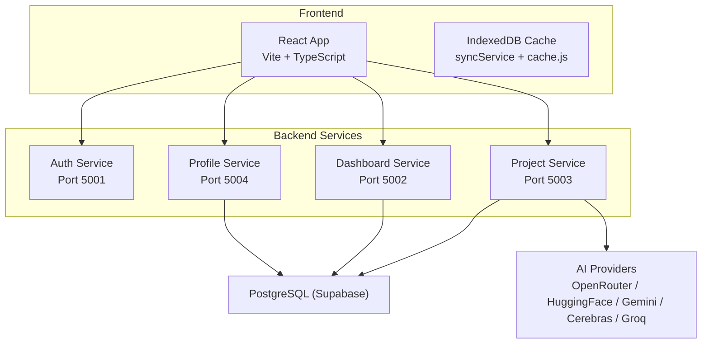
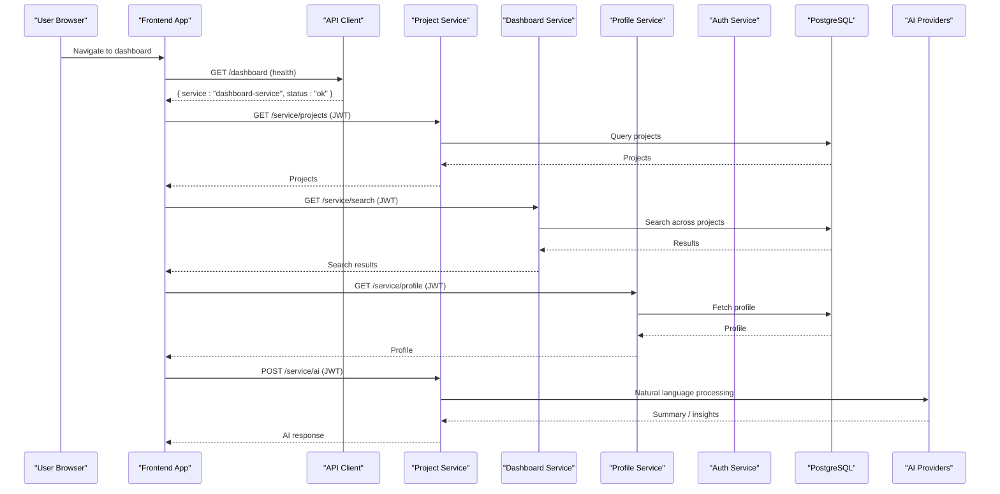
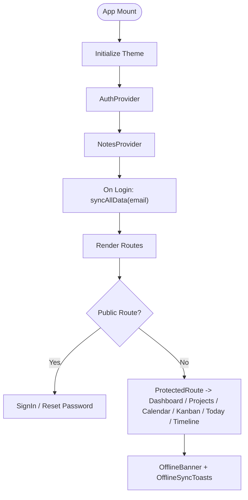
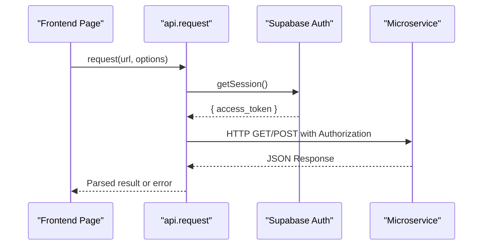
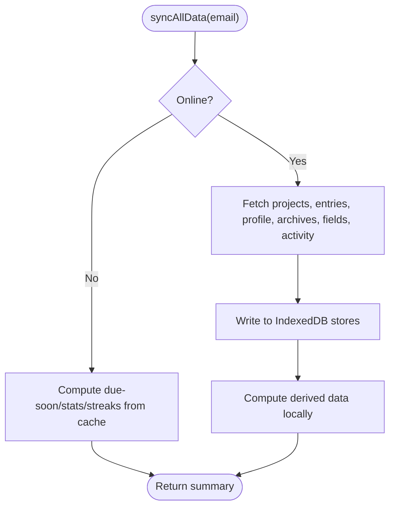
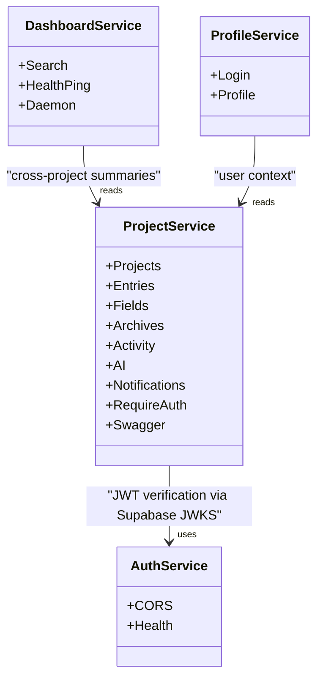
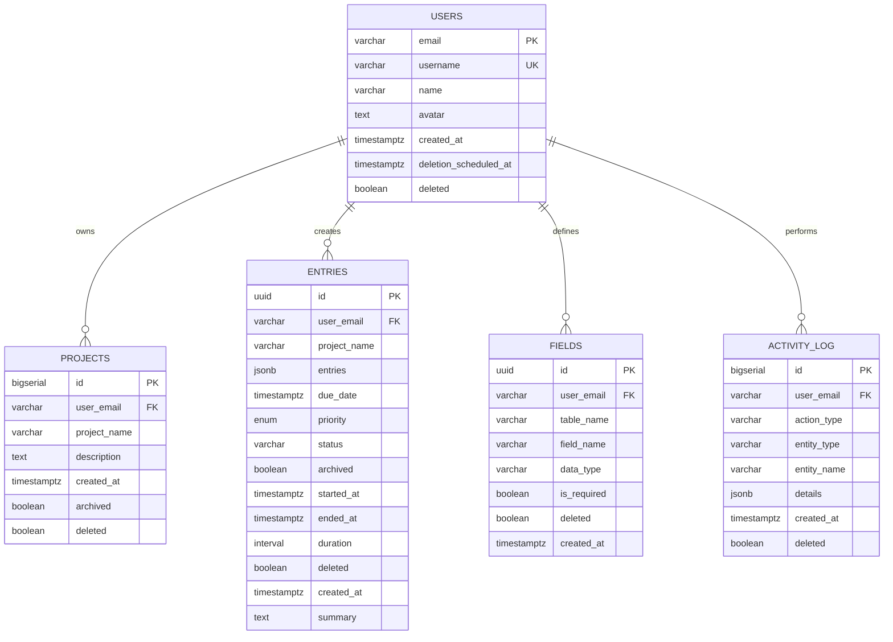
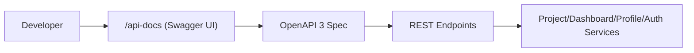
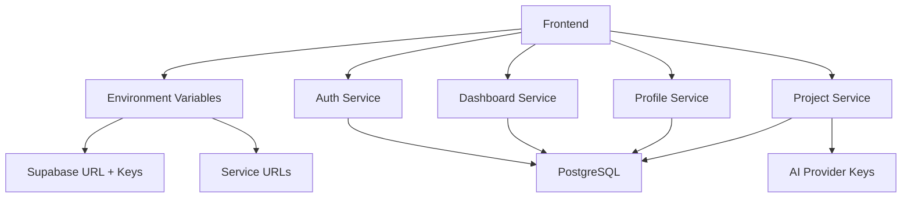

# Architecture Overview

<cite>
**Referenced Files in This Document**
- [README.md](file://README.md)
- [render.yaml](file://render.yaml)
- [services/README.md](file://services/README.md)
- [frontend/package.json](file://frontend/package.json)
- [frontend/src/App.tsx](file://frontend/src/App.tsx)
- [frontend/src/lib/api.ts](file://frontend/src/lib/api.ts)
- [frontend/src/lib/supabase.ts](file://frontend/src/lib/supabase.ts)
- [frontend/src/lib/cache.js](file://frontend/src/lib/cache.js)
- [frontend/src/CacheFunctions/index.js](file://frontend/src/CacheFunctions/index.js)
- [frontend/src/CacheFunctions/syncService.js](file://frontend/src/CacheFunctions/syncService.js)
- [services/auth-service/src/index.js](file://services/auth-service/src/index.js)
- [services/dashboard-service/src/index.js](file://services/dashboard-service/src/index.js)
- [services/profile-service/src/index.js](file://services/profile-service/src/index.js)
- [services/project-service/src/index.js](file://services/project-service/src/index.js)
- [services/project-service/docs/openapi.yaml](file://services/project-service/docs/openapi.yaml)
- [supabase/migrations/000_baseline_full_schema.sql](file://supabase/migrations/000_baseline_full_schema.sql)
</cite>

## Table of Contents

1. Introduction
2. Project Structure
3. Core Components
4. Architecture Overview
5. Detailed Component Analysis
6. Dependency Analysis
7. Performance Considerations
8. Troubleshooting Guide
9. Conclusion

## Introduction

Codacaine is a microservices-based digital logbook application with a React frontend and four independent Node.js/Express backend services. The system uses Supabase for authentication and PostgreSQL as the shared database, while each service exposes REST APIs consumed by the frontend. The architecture emphasizes clear service boundaries, offline-first data handling via IndexedDB caching, and background synchronization to keep the UI responsive even without network connectivity.

Key technologies:

- Frontend: React 19, TypeScript, Vite, Supabase client, IndexedDB (via idb/sql.js), Vitest for testing
- Backend: Node.js, Express, CORS, JWT verification (Supabase JWKS), OpenAPI/Swagger
- Database: PostgreSQL (via Supabase), versioned SQL migrations
- Deployment: Render platform with separate web services per microservice and static site hosting for docs

The project follows a monorepo layout where each service runs on its own port and communicates with the frontend over HTTP(S). Authentication is handled client-side using Supabase Auth tokens, which are attached to requests to protected endpoints.

**Section sources**

- [README.md:20-31](file://README.md#L20-L31)
- [README.md:79-109](file://README.md#L79-L109)
- [README.md:207-303](file://README.md#L207-L303)
- [frontend/package.json:16-42](file://frontend/package.json#L16-L42)
- [services/README.md:16-43](file://services/README.md#L16-L43)

## Project Structure

The repository is organized into:

- frontend: React app built with Vite and TypeScript; includes routing, contexts, components, pages, hooks, lib utilities, and an offline-first cache layer
- services: Four independent Express services (auth, dashboard, profile, project), each with its own package configuration and environment variables
- supabase: Versioned SQL migrations and setup scripts for schema evolution
- docs-site: MkDocs documentation source
- scripts: Database backup/restore and migration tools
- render.yaml: Deployment manifest defining all services on Render

**Diagram sources**

- [render.yaml:1-98](file://render.yaml#L1-L98)
- [services/auth-service/src/index.js:1-82](file://services/auth-service/src/index.js#L1-L82)
- [services/dashboard-service/src/index.js:1-87](file://services/dashboard-service/src/index.js#L1-L87)
- [services/profile-service/src/index.js:1-77](file://services/profile-service/src/index.js#L1-L77)
- [services/project-service/src/index.js:1-108](file://services/project-service/src/index.js#L1-L108)
- [frontend/src/lib/api.ts:1-70](file://frontend/src/lib/api.ts#L1-L70)
- [frontend/src/CacheFunctions/syncService.js:1-466](file://frontend/src/CacheFunctions/syncService.js#L1-L466)

**Section sources**

- [README.md:45-75](file://README.md#L45-L75)
- [render.yaml:1-98](file://render.yaml#L1-L98)

## Core Components

- Frontend App Shell and Routing: Centralized routes for public and protected pages, theme initialization, guided tour navigation, and offline indicators
- API Client: A unified request helper that attaches Supabase session tokens and enforces timeouts when calling backend services
- Offline-First Cache: A local-first sync engine that warms IndexedDB on login, reads from cache for instant UI, queues mutations offline, and reconciles with servers when online
- Microservices:
  - Auth Service: Health endpoint and CORS configuration; auth flows use Supabase client-side
  - Dashboard Service: Cross-project search and health ping; includes a daemon to keep Supabase warm
  - Profile Service: User profiles, avatars, preferences
  - Project Service: Projects, entries, fields, archives, activity logs, AI features, notifications; exposes OpenAPI/Swagger docs

**Section sources**

- [frontend/src/App.tsx:1-355](file://frontend/src/App.tsx#L1-L355)
- [frontend/src/lib/api.ts:1-70](file://frontend/src/lib/api.ts#L1-L70)
- [frontend/src/CacheFunctions/index.js:1-31](file://frontend/src/CacheFunctions/index.js#L1-L31)
- [frontend/src/CacheFunctions/syncService.js:1-466](file://frontend/src/CacheFunctions/syncService.js#L1-L466)
- [services/auth-service/src/index.js:1-82](file://services/auth-service/src/index.js#L1-L82)
- [services/dashboard-service/src/index.js:1-87](file://services/dashboard-service/src/index.js#L1-L87)
- [services/profile-service/src/index.js:1-77](file://services/profile-service/src/index.js#L1-L77)
- [services/project-service/src/index.js:1-108](file://services/project-service/src/index.js#L1-L108)

## Architecture Overview

High-level design:

- The React frontend is the user-facing layer, responsible for routing, state management, and offline-first data handling
- Each backend service owns a specific domain and exposes REST endpoints under a common path prefix (/service)
- All services share a PostgreSQL database via Supabase; the project service also integrates with external AI providers for natural-language features
- Authentication is performed client-side with Supabase Auth; JWTs are included in Authorization headers for protected endpoints
- The project service documents its API via OpenAPI 3 and serves Swagger UI at /api-docs

**Diagram sources**

- [frontend/src/lib/api.ts:1-70](file://frontend/src/lib/api.ts#L1-L70)
- [services/project-service/src/index.js:1-108](file://services/project-service/src/index.js#L1-L108)
- [services/dashboard-service/src/index.js:1-87](file://services/dashboard-service/src/index.js#L1-L87)
- [services/profile-service/src/index.js:1-77](file://services/profile-service/src/index.js#L1-L77)
- [services/auth-service/src/index.js:1-82](file://services/auth-service/src/index.js#L1-L82)
- [supabase/migrations/000_baseline_full_schema.sql:27-158](file://supabase/migrations/000_baseline_full_schema.sql#L27-L158)

## Detailed Component Analysis

### Frontend Application Shell and Routing

- Centralized routing defines public and protected routes, wrapping sensitive pages with a ProtectedRoute component
- Theme initialization applies data-theme early; notes overlay renders NotesPage over current view
- DataSyncInitializer triggers a full IndexedDB sync after login to warm the cache for immediate UI rendering
- OfflineBanner and OfflineSyncToasts provide user feedback about connectivity and queued actions

**Diagram sources**

- [frontend/src/App.tsx:1-355](file://frontend/src/App.tsx#L1-L355)

**Section sources**

- [frontend/src/App.tsx:38-61](file://frontend/src/App.tsx#L38-L61)
- [frontend/src/App.tsx:123-355](file://frontend/src/App.tsx#L123-L355)

### API Client and Service Endpoints

- Unified request helper fetches Supabase session token and attaches it as Bearer Authorization header
- Service URLs are configurable via environment variables with production fallbacks for project and profile services
- Default timeout set to accommodate cold starts and AI processing latency

**Diagram sources**

- [frontend/src/lib/api.ts:1-70](file://frontend/src/lib/api.ts#L1-L70)
- [frontend/src/lib/supabase.ts:1-34](file://frontend/src/lib/supabase.ts#L1-L34)

**Section sources**

- [frontend/src/lib/api.ts:1-70](file://frontend/src/lib/api.ts#L1-L70)
- [frontend/src/lib/supabase.ts:1-34](file://frontend/src/lib/supabase.ts#L1-L34)

### Offline-First Caching and Background Sync

- Local-first pattern: pages read from IndexedDB only; server calls populate and reconcile cache
- On login, syncAllData fetches projects, entries, profile, archives, fields, and activity; computes derived data (due-soon, stats, streaks) locally
- Throttling prevents duplicate concurrent syncs and recent-sync skipping reduces unnecessary network usage
- Offline mode preserves existing cache and computes derived views without server calls
- Mutation queue persists operations offline and processes them when connectivity returns

**Diagram sources**

- [frontend/src/CacheFunctions/syncService.js:1-466](file://frontend/src/CacheFunctions/syncService.js#L1-L466)
- [frontend/src/lib/cache.js:74-119](file://frontend/src/lib/cache.js#L74-L119)

**Section sources**

- [frontend/src/CacheFunctions/index.js:1-31](file://frontend/src/CacheFunctions/index.js#L1-L31)
- [frontend/src/CacheFunctions/syncService.js:75-154](file://frontend/src/CacheFunctions/syncService.js#L75-L154)
- [frontend/src/CacheFunctions/syncService.js:156-387](file://frontend/src/CacheFunctions/syncService.js#L156-L387)
- [frontend/src/CacheFunctions/syncService.js:389-466](file://frontend/src/CacheFunctions/syncService.js#L389-L466)
- [frontend/src/lib/cache.js:74-119](file://frontend/src/lib/cache.js#L74-L119)

### Microservices Boundaries and Responsibilities

- Auth Service: Minimal bootstrap, CORS, health endpoint; authentication is primarily client-side via Supabase
- Dashboard Service: Cross-project summaries and search; includes health-ping endpoint and a daemon to keep Supabase active
- Profile Service: User profile CRUD; routes mounted under /service
- Project Service: Domain-rich service handling projects, entries, fields, archives, activity logs, AI features, and notifications; JWT middleware protects /service routes; OpenAPI spec served at /api-docs

**Diagram sources**

- [services/auth-service/src/index.js:1-82](file://services/auth-service/src/index.js#L1-L82)
- [services/dashboard-service/src/index.js:1-87](file://services/dashboard-service/src/index.js#L1-L87)
- [services/profile-service/src/index.js:1-77](file://services/profile-service/src/index.js#L1-L77)
- [services/project-service/src/index.js:1-108](file://services/project-service/src/index.js#L1-L108)

**Section sources**

- [services/auth-service/src/index.js:1-82](file://services/auth-service/src/index.js#L1-L82)
- [services/dashboard-service/src/index.js:1-87](file://services/dashboard-service/src/index.js#L1-L87)
- [services/profile-service/src/index.js:1-77](file://services/profile-service/src/index.js#L1-L77)
- [services/project-service/src/index.js:1-108](file://services/project-service/src/index.js#L1-L108)

### Database Schema and Migrations

- Baseline schema defines users, projects, entries, fields, activity_log, health_ping, and ai_provider_cooldowns
- Indexes optimize queries on user_email, project_name, due_date, archived flags
- RPC functions support account lifecycle (delete/restore) with soft deletes and grace periods
- Migrations are versioned and idempotent, enabling safe upgrades without dropping tables

**Diagram sources**

- [supabase/migrations/000_baseline_full_schema.sql:27-158](file://supabase/migrations/000_baseline_full_schema.sql#L27-L158)

**Section sources**

- [supabase/migrations/000_baseline_full_schema.sql:27-158](file://supabase/migrations/000_baseline_full_schema.sql#L27-L158)

### API Contracts and Documentation

- OpenAPI 3 specification covers all endpoints across services, including request/response schemas and security scheme (Bearer JWT)
- Swagger UI is served at /api-docs on the project service, allowing interactive exploration and “Try it out” execution

**Diagram sources**

- [services/project-service/docs/openapi.yaml:1-200](file://services/project-service/docs/openapi.yaml#L1-L200)
- [services/project-service/src/index.js:58-75](file://services/project-service/src/index.js#L58-L75)

**Section sources**

- [services/project-service/docs/openapi.yaml:1-200](file://services/project-service/docs/openapi.yaml#L1-L200)
- [services/project-service/src/index.js:58-75](file://services/project-service/src/index.js#L58-L75)

## Dependency Analysis

- Frontend depends on:
  - Supabase client for authentication and direct DB interactions where appropriate
  - Backend services via configured base URLs; project and profile services have production fallbacks
  - IndexedDB for local caching and offline persistence
- Backend services depend on:
  - Shared PostgreSQL database via DATABASE_URL
  - Supabase credentials for auth-related operations
  - External AI provider keys for natural-language features (project service)
- Deployment dependencies:
  - Render platform provisions each service as a separate web process with defined ports and environment variables

**Diagram sources**

- [frontend/src/lib/api.ts:1-70](file://frontend/src/lib/api.ts#L1-L70)
- [render.yaml:1-98](file://render.yaml#L1-L98)
- [README.md:207-303](file://README.md#L207-L303)

**Section sources**

- [frontend/src/lib/api.ts:1-70](file://frontend/src/lib/api.ts#L1-L70)
- [render.yaml:1-98](file://render.yaml#L1-L98)
- [README.md:207-303](file://README.md#L207-L303)

## Performance Considerations

- Cold start mitigation: Dashboard service includes a health-ping endpoint and daemon to keep instances warm on Render free tier
- Request timeouts: Frontend sets a default timeout to handle long-running AI operations and cold starts gracefully
- Cache throttling: syncAllData prevents duplicate concurrent syncs and skips recent syncs to reduce load
- Local computation: Derived views (due-soon, stats, streaks) are computed from cached data, minimizing server round-trips
- Database indexing: Queries on user_email, project_name, due_date, and archived flags are optimized via indexes

[No sources needed since this section provides general guidance]

## Troubleshooting Guide

- CORS errors: Ensure allowed origins include your frontend’s development and production URLs; services validate origins dynamically
- Missing Supabase credentials: Frontend warns if Supabase client cannot be created; verify environment variables
- Service health checks: Use root endpoints to verify service status; dashboard-service exposes /service/health-ping for keep-alive monitoring
- Offline behavior: When offline, syncAllData computes derived data from cache; mutation queue persists until connectivity returns

**Section sources**

- [services/auth-service/src/index.js:17-33](file://services/auth-service/src/index.js#L17-L33)
- [services/dashboard-service/src/index.js:21-38](file://services/dashboard-service/src/index.js#L21-L38)
- [services/profile-service/src/index.js:21-40](file://services/profile-service/src/index.js#L21-L40)
- [services/project-service/src/index.js:35-51](file://services/project-service/src/index.js#L35-L51)
- [frontend/src/lib/supabase.ts:6-21](file://frontend/src/lib/supabase.ts#L6-L21)
- [services/dashboard-service/src/index.js:54-67](file://services/dashboard-service/src/index.js#L54-L67)

## Conclusion

Codacaine implements a robust microservices architecture with clear service boundaries, a resilient offline-first frontend, and a shared PostgreSQL database. The system balances scalability and simplicity by deploying each service independently on Render, leveraging Supabase for authentication and database operations, and integrating external AI providers where needed. The combination of IndexedDB caching, background synchronization, and well-documented REST APIs ensures a responsive user experience and maintainable codebase.

[No sources needed since this section summarizes without analyzing specific files]
