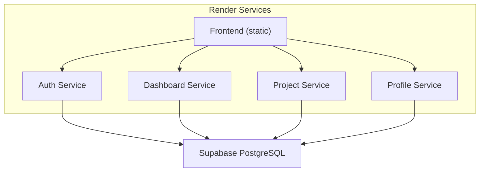
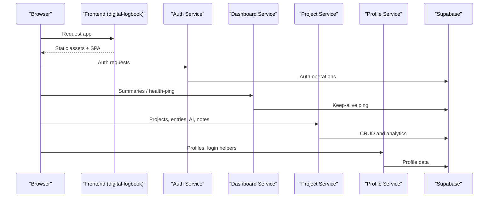
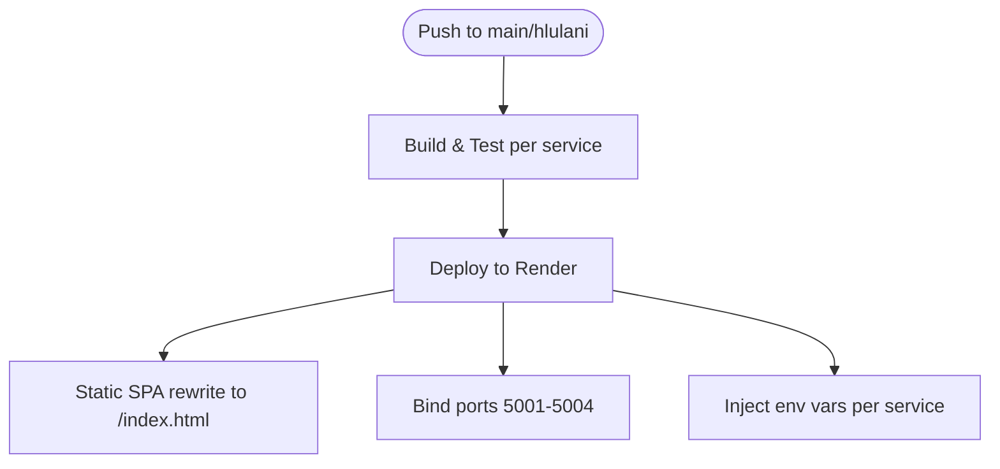
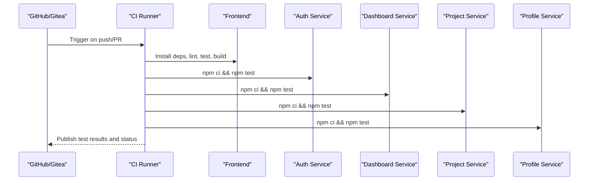
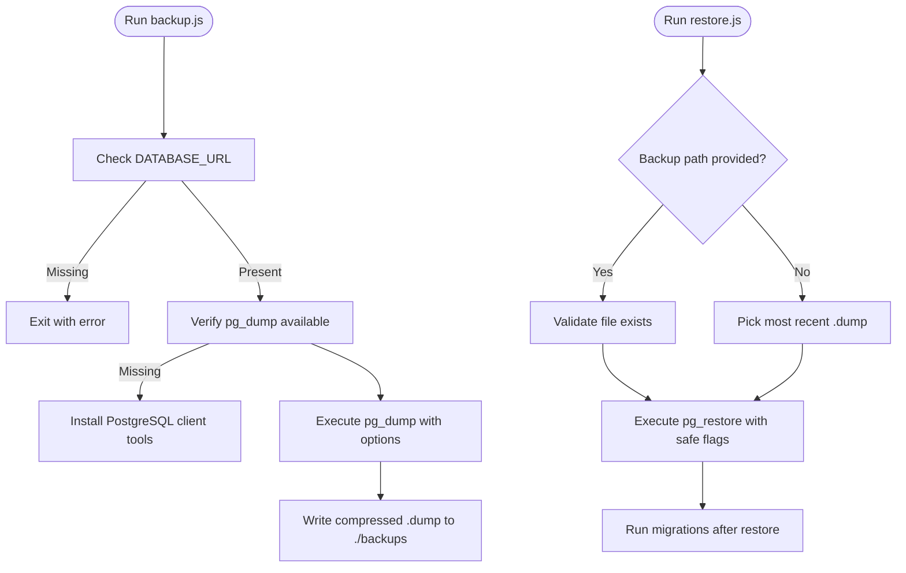
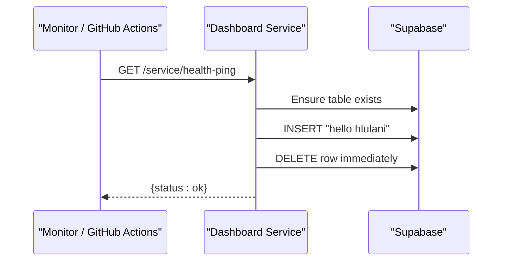
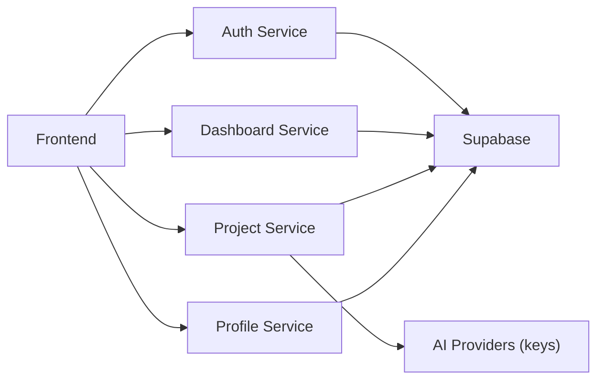

# Deployment Architecture

<cite>
**Referenced Files in This Document**
- [render.yaml](file://render.yaml)
- [services/README.md](file://services/README.md)
- [.gitea/workflows/ci.yml](file://.gitea/workflows/ci.yml)
- [.github/workflows/backend-unit-tests.yml](file://.github/workflows/backend-unit-tests.yml)
- [.github/workflows/frontend-unit-tests.yml](file://.github/workflows/frontend-unit-tests.yml)
- [services/auth-service/src/index.js](file://services/auth-service/src/index.js)
- [services/dashboard-service/src/index.js](file://services/dashboard-service/src/index.js)
- [services/profile-service/src/index.js](file://services/profile-service/src/index.js)
- [services/project-service/src/index.js](file://services/project-service/src/index.js)
- [supabase/migrations/006_create_health_ping_table.sql](file://supabase/migrations/006_create_health_ping_table.sql)
- [scripts/backup.js](file://scripts/backup.js)
- [scripts/restore.js](file://scripts/restore.js)
- [services/dashboard-service/src/functions/daemon.js](file://services/dashboard-service/src/functions/daemon.js)
</cite>

## Table of Contents

1. Introduction
2. Project Structure
3. Core Components
4. Architecture Overview
5. Detailed Component Analysis
6. Dependency Analysis
7. Performance Considerations
8. Troubleshooting Guide
9. Conclusion
10. Appendices

## Introduction

This document describes the deployment architecture for Codacaine, a multi-service application deployed on Render with each microservice running as an independent container and dedicated port. It covers CI/CD configuration using GitHub Actions and Gitea workflows, environment variable management, database migrations, backup and restore procedures, infrastructure setup (domains, SSL, routing), health checks, monitoring, scaling strategies, resource allocation, cost optimization, disaster recovery, and service restart protocols.

## Project Structure

Codacaine is organized as a monorepo with:

- A static React frontend built by Vite and served as a static site on Render
- Four Node.js/Express backend services: auth-service, dashboard-service, project-service, profile-service
- Supabase-managed PostgreSQL database used by all services
- CI/CD pipelines in both .github and .gitea directories
- Operational scripts for database backups and restores

**Diagram sources**

- [render.yaml:1-98](file://render.yaml#L1-L98)
- [services/auth-service/src/index.js:1-82](file://services/auth-service/src/index.js#L1-L82)
- [services/dashboard-service/src/index.js:1-87](file://services/dashboard-service/src/index.js#L1-L87)
- [services/profile-service/src/index.js:1-77](file://services/profile-service/src/index.js#L1-L77)
- [services/project-service/src/index.js:1-108](file://services/project-service/src/index.js#L1-L108)

**Section sources**

- [render.yaml:1-98](file://render.yaml#L1-L98)
- [services/README.md:16-45](file://services/README.md#L16-L45)

## Core Components

- Frontend: Static site built from the frontend directory; served via Render’s static hosting with SPA rewrite rules.
- Auth Service: Express server handling authentication flows against Supabase Auth.
- Dashboard Service: Provides cross-project summaries and includes a keep-alive daemon that pings Supabase to prevent inactivity pauses.
- Project Service: Handles project entries, timeline, search, stats, AI features, notes, and notifications; exposes OpenAPI/Swagger docs at /api-docs.
- Profile Service: Manages user profiles and login-related routes.

Each service runs on its own port and is independently deployable.

**Section sources**

- [render.yaml:19-90](file://render.yaml#L19-L90)
- [services/auth-service/src/index.js:1-82](file://services/auth-service/src/index.js#L1-L82)
- [services/dashboard-service/src/index.js:1-87](file://services/dashboard-service/src/index.js#L1-L87)
- [services/project-service/src/index.js:1-108](file://services/project-service/src/index.js#L1-L108)
- [services/profile-service/src/index.js:1-77](file://services/profile-service/src/index.js#L1-L77)

## Architecture Overview

The system deploys six Render services:

- digital-logbook (frontend static)
- auth-service (Node, port 5001)
- dashboard-service (Node, port 5002)
- project-service (Node, port 5003)
- profile-service (Node, port 5004)
- docs-site (static MkDocs site)

All backend services connect to Supabase using environment variables configured per service. The dashboard service includes a keep-alive mechanism to keep both Render and Supabase active.

**Diagram sources**

- [render.yaml:1-98](file://render.yaml#L1-L98)
- [services/dashboard-service/src/index.js:54-67](file://services/dashboard-service/src/index.js#L54-L67)
- [services/dashboard-service/src/functions/daemon.js:41-71](file://services/dashboard-service/src/functions/daemon.js#L41-L71)

**Section sources**

- [render.yaml:1-98](file://render.yaml#L1-L98)

## Detailed Component Analysis

### Render Deployment Configuration

- Each service is defined under services with type web, env, plan, rootDir, buildCommand, startCommand, and envVars.
- Frontend uses static hosting with SPA rewrite to index.html.
- Backend services use Node environment and explicit PORT values.
- Secrets are managed via Render environment variables (sync: false).

**Diagram sources**

- [render.yaml:1-98](file://render.yaml#L1-L98)

**Section sources**

- [render.yaml:1-98](file://render.yaml#L1-L98)

### CI/CD Pipelines (GitHub Actions and Gitea)

- Continuous Integration pipeline builds and tests frontend and all backend services.
- Separate unit test workflows run per service with JUnit reporting and artifacts.
- Frontend unit tests use Vitest with JUnit output.
- Gitea workflow mirrors CI steps for repository hosted on Gitea.

**Diagram sources**

- [.gitea/workflows/ci.yml:1-72](file://.gitea/workflows/ci.yml#L1-L72)
- [.github/workflows/backend-unit-tests.yml:1-68](file://.github/workflows/backend-unit-tests.yml#L1-L68)
- [.github/workflows/frontend-unit-tests.yml:1-58](file://.github/workflows/frontend-unit-tests.yml#L1-L58)

**Section sources**

- [.gitea/workflows/ci.yml:1-72](file://.gitea/workflows/ci.yml#L1-L72)
- [.github/workflows/backend-unit-tests.yml:1-68](file://.github/workflows/backend-unit-tests.yml#L1-L68)
- [.github/workflows/frontend-unit-tests.yml:1-58](file://.github/workflows/frontend-unit-tests.yml#L1-L58)

### Environment Variables Management

- Per-service environment variables are set in render.yaml under envVars.
- Frontend requires VITE_SUPABASE_URL and VITE_SUPABASE_ANON_KEY.
- Backend services require SUPABASE_URL and SUPABASE_KEY; project-service additionally uses SUPABASE_SERVICE_ROLE_KEY and various AI provider keys.
- Local development uses .env files per service as documented.

**Section sources**

- [render.yaml:13-89](file://render.yaml#L13-L89)
- [services/README.md:84-112](file://services/README.md#L84-L112)

### Database Migrations

- Supabase migrations define schema changes including tables for activity log, soft delete, health ping, summaries, project color, notes, and notifications.
- Health ping table supports keep-alive functionality to avoid Supabase inactivity pauses.

**Section sources**

- [supabase/migrations/006_create_health_ping_table.sql:1-22](file://supabase/migrations/006_create_health_ping_table.sql#L1-L22)

### Backup and Restore Procedures

- backup.js performs a PostgreSQL custom-format dump using pg_dump with schema filtering and portable flags.
- restore.js restores from a .dump file or the latest backup in ./backups, with safety prompts and migration reminder.
- Both scripts load DATABASE_URL from environment or .env files.

**Diagram sources**

- [scripts/backup.js:1-106](file://scripts/backup.js#L1-L106)
- [scripts/restore.js:1-137](file://scripts/restore.js#L1-L137)

**Section sources**

- [scripts/backup.js:1-106](file://scripts/backup.js#L1-L106)
- [scripts/restore.js:1-137](file://scripts/restore.js#L1-L137)

### Infrastructure Setup: Domain Routing, SSL, Load Balancing

- Render provides HTTPS automatically for web services; domains are assigned per service.
- Frontend SPA routing rewrites all paths to index.html for client-side routing.
- CORS is configured per service to allow specific origins including local development and production Render URLs.
- No explicit load balancer is configured; each service runs as a single instance on the free plan. For higher availability, consider upgrading plans and enabling multiple instances or using a reverse proxy.

**Section sources**

- [render.yaml:9-17](file://render.yaml#L9-L17)
- [services/auth-service/src/index.js:7-33](file://services/auth-service/src/index.js#L7-L33)
- [services/dashboard-service/src/index.js:12-38](file://services/dashboard-service/src/index.js#L12-L38)
- [services/profile-service/src/index.js:12-40](file://services/profile-service/src/index.js#L12-L40)
- [services/project-service/src/index.js:25-51](file://services/project-service/src/index.js#L25-L51)

### Health Check Endpoints and Monitoring

- Root endpoints return health status JSON for each service.
- Dashboard service exposes /service/health-ping which triggers a Supabase ping to keep the database active and can be used for uptime monitoring.
- The keep-alive daemon inserts and deletes a row in the health_ping table to maintain activity without persistent storage.

**Diagram sources**

- [services/dashboard-service/src/index.js:54-67](file://services/dashboard-service/src/index.js#L54-L67)
- [services/dashboard-service/src/functions/daemon.js:41-71](file://services/dashboard-service/src/functions/daemon.js#L41-L71)
- [supabase/migrations/006_create_health_ping_table.sql:7-22](file://supabase/migrations/006_create_health_ping_table.sql#L7-L22)

**Section sources**

- [services/auth-service/src/index.js:50-52](file://services/auth-service/src/index.js#L50-L52)
- [services/dashboard-service/src/index.js:48-67](file://services/dashboard-service/src/index.js#L48-L67)
- [services/profile-service/src/index.js:50-52](file://services/profile-service/src/index.js#L50-L52)
- [services/project-service/src/index.js:76-78](file://services/project-service/src/index.js#L76-L78)

### Scaling Strategies, Resource Allocation, Cost Optimization

- Current deployment uses free tier for all services; each service runs as a single instance.
- To scale horizontally, upgrade to paid Render plans and enable multiple instances per service; configure a reverse proxy or Render’s built-in routing if needed.
- Optimize costs by:
  - Keeping only necessary services enabled
  - Using efficient queries and caching where appropriate
  - Limiting large payloads (project-service sets request body limit)
  - Avoiding unnecessary external API calls in hot paths
- Use health-ping endpoint to keep services warm and reduce cold-start latency on free tier.

[No sources needed since this section provides general guidance]

### Disaster Recovery, Database Backups, Service Restart Protocols

- Regularly run backup.js to produce timestamped .dump files; store backups securely off-repository.
- Use restore.js to recover from backups; ensure migrations are applied post-restore.
- Service restarts:
  - Trigger redeployments via CI/CD on pushes to protected branches
  - Use Render dashboard to restart individual services if needed
  - Verify health endpoints after restarts
- In case of database issues, validate connectivity and permissions; review logs and health-ping responses.

**Section sources**

- [scripts/backup.js:1-106](file://scripts/backup.js#L1-L106)
- [scripts/restore.js:1-137](file://scripts/restore.js#L1-L137)

## Dependency Analysis

Services depend on:

- Supabase for authentication and database operations
- External AI providers via environment keys (project-service)
- Express framework and CORS middleware
- Optional Swagger UI for API documentation (project-service)

**Diagram sources**

- [render.yaml:19-90](file://render.yaml#L19-L90)
- [services/project-service/src/index.js:18-34](file://services/project-service/src/index.js#L18-L34)

**Section sources**

- [render.yaml:19-90](file://render.yaml#L19-L90)
- [services/project-service/src/index.js:18-34](file://services/project-service/src/index.js#L18-L34)

## Performance Considerations

- Request body size limits: project-service sets a 5MB limit to handle larger payloads safely.
- Keep-alive mechanism reduces cold starts and prevents Supabase inactivity pauses.
- Minimize external API calls and cache responses where feasible.
- Use efficient queries and avoid N+1 patterns in database interactions.

**Section sources**

- [services/project-service/src/index.js:56-56](file://services/project-service/src/index.js#L56-L56)
- [services/dashboard-service/src/functions/daemon.js:41-71](file://services/dashboard-service/src/functions/daemon.js#L41-L71)

## Troubleshooting Guide

Common issues and resolutions:

- CORS errors: Ensure allowed origins include your frontend domain; verify credentials and headers.
- Health-ping failures: Check database connectivity and pool availability; review 503 degraded responses.
- Backup/restore errors: Confirm DATABASE_URL is set and PostgreSQL client tools are installed; verify .dump file integrity.
- Service startup failures: Validate environment variables and dependencies; check logs for unhandled errors.

**Section sources**

- [services/auth-service/src/index.js:61-69](file://services/auth-service/src/index.js#L61-L69)
- [services/dashboard-service/src/index.js:69-78](file://services/dashboard-service/src/index.js#L69-L78)
- [services/profile-service/src/index.js:57-72](file://services/profile-service/src/index.js#L57-L72)
- [services/project-service/src/index.js:94-103](file://services/project-service/src/index.js#L94-L103)
- [scripts/backup.js:45-76](file://scripts/backup.js#L45-L76)
- [scripts/restore.js:36-98](file://scripts/restore.js#L36-L98)

## Conclusion

Codacaine’s deployment architecture leverages Render’s managed hosting to run independent microservices with clear separation of concerns, robust CI/CD pipelines, and operational tooling for backups and health monitoring. The keep-alive strategy ensures reliability on free tiers, while structured environment management and migration practices support consistent deployments. Future enhancements can focus on horizontal scaling, advanced monitoring, and automated disaster recovery workflows.

[No sources needed since this section summarizes without analyzing specific files]

## Appendices

### Service Ports and URLs

- Frontend: Static site with SPA rewrite
- Auth Service: Port 5001
- Dashboard Service: Port 5002
- Project Service: Port 5003
- Profile Service: Port 5004
- Docs Site: Static MkDocs site

**Section sources**

- [render.yaml:19-98](file://render.yaml#L19-L98)

### OpenAPI Documentation

- Project service exposes Swagger UI at /api-docs for interactive API exploration.

**Section sources**

- [services/project-service/src/index.js:58-75](file://services/project-service/src/index.js#L58-L75)
