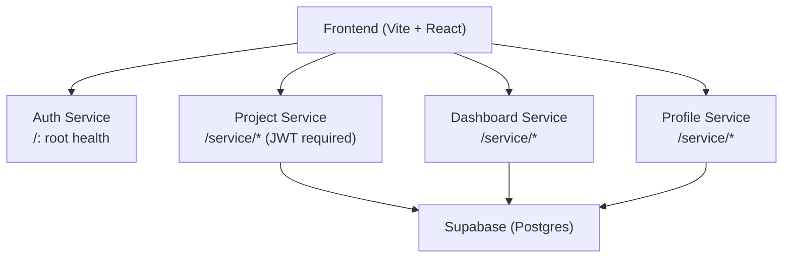
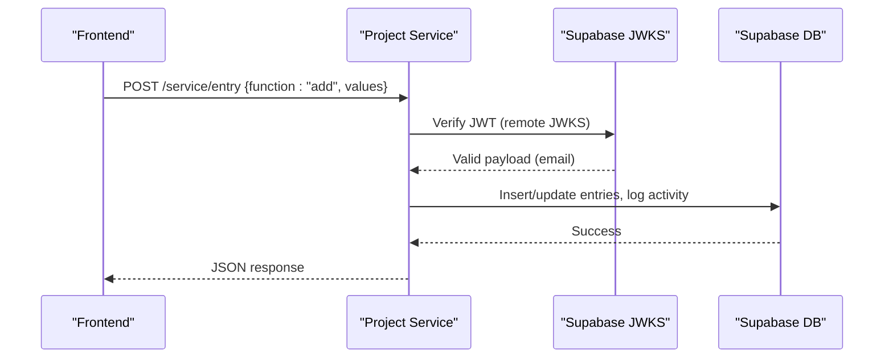
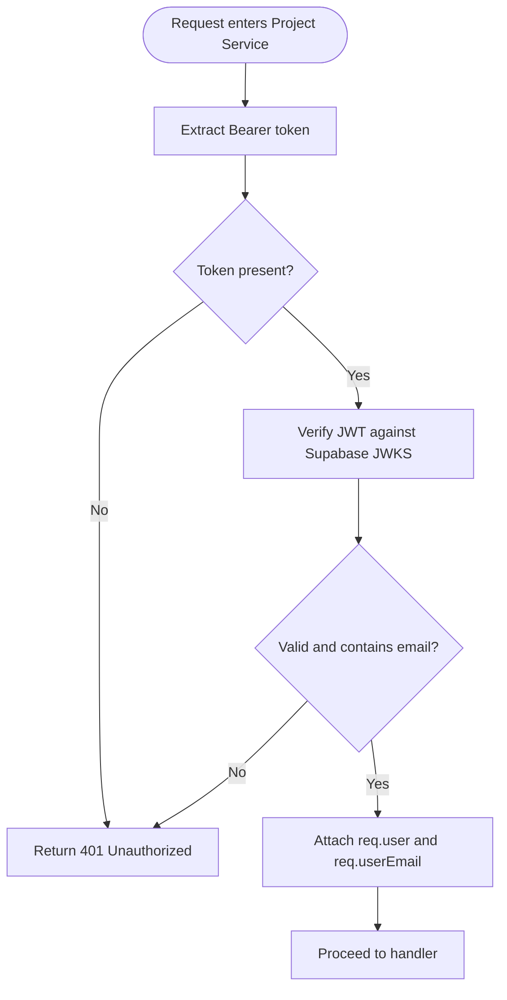
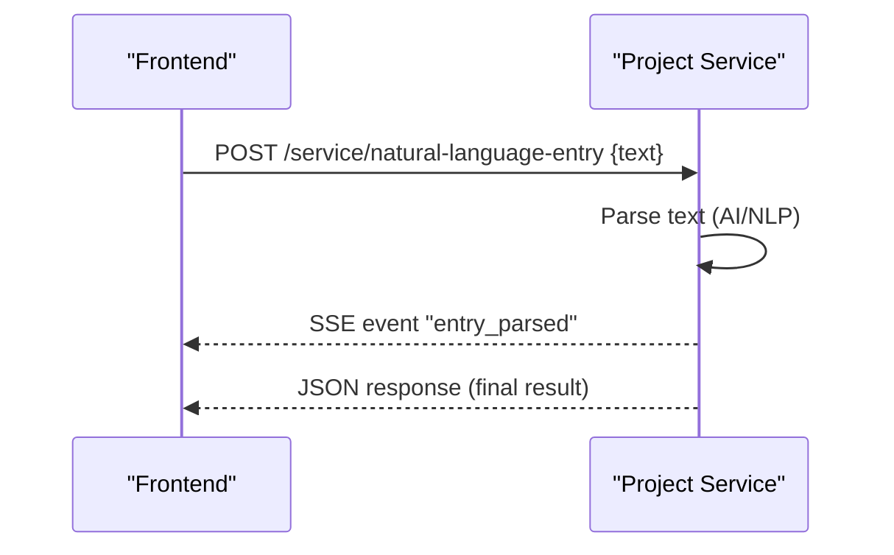
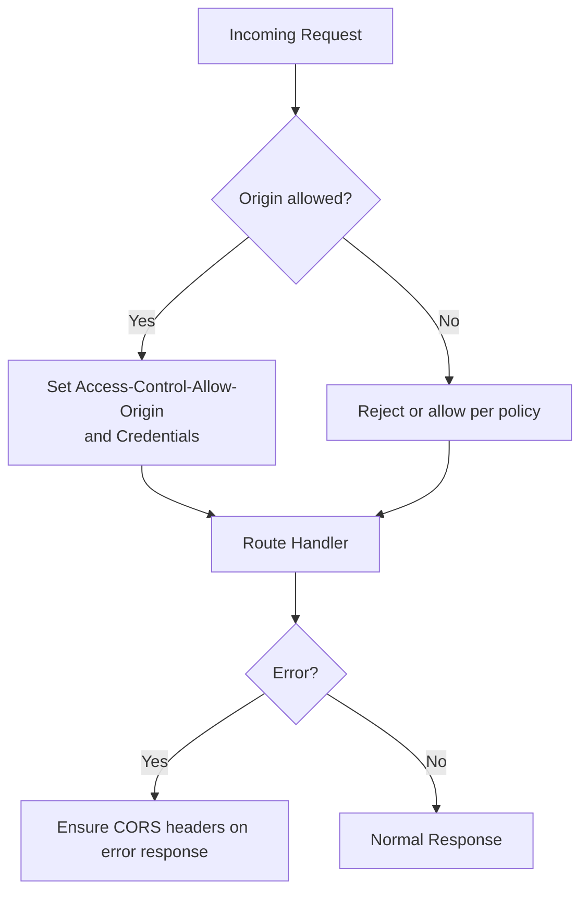
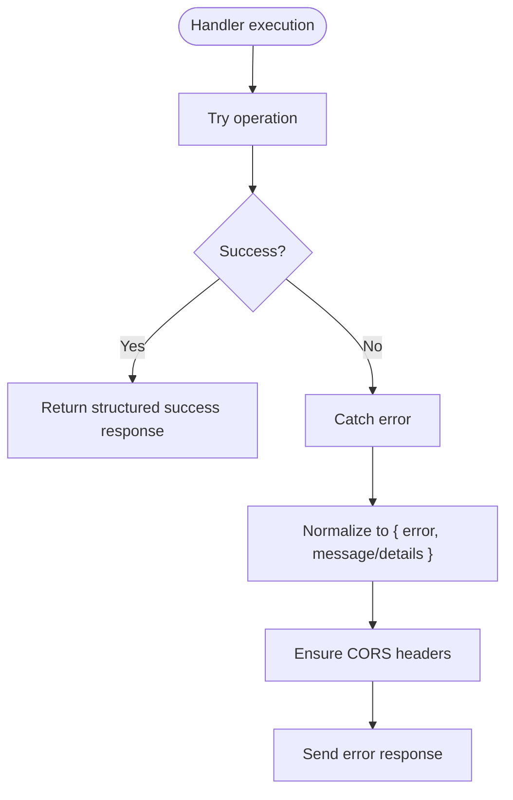
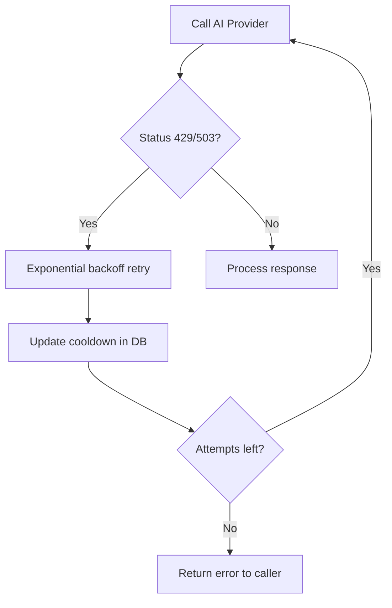
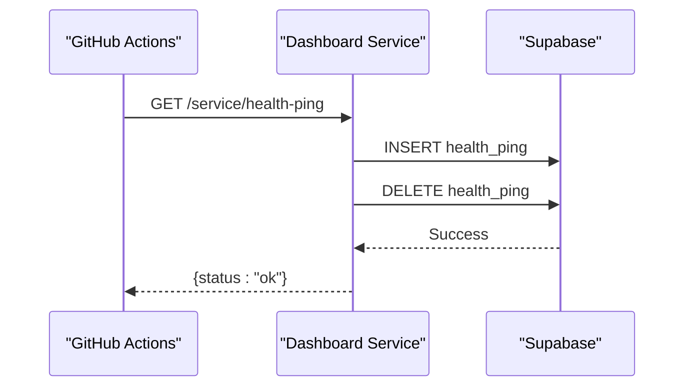
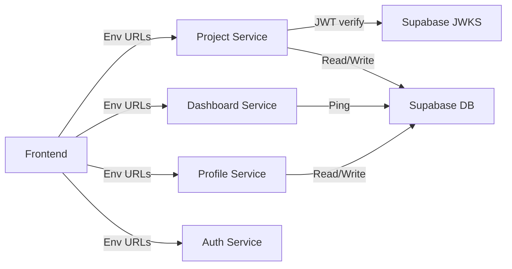

# Microservices Communication

<cite>
**Referenced Files in This Document**
- [index.js](file://services/auth-service/src/index.js)
- [index.js](file://services/profile-service/src/index.js)
- [login.js](file://services/profile-service/src/Routes/login.js)
- [profile.js](file://services/profile-service/src/Routes/profile.js)
- [index.js](file://services/dashboard-service/src/index.js)
- [search.js](file://services/dashboard-service/src/Routes/search.js)
- [daemon.js](file://services/dashboard-service/src/functions/daemon.js)
- [index.js](file://services/project-service/src/index.js)
- [auth.js](file://services/project-service/src/middleware/auth.js)
- [entries.js](file://services/project-service/src/Routes/entries.js)
- [openapi.yaml](file://services/project-service/docs/openapi.yaml)
- [api.ts](file://frontend/src/lib/api.ts)
</cite>

## Table of Contents

1. Introduction
2. Project Structure
3. Core Components
4. Architecture Overview
5. Detailed Component Analysis
6. Dependency Analysis
7. Performance Considerations
8. Troubleshooting Guide
9. Conclusion

## Introduction

This document explains how the four independent services in the Codacaine architecture communicate via REST APIs, how authentication is enforced with JWT tokens issued by Supabase, and how the frontend routes requests to the appropriate service. It also covers CORS configuration, error handling strategies across service boundaries, inter-service communication patterns (including Server-Sent Events), rate limiting considerations, and monitoring approaches for health checks and performance metrics.

## Project Structure

The system consists of four Node/Express services and a React/Vite frontend:

- Auth Service: Health endpoint and CORS configuration; authentication is handled client-side using Supabase.
- Profile Service: User profile operations exposed under /service.
- Dashboard Service: Cross-project search and health-ping endpoints; includes a keep-alive daemon.
- Project Service: Projects, entries, fields, archives, activity, AI, notes, notifications; protected by JWT middleware.
- Frontend: Centralized API client that attaches Supabase access tokens and routes calls to service URLs configured via environment variables.



**Diagram sources**

- [index.js:1-82](file://services/auth-service/src/index.js#L1-L82)
- [index.js:1-77](file://services/profile-service/src/index.js#L1-L77)
- [index.js:1-87](file://services/dashboard-service/src/index.js#L1-L87)
- [index.js:1-108](file://services/project-service/src/index.js#L1-L108)
- [openapi.yaml:1-35](file://services/project-service/docs/openapi.yaml#L1-L35)

**Section sources**

- [index.js:1-82](file://services/auth-service/src/index.js#L1-L82)
- [index.js:1-77](file://services/profile-service/src/index.js#L1-L77)
- [index.js:1-87](file://services/dashboard-service/src/index.js#L1-L87)
- [index.js:1-108](file://services/project-service/src/index.js#L1-L108)
- [openapi.yaml:1-35](file://services/project-service/docs/openapi.yaml#L1-L35)

## Core Components

- Authentication: Services validate JWTs using Supabase’s JWKS endpoint. The project service enforces this via middleware on all /service routes except explicitly public ones.
- Service Discovery: The frontend uses environment variables to resolve service URLs at runtime.
- RPC-style dispatch: Many services accept POST payloads with { function, values } to route to specific handlers within a single resource endpoint.
- Real-time updates: Project service exposes an SSE stream for natural language entry parsing results.
- Health and monitoring: Each service exposes a root health endpoint; dashboard service provides a dedicated health-ping endpoint backed by a daemon.

Key implementation references:

- JWT verification and user provisioning: [auth.js:1-71](file://services/project-service/src/middleware/auth.js#L1-L71)
- Frontend token attachment and routing: [api.ts:1-70](file://frontend/src/lib/api.ts#L1-L70)
- OpenAPI contract and server URLs: [openapi.yaml:1-35](file://services/project-service/docs/openapi.yaml#L1-L35)

**Section sources**

- [auth.js:1-71](file://services/project-service/src/middleware/auth.js#L1-L71)
- [api.ts:1-70](file://frontend/src/lib/api.ts#L1-L70)
- [openapi.yaml:1-35](file://services/project-service/docs/openapi.yaml#L1-L35)

## Architecture Overview

The frontend communicates directly with each service over HTTPS. Requests to the project service require a valid Supabase JWT in the Authorization header. The project service verifies the token against Supabase’s JWKS and attaches the verified user email to the request context. Some operations trigger background tasks or real-time events (e.g., SSE).



**Diagram sources**

- [auth.js:19-71](file://services/project-service/src/middleware/auth.js#L19-L71)
- [entries.js:23-191](file://services/project-service/src/Routes/entries.js#L23-L191)
- [openapi.yaml:36-45](file://services/project-service/docs/openapi.yaml#L36-L45)

**Section sources**

- [auth.js:1-71](file://services/project-service/src/middleware/auth.js#L1-L71)
- [entries.js:1-191](file://services/project-service/src/Routes/entries.js#L1-L191)
- [openapi.yaml:36-45](file://services/project-service/docs/openapi.yaml#L36-L45)

## Detailed Component Analysis

### Authentication Flow (JWT Validation)

- The frontend obtains a Supabase access token and attaches it to every request via the Authorization header.
- The project service middleware extracts the token from either the Authorization header or query parameter (for SSE), verifies it using jose against Supabase’s JWKS, and attaches req.user and req.userEmail.
- If verification fails or the token lacks an email, the service returns 401 with a consistent error shape.



**Diagram sources**

- [auth.js:27-71](file://services/project-service/src/middleware/auth.js#L27-L71)

**Section sources**

- [auth.js:1-71](file://services/project-service/src/middleware/auth.js#L1-L71)
- [api.ts:10-57](file://frontend/src/lib/api.ts#L10-L57)

### Service Endpoints and Request/Response Formats

All services use Express and expose endpoints under /service (except auth-service root). A common pattern is RPC-style dispatch: POST to a resource endpoint with a body containing function and values.

- Auth Service
  - GET / : Returns a health status object.
  - CORS: Configured with allowed origins and credentials enabled.

- Profile Service
  - POST /service/login: Dispatches login-related functions (e.g., checkUser).
  - POST /service/profile: Dispatches profile operations (username, email, name, avatar, getProfile, emailNotifications, deleteProfile).
  - Error responses include error and details fields.

- Dashboard Service
  - POST /service/search: Dispatches search functions (searchAll, searchProject, searchProjects).
  - GET /service/health-ping: Pings Supabase to keep the instance warm; returns status ok/degraded/error.

- Project Service
  - POST /service/entry: Dispatches entry operations (add, update, delete, deleteById, get, getAll, sortUnarchived, sortArchived).
  - GET /service/nl-stream: SSE endpoint for real-time natural language entry updates.
  - POST /service/natural-language-entry: Parses natural language input and pushes parsed data via SSE before completing the response.
  - All /service routes are protected by JWT middleware except explicitly public ones.

```mermaid
classDiagram
class ProjectService {
"+POST /service/entry"
"+GET /service/nl-stream"
"+POST /service/natural-language-entry"
"+requireAuth()"
}
class ProfileService {
"+POST /service/login"
"+POST /service/profile"
}
class DashboardService {
"+POST /service/search"
"+GET /service/health-ping"
}
class AuthService {
"+GET /"
}
ProjectService --> "uses" ProfileService : "via env URLs"
ProjectService --> "uses" DashboardService : "via env URLs"
ProjectService --> "uses" AuthService : "via env URLs"
```

**Diagram sources**

- [index.js:76-93](file://services/project-service/src/index.js#L76-L93)
- [entries.js:23-328](file://services/project-service/src/Routes/entries.js#L23-L328)
- [login.js:19-49](file://services/profile-service/src/Routes/login.js#L19-L49)
- [profile.js:31-104](file://services/profile-service/src/Routes/profile.js#L31-L104)
- [search.js:19-58](file://services/dashboard-service/src/Routes/search.js#L19-L58)
- [index.js:54-67](file://services/dashboard-service/src/index.js#L54-L67)
- [index.js:50-52](file://services/auth-service/src/index.js#L50-L52)

**Section sources**

- [index.js:1-82](file://services/auth-service/src/index.js#L1-L82)
- [login.js:1-52](file://services/profile-service/src/Routes/login.js#L1-L52)
- [profile.js:1-107](file://services/profile-service/src/Routes/profile.js#L1-L107)
- [search.js:1-61](file://services/dashboard-service/src/Routes/search.js#L1-L61)
- [index.js:1-87](file://services/dashboard-service/src/index.js#L1-L87)
- [index.js:1-108](file://services/project-service/src/index.js#L1-L108)
- [entries.js:1-328](file://services/project-service/src/Routes/entries.js#L1-L328)

### Inter-Service Communication Patterns

- Direct HTTP calls: The frontend resolves service URLs from environment variables and calls each service independently.
- RPC-style dispatch: Multiple operations share a single endpoint, reducing routing complexity and enabling centralized validation and logging.
- Real-time updates: The project service opens an SSE stream (/service/nl-stream) and pushes parsed entry data immediately after processing natural language input, improving perceived latency.



**Diagram sources**

- [entries.js:200-328](file://services/project-service/src/Routes/entries.js#L200-L328)

**Section sources**

- [entries.js:200-328](file://services/project-service/src/Routes/entries.js#L200-L328)

### CORS Configuration

Each service configures CORS with:

- Allowed origins list including production domains and local development addresses.
- Credentials enabled for cookies/session support.
- Explicit preflight handling for Express 5 compatibility.
- Global error handlers that ensure CORS headers are set even on errors.



**Diagram sources**

- [index.js:17-47](file://services/auth-service/src/index.js#L17-L47)
- [index.js:22-47](file://services/profile-service/src/index.js#L22-L47)
- [index.js:22-47](file://services/dashboard-service/src/index.js#L22-L47)
- [index.js:35-56](file://services/project-service/src/index.js#L35-L56)

**Section sources**

- [index.js:17-69](file://services/auth-service/src/index.js#L17-L69)
- [index.js:22-72](file://services/profile-service/src/index.js#L22-L72)
- [index.js:22-78](file://services/dashboard-service/src/index.js#L22-L78)
- [index.js:35-103](file://services/project-service/src/index.js#L35-L103)

### Error Handling Strategies

- Consistent error shapes:
  - General errors return { error, message } or { error, details }.
  - Entry-specific errors include success flag and error/message fields.
- Global error handlers ensure CORS headers are attached to error responses.
- Client-side timeout: The frontend wraps fetch with AbortController and throws a descriptive timeout error.



**Diagram sources**

- [index.js:61-69](file://services/auth-service/src/index.js#L61-L69)
- [index.js:58-72](file://services/profile-service/src/index.js#L58-L72)
- [index.js:69-78](file://services/dashboard-service/src/index.js#L69-L78)
- [index.js:95-103](file://services/project-service/src/index.js#L95-L103)
- [api.ts:10-57](file://frontend/src/lib/api.ts#L10-L57)

**Section sources**

- [index.js:61-69](file://services/auth-service/src/index.js#L61-L69)
- [index.js:58-72](file://services/profile-service/src/index.js#L58-L72)
- [index.js:69-78](file://services/dashboard-service/src/index.js#L69-L78)
- [index.js:95-103](file://services/project-service/src/index.js#L95-L103)
- [api.ts:10-57](file://frontend/src/lib/api.ts#L10-L57)

### Rate Limiting Considerations

- External provider rate limiting: The project service’s AI integration detects rate-limited responses (e.g., 429/503) and applies exponential backoff retries with cooldown tracking in the database.
- Frontend timeouts: Long-running requests (e.g., AI processing) use a configurable timeout to avoid hanging indefinitely.



**Diagram sources**

- [ai.js:152-170](file://services/project-service/src/functions/ai.js#L152-L170)
- [ai.js:338-383](file://services/project-service/src/functions/ai.js#L338-L383)

**Section sources**

- [ai.js:152-170](file://services/project-service/src/functions/ai.js#L152-L170)
- [ai.js:338-383](file://services/project-service/src/functions/ai.js#L338-L383)
- [api.ts:8-27](file://frontend/src/lib/api.ts#L8-L27)

### Monitoring and Health Checks

- Root health endpoints: Each service returns a simple health object at /.
- Dashboard health-ping: /service/health-ping triggers a lightweight database ping to keep the service and database warm; returns ok/degraded/error.
- Keep-alive daemon: Runs periodically to insert and delete a row in a health_ping table, ensuring Supabase remains active.



**Diagram sources**

- [index.js:54-67](file://services/dashboard-service/src/index.js#L54-L67)
- [daemon.js:45-71](file://services/dashboard-service/src/functions/daemon.js#L45-L71)

**Section sources**

- [index.js:48-67](file://services/dashboard-service/src/index.js#L48-L67)
- [daemon.js:1-135](file://services/dashboard-service/src/functions/daemon.js#L1-L135)

## Dependency Analysis

- Frontend depends on environment-configured service URLs and attaches Supabase JWTs automatically.
- Project service depends on:
  - Supabase JWKS for JWT verification.
  - Database pool for persistence and activity logging.
  - Optional AI providers for natural language parsing.
- Dashboard service depends on:
  - Database pool for health pings.
  - Cron-like scheduling via GitHub Actions and internal daemon.



**Diagram sources**

- [api.ts:1-7](file://frontend/src/lib/api.ts#L1-L7)
- [auth.js:21-26](file://services/project-service/src/middleware/auth.js#L21-L26)
- [index.js:54-67](file://services/dashboard-service/src/index.js#L54-L67)
- [index.js:83-93](file://services/project-service/src/index.js#L83-L93)

**Section sources**

- [api.ts:1-70](file://frontend/src/lib/api.ts#L1-L70)
- [auth.js:1-71](file://services/project-service/src/middleware/auth.js#L1-L71)
- [index.js:54-67](file://services/dashboard-service/src/index.js#L54-L67)
- [index.js:83-93](file://services/project-service/src/index.js#L83-L93)

## Performance Considerations

- Timeouts: The frontend sets a default 90-second timeout to accommodate cold starts and AI processing; this can be overridden per request.
- Background processing: Summary regeneration and activity logging occur asynchronously to reduce response latency.
- SSE keep-alives: The SSE stream sends periodic pings to prevent proxy timeouts.
- Daemon pings: The dashboard service keeps the database warm with minimal overhead.

[No sources needed since this section provides general guidance]

## Troubleshooting Guide

- 401 Unauthorized: Ensure the Authorization header contains a valid Supabase access token; verify JWKS availability and token expiration.
- CORS errors: Confirm the browser origin is in the allowed list; check that preflight OPTIONS requests succeed.
- Timeouts: Increase timeoutMs if AI processing takes longer; monitor network conditions.
- Health checks: Use /service/health-ping to verify dashboard service liveness and database connectivity.

**Section sources**

- [auth.js:27-71](file://services/project-service/src/middleware/auth.js#L27-L71)
- [index.js:61-69](file://services/auth-service/src/index.js#L61-L69)
- [index.js:54-67](file://services/dashboard-service/src/index.js#L54-L67)
- [api.ts:10-57](file://frontend/src/lib/api.ts#L10-L57)

## Conclusion

Codacaine’s microservices communicate through clear, documented REST endpoints with a consistent RPC-style dispatch pattern where applicable. Authentication is enforced via JWT verification against Supabase’s JWKS, and the frontend centralizes token management and service discovery via environment variables. CORS is consistently configured across services, and error responses follow predictable shapes. Real-time updates are supported through SSE, and health monitoring is implemented via root endpoints and a dedicated health-ping mechanism with a keep-alive daemon. Rate limiting and retries are applied at external provider boundaries to maintain resilience.
