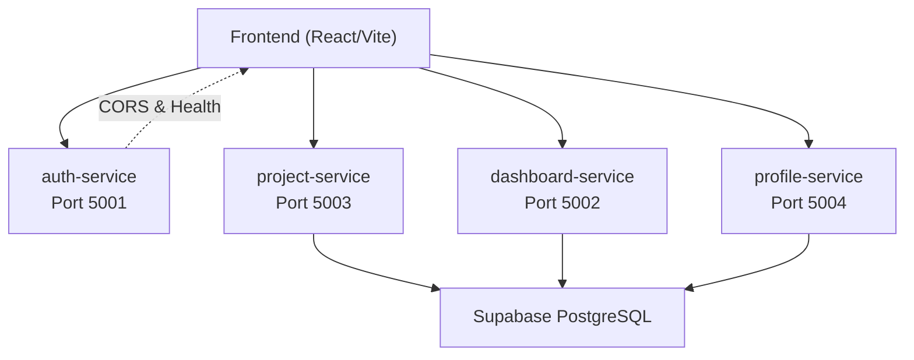
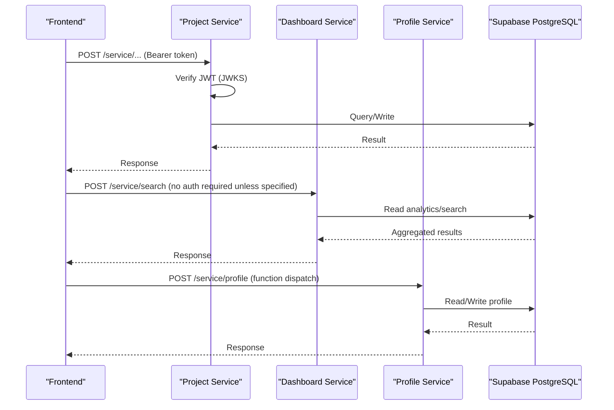
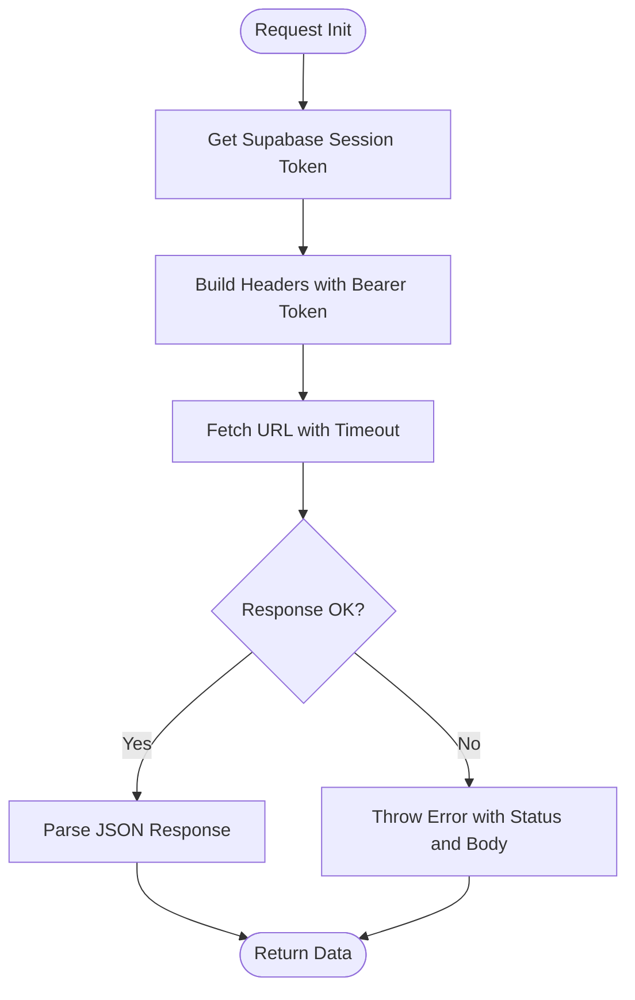
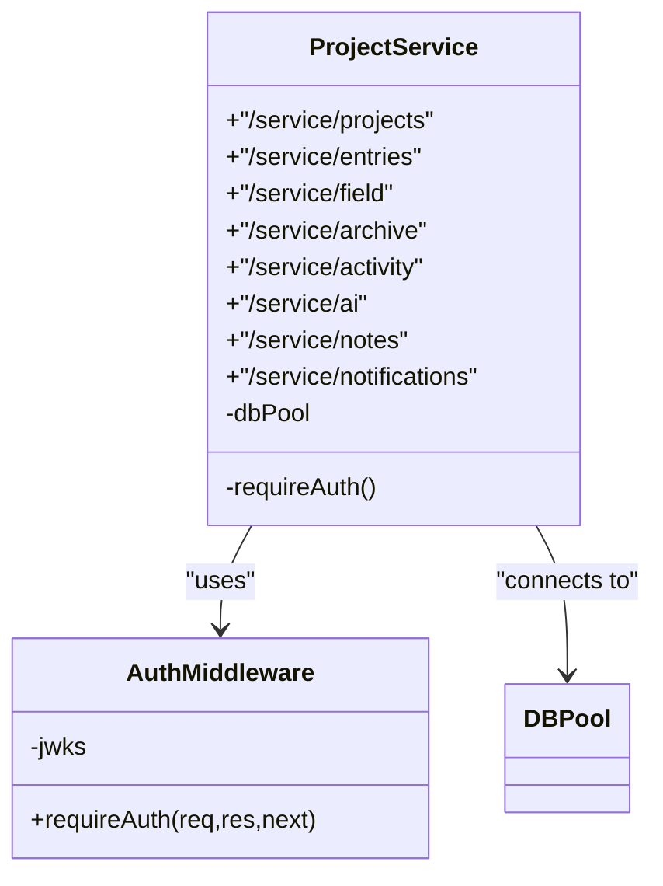
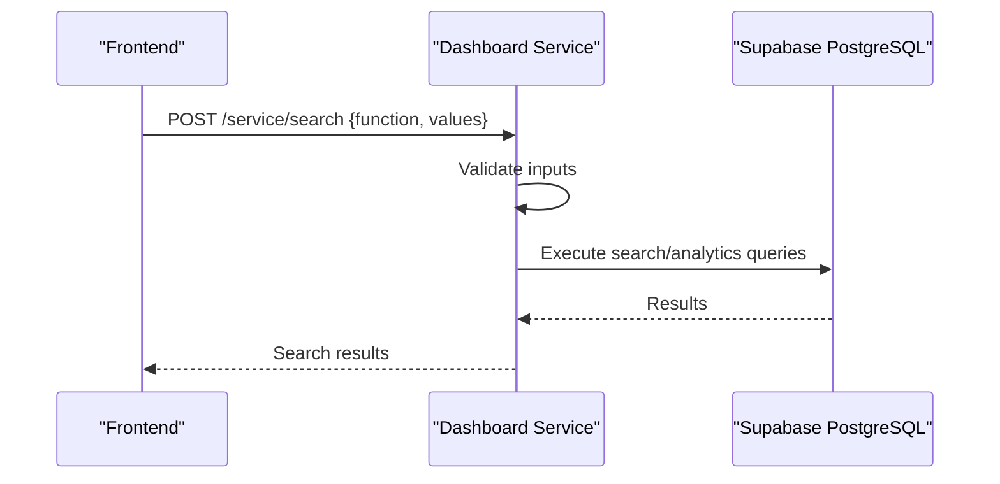
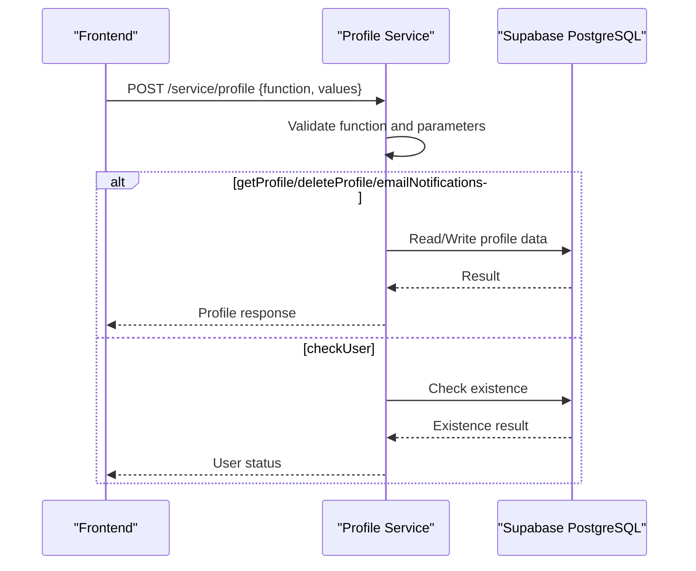
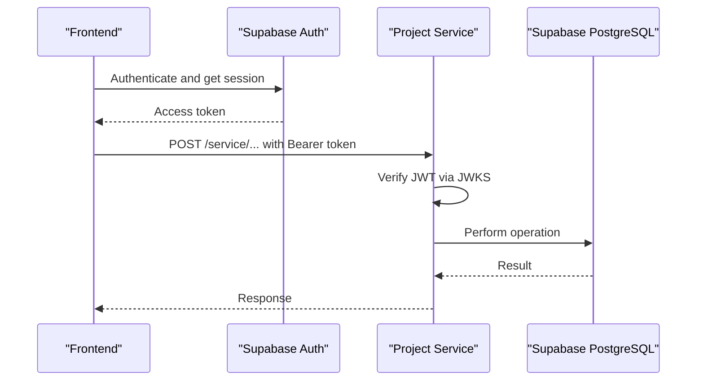
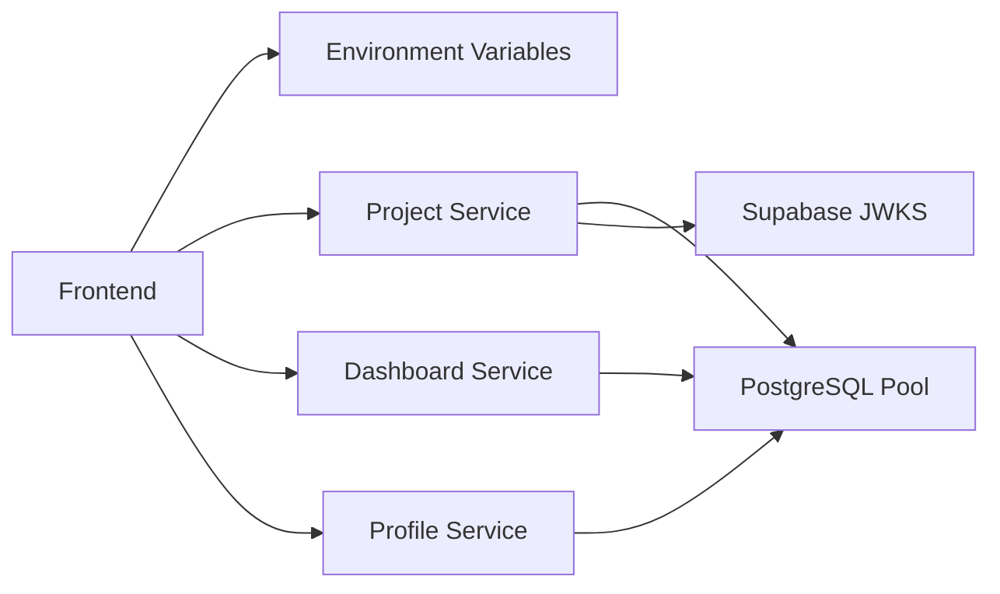

# System Design

<cite>
**Referenced Files in This Document**
- [services/README.md](file://services/README.md)
- [frontend/src/lib/api.ts](file://frontend/src/lib/api.ts)
- [frontend/src/lib/supabase.ts](file://frontend/src/lib/supabase.ts)
- [services/auth-service/src/index.js](file://services/auth-service/src/index.js)
- [services/dashboard-service/src/index.js](file://services/dashboard-service/src/index.js)
- [services/profile-service/src/index.js](file://services/profile-service/src/index.js)
- [services/project-service/src/index.js](file://services/project-service/src/index.js)
- [services/project-service/src/middleware/auth.js](file://services/project-service/src/middleware/auth.js)
- [services/project-service/src/db.js](file://services/project-service/src/db.js)
- [services/dashboard-service/src/db.js](file://services/dashboard-service/src/db.js)
- [services/profile-service/src/db.js](file://services/profile-service/src/db.js)
- [services/profile-service/src/Routes/login.js](file://services/profile-service/src/Routes/login.js)
- [services/profile-service/src/Routes/profile.js](file://services/profile-service/src/Routes/profile.js)
- [services/dashboard-service/src/Routes/search.js](file://services/dashboard-service/src/Routes/search.js)
- [supabase/migrations/000_baseline_full_schema.sql](file://supabase/migrations/000_baseline_full_schema.sql)
</cite>

## Table of Contents

1. Introduction
2. Project Structure
3. Core Components
4. Architecture Overview
5. Detailed Component Analysis
6. Dependency Analysis
7. Performance Considerations
8. Troubleshooting Guide
9. Conclusion

## Introduction

This document describes the Codacaine microservices architecture: a React frontend communicating with four independent Node.js/Express services over REST APIs, backed by a shared Supabase PostgreSQL database. The services are separated by clear responsibilities:

- auth-service: health endpoint and CORS configuration; token verification is enforced at the service boundary for protected routes.
- project-service: core business logic for projects, entries, fields, notes, activity, AI features, and notifications.
- dashboard-service: cross-project analytics and search endpoints.
- profile-service: user profile management and login helper endpoints.

The system avoids direct Supabase API calls from the frontend for sensitive operations. Instead, the frontend obtains an access token via Supabase Auth and forwards it to backend services, which verify tokens and perform database operations securely.

## Project Structure

At a high level:

- Frontend (React/Vite) builds a client that calls backend services via environment-configured URLs. It attaches a Bearer token obtained from Supabase Auth to each request.
- Backend services run as separate processes on different ports, each exposing a /service prefix for functional endpoints.
- Each service connects to the same Supabase PostgreSQL instance using a connection pool configured per service.
- Shared schema includes users, projects, entries, fields, activity_log, and auxiliary tables.

**Diagram sources**

- [services/README.md:105-110](file://services/README.md#L105-L110)
- [services/auth-service/src/index.js:50-52](file://services/auth-service/src/index.js#L50-L52)
- [services/dashboard-service/src/index.js:48-50](file://services/dashboard-service/src/index.js#L48-L50)
- [services/profile-service/src/index.js:50-52](file://services/profile-service/src/index.js#L50-L52)
- [services/project-service/src/index.js:76-78](file://services/project-service/src/index.js#L76-L78)

**Section sources**

- [services/README.md:16-45](file://services/README.md#L16-L45)
- [services/README.md:84-112](file://services/README.md#L84-L112)

## Core Components

- Frontend API layer: centralizes service URLs, fetch wrapper, timeout handling, and automatic Authorization header injection using the Supabase session token.
- Service entry points: Express apps with CORS, JSON parsing, health endpoints, and route mounting under /service.
- Authentication middleware: verifies Supabase JWTs against JWKS and injects user context into requests.
- Database modules: per-service PostgreSQL connection pools with SSL enabled for Supabase-hosted databases.
- Routes: feature-specific routers implementing function-dispatch patterns for profile and dashboard services, and RESTful endpoints for project-service.

Key implementation references:

- Frontend request wrapper and service URLs: [frontend/src/lib/api.ts:10-57](file://frontend/src/lib/api.ts#L10-L57), [frontend/src/lib/api.ts:1-6](file://frontend/src/lib/api.ts#L1-L6)
- Supabase client initialization: [frontend/src/lib/supabase.ts:1-34](file://frontend/src/lib/supabase.ts#L1-L34)
- Project-service authentication middleware: [services/project-service/src/middleware/auth.js:27-70](file://services/project-service/src/middleware/auth.js#L27-L70)
- Service database pools: [services/project-service/src/db.js:1-32](file://services/project-service/src/db.js#L1-L32), [services/dashboard-service/src/db.js:1-32](file://services/dashboard-service/src/db.js#L1-L32), [services/profile-service/src/db.js:1-32](file://services/profile-service/src/db.js#L1-L32)

**Section sources**

- [frontend/src/lib/api.ts:1-70](file://frontend/src/lib/api.ts#L1-L70)
- [frontend/src/lib/supabase.ts:1-34](file://frontend/src/lib/supabase.ts#L1-L34)
- [services/project-service/src/middleware/auth.js:1-71](file://services/project-service/src/middleware/auth.js#L1-L71)
- [services/project-service/src/db.js:1-32](file://services/project-service/src/db.js#L1-L32)
- [services/dashboard-service/src/db.js:1-32](file://services/dashboard-service/src/db.js#L1-L32)
- [services/profile-service/src/db.js:1-32](file://services/profile-service/src/db.js#L1-L32)

## Architecture Overview

The system enforces separation of concerns through service boundaries:

- Frontend never calls Supabase directly for data mutations or sensitive reads; it uses backend APIs.
- Project-service protects all /service routes with JWT verification and attaches user context.
- Dashboard-service provides read-only analytics and search across projects.
- Profile-service manages user profile records and supports login helpers.
- All services share one PostgreSQL database via connection pools.

**Diagram sources**

- [services/project-service/src/index.js:82-93](file://services/project-service/src/index.js#L82-L93)
- [services/project-service/src/middleware/auth.js:27-70](file://services/project-service/src/middleware/auth.js#L27-L70)
- [services/dashboard-service/src/Routes/search.js:19-58](file://services/dashboard-service/src/Routes/search.js#L19-L58)
- [services/profile-service/src/Routes/profile.js:31-103](file://services/profile-service/src/Routes/profile.js#L31-L103)
- [services/project-service/src/db.js:12-28](file://services/project-service/src/db.js#L12-L28)

## Detailed Component Analysis

### Frontend API Layer

Responsibilities:

- Resolve service base URLs from environment variables.
- Attach Supabase access token to Authorization headers.
- Enforce timeouts and handle errors consistently.

**Diagram sources**

- [frontend/src/lib/api.ts:10-57](file://frontend/src/lib/api.ts#L10-L57)
- [frontend/src/lib/supabase.ts:23-31](file://frontend/src/lib/supabase.ts#L23-L31)

**Section sources**

- [frontend/src/lib/api.ts:1-70](file://frontend/src/lib/api.ts#L1-L70)
- [frontend/src/lib/supabase.ts:1-34](file://frontend/src/lib/supabase.ts#L1-L34)

### Project Service

Responsibilities:

- Manage projects, entries, fields, notes, activity, AI features, and notifications.
- Protect all /service routes with JWT verification via middleware.
- Expose OpenAPI/Swagger UI for documentation.

**Diagram sources**

- [services/project-service/src/index.js:82-93](file://services/project-service/src/index.js#L82-L93)
- [services/project-service/src/middleware/auth.js:27-70](file://services/project-service/src/middleware/auth.js#L27-L70)
- [services/project-service/src/db.js:12-28](file://services/project-service/src/db.js#L12-L28)

**Section sources**

- [services/project-service/src/index.js:1-108](file://services/project-service/src/index.js#L1-L108)
- [services/project-service/src/middleware/auth.js:1-71](file://services/project-service/src/middleware/auth.js#L1-L71)
- [services/project-service/src/db.js:1-32](file://services/project-service/src/db.js#L1-L32)

### Dashboard Service

Responsibilities:

- Provide cross-project search and analytics endpoints.
- Maintain a health-ping endpoint to keep instances warm and ping Supabase.

**Diagram sources**

- [services/dashboard-service/src/Routes/search.js:19-58](file://services/dashboard-service/src/Routes/search.js#L19-L58)
- [services/dashboard-service/src/index.js:54-67](file://services/dashboard-service/src/index.js#L54-L67)
- [services/dashboard-service/src/db.js:12-28](file://services/dashboard-service/src/db.js#L12-L28)

**Section sources**

- [services/dashboard-service/src/index.js:1-87](file://services/dashboard-service/src/index.js#L1-L87)
- [services/dashboard-service/src/Routes/search.js:1-61](file://services/dashboard-service/src/Routes/search.js#L1-L61)
- [services/dashboard-service/src/db.js:1-32](file://services/dashboard-service/src/db.js#L1-L32)

### Profile Service

Responsibilities:

- Handle login helper functions and profile CRUD operations.
- Use a function-dispatch pattern to route multiple actions through a single endpoint.

**Diagram sources**

- [services/profile-service/src/Routes/profile.js:31-103](file://services/profile-service/src/Routes/profile.js#L31-L103)
- [services/profile-service/src/Routes/login.js:19-49](file://services/profile-service/src/Routes/login.js#L19-L49)
- [services/profile-service/src/db.js:12-28](file://services/profile-service/src/db.js#L12-L28)

**Section sources**

- [services/profile-service/src/index.js:1-77](file://services/profile-service/src/index.js#L1-L77)
- [services/profile-service/src/Routes/profile.js:1-107](file://services/profile-service/src/Routes/profile.js#L1-L107)
- [services/profile-service/src/Routes/login.js:1-52](file://services/profile-service/src/Routes/login.js#L1-L52)
- [services/profile-service/src/db.js:1-32](file://services/profile-service/src/db.js#L1-L32)

### Authentication Flow

- Frontend obtains a Supabase session and extracts the access token.
- Requests include Authorization: Bearer <token>.
- Project-service middleware verifies the token using Supabase’s JWKS endpoint and injects user context.
- Protected routes require a valid token; otherwise, they return 401.

**Diagram sources**

- [frontend/src/lib/api.ts:18-37](file://frontend/src/lib/api.ts#L18-L37)
- [services/project-service/src/middleware/auth.js:27-70](file://services/project-service/src/middleware/auth.js#L27-L70)

**Section sources**

- [frontend/src/lib/api.ts:10-57](file://frontend/src/lib/api.ts#L10-L57)
- [services/project-service/src/middleware/auth.js:1-71](file://services/project-service/src/middleware/auth.js#L1-L71)

## Dependency Analysis

- Frontend depends on environment variables for service URLs and Supabase credentials.
- Services depend on:
  - Express and CORS for HTTP handling.
  - PostgreSQL driver for database connectivity.
  - Supabase JWKS for JWT verification (project-service).
- Shared database schema defines relationships between users, projects, entries, fields, and activity logs.

**Diagram sources**

- [frontend/src/lib/api.ts:1-6](file://frontend/src/lib/api.ts#L1-L6)
- [services/project-service/src/middleware/auth.js:21-25](file://services/project-service/src/middleware/auth.js#L21-L25)
- [services/project-service/src/db.js:12-28](file://services/project-service/src/db.js#L12-L28)
- [services/dashboard-service/src/db.js:12-28](file://services/dashboard-service/src/db.js#L12-L28)
- [services/profile-service/src/db.js:12-28](file://services/profile-service/src/db.js#L12-L28)

**Section sources**

- [services/README.md:84-112](file://services/README.md#L84-L112)
- [supabase/migrations/000_baseline_full_schema.sql:27-138](file://supabase/migrations/000_baseline_full_schema.sql#L27-L138)

## Performance Considerations

- Connection pooling: Each service initializes a PostgreSQL connection pool once and reuses connections, reducing overhead.
- Timeouts: Frontend requests enforce a default timeout to avoid hanging during long operations (e.g., AI processing).
- Keep-alive: Dashboard service exposes a health-ping endpoint to keep instances warm and maintain database connectivity.
- Indexes: Database schema includes indexes on frequently queried columns (e.g., user_email, project_name, due_date) to optimize performance.

[No sources needed since this section provides general guidance]

## Troubleshooting Guide

Common issues and resolutions:

- Missing DATABASE_URL: Services log warnings or critical errors indicating database calls will fail. Ensure environment variables are set correctly for each service.
- CORS errors: Services validate allowed origins; ensure frontend origin matches configured lists or local development addresses.
- JWT verification failures: Project-service returns 401 if the token is missing, invalid, or lacks email. Verify the frontend attaches a valid Supabase access token.
- Health checks: Use root endpoints to confirm service health; use dashboard health-ping to verify keep-alive behavior.

**Section sources**

- [services/project-service/src/db.js:5-7](file://services/project-service/src/db.js#L5-L7)
- [services/dashboard-service/src/db.js:5-7](file://services/dashboard-service/src/db.js#L5-L7)
- [services/profile-service/src/db.js:5-7](file://services/profile-service/src/db.js#L5-L7)
- [services/auth-service/src/index.js:17-33](file://services/auth-service/src/index.js#L17-L33)
- [services/dashboard-service/src/index.js:54-67](file://services/dashboard-service/src/index.js#L54-L67)
- [services/project-service/src/middleware/auth.js:35-45](file://services/project-service/src/middleware/auth.js#L35-L45)

## Conclusion

Codacaine’s microservices architecture cleanly separates concerns across four Node.js/Express services, with a React frontend orchestrating requests via a centralized API layer. Authentication is enforced at the service boundary using Supabase JWTs, and all services interact with a shared Supabase PostgreSQL database through connection pools. This design ensures security, scalability, and maintainability while avoiding direct Supabase API calls from the frontend for sensitive operations.
