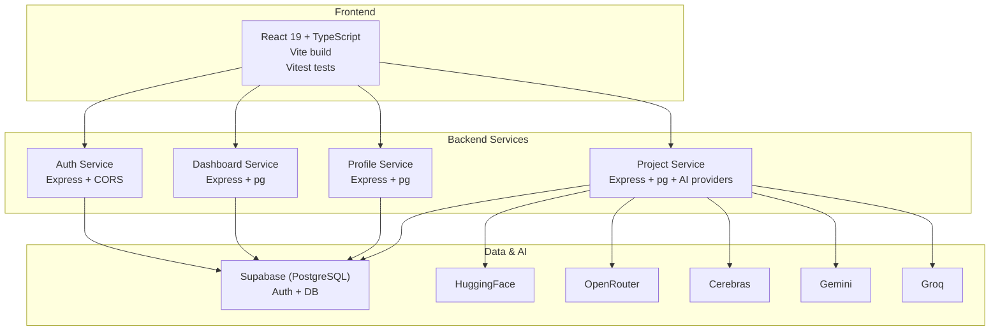
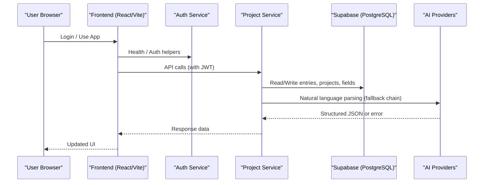
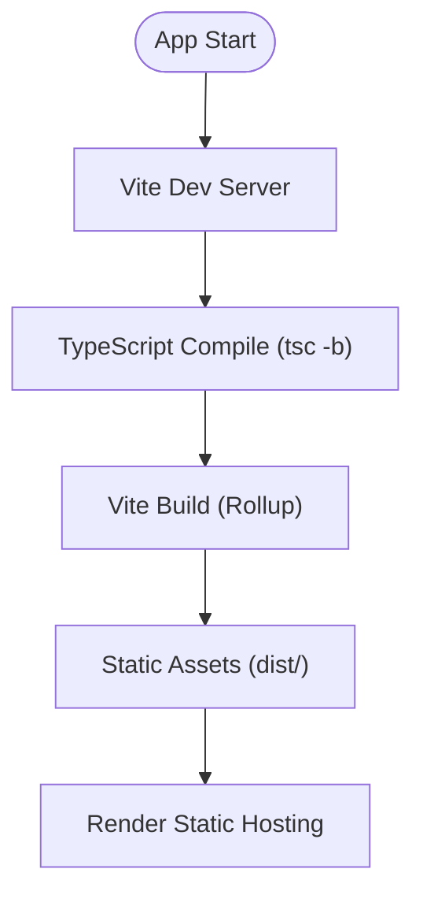
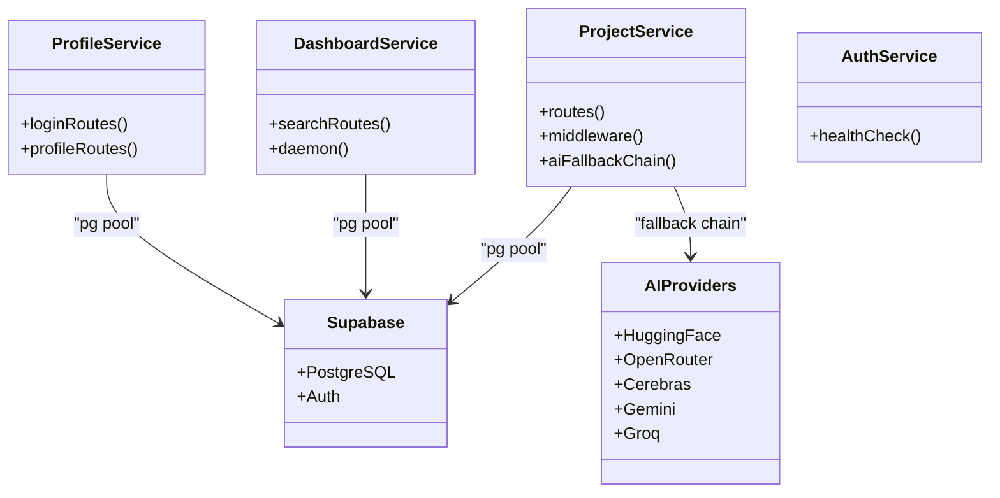
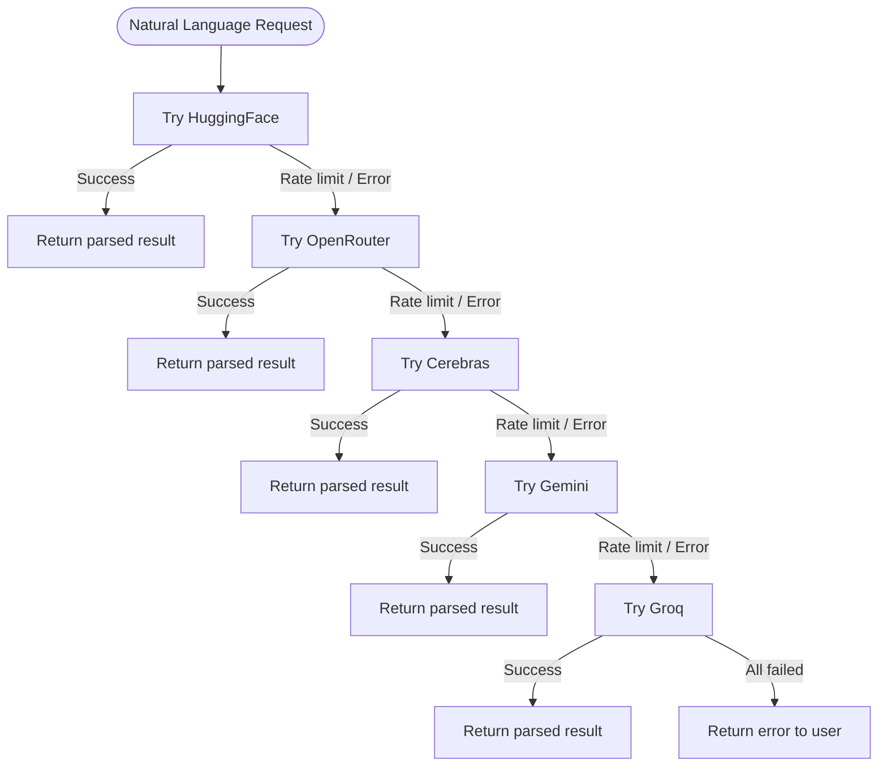
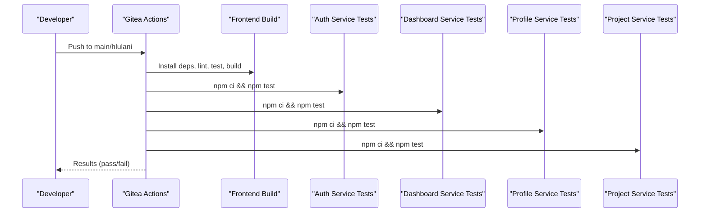
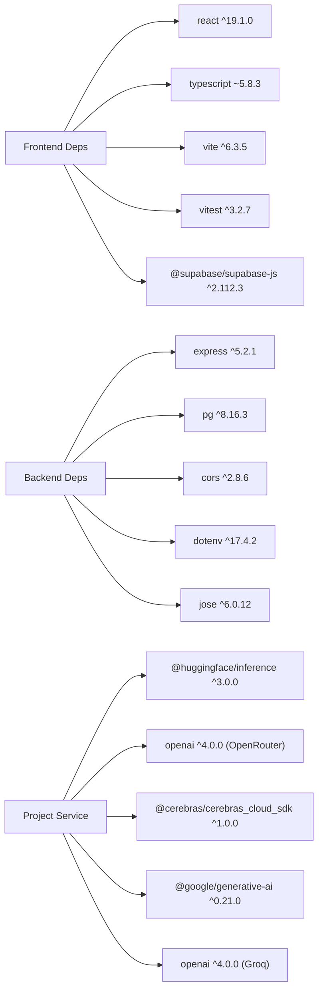

# Technology Stack

<cite>
**Referenced Files in This Document**
- [frontend/package.json](file://frontend/package.json)
- [frontend/vite.config.ts](file://frontend/vite.config.ts)
- [frontend/tsconfig.json](file://frontend/tsconfig.json)
- [package.json](file://package.json)
- [render.yaml](file://render.yaml)
- [.gitea/workflows/ci.yml](file://.gitea/workflows/ci.yml)
- [docs-site/docs/Architecture/teck-stack.md](file://docs-site/docs/Architecture/teck-stack.md)
- [docs-site/docs/Architecture/third-party.md](file://docs-site/docs/Architecture/third-party.md)
- [services/project-service/package.json](file://services/project-service/package.json)
- [services/auth-service/package.json](file://services/auth-service/package.json)
- [services/dashboard-service/package.json](file://services/dashboard-service/package.json)
- [services/profile-service/package.json](file://services/profile-service/package.json)
</cite>

## Table of Contents

1. [Introduction](#introduction)
2. [Project Structure](#project-structure)
3. [Core Components](#core-components)
4. [Architecture Overview](#architecture-overview)
5. [Detailed Component Analysis](#detailed-component-analysis)
6. [Dependency Analysis](#dependency-analysis)
7. [Performance Considerations](#performance-considerations)
8. [Troubleshooting Guide](#troubleshooting-guide)
9. [Conclusion](#conclusion)
10. [Appendices](#appendices)

## Introduction

This document describes the technology stack powering Codacaine, a digital logbook application with a modern React frontend and a Node.js microservices backend. It covers frontend technologies (React 19 with TypeScript, Vite, modern CSS), backend stack (Node.js with Express.js, PostgreSQL via Supabase), AI provider integrations (OpenRouter, HuggingFace, Gemini, Cerebras, Groq), infrastructure (Render deployment, CI/CD via Gitea Actions), and development tooling (Prettier, ESLint/Oxlint). It also explains version compatibility, dependency management strategies, and rationale for technology choices aligned with project requirements and scalability needs.

## Project Structure

Codacaine is organized as a monorepo:

- Frontend: React + TypeScript app built with Vite and tested with Vitest.
- Backend: Four Express.js microservices (auth, dashboard, profile, project) each with its own package.json and tests.
- Infrastructure: Render blueprint defines static site and Node services; CI runs on Gitea Actions.
- Documentation: MkDocs site with Material theme.

**Diagram sources**

- [render.yaml:1-98](file://render.yaml#L1-L98)
- [services/project-service/package.json:18-33](file://services/project-service/package.json#L18-L33)
- [docs-site/docs/Architecture/teck-stack.md:66-164](file://docs-site/docs/Architecture/teck-stack.md#L66-L164)

**Section sources**

- [render.yaml:1-98](file://render.yaml#L1-L98)
- [docs-site/docs/Architecture/teck-stack.md:1-347](file://docs-site/docs/Architecture/teck-stack.md#L1-L347)

## Core Components

- Frontend framework: React 19 with TypeScript, using Vite for fast dev server and optimized builds, and Vitest for unit/integration tests. Modern CSS custom properties enable runtime theming without heavy frameworks.
- Backend runtime and framework: Node.js with Express.js across four microservices. Each service is small, focused, and independently deployable.
- Database and auth: Supabase provides PostgreSQL storage and authentication (JWT, OAuth flows). Services use pg for direct database access and jose for JWT verification.
- AI integration: A multi-provider fallback chain (HuggingFace → OpenRouter → Cerebras → Gemini → Groq) ensures robust natural language parsing with rate-limit handling and cooldowns.
- Infrastructure: Render hosts both static frontend and Node services; environment variables are managed per service. CI runs on Gitea Actions to lint, test, and build all components.
- Development tools: Prettier for formatting across the repo; Oxlint used in CI for frontend linting; Husky and lint-staged enforce pre-commit formatting.

**Section sources**

- [frontend/package.json:1-45](file://frontend/package.json#L1-L45)
- [frontend/vite.config.ts:1-16](file://frontend/vite.config.ts#L1-L16)
- [frontend/tsconfig.json:1-29](file://frontend/tsconfig.json#L1-L29)
- [package.json:1-25](file://package.json#L1-L25)
- [services/project-service/package.json:18-33](file://services/project-service/package.json#L18-L33)
- [docs-site/docs/Architecture/teck-stack.md:66-164](file://docs-site/docs/Architecture/teck-stack.md#L66-L164)
- [docs-site/docs/Architecture/third-party.md:289-539](file://docs-site/docs/Architecture/third-party.md#L289-L539)

## Architecture Overview

The system uses a client-server architecture with a single-page frontend communicating with multiple backend services. Authentication is handled by Supabase Auth; backend services verify tokens via jose and interact with Supabase’s PostgreSQL. The project-service orchestrates AI calls through a resilient fallback chain.

**Diagram sources**

- [render.yaml:19-74](file://render.yaml#L19-L74)
- [docs-site/docs/Architecture/third-party.md:458-475](file://docs-site/docs/Architecture/third-party.md#L458-L475)
- [docs-site/docs/Architecture/third-party.md:289-331](file://docs-site/docs/Architecture/third-party.md#L289-L331)

## Detailed Component Analysis

### Frontend Stack

- React 19 and react-dom provide component-based UI with improved concurrent features and automatic batching.
- TypeScript ensures type safety across the codebase; tsconfig enforces strict mode and path aliases.
- Vite powers the dev server and production builds with fast HMR and Rollup-based optimization.
- Testing uses Vitest with jsdom environment and coverage via @vitest/coverage-v8.
- Styling leverages CSS custom properties for runtime themes without extra libraries.
- Routing uses react-router-dom for declarative routes and protected navigation patterns.
- IndexedDB caching via idb enables offline-first behavior and reactive updates.

**Diagram sources**

- [frontend/package.json:6-14](file://frontend/package.json#L6-L14)
- [frontend/vite.config.ts:5-15](file://frontend/vite.config.ts#L5-L15)
- [frontend/tsconfig.json:1-29](file://frontend/tsconfig.json#L1-L29)
- [render.yaml:1-17](file://render.yaml#L1-L17)

**Section sources**

- [frontend/package.json:16-43](file://frontend/package.json#L16-L43)
- [frontend/vite.config.ts:1-16](file://frontend/vite.config.ts#L1-L16)
- [frontend/tsconfig.json:1-29](file://frontend/tsconfig.json#L1-L29)
- [docs-site/docs/Architecture/third-party.md:54-287](file://docs-site/docs/Architecture/third-party.md#L54-L287)

### Backend Stack

- Node.js with Express.js forms the core of four microservices:
  - Auth Service: minimal endpoints and health checks.
  - Dashboard Service: search and stats aggregation.
  - Profile Service: user profile CRUD.
  - Project Service: core domain logic, entries, fields, archives, activity log, AI summaries.
- Database connectivity uses pg pools to Supabase PostgreSQL; jose verifies JWTs from Supabase Auth.
- AI providers integrated via SDKs: HuggingFace, OpenRouter (via OpenAI SDK), Cerebras, Gemini, Groq.
- Middleware includes CORS with allowlisted origins and JWT verification.

**Diagram sources**

- [services/project-service/package.json:18-33](file://services/project-service/package.json#L18-L33)
- [services/dashboard-service/package.json:18-23](file://services/dashboard-service/package.json#L18-L23)
- [services/profile-service/package.json:18-23](file://services/profile-service/package.json#L18-L23)
- [services/auth-service/package.json:18-22](file://services/auth-service/package.json#L18-L22)
- [docs-site/docs/Architecture/third-party.md:289-539](file://docs-site/docs/Architecture/third-party.md#L289-L539)

**Section sources**

- [services/project-service/package.json:1-58](file://services/project-service/package.json#L1-L58)
- [services/dashboard-service/package.json:1-43](file://services/dashboard-service/package.json#L1-L43)
- [services/profile-service/package.json:1-43](file://services/profile-service/package.json#L1-L43)
- [services/auth-service/package.json:1-41](file://services/auth-service/package.json#L1-L41)
- [docs-site/docs/Architecture/teck-stack.md:66-164](file://docs-site/docs/Architecture/teck-stack.md#L66-L164)
- [docs-site/docs/Architecture/third-party.md:421-568](file://docs-site/docs/Architecture/third-party.md#L421-L568)

### AI Provider Integration

- Multi-provider fallback chain improves resilience against rate limits and outages.
- Cooldown tracking prevents rapid retries to rate-limited providers.
- Lazy-loaded SDKs reduce memory footprint; only active provider’s SDK is loaded.
- Structured JSON output is enforced where needed (e.g., Gemini responseMimeType).

**Diagram sources**

- [docs-site/docs/Architecture/teck-stack.md:148-164](file://docs-site/docs/Architecture/teck-stack.md#L148-L164)
- [docs-site/docs/Architecture/third-party.md:289-331](file://docs-site/docs/Architecture/third-party.md#L289-L331)
- [docs-site/docs/Architecture/third-party.md:523-539](file://docs-site/docs/Architecture/third-party.md#L523-L539)

**Section sources**

- [docs-site/docs/Architecture/teck-stack.md:148-164](file://docs-site/docs/Architecture/teck-stack.md#L148-L164)
- [docs-site/docs/Architecture/third-party.md:289-331](file://docs-site/docs/Architecture/third-party.md#L289-L331)
- [docs-site/docs/Architecture/third-party.md:523-539](file://docs-site/docs/Architecture/third-party.md#L523-L539)

### Infrastructure and CI/CD

- Render hosts:
  - Static frontend site with SPA rewrite rules.
  - Node.js microservices with environment variables for secrets.
- CI pipeline (Gitea Actions):
  - Checks formatting, lints frontend with Oxlint, runs tests, and builds frontend.
  - Installs dependencies and runs tests for each backend service.
- Documentation site built with MkDocs and deployed as a static site on Render.

**Diagram sources**

- [.gitea/workflows/ci.yml:1-72](file://.gitea/workflows/ci.yml#L1-L72)
- [render.yaml:1-98](file://render.yaml#L1-L98)

**Section sources**

- [.gitea/workflows/ci.yml:1-72](file://.gitea/workflows/ci.yml#L1-L72)
- [render.yaml:1-98](file://render.yaml#L1-L98)
- [docs-site/mkdocs.yml:1-107](file://docs-site/mkdocs.yml#L1-L107)

## Dependency Analysis

- Frontend dependencies include React 19, TypeScript, Vite, Vitest, Supabase JS client, IndexedDB wrapper, and audio recording utilities.
- Backend dependencies vary by service:
  - Shared: express, cors, dotenv, pg (where applicable).
  - Project service adds AI SDKs, swagger-ui-express, date-fns, jose, and more.
- Version pinning and ranges ensure compatibility while allowing minor updates.
- Monorepo root manages global formatting and Git hooks; each service has its own package.json for isolated dependency management.

**Diagram sources**

- [frontend/package.json:16-43](file://frontend/package.json#L16-L43)
- [services/project-service/package.json:18-33](file://services/project-service/package.json#L18-L33)
- [services/dashboard-service/package.json:18-23](file://services/dashboard-service/package.json#L18-L23)
- [services/profile-service/package.json:18-23](file://services/profile-service/package.json#L18-L23)
- [services/auth-service/package.json:18-22](file://services/auth-service/package.json#L18-L22)

**Section sources**

- [frontend/package.json:16-43](file://frontend/package.json#L16-L43)
- [services/project-service/package.json:18-33](file://services/project-service/package.json#L18-L33)
- [services/dashboard-service/package.json:18-23](file://services/dashboard-service/package.json#L18-L23)
- [services/profile-service/package.json:18-23](file://services/profile-service/package.json#L18-L23)
- [services/auth-service/package.json:18-22](file://services/auth-service/package.json#L18-L22)

## Performance Considerations

- Frontend:
  - Vite’s native ESM dev server and HMR minimize reload times.
  - React 19’s automatic batching reduces re-renders during long-running operations like AI calls.
  - IndexedDB caching enables offline-first UX and reactive updates without polling.
- Backend:
  - Non-blocking I/O handles concurrent requests efficiently.
  - Connection pooling with pg optimizes database throughput.
  - AI fallback chain mitigates latency spikes and rate limits.
- Infrastructure:
  - Independent service deployments improve resilience and scaling.
  - Render’s free tier supports independent instances per service.

[No sources needed since this section provides general guidance]

## Troubleshooting Guide

- Frontend issues:
  - Ensure Vite dev server port configuration matches expectations.
  - Verify TypeScript strict mode catches type errors before build.
  - Use Vitest with jsdom for DOM-related tests; confirm fake-indexeddb polyfill is loaded in tests.
- Backend issues:
  - Confirm CORS allowlist includes frontend origin and credentials are allowed.
  - Validate JWT verification via jose and JWKS endpoint from Supabase.
  - Check database connection strings and SSL settings for pg pools.
- AI provider issues:
  - Inspect fallback chain logs to identify which provider fails and why (rate limits, model loading).
  - Use cooldowns to avoid repeated failures; adjust cooldown durations if necessary.
- CI/CD issues:
  - Ensure Node.js version matches configured version in CI.
  - Run local equivalents of CI steps (format check, lint, tests, build) to catch issues early.

**Section sources**

- [frontend/vite.config.ts:12-15](file://frontend/vite.config.ts#L12-L15)
- [frontend/tsconfig.json:1-29](file://frontend/tsconfig.json#L1-L29)
- [docs-site/docs/Architecture/third-party.md:345-376](file://docs-site/docs/Architecture/third-party.md#L345-L376)
- [docs-site/docs/Architecture/third-party.md:458-475](file://docs-site/docs/Architecture/third-party.md#L458-L475)
- [docs-site/docs/Architecture/third-party.md:541-568](file://docs-site/docs/Architecture/third-party.md#L541-L568)
- [.gitea/workflows/ci.yml:17-21](file://.gitea/workflows/ci.yml#L17-L21)

## Conclusion

Codacaine’s technology stack balances modern developer experience with robustness and scalability. The frontend leverages React 19, TypeScript, and Vite for fast iteration and reliable builds. The backend employs a modular Express.js microservices architecture backed by Supabase PostgreSQL and secured with JWT verification. AI capabilities are resilient through a multi-provider fallback strategy. Deployment on Render and CI via Gitea Actions streamline delivery and quality assurance. Together, these choices support maintainability, performance, and extensibility for future enhancements.

[No sources needed since this section summarizes without analyzing specific files]

## Appendices

### Version Compatibility Summary

- Frontend:
  - React 19.x, TypeScript ~5.8.x, Vite ^6.x, Vitest ^3.x.
  - Supabase JS client ^2.x, IndexedDB wrapper ^8.x.
- Backend:
  - Node.js 20 runtime on Render.
  - Express ^5.x, pg ^8.x, jose ^6.x, dotenv ^17.x.
  - AI SDKs: HuggingFace ^3.x, OpenAI ^4.x (used for OpenRouter/Groq), Cerebras ^1.x, Google Generative AI ^0.21.x.
- Tooling:
  - Prettier ^3.x, Oxlint in CI, Jest ^29.x for backend tests, Vitest ^3.x for frontend tests.

**Section sources**

- [frontend/package.json:16-43](file://frontend/package.json#L16-L43)
- [services/project-service/package.json:18-33](file://services/project-service/package.json#L18-L33)
- [services/dashboard-service/package.json:18-23](file://services/dashboard-service/package.json#L18-L23)
- [services/profile-service/package.json:18-23](file://services/profile-service/package.json#L18-L23)
- [services/auth-service/package.json:18-22](file://services/auth-service/package.json#L18-L22)
- [.gitea/workflows/ci.yml:17-21](file://.gitea/workflows/ci.yml#L17-L21)

### Rationale for Technology Selections

- React 19 chosen for team familiarity, ecosystem maturity, and concurrent features that improve perceived performance during long-running operations.
- TypeScript adopted early to prevent silent failures from API responses and to improve refactoring safety.
- Vite selected for near-instant dev startup and smaller bundles compared to legacy setups.
- Express.js used for its middleware pattern, broad community support, and simplicity in building REST APIs.
- Supabase provides integrated auth and relational database with JSONB flexibility, reducing custom auth complexity.
- Multi-provider AI chain ensures reliability and cost control by leveraging free tiers first and paid options as fallbacks.
- Render offers free-tier hosting with native Node.js support and environment variable management, simplifying deployment.
- Gitea Actions align with self-hosted repository requirements and provide GitHub-compatible workflows.

**Section sources**

- [docs-site/docs/Architecture/teck-stack.md:5-64](file://docs-site/docs/Architecture/teck-stack.md#L5-L64)
- [docs-site/docs/Architecture/teck-stack.md:66-164](file://docs-site/docs/Architecture/teck-stack.md#L66-L164)
- [docs-site/docs/Architecture/teck-stack.md:118-164](file://docs-site/docs/Architecture/teck-stack.md#L118-L164)
- [docs-site/docs/Architecture/teck-stack.md:167-194](file://docs-site/docs/Architecture/teck-stack.md#L167-L194)
