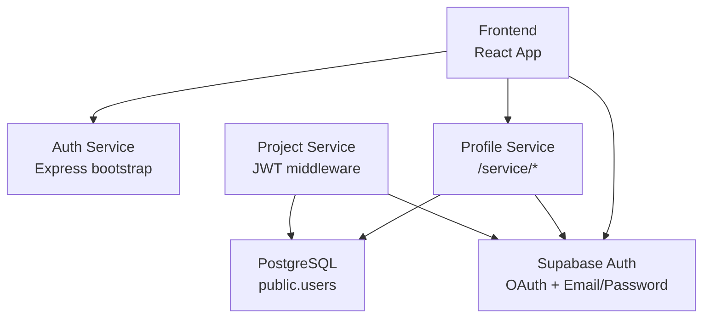
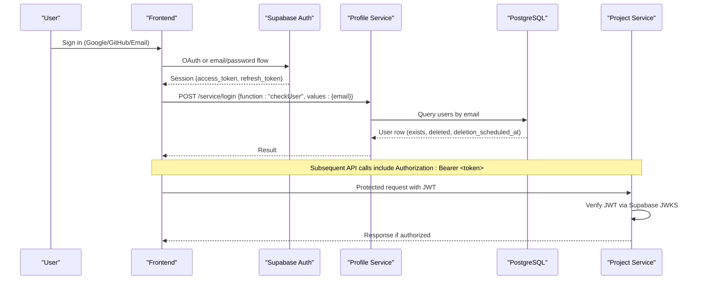
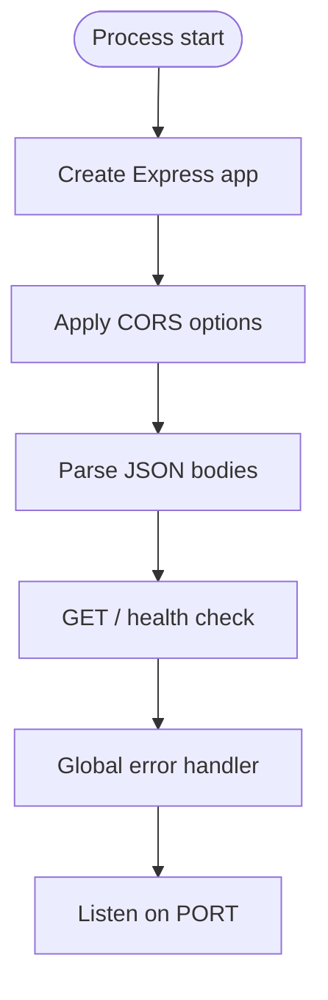
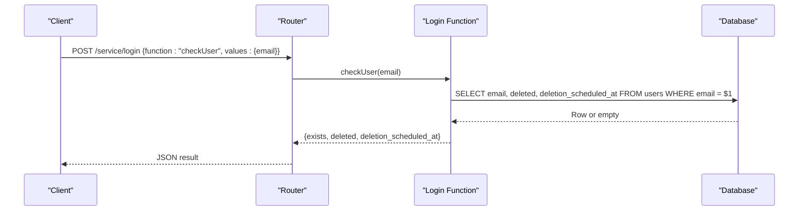
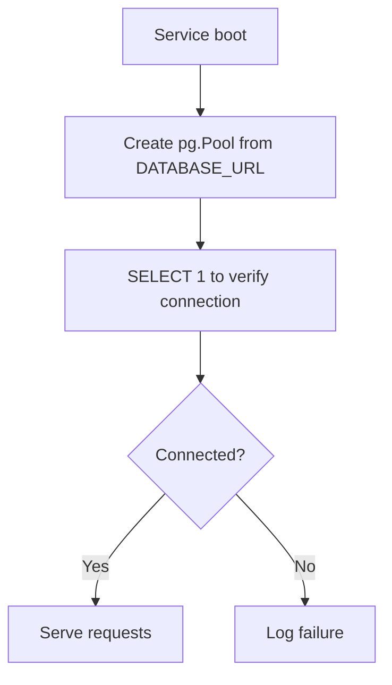
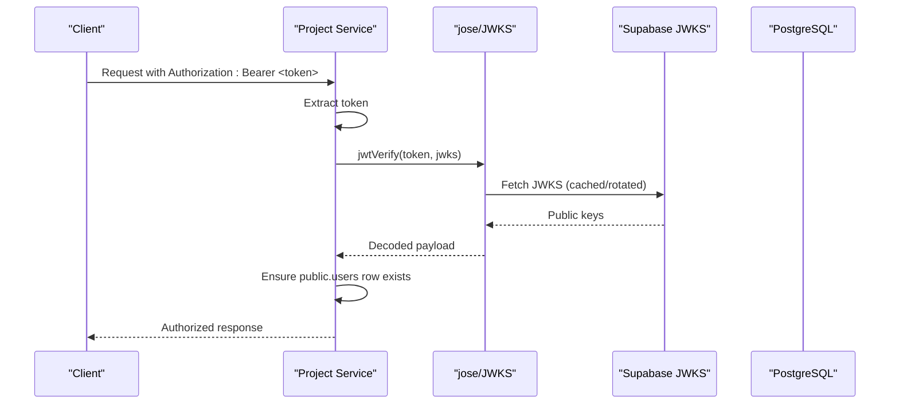
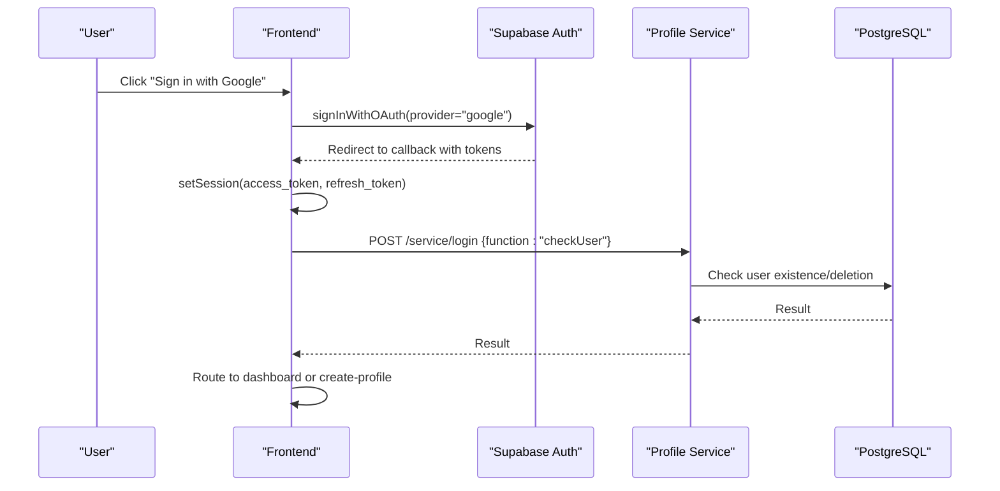
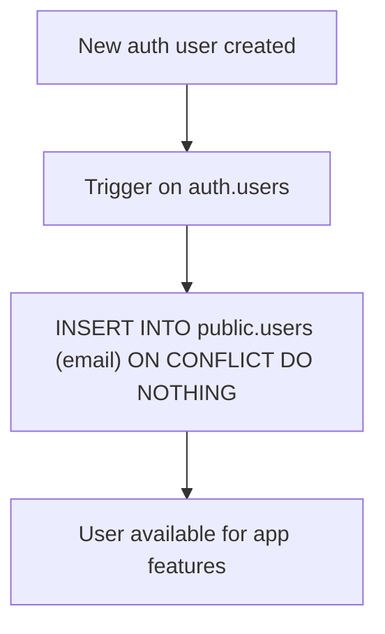
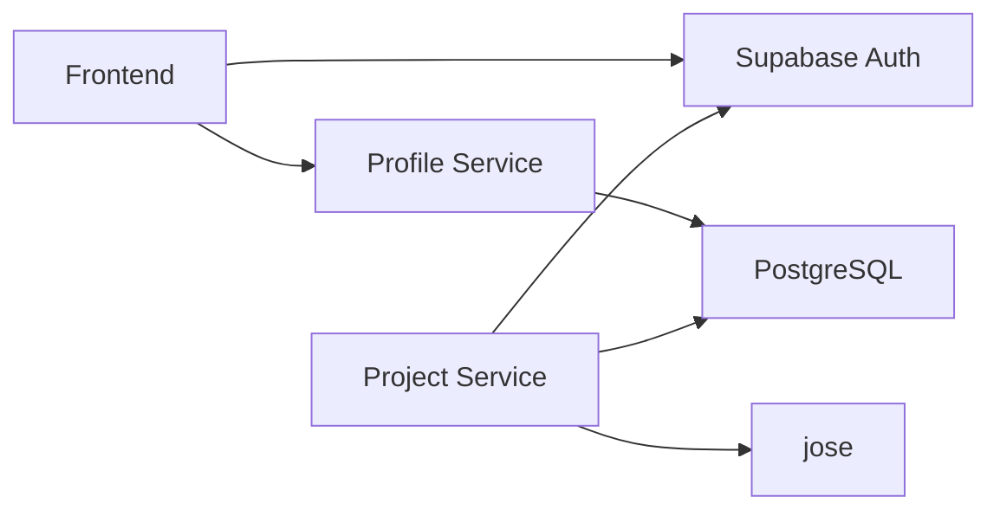

# Auth Service

<cite>
**Referenced Files in This Document**
- [index.js](file://services/auth-service/src/index.js)
- [package.json](file://services/auth-service/package.json)
- [index.js](file://services/profile-service/src/index.js)
- [login.js](file://services/profile-service/src/Routes/login.js)
- [login.js](file://services/profile-service/src/functions/login.js)
- [db.js](file://services/profile-service/src/db.js)
- [auth.js](file://services/project-service/src/middleware/auth.js)
- [AuthContext.tsx](file://frontend/src/context/AuthContext.tsx)
- [AuthCallback.tsx](file://frontend/src/pages/AuthCallback.tsx)
- [supabase.ts](file://frontend/src/lib/supabase.ts)
- [002_auto_provision_public_users_for_auth.sql](file://supabase/migrations/002_auto_provision_public_users_for_auth.sql)
</cite>

## Table of Contents

1. Introduction
2. Project Structure
3. Core Components
4. Architecture Overview
5. Detailed Component Analysis
6. Dependency Analysis
7. Performance Considerations
8. Troubleshooting Guide
9. Conclusion

## Introduction

This document describes the authentication and session management architecture for the system, focusing on how the frontend integrates with Supabase Auth to support email/password and OAuth (Google, GitHub), and how backend services validate access tokens using JWT verification against Supabase’s JWKS endpoint. It also documents the minimal auth service bootstrap, the profile service endpoints used during sign-in flows, database provisioning via migrations, and security considerations such as CORS, token validation, and graceful error handling.

## Project Structure

The repository implements a microservice-style backend with:

- A lightweight auth service that bootstraps Express, sets up CORS, JSON parsing, health check, and global error handling.
- A profile service that exposes a small API to check user existence and supports login-related routing.
- A project service that validates JWTs from clients using Supabase’s JWKS endpoint and enforces authorization on protected routes.
- A React frontend that uses Supabase JS client for authentication, OAuth redirects, session management, and account lifecycle operations.
- Supabase migrations that auto-provision app-level user rows when auth accounts are created.

**Diagram sources**

- [index.js:39-57](file://services/auth-service/src/index.js#L39-L57)
- [index.js:50-52](file://services/auth-service/src/index.js#L50-L52)
- [index.js:54-57](file://services/auth-service/src/index.js#L54-L57)
- [index.js:1-48](file://services/profile-service/src/index.js#L1-L48)
- [login.js:19-49](file://services/profile-service/src/Routes/login.js#L19-L49)
- [login.js:11-39](file://services/profile-service/src/functions/login.js#L11-L39)
- [db.js:1-31](file://services/profile-service/src/db.js#L1-L31)
- [auth.js:1-70](file://services/project-service/src/middleware/auth.js#L1-L70)
- [AuthContext.tsx:82-135](file://frontend/src/context/AuthContext.tsx#L82-L135)
- [AuthCallback.tsx:40-87](file://frontend/src/pages/AuthCallback.tsx#L40-L87)
- [supabase.ts:1-34](file://frontend/src/lib/supabase.ts#L1-L34)
- [002_auto_provision_public_users_for_auth.sql:24-52](file://supabase/migrations/002_auto_provision_public_users_for_auth.sql#L24-L52)

**Section sources**

- [index.js:39-57](file://services/auth-service/src/index.js#L39-L57)
- [index.js:1-48](file://services/profile-service/src/index.js#L1-L48)
- [login.js:19-49](file://services/profile-service/src/Routes/login.js#L19-L49)
- [login.js:11-39](file://services/profile-service/src/functions/login.js#L11-L39)
- [db.js:1-31](file://services/profile-service/src/db.js#L1-L31)
- [auth.js:1-70](file://services/project-service/src/middleware/auth.js#L1-L70)
- [AuthContext.tsx:82-135](file://frontend/src/context/AuthContext.tsx#L82-L135)
- [AuthCallback.tsx:40-87](file://frontend/src/pages/AuthCallback.tsx#L40-L87)
- [supabase.ts:1-34](file://frontend/src/lib/supabase.ts#L1-L34)
- [002_auto_provision_public_users_for_auth.sql:24-52](file://supabase/migrations/002_auto_provision_public_users_for_auth.sql#L24-L52)

## Core Components

- Auth Service (Express bootstrap): Provides a healthy endpoint, CORS configuration, JSON parsing, and a global error handler that preserves CORS headers on errors.
- Profile Service: Exposes /service/login to check whether an email exists and whether it is soft-deleted; connects to PostgreSQL via a connection pool.
- Project Service JWT Middleware: Verifies access tokens using Supabase’s JWKS endpoint, attaches decoded payload to requests, and ensures user rows exist in public.users.
- Frontend Auth Context: Implements sign-in with Google/GitHub/email, sign-up, password reset/update, sign-out, and account deletion/restore via Supabase RPCs.
- Supabase Migrations: Auto-create public.users entries for every new auth user and backfill existing users.

Security highlights:

- CORS allowlist with credentials enabled.
- JWT verification against Supabase JWKS (supports key rotation).
- Graceful error responses with CORS headers preserved.
- Database connection pool with SSL disabled for Supabase-hosted databases as configured.

**Section sources**

- [index.js:39-69](file://services/auth-service/src/index.js#L39-L69)
- [index.js:1-48](file://services/profile-service/src/index.js#L1-L48)
- [login.js:19-49](file://services/profile-service/src/Routes/login.js#L19-L49)
- [login.js:11-39](file://services/profile-service/src/functions/login.js#L11-L39)
- [db.js:1-31](file://services/profile-service/src/db.js#L1-L31)
- [auth.js:1-70](file://services/project-service/src/middleware/auth.js#L1-L70)
- [AuthContext.tsx:82-208](file://frontend/src/context/AuthContext.tsx#L82-L208)
- [002_auto_provision_public_users_for_auth.sql:24-52](file://supabase/migrations/002_auto_provision_public_users_for_auth.sql#L24-L52)

## Architecture Overview

Authentication is primarily handled by Supabase Auth in the frontend. The backend services do not implement their own OAuth or password hashing logic; instead, they rely on JWTs issued by Supabase and verify them server-side.

**Diagram sources**

- [AuthContext.tsx:82-135](file://frontend/src/context/AuthContext.tsx#L82-L135)
- [AuthCallback.tsx:40-87](file://frontend/src/pages/AuthCallback.tsx#L40-L87)
- [login.js:19-49](file://services/profile-service/src/Routes/login.js#L19-L49)
- [login.js:11-39](file://services/profile-service/src/functions/login.js#L11-L39)
- [db.js:1-31](file://services/profile-service/src/db.js#L1-L31)
- [auth.js:1-70](file://services/project-service/src/middleware/auth.js#L1-L70)

## Detailed Component Analysis

### Auth Service Bootstrap

Responsibilities:

- Create Express app with CORS, JSON parsing, health endpoint, and global error handler.
- Export app and error handler for testing.
- Listen on configurable port.

Key behaviors:

- CORS allows specific origins and local development hosts; credentials enabled.
- Global error handler logs unhandled errors and ensures CORS headers are present on error responses.

**Diagram sources**

- [index.js:39-57](file://services/auth-service/src/index.js#L39-L57)
- [index.js:54-69](file://services/auth-service/src/index.js#L54-L69)

**Section sources**

- [index.js:39-77](file://services/auth-service/src/index.js#L39-L77)
- [package.json:1-41](file://services/auth-service/package.json#L1-L41)

### Profile Service Login Endpoint

Responsibilities:

- Provide a single POST /service/login endpoint that dispatches functions based on a function name in the request body.
- Support checkUser to determine if an email exists and whether it is soft-deleted.

Flow:

- Validate presence of function field.
- For checkUser, query public.users by email and return existence and deletion status.

**Diagram sources**

- [login.js:19-49](file://services/profile-service/src/Routes/login.js#L19-L49)
- [login.js:11-39](file://services/profile-service/src/functions/login.js#L11-L39)

**Section sources**

- [login.js:19-49](file://services/profile-service/src/Routes/login.js#L19-L49)
- [login.js:11-39](file://services/profile-service/src/functions/login.js#L11-L39)

### Database Interaction for Users

- Connection pool is created from DATABASE_URL with SSL settings appropriate for Supabase.
- On startup, a simple query verifies connectivity.
- The login function queries public.users to determine user existence and deletion state.

**Diagram sources**

- [db.js:1-31](file://services/profile-service/src/db.js#L1-L31)

**Section sources**

- [db.js:1-31](file://services/profile-service/src/db.js#L1-L31)

### JWT Verification in Project Service

Responsibilities:

- Extract access token from Authorization header or query parameter (for SSE).
- Verify token using jose against Supabase’s JWKS endpoint.
- Attach decoded payload to req.user and ensure a public.users row exists.

**Diagram sources**

- [auth.js:1-70](file://services/project-service/src/middleware/auth.js#L1-L70)

**Section sources**

- [auth.js:1-70](file://services/project-service/src/middleware/auth.js#L1-L70)

### Frontend Authentication Flow

Responsibilities:

- Manage sessions via Supabase JS client.
- Support sign-in with Google, GitHub, and email/password.
- Handle OAuth callback and route users appropriately.
- Provide account lifecycle operations (reset password, update password, delete/restore account).

**Diagram sources**

- [AuthContext.tsx:82-135](file://frontend/src/context/AuthContext.tsx#L82-L135)
- [AuthCallback.tsx:40-87](file://frontend/src/pages/AuthCallback.tsx#L40-L87)
- [login.js:19-49](file://services/profile-service/src/Routes/login.js#L19-L49)
- [login.js:11-39](file://services/profile-service/src/functions/login.js#L11-L39)

**Section sources**

- [AuthContext.tsx:82-208](file://frontend/src/context/AuthContext.tsx#L82-L208)
- [AuthCallback.tsx:40-87](file://frontend/src/pages/AuthCallback.tsx#L40-L87)
- [supabase.ts:1-34](file://frontend/src/lib/supabase.ts#L1-L34)

### Account Lifecycle and Soft Delete

- Supabase migration creates a trigger to automatically provision public.users rows for new auth users and backfills existing ones.
- Frontend triggers account deletion via an RPC call and signs out; restoration cancels scheduled deletion.

**Diagram sources**

- [002_auto_provision_public_users_for_auth.sql:24-52](file://supabase/migrations/002_auto_provision_public_users_for_auth.sql#L24-L52)

**Section sources**

- [002_auto_provision_public_users_for_auth.sql:24-52](file://supabase/migrations/002_auto_provision_public_users_for_auth.sql#L24-L52)
- [AuthContext.tsx:173-208](file://frontend/src/context/AuthContext.tsx#L173-L208)

## Dependency Analysis

- Frontend depends on Supabase JS client for all auth operations.
- Profile service depends on PostgreSQL via pg pool and environment variables.
- Project service depends on jose for JWT verification and Supabase JWKS URL.
- Auth service has minimal dependencies (Express, CORS, dotenv).

**Diagram sources**

- [supabase.ts:1-34](file://frontend/src/lib/supabase.ts#L1-L34)
- [db.js:1-31](file://services/profile-service/src/db.js#L1-L31)
- [auth.js:1-26](file://services/project-service/src/middleware/auth.js#L1-L26)

**Section sources**

- [supabase.ts:1-34](file://frontend/src/lib/supabase.ts#L1-L34)
- [db.js:1-31](file://services/profile-service/src/db.js#L1-L31)
- [auth.js:1-26](file://services/project-service/src/middleware/auth.js#L1-L26)

## Performance Considerations

- JWT verification uses jose’s remote JWKS which caches and periodically re-fetches keys, minimizing latency and supporting key rotation without downtime.
- Database connections use a pooled client to reduce overhead under load.
- Minimal auth service avoids heavy middleware, keeping bootstrap fast.
- Frontend stores session in Supabase client storage to avoid repeated logins.

[No sources needed since this section provides general guidance]

## Troubleshooting Guide

Common issues and resolutions:

- Missing DATABASE_URL: Profile service will warn and database calls will fail; ensure DATABASE_URL is set in environment.
- CORS errors: Verify that the requesting origin is included in allowedOrigins and that credentials are enabled; confirm preflight OPTIONS handling.
- Unauthorized errors: Ensure Authorization header contains a valid Bearer token; for SSE, pass token via query parameter as supported by middleware.
- Token verification failures: Confirm SUPABASE_JWKS_URL is correct and network access to JWKS endpoint is available.
- User provisioning gaps: If app tables require a public.users row but none exists, the middleware attempts to insert one; otherwise, ensure migrations ran and trigger is active.

**Section sources**

- [db.js:5-7](file://services/profile-service/src/db.js#L5-L7)
- [index.js:17-33](file://services/auth-service/src/index.js#L17-L33)
- [index.js:54-69](file://services/auth-service/src/index.js#L54-L69)
- [auth.js:27-70](file://services/project-service/src/middleware/auth.js#L27-L70)

## Conclusion

The authentication system leverages Supabase Auth for identity and session management, while backend services enforce authorization through JWT verification against Supabase’s JWKS endpoint. The profile service provides minimal endpoints to support user discovery and soft-delete states, and migrations ensure consistent user provisioning across auth and application layers. Security is enforced via strict CORS policies, robust error handling, and resilient token verification.

[No sources needed since this section summarizes without analyzing specific files]
