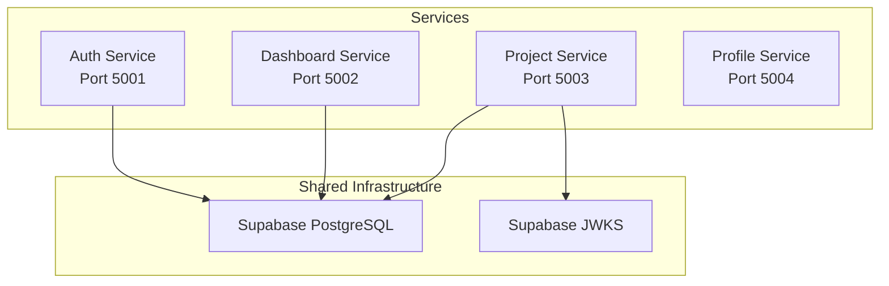
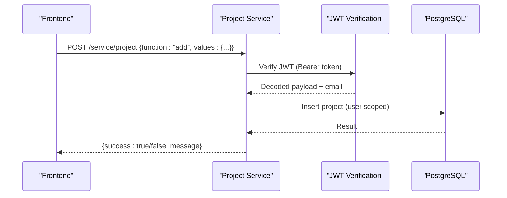
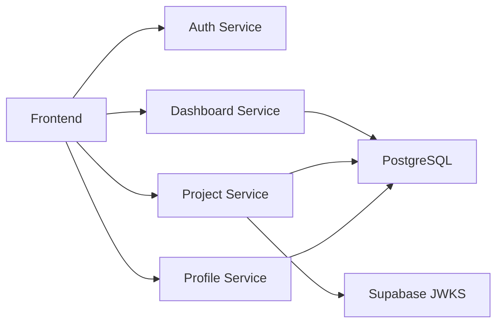

# Backend Services

<cite>
**Referenced Files in This Document**
- [services/README.md](file://services/README.md)
- [services/auth-service/src/index.js](file://services/auth-service/src/index.js)
- [services/dashboard-service/src/index.js](file://services/dashboard-service/src/index.js)
- [services/dashboard-service/src/config.js](file://services/dashboard-service/src/config.js)
- [services/dashboard-service/src/db.js](file://services/dashboard-service/src/db.js)
- [services/dashboard-service/src/Routes/search.js](file://services/dashboard-service/src/Routes/search.js)
- [services/profile-service/src/index.js](file://services/profile-service/src/index.js)
- [services/profile-service/src/config.js](file://services/profile-service/src/config.js)
- [services/profile-service/src/db.js](file://services/profile-service/src/db.js)
- [services/profile-service/src/Routes/login.js](file://services/profile-service/src/Routes/login.js)
- [services/profile-service/src/Routes/profile.js](file://services/profile-service/src/Routes/profile.js)
- [services/project-service/src/index.js](file://services/project-service/src/index.js)
- [services/project-service/src/config.js](file://services/project-service/src/config.js)
- [services/project-service/src/db.js](file://services/project-service/src/db.js)
- [services/project-service/src/middleware/auth.js](file://services/project-service/src/middleware/auth.js)
- [services/project-service/src/Routes/project.js](file://services/project-service/src/Routes/project.js)
</cite>

## Table of Contents

1. [Introduction](#introduction)
2. [Project Structure](#project-structure)
3. [Core Components](#core-components)
4. [Architecture Overview](#architecture-overview)
5. [Detailed Component Analysis](#detailed-component-analysis)
6. [Dependency Analysis](#dependency-analysis)
7. [Performance Considerations](#performance-considerations)
8. [Troubleshooting Guide](#troubleshooting-guide)
9. [Conclusion](#conclusion)
10. [Appendices](#appendices)

## Introduction

This document describes the Codacaine backend microservices architecture, focusing on four independent Node.js/Express services: Auth Service, Dashboard Service, Project Service, and Profile Service. It explains how each service is structured, how they communicate via REST APIs, shared authentication middleware, database access patterns, API contracts, error handling, security, configuration, logging, monitoring, deployment considerations, environment variables, and inter-service dependencies.

The system follows a microservices pattern where each service runs as its own process on its own port, shares a Supabase-backed PostgreSQL database, and exposes REST endpoints for the frontend to consume. The Project Service enforces JWT-based authentication using Supabase’s JWKS endpoint, while other services expose public or function-dispatched endpoints for specific tasks.

**Section sources**

- [services/README.md:16-43](file://services/README.md#L16-L43)

## Project Structure

The repository organizes backend services under services/, with each service containing its own src directory, configuration, routes, functions, and tests. Each service defines CORS policies, JSON parsing, health endpoints, and global error handlers. Configuration files load environment variables, and database modules initialize connection pools to Supabase PostgreSQL.

**Diagram sources**

- [services/auth-service/src/index.js:5-57](file://services/auth-service/src/index.js#L5-L57)
- [services/dashboard-service/src/index.js:9-52](file://services/dashboard-service/src/index.js#L9-L52)
- [services/project-service/src/index.js:23-93](file://services/project-service/src/index.js#L23-L93)
- [services/profile-service/src/index.js:9-55](file://services/profile-service/src/index.js#L9-L55)
- [services/project-service/src/middleware/auth.js:21-25](file://services/project-service/src/middleware/auth.js#L21-L25)

**Section sources**

- [services/README.md:84-112](file://services/README.md#L84-L112)
- [services/auth-service/src/index.js:5-57](file://services/auth-service/src/index.js#L5-L57)
- [services/dashboard-service/src/index.js:9-52](file://services/dashboard-service/src/index.js#L9-L52)
- [services/project-service/src/index.js:23-93](file://services/project-service/src/index.js#L23-L93)
- [services/profile-service/src/index.js:9-55](file://services/profile-service/src/index.js#L9-L55)

## Core Components

- Auth Service: Express app with CORS, JSON parsing, health check, and global error handler. Exposes a root endpoint indicating service health.
- Dashboard Service: Express app with CORS, JSON parsing, search routes under /service/search, health-ping endpoint, and a background daemon that pings Supabase to keep instances warm.
- Project Service: Express app with CORS, JSON parsing (with larger payload limit), OpenAPI/Swagger UI, protected routes under /service/* requiring JWT verification, and a public notification trigger route mounted before auth.
- Profile Service: Express app with CORS, JSON parsing, login and profile routes under /service/*, and global error handling.

All services implement consistent CORS policies allowing specific origins and localhost development URLs, enable credentials, and define allowed methods and headers.

**Section sources**

- [services/auth-service/src/index.js:5-57](file://services/auth-service/src/index.js#L5-L57)
- [services/dashboard-service/src/index.js:9-84](file://services/dashboard-service/src/index.js#L9-L84)
- [services/project-service/src/index.js:23-107](file://services/project-service/src/index.js#L23-L107)
- [services/profile-service/src/index.js:9-76](file://services/profile-service/src/index.js#L9-L76)

## Architecture Overview

The services follow a microservices architecture with clear separation of concerns:

- Authentication: Project Service validates JWTs against Supabase JWKS and ensures user provisioning in the database.
- Data Access: All services use a PostgreSQL connection pool configured with SSL for Supabase-hosted databases.
- API Contracts: Services expose REST endpoints; some use a function-dispatch pattern within a single route to handle multiple operations.
- Monitoring: Health endpoints and periodic health-ping endpoints help detect liveness and connectivity.

**Diagram sources**

- [services/project-service/src/Routes/project.js:20-47](file://services/project-service/src/Routes/project.js#L20-L47)
- [services/project-service/src/middleware/auth.js:27-69](file://services/project-service/src/middleware/auth.js#L27-L69)
- [services/project-service/src/db.js:12-28](file://services/project-service/src/db.js#L12-L28)

**Section sources**

- [services/project-service/src/middleware/auth.js:21-69](file://services/project-service/src/middleware/auth.js#L21-L69)
- [services/dashboard-service/src/index.js:54-67](file://services/dashboard-service/src/index.js#L54-L67)

## Detailed Component Analysis

### Auth Service

Responsibilities:

- Provide a lightweight Express server with CORS and JSON parsing.
- Expose a health endpoint at /.
- Centralized error handling ensuring CORS headers are present on errors.

Key behaviors:

- Configures CORS with an allowlist and supports preflight requests.
- Exports createApp and errorHandler for testing.

Environment:

- PORT defaults to 5001 if not set.

Security:

- Strict origin validation prevents unauthorized cross-origin requests.

Error Handling:

- Global error handler logs unhandled errors and returns a standardized JSON response with appropriate CORS headers.

**Section sources**

- [services/auth-service/src/index.js:5-82](file://services/auth-service/src/index.js#L5-L82)

### Dashboard Service

Responsibilities:

- Serve search functionality across projects without reading individual entry tables directly.
- Provide a health-ping endpoint to keep instances alive and verify Supabase connectivity.
- Start a background daemon for periodic Supabase pings.

API Endpoints:

- GET / : Health check returning service status.
- POST /service/search : Function-dispatched endpoint supporting searchAll, searchProject, searchProjects.
- GET /service/health-ping : Pings Supabase and reports status.

Request/Response Patterns:

- Search endpoint expects a body with function and values fields; returns results or error messages.

Database Access:

- Uses a PostgreSQL connection pool with SSL enabled for Supabase.

Monitoring:

- Health-ping endpoint helps CI/CD pipelines monitor service liveness and database connectivity.

Configuration:

- Loads environment variables via dotenv.

**Section sources**

- [services/dashboard-service/src/index.js:9-84](file://services/dashboard-service/src/index.js#L9-L84)
- [services/dashboard-service/src/Routes/search.js:19-58](file://services/dashboard-service/src/Routes/search.js#L19-L58)
- [services/dashboard-service/src/db.js:12-28](file://services/dashboard-service/src/db.js#L12-L28)
- [services/dashboard-service/src/config.js:1-4](file://services/dashboard-service/src/config.js#L1-L4)

### Project Service

Responsibilities:

- Core business logic for projects, entries, priorities, fields, archives, activity logs, AI features, notes, and notifications.
- Enforce JWT-based authentication for all /service/* routes except explicitly public ones.
- Provide OpenAPI/Swagger documentation at /api-docs.

Authentication Middleware:

- requireAuth verifies JWTs using Supabase JWKS, extracts email, and provisions users in the database if missing.
- Supports both Authorization header and query param tokens (useful for SSE).

API Endpoints:

- GET / : Health check.
- POST /service/notifications/sendPending : Public endpoint for pending notifications triggered by scheduled jobs.
- POST /service/project : Function-dispatched endpoint supporting add, edit, delete, getProjects, setColor.
- Additional routes for entries, priority, field, archive, activity, ai, notes, notifications (mounted under /service with requireAuth).

Request/Response Patterns:

- Function-dispatched endpoints expect { function, values } in the request body.
- Responses include success flags and messages; client-facing errors return 400, server errors return 500.

Database Access:

- Uses a PostgreSQL connection pool with SSL enabled for Supabase.

Security:

- JWT verification ensures only authenticated users can access protected resources.
- User provisioning ensures referential integrity for FK constraints.

Monitoring:

- Swagger UI provides interactive API documentation.

**Section sources**

- [services/project-service/src/index.js:23-107](file://services/project-service/src/index.js#L23-L107)
- [services/project-service/src/middleware/auth.js:21-69](file://services/project-service/src/middleware/auth.js#L21-L69)
- [services/project-service/src/Routes/project.js:20-99](file://services/project-service/src/Routes/project.js#L20-L99)
- [services/project-service/src/db.js:12-28](file://services/project-service/src/db.js#L12-L28)
- [services/project-service/src/config.js:1-4](file://services/project-service/src/config.js#L1-L4)

### Profile Service

Responsibilities:

- Manage user profiles and preferences, including username, email, name, avatar, profile retrieval, email notifications, and profile deletion.
- Provide a login helper endpoint to check user existence.

API Endpoints:

- GET / : Health check.
- POST /service/login : Function-dispatched endpoint supporting checkUser.
- POST /service/profile : Function-dispatched endpoint supporting username, email, name, avatar, getProfile, emailNotifications, deleteProfile.

Request/Response Patterns:

- Function-dispatched endpoints expect { function, values } in the request body.
- Responses include operation results or error details.

Database Access:

- Uses a PostgreSQL connection pool with SSL enabled for Supabase.

Security:

- CORS policy restricts allowed origins; no JWT enforcement on these endpoints as they serve profile management tasks.

Configuration:

- Loads environment variables via dotenv.

**Section sources**

- [services/profile-service/src/index.js:9-76](file://services/profile-service/src/index.js#L9-L76)
- [services/profile-service/src/Routes/login.js:19-49](file://services/profile-service/src/Routes/login.js#L19-L49)
- [services/profile-service/src/Routes/profile.js:31-107](file://services/profile-service/src/Routes/profile.js#L31-L107)
- [services/profile-service/src/db.js:12-28](file://services/profile-service/src/db.js#L12-L28)
- [services/profile-service/src/config.js:1-4](file://services/profile-service/src/config.js#L1-L4)

## Dependency Analysis

Inter-service and external dependencies:

- All services depend on Supabase PostgreSQL via DATABASE_URL and use pg Pool with SSL.
- Project Service depends on Supabase JWKS for JWT verification.
- Dashboard Service includes a daemon that periodically pings Supabase to keep instances warm.
- Frontend communicates with services over HTTP(S); CORS policies control allowed origins.

**Diagram sources**

- [services/dashboard-service/src/index.js:54-84](file://services/dashboard-service/src/index.js#L54-L84)
- [services/project-service/src/middleware/auth.js:21-25](file://services/project-service/src/middleware/auth.js#L21-L25)
- [services/dashboard-service/src/db.js:12-28](file://services/dashboard-service/src/db.js#L12-L28)
- [services/project-service/src/db.js:12-28](file://services/project-service/src/db.js#L12-L28)
- [services/profile-service/src/db.js:12-28](file://services/profile-service/src/db.js#L12-L28)

**Section sources**

- [services/dashboard-service/src/db.js:12-28](file://services/dashboard-service/src/db.js#L12-L28)
- [services/project-service/src/db.js:12-28](file://services/project-service/src/db.js#L12-L28)
- [services/profile-service/src/db.js:12-28](file://services/profile-service/src/db.js#L12-L28)
- [services/project-service/src/middleware/auth.js:21-25](file://services/project-service/src/middleware/auth.js#L21-L25)

## Performance Considerations

- Connection pooling: All services use pg Pool to manage database connections efficiently.
- Payload size: Project Service increases JSON body limit to accommodate larger payloads.
- Background tasks: Dashboard Service starts a daemon to maintain service liveness and database connectivity.
- CORS overhead: Minimal; configured once per service.
- JWT verification: Uses jose with remote JWKS caching to reduce latency during key rotation.

[No sources needed since this section provides general guidance]

## Troubleshooting Guide

Common issues and resolutions:

- Missing DATABASE_URL: Services log warnings or critical errors indicating database calls will fail. Ensure DATABASE_URL is set correctly for each service.
- CORS errors: Verify that the requesting origin is included in the allowedOrigins list for the target service.
- JWT verification failures: Ensure the Authorization header contains a valid Bearer token; check Supabase JWKS availability and network connectivity.
- Health checks: Use service root endpoints and dashboard health-ping to verify service liveness and database connectivity.

Error handling strategy:

- Global error handlers log unhandled errors and return standardized JSON responses with appropriate CORS headers.
- Route-level try/catch blocks validate inputs and return meaningful error messages.

**Section sources**

- [services/dashboard-service/src/db.js:5-7](file://services/dashboard-service/src/db.js#L5-L7)
- [services/project-service/src/db.js:5-7](file://services/project-service/src/db.js#L5-L7)
- [services/auth-service/src/index.js:61-69](file://services/auth-service/src/index.js#L61-L69)
- [services/dashboard-service/src/index.js:69-78](file://services/dashboard-service/src/index.js#L69-L78)
- [services/project-service/src/index.js:94-103](file://services/project-service/src/index.js#L94-L103)
- [services/profile-service/src/index.js:57-72](file://services/profile-service/src/index.js#L57-L72)

## Conclusion

Codacaine’s backend implements a clean microservices architecture with clear responsibilities per service, robust authentication via JWT and Supabase JWKS, consistent CORS and error handling, and reliable database access through connection pooling. The Project Service enforces strong security boundaries, while the Dashboard and Profile Services provide focused functionality. Health endpoints and background daemons support operational monitoring and reliability.

[No sources needed since this section summarizes without analyzing specific files]

## Appendices

### Environment Variables

Each service requires a .env file with:

- SUPABASE_URL and SUPABASE_KEY (shared across services for the same database)
- PORT (unique per service)
- DATABASE_URL (for services using direct PostgreSQL access)
- SUPABASE_JWKS_URL (optional override for Project Service JWT verification)

Default ports:

- Auth Service: 5001
- Dashboard Service: 5002
- Project Service: 5003
- Profile Service: 5004

**Section sources**

- [services/README.md:84-112](file://services/README.md#L84-L112)
- [services/auth-service/src/index.js:5](file://services/auth-service/src/index.js#L5)
- [services/dashboard-service/src/index.js:10](file://services/dashboard-service/src/index.js#L10)
- [services/project-service/src/index.js:24](file://services/project-service/src/index.js#L24)
- [services/profile-service/src/index.js:10](file://services/profile-service/src/index.js#L10)
- [services/project-service/src/middleware/auth.js:21-23](file://services/project-service/src/middleware/auth.js#L21-L23)

### API Endpoints Summary

- Auth Service
  - GET / : Health check
- Dashboard Service
  - GET / : Health check
  - POST /service/search : Function-dispatched search (searchAll, searchProject, searchProjects)
  - GET /service/health-ping : Liveness and Supabase ping
- Project Service
  - GET / : Health check
  - POST /service/notifications/sendPending : Public notification trigger
  - POST /service/project : Function-dispatched project operations (add, edit, delete, getProjects, setColor)
  - Additional protected routes under /service/* for entries, priority, field, archive, activity, ai, notes, notifications
- Profile Service
  - GET / : Health check
  - POST /service/login : Function-dispatched checkUser
  - POST /service/profile : Function-dispatched profile operations (username, email, name, avatar, getProfile, emailNotifications, deleteProfile)

**Section sources**

- [services/auth-service/src/index.js:50-52](file://services/auth-service/src/index.js#L50-L52)
- [services/dashboard-service/src/index.js:48-67](file://services/dashboard-service/src/index.js#L48-L67)
- [services/dashboard-service/src/Routes/search.js:19-58](file://services/dashboard-service/src/Routes/search.js#L19-L58)
- [services/project-service/src/index.js:76-93](file://services/project-service/src/index.js#L76-L93)
- [services/project-service/src/Routes/project.js:20-99](file://services/project-service/src/Routes/project.js#L20-L99)
- [services/profile-service/src/index.js:50-55](file://services/profile-service/src/index.js#L50-L55)
- [services/profile-service/src/Routes/login.js:19-49](file://services/profile-service/src/Routes/login.js#L19-L49)
- [services/profile-service/src/Routes/profile.js:31-107](file://services/profile-service/src/Routes/profile.js#L31-L107)

### Security and Authentication

- JWT verification in Project Service uses Supabase JWKS for secure token validation and supports key rotation automatically.
- CORS policies restrict cross-origin requests to known domains and local development addresses.
- Protected routes enforce authentication; public routes are explicitly defined and limited in scope.

**Section sources**

- [services/project-service/src/middleware/auth.js:21-69](file://services/project-service/src/middleware/auth.js#L21-L69)
- [services/auth-service/src/index.js:17-33](file://services/auth-service/src/index.js#L17-L33)
- [services/dashboard-service/src/index.js:22-38](file://services/dashboard-service/src/index.js#L22-L38)
- [services/project-service/src/index.js:35-51](file://services/project-service/src/index.js#L35-L51)
- [services/profile-service/src/index.js:22-40](file://services/profile-service/src/index.js#L22-L40)

### Database Access Patterns

- All services use pg Pool with SSL enabled for Supabase-hosted PostgreSQL.
- Connection pools are initialized on startup and verified with a simple query.
- Project Service ensures user rows exist to satisfy foreign key constraints.

**Section sources**

- [services/dashboard-service/src/db.js:12-28](file://services/dashboard-service/src/db.js#L12-L28)
- [services/project-service/src/db.js:12-28](file://services/project-service/src/db.js#L12-L28)
- [services/profile-service/src/db.js:12-28](file://services/profile-service/src/db.js#L12-L28)
- [services/project-service/src/middleware/auth.js:53-63](file://services/project-service/src/middleware/auth.js#L53-L63)
