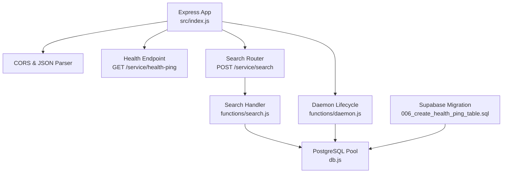
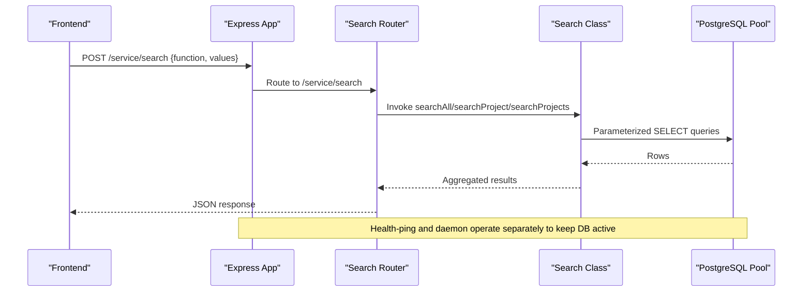
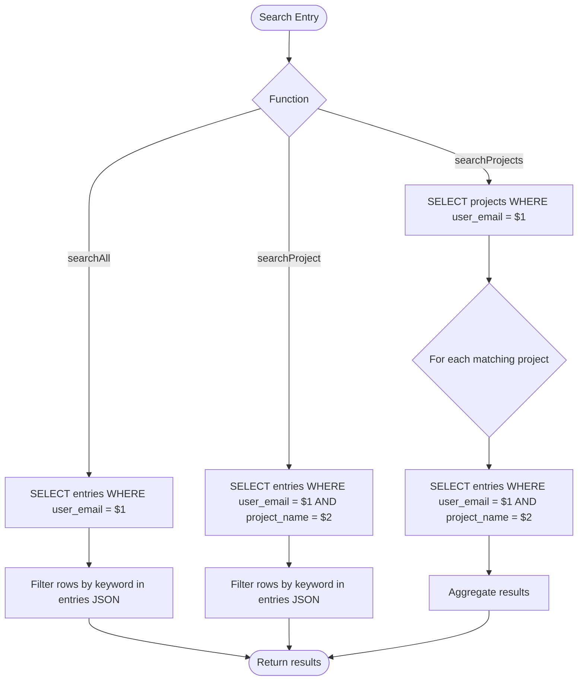
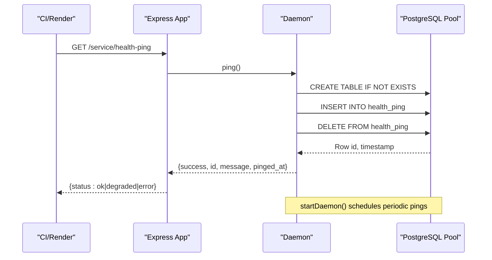
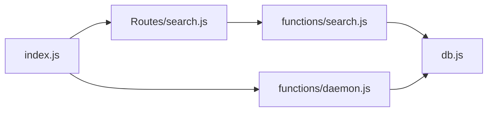

# Dashboard Service

<cite>
**Referenced Files in This Document**
- [index.js](file://services/dashboard-service/src/index.js)
- [config.js](file://services/dashboard-service/src/config.js)
- [db.js](file://services/dashboard-service/src/db.js)
- [search.js](file://services/dashboard-service/src/Routes/search.js)
- [search.js](file://services/dashboard-service/src/functions/search.js)
- [daemon.js](file://services/dashboard-service/src/functions/daemon.js)
- [package.json](file://services/dashboard-service/package.json)
- [006_create_health_ping_table.sql](file://supabase/migrations/006_create_health_ping_table.sql)
- [search.js](file://frontend/src/functions/dashboard/search.js)
- [stats.js](file://frontend/src/functions/dashboard/stats.js)
</cite>

## Table of Contents

1. [Introduction](#introduction)
2. [Project Structure](#project-structure)
3. [Core Components](#core-components)
4. [Architecture Overview](#architecture-overview)
5. [Detailed Component Analysis](#detailed-component-analysis)
6. [Dependency Analysis](#dependency-analysis)
7. [Performance Considerations](#performance-considerations)
8. [Troubleshooting Guide](#troubleshooting-guide)
9. [Conclusion](#conclusion)
10. [Appendices](#appendices)

## Introduction

The Dashboard Service is a Node.js microservice that exposes search and health endpoints for cross-project analytics and monitoring. It provides:

- A unified search API to query entries across projects or within a specific project.
- A health-ping endpoint used by CI to keep the service and database active.
- A background daemon that periodically pings the database to prevent inactivity pauses on free-tier hosting.

This documentation covers the service architecture, search implementation, REST endpoints, daemon process, performance considerations, and operational guidance.

## Project Structure

The service follows a simple Express-based layout with clear separation between routing, business logic, configuration, and data access.

**Diagram sources**

- [index.js:1-86](file://services/dashboard-service/src/index.js#L1-L86)
- [search.js:1-61](file://services/dashboard-service/src/Routes/search.js#L1-L61)
- [search.js:1-78](file://services/dashboard-service/src/functions/search.js#L1-L78)
- [db.js:1-32](file://services/dashboard-service/src/db.js#L1-L32)
- [daemon.js:1-135](file://services/dashboard-service/src/functions/daemon.js#L1-L135)
- [006_create_health_ping_table.sql:1-22](file://supabase/migrations/006_create_health_ping_table.sql#L1-L22)

**Section sources**

- [index.js:1-86](file://services/dashboard-service/src/index.js#L1-L86)
- [package.json:1-43](file://services/dashboard-service/package.json#L1-L43)

## Core Components

- Express application and middleware: CORS, JSON parsing, global error handling, and route mounting.
- Search router: Accepts a single POST endpoint that dispatches to different search functions based on a function field in the request body.
- Search handler: Implements three search modes (all entries, project-scoped, and project-name-driven aggregation).
- Database pool: PostgreSQL connection pool with SSL configured for Supabase.
- Daemon: Background task that ensures a health table exists and performs periodic insert/delete cycles to keep the database warm.
- Health endpoint: Exposes a GET endpoint that triggers a ping and returns status.

Key responsibilities:

- Routing and request validation are handled at the router layer.
- Business logic for search resides in the Search class.
- Data persistence interactions use parameterized queries via the pool.
- The daemon runs independently from request handling and uses its own lifecycle management.

**Section sources**

- [index.js:1-86](file://services/dashboard-service/src/index.js#L1-L86)
- [search.js:1-61](file://services/dashboard-service/src/Routes/search.js#L1-L61)
- [search.js:1-78](file://services/dashboard-service/src/functions/search.js#L1-L78)
- [db.js:1-32](file://services/dashboard-service/src/db.js#L1-L32)
- [daemon.js:1-135](file://services/dashboard-service/src/functions/daemon.js#L1-L135)

## Architecture Overview

The service exposes two primary concerns:

- Search API: A single POST endpoint that routes to different search strategies.
- Health and Keep-Alive: A GET endpoint and a background daemon that maintain database activity.

**Diagram sources**

- [index.js:48-84](file://services/dashboard-service/src/index.js#L48-L84)
- [search.js:14-58](file://services/dashboard-service/src/Routes/search.js#L14-L58)
- [search.js:4-76](file://services/dashboard-service/src/functions/search.js#L4-L76)
- [db.js:9-29](file://services/dashboard-service/src/db.js#L9-L29)

## Detailed Component Analysis

### Search API and Endpoints

- Endpoint: POST /service/search
- Request body fields:
  - function: One of "searchAll", "searchProject", "searchProjects"
  - values: Object containing required parameters per function
    - searchAll: user_email, keyword
    - searchProject: user_email, project_name, keyword
    - searchProjects: user_email, keyword
- Responses:
  - Success: { success: true, message: "...", data: [...] }
  - Error: { success: false, message: "..." }

Example requests:

- Global search:
  - POST /service/search
  - Body: { "function": "searchAll", "values": { "user_email": "a@b.com", "keyword": "login" } }
- Project-scoped search:
  - POST /service/search
  - Body: { "function": "searchProject", "values": { "user_email": "a@b.com", "project_name": "WebApp", "keyword": "bug" } }
- Project-name search:
  - POST /service/search
  - Body: { "function": "searchProjects", "values": { "user_email": "a@b.com", "keyword": "app" } }

Frontend integration:

- The frontend calls these endpoints via a helper that handles network errors and non-OK responses.

**Section sources**

- [search.js:14-58](file://services/dashboard-service/src/Routes/search.js#L14-L58)
- [search.js:1-49](file://frontend/src/functions/dashboard/search.js#L1-L49)

### Search Algorithm Implementation

The Search class implements three strategies:

- searchAll(user_email, keyword): Retrieves all entries for a user and filters client-side by keyword against the serialized entries JSON.
- searchProject(user_email, project_name, keyword): Retrieves entries for a specific project and filters client-side by keyword.
- searchProjects(user_email, keyword): Finds projects matching the keyword by name, then fetches all entries for those projects and aggregates them.

Algorithm characteristics:

- Keyword matching is case-insensitive and performed after fetching rows.
- Filtering uses JSON.stringify(row.entries) to support nested fields.
- searchProjects may issue multiple queries (one per matching project) to aggregate entries.

Complexity considerations:

- Time complexity depends on the number of rows returned per query and the cost of string operations for filtering.
- For large datasets, consider server-side indexing and full-text search to avoid client-side filtering.

**Diagram sources**

- [search.js:4-76](file://services/dashboard-service/src/functions/search.js#L4-L76)

**Section sources**

- [search.js:4-76](file://services/dashboard-service/src/functions/search.js#L4-L76)
- [search.integration.test.js:31-171](file://services/dashboard-service/src/__tests__/search.integration.test.js#L31-L171)

### Health Monitoring and Keep-Alive Daemon

- Health endpoint: GET /service/health-ping
  - Triggers a ping operation and returns status ok or degraded/error depending on outcome.
- Daemon:
  - Ensures the health_ping table exists (idempotent CREATE TABLE IF NOT EXISTS).
  - Inserts a row with a fixed message and immediately deletes it.
  - Runs once on startup and then on a configurable interval (default 12 hours).
  - Can be started/stopped and queried for running state and configuration.

Operational notes:

- The health endpoint is intended to be called by CI to wake the service and keep the database active.
- The daemon’s interval can be overridden via an environment variable.

**Diagram sources**

- [index.js:54-67](file://services/dashboard-service/src/index.js#L54-L67)
- [daemon.js:26-71](file://services/dashboard-service/src/functions/daemon.js#L26-L71)
- [daemon.js:73-135](file://services/dashboard-service/src/functions/daemon.js#L73-L135)
- [006_create_health_ping_table.sql:7-22](file://supabase/migrations/006_create_health_ping_table.sql#L7-L22)

**Section sources**

- [index.js:54-67](file://services/dashboard-service/src/index.js#L54-L67)
- [daemon.js:1-135](file://services/dashboard-service/src/functions/daemon.js#L1-L135)
- [healthPing.test.js:35-145](file://services/dashboard-service/src/__tests__/healthPing.test.js#L35-L145)

### Database Layer and Schema

- Connection pool:
  - Uses a PostgreSQL connection string from environment variables.
  - Configured with SSL disabled verification for compatibility with managed databases.
  - Verifies connectivity on startup.
- Health ping table:
  - Created by migration; includes id, message, and pinged_at columns.
  - Row-level security enabled; accessible only by backend roles.

Best practices:

- Always use parameterized queries to prevent injection.
- Ensure DATABASE_URL is set; otherwise, database calls will fail gracefully with warnings.

**Section sources**

- [db.js:1-32](file://services/dashboard-service/src/db.js#L1-L32)
- [006_create_health_ping_table.sql:1-22](file://supabase/migrations/006_create_health_ping_table.sql#L1-L22)

### Frontend Integration and Analytics Utilities

- Search client:
  - Provides helpers to call the dashboard service search endpoints with consistent error handling.
- Stats utilities:
  - Provide grouping and aggregation logic for metrics such as totals and counts by fields or projects. These are used to build dashboards and reports on the client side.

Note: While analytics computation occurs primarily on the frontend, the dashboard service supplies the raw search results needed for dashboards.

**Section sources**

- [search.js:1-49](file://frontend/src/functions/dashboard/search.js#L1-L49)
- [stats.js:356-391](file://frontend/src/functions/dashboard/stats.js#L356-L391)

## Dependency Analysis

The service has minimal external dependencies and clear internal coupling:

- Express app depends on CORS, JSON parser, and mounted routers.
- Search router depends on the Search class.
- Search class depends on the PostgreSQL pool.
- Daemon depends on the pool and manages its own lifecycle.

**Diagram sources**

- [index.js:1-86](file://services/dashboard-service/src/index.js#L1-L86)
- [search.js:1-61](file://services/dashboard-service/src/Routes/search.js#L1-L61)
- [search.js:1-78](file://services/dashboard-service/src/functions/search.js#L1-L78)
- [daemon.js:1-135](file://services/dashboard-service/src/functions/daemon.js#L1-L135)
- [db.js:1-32](file://services/dashboard-service/src/db.js#L1-L32)

**Section sources**

- [package.json:1-43](file://services/dashboard-service/package.json#L1-L43)

## Performance Considerations

Current implementation details:

- Client-side filtering: Keyword matching is performed after fetching rows, which can be inefficient for large datasets.
- Multiple queries: searchProjects may issue one query per matching project, increasing round-trips.

Optimization opportunities:

- Server-side filtering:
  - Use SQL LIKE or full-text search operators to filter directly in the database.
  - Add indexes on frequently filtered columns (e.g., user_email, project_name).
- Query optimization:
  - Select only necessary columns to reduce payload size.
  - Consider batching or UNION queries to reduce round-trips when aggregating across projects.
- Caching:
  - Introduce short-lived caches for frequent search queries keyed by user_email and keyword patterns.
  - Cache invalidation on write events or via time-based TTL.
- Pagination:
  - Implement offset/limit or cursor-based pagination to handle large result sets.
- Connection pooling:
  - Tune pool size and idle timeouts based on expected concurrency.

[No sources needed since this section provides general guidance]

## Troubleshooting Guide

Common issues and resolutions:

- Missing DATABASE_URL:
  - The service logs a warning and database calls will fail. Set the environment variable before starting.
- CORS errors:
  - Ensure the requesting origin is allowed or matches localhost patterns. Check the allowed origins list and browser console errors.
- Health-ping failures:
  - If the pool is unavailable or DB errors occur, the endpoint returns degraded or error statuses. Verify database connectivity and permissions.
- Search returns empty results:
  - Verify user_email and project_name correctness. Confirm that entries exist and are not soft-deleted.

Diagnostic tips:

- Inspect logs for unhandled errors and pool connection messages.
- Validate request payloads for required fields.
- Use test suites to simulate failures and verify error shapes.

**Section sources**

- [index.js:69-78](file://services/dashboard-service/src/index.js#L69-L78)
- [db.js:5-29](file://services/dashboard-service/src/db.js#L5-L29)
- [healthPing.test.js:35-145](file://services/dashboard-service/src/__tests__/healthPing.test.js#L35-L145)

## Conclusion

The Dashboard Service provides a focused set of capabilities:

- A flexible search API supporting global, project-scoped, and project-name-driven queries.
- A robust health endpoint and daemon to keep the service and database active.
- Clear separation of concerns with modular routing, business logic, and data access layers.

For production readiness, prioritize server-side filtering, indexing, caching, and pagination to scale efficiently with growing datasets.

[No sources needed since this section summarizes without analyzing specific files]

## Appendices

### REST API Reference

- POST /service/search
  - Purpose: Execute a search operation
  - Request body:
    - function: "searchAll" | "searchProject" | "searchProjects"
    - values: object with required parameters per function
  - Response:
    - Success: { success: true, message: "...", data: [...] }
    - Error: { success: false, message: "..." }

- GET /service/health-ping
  - Purpose: Trigger a database ping and return health status
  - Response:
    - Success: { status: "ok", ...ping details }
    - Degraded: { status: "degraded", ...reason }
    - Error: { status: "error", reason: "..." }

**Section sources**

- [search.js:14-58](file://services/dashboard-service/src/Routes/search.js#L14-L58)
- [index.js:54-67](file://services/dashboard-service/src/index.js#L54-L67)

### Example Requests

- Global search:
  - POST /service/search
  - Body: { "function": "searchAll", "values": { "user_email": "a@b.com", "keyword": "login" } }
- Project-scoped search:
  - POST /service/search
  - Body: { "function": "searchProject", "values": { "user_email": "a@b.com", "project_name": "WebApp", "keyword": "bug" } }
- Project-name search:
  - POST /service/search
  - Body: { "function": "searchProjects", "values": { "user_email": "a@b.com", "keyword": "app" } }

**Section sources**

- [search.js:14-58](file://services/dashboard-service/src/Routes/search.js#L14-L58)
- [search.js:33-49](file://frontend/src/functions/dashboard/search.js#L33-L49)

### Health Monitoring Setup

- Configure CI to call GET /service/health-ping at regular intervals to keep the service awake and database active.
- Ensure the health_ping table exists via migration and that the service has appropriate database permissions.

**Section sources**

- [index.js:54-67](file://services/dashboard-service/src/index.js#L54-L67)
- [006_create_health_ping_table.sql:1-22](file://supabase/migrations/006_create_health_ping_table.sql#L1-L22)

### Performance Tuning Guidelines

- Add database indexes on user_email and project_name to speed up filtering.
- Move keyword filtering into SQL using LIKE or full-text search where possible.
- Implement pagination to limit result sizes.
- Introduce caching for repeated queries with short TTLs.
- Monitor pool utilization and adjust pool settings based on load.

[No sources needed since this section provides general guidance]
