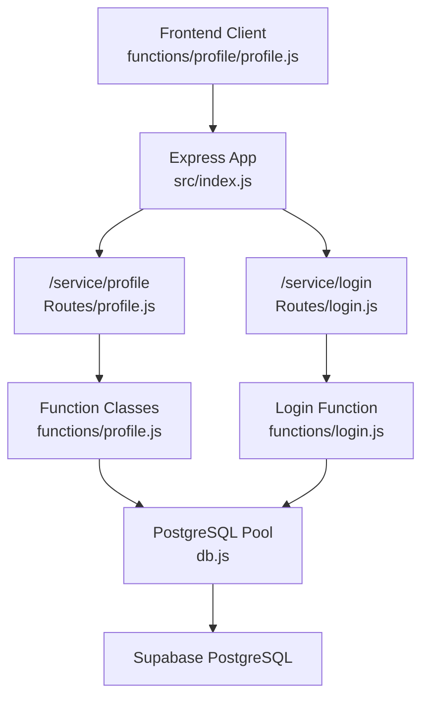
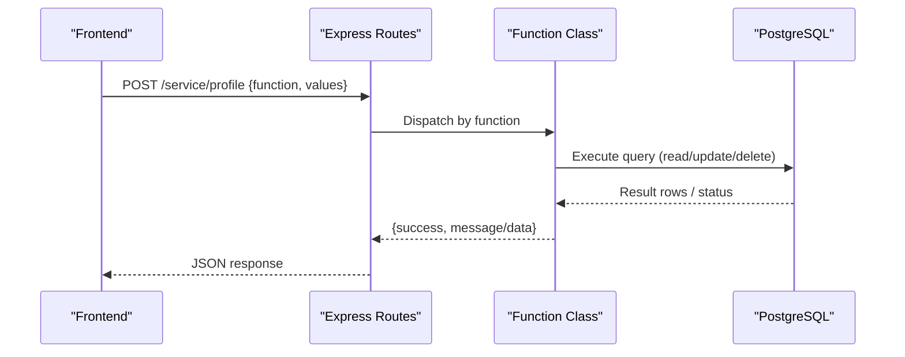
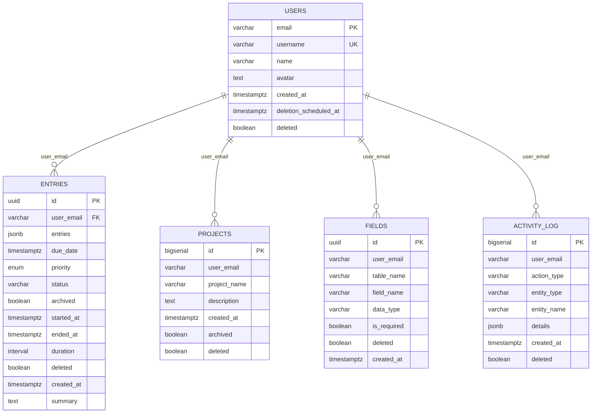
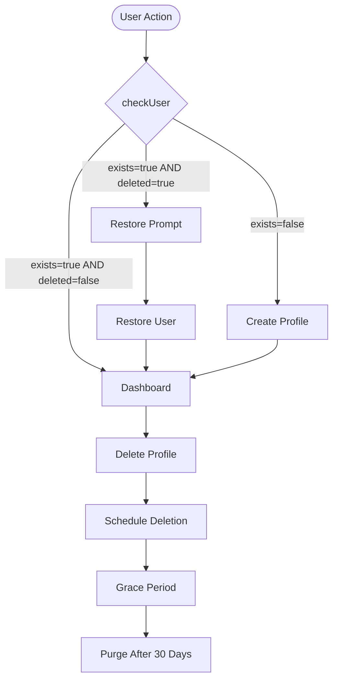
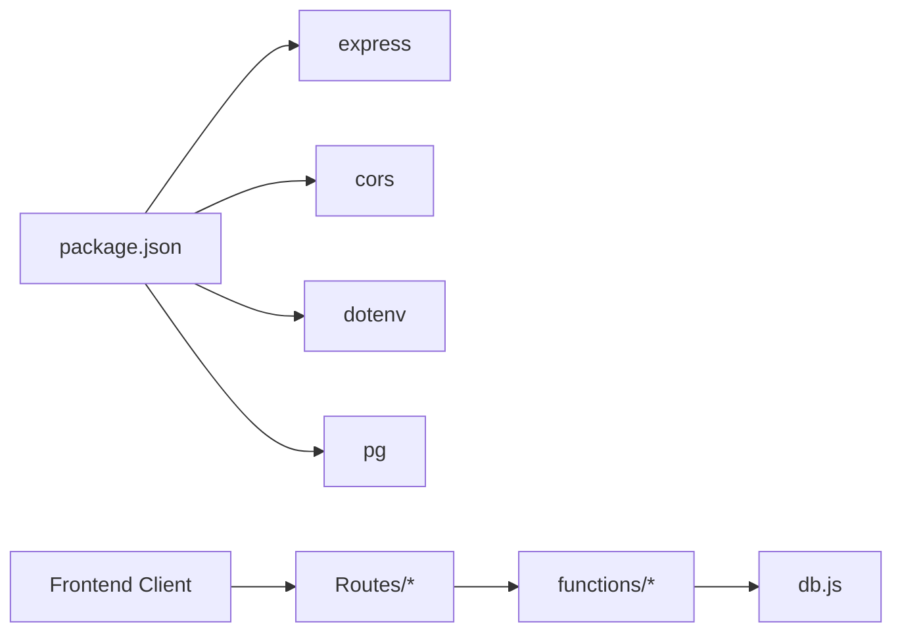

# Profile Service

<cite>
**Referenced Files in This Document**
- [index.js](file://services/profile-service/src/index.js)
- [config.js](file://services/profile-service/src/config.js)
- [db.js](file://services/profile-service/src/db.js)
- [profile.js (Routes)](file://services/profile-service/src/Routes/profile.js)
- [login.js (Routes)](file://services/profile-service/src/Routes/login.js)
- [profile.js (Functions)](file://services/profile-service/src/functions/profile.js)
- [login.js (Functions)](file://services/profile-service/src/functions/login.js)
- [000_baseline_full_schema.sql](file://supabase/migrations/000_baseline_full_schema.sql)
- [profile.js (Frontend client)](file://frontend/src/functions/profile/profile.js)
- [profileService.ts (Frontend re-export)](file://frontend/src/lib/profileService.ts)
- [package.json (Profile Service)](file://services/profile-service/package.json)
</cite>

## Table of Contents

1. Introduction
2. Project Structure
3. Core Components
4. Architecture Overview
5. Detailed Component Analysis
6. Dependency Analysis
7. Performance Considerations
8. Troubleshooting Guide
9. Conclusion

## Introduction

The Profile Service is a microservice that manages user profiles, preferences, and avatar handling. It exposes a compact REST-like API to create or update profile fields (username, name, email), manage avatar references, retrieve profile data, toggle email notification preferences, and perform soft deletion of a user’s account along with related data. The service integrates with the authentication system via database triggers and supports a graceful user lifecycle with a 30-day grace period before permanent purging.

## Project Structure

The service is an Express application with:

- A single entry point that configures CORS, JSON parsing, routes, and error handling.
- Route modules that dispatch requests to domain-specific function classes.
- Function classes encapsulating business logic and database operations.
- A shared PostgreSQL connection pool module.
- Frontend integration through a dedicated client library that calls the service endpoints.

**Diagram sources**

- [index.js:1-77](file://services/profile-service/src/index.js#L1-L77)
- [profile.js (Routes):1-107](file://services/profile-service/src/Routes/profile.js#L1-L107)
- [login.js (Routes):1-52](file://services/profile-service/src/Routes/login.js#L1-L52)
- [profile.js (Functions):1-208](file://services/profile-service/src/functions/profile.js#L1-L208)
- [login.js (Functions):1-40](file://services/profile-service/src/functions/login.js#L1-L40)
- [db.js:1-32](file://services/profile-service/src/db.js#L1-L32)

**Section sources**

- [index.js:1-77](file://services/profile-service/src/index.js#L1-L77)
- [package.json (Profile Service):1-43](file://services/profile-service/package.json#L1-L43)

## Core Components

- Express server with CORS and global error handling.
- Route handlers for profile and login operations.
- Domain function classes for username, email, name, avatar, profile read/delete, and email notifications.
- PostgreSQL connection pool with SSL configured for Supabase.
- Database schema defining users and related tables with soft-delete support and lifecycle helpers.

Key responsibilities:

- Validate inputs and route to appropriate function class.
- Enforce constraints (e.g., unique usernames).
- Persist profile data and preferences.
- Support soft-deletion across related entities.
- Provide login status checks including deleted state and scheduled deletion timestamp.

**Section sources**

- [profile.js (Routes):1-107](file://services/profile-service/src/Routes/profile.js#L1-L107)
- [login.js (Routes):1-52](file://services/profile-service/src/Routes/login.js#L1-L52)
- [profile.js (Functions):1-208](file://services/profile-service/src/functions/profile.js#L1-L208)
- [login.js (Functions):1-40](file://services/profile-service/src/functions/login.js#L1-L40)
- [db.js:1-32](file://services/profile-service/src/db.js#L1-L32)
- [000_baseline_full_schema.sql:29-37](file://supabase/migrations/000_baseline_full_schema.sql#L29-L37)

## Architecture Overview

The service follows a layered architecture:

- Presentation layer: Express routes accept POST requests with a function selector and values payload.
- Business layer: Function classes implement domain logic and validation.
- Data access layer: Direct SQL queries via pg against a shared PostgreSQL instance.

**Diagram sources**

- [profile.js (Routes):1-107](file://services/profile-service/src/Routes/profile.js#L1-L107)
- [profile.js (Functions):1-208](file://services/profile-service/src/functions/profile.js#L1-L208)
- [db.js:1-32](file://services/profile-service/src/db.js#L1-L32)

## Detailed Component Analysis

### API Endpoints and Operations

All operations are exposed via POST to a single endpoint with a function selector.

- Base path: /service/profile
- Common request shape:
  - function: string identifying the operation
  - values: object with operation-specific parameters

Supported functions:

- username: Update username (requires email, username; rejects if taken)
- email: Insert new user record during sign-up (requires email; generates default username/name)
- name: Update display name (requires email, new_name)
- avatar: Update avatar URL reference (requires email, url)
- getProfile: Retrieve full profile (requires email)
- emailNotifications: Toggle email notifications preference (requires email, enabled boolean)
- deleteProfile: Soft-delete user and related data (requires email)

Authentication integration:

- /service/login POST with function checkUser returns existence, deleted flag, and deletion_scheduled_at for UI routing decisions.

Example flows:

- Create profile on sign-up: call email, then optionally set name/avatar.
- Update profile: call name or username or avatar with current email.
- Fetch profile: call getProfile with email.
- Manage preferences: call emailNotifications with enabled true/false.
- Delete profile: call deleteProfile to soft-delete user and related records.

Notes:

- Avatar storage is handled by storing a URL in the users table; actual file upload/compression is implemented in another service and referenced here by URL.

**Section sources**

- [profile.js (Routes):1-107](file://services/profile-service/src/Routes/profile.js#L1-L107)
- [profile.js (Functions):1-208](file://services/profile-service/src/functions/profile.js#L1-L208)
- [login.js (Routes):1-52](file://services/profile-service/src/Routes/login.js#L1-L52)
- [login.js (Functions):1-40](file://services/profile-service/src/functions/login.js#L1-L40)

### Data Model and Storage

Core user profile entity resides in the users table with:

- email (PK), username (unique), name, avatar (TEXT URL), created_at, deletion_scheduled_at, deleted (soft-delete flag).

Related tables affected by profile deletion:

- entries, fields, projects, activity_log all include user_email and deleted flags.

Lifecycle helpers:

- Triggers auto-provision users from auth.users on signup.
- Functions to schedule deletion, restore, and purge after grace period.

**Diagram sources**

- [000_baseline_full_schema.sql:29-37](file://supabase/migrations/000_baseline_full_schema.sql#L29-L37)
- [000_baseline_full_schema.sql:41-49](file://supabase/migrations/000_baseline_full_schema.sql#L41-L49)
- [000_baseline_full_schema.sql:69-84](file://supabase/migrations/000_baseline_full_schema.sql#L69-L84)
- [000_baseline_full_schema.sql:97-106](file://supabase/migrations/000_baseline_full_schema.sql#L97-L106)
- [000_baseline_full_schema.sql:110-119](file://supabase/migrations/000_baseline_full_schema.sql#L110-L119)

**Section sources**

- [000_baseline_full_schema.sql:29-37](file://supabase/migrations/000_baseline_full_schema.sql#L29-L37)
- [000_baseline_full_schema.sql:69-84](file://supabase/migrations/000_baseline_full_schema.sql#L69-L84)
- [000_baseline_full_schema.sql:97-106](file://supabase/migrations/000_baseline_full_schema.sql#L97-L106)
- [000_baseline_full_schema.sql:110-119](file://supabase/migrations/000_baseline_full_schema.sql#L110-L119)
- [000_baseline_full_schema.sql:162-240](file://supabase/migrations/000_baseline_full_schema.sql#L162-L240)

### User Lifecycle Management

- Sign-up: Trigger inserts a row into users when auth.users receives a new user.
- Login check: Returns exists, deleted, and deletion_scheduled_at to guide frontend flow.
- Deletion: Soft-delete sets deleted=true and schedules deletion_scheduled_at; related entities are also soft-deleted.
- Restoration: Clears deletion flags and resets timestamps.
- Purge: Nightly job permanently removes users marked deleted beyond the grace period and their related data.

**Diagram sources**

- [login.js (Functions):1-40](file://services/profile-service/src/functions/login.js#L1-L40)
- [000_baseline_full_schema.sql:162-240](file://supabase/migrations/000_baseline_full_schema.sql#L162-L240)

**Section sources**

- [login.js (Functions):1-40](file://services/profile-service/src/functions/login.js#L1-L40)
- [000_baseline_full_schema.sql:277-297](file://supabase/migrations/000_baseline_full_schema.sql#L277-L297)
- [000_baseline_full_schema.sql:162-240](file://supabase/migrations/000_baseline_full_schema.sql#L162-L240)

### Avatar Handling and File Processing

- The Profile Service stores the avatar as a URL string in the users.avatar column.
- Actual file upload, compression, and storage are implemented in another service using Supabase Storage and image processing utilities.
- The Profile Service updates the stored URL upon successful upload elsewhere.

Integration pattern:

- Frontend uploads image via the storage-capable service.
- On success, the returned URL is sent to Profile Service via the avatar function to persist it.

Security considerations:

- Only URLs are persisted; no direct file handling in this service reduces attack surface.
- Ensure uploaded files are validated and sanitized by the storage service.

**Section sources**

- [profile.js (Functions):83-101](file://services/profile-service/src/functions/profile.js#L83-L101)
- [000_baseline_full_schema.sql:29-37](file://supabase/migrations/000_baseline_full_schema.sql#L29-L37)

### Preference Management

- Email notifications preference is stored in users.email_notifications and toggled via the emailNotifications function.
- Frontend syncs the UI toggle to the server to ensure downstream services (e.g., due-date emails) honor the setting.

Operational notes:

- The function accepts a boolean enabled flag and persists it server-side.
- If offline, the frontend may skip server sync but retains local preference.

**Section sources**

- [profile.js (Functions):103-126](file://services/profile-service/src/functions/profile.js#L103-L126)
- [profile.js (Frontend client):215-233](file://frontend/src/functions/profile/profile.js#L215-L233)

### Data Validation and Error Handling

- Input validation occurs at the route level (required fields checked per function).
- Function classes validate prerequisites (e.g., database connectivity) and return structured results with success/message.
- Global error handler ensures consistent error responses and proper CORS headers even on failures.

Error patterns:

- Missing parameters return 400 with descriptive errors.
- Database errors propagate as failure messages.
- Unhandled exceptions return 500 with generic error and details.

**Section sources**

- [profile.js (Routes):31-104](file://services/profile-service/src/Routes/profile.js#L31-L104)
- [profile.js (Functions):8-28](file://services/profile-service/src/functions/profile.js#L8-L28)
- [index.js:57-72](file://services/profile-service/src/index.js#L57-L72)

### Security Considerations

- CORS is restricted to allowed origins; credentials are permitted only for trusted origins.
- Database connections use SSL configuration suitable for managed databases.
- Sensitive operations rely on database-level security (triggers, functions) and do not handle raw files directly.
- Soft-delete model prevents accidental data loss and supports recovery workflows.

**Section sources**

- [index.js:12-46](file://services/profile-service/src/index.js#L12-L46)
- [db.js:9-21](file://services/profile-service/src/db.js#L9-L21)

## Dependency Analysis

The service has minimal external dependencies:

- Express for HTTP routing and middleware.
- cors for cross-origin policy enforcement.
- dotenv for environment variable loading.
- pg for PostgreSQL connectivity.

Internal dependencies:

- Routes depend on function classes.
- Function classes depend on the shared db pool.
- Frontend client depends on the service endpoints and caching mechanisms.

**Diagram sources**

- [package.json (Profile Service):1-43](file://services/profile-service/package.json#L1-L43)
- [profile.js (Routes):1-107](file://services/profile-service/src/Routes/profile.js#L1-L107)
- [profile.js (Functions):1-208](file://services/profile-service/src/functions/profile.js#L1-L208)
- [db.js:1-32](file://services/profile-service/src/db.js#L1-L32)

**Section sources**

- [package.json (Profile Service):1-43](file://services/profile-service/package.json#L1-L43)
- [profile.js (Routes):1-107](file://services/profile-service/src/Routes/profile.js#L1-L107)
- [profile.js (Functions):1-208](file://services/profile-service/src/functions/profile.js#L1-L208)
- [db.js:1-32](file://services/profile-service/src/db.js#L1-L32)

## Performance Considerations

- Connection pooling: Uses pg.Pool to manage concurrent database connections efficiently.
- Minimal queries: Each function executes targeted SQL statements; avoid N+1 patterns by batching where possible.
- Soft deletes: Use updated flags rather than hard deletes to reduce cascading deletions and improve performance.
- Caching: Frontend caches profile data locally to reduce network load and improve responsiveness.

Recommendations:

- Add indexes on frequently queried columns if needed (e.g., email lookups already covered by PK).
- Monitor query performance and consider read replicas for high traffic scenarios.
- Implement rate limiting at the gateway level to protect the service.

[No sources needed since this section provides general guidance]

## Troubleshooting Guide

Common issues and resolutions:

- Database not connected: Ensure DATABASE_URL is set; the service logs warnings and returns failure messages when pool is unavailable.
- CORS errors: Verify origin is included in allowedOrigins; check browser console for preflight failures.
- Invalid function or missing parameters: Ensure the request body includes a valid function and required values.
- Profile not found: Confirm the email exists; getProfile returns a specific message when no rows are found.
- Delete failures: Check transaction boundaries; errors trigger rollback and release of the client connection.

Debugging tips:

- Inspect server logs for unhandled errors and detailed messages.
- Validate database connectivity by running SELECT 1.
- Use tests to simulate failures and verify error paths.

**Section sources**

- [db.js:5-7](file://services/profile-service/src/db.js#L5-L7)
- [profile.js (Routes):31-104](file://services/profile-service/src/Routes/profile.js#L31-L104)
- [profile.js (Functions):132-153](file://services/profile-service/src/functions/profile.js#L132-L153)
- [profile.js (Functions):156-206](file://services/profile-service/src/functions/profile.js#L156-L206)

## Conclusion

The Profile Service provides a focused, secure, and efficient interface for managing user profiles and preferences. Its design separates concerns between routing, business logic, and data access, while leveraging PostgreSQL features for lifecycle management and soft deletes. Integration with the frontend includes robust caching and offline queuing to enhance resilience. Avatar handling is decoupled to a storage-capable service, keeping this service lightweight and secure.
