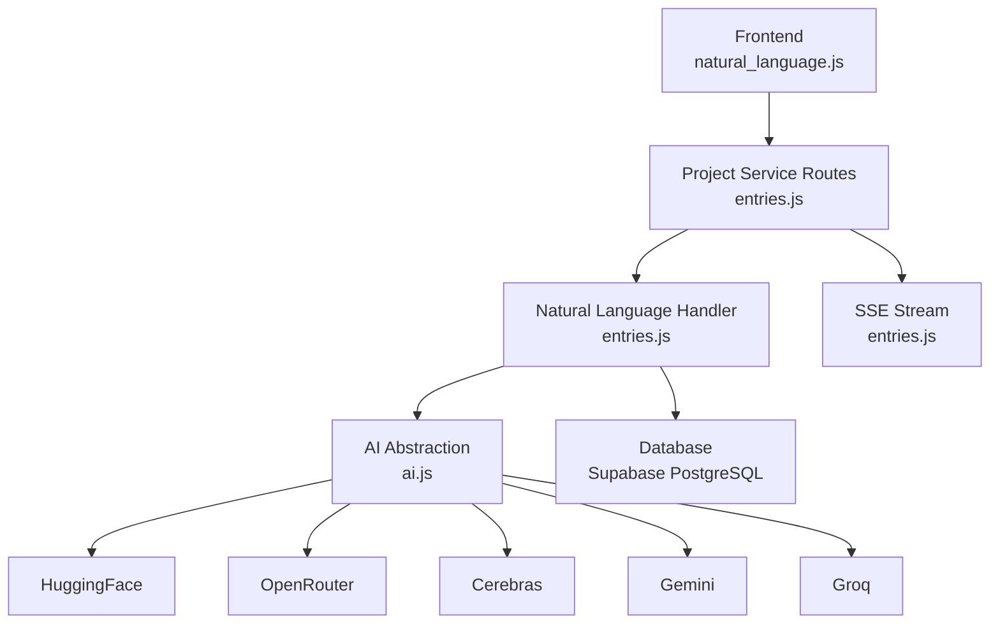
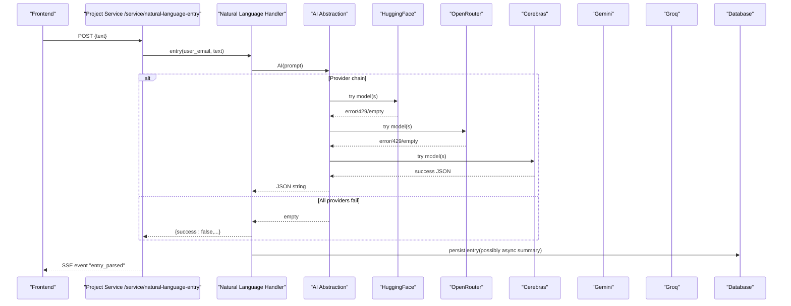
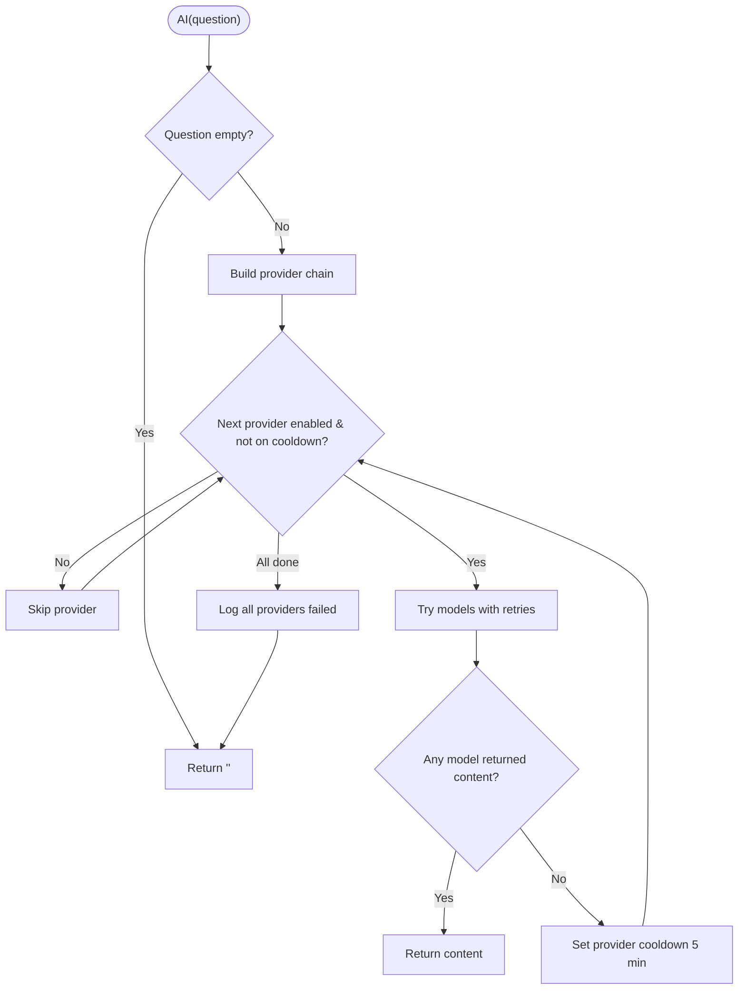
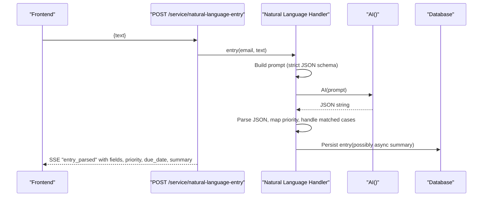
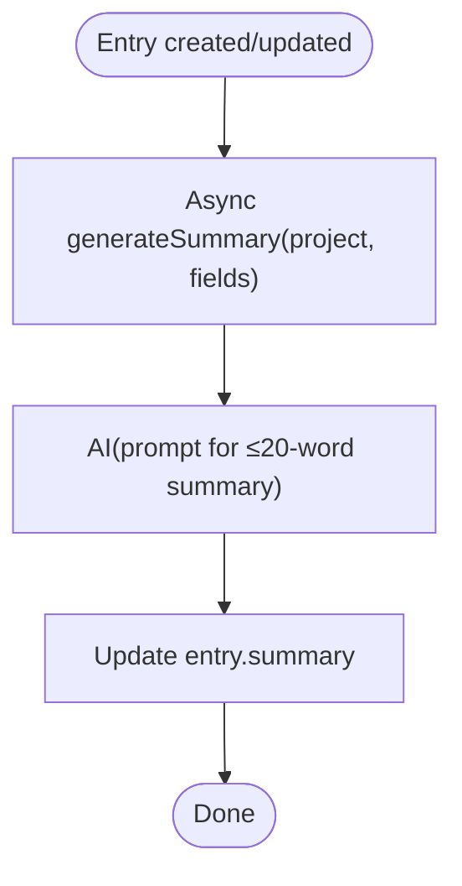
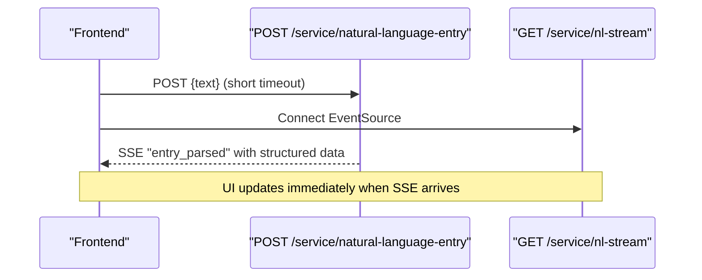
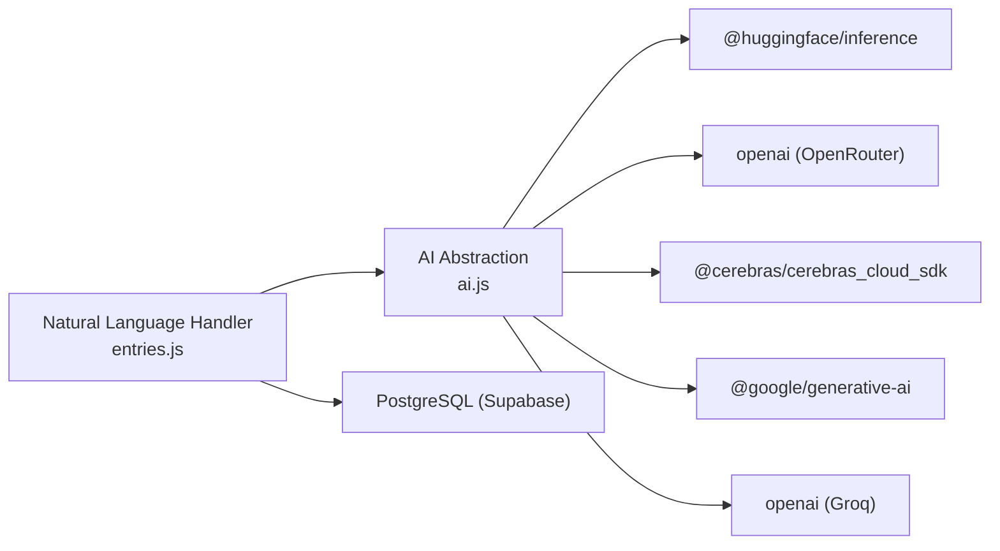

# AI Integration

<cite>
**Referenced Files in This Document**
- [ai.js](file://services/project-service/src/functions/ai.js)
- [entries.js](file://services/project-service/src/functions/entries.js)
- [entries_routes.js](file://services/project-service/src/Routes/entries.js)
- [ai_route.js](file://services/project-service/src/Routes/ai.js)
- [natural_language_frontend.js](file://frontend/src/functions/project/natural_language.js)
- [backfill_summaries.js](file://services/project-service/scripts/backfill-summaries.js)
- [third_party.md](file://docs-site/docs/Architecture/third-party.md)
- [entry_summaries_doc.md](file://docs-site/docs/Architecture/entry-summaries.md)
</cite>

## Table of Contents

1. Introduction
2. Project Structure
3. Core Components
4. Architecture Overview
5. Detailed Component Analysis
6. Dependency Analysis
7. Performance Considerations
8. Troubleshooting Guide
9. Conclusion
10. Appendices

## Introduction

This document explains the AI integration that powers natural language processing for task creation, entry summarization, and intelligent suggestions. It covers the multi-provider abstraction layer (OpenRouter, HuggingFace, Gemini, Cerebras, Groq), provider selection logic, fallback and rate-limiting strategies, cost optimization, error handling, security and privacy considerations, and end-to-end flows from frontend to backend to providers.

## Project Structure

The AI features are implemented primarily in the project-service backend with a thin frontend interface:

- Frontend submits natural language text via an HTTP POST; results arrive in real time via Server-Sent Events (SSE).
- Backend routes delegate to a Natural Language handler that builds prompts and calls a unified AI() function.
- The AI() function implements a robust multi-provider chain with per-model retries, exponential backoff on rate limits, and database-backed cooldowns.
- Summaries are generated asynchronously after entries are created or updated, and can be backfilled across existing data.

**Diagram sources**

- [natural_language_frontend.js:13-43](file://frontend/src/functions/project/natural_language.js#L13-L43)
- [entries_routes.js:235-325](file://services/project-service/src/Routes/entries.js#L235-L325)
- [entries.js:900-1100](file://services/project-service/src/functions/entries.js#L900-L1100)
- [ai.js:403-462](file://services/project-service/src/functions/ai.js#L403-L462)

**Section sources**

- [natural_language_frontend.js:1-44](file://frontend/src/functions/project/natural_language.js#L1-L44)
- [entries_routes.js:1-328](file://services/project-service/src/Routes/entries.js#L1-L328)
- [entries.js:900-1100](file://services/project-service/src/functions/entries.js#L900-L1100)
- [ai.js:1-463](file://services/project-service/src/functions/ai.js#L1-L463)

## Core Components

- Multi-provider AI abstraction: Centralized provider selection, model lists, retry/backoff, and cooldown management.
- Natural language parsing: Prompt engineering to extract structured fields, project matching, priority, due dates, and comments.
- Entry summarization: Lightweight AI call to generate concise summaries stored per entry.
- SSE delivery: Real-time push of parsed results to the frontend before full persistence completes.
- Backfill utility: Batched script to retroactively generate summaries for existing entries.

**Section sources**

- [ai.js:42-117](file://services/project-service/src/functions/ai.js#L42-L117)
- [entries.js:900-1100](file://services/project-service/src/functions/entries.js#L900-L1100)
- [entry_summaries_doc.md:108-164](file://docs-site/docs/Architecture/entry-summaries.md#L108-L164)
- [backfill_summaries.js:1-132](file://services/project-service/scripts/backfill-summaries.js#L1-L132)

## Architecture Overview

The system uses a layered architecture:

- Frontend triggers natural language entry submission and listens for SSE events.
- Backend routes validate input, invoke the Natural Language handler, and stream results via SSE.
- The Natural Language handler constructs strict JSON prompts and calls the AI abstraction.
- The AI abstraction tries providers in order, with per-model retries and exponential backoff on rate limits; failed providers are temporarily cooled down via a database table.
- After successful parsing, entries are persisted and summaries are generated asynchronously.

**Diagram sources**

- [entries_routes.js:235-325](file://services/project-service/src/Routes/entries.js#L235-L325)
- [entries.js:900-1100](file://services/project-service/src/functions/entries.js#L900-L1100)
- [ai.js:403-462](file://services/project-service/src/functions/ai.js#L403-L462)

## Detailed Component Analysis

### Multi-Provider AI Abstraction Layer

- Provider chain order: HuggingFace → OpenRouter → Cerebras → Gemini → Groq. Each provider is enabled only if its API key is present.
- Model fallbacks: Within each provider, multiple models are tried sequentially. On failure, the next model is attempted.
- Rate limiting and backoff: Errors indicating rate limits trigger exponential backoff retries within a provider/model attempt.
- Cooldown mechanism: If all models in a provider fail, the provider is marked on cooldown for 5 minutes using a database table to avoid repeated failures.
- JSON enforcement: A strict system instruction forces providers to return valid JSON without markdown wrappers.

**Diagram sources**

- [ai.js:403-462](file://services/project-service/src/functions/ai.js#L403-L462)
- [ai.js:338-399](file://services/project-service/src/functions/ai.js#L338-L399)
- [ai.js:281-336](file://services/project-service/src/functions/ai.js#L281-L336)

**Section sources**

- [ai.js:42-117](file://services/project-service/src/functions/ai.js#L42-L117)
- [ai.js:152-170](file://services/project-service/src/functions/ai.js#L152-L170)
- [ai.js:281-336](file://services/project-service/src/functions/ai.js#L281-L336)
- [ai.js:338-399](file://services/project-service/src/functions/ai.js#L338-L399)
- [ai.js:403-462](file://services/project-service/src/functions/ai.js#L403-L462)
- [third_party.md:292-321](file://docs-site/docs/Architecture/third-party.md#L292-L321)

### Natural Language Processing for Task Creation

- Input: Free-form text describing tasks, projects, priorities, and due dates.
- Prompt strategy: Strict instructions enforce paraphrasing into clean descriptions, avoidance of first-person pronouns in field values, and explicit JSON schema guidance for different match scenarios (new project, existing project, project-only request, split/move between projects).
- Output: Structured JSON including matched type, project name, fields, new custom fields, priority, and a comment explaining reasoning.
- Parsing resilience: The handler cleans markdown fences, parses JSON, maps numeric priority to labels, and handles edge cases like incomplete or nonsensical input by documenting decisions in the comment.

**Diagram sources**

- [entries_routes.js:235-325](file://services/project-service/src/Routes/entries.js#L235-L325)
- [entries.js:900-1100](file://services/project-service/src/functions/entries.js#L900-L1100)

**Section sources**

- [entries.js:900-1100](file://services/project-service/src/functions/entries.js#L900-L1100)
- [entries_routes.js:235-325](file://services/project-service/src/Routes/entries.js#L235-L325)

### Summary Generation and Backfill

- On create/update: After an entry is added or updated, a lightweight AI call generates a one-sentence summary (≤20 words) and updates the entry asynchronously so it does not block the response.
- Retrieval: Existing queries select all columns, automatically including the summary field.
- Backfill: A batched script iterates entries missing summaries, calls AI once per entry, and updates the column with rate limiting (pause every 10 entries).

**Diagram sources**

- [entries_routes.js:97-119](file://services/project-service/src/Routes/entries.js#L97-L119)
- [entry_summaries_doc.md:108-164](file://docs-site/docs/Architecture/entry-summaries.md#L108-L164)
- [backfill_summaries.js:63-124](file://services/project-service/scripts/backfill-summaries.js#L63-L124)

**Section sources**

- [entry_summaries_doc.md:108-164](file://docs-site/docs/Architecture/entry-summaries.md#L108-L164)
- [backfill_summaries.js:1-132](file://services/project-service/scripts/backfill-summaries.js#L1-L132)
- [entries_routes.js:97-119](file://services/project-service/src/Routes/entries.js#L97-L119)

### Frontend Integration and SSE

- Submission: The frontend posts natural language text to the service endpoint with a short timeout; the actual result arrives via SSE.
- SSE stream: The backend opens a persistent stream and pushes parsed results immediately upon completion, enabling fast UI updates.
- Error handling: Network errors or timeouts do not prevent SSE delivery; the frontend treats pending responses gracefully.

**Diagram sources**

- [natural_language_frontend.js:13-43](file://frontend/src/functions/project/natural_language.js#L13-L43)
- [entries_routes.js:193-233](file://services/project-service/src/Routes/entries.js#L193-L233)
- [entries_routes.js:235-325](file://services/project-service/src/Routes/entries.js#L235-L325)

**Section sources**

- [natural_language_frontend.js:1-44](file://frontend/src/functions/project/natural_language.js#L1-L44)
- [entries_routes.js:193-233](file://services/project-service/src/Routes/entries.js#L193-L233)
- [entries_routes.js:235-325](file://services/project-service/src/Routes/entries.js#L235-L325)

### General AI Endpoint

- A generic endpoint exposes the AI abstraction for arbitrary prompts, enforcing authentication and input validation.

**Section sources**

- [ai_route.js:1-39](file://services/project-service/src/Routes/ai.js#L1-L39)

## Dependency Analysis

- Providers and SDKs:
  - HuggingFace Inference Client
  - OpenAI-compatible clients for OpenRouter and Groq
  - Google Generative AI for Gemini
  - Cerebras Cloud SDK
- Configuration:
  - Provider enablement depends on environment variables for API keys.
  - Database pool used for cooldown state and entry storage.
- Coupling:
  - Natural Language handler depends on AI abstraction for parsing and summarization.
  - Routes depend on handlers and SSE registry for real-time delivery.

**Diagram sources**

- [ai.js:1-6](file://services/project-service/src/functions/ai.js#L1-L6)
- [ai.js:119-150](file://services/project-service/src/functions/ai.js#L119-L150)
- [entries.js:900-1100](file://services/project-service/src/functions/entries.js#L900-L1100)

**Section sources**

- [ai.js:1-6](file://services/project-service/src/functions/ai.js#L1-L6)
- [ai.js:119-150](file://services/project-service/src/functions/ai.js#L119-L150)
- [third_party.md:292-321](file://docs-site/docs/Architecture/third-party.md#L292-L321)

## Performance Considerations

- Provider selection prioritizes free-tier and high-availability models first to reduce latency and cost.
- Per-model retries with exponential backoff mitigate transient rate limits without excessive retries.
- Provider cooldowns prevent repeated attempts during outages, reducing wasted requests.
- Summaries are generated asynchronously to avoid blocking user-facing operations.
- Backfill script batches requests and pauses periodically to respect provider quotas.

[No sources needed since this section provides general guidance]

## Troubleshooting Guide

- Empty AI responses: Indicates all providers failed or are on cooldown. Check the ai_provider_cooldowns table and provider availability.
- Invalid JSON from AI: Ensure the system instruction is enforced and clean markdown fences before parsing.
- Rate limiting: Look for 429/503 status codes or messages containing “rate limit”, “quota”, “tokens per day”, “resource_exhausted”, or “try again later”.
- SSE issues: Verify the stream endpoint is reachable and keep-alive pings are sent; ensure no reverse proxy buffers the stream.
- Authentication: Ensure verified email is available in the request context for protected endpoints.

**Section sources**

- [entries.js:990-1007](file://services/project-service/src/functions/entries.js#L990-L1007)
- [ai.js:152-170](file://services/project-service/src/functions/ai.js#L152-L170)
- [entries_routes.js:193-233](file://services/project-service/src/Routes/entries.js#L193-L233)
- [ai_route.js:11-35](file://services/project-service/src/Routes/ai.js#L11-L35)

## Conclusion

The AI integration provides resilient, multi-provider natural language processing for creating structured tasks and generating concise summaries. The abstraction layer ensures high availability through provider fallbacks, rate-limit handling, and cooldowns. SSE enables immediate feedback to users while asynchronous summarization keeps the main flow responsive. Proper configuration of provider keys and monitoring of cooldowns and logs will help maintain reliability and cost efficiency.

[No sources needed since this section summarizes without analyzing specific files]

## Appendices

### Security, Privacy, and Compliance

- Authentication: Protected endpoints require a verified email from the JWT context; unauthorized requests are rejected.
- Secrets: Provider API keys are read from environment variables and never logged in full; logs show masked prefixes for debugging.
- Data minimization: Prompts include only necessary context (project name and entry fields); summaries are short and stored per entry.
- Compliance considerations: Avoid sending sensitive personal data in prompts; apply organizational policies for third-party AI usage and data retention.

**Section sources**

- [ai_route.js:11-35](file://services/project-service/src/Routes/ai.js#L11-L35)
- [ai.js:7-32](file://services/project-service/src/functions/ai.js#L7-L32)
