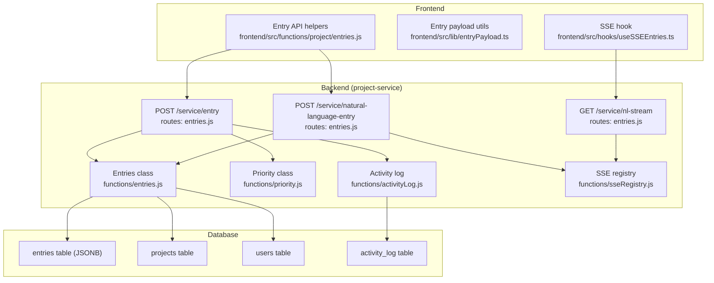
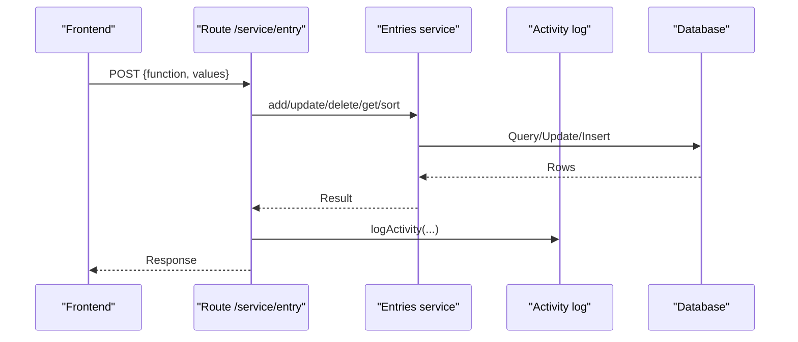
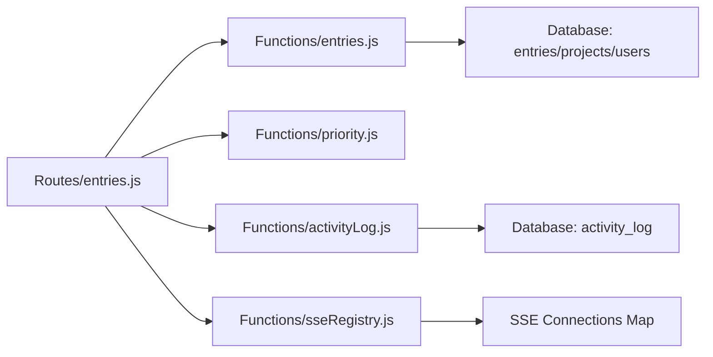
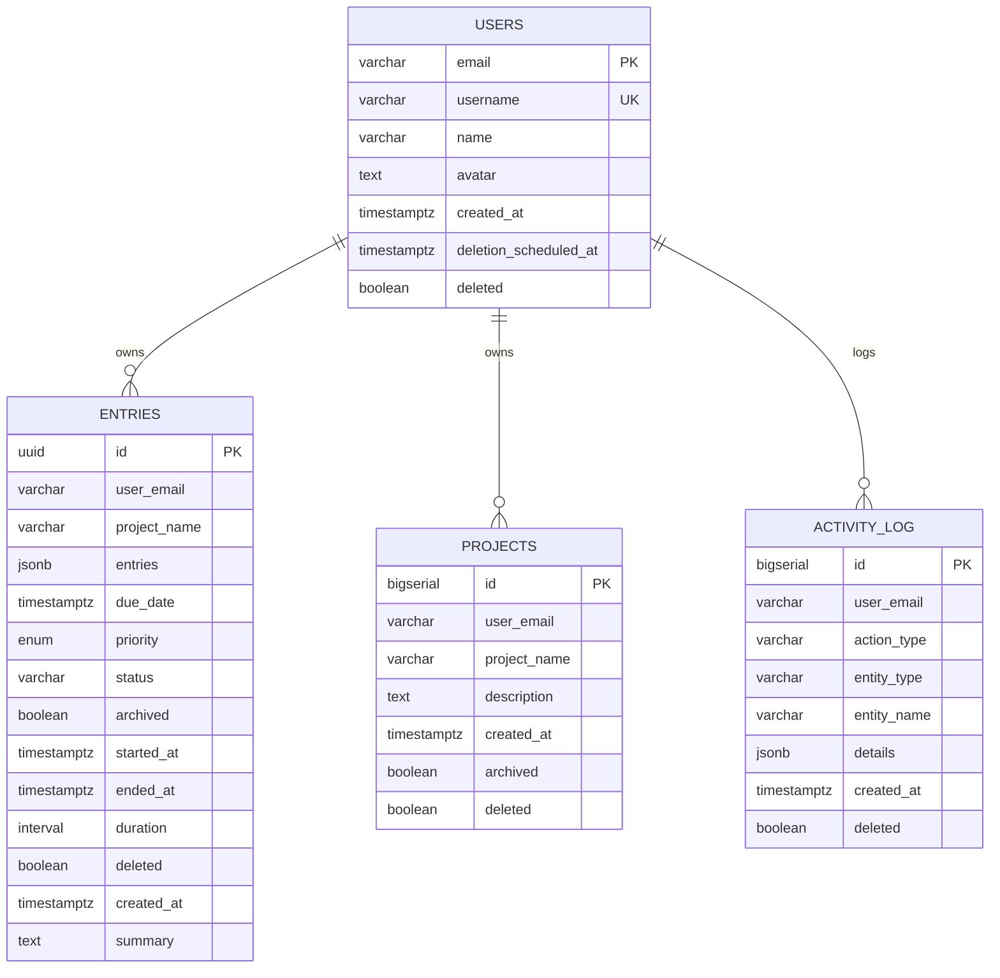

# Entry Management

<cite>
**Referenced Files in This Document**
- [entries.js](file://services/project-service/src/Routes/entries.js)
- [entries.js](file://services/project-service/src/functions/entries.js)
- [priority.js](file://services/project-service/src/functions/priority.js)
- [activityLog.js](file://services/project-service/src/functions/activityLog.js)
- [sseRegistry.js](file://services/project-service/src/functions/sseRegistry.js)
- [000_baseline_full_schema.sql](file://supabase/migrations/000_baseline_full_schema.sql)
- [entries.js](file://frontend/src/functions/project/entries.js)
- [entryPayload.ts](file://frontend/src/lib/entryPayload.ts)
- [useSSEEntries.ts](file://frontend/src/hooks/useSSEEntries.ts)
- [caching.md](file://docs-site/docs/Architecture/caching.md)
- [sse.md](file://docs-site/docs/Architecture/sse.md)
</cite>

## Table of Contents

1. Introduction
2. Project Structure
3. Core Components
4. Architecture Overview
5. Detailed Component Analysis
6. Dependency Analysis
7. Performance Considerations
8. Troubleshooting Guide
9. Conclusion
10. Appendices

## Introduction

This document provides comprehensive documentation for entry management functionality, including REST API endpoints for CRUD operations, status and priority management, due date handling, data models (including JSONB structure), validation rules, business logic, relationships to projects, users, and activity logs, as well as workflows for creation, bulk operations, filtering, sorting, scheduling features, performance considerations, caching strategies, and real-time updates via Server-Sent Events (SSE).

## Project Structure

The entry management feature spans the backend project-service (Express routes and functions), database schema (Supabase migrations), and frontend integration (IndexedDB-first architecture with SSE-driven cache invalidation).

**Diagram sources**

- [entries.js:1-328](file://services/project-service/src/Routes/entries.js#L1-L328)
- [entries.js:1-400](file://services/project-service/src/functions/entries.js#L1-L400)
- [priority.js:1-135](file://services/project-service/src/functions/priority.js#L1-L135)
- [activityLog.js:1-70](file://services/project-service/src/functions/activityLog.js#L1-L70)
- [sseRegistry.js:1-104](file://services/project-service/src/functions/sseRegistry.js#L1-L104)
- [000_baseline_full_schema.sql:67-94](file://supabase/migrations/000_baseline_full_schema.sql#L67-L94)

**Section sources**

- [entries.js:1-328](file://services/project-service/src/Routes/entries.js#L1-L328)
- [entries.js:1-400](file://services/project-service/src/functions/entries.js#L1-L400)
- [000_baseline_full_schema.sql:67-94](file://supabase/migrations/000_baseline_full_schema.sql#L67-L94)

## Core Components

- Entry CRUD and sorting are exposed through a single POST endpoint that dispatches by function name: add, update, delete, deleteById, get, getAll, sortUnarchived, sortArchived.
- Natural language entry parsing is handled via a dedicated route that pushes parsed results immediately via SSE before completing the request.
- Priority assignment is implemented as a separate service with explicit enum mapping and null support.
- Activity logging records user actions for audit and UI feeds.
- Database schema defines entries with JSONB content, timestamps, priority enum, status, and soft-delete flags.

Key responsibilities:

- Route layer validates input, enforces authentication context, and delegates to domain services.
- Domain services implement persistence, business rules, and cross-cutting concerns (e.g., summary regeneration, notes handling).
- SSE registry manages persistent connections and event broadcasting.
- Frontend uses IndexedDB-first reads, optimistic writes, offline queueing, and SSE-driven cache invalidation.

**Section sources**

- [entries.js:18-191](file://services/project-service/src/Routes/entries.js#L18-L191)
- [entries.js:43-115](file://services/project-service/src/functions/entries.js#L43-L115)
- [priority.js:17-51](file://services/project-service/src/functions/priority.js#L17-L51)
- [activityLog.js:21-36](file://services/project-service/src/functions/activityLog.js#L21-L36)
- [000_baseline_full_schema.sql:67-94](file://supabase/migrations/000_baseline_full_schema.sql#L67-L94)

## Architecture Overview

The system follows a local-first architecture:

- Reads come from IndexedDB; server calls are used only for initial sync or mutations.
- Mutations write optimistically to IndexedDB, then sync to the server; failures are queued for retry.
- SSE provides real-time updates when natural language parsing completes, invalidating caches and refreshing UI without waiting for full request completion.

**Diagram sources**

- [entries.js:23-191](file://services/project-service/src/Routes/entries.js#L23-L191)
- [entries.js:43-115](file://services/project-service/src/functions/entries.js#L43-L115)
- [activityLog.js:21-36](file://services/project-service/src/functions/activityLog.js#L21-L36)

## Detailed Component Analysis

### REST API Endpoints for Entries

- Endpoint: POST /service/entry
- Body shape: { function, values }
- Supported functions:
  - add: Creates an entry with optional due_date, priority, status, started_at, ended_at, duration, summary, notes. Logs activity on success.
  - update: Updates fields (entries JSONB patch, due_date, priority, status, started_at, ended_at, duration, summary). Triggers background summary regeneration if entry content changed. Logs activity on success.
  - delete: Soft-deletes by matching entries JSONB within a project. Also soft-deletes associated notes.
  - deleteById: Soft-deletes by id within user scope. Also soft-deletes associated notes.
  - get: Retrieves all non-deleted entries for a project.
  - getAll: Retrieves all non-deleted entries for a user, ordered by created_at desc.
  - sortUnarchived: Returns unarchived entries sorted by due_date ASC; supports priority-based ordering.
  - sortArchived: Returns archived entries sorted by due_date ASC; supports priority-based ordering.

Notes:

- Authentication is enforced via verified email from JWT attached to request context.
- All responses follow a consistent success/data/message envelope.

**Section sources**

- [entries.js:23-191](file://services/project-service/src/Routes/entries.js#L23-L191)
- [entries.js:211-399](file://services/project-service/src/functions/entries.js#L211-L399)

### Natural Language Entry Endpoint

- Endpoint: POST /service/natural-language-entry
- Behavior: Parses text into structured entry data using AI, pushes parsed result immediately via SSE to connected clients, then continues with DB writes and activity logging. Supports multi-entry splitting and new project creation.
- SSE events:
  - entry_parsed: Structured data pushed immediately after parsing.
  - entry_error: Error details pushed if parsing fails.

**Section sources**

- [entries.js:243-325](file://services/project-service/src/Routes/entries.js#L243-L325)
- [sse.md:42-120](file://docs-site/docs/Architecture/sse.md#L42-L120)

### SSE Stream Endpoint

- Endpoint: GET /service/nl-stream
- Purpose: Establishes a persistent SSE connection for a user, sends keep-alive pings, registers/unregisters connections, and enables server-to-client event pushing.

**Section sources**

- [entries.js:200-233](file://services/project-service/src/Routes/entries.js#L200-L233)
- [sseRegistry.js:17-74](file://services/project-service/src/functions/sseRegistry.js#L17-L74)

### Data Models and JSONB Structure

- entries table:
  - id: UUID primary key
  - user_email: FK-like reference to users.email
  - project_name: String identifying the project
  - entries: JSONB storing structured entry fields
  - due_date: TIMESTAMPTZ for scheduling
  - priority: Enum type priority_level
  - status: VARCHAR default 'up_next'
  - archived: Boolean flag
  - started_at, ended_at: TIMESTAMPTZ; duration computed column
  - deleted: Boolean soft-delete flag
  - created_at: TIMESTAMPTZ
  - summary: TEXT for AI-generated summaries

Indexes:

- idx_entries_user_email, idx_entries_project_name, idx_entries_due_date, idx_entries_archived

Relationships:

- entries.user_email references users.email
- entries.project_name associates entries with projects
- activity_log.user_email references users.email

**Section sources**

- [000_baseline_full_schema.sql:67-94](file://supabase/migrations/000_baseline_full_schema.sql#L67-L94)
- [000_baseline_full_schema.sql:27-37](file://supabase/migrations/000_baseline_full_schema.sql#L27-L37)
- [000_baseline_full_schema.sql:39-66](file://supabase/migrations/000_baseline_full_schema.sql#L39-L66)
- [000_baseline_full_schema.sql:108-123](file://supabase/migrations/000_baseline_full_schema.sql#L108-L123)

### Validation Schemas and Business Rules

- Input validation:
  - Function presence required for POST /service/entry.
  - Required parameters per function (e.g., project_name for add/update/delete; entry_id for deleteById).
  - Notes payload detection prevents accidental storage of notes arrays as entry summary.
- Business rules:
  - Summary regeneration runs in background after successful entry updates when entry content changes.
  - Soft deletes cascade to associated notes.
  - Sorting supports due_date order and priority-based ordering for both archived and unarchived sets.
  - Natural language parsing splits multiple distinct activities into separate entries and can create new projects.

**Section sources**

- [entries.js:23-191](file://services/project-service/src/Routes/entries.js#L23-L191)
- [entries.js:21-41](file://services/project-service/src/functions/entries.js#L21-L41)
- [entries.js:117-209](file://services/project-service/src/functions/entries.js#L117-L209)
- [entries.js:244-299](file://services/project-service/src/functions/entries.js#L244-L299)
- [entries.js:301-399](file://services/project-service/src/functions/entries.js#L301-L399)

### Status Management

- Default status is 'up_next'.
- Status can be updated via the update function alongside other fields.
- No explicit state machine transitions are enforced at the database level; status is a free-form string field.

**Section sources**

- [000_baseline_full_schema.sql:67-94](file://supabase/migrations/000_baseline_full_schema.sql#L67-L94)
- [entries.js:117-209](file://services/project-service/src/functions/entries.js#L117-L209)

### Priority Assignment

- Priority levels are defined by an enum:
  - 'Urgent and important'
  - 'Urgent but not important'
  - 'Not urgent, not important'
  - Null allowed (no priority)
- The Priority service maps numeric inputs to enum labels or null and updates entries accordingly.

**Section sources**

- [priority.js:7-51](file://services/project-service/src/functions/priority.js#L7-L51)
- [000_baseline_full_schema.sql:16-25](file://supabase/migrations/000_baseline_full_schema.sql#L16-L25)

### Due Date Handling

- due_date stored as TIMESTAMPTZ.
- Natural language parsing includes robust date extraction supporting keywords like today, tomorrow, next week, day names, month names, and relative expressions.
- Sorting defaults to due_date ASC for both archived and unarchived queries.

**Section sources**

- [entries.js:489-640](file://services/project-service/src/functions/entries.js#L489-L640)
- [entries.js:301-399](file://services/project-service/src/functions/entries.js#L301-L399)
- [000_baseline_full_schema.sql:67-94](file://supabase/migrations/000_baseline_full_schema.sql#L67-L94)

### Relationship Between Entries, Projects, Users, and Activity Logs

- Entries belong to a project via project_name and are scoped by user_email.
- Users are identified by email; activity_log entries are scoped per user.
- Activity logging captures ENTRY_ADDED, ENTRY_UPDATED, ENTRY_DELETED events with contextual details.

**Section sources**

- [000_baseline_full_schema.sql:67-94](file://supabase/migrations/000_baseline_full_schema.sql#L67-L94)
- [000_baseline_full_schema.sql:108-123](file://supabase/migrations/000_baseline_full_schema.sql#L108-L123)
- [activityLog.js:21-36](file://services/project-service/src/functions/activityLog.js#L21-L36)

### Entry Creation Workflows

- Direct creation:
  - Call POST /service/entry with function=add and values containing project_name and entry_object plus optional metadata.
  - On success, activity is logged and response returned.
- Natural language creation:
  - Call POST /service/natural-language-entry with text.
  - Backend parses text, pushes parsed data via SSE immediately, then persists entries and logs activity.
  - Frontend listens for entry_parsed events to invalidate caches and refresh UI.

**Section sources**

- [entries.js:23-191](file://services/project-service/src/Routes/entries.js#L23-L191)
- [entries.js:243-325](file://services/project-service/src/Routes/entries.js#L243-L325)
- [useSSEEntries.ts:41-108](file://frontend/src/hooks/useSSEEntries.ts#L41-L108)

### Bulk Operations, Filtering, and Sorting

- Bulk operations:
  - Use getAll to retrieve all entries for a user.
  - Use sortUnarchived/sortArchived to fetch filtered subsets based on archive state and sort_type.
- Filtering:
  - Queries filter by user_email, project_name, deleted=false, and archived flags.
- Sorting:
  - Default sort by due_date ASC.
  - Optional priority-based ordering for unarchived and archived sets.

**Section sources**

- [entries.js:211-242](file://services/project-service/src/functions/entries.js#L211-L242)
- [entries.js:301-399](file://services/project-service/src/functions/entries.js#L301-L399)

### Caching Strategies and Real-Time Updates

- Local-first caching:
  - Frontend reads from IndexedDB stores (projects, all-entries, per-project entries).
  - Mutations write optimistically to IndexedDB, then sync to server; failures are queued for retry.
- SSE-driven invalidation:
  - When natural language parsing completes, SSE events trigger cache invalidation and UI refresh without waiting for full POST response.
- Offline support:
  - Actions are queued in IndexedDB and processed when connectivity returns.

**Section sources**

- [caching.md:54-106](file://docs-site/docs/Architecture/caching.md#L54-L106)
- [caching.md:108-180](file://docs-site/docs/Architecture/caching.md#L108-L180)
- [sse.md:42-120](file://docs-site/docs/Architecture/sse.md#L42-L120)
- [useSSEEntries.ts:55-88](file://frontend/src/hooks/useSSEEntries.ts#L55-L88)

## Dependency Analysis

**Diagram sources**

- [entries.js:1-328](file://services/project-service/src/Routes/entries.js#L1-L328)
- [entries.js:1-400](file://services/project-service/src/functions/entries.js#L1-L400)
- [priority.js:1-135](file://services/project-service/src/functions/priority.js#L1-L135)
- [activityLog.js:1-70](file://services/project-service/src/functions/activityLog.js#L1-L70)
- [sseRegistry.js:1-104](file://services/project-service/src/functions/sseRegistry.js#L1-L104)

**Section sources**

- [entries.js:1-328](file://services/project-service/src/Routes/entries.js#L1-L328)
- [entries.js:1-400](file://services/project-service/src/functions/entries.js#L1-L400)

## Performance Considerations

- Index usage:
  - Queries leverage indexes on user_email, project_name, due_date, and archived to optimize retrieval.
- Sorting efficiency:
  - Default due_date ASC sorting minimizes computation; priority-based sorting is performed in-memory on fetched rows.
- Background processing:
  - Summary regeneration runs asynchronously to avoid blocking update responses.
- SSE keep-alives:
  - Periodic pings prevent connection timeouts and maintain responsiveness.
- Local-first reads:
  - IndexedDB-first approach eliminates repeated network calls for reads, improving perceived performance.

[No sources needed since this section provides general guidance]

## Troubleshooting Guide

Common issues and resolutions:

- Missing function parameter:
  - Ensure POST body includes a valid function value.
- Unauthorized access:
  - Verify JWT context provides verified user_email.
- Entry not found during update/delete:
  - Confirm entry_id exists and belongs to the authenticated user and project.
- Notes payload misplacement:
  - Avoid passing notes array into summary; backend detects and corrects this pattern.
- SSE connection drops:
  - Ensure client reconnects; server cleans up dead connections automatically.

**Section sources**

- [entries.js:23-191](file://services/project-service/src/Routes/entries.js#L23-L191)
- [entries.js:117-209](file://services/project-service/src/functions/entries.js#L117-L209)
- [entries.js:244-299](file://services/project-service/src/functions/entries.js#L244-L299)
- [sseRegistry.js:30-74](file://services/project-service/src/functions/sseRegistry.js#L30-L74)

## Conclusion

Entry management provides a robust set of CRUD operations, flexible sorting and filtering, priority and status handling, and advanced natural language parsing with immediate real-time feedback via SSE. The local-first architecture ensures responsive UIs and reliable offline behavior, while database indexes and background processing maintain performance at scale.

[No sources needed since this section summarizes without analyzing specific files]

## Appendices

### API Reference Summary

- POST /service/entry
  - Functions: add, update, delete, deleteById, get, getAll, sortUnarchived, sortArchived
  - Auth: Requires verified user_email from JWT
  - Responses: { success, message?, data? }
- POST /service/natural-language-entry
  - Input: { text }
  - SSE: Pushes entry_parsed and entry_error events
- GET /service/nl-stream
  - SSE endpoint for real-time updates

**Section sources**

- [entries.js:23-325](file://services/project-service/src/Routes/entries.js#L23-L325)

### Data Model Diagram

**Diagram sources**

- [000_baseline_full_schema.sql:27-37](file://supabase/migrations/000_baseline_full_schema.sql#L27-L37)
- [000_baseline_full_schema.sql:39-66](file://supabase/migrations/000_baseline_full_schema.sql#L39-L66)
- [000_baseline_full_schema.sql:67-94](file://supabase/migrations/000_baseline_full_schema.sql#L67-L94)
- [000_baseline_full_schema.sql:108-123](file://supabase/migrations/000_baseline_full_schema.sql#L108-L123)
