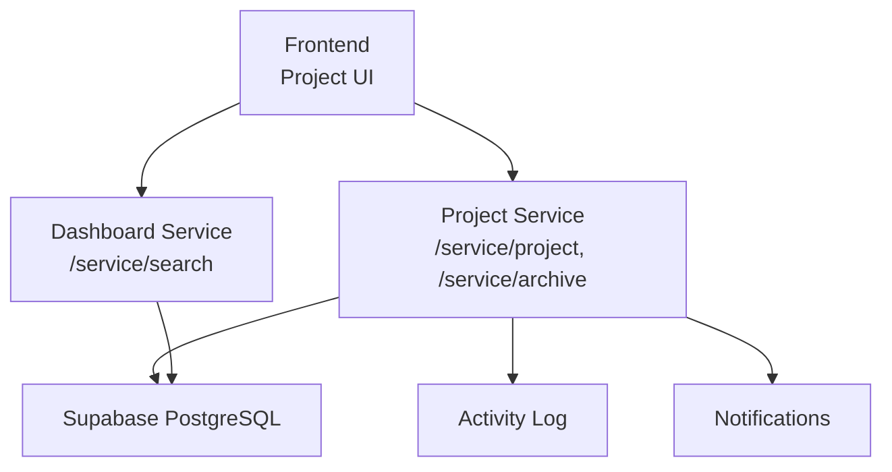
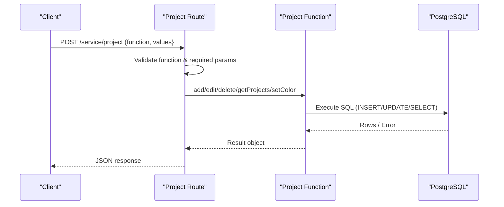
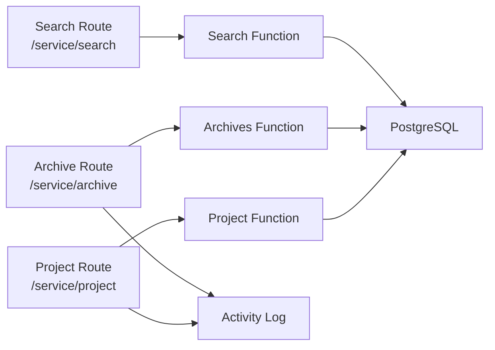
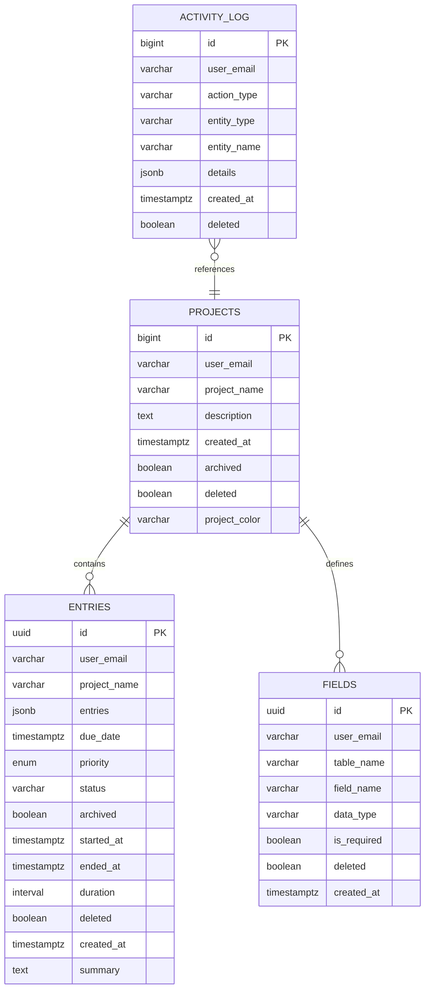

# Project Management

<cite>
**Referenced Files in This Document**
- [project.js](file://services/project-service/src/Routes/project.js)
- [project.js](file://services/project-service/src/functions/project.js)
- [archive.js](file://services/project-service/src/Routes/archive.js)
- [archives.js](file://services/project-service/src/functions/archives.js)
- [openapi.yaml](file://services/project-service/docs/openapi.yaml)
- [000_baseline_full_schema.sql](file://supabase/migrations/000_baseline_full_schema.sql)
- [001_add_project_description_and_unique_name.sql](file://supabase/migrations/001_add_project_description_and_unique_name.sql)
- [008_add_project_color.sql](file://supabase/migrations/008_add_project_color.sql)
- [011_create_notifications.sql](file://supabase/migrations/011_create_notifications.sql)
- [search.js](file://services/dashboard-service/src/Routes/search.js)
- [search.js](file://frontend/src/functions/project/search.js)
- [project.js](file://frontend/src/functions/project/project.js)
- [api.ts](file://frontend/src/lib/api.ts)
</cite>

## Table of Contents

1. Introduction
2. Project Structure
3. Core Components
4. Architecture Overview
5. Detailed Component Analysis
6. Dependency Analysis
7. Performance Considerations
8. Troubleshooting Guide
9. Conclusion
10. Appendices

## Introduction

This document provides comprehensive documentation for project management functionality, including REST API endpoints for project CRUD operations, data models, validation rules, business logic, ownership and access control, sharing mechanisms (as implemented), search and filtering, statistics, archival behavior, data integrity constraints, indexing strategies, and performance considerations for large project collections. It is intended for developers integrating with or extending the project service and for users who need to understand how projects are created, organized, searched, archived, and deleted.

## Project Structure

The project management feature spans multiple services:

- Project Service exposes RPC-style endpoints for project CRUD, archiving, fields, entries, activity, AI, and notifications.
- Dashboard Service provides cross-project search capabilities.
- Supabase migrations define the database schema, constraints, indexes, and server-side functions used by the services.
- Frontend utilities call the APIs, implement optimistic updates, offline queuing, and caching.

**Diagram sources**

- [openapi.yaml:280-342](file://services/project-service/docs/openapi.yaml#L280-L342)
- [openapi.yaml:689-751](file://services/project-service/docs/openapi.yaml#L689-L751)
- [search.js:19-58](file://services/dashboard-service/src/Routes/search.js#L19-L58)
- [000_baseline_full_schema.sql:41-84](file://supabase/migrations/000_baseline_full_schema.sql#L41-L84)

**Section sources**

- [openapi.yaml:1-80](file://services/project-service/docs/openapi.yaml#L1-L80)
- [000_baseline_full_schema.sql:41-119](file://supabase/migrations/000_baseline_full_schema.sql#L41-L119)

## Core Components

- Project Service routes handle RPC dispatch for project operations and archive operations.
- Project Service functions implement business logic for creating, renaming, deleting, listing, and coloring projects; archiving/unarchiving projects and entries; querying archives.
- Database schema defines projects, entries, fields, activity log, and related constraints and indexes.
- Dashboard Service provides search across all projects or within a specific project.
- Frontend integrates with APIs, implements optimistic UI updates, offline queueing, and cache invalidation.

Key responsibilities:

- Ownership and access control: user-scoped queries using verified email from JWT.
- Data integrity: unique constraints per user, soft deletes, transactional updates.
- Archival: toggle project and entry archival state atomically where applicable.
- Search: keyword search across entries within a project or across all projects.
- Statistics: server-side aggregation via SQL function for project-level metrics.

**Section sources**

- [project.js:20-96](file://services/project-service/src/Routes/project.js#L20-L96)
- [project.js:4-149](file://services/project-service/src/functions/project.js#L4-L149)
- [archive.js:20-112](file://services/project-service/src/Routes/archive.js#L20-L112)
- [archives.js:4-166](file://services/project-service/src/functions/archives.js#L4-L166)
- [000_baseline_full_schema.sql:41-119](file://supabase/migrations/000_baseline_full_schema.sql#L41-L119)
- [search.js:19-58](file://services/dashboard-service/src/Routes/search.js#L19-L58)

## Architecture Overview

The system uses an RPC-style dispatch pattern on POST endpoints. Clients send a JSON body with a function name and values object. The route handler validates input, extracts the authenticated user’s email from the JWT, and delegates to a domain function that performs database operations.

**Diagram sources**

- [project.js:20-96](file://services/project-service/src/Routes/project.js#L20-L96)
- [project.js:4-149](file://services/project-service/src/functions/project.js#L4-L149)

**Section sources**

- [openapi.yaml:280-342](file://services/project-service/docs/openapi.yaml#L280-L342)

## Detailed Component Analysis

### Project CRUD Endpoints

- Endpoint: POST /service/project
- Authentication: Bearer JWT required; user_email derived from token.
- Functions:
  - add: Create a new project. Required: project_name. Optional: description. Validates uniqueness per user via DB constraint. Logs activity on success.
  - edit: Rename a project. Required: new_project_name, old_project_name. Updates related entries and custom fields in a transaction before updating the project record. Logs activity on success.
  - delete: Soft-delete a project. Required: project_name. Soft-deletes associated entries and fields in a transaction. Logs activity on success.
  - getProjects: List non-deleted projects for the current user, ordered by creation date descending.
  - setColor: Update project accent color. Required: project_name, color.

Validation and error handling:

- Missing parameters return 400.
- Duplicate project names return 400 based on DB unique violation code.
- Unauthorized returns 401 when user_email is missing.
- Internal errors return 500 with details.

Business logic highlights:

- Renaming propagates to entries and fields to maintain referential consistency.
- Deletion is soft and cascades to entries and fields within a transaction.
- Activity logging records key lifecycle events.

**Section sources**

- [project.js:20-96](file://services/project-service/src/Routes/project.js#L20-L96)
- [project.js:4-149](file://services/project-service/src/functions/project.js#L4-L149)
- [openapi.yaml:280-342](file://services/project-service/docs/openapi.yaml#L280-L342)

### Archive Operations

- Endpoint: POST /service/archive
- Functions:
  - archive_project: Mark project and all its entries as archived in a single transaction.
  - unarchive_project: Mark project and all its entries as unarchived in a single transaction.
  - archive_entry: Mark a specific entry as archived.
  - unarchive_entry: Mark a specific entry as unarchived.
  - getArchives: Retrieve archived entries optionally scoped to a project.
  - getUnarchived: Retrieve unarchived entries optionally scoped to a project.
  - getArchivedProjects: List archived projects for a user.
  - getUnarchivedProjects: List unarchived projects for a user.

Behavior:

- All project-level archive toggles are transactional to ensure consistency between project and entries.
- Activity logging captures archive/unarchive actions.

**Section sources**

- [archive.js:20-112](file://services/project-service/src/Routes/archive.js#L20-L112)
- [archives.js:4-166](file://services/project-service/src/functions/archives.js#L4-L166)
- [openapi.yaml:689-751](file://services/project-service/docs/openapi.yaml#L689-L751)

### Search and Filtering

- Endpoint: POST /service/search (Dashboard Service)
- Functions:
  - searchAll: Search across all projects for a user.
  - searchProject: Search within a specific project.
  - searchProjects: Search projects by name/description.

Usage:

- Frontend wraps searchProject for project detail pages.
- Requires user_email and optional project_name and keyword.

**Section sources**

- [search.js:19-58](file://services/dashboard-service/src/Routes/search.js#L19-L58)
- [search.js:1-11](file://frontend/src/functions/project/search.js#L1-L11)

### Project Data Models and Field Definitions

Core tables:

- projects: id, user_email, project_name, description, created_at, archived, deleted, project_color (optional).
- entries: id, user_email, project_name, entries (JSONB), due_date, priority, status, archived, started_at, ended_at, duration (generated), deleted, created_at, summary.
- fields: id, user_email, table_name (project name), field_name, data_type, is_required, deleted, created_at.
- activity_log: id, user_email, action_type, entity_type, entity_name, details (JSONB), created_at, deleted.

Constraints and indexes:

- Unique constraint on (user_email, project_name) ensures one project per user per name.
- Indexes on projects.archived, entries.user_email, entries.project_name, entries.due_date, entries.archived, activity_log(user_email, created_at DESC).
- Foreign key from activity_log.user_email to users.email with cascade delete.

Server-side statistics:

- get_project_stats(user_email): Returns per-project entry_count, total_duration, and in_progress counts for active entries.

**Section sources**

- [000_baseline_full_schema.sql:41-119](file://supabase/migrations/000_baseline_full_schema.sql#L41-L119)
- [000_baseline_full_schema.sql:242-275](file://supabase/migrations/000_baseline_full_schema.sql#L242-L275)
- [008_add_project_color.sql:1-10](file://supabase/migrations/008_add_project_color.sql#L1-L10)

### Ownership, Access Control, and Sharing

- Ownership model: Projects are owned by individual users identified by user_email. All queries filter by user_email to enforce isolation.
- Access control: Routes derive user_email from the JWT provided by the client. No shared project mechanism is implemented; projects are not shareable across users.
- Soft deletion: Deleted projects and their entries/fields are marked deleted=true and excluded from normal listings.

Implications:

- Multi-user collaboration is not supported at the project level.
- Data isolation is enforced by user_email filters and unique constraints.

**Section sources**

- [project.js:20-96](file://services/project-service/src/Routes/project.js#L20-L96)
- [project.js:71-87](file://services/project-service/src/functions/project.js#L71-L87)
- [000_baseline_full_schema.sql:41-66](file://supabase/migrations/000_baseline_full_schema.sql#L41-L66)

### Project Creation Workflow and Field Customization

- Creation workflow:
  - Client calls POST /service/project with function=add and values containing project_name and optional description.
  - Server validates inputs, inserts into projects, logs activity, and returns success.
  - Frontend performs optimistic update to IndexedDB and syncs to server; queues if offline.
- Field customization:
  - Custom fields are defined per project via the fields table, linked by table_name=project_name.
  - Fields support field_name, data_type, and is_required flags.
  - When renaming a project, fields’ table_name is updated to match the new project name.

Examples:

- Creating a project with a description and later adding custom numeric/text fields for tracking hours or tags.

**Section sources**

- [project.js:20-48](file://services/project-service/src/Routes/project.js#L20-L48)
- [project.js:4-26](file://services/project-service/src/functions/project.js#L4-L26)
- [000_baseline_full_schema.sql:97-106](file://supabase/migrations/000_baseline_full_schema.sql#L97-L106)
- [project.js:28-69](file://services/project-service/src/functions/project.js#L28-L69)
- [project.js:53-110](file://frontend/src/functions/project/project.js#L53-L110)

### Project Organization Patterns

- Use descriptions to clarify purpose and scope.
- Color projects for visual distinction using project_color.
- Archive completed projects to declutter active views while preserving history.
- Leverage custom fields to tailor data capture per project needs.

**Section sources**

- [008_add_project_color.sql:1-10](file://supabase/migrations/008_add_project_color.sql#L1-L10)
- [archives.js:4-54](file://services/project-service/src/functions/archives.js#L4-L54)

### Search and Filtering Capabilities

- Project-scoped search: searchProject(user_email, project_name, keyword) searches entries within a specific project.
- Cross-project search: searchAll(user_email, keyword) searches entries across all projects for the user.
- Project search: searchProjects(user_email, keyword) finds projects by name or description.

Performance notes:

- Ensure keywords are trimmed and non-empty before invoking search.
- Use project scoping to limit result sets and improve performance.

**Section sources**

- [search.js:19-58](file://services/dashboard-service/src/Routes/search.js#L19-L58)
- [search.js:1-11](file://frontend/src/functions/project/search.js#L1-L11)

### Project Statistics

- Server-side stats via get_project_stats(user_email) provide:
  - project_name
  - entry_count
  - total_duration (computed from started_at/ended_at or now)
  - in_progress count (started but not ended)
- These stats are useful for dashboards and time distribution charts.

**Section sources**

- [000_baseline_full_schema.sql:242-275](file://supabase/migrations/000_baseline_full_schema.sql#L242-L275)

### Archival Functionality

- Archive/unarchive project toggles both the project and all its entries atomically.
- Entry-level archive/unarchive allows granular control.
- Archived items are excluded from default lists; dedicated endpoints retrieve archived content.

**Section sources**

- [archive.js:20-112](file://services/project-service/src/Routes/archive.js#L20-L112)
- [archives.js:4-166](file://services/project-service/src/functions/archives.js#L4-L166)

### Notifications and Due Dates

- Notification system generates due_soon and overdue notifications for entries with due dates.
- Notifications are deduplicated per (user_email, entry_id, type) and pruned after 30 days when read.
- Email sending is triggered hourly via pg_cron and pg_net, calling project-service endpoint to send pending emails.

**Section sources**

- [011_create_notifications.sql:16-162](file://supabase/migrations/011_create_notifications.sql#L16-L162)

## Dependency Analysis

**Diagram sources**

- [project.js:20-96](file://services/project-service/src/Routes/project.js#L20-L96)
- [archive.js:20-112](file://services/project-service/src/Routes/archive.js#L20-L112)
- [search.js:19-58](file://services/dashboard-service/src/Routes/search.js#L19-L58)
- [000_baseline_full_schema.sql:110-123](file://supabase/migrations/000_baseline_full_schema.sql#L110-L123)

**Section sources**

- [project.js:20-96](file://services/project-service/src/Routes/project.js#L20-L96)
- [archive.js:20-112](file://services/project-service/src/Routes/archive.js#L20-L112)
- [search.js:19-58](file://services/dashboard-service/src/Routes/search.js#L19-L58)

## Performance Considerations

- Indexing strategy:
  - projects.archived index supports filtering archived vs active projects.
  - entries.user_email, entries.project_name, entries.due_date, entries.archived indexes optimize common queries for listing, filtering, and sorting.
  - activity_log(user_email, created_at DESC) supports efficient recent activity retrieval.
- Transaction usage:
  - Renaming and deletion use transactions to ensure consistency across related tables.
  - Archiving/unarchiving projects uses transactions to keep project and entries in sync.
- Query patterns:
  - Always filter by user_email to avoid scanning unrelated data.
  - Use project scoping in search to reduce result sets.
- Large collections:
  - Prefer paginated or filtered queries when retrieving large datasets.
  - Avoid selecting unnecessary columns; project listing selects only needed fields.
- Caching and offline:
  - Frontend caches project lists and invalidates caches on rename/delete to minimize redundant requests.
  - Offline queueing ensures operations persist locally and sync when online.

[No sources needed since this section provides general guidance]

## Troubleshooting Guide

Common issues and resolutions:

- Duplicate project name:
  - Cause: Unique constraint violation on (user_email, project_name).
  - Resolution: Choose a unique project name per user.
- Unauthorized errors:
  - Cause: Missing or invalid JWT; user_email not available.
  - Resolution: Ensure valid session and token are attached to requests.
- Missing parameters:
  - Cause: Required fields omitted in request body.
  - Resolution: Include all required parameters for the selected function.
- Archive inconsistencies:
  - Cause: Partial updates if transaction fails.
  - Resolution: Retry archive/unarchive operations; verify both project and entries states.
- Search performance:
  - Cause: Broad searches without project scoping.
  - Resolution: Scope search to a specific project when possible.

**Section sources**

- [project.js:20-96](file://services/project-service/src/Routes/project.js#L20-L96)
- [project.js:4-149](file://services/project-service/src/functions/project.js#L4-L149)
- [archive.js:20-112](file://services/project-service/src/Routes/archive.js#L20-L112)

## Conclusion

The project management functionality provides robust CRUD operations, archival controls, search capabilities, and statistical insights, all backed by a well-indexed schema and transactional business logic. Ownership is strictly per-user, ensuring data isolation. While sharing across users is not implemented, the system supports flexible field customization and organization patterns through descriptions, colors, and archiving. For large-scale usage, leverage indexes, scoped queries, and frontend caching to maintain performance.

[No sources needed since this section summarizes without analyzing specific files]

## Appendices

### API Reference Summary

- POST /service/project
  - Functions: add, edit, delete, getProjects, setColor
  - Auth: Bearer JWT
  - Responses: Success objects with success flag; errors include 400, 401, 500
- POST /service/archive
  - Functions: archive_project, unarchive_project, archive_entry, unarchive_entry, getArchives, getUnarchived, getArchivedProjects, getUnarchivedProjects
  - Auth: Bearer JWT
- POST /service/search
  - Functions: searchAll, searchProject, searchProjects
  - Auth: Bearer JWT

**Section sources**

- [openapi.yaml:280-342](file://services/project-service/docs/openapi.yaml#L280-L342)
- [openapi.yaml:689-751](file://services/project-service/docs/openapi.yaml#L689-L751)
- [search.js:19-58](file://services/dashboard-service/src/Routes/search.js#L19-L58)

### Data Model Diagram

**Diagram sources**

- [000_baseline_full_schema.sql:41-119](file://supabase/migrations/000_baseline_full_schema.sql#L41-L119)
- [008_add_project_color.sql:1-10](file://supabase/migrations/008_add_project_color.sql#L1-L10)
