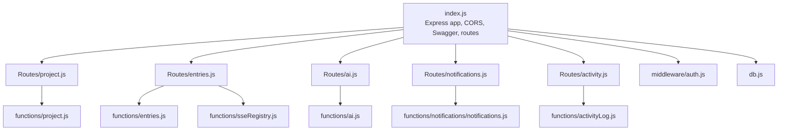
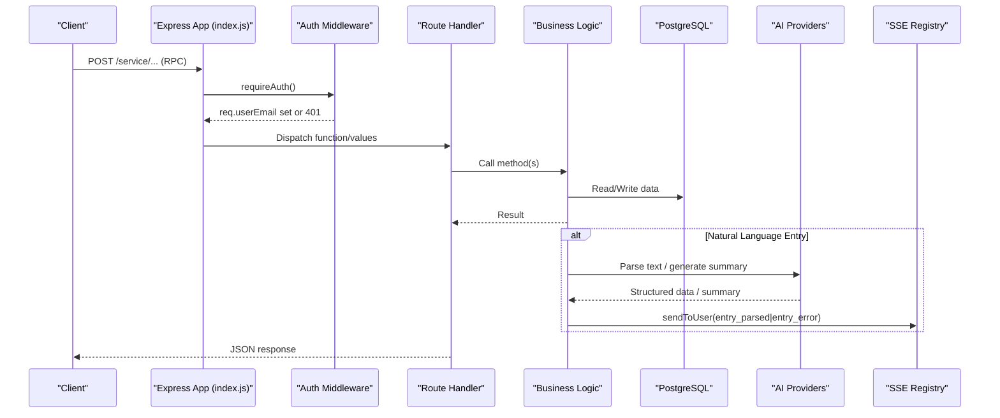
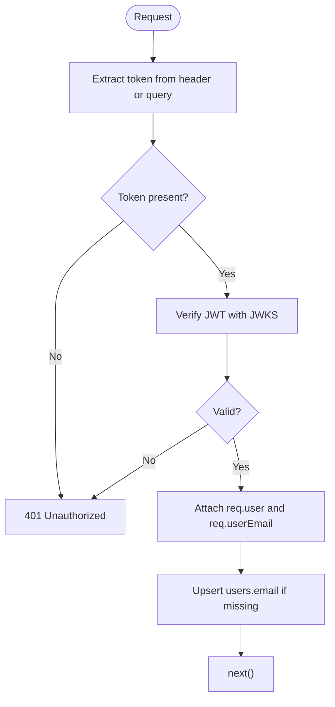
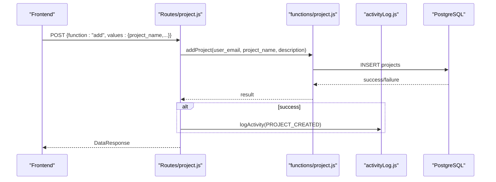
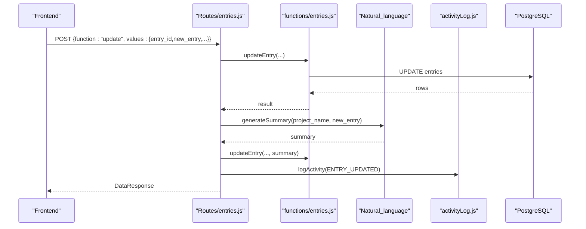
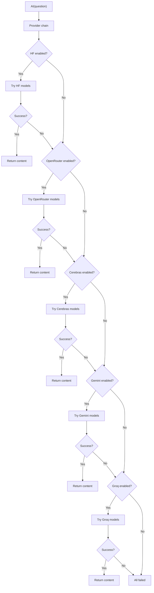
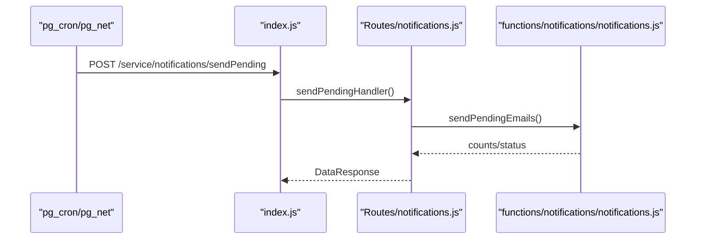
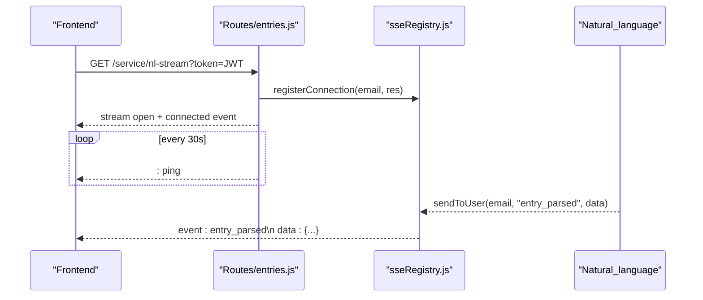
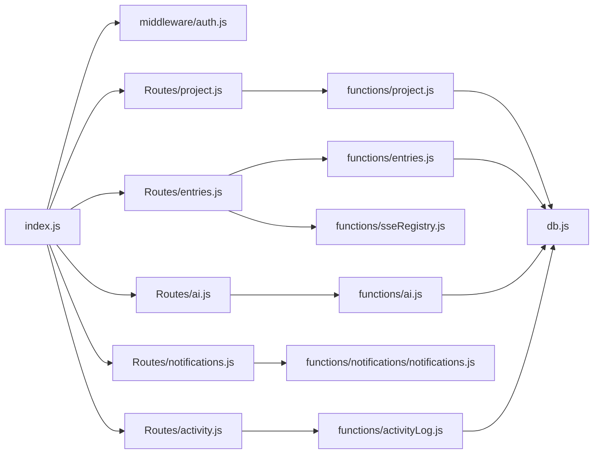

# Project Service

<cite>
**Referenced Files in This Document**
- [index.js](file://services/project-service/src/index.js)
- [openapi.yaml](file://services/project-service/docs/openapi.yaml)
- [config.js](file://services/project-service/src/config.js)
- [db.js](file://services/project-service/src/db.js)
- [auth.js](file://services/project-service/src/middleware/auth.js)
- [project.js (Routes)](file://services/project-service/src/Routes/project.js)
- [entries.js (Routes)](file://services/project-service/src/Routes/entries.js)
- [ai.js (Routes)](file://services/project-service/src/Routes/ai.js)
- [notifications.js (Routes)](file://services/project-service/src/Routes/notifications.js)
- [activity.js (Routes)](file://services/project-service/src/Routes/activity.js)
- [project.js (Functions)](file://services/project-service/src/functions/project.js)
- [entries.js (Functions)](file://services/project-service/src/functions/entries.js)
- [ai.js (Functions)](file://services/project-service/src/functions/ai.js)
- [activityLog.js](file://services/project-service/src/functions/activityLog.js)
- [sseRegistry.js](file://services/project-service/src/functions/sseRegistry.js)
</cite>

## Table of Contents

1. [Introduction](#introduction)
2. [Project Structure](#project-structure)
3. [Core Components](#core-components)
4. [Architecture Overview](#architecture-overview)
5. [Detailed Component Analysis](#detailed-component-analysis)
6. [Dependency Analysis](#dependency-analysis)
7. [Performance Considerations](#performance-considerations)
8. [Troubleshooting Guide](#troubleshooting-guide)
9. [Conclusion](#conclusion)
10. [Appendices](#appendices)

## Introduction

The Project Service is a Node.js/Express microservice that provides the core business logic for projects, entries, fields, archives, activity logging, AI-powered natural language processing, and notifications. It exposes a REST API with an RPC-style dispatch pattern on POST endpoints under /service, secured by JWT authentication via Supabase’s JWKS. The service integrates with PostgreSQL (Supabase), multiple AI providers through a resilient provider chain, and supports real-time updates to clients using Server-Sent Events (SSE).

## Project Structure

The service is organized into:

- Entry point and middleware wiring (index.js)
- Route handlers per domain (Routes/*)
- Business logic classes (functions/*)
- Database connection pool (db.js)
- Authentication middleware (middleware/auth.js)
- OpenAPI specification (docs/openapi.yaml)

**Diagram sources**

- [index.js:1-108](file://services/project-service/src/index.js#L1-L108)
- [project.js (Routes):1-99](file://services/project-service/src/Routes/project.js#L1-L99)
- [entries.js (Routes):1-328](file://services/project-service/src/Routes/entries.js#L1-L328)
- [ai.js (Routes):1-39](file://services/project-service/src/Routes/ai.js#L1-L39)
- [notifications.js (Routes):1-98](file://services/project-service/src/Routes/notifications.js#L1-L98)
- [activity.js (Routes):1-53](file://services/project-service/src/Routes/activity.js#L1-L53)
- [project.js (Functions):1-149](file://services/project-service/src/functions/project.js#L1-L149)
- [entries.js (Functions):1-800](file://services/project-service/src/functions/entries.js#L1-L800)
- [ai.js (Functions):1-463](file://services/project-service/src/functions/ai.js#L1-L463)
- [activityLog.js:1-70](file://services/project-service/src/functions/activityLog.js#L1-L70)
- [sseRegistry.js:1-104](file://services/project-service/src/functions/sseRegistry.js#L1-L104)
- [db.js:1-32](file://services/project-service/src/db.js#L1-L32)
- [auth.js:1-71](file://services/project-service/src/middleware/auth.js#L1-L71)

**Section sources**

- [index.js:1-108](file://services/project-service/src/index.js#L1-L108)
- [openapi.yaml:1-800](file://services/project-service/docs/openapi.yaml#L1-L800)

## Core Components

- Express application with CORS, JSON parsing, and Swagger UI serving from docs/openapi.yaml.
- JWT-based authentication middleware that verifies tokens against Supabase’s JWKS and attaches user info to requests.
- Domain route handlers implementing RPC-style dispatch (function + values).
- Business logic classes encapsulating database operations and complex workflows.
- AI integration layer with multi-provider fallback and rate-limit handling.
- SSE registry for real-time event streaming to authenticated clients.
- Activity logging utility for audit trails.

**Section sources**

- [index.js:23-93](file://services/project-service/src/index.js#L23-L93)
- [auth.js:27-70](file://services/project-service/src/middleware/auth.js#L27-L70)
- [openapi.yaml:264-800](file://services/project-service/docs/openapi.yaml#L264-L800)

## Architecture Overview

The service follows a layered architecture:

- Presentation: Express routes handle HTTP requests and dispatch to functions.
- Application: Route handlers orchestrate use cases, validate inputs, and call business logic.
- Domain: Classes implement core business rules (projects, entries, fields, archives, AI, notifications).
- Infrastructure: Database pool, external AI providers, and SSE registry.

**Diagram sources**

- [index.js:58-93](file://services/project-service/src/index.js#L58-L93)
- [auth.js:27-70](file://services/project-service/src/middleware/auth.js#L27-L70)
- [entries.js (Routes):23-328](file://services/project-service/src/Routes/entries.js#L23-L328)
- [entries.js (Functions):401-800](file://services/project-service/src/functions/entries.js#L401-L800)
- [ai.js (Functions):403-463](file://services/project-service/src/functions/ai.js#L403-L463)
- [sseRegistry.js:17-74](file://services/project-service/src/functions/sseRegistry.js#L17-L74)

## Detailed Component Analysis

### Authentication Middleware

- Verifies JWT using jose with Supabase JWKS endpoint; supports Authorization header and query token (for SSE).
- Attaches decoded payload and email to request; ensures user row exists in users table.
- Returns 401 on missing/invalid tokens.

**Diagram sources**

- [auth.js:27-70](file://services/project-service/src/middleware/auth.js#L27-L70)

**Section sources**

- [auth.js:1-71](file://services/project-service/src/middleware/auth.js#L1-L71)

### Project CRUD

- Endpoints: POST /service/project with functions add, edit, delete, getProjects, setColor.
- Validates required parameters, uses verified email, logs activities on mutations.
- Handles unique constraint violations and foreign key errors gracefully.

**Diagram sources**

- [project.js (Routes):20-99](file://services/project-service/src/Routes/project.js#L20-L99)
- [project.js (Functions):4-149](file://services/project-service/src/functions/project.js#L4-L149)
- [activityLog.js:21-36](file://services/project-service/src/functions/activityLog.js#L21-L36)

**Section sources**

- [project.js (Routes):1-99](file://services/project-service/src/Routes/project.js#L1-L99)
- [project.js (Functions):1-149](file://services/project-service/src/functions/project.js#L1-L149)

### Entry Management

- Endpoints: POST /service/entry with functions add, update, delete, deleteById, get, getAll, sortUnarchived, sortArchived.
- Adds notes when provided; soft-deletes entries and associated notes on deletion.
- On update, triggers background summary regeneration via AI.

**Diagram sources**

- [entries.js (Routes):23-191](file://services/project-service/src/Routes/entries.js#L23-L191)
- [entries.js (Functions):117-209](file://services/project-service/src/functions/entries.js#L117-L209)
- [entries.js (Functions):642-710](file://services/project-service/src/functions/entries.js#L642-L710)
- [activityLog.js:21-36](file://services/project-service/src/functions/activityLog.js#L21-L36)

**Section sources**

- [entries.js (Routes):1-328](file://services/project-service/src/Routes/entries.js#L1-L328)
- [entries.js (Functions):1-800](file://services/project-service/src/functions/entries.js#L1-L800)

### Field Definitions

- Endpoints: POST /service/field with functions add, edit, get.
- Manages custom fields per project; used by natural language parser to structure entries.

**Section sources**

- [openapi.yaml:633-687](file://services/project-service/docs/openapi.yaml#L633-L687)

### Priority Assignment

- Endpoints: POST /service/priority with function set.
- Assigns priority levels to entries; reflected in sorting and views.

**Section sources**

- [openapi.yaml:592-631](file://services/project-service/docs/openapi.yaml#L592-L631)

### Archival Functionality

- Endpoints: POST /service/archive with functions archive_project, unarchive_project, archive_entry, getArchives, getArchivedProjects.
- Supports archiving at project and entry levels; retrieval of archived items.

**Section sources**

- [openapi.yaml:689-751](file://services/project-service/docs/openapi.yaml#L689-L751)

### AI Integration

- Generic prompt endpoint: POST /service/ai.
- Natural language entry parsing: POST /service/natural-language-entry.
- Multi-provider fallback chain (HuggingFace, OpenRouter, Cerebras, Gemini, Groq) with rate-limit detection, cooldowns, and retries.
- Summary generation runs in background after entry updates.

**Diagram sources**

- [ai.js (Functions):403-463](file://services/project-service/src/functions/ai.js#L403-L463)
- [ai.js (Routes):11-35](file://services/project-service/src/Routes/ai.js#L11-L35)
- [entries.js (Routes):243-328](file://services/project-service/src/Routes/entries.js#L243-L328)
- [entries.js (Functions):642-710](file://services/project-service/src/functions/entries.js#L642-L710)

**Section sources**

- [ai.js (Routes):1-39](file://services/project-service/src/Routes/ai.js#L1-L39)
- [ai.js (Functions):1-463](file://services/project-service/src/functions/ai.js#L1-L463)
- [entries.js (Routes):243-328](file://services/project-service/src/Routes/entries.js#L243-L328)
- [entries.js (Functions):642-710](file://services/project-service/src/functions/entries.js#L642-L710)

### Notifications System

- Endpoints: POST /service/notifications with functions get, history, markRead, markAllRead.
- Public trigger: POST /service/notifications/sendPending (no JWT) invoked by scheduled job to send due-date emails idempotently.

**Diagram sources**

- [notifications.js (Routes):20-98](file://services/project-service/src/Routes/notifications.js#L20-L98)
- [index.js:79-83](file://services/project-service/src/index.js#L79-L83)

**Section sources**

- [notifications.js (Routes):1-98](file://services/project-service/src/Routes/notifications.js#L1-L98)
- [openapi.yaml:426-516](file://services/project-service/docs/openapi.yaml#L426-L516)

### Activity Logging

- Utility to record user actions (PROJECT_CREATED, ENTRY_ADDED, etc.) to activity_log table.
- Fire-and-forget safe; failures do not break main flows.
- Query recent activities via POST /service/activity with function getActivities.

**Section sources**

- [activityLog.js:1-70](file://services/project-service/src/functions/activityLog.js#L1-L70)
- [activity.js (Routes):1-53](file://services/project-service/src/Routes/activity.js#L1-L53)
- [openapi.yaml:753-790](file://services/project-service/docs/openapi.yaml#L753-L790)

### Real-Time Updates via SSE

- Endpoint: GET /service/nl-stream?token=JWT.
- Registers connections per user; sends keep-alive pings every 30 seconds.
- Used to push parsed natural language entries immediately before DB writes complete.

**Diagram sources**

- [entries.js (Routes):193-233](file://services/project-service/src/Routes/entries.js#L193-L233)
- [entries.js (Routes):243-328](file://services/project-service/src/Routes/entries.js#L243-L328)
- [sseRegistry.js:17-74](file://services/project-service/src/functions/sseRegistry.js#L17-L74)

**Section sources**

- [entries.js (Routes):193-328](file://services/project-service/src/Routes/entries.js#L193-L328)
- [sseRegistry.js:1-104](file://services/project-service/src/functions/sseRegistry.js#L1-L104)
- [openapi.yaml:518-547](file://services/project-service/docs/openapi.yaml#L518-L547)

## Dependency Analysis

- index.js wires all routes under /service with requireAuth middleware except the public notification trigger.
- Routes depend on functions/* for business logic; functions depend on db.js for PostgreSQL access.
- AI functions depend on environment variables for provider keys and use a resilient provider chain.
- SSE registry maintains in-memory connections keyed by user email.

**Diagram sources**

- [index.js:1-108](file://services/project-service/src/index.js#L1-L108)
- [project.js (Routes):1-99](file://services/project-service/src/Routes/project.js#L1-L99)
- [entries.js (Routes):1-328](file://services/project-service/src/Routes/entries.js#L1-L328)
- [ai.js (Routes):1-39](file://services/project-service/src/Routes/ai.js#L1-L39)
- [notifications.js (Routes):1-98](file://services/project-service/src/Routes/notifications.js#L1-L98)
- [activity.js (Routes):1-53](file://services/project-service/src/Routes/activity.js#L1-L53)
- [project.js (Functions):1-149](file://services/project-service/src/functions/project.js#L1-L149)
- [entries.js (Functions):1-800](file://services/project-service/src/functions/entries.js#L1-L800)
- [ai.js (Functions):1-463](file://services/project-service/src/functions/ai.js#L1-L463)
- [activityLog.js:1-70](file://services/project-service/src/functions/activityLog.js#L1-L70)
- [db.js:1-32](file://services/project-service/src/db.js#L1-L32)

**Section sources**

- [index.js:1-108](file://services/project-service/src/index.js#L1-L108)

## Performance Considerations

- Connection pooling via pg.Pool with SSL configured for Supabase; verify startup connectivity.
- Background summary regeneration avoids blocking update responses.
- AI provider chain includes retries, exponential backoff on rate limits, and per-provider cooldowns stored in the database.
- SSE keep-alive prevents idle timeouts; ensure proxies disable buffering.
- Input size limit set to 5MB for JSON payloads.

[No sources needed since this section provides general guidance]

## Troubleshooting Guide

- Missing DATABASE_URL: Startup logs indicate critical failure; all DB calls will fail.
- JWT verification failures: Ensure SUPABASE_JWKS_URL is correct and tokens are valid; check error messages from jose.
- AI provider failures: Logs show provider attempts and rate limiting; verify environment keys and model availability.
- SSE issues: Confirm headers (text/event-stream, no-cache, keep-alive) and proxy settings (X-Accel-Buffering disabled).
- Notification emails: Ensure sendPending endpoint is reachable by cron; idempotent behavior prevents duplicates.

**Section sources**

- [db.js:5-29](file://services/project-service/src/db.js#L5-L29)
- [auth.js:27-70](file://services/project-service/src/middleware/auth.js#L27-L70)
- [ai.js (Functions):152-170](file://services/project-service/src/functions/ai.js#L152-L170)
- [ai.js (Functions):281-336](file://services/project-service/src/functions/ai.js#L281-L336)
- [entries.js (Routes):200-233](file://services/project-service/src/Routes/entries.js#L200-L233)
- [notifications.js (Routes):73-95](file://services/project-service/src/Routes/notifications.js#L73-L95)

## Conclusion

The Project Service delivers a robust, secure, and extensible platform for managing projects and entries, enhanced by AI-driven natural language parsing, intelligent suggestions, and real-time updates. Its modular design, clear separation of concerns, and comprehensive OpenAPI specification make it straightforward to integrate and operate across environments.

[No sources needed since this section summarizes without analyzing specific files]

## Appendices

### OpenAPI Specification Highlights

- Security: Bearer JWT via Supabase JWKS.
- RPC-style dispatch: All /service endpoints accept { function, values }.
- Key schemas: Project, Entry, ProjectField, ActivityLog, ArchiveEntry, UserProfile, SseEvent.
- Paths include health, project CRUD, entry CRUD, notifications, SSE stream, natural language entry, priority, fields, archives, activity, and generic AI prompt.

**Section sources**

- [openapi.yaml:36-46](file://services/project-service/docs/openapi.yaml#L36-L46)
- [openapi.yaml:47-260](file://services/project-service/docs/openapi.yaml#L47-L260)
- [openapi.yaml:264-800](file://services/project-service/docs/openapi.yaml#L264-L800)

### Common Workflows and Usage Patterns

- Create a project: POST /service/project with function add and values containing project_name and optional description.
- Add an entry: POST /service/entry with function add and values including project_name, entry_object, and optional due_date/priority/status.
- Update an entry: POST /service/entry with function update; summary regeneration occurs asynchronously.
- Natural language entry: POST /service/natural-language-entry with text; frontend can subscribe to /service/nl-stream for immediate parsed results.
- Set priority: POST /service/priority with function set and values including project_name, entry_id, priorityValue.
- Manage fields: POST /service/field with functions add/edit/get to define custom fields per project.
- Archive/unarchive: POST /service/archive with appropriate function and values.
- View activity: POST /service/activity with function getActivities and optional limit.
- Notifications: POST /service/notifications with functions get/history/markRead/markAllRead; scheduled job triggers sendPending.

**Section sources**

- [openapi.yaml:280-800](file://services/project-service/docs/openapi.yaml#L280-L800)
- [project.js (Routes):20-99](file://services/project-service/src/Routes/project.js#L20-L99)
- [entries.js (Routes):23-328](file://services/project-service/src/Routes/entries.js#L23-L328)
- [ai.js (Routes):11-35](file://services/project-service/src/Routes/ai.js#L11-L35)
- [notifications.js (Routes):20-98](file://services/project-service/src/Routes/notifications.js#L20-L98)
