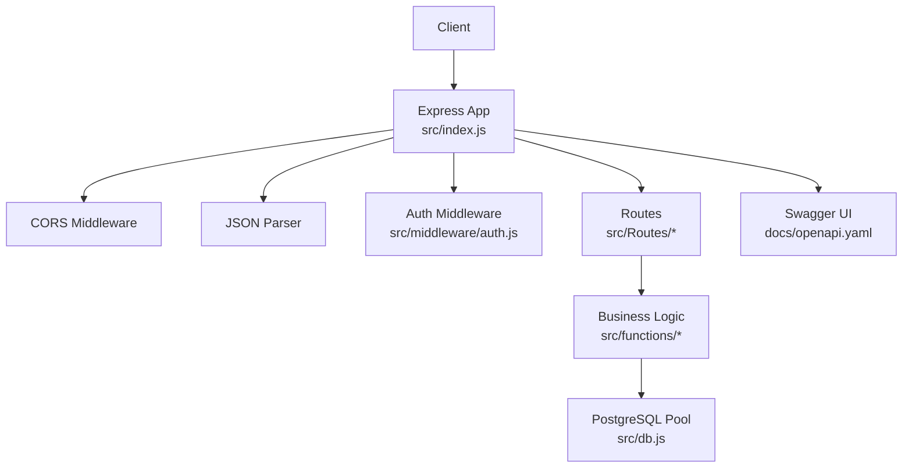
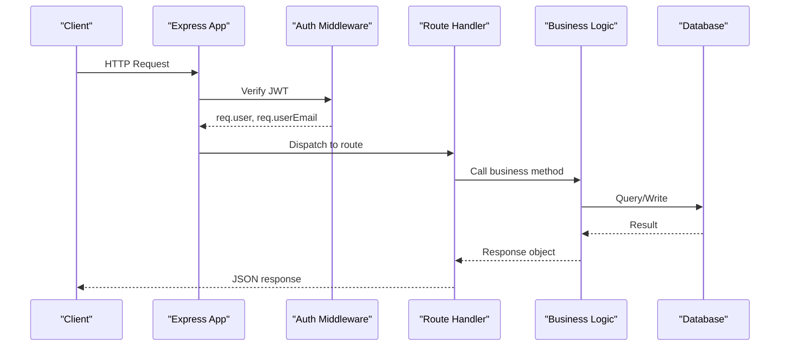
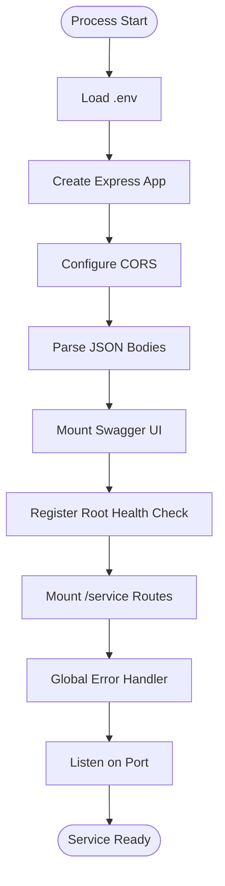
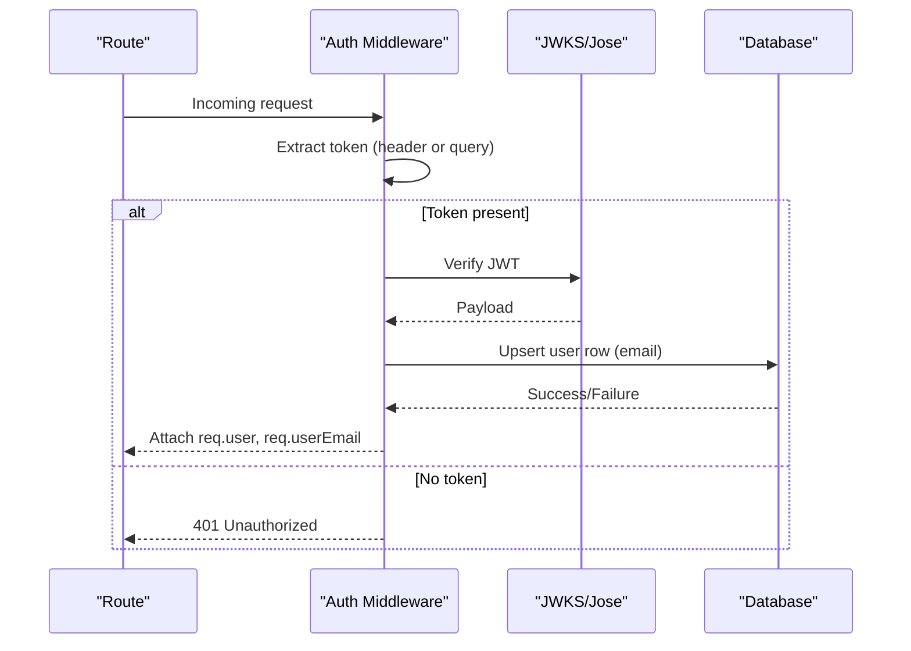
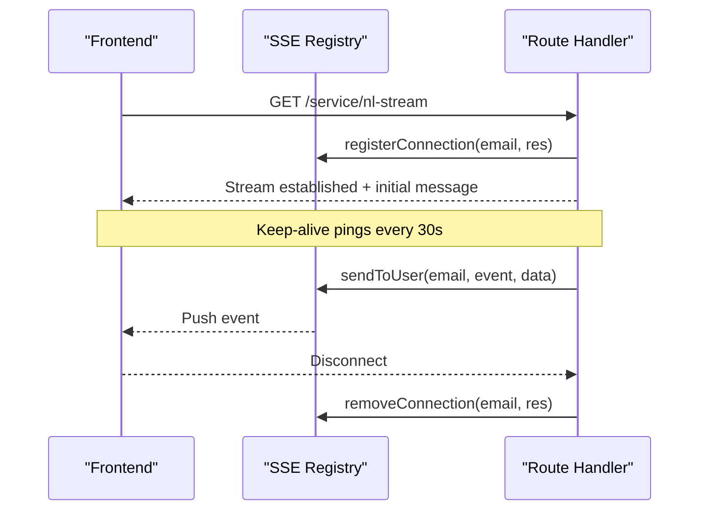
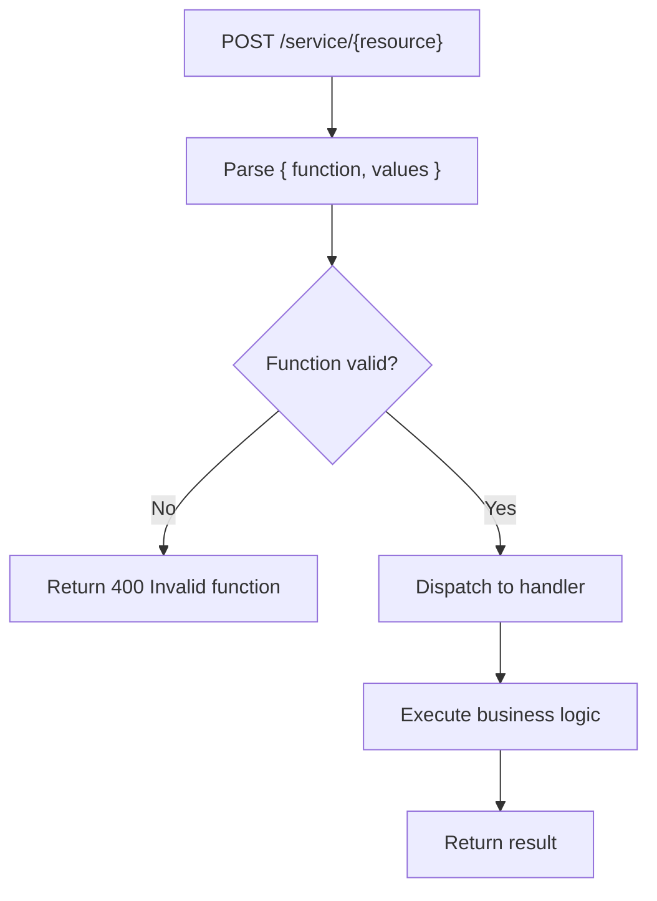
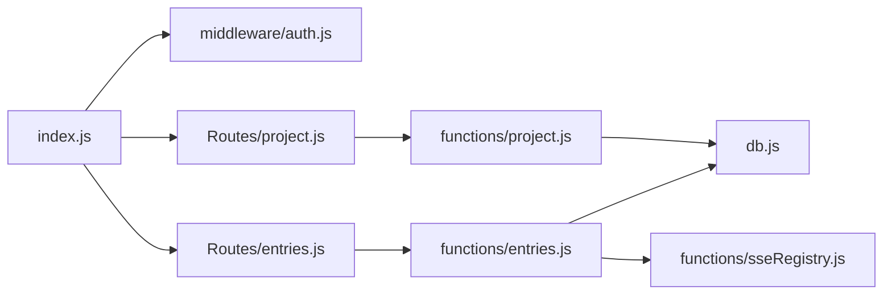

# Service Architecture

<cite>
**Referenced Files in This Document**
- [index.js](file://services/project-service/src/index.js)
- [config.js](file://services/project-service/src/config.js)
- [db.js](file://services/project-service/src/db.js)
- [auth.js](file://services/project-service/src/middleware/auth.js)
- [project.js](file://services/project-service/src/Routes/project.js)
- [entries.js](file://services/project-service/src/Routes/entries.js)
- [activityLog.js](file://services/project-service/src/functions/activityLog.js)
- [sseRegistry.js](file://services/project-service/src/functions/sseRegistry.js)
- [openapi.yaml](file://services/project-service/docs/openapi.yaml)
- [package.json](file://services/project-service/package.json)
- [render.yaml](file://render.yaml)
</cite>

## Table of Contents

1. [Introduction](#introduction)
2. [Project Structure](#project-structure)
3. [Core Components](#core-components)
4. [Architecture Overview](#architecture-overview)
5. [Detailed Component Analysis](#detailed-component-analysis)
6. [Dependency Analysis](#dependency-analysis)
7. [Performance Considerations](#performance-considerations)
8. [Troubleshooting Guide](#troubleshooting-guide)
9. [Conclusion](#conclusion)
10. [Appendices](#appendices)

## Introduction

This document explains the Project Service architecture, focusing on its microservice design patterns, Express.js application setup, middleware stack, service initialization, authentication, CORS configuration, error handling, health checks, database connection management, configuration management, and lifecycle. It also covers real-time streaming via Server-Sent Events (SSE), environment variable configuration, integration with other services, security considerations, performance optimizations, and monitoring capabilities.

## Project Structure

The Project Service is a Node.js microservice built with Express.js. It exposes REST endpoints under /service for authenticated operations and provides an OpenAPI/Swagger UI at /api-docs. The service uses PostgreSQL (via pg) for persistence, JWT verification against Supabase’s JWKS endpoint for authentication, and SSE for real-time updates.

Key directories and files:

- src/index.js: Application bootstrap, middleware stack, routes mounting, global error handler, and server startup
- src/config.js: Loads environment variables using dotenv
- src/db.js: Creates and validates a PostgreSQL connection pool
- src/middleware/auth.js: JWT verification middleware that attaches user context to requests
- src/Routes/*: Feature-specific route handlers (projects, entries, priorities, fields, archives, activity, AI, notes, notifications)
- src/functions/*: Business logic modules (e.g., project, entries, activity logging, SSE registry)
- docs/openapi.yaml: API specification served by Swagger UI
- package.json: Dependencies and scripts
- render.yaml: Deployment configuration for all services including Project Service

**Diagram sources**

- [index.js:23-93](file://services/project-service/src/index.js#L23-L93)
- [auth.js:27-69](file://services/project-service/src/middleware/auth.js#L27-L69)
- [db.js:11-29](file://services/project-service/src/db.js#L11-L29)
- [openapi.yaml:1-45](file://services/project-service/docs/openapi.yaml#L1-L45)

**Section sources**

- [index.js:1-108](file://services/project-service/src/index.js#L1-L108)
- [package.json:1-58](file://services/project-service/package.json#L1-L58)

## Core Components

- Express application and middleware stack: Initializes Express, applies CORS, JSON parsing, Swagger UI, and mounts feature routes under /service with authentication middleware.
- Authentication middleware: Verifies JWTs using Supabase’s JWKS endpoint, supports Bearer tokens and query token for SSE, and ensures user provisioning in the users table.
- Database connection management: Creates a pooled PostgreSQL client with SSL disabled for Supabase-hosted databases and verifies connectivity on startup.
- Route handlers: Organized per domain (projects, entries, etc.), using an RPC-style dispatch pattern where POST payloads include function and values.
- Activity logging: Fire-and-forget logging utility that records user actions without breaking main flows.
- SSE registry: In-memory registry to maintain active SSE connections per user and push events immediately when data is ready.

**Section sources**

- [index.js:23-93](file://services/project-service/src/index.js#L23-L93)
- [auth.js:27-69](file://services/project-service/src/middleware/auth.js#L27-L69)
- [db.js:11-29](file://services/project-service/src/db.js#L11-L29)
- [project.js:20-95](file://services/project-service/src/Routes/project.js#L20-L95)
- [entries.js:23-191](file://services/project-service/src/Routes/entries.js#L23-L191)
- [activityLog.js:21-69](file://services/project-service/src/functions/activityLog.js#L21-L69)
- [sseRegistry.js:17-96](file://services/project-service/src/functions/sseRegistry.js#L17-L96)

## Architecture Overview

The Project Service follows a microservice architecture with clear separation of concerns:

- Entry point: Express app configures middleware and routes, then starts listening on a configurable port.
- Security: Global CORS policy restricts allowed origins; authentication middleware validates JWTs and enriches requests with user context.
- Data access: A single PostgreSQL connection pool is used across modules for consistency and efficiency.
- Real-time features: SSE endpoints enable immediate event delivery to clients during long-running operations like natural language parsing.
- Documentation: OpenAPI spec is loaded and served via Swagger UI for interactive exploration.

**Diagram sources**

- [index.js:23-93](file://services/project-service/src/index.js#L23-L93)
- [auth.js:27-69](file://services/project-service/src/middleware/auth.js#L27-L69)
- [project.js:20-95](file://services/project-service/src/Routes/project.js#L20-L95)
- [db.js:11-29](file://services/project-service/src/db.js#L11-L29)

## Detailed Component Analysis

### Express Application Setup and Lifecycle

- Loads environment variables early via dotenv.
- Configures CORS with explicit origin allowlist and credentials support.
- Mounts JSON parser with payload size limit.
- Serves OpenAPI/Swagger UI from docs/openapi.yaml if available.
- Provides a root health check returning service status.
- Mounts feature routes under /service protected by authentication middleware.
- Implements a global error handler ensuring CORS headers are present even on errors.
- Starts the server on a configurable host/port.

**Diagram sources**

- [index.js:1-108](file://services/project-service/src/index.js#L1-L108)
- [config.js:1-4](file://services/project-service/src/config.js#L1-L4)

**Section sources**

- [index.js:1-108](file://services/project-service/src/index.js#L1-L108)
- [config.js:1-4](file://services/project-service/src/config.js#L1-L4)

### Authentication Middleware Implementation

- Supports Authorization header with Bearer token or query parameter token (for SSE).
- Uses jose to verify JWTs against Supabase’s JWKS endpoint, enabling automatic key rotation.
- Extracts email from the token payload and attaches it to the request as req.user and req.userEmail.
- Ensures a corresponding row exists in the users table to satisfy foreign key constraints.
- Returns 401 responses for missing or invalid tokens.

**Diagram sources**

- [auth.js:27-69](file://services/project-service/src/middleware/auth.js#L27-L69)
- [db.js:11-29](file://services/project-service/src/db.js#L11-L29)

**Section sources**

- [auth.js:27-69](file://services/project-service/src/middleware/auth.js#L27-L69)

### CORS Configuration

- Allows specific origins defined in an allowlist plus localhost variants.
- Enables credentials for cross-origin requests.
- Restricts methods and allowed headers.
- Adds a safe preflight wildcard handler compatible with Express 5.
- Ensures CORS headers are set in the global error handler.

**Section sources**

- [index.js:25-55](file://services/project-service/src/index.js#L25-L55)
- [index.js:94-103](file://services/project-service/src/index.js#L94-L103)

### Error Handling Strategies

- Route-level try/catch blocks return structured error responses with appropriate status codes.
- Global error handler logs unhandled exceptions and responds with 500, preserving CORS headers.
- Logging utilities catch and log errors without propagating them to avoid disrupting primary flows.

**Section sources**

- [project.js:89-95](file://services/project-service/src/Routes/project.js#L89-L95)
- [entries.js:183-191](file://services/project-service/src/Routes/entries.js#L183-L191)
- [index.js:94-103](file://services/project-service/src/index.js#L94-L103)
- [activityLog.js:21-36](file://services/project-service/src/functions/activityLog.js#L21-L36)

### Health Check Endpoints

- Root endpoint returns a simple JSON status indicating the service is healthy.
- Useful for load balancers and orchestration platforms to probe service readiness.

**Section sources**

- [index.js:76-78](file://services/project-service/src/index.js#L76-L78)

### Database Connection Management

- Creates a PostgreSQL connection pool using DATABASE_URL with SSL configured for Supabase.
- Logs critical warnings if DATABASE_URL is missing.
- Performs a startup connectivity test to validate the pool.
- Reuses the pool across modules for efficient resource usage.

**Section sources**

- [db.js:1-32](file://services/project-service/src/db.js#L1-L32)

### Configuration Management

- Environment variables are loaded at process start via dotenv.
- PORT defaults to 5003 if not provided.
- SUPABASE_JWKS_URL can be overridden for custom JWKS endpoints.
- Deployment configuration sets required environment variables for production.

**Section sources**

- [config.js:1-4](file://services/project-service/src/config.js#L1-L4)
- [index.js:23-24](file://services/project-service/src/index.js#L23-L24)
- [auth.js:21-25](file://services/project-service/src/middleware/auth.js#L21-L25)
- [render.yaml:49-74](file://render.yaml#L49-L74)

### Service Initialization and Startup

- Loads configuration, initializes Express, applies middleware, mounts routes, and starts listening.
- Logs successful startup and availability of Swagger UI.
- Exposes a public notification trigger endpoint before authentication middleware for scheduled tasks.

**Section sources**

- [index.js:1-108](file://services/project-service/src/index.js#L1-L108)

### Integration with Other Services

- OpenAPI specification documents multiple services and their local/production URLs, including Project Service, Dashboard Service, Profile Service, and Auth Service.
- Clients integrate with Project Service by sending authenticated requests to /service endpoints.

**Section sources**

- [openapi.yaml:10-34](file://services/project-service/docs/openapi.yaml#L10-L34)

### Real-Time Streaming (SSE)

- SSE endpoint establishes a persistent connection with keep-alive pings and cleanup on disconnect.
- Registry tracks active connections per user and enables immediate event pushing after asynchronous processing (e.g., AI parsing).
- Errors during writes remove dead connections automatically.

**Diagram sources**

- [entries.js:200-233](file://services/project-service/src/Routes/entries.js#L200-L233)
- [sseRegistry.js:17-96](file://services/project-service/src/functions/sseRegistry.js#L17-L96)

**Section sources**

- [entries.js:200-233](file://services/project-service/src/Routes/entries.js#L200-L233)
- [sseRegistry.js:17-96](file://services/project-service/src/functions/sseRegistry.js#L17-L96)

### RPC-Style Routing Pattern

- Routes accept POST requests with { function, values } to dispatch operations within a resource.
- Example: /service/project handles add, edit, delete, getProjects, setColor.
- Example: /service/entry handles add, update, delete, deleteById, get, getAll, sortUnarchived, sortArchived.

**Diagram sources**

- [project.js:20-95](file://services/project-service/src/Routes/project.js#L20-L95)
- [entries.js:23-191](file://services/project-service/src/Routes/entries.js#L23-L191)

**Section sources**

- [project.js:20-95](file://services/project-service/src/Routes/project.js#L20-L95)
- [entries.js:23-191](file://services/project-service/src/Routes/entries.js#L23-L191)

## Dependency Analysis

- External dependencies include Express, cors, jose, pg, js-yaml, swagger-ui-express, and various AI SDKs.
- Internal dependencies:
  - index.js depends on middleware/auth.js and multiple route modules.
  - Routes depend on functions modules for business logic.
  - Functions depend on db.js for data access.
  - SSE functionality depends on sseRegistry.js.

**Diagram sources**

- [index.js:10-19](file://services/project-service/src/index.js#L10-L19)
- [project.js:1-3](file://services/project-service/src/Routes/project.js#L1-L3)
- [entries.js:1-4](file://services/project-service/src/Routes/entries.js#L1-L4)
- [activityLog.js:1-2](file://services/project-service/src/functions/activityLog.js#L1-L2)
- [sseRegistry.js:1-10](file://services/project-service/src/functions/sseRegistry.js#L1-L10)
- [db.js:1-3](file://services/project-service/src/db.js#L1-L3)

**Section sources**

- [package.json:18-33](file://services/project-service/package.json#L18-L33)
- [index.js:10-19](file://services/project-service/src/index.js#L10-L19)

## Performance Considerations

- Use a connection pool for PostgreSQL to reduce overhead and improve throughput.
- Limit JSON body size to prevent abuse and manage memory usage.
- Implement keep-alive pings for SSE to maintain connections through proxies/load balancers.
- Offload non-critical work (e.g., summary regeneration) to background promises to avoid blocking responses.
- Ensure CORS validation is efficient by checking against a small allowlist and regex for localhost.

[No sources needed since this section provides general guidance]

## Troubleshooting Guide

- Missing DATABASE_URL: The service logs a critical warning and all database calls will fail. Ensure environment variables are set correctly.
- JWT verification failures: Check SUPABASE_JWKS_URL and ensure tokens are valid and contain an email.
- CORS errors: Verify the client origin is included in the allowlist or matches localhost patterns.
- SSE issues: Confirm the client connects to the correct endpoint and that keep-alive pings are not blocked by intermediaries.
- Unhandled errors: Inspect the global error handler logs and ensure CORS headers are present in error responses.

**Section sources**

- [db.js:5-7](file://services/project-service/src/db.js#L5-L7)
- [auth.js:35-69](file://services/project-service/src/middleware/auth.js#L35-L69)
- [index.js:25-55](file://services/project-service/src/index.js#L25-L55)
- [index.js:94-103](file://services/project-service/src/index.js#L94-L103)

## Conclusion

The Project Service implements a robust, secure, and scalable microservice architecture using Express.js, JWT-based authentication, PostgreSQL, and SSE for real-time updates. Its modular design separates concerns across middleware, routes, and business logic, while comprehensive error handling and monitoring facilitate reliable operation. The OpenAPI specification and Swagger UI streamline integration and testing.

[No sources needed since this section summarizes without analyzing specific files]

## Appendices

### Environment Variables and Startup

- Required variables:
  - PORT: Service port (default 5003)
  - DATABASE_URL: PostgreSQL connection string
  - SUPABASE_JWKS_URL: Optional override for JWKS endpoint
  - AI provider keys (e.g., OPENROUTER_API_KEY, HF_API_KEY, GEMINI_API_KEY, CEREBRAS_API_KEY, GROQ_API_KEY) as configured in deployment
- Startup command: npm start (Node.js)
- Development command: nodemon for hot reload

**Section sources**

- [index.js:23-24](file://services/project-service/src/index.js#L23-L24)
- [auth.js:21-25](file://services/project-service/src/middleware/auth.js#L21-L25)
- [render.yaml:49-74](file://render.yaml#L49-L74)
- [package.json:6-12](file://services/project-service/package.json#L6-L12)

### Monitoring and Observability

- Structured logging for errors and warnings throughout the service.
- Health check endpoint for readiness probes.
- Activity logging for user actions to support auditing and analytics.
- SSE metrics via connection counts and total active connections.

**Section sources**

- [index.js:94-103](file://services/project-service/src/index.js#L94-L103)
- [activityLog.js:21-69](file://services/project-service/src/functions/activityLog.js#L21-L69)
- [sseRegistry.js:81-96](file://services/project-service/src/functions/sseRegistry.js#L81-L96)
