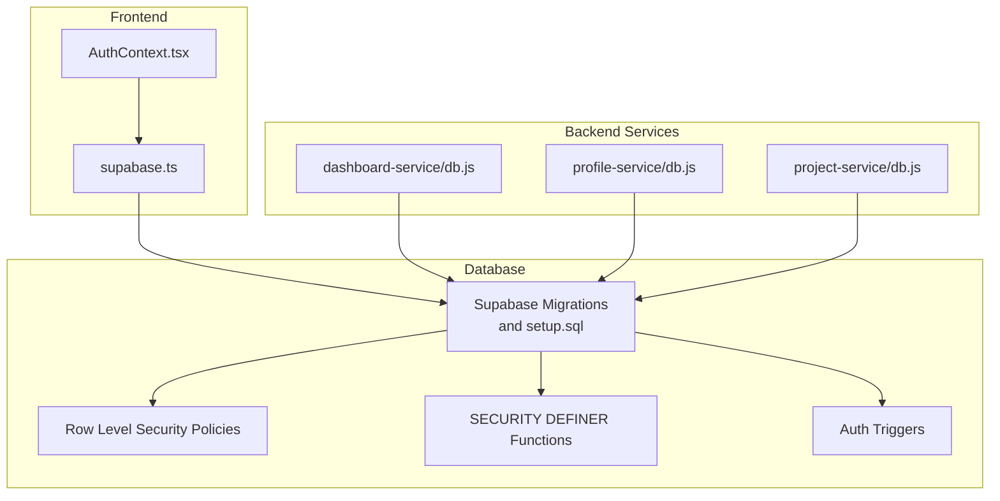
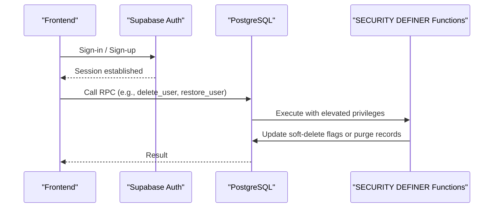
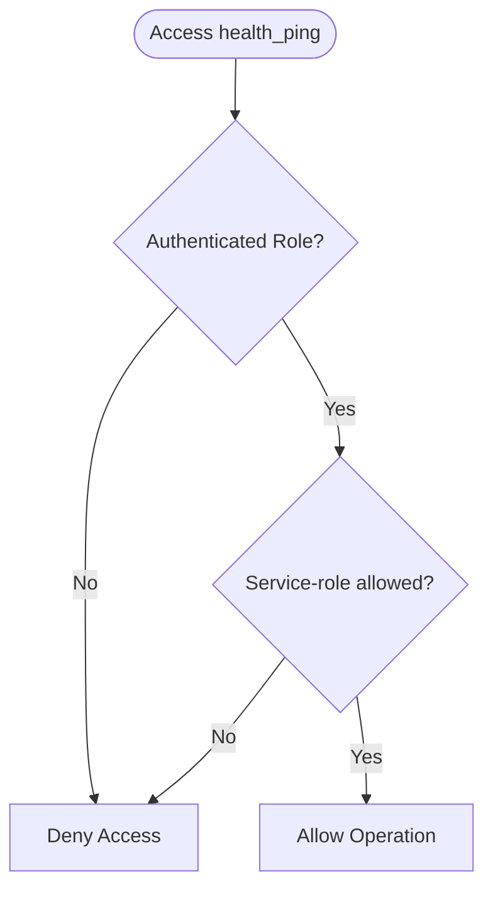
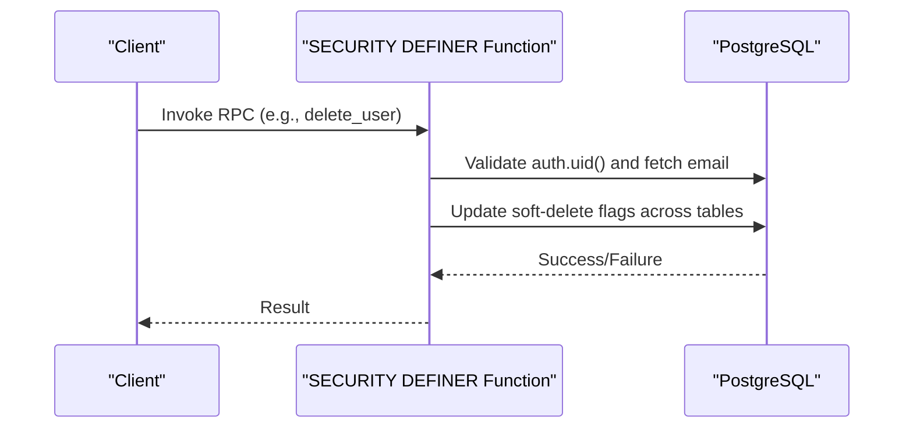
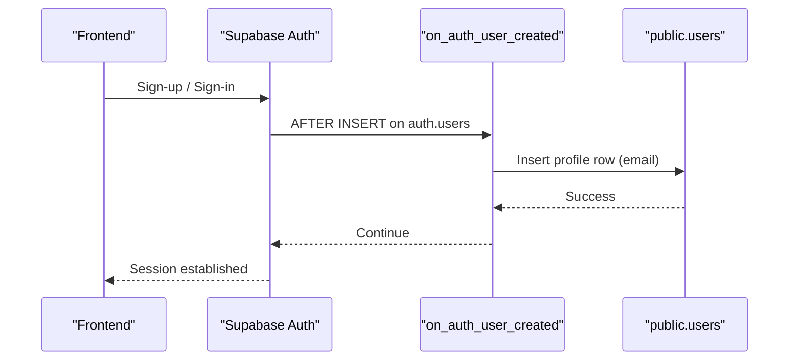
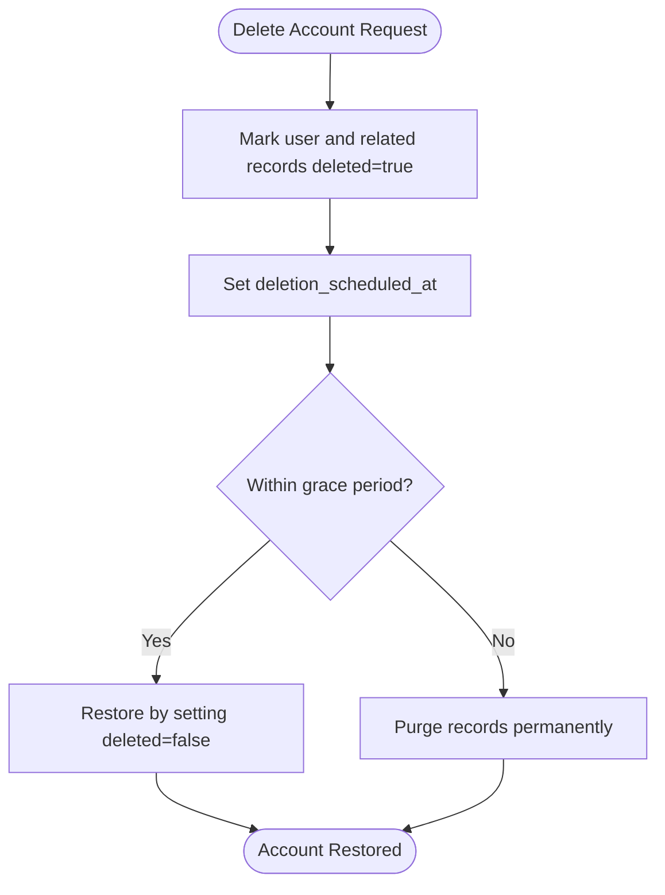
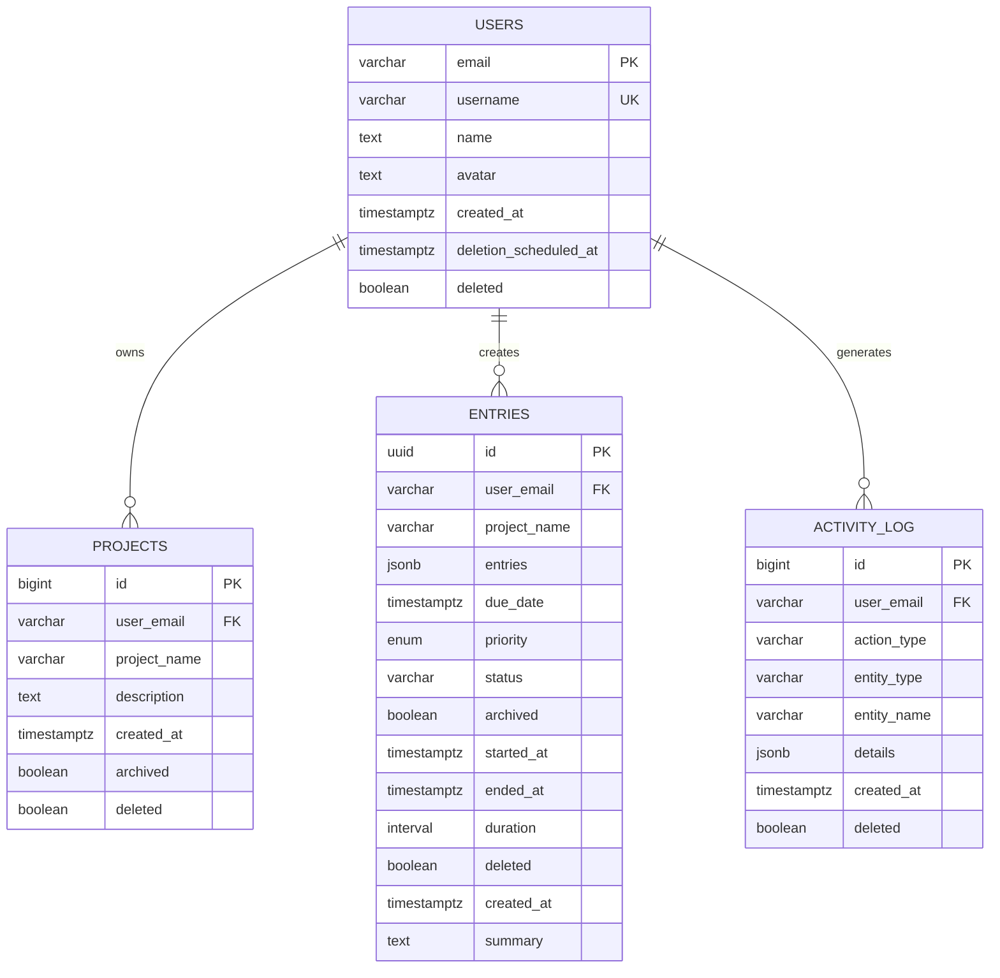
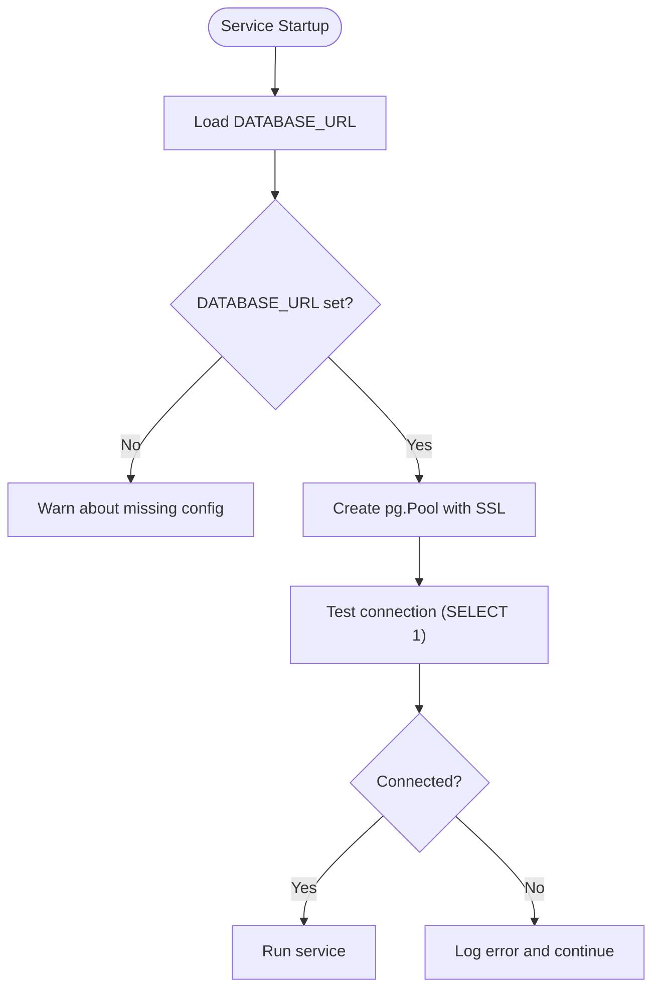
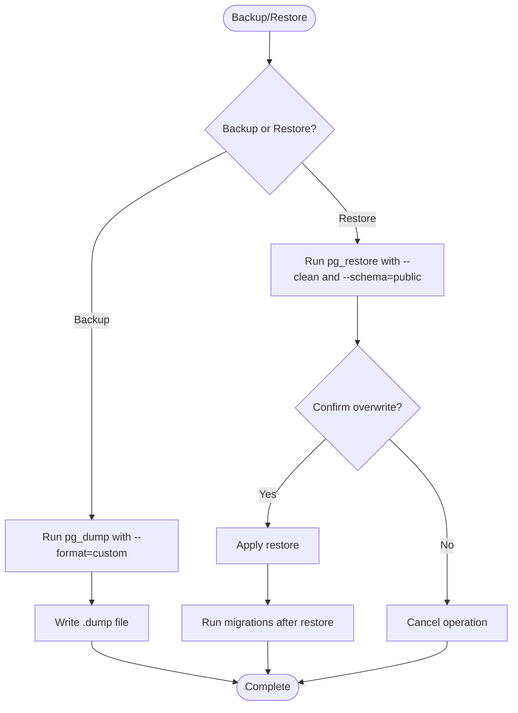
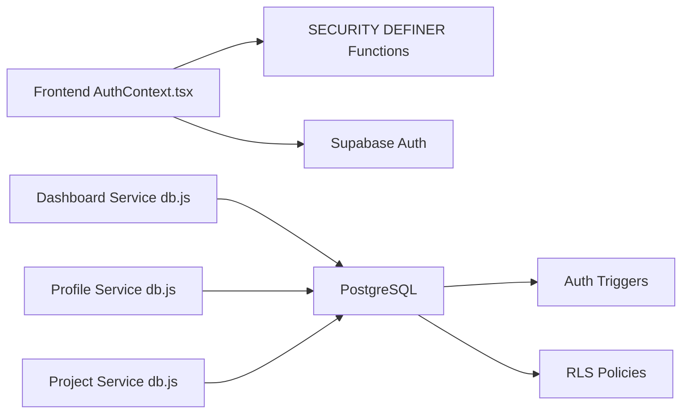

# Data Security and Access Control

<cite>
**Referenced Files in This Document**
- [000_baseline_full_schema.sql](file://supabase/migrations/000_baseline_full_schema.sql)
- [002_auto_provision_public_users_for_auth.sql](file://supabase/migrations/002_auto_provision_public_users_for_auth.sql)
- [003_create_activity_log_table.sql](file://supabase/migrations/003_create_activity_log_table.sql)
- [004_account_deletion_grace_period.sql](file://supabase/migrations/004_account_deletion_grace_period.sql)
- [005_add_soft_delete_column.sql](file://supabase/migrations/005_add_soft_delete_column.sql)
- [006_create_health_ping_table.sql](file://supabase/migrations/006_create_health_ping_table.sql)
- [setup.sql](file://supabase/setup.sql)
- [db.js (dashboard-service)](file://services/dashboard-service/src/db.js)
- [db.js (profile-service)](file://services/profile-service/src/db.js)
- [db.js (project-service)](file://services/project-service/src/db.js)
- [supabase.ts](file://frontend/src/lib/supabase.ts)
- [AuthContext.tsx](file://frontend/src/context/AuthContext.tsx)
- [backup.js](file://scripts/backup.js)
- [restore.js](file://scripts/restore.js)
</cite>

## Table of Contents

1. Introduction
2. Project Structure
3. Core Components
4. Architecture Overview
5. Detailed Component Analysis
6. Dependency Analysis
7. Performance Considerations
8. Troubleshooting Guide
9. Conclusion
10. Appendices

## Introduction

This document explains the database security measures and access control mechanisms implemented in the Codacaine application. It covers Row Level Security (RLS), SECURITY DEFINER stored procedures, Supabase Auth integration via triggers, soft delete patterns for data retention and recovery, user isolation through foreign keys and query constraints, secure connection practices, backup and disaster recovery procedures, and best practices to prevent SQL injection and ensure safe database access.

## Project Structure

The security-relevant parts of the application are organized across:

- Database schema and policies defined in Supabase migrations and setup scripts
- Backend services that connect to PostgreSQL using connection pooling
- Frontend authentication context integrating with Supabase Auth
- Backup and restore utilities for disaster recovery

**Diagram sources**

- [000_baseline_full_schema.sql:140-150](file://supabase/migrations/000_baseline_full_schema.sql#L140-L150)
- [006_create_health_ping_table.sql:7-21](file://supabase/migrations/006_create_health_ping_table.sql#L7-L21)
- [setup.sql:36-129](file://supabase/setup.sql#L36-L129)
- [db.js (dashboard-service):9-21](file://services/dashboard-service/src/db.js#L9-L21)
- [db.js (profile-service):9-21](file://services/profile-service/src/db.js#L9-L21)
- [db.js (project-service):9-21](file://services/project-service/src/db.js#L9-L21)
- [supabase.ts:1-34](file://frontend/src/lib/supabase.ts#L1-L34)
- [AuthContext.tsx:173-208](file://frontend/src/context/AuthContext.tsx#L173-L208)

**Section sources**

- [000_baseline_full_schema.sql:29-148](file://supabase/migrations/000_baseline_full_schema.sql#L29-L148)
- [006_create_health_ping_table.sql:7-21](file://supabase/migrations/006_create_health_ping_table.sql#L7-L21)
- [setup.sql:36-129](file://supabase/setup.sql#L36-L129)
- [db.js (dashboard-service):9-21](file://services/dashboard-service/src/db.js#L9-L21)
- [db.js (profile-service):9-21](file://services/profile-service/src/db.js#L9-L21)
- [db.js (project-service):9-21](file://services/project-service/src/db.js#L9-L21)
- [supabase.ts:1-34](file://frontend/src/lib/supabase.ts#L1-L34)
- [AuthContext.tsx:173-208](file://frontend/src/context/AuthContext.tsx#L173-L208)

## Core Components

- Row Level Security (RLS) on health_ping to restrict access to service-level operations only.
- SECURITY DEFINER stored procedures for account lifecycle management and statistics aggregation.
- Supabase Auth trigger to auto-provision public.users rows on sign-up.
- Soft delete columns across tables to support graceful deletion and restoration.
- User isolation enforced by user_email foreign keys and query filters.
- Secure connection pooling in backend services.
- Backup and restore utilities for disaster recovery.

**Section sources**

- [000_baseline_full_schema.sql:140-150](file://supabase/migrations/000_baseline_full_schema.sql#L140-L150)
- [000_baseline_full_schema.sql:162-275](file://supabase/migrations/000_baseline_full_schema.sql#L162-L275)
- [002_auto_provision_public_users_for_auth.sql:24-52](file://supabase/migrations/002_auto_provision_public_users_for_auth.sql#L24-L52)
- [005_add_soft_delete_column.sql:1-109](file://supabase/migrations/005_add_soft_delete_column.sql#L1-L109)
- [000_baseline_full_schema.sql:29-123](file://supabase/migrations/000_baseline_full_schema.sql#L29-L123)
- [db.js (dashboard-service):9-21](file://services/dashboard-service/src/db.js#L9-L21)
- [backup.js:78-99](file://scripts/backup.js#L78-L99)
- [restore.js:100-129](file://scripts/restore.js#L100-L129)

## Architecture Overview

The system enforces security at multiple layers:

- Frontend authenticates users via Supabase Auth and calls database RPCs securely.
- Backend services use connection pools to interact with PostgreSQL under controlled credentials.
- Database-level RLS and SECURITY DEFINER functions enforce fine-grained access and encapsulate privileged operations.
- Triggers keep application profiles synchronized with auth accounts.
- Soft deletes enable reversible data removal with scheduled purging.

**Diagram sources**

- [AuthContext.tsx:173-208](file://frontend/src/context/AuthContext.tsx#L173-L208)
- [000_baseline_full_schema.sql:162-275](file://supabase/migrations/000_baseline_full_schema.sql#L162-L275)
- [setup.sql:36-129](file://supabase/setup.sql#L36-L129)

## Detailed Component Analysis

### Row Level Security (RLS) on health_ping

- The health_ping table is used by a daemon to keep the database active. RLS is enabled to ensure only authorized roles (service-role key used by backend) can access it; no user-facing policies are required.
- This design prevents unauthenticated or regular authenticated clients from reading or writing this operational table.

**Diagram sources**

- [006_create_health_ping_table.sql:7-21](file://supabase/migrations/006_create_health_ping_table.sql#L7-L21)
- [000_baseline_full_schema.sql:140-150](file://supabase/migrations/000_baseline_full_schema.sql#L140-L150)

**Section sources**

- [006_create_health_ping_table.sql:7-21](file://supabase/migrations/006_create_health_ping_table.sql#L7-L21)
- [000_baseline_full_schema.sql:140-150](file://supabase/migrations/000_baseline_full_schema.sql#L140-L150)

### SECURITY DEFINER Stored Procedures

- Account lifecycle functions (delete_user, restore_user, purge_deleted_users) run with SECURITY DEFINER to safely perform privileged updates/deletes while validating the current user via auth.uid().
- Statistics functions (get_project_stats, get_field_stats) also use SECURITY DEFINER to aggregate data safely and consistently, filtering by user_email and other constraints.

**Diagram sources**

- [000_baseline_full_schema.sql:162-275](file://supabase/migrations/000_baseline_full_schema.sql#L162-L275)
- [setup.sql:36-129](file://supabase/setup.sql#L36-L129)

**Section sources**

- [000_baseline_full_schema.sql:162-275](file://supabase/migrations/000_baseline_full_schema.sql#L162-L275)
- [setup.sql:36-129](file://supabase/setup.sql#L36-L129)

### Authentication Integration with Supabase Auth

- A trigger on auth.users automatically provisions a corresponding row in public.users when a new user signs up, ensuring all app tables referencing user_email remain consistent.
- Frontend uses Supabase Auth client to manage sessions and invokes RPCs for account deletion and restoration.

**Diagram sources**

- [002_auto_provision_public_users_for_auth.sql:24-52](file://supabase/migrations/002_auto_provision_public_users_for_auth.sql#L24-L52)
- [AuthContext.tsx:173-208](file://frontend/src/context/AuthContext.tsx#L173-L208)

**Section sources**

- [002_auto_provision_public_users_for_auth.sql:24-52](file://supabase/migrations/002_auto_provision_public_users_for_auth.sql#L24-L52)
- [AuthContext.tsx:173-208](file://frontend/src/context/AuthContext.tsx#L173-L208)

### Soft Delete Implementation

- All core tables include a deleted boolean column to mark records as logically removed without physical deletion.
- RPCs update these flags during account deletion and allow restoration within a grace period.
- Scheduled jobs purge expired soft-deleted accounts permanently.

**Diagram sources**

- [005_add_soft_delete_column.sql:1-109](file://supabase/migrations/005_add_soft_delete_column.sql#L1-L109)
- [004_account_deletion_grace_period.sql:14-109](file://supabase/migrations/004_account_deletion_grace_period.sql#L14-L109)
- [000_baseline_full_schema.sql:162-275](file://supabase/migrations/000_baseline_full_schema.sql#L162-L275)

**Section sources**

- [005_add_soft_delete_column.sql:1-109](file://supabase/migrations/005_add_soft_delete_column.sql#L1-L109)
- [004_account_deletion_grace_period.sql:14-109](file://supabase/migrations/004_account_deletion_grace_period.sql#L14-L109)
- [000_baseline_full_schema.sql:162-275](file://supabase/migrations/000_baseline_full_schema.sql#L162-L275)

### Data Isolation Between Users

- Tables like projects, entries, fields, and activity_log include user_email foreign keys to isolate data per user.
- Queries and RPCs filter by user_email to ensure strict data isolation.
- Indexes on user_email improve performance for scoped queries.

**Diagram sources**

- [000_baseline_full_schema.sql:29-123](file://supabase/migrations/000_baseline_full_schema.sql#L29-L123)

**Section sources**

- [000_baseline_full_schema.sql:29-123](file://supabase/migrations/000_baseline_full_schema.sql#L29-L123)

### Secure Database Access and Connection Pooling

- Backend services create a PostgreSQL connection pool using DATABASE_URL with SSL configured for Supabase-hosted databases.
- Each service validates connectivity on startup and logs failures if the pool cannot be initialized.
- Using environment variables ensures credentials are not hardcoded.

**Diagram sources**

- [db.js (dashboard-service):9-21](file://services/dashboard-service/src/db.js#L9-L21)
- [db.js (profile-service):9-21](file://services/profile-service/src/db.js#L9-L21)
- [db.js (project-service):9-21](file://services/project-service/src/db.js#L9-L21)

**Section sources**

- [db.js (dashboard-service):9-21](file://services/dashboard-service/src/db.js#L9-L21)
- [db.js (profile-service):9-21](file://services/profile-service/src/db.js#L9-L21)
- [db.js (project-service):9-21](file://services/project-service/src/db.js#L9-L21)

### Backup and Disaster Recovery

- backup.js uses pg_dump to create compressed custom-format backups of the public schema, excluding ownership and ACL commands for portability.
- restore.js uses pg_restore to restore from a specified or latest .dump file, with safety prompts and migration guidance post-restore.

**Diagram sources**

- [backup.js:78-99](file://scripts/backup.js#L78-L99)
- [restore.js:100-129](file://scripts/restore.js#L100-L129)

**Section sources**

- [backup.js:78-99](file://scripts/backup.js#L78-L99)
- [restore.js:100-129](file://scripts/restore.js#L100-L129)

## Dependency Analysis

- Frontend depends on Supabase Auth client configuration and invokes RPCs for account lifecycle.
- Backend services depend on PostgreSQL connection pools configured via environment variables.
- Database schema defines RLS, SECURITY DEFINER functions, and triggers that coordinate auth provisioning and data isolation.

**Diagram sources**

- [AuthContext.tsx:173-208](file://frontend/src/context/AuthContext.tsx#L173-L208)
- [000_baseline_full_schema.sql:140-150](file://supabase/migrations/000_baseline_full_schema.sql#L140-L150)
- [002_auto_provision_public_users_for_auth.sql:24-52](file://supabase/migrations/002_auto_provision_public_users_for_auth.sql#L24-L52)
- [db.js (dashboard-service):9-21](file://services/dashboard-service/src/db.js#L9-L21)
- [db.js (profile-service):9-21](file://services/profile-service/src/db.js#L9-L21)
- [db.js (project-service):9-21](file://services/project-service/src/db.js#L9-L21)

**Section sources**

- [AuthContext.tsx:173-208](file://frontend/src/context/AuthContext.tsx#L173-L208)
- [000_baseline_full_schema.sql:140-150](file://supabase/migrations/000_baseline_full_schema.sql#L140-L150)
- [002_auto_provision_public_users_for_auth.sql:24-52](file://supabase/migrations/002_auto_provision_public_users_for_auth.sql#L24-L52)
- [db.js (dashboard-service):9-21](file://services/dashboard-service/src/db.js#L9-L21)
- [db.js (profile-service):9-21](file://services/profile-service/src/db.js#L9-L21)
- [db.js (project-service):9-21](file://services/project-service/src/db.js#L9-L21)

## Performance Considerations

- Use indexes on frequently queried columns such as user_email to optimize scoped reads and writes.
- Prefer RPCs that encapsulate complex logic and apply consistent filters (e.g., archived=false, deleted=false) to reduce client-side overhead.
- Keep RLS policies minimal and targeted to avoid unnecessary overhead on high-throughput tables.
- Ensure connection pools are sized appropriately for expected concurrency to minimize contention.

[No sources needed since this section provides general guidance]

## Troubleshooting Guide

- Missing DATABASE_URL: Services will warn or error out; verify environment configuration before starting services.
- Supabase client not configured: Frontend will throw an error if credentials are invalid; ensure VITE_SUPABASE_URL and VITE_SUPABASE_ANON_KEY are set.
- RLS denials: If accessing health_ping fails, confirm the request uses service-role credentials and that RLS policies do not grant unintended access.
- Soft delete issues: Verify RPCs correctly toggle deleted flags and that scheduled purges run as expected.

**Section sources**

- [db.js (dashboard-service):5-7](file://services/dashboard-service/src/db.js#L5-L7)
- [db.js (profile-service):5-7](file://services/profile-service/src/db.js#L5-L7)
- [db.js (project-service):5-7](file://services/project-service/src/db.js#L5-L7)
- [supabase.ts:6-21](file://frontend/src/lib/supabase.ts#L6-L21)
- [006_create_health_ping_table.sql:13-17](file://supabase/migrations/006_create_health_ping_table.sql#L13-L17)

## Conclusion

Codacaine implements robust database security through RLS, SECURITY DEFINER functions, Supabase Auth triggers, and soft delete patterns. User isolation is enforced via foreign keys and query filters, while secure connection pooling and backup/restore utilities support operational reliability. Following the outlined best practices helps maintain data integrity, privacy, and availability.

[No sources needed since this section summarizes without analyzing specific files]

## Appendices

### Best Practices for Secure Database Access

- Always use parameterized queries and avoid string concatenation to prevent SQL injection.
- Restrict database roles to least privilege; use service-role keys only where necessary and never expose them to clients.
- Enable SSL for all database connections and validate certificates where possible.
- Regularly rotate credentials and audit access logs.
- Use migrations to version-control schema changes and ensure consistent deployments.

[No sources needed since this section provides general guidance]
