# Database Design

<cite>
**Referenced Files in This Document**
- [000_baseline_full_schema.sql](file://supabase/migrations/000_baseline_full_schema.sql)
- [001_add_project_description_and_unique_name.sql](file://supabase/migrations/001_add_project_description_and_unique_name.sql)
- [002_auto_provision_public_users_for_auth.sql](file://supabase/migrations/002_auto_provision_public_users_for_auth.sql)
- [003_create_activity_log_table.sql](file://supabase/migrations/003_create_activity_log_table.sql)
- [004_account_deletion_grace_period.sql](file://supabase/migrations/004_account_deletion_grace_period.sql)
- [005_add_soft_delete_column.sql](file://supabase/migrations/005_add_soft_delete_column.sql)
- [006_create_health_ping_table.sql](file://supabase/migrations/006_create_health_ping_table.sql)
- [007_add_summary_column.sql](file://supabase/migrations/007_add_summary_column.sql)
- [008_add_project_color.sql](file://supabase/migrations/008_add_project_color.sql)
- [008_create_field_stats_rpc.sql](file://supabase/migrations/008_create_field_stats_rpc.sql)
- [009_create_notes_table.sql](file://supabase/migrations/009_create_notes_table.sql)
- [010_purge_unconfirmed_signups.sql](file://supabase/migrations/010_purge_unconfirmed_signups.sql)
- [011_create_notifications.sql](file://supabase/migrations/011_create_notifications.sql)
- [setup.sql](file://supabase/setup.sql)
- [backup.js](file://scripts/backup.js)
- [restore.js](file://scripts/restore.js)
- [migrate.js](file://scripts/migrate.js)
</cite>

## Table of Contents

1. Introduction
2. Project Structure
3. Core Components
4. Architecture Overview
5. Detailed Component Analysis
6. Dependency Analysis
7. Performance Considerations
8. Troubleshooting Guide
9. Conclusion
10. Appendices

## Introduction

This document describes the Codacaine PostgreSQL database schema managed through Supabase. It covers entity relationships, constraints, indexes, and performance optimizations across users, projects, entries, activity logs, notes, notifications, and health monitoring. It also explains the versioned migration system (000–011+), data models, validation rules, business logic constraints, backup and restore procedures, migration management tools, disaster recovery strategies, security measures, access controls, privacy considerations, and examples of common and reporting queries with optimization techniques.

## Project Structure

The database schema is defined as a series of idempotent SQL migrations under supabase/migrations. A baseline snapshot exists in 000_baseline_full_schema.sql, and subsequent migrations evolve the schema incrementally. Operational tooling lives under scripts:

- migrate.js: applies pending migrations and tracks applied versions in public.schema_migrations
- backup.js: creates compressed custom-format dumps via pg_dump
- restore.js: restores from .dump files via pg_restore

```mermaid
graph TB
subgraph "Supabase Migrations"
M0["000_baseline_full_schema.sql"]
M1["001_add_project_description_and_unique_name.sql"]
M2["002_auto_provision_public_users_for_auth.sql"]
M3["003_create_activity_log_table.sql"]
M4["004_account_deletion_grace_period.sql"]
M5["005_add_soft_delete_column.sql"]
M6["006_create_health_ping_table.sql"]
M7["007_add_summary_column.sql"]
M8a["008_add_project_color.sql"]
M8b["008_create_field_stats_rpc.sql"]
M9["009_create_notes_table.sql"]
M10["010_purge_unconfirmed_signups.sql"]
M11["011_create_notifications.sql"]
end
subgraph "Tooling"
T1["migrate.js"]
T2["backup.js"]
T3["restore.js"]
end
T1 --> M0
T1 --> M1
T1 --> M2
T1 --> M3
T1 --> M4
T1 --> M5
T1 --> M6
T1 --> M7
T1 --> M8a
T1 --> M8b
T1 --> M9
T1 --> M10
T1 --> M11
T2 --> |"pg_dump"| DB["PostgreSQL"]
T3 --> |"pg_restore"| DB
```

**Diagram sources**

- [migrate.js:1-251](file://scripts/migrate.js#L1-L251)
- [backup.js:1-106](file://scripts/backup.js#L1-L106)
- [restore.js:1-137](file://scripts/restore.js#L1-L137)
- [000_baseline_full_schema.sql:1-318](file://supabase/migrations/000_baseline_full_schema.sql#L1-L318)
- [001_add_project_description_and_unique_name.sql:1-41](file://supabase/migrations/001_add_project_description_and_unique_name.sql#L1-L41)
- [002_auto_provision_public_users_for_auth.sql:1-52](file://supabase/migrations/002_auto_provision_public_users_for_auth.sql#L1-L52)
- [003_create_activity_log_table.sql:1-76](file://supabase/migrations/003_create_activity_log_table.sql#L1-L76)
- [004_account_deletion_grace_period.sql:1-110](file://supabase/migrations/004_account_deletion_grace_period.sql#L1-L110)
- [005_add_soft_delete_column.sql:1-109](file://supabase/migrations/005_add_soft_delete_column.sql#L1-L109)
- [006_create_health_ping_table.sql:1-22](file://supabase/migrations/006_create_health_ping_table.sql#L1-L22)
- [007_add_summary_column.sql:1-10](file://supabase/migrations/007_add_summary_column.sql#L1-L10)
- [008_add_project_color.sql:1-10](file://supabase/migrations/008_add_project_color.sql#L1-L10)
- [008_create_field_stats_rpc.sql:1-160](file://supabase/migrations/008_create_field_stats_rpc.sql#L1-L160)
- [009_create_notes_table.sql:1-16](file://supabase/migrations/009_create_notes_table.sql#L1-L16)
- [010_purge_unconfirmed_signups.sql:1-64](file://supabase/migrations/010_purge_unconfirmed_signups.sql#L1-L64)
- [011_create_notifications.sql:1-162](file://supabase/migrations/011_create_notifications.sql#L1-L162)

**Section sources**

- [migrate.js:1-251](file://scripts/migrate.js#L1-L251)
- [backup.js:1-106](file://scripts/backup.js#L1-L106)
- [restore.js:1-137](file://scripts/restore.js#L1-L137)
- [000_baseline_full_schema.sql:1-318](file://supabase/migrations/000_baseline_full_schema.sql#L1-L318)

## Core Components

- Users: identity and profile metadata; soft-delete and grace period support; auto-provisioned on auth sign-up.
- Projects: user-scoped workspaces with unique names per user; optional description and color.
- Entries: JSONB-rich records scoped to user and project; timestamps for lifecycle; computed duration; summary field; soft-delete and archive flags.
- Fields: dynamic field definitions used by analytics RPCs.
- Activity Log: auditable feed of user actions with fast user-sorted indexing.
- Notes: per-entry attachments (text, image, pdf, link) with referential integrity.
- Notifications: due-soon and overdue notifications with deduplication and email pipeline integration.
- Health Ping: keep-alive table to prevent free-tier pausing.

Key constraints and validations:

- Unique project name per user enforced via composite unique constraint.
- Enumerated priority levels via PostgreSQL enum type.
- Notes entry_type restricted to allowed values via CHECK constraint.
- Notifications type restricted to allowed values via CHECK constraint.
- Soft delete flags across tables to support graceful deletion and restoration.

Indexes:

- Fast lookups for entries by user, project, due date, archived status.
- Activity log indexed by user and created_at descending.
- Notes indexed by entry_id and email.
- Notifications filtered indexes for unread and pending-email sets.

**Section sources**

- [000_baseline_full_schema.sql:14-147](file://supabase/migrations/000_baseline_full_schema.sql#L14-L147)
- [001_add_project_description_and_unique_name.sql:21-40](file://supabase/migrations/001_add_project_description_and_unique_name.sql#L21-L40)
- [003_create_activity_log_table.sql:12-24](file://supabase/migrations/003_create_activity_log_table.sql#L12-L24)
- [009_create_notes_table.sql:5-15](file://supabase/migrations/009_create_notes_table.sql#L5-L15)
- [011_create_notifications.sql:16-36](file://supabase/migrations/011_create_notifications.sql#L16-L36)

## Architecture Overview

The database supports both operational features (CRUD, scheduling, notifications) and analytics (project stats, field stats). Business logic is implemented as stored functions/RPCs that enforce consistency and provide safe interfaces.

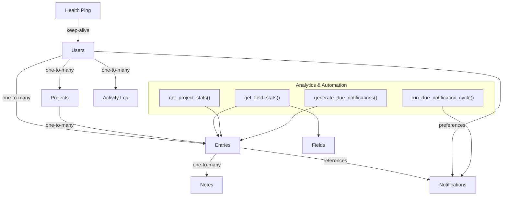

**Diagram sources**

- [000_baseline_full_schema.sql:29-147](file://supabase/migrations/000_baseline_full_schema.sql#L29-L147)
- [008_create_field_stats_rpc.sql:23-159](file://supabase/migrations/008_create_field_stats_rpc.sql#L23-L159)
- [011_create_notifications.sql:46-162](file://supabase/migrations/011_create_notifications.sql#L46-L162)

## Detailed Component Analysis

### Users

- Purpose: Identity and profile storage; linked to auth.users via trigger-based provisioning.
- Key fields: email (PK), username (unique), name, avatar, created_at, deletion_scheduled_at, deleted.
- Constraints: PK on email; unique username; soft-delete flag; scheduled deletion timestamp.
- Behavior:
  - Auto-provisioned on auth.users insert via trigger.
  - Grace period: schedule deletion marks user and related records as deleted; restore clears flags; purge deletes after 30 days.

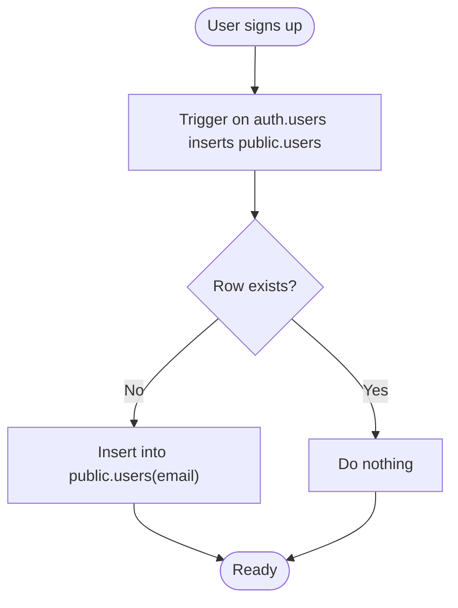

**Diagram sources**

- [002_auto_provision_public_users_for_auth.sql:32-51](file://supabase/migrations/002_auto_provision_public_users_for_auth.sql#L32-L51)
- [000_baseline_full_schema.sql:29-37](file://supabase/migrations/000_baseline_full_schema.sql#L29-L37)

**Section sources**

- [000_baseline_full_schema.sql:29-37](file://supabase/migrations/000_baseline_full_schema.sql#L29-L37)
- [002_auto_provision_public_users_for_auth.sql:24-51](file://supabase/migrations/002_auto_provision_public_users_for_auth.sql#L24-L51)
- [004_account_deletion_grace_period.sql:17-75](file://supabase/migrations/004_account_deletion_grace_period.sql#L17-L75)
- [005_add_soft_delete_column.sql:23-81](file://supabase/migrations/005_add_soft_delete_column.sql#L23-L81)

### Projects

- Purpose: User-scoped containers for entries.
- Key fields: id (PK), user_email, project_name, description, created_at, archived, deleted, project_color.
- Constraints: Composite unique(user_email, project_name); archived index; soft-delete flag.
- Behavior: Enforces uniqueness at DB level to avoid duplicates per user.

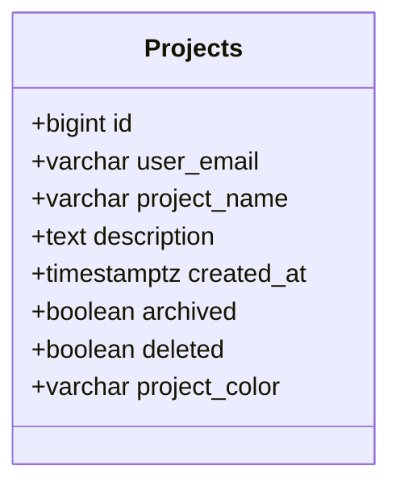

**Diagram sources**

- [000_baseline_full_schema.sql:41-66](file://supabase/migrations/000_baseline_full_schema.sql#L41-L66)
- [001_add_project_description_and_unique_name.sql:12-40](file://supabase/migrations/001_add_project_description_and_unique_name.sql#L12-L40)
- [008_add_project_color.sql:8-9](file://supabase/migrations/008_add_project_color.sql#L8-L9)

**Section sources**

- [000_baseline_full_schema.sql:41-66](file://supabase/migrations/000_baseline_full_schema.sql#L41-L66)
- [001_add_project_description_and_unique_name.sql:21-40](file://supabase/migrations/001_add_project_description_and_unique_name.sql#L21-L40)
- [008_add_project_color.sql:1-10](file://supabase/migrations/008_add_project_color.sql#L1-L10)

### Entries

- Purpose: Core data model storing rich JSONB payloads per project/user with lifecycle timestamps.
- Key fields: id (UUID), user_email, project_name, entries (JSONB), due_date, priority (enum), status, archived, started_at, ended_at, duration (generated), deleted, created_at, summary.
- Constraints: PK on id; generated duration column; enum priority; indexes on user_email, project_name, due_date, archived.
- Behavior: Summary field stores AI-generated one-line summaries; duration computed automatically when timestamps are set.

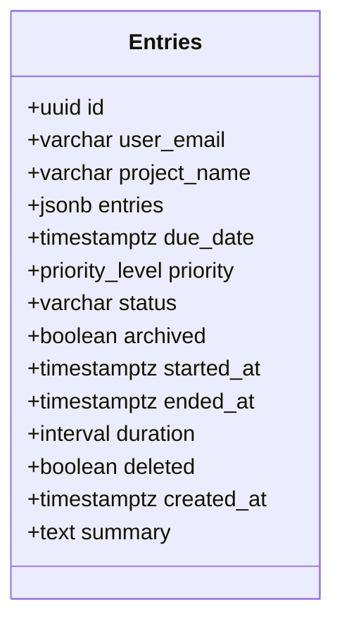

**Diagram sources**

- [000_baseline_full_schema.sql:69-94](file://supabase/migrations/000_baseline_full_schema.sql#L69-L94)
- [007_add_summary_column.sql:8-9](file://supabase/migrations/007_add_summary_column.sql#L8-L9)

**Section sources**

- [000_baseline_full_schema.sql:14-94](file://supabase/migrations/000_baseline_full_schema.sql#L14-L94)
- [007_add_summary_column.sql:1-10](file://supabase/migrations/007_add_summary_column.sql#L1-L10)

### Activity Log

- Purpose: Auditable feed of user actions.
- Key fields: id (PK), user_email, action_type, entity_type, entity_name, details (JSONB), created_at, deleted.
- Indexes: user_email + created_at DESC for fast feeds.
- Constraints: Foreign key to users with cascade delete.

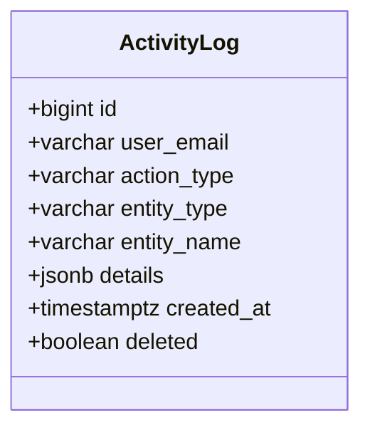

**Diagram sources**

- [003_create_activity_log_table.sql:12-24](file://supabase/migrations/003_create_activity_log_table.sql#L12-L24)
- [000_baseline_full_schema.sql:110-123](file://supabase/migrations/000_baseline_full_schema.sql#L110-L123)

**Section sources**

- [003_create_activity_log_table.sql:12-42](file://supabase/migrations/003_create_activity_log_table.sql#L12-L42)
- [000_baseline_full_schema.sql:110-138](file://supabase/migrations/000_baseline_full_schema.sql#L110-L138)

### Notes

- Purpose: Per-entry attachments or annotations.
- Key fields: id (UUID), email, entry_id (FK to entries), entry_type (CHECK), value, created_at.
- Indexes: entry_id and email for efficient retrieval.

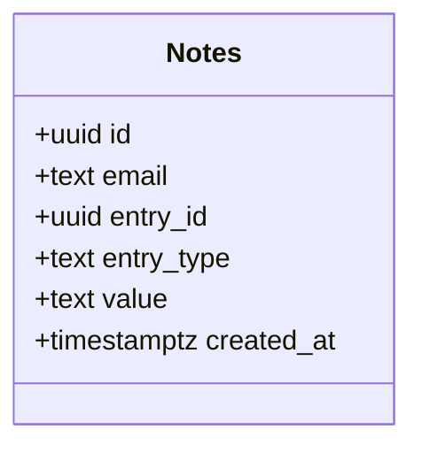

**Diagram sources**

- [009_create_notes_table.sql:5-15](file://supabase/migrations/009_create_notes_table.sql#L5-L15)

**Section sources**

- [009_create_notes_table.sql:1-16](file://supabase/migrations/009_create_notes_table.sql#L1-L16)

### Notifications

- Purpose: In-app notification feed and due-date email triggers.
- Key fields: id (UUID), user_email, entry_id, project_name, entry_title, type (CHECK), due_at, read, emailed, created_at.
- Constraints: UNIQUE(user_email, entry_id, type) for deduplication; CHECK(type IN ('due_soon','overdue')).
- Indexes: filtered indexes for unread and pending-email sets.
- Behavior: generate_due_notifications() creates rows; run_due_notification_cycle() optionally pokes project-service via pg_net to send emails.

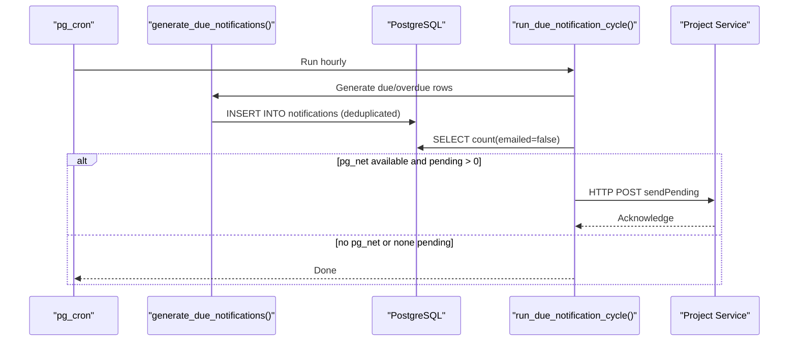

**Diagram sources**

- [011_create_notifications.sql:46-162](file://supabase/migrations/011_create_notifications.sql#L46-L162)

**Section sources**

- [011_create_notifications.sql:16-36](file://supabase/migrations/011_create_notifications.sql#L16-L36)
- [011_create_notifications.sql:46-162](file://supabase/migrations/011_create_notifications.sql#L46-L162)

### Health Ping

- Purpose: Keep-alive mechanism to prevent free-tier database pauses.
- Key fields: id (identity), message, pinged_at.
- Access: Row Level Security enabled; intended for service-role access only.

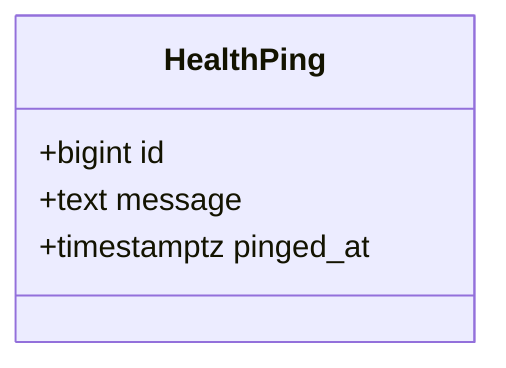

**Diagram sources**

- [006_create_health_ping_table.sql:7-21](file://supabase/migrations/006_create_health_ping_table.sql#L7-L21)

**Section sources**

- [006_create_health_ping_table.sql:1-22](file://supabase/migrations/006_create_health_ping_table.sql#L1-L22)

### Analytics and Automation Functions

- get_project_stats(p_user_email): Aggregates per-project durations and counts for a user.
- get_field_stats(p_user_email, p_table_name): Generic statistics over dynamic fields defined in fields table; infers types; returns groups, series, and by_project aggregations.
- delete_user(), restore_user(), purge_deleted_users(): Account lifecycle management with grace period and nightly purge.
- purge_unconfirmed_users(): Removes unconfirmed sign-ups older than 3 days.

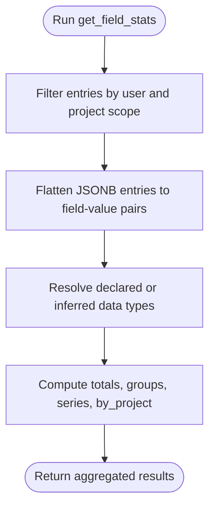

**Diagram sources**

- [008_create_field_stats_rpc.sql:23-159](file://supabase/migrations/008_create_field_stats_rpc.sql#L23-L159)

**Section sources**

- [000_baseline_full_schema.sql:162-275](file://supabase/migrations/000_baseline_full_schema.sql#L162-L275)
- [004_account_deletion_grace_period.sql:78-110](file://supabase/migrations/004_account_deletion_grace_period.sql#L78-L110)
- [005_add_soft_delete_column.sql:84-109](file://supabase/migrations/005_add_soft_delete_column.sql#L84-L109)
- [010_purge_unconfirmed_signups.sql:28-64](file://supabase/migrations/010_purge_unconfirmed_signups.sql#L28-L64)
- [008_create_field_stats_rpc.sql:23-159](file://supabase/migrations/008_create_field_stats_rpc.sql#L23-L159)

## Dependency Analysis

- Users are referenced by projects, entries, activity_log, and notifications.
- Projects reference users via user_email and are referenced by entries.
- Entries reference projects via project_name and users via user_email; notes reference entries via entry_id; notifications reference entries via entry_id.
- Field definitions influence analytics computations but do not constrain entries directly.
- Health ping is independent and used by daemon processes.

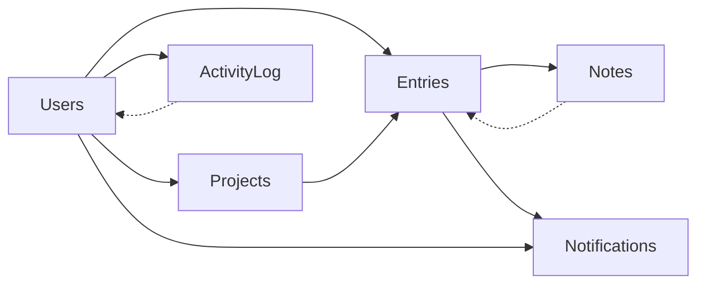

**Diagram sources**

- [000_baseline_full_schema.sql:29-147](file://supabase/migrations/000_baseline_full_schema.sql#L29-L147)
- [009_create_notes_table.sql:5-15](file://supabase/migrations/009_create_notes_table.sql#L5-L15)
- [011_create_notifications.sql:16-36](file://supabase/migrations/011_create_notifications.sql#L16-L36)

**Section sources**

- [000_baseline_full_schema.sql:29-147](file://supabase/migrations/000_baseline_full_schema.sql#L29-L147)
- [009_create_notes_table.sql:5-15](file://supabase/migrations/009_create_notes_table.sql#L5-L15)
- [011_create_notifications.sql:16-36](file://supabase/migrations/011_create_notifications.sql#L16-L36)

## Performance Considerations

- Use existing indexes:
  - entries: user_email, project_name, due_date, archived
  - activity_log: user_email + created_at DESC
  - notes: entry_id, email
  - notifications: filtered indexes for unread and pending-email
- Prefer filtering by user_email and project_name to leverage indexes.
- Avoid scanning entire JSONB payloads; use targeted keys in application logic.
- Leverage generated columns (duration) to avoid repeated computation.
- For analytics, call get_field_stats and get_project_stats rather than ad-hoc aggregation.
- Monitor pg_cron jobs for purges and notifications to ensure timely maintenance.

[No sources needed since this section provides general guidance]

## Troubleshooting Guide

Common issues and resolutions:

- Duplicate project names: Ensure unique constraint enforcement; handle PostgreSQL error code 23505 in application layer.
- Missing public.users row for OAuth users: Confirm trigger on_auth_user_created exists and runs; backfill if necessary.
- Soft-deleted data appearing: Verify filters exclude deleted=true rows in queries.
- Notifications not sent: Check pg_net availability; verify run_due_notification_cycle cron job; inspect emailed=false rows.
- Unconfirmed sign-ups accumulating: Ensure purge_unconfirmed_users cron job is active.
- Backup/restore failures: Validate DATABASE_URL; ensure pg_dump/pg_restore installed; confirm schema=public usage.

Operational commands:

- Apply migrations: node scripts/migrate.js
- Show migration status: node scripts/migrate.js status
- Bootstrap existing migrations: node scripts/migrate.js bootstrap
- Create backup: node scripts/backup.js [path]
- Restore backup: node scripts/restore.js [path]

**Section sources**

- [001_add_project_description_and_unique_name.sql:25-40](file://supabase/migrations/001_add_project_description_and_unique_name.sql#L25-L40)
- [002_auto_provision_public_users_for_auth.sql:32-51](file://supabase/migrations/002_auto_provision_public_users_for_auth.sql#L32-L51)
- [011_create_notifications.sql:116-162](file://supabase/migrations/011_create_notifications.sql#L116-L162)
- [010_purge_unconfirmed_signups.sql:59-64](file://supabase/migrations/010_purge_unconfirmed_signups.sql#L59-L64)
- [backup.js:62-99](file://scripts/backup.js#L62-L99)
- [restore.js:79-130](file://scripts/restore.js#L79-L130)
- [migrate.js:98-196](file://scripts/migrate.js#L98-L196)

## Conclusion

The Codacaine database schema is designed for scalability, maintainability, and safety. It uses idempotent migrations, robust constraints, and well-indexed tables to support core features like entries, projects, notes, and notifications while providing analytics and automation through stored functions. Backup and restore tooling, along with cron-driven maintenance, ensures operational resilience. Security is reinforced via RLS where appropriate and strict access patterns for sensitive operations.

[No sources needed since this section summarizes without analyzing specific files]

## Appendices

### Data Models and Relationships

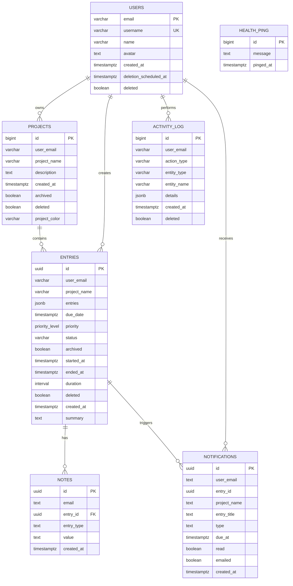

**Diagram sources**

- [000_baseline_full_schema.sql:29-147](file://supabase/migrations/000_baseline_full_schema.sql#L29-L147)
- [009_create_notes_table.sql:5-15](file://supabase/migrations/009_create_notes_table.sql#L5-L15)
- [011_create_notifications.sql:16-36](file://supabase/migrations/011_create_notifications.sql#L16-L36)
- [006_create_health_ping_table.sql:7-21](file://supabase/migrations/006_create_health_ping_table.sql#L7-L21)

### Migration Management Tools

- Version tracking: public.schema_migrations stores version and checksum.
- Commands:
  - migrate: apply pending migrations
  - status: list applied/pending
  - bootstrap: mark existing migrations as applied

**Section sources**

- [migrate.js:43-94](file://scripts/migrate.js#L43-L94)
- [migrate.js:98-196](file://scripts/migrate.js#L98-L196)

### Backup and Restore Procedures

- Backup:
  - Requires DATABASE_URL
  - Uses pg_dump with custom format, no-owner, no-acl, schema=public
  - Output path defaults to ./backups/logbook-<timestamp>.dump
- Restore:
  - Requires DATABASE_URL
  - Uses pg_restore with clean, if-exists, no-owner, no-acl, schema=public
  - Prompts before overwriting; suggests running migrations post-restore

**Section sources**

- [backup.js:22-99](file://scripts/backup.js#L22-L99)
- [restore.js:20-130](file://scripts/restore.js#L20-L130)

### Disaster Recovery Strategy

- Regular backups using backup.js scheduled via CI or OS cron.
- Periodic restore drills to validate backup integrity.
- Maintain multiple backup generations offsite.
- After restore, run migrations to align schema state.
- Use purge_deleted_users and purge_unconfirmed_users cron jobs to keep data healthy.

[No sources needed since this section provides general guidance]

### Security, Access Controls, and Privacy

- Row Level Security enabled on health_ping; policies restrict access to service-role.
- Stored functions use SECURITY DEFINER to enforce controlled operations.
- Soft-delete flags and grace periods protect user data during account deletion.
- Email notifications preference stored in users.email_notifications to honor user privacy settings.
- Unconfirmed sign-ups purged to reduce exposure of stale accounts.

**Section sources**

- [006_create_health_ping_table.sql:13-21](file://supabase/migrations/006_create_health_ping_table.sql#L13-L21)
- [000_baseline_full_schema.sql:162-275](file://supabase/migrations/000_baseline_full_schema.sql#L162-L275)
- [011_create_notifications.sql:38-40](file://supabase/migrations/011_create_notifications.sql#L38-L40)
- [010_purge_unconfirmed_signups.sql:28-64](file://supabase/migrations/010_purge_unconfirmed_signups.sql#L28-L64)

### Common Queries and Reporting Examples

- List recent activity for a user:
  - Select from activity_log where user_email = ? order by created_at desc limit N
- Get project stats for a user:
  - Call get_project_stats(user_email)
- Compute field statistics:
  - Call get_field_stats(user_email, optional table_name)
- Retrieve unread notifications:
  - Select from notifications where user_email = ? and read = false
- Find entries due soon:
  - Select from entries where user_email = ? and due_date between now() and now() + interval '24 hours' and archived = false and deleted = false

[No sources needed since this section provides general guidance]
