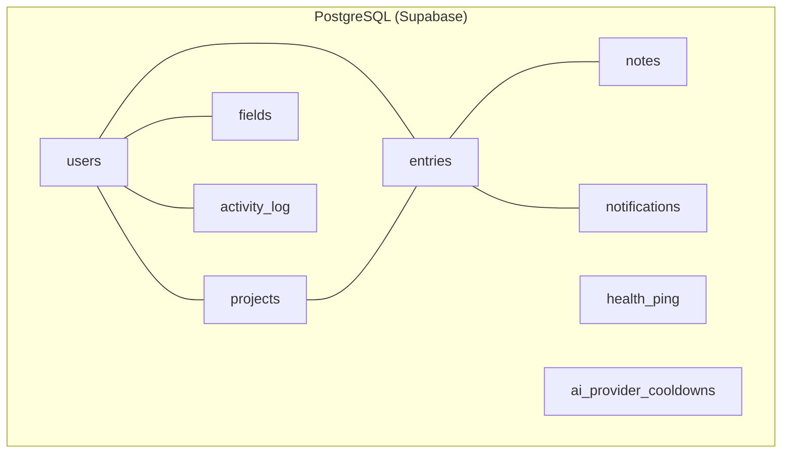
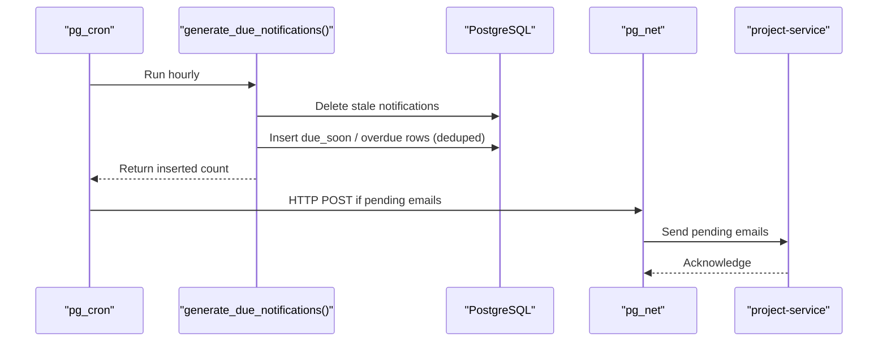
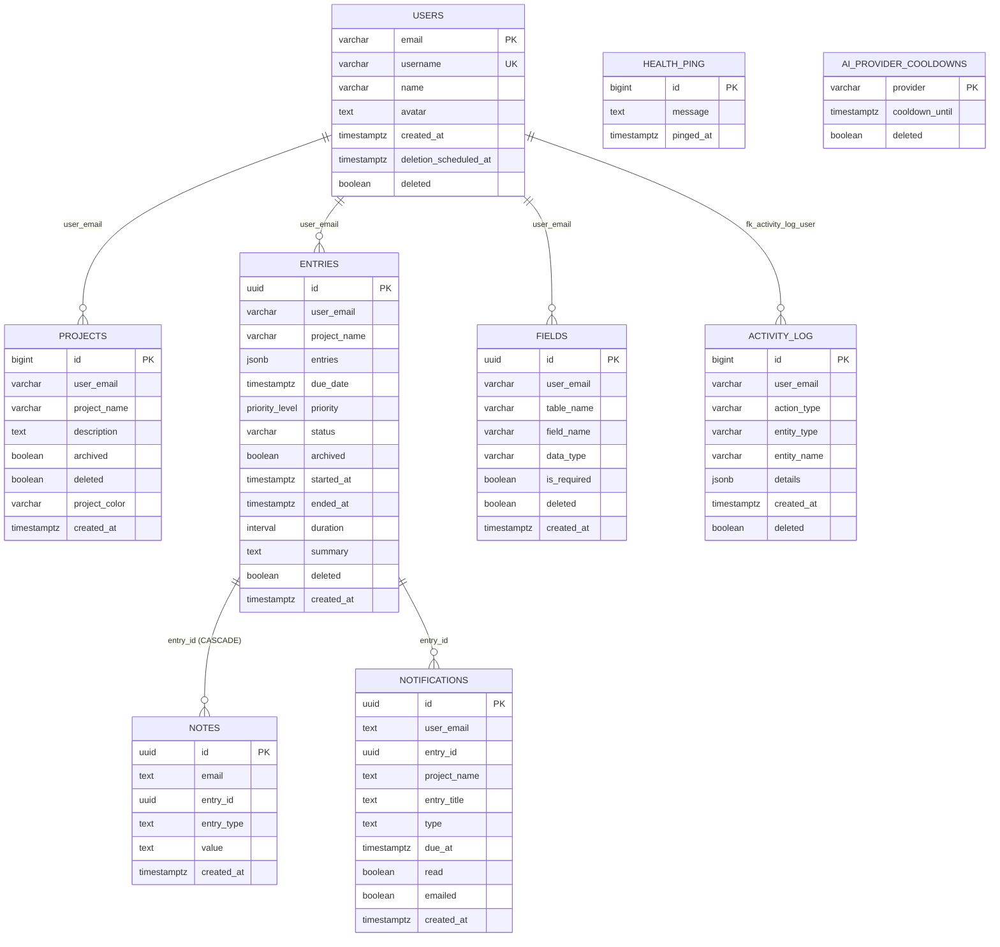

# Database Schema

<cite>
**Referenced Files in This Document**
- [000_baseline_full_schema.sql](file://supabase/migrations/000_baseline_full_schema.sql)
- [001_add_project_description_and_unique_name.sql](file://supabase/migrations/001_add_project_description_and_unique_name.sql)
- [003_create_activity_log_table.sql](file://supabase/migrations/003_create_activity_log_table.sql)
- [004_account_deletion_grace_period.sql](file://supabase/migrations/004_account_deletion_grace_period.sql)
- [005_add_soft_delete_column.sql](file://supabase/migrations/005_add_soft_delete_column.sql)
- [006_create_health_ping_table.sql](file://supabase/migrations/006_create_health_ping_table.sql)
- [007_add_summary_column.sql](file://supabase/migrations/007_add_summary_column.sql)
- [008_add_project_color.sql](file://supabase/migrations/008_add_project_color.sql)
- [009_create_notes_table.sql](file://supabase/migrations/009_create_notes_table.sql)
- [011_create_notifications.sql](file://supabase/migrations/011_create_notifications.sql)
- [database.md](file://docs-site/docs/Architecture/database.md)
</cite>

## Table of Contents

1. Introduction
2. Project Structure
3. Core Components
4. Architecture Overview
5. Detailed Component Analysis
6. Dependency Analysis
7. Performance Considerations
8. Troubleshooting Guide
9. Conclusion
10. Appendices

## Introduction

This document provides comprehensive database schema documentation for the Codacaine PostgreSQL database hosted on Supabase. It covers all core tables (users, projects, entries, fields, activity_log, health_ping, ai_provider_cooldowns, notes, notifications), their structures, data types, constraints, relationships, and indexes. It also explains the priority_level enum, common queries, and the purpose of each table within the application context.

## Project Structure

The schema is defined through versioned SQL migrations under supabase/migrations. A baseline migration creates the full schema idempotently, while subsequent migrations add features such as descriptions, soft deletes, notes, and notifications. The project’s architecture documentation describes design rationale, including why certain columns and indexes exist and how they support performance and flexibility.

**Diagram sources**

- [000_baseline_full_schema.sql:29-158](file://supabase/migrations/000_baseline_full_schema.sql#L29-L158)
- [009_create_notes_table.sql:5-15](file://supabase/migrations/009_create_notes_table.sql#L5-L15)
- [011_create_notifications.sql:16-40](file://supabase/migrations/011_create_notifications.sql#L16-L40)

**Section sources**

- [000_baseline_full_schema.sql:14-158](file://supabase/migrations/000_baseline_full_schema.sql#L14-L158)
- [database.md:62-247](file://docs-site/docs/Architecture/database.md#L62-L247)

## Core Components

This section summarizes each table’s role, key columns, constraints, and usage in the application.

- users
  - Purpose: Identity and profile store tied to Supabase Auth. Email is the primary key to align with auth sessions.
  - Key columns: email (PK), username (unique), name, avatar, created_at, deletion_scheduled_at, deleted (soft-delete).
  - Notes: Auto-provisioned from auth.users via trigger; supports account deletion grace period.

- projects
  - Purpose: Groups entries per user. Supports description and optional color.
  - Key columns: id (BIGSERIAL PK), user_email (FK to users.email), project_name (unique per user), description, archived, deleted, project_color, created_at.
  - Notes: Unique constraint on (user_email, project_name) prevents duplicate project names per user.

- entries
  - Purpose: Stores flexible entry payloads as JSONB along with metadata like due_date, priority, status, timestamps, and summary.
  - Key columns: id (UUID PK), user_email, project_name, entries (JSONB), due_date, priority (priority_level enum), status, archived, started_at, ended_at, duration (generated), summary, deleted, created_at.
  - Notes: Indexes optimize lookups by user, project, due date, and archive state. Duration is computed automatically.

- fields
  - Purpose: Defines dynamic field schemas per user/table so entries can vary without altering DB structure.
  - Key columns: id (UUID PK), user_email, table_name, field_name, data_type, is_required, deleted, created_at.

- activity_log
  - Purpose: Append-only audit trail of user actions for feed-style views.
  - Key columns: id (BIGSERIAL PK), user_email (FK to users.email), action_type, entity_type, entity_name, details (JSONB), created_at, deleted.
  - Notes: Composite index on (user_email, created_at DESC) for fast per-user feeds.

- health_ping
  - Purpose: Keep-alive table used by a daemon to prevent Supabase free-tier pausing.
  - Key columns: id (identity PK), message, pinged_at.
  - Notes: Row Level Security enabled; only service-role key accesses it.

- ai_provider_cooldowns
  - Purpose: Rate-limiting state for AI providers to handle throttling gracefully.
  - Key columns: provider (PK), cooldown_until, deleted.

- notes
  - Purpose: Per-entry personalization attachments (text, image, pdf, link).
  - Key columns: id (UUID PK), email, entry_id (FK to entries.id ON DELETE CASCADE), entry_type (CHECK constraint), value, created_at.
  - Notes: Indexed by entry_id and email for efficient retrieval.

- notifications
  - Purpose: In-app feed and email triggers for due-soon and overdue entries.
  - Key columns: id (UUID PK), user_email, entry_id, project_name, entry_title, type (CHECK 'due_soon' | 'overdue'), due_at, read, emailed, created_at.
  - Notes: Unique constraint on (user_email, entry_id, type) deduplicates notifications; partial indexes optimize unread and pending-email queries.

**Section sources**

- [000_baseline_full_schema.sql:29-158](file://supabase/migrations/000_baseline_full_schema.sql#L29-L158)
- [001_add_project_description_and_unique_name.sql:12-40](file://supabase/migrations/001_add_project_description_and_unique_name.sql#L12-L40)
- [006_create_health_ping_table.sql:7-21](file://supabase/migrations/006_create_health_ping_table.sql#L7-L21)
- [007_add_summary_column.sql:8-9](file://supabase/migrations/007_add_summary_column.sql#L8-L9)
- [008_add_project_color.sql:8-9](file://supabase/migrations/008_add_project_color.sql#L8-L9)
- [009_create_notes_table.sql:5-15](file://supabase/migrations/009_create_notes_table.sql#L5-L15)
- [011_create_notifications.sql:16-40](file://supabase/migrations/011_create_notifications.sql#L16-L40)
- [database.md:62-247](file://docs-site/docs/Architecture/database.md#L62-L247)

## Architecture Overview

The database enforces relational integrity where appropriate (e.g., activity_log → users, notes → entries) while allowing flexible payload storage via JSONB for entries. Soft deletes and scheduled purges provide safe account lifecycle management. Scheduled jobs maintain health and generate notifications.

**Diagram sources**

- [011_create_notifications.sql:46-161](file://supabase/migrations/011_create_notifications.sql#L46-L161)

**Section sources**

- [011_create_notifications.sql:46-161](file://supabase/migrations/011_create_notifications.sql#L46-L161)
- [database.md:499-512](file://docs-site/docs/Architecture/database.md#L499-L512)

## Detailed Component Analysis

### Enum: priority_level

- Definition: Enum values include “Urgent and important”, “Urgent but not important”, “Not urgent, not important”.
- Usage: Stored in entries.priority to classify tasks consistently across projects.
- Rationale: Ensures valid values at the database level and enables consistent sorting/filtering.

Common operations:

- Set or clear priority for an entry.
- Filter entries by priority for dashboards and boards.

Example queries:

- List entries with priority set:
  - SELECT id, project_name, due_date, priority FROM entries WHERE priority IS NOT NULL AND deleted = false;
- Count entries by priority:
  - SELECT priority, COUNT(*) FROM entries WHERE deleted = false GROUP BY priority;

**Section sources**

- [000_baseline_full_schema.sql:16-25](file://supabase/migrations/000_baseline_full_schema.sql#L16-L25)
- [000_baseline_full_schema.sql:69-84](file://supabase/migrations/000_baseline_full_schema.sql#L69-L84)
- [database.md:111-127](file://docs-site/docs/Architecture/database.md#L111-L127)

### Table: users

- Primary key: email
- Constraints: username unique; soft-delete flag deleted; deletion scheduling via deletion_scheduled_at
- Relationships: Referenced by projects.user_email (conceptual FK enforced by app logic); referenced by activity_log.user_email via explicit FK

Purpose: Central identity store aligned with Supabase Auth.

Common queries:

- Get profile by email:
  - SELECT * FROM users WHERE email = $1;
- Check if account scheduled for deletion:
  - SELECT deleted, deletion_scheduled_at FROM users WHERE email = $1;

**Section sources**

- [000_baseline_full_schema.sql:29-37](file://supabase/migrations/000_baseline_full_schema.sql#L29-L37)
- [004_account_deletion_grace_period.sql:5-8](file://supabase/migrations/004_account_deletion_grace_period.sql#L5-L8)
- [database.md:62-73](file://docs-site/docs/Architecture/database.md#L62-L73)

### Table: projects

- Primary key: id (BIGSERIAL)
- Constraints: UNIQUE(user_email, project_name); archived boolean; deleted boolean; optional project_color
- Relationships: Conceptually linked to users via user_email; contains entries scoped by project_name

Purpose: Organize entries into user-scoped projects with optional description and color.

Common queries:

- List active projects for a user:
  - SELECT id, project_name, description, project_color FROM projects WHERE user_email = $1 AND archived = false AND deleted = false;
- Create project (enforced uniqueness):
  - INSERT INTO projects (user_email, project_name, description) VALUES ($1, $2, $3);

**Section sources**

- [000_baseline_full_schema.sql:41-65](file://supabase/migrations/000_baseline_full_schema.sql#L41-L65)
- [001_add_project_description_and_unique_name.sql:12-40](file://supabase/migrations/001_add_project_description_and_unique_name.sql#L12-L40)
- [008_add_project_color.sql:8-9](file://supabase/migrations/008_add_project_color.sql#L8-L9)
- [database.md:74-94](file://docs-site/docs/Architecture/database.md#L74-L94)

### Table: entries

- Primary key: id (UUID)
- Columns: user_email, project_name, entries (JSONB), due_date, priority (priority_level), status, archived, started_at, ended_at, duration (GENERATED), summary, deleted, created_at
- Indexes: idx_entries_user_email, idx_entries_project_name, idx_entries_due_date, idx_entries_archived
- Relationships: Referenced by notes.entry_id (FK cascade); used by notifications to generate reminders

Purpose: Store flexible entry data plus time-tracking and prioritization metadata.

Common queries:

- Fetch user’s active entries for a project:
  - SELECT id, entries, due_date, priority, status, created_at FROM entries WHERE user_email = $1 AND project_name = $2 AND archived = false AND deleted = false ORDER BY due_date ASC;
- Find overdue entries:
  - SELECT id, project_name, entries, due_date FROM entries WHERE due_date < now() AND status <> 'done_and_dusted' AND archived = false AND deleted = false;
- Compute total duration per project:
  - SELECT project_name, SUM(duration) AS total_duration FROM entries WHERE user_email = $1 AND archived = false AND deleted = false GROUP BY project_name;

**Section sources**

- [000_baseline_full_schema.sql:69-93](file://supabase/migrations/000_baseline_full_schema.sql#L69-L93)
- [007_add_summary_column.sql:8-9](file://supabase/migrations/007_add_summary_column.sql#L8-L9)
- [database.md:109-188](file://docs-site/docs/Architecture/database.md#L109-L188)

### Table: fields

- Primary key: id (UUID)
- Columns: user_email, table_name, field_name, data_type, is_required, deleted, created_at
- Purpose: Define dynamic field schemas per user/table to support customizable entry shapes without schema migrations.

Common queries:

- Get field definitions for a table:
  - SELECT field_name, data_type, is_required FROM fields WHERE user_email = $1 AND table_name = $2 AND deleted = false;

**Section sources**

- [000_baseline_full_schema.sql:97-106](file://supabase/migrations/000_baseline_full_schema.sql#L97-L106)
- [database.md:96-107](file://docs-site/docs/Architecture/database.md#L96-L107)

### Table: activity_log

- Primary key: id (BIGSERIAL)
- Columns: user_email, action_type, entity_type, entity_name, details (JSONB), created_at, deleted
- Index: idx_activity_log_user_email on (user_email, created_at DESC)
- Foreign key: fk_activity_log_user references users(email) ON DELETE CASCADE
- Purpose: Append-only audit trail for UI activity feeds.

Common queries:

- Recent activity for a user:
  - SELECT action_type, entity_type, entity_name, details, created_at FROM activity_log WHERE user_email = $1 AND deleted = false ORDER BY created_at DESC LIMIT 50;

**Section sources**

- [000_baseline_full_schema.sql:110-138](file://supabase/migrations/000_baseline_full_schema.sql#L110-L138)
- [003_create_activity_log_table.sql:12-42](file://supabase/migrations/003_create_activity_log_table.sql#L12-L42)
- [database.md:194-207](file://docs-site/docs/Architecture/database.md#L194-L207)

### Table: health_ping

- Primary key: id (IDENTITY)
- Columns: message, pinged_at
- Purpose: Keep-alive mechanism to prevent Supabase free-tier pause.

Common queries:

- Insert keep-alive row:
  - INSERT INTO health_ping (message) VALUES ('hello hlulani');
- Purge old pings:
  - DELETE FROM health_ping WHERE pinged_at < now() - INTERVAL '7 days';

**Section sources**

- [006_create_health_ping_table.sql:7-21](file://supabase/migrations/006_create_health_ping_table.sql#L7-L21)
- [database.md:209-217](file://docs-site/docs/Architecture/database.md#L209-L217)

### Table: ai_provider_cooldowns

- Primary key: provider
- Columns: cooldown_until, deleted
- Purpose: Persist rate-limit state for AI providers to avoid repeated failures during throttling.

Common queries:

- Mark provider as cooled down:
  - INSERT INTO ai_provider_cooldowns (provider, cooldown_until) VALUES ($1, $2) ON CONFLICT (provider) DO UPDATE SET cooldown_until = EXCLUDED.cooldown_until;
- Check if provider is available:
  - SELECT provider FROM ai_provider_cooldowns WHERE cooldown_until > now();

**Section sources**

- [000_baseline_full_schema.sql:154-158](file://supabase/migrations/000_baseline_full_schema.sql#L154-L158)
- [database.md:233-247](file://docs-site/docs/Architecture/database.md#L233-L247)

### Table: notes

- Primary key: id (UUID)
- Columns: email, entry_id (FK to entries.id ON DELETE CASCADE), entry_type (CHECK in text|image|pdf|link), value, created_at
- Indexes: idx_notes_entry_id, idx_notes_email
- Purpose: Attach per-entry personalization content.

Common queries:

- Get notes for an entry:
  - SELECT entry_type, value, created_at FROM notes WHERE entry_id = $1 ORDER BY created_at;
- Add a note:
  - INSERT INTO notes (email, entry_id, entry_type, value) VALUES ($1, $2, $3, $4);

**Section sources**

- [009_create_notes_table.sql:5-15](file://supabase/migrations/009_create_notes_table.sql#L5-L15)
- [database.md:219-231](file://docs-site/docs/Architecture/database.md#L219-L231)

### Table: notifications

- Primary key: id (UUID)
- Columns: user_email, entry_id, project_name, entry_title, type (CHECK in due_soon|overdue), due_at, read, emailed, created_at
- Constraints: UNIQUE(user_email, entry_id, type)
- Indexes: idx_notifications_user_unread (partial on read=false), idx_notifications_pending_email (partial on emailed=false)
- Purpose: Generate due-soon and overdue notifications and coordinate email delivery.

Common queries:

- Get unread notifications for a user:
  - SELECT id, entry_id, project_name, entry_title, type, due_at FROM notifications WHERE user_email = $1 AND read = false ORDER BY due_at ASC;
- Mark notification as read:
  - UPDATE notifications SET read = true WHERE id = $1 AND user_email = $2;

**Section sources**

- [011_create_notifications.sql:16-40](file://supabase/migrations/011_create_notifications.sql#L16-L40)
- [database.md:260-296](file://docs-site/docs/Architecture/database.md#L260-L296)

## Dependency Analysis

Key relationships and constraints:

- activity_log.user_email → users.email (ON DELETE CASCADE) ensures cleanup when a user is removed.
- notes.entry_id → entries.id (ON DELETE CASCADE) ensures notes are removed when their parent entry is deleted.
- projects has a conceptual relationship to users via user_email; uniqueness is enforced on (user_email, project_name).
- notifications reference entries indirectly via entry_id and project_name to build contextual reminders.

**Diagram sources**

- [000_baseline_full_schema.sql:29-158](file://supabase/migrations/000_baseline_full_schema.sql#L29-L158)
- [003_create_activity_log_table.sql:27-42](file://supabase/migrations/003_create_activity_log_table.sql#L27-L42)
- [009_create_notes_table.sql:5-15](file://supabase/migrations/009_create_notes_table.sql#L5-L15)
- [011_create_notifications.sql:16-40](file://supabase/migrations/011_create_notifications.sql#L16-L40)

**Section sources**

- [003_create_activity_log_table.sql:27-42](file://supabase/migrations/003_create_activity_log_table.sql#L27-L42)
- [009_create_notes_table.sql:5-15](file://supabase/migrations/009_create_notes_table.sql#L5-L15)
- [011_create_notifications.sql:16-40](file://supabase/migrations/011_create_notifications.sql#L16-L40)

## Performance Considerations

Indexes created for performance:

- idx_entries_user_email: Optimizes per-user entry queries.
- idx_entries_project_name: Optimizes per-project entry queries.
- idx_entries_due_date: Enables fast overdue checks and calendar views.
- idx_entries_archived: Speeds up filtering between active and archived entries.
- idx_activity_log_user_email: Composite index for per-user activity feed ordering.
- idx_projects_archived: Filters active vs archived projects efficiently.
- idx_notes_entry_id and idx_notes_email: Fast retrieval of notes by entry or owner.
- Partial indexes on notifications:
  - idx_notifications_user_unread: Optimizes unread notification lists.
  - idx_notifications_pending_email: Optimizes batch sending of pending emails.

Design choices that improve performance:

- Storing due_date and priority as real columns rather than inside JSONB allows indexed comparisons and aggregation.
- Using a generated column for duration avoids manual computation and keeps totals accurate.
- Soft deletes reduce expensive hard deletes and allow graceful purging via cron.

**Section sources**

- [000_baseline_full_schema.sql:64-93](file://supabase/migrations/000_baseline_full_schema.sql#L64-L93)
- [000_baseline_full_schema.sql:121-122](file://supabase/migrations/000_baseline_full_schema.sql#L121-L122)
- [009_create_notes_table.sql:14-15](file://supabase/migrations/009_create_notes_table.sql#L14-L15)
- [011_create_notifications.sql:30-36](file://supabase/migrations/011_create_notifications.sql#L30-L36)
- [database.md:165-188](file://docs-site/docs/Architecture/database.md#L165-L188)

## Troubleshooting Guide

Common issues and resolutions:

- Duplicate project names per user:
  - Symptom: Unique constraint violation on (user_email, project_name).
  - Resolution: Ensure project_name is unique per user; update before insert.
- Missing activity log after user deletion:
  - Cause: If foreign key was missing, cascading delete would not remove logs.
  - Resolution: Verify fk_activity_log_user exists; re-run migration to add it if missing.
- Notifications not sent:
  - Symptom: emailed remains false.
  - Resolution: Ensure pg_cron job runs; check pg_net availability; verify project-service endpoint reachable.
- Health ping not preventing pause:
  - Symptom: Database sleeps.
  - Resolution: Confirm daemon inserts/deletes rows in health_ping regularly and service-role key is used.

Relevant RPCs and jobs:

- delete_user(), restore_user(), purge_deleted_users(): Manage soft-deletes and permanent purges.
- generate_due_notifications(), run_due_notification_cycle(): Maintain notification state and send emails.

**Section sources**

- [001_add_project_description_and_unique_name.sql:25-40](file://supabase/migrations/001_add_project_description_and_unique_name.sql#L25-L40)
- [003_create_activity_log_table.sql:27-42](file://supabase/migrations/003_create_activity_log_table.sql#L27-L42)
- [004_account_deletion_grace_period.sql:17-109](file://supabase/migrations/004_account_deletion_grace_period.sql#L17-L109)
- [011_create_notifications.sql:46-161](file://supabase/migrations/011_create_notifications.sql#L46-L161)

## Conclusion

The Codacaine database schema balances relational integrity with flexible, user-defined entry structures using JSONB and dynamic field definitions. It includes robust indexing for performance, soft-delete mechanisms for safe account lifecycle management, and automated processes for health monitoring and notifications. The schema supports scalable querying patterns essential for dashboards, calendars, and activity feeds.

## Appendices

### Common Queries Reference

- Entries by user and project:
  - SELECT id, entries, due_date, priority, status, created_at FROM entries WHERE user_email = $1 AND project_name = $2 AND archived = false AND deleted = false ORDER BY due_date ASC;
- Overdue entries:
  - SELECT id, project_name, entries, due_date FROM entries WHERE due_date < now() AND status <> 'done_and_dusted' AND archived = false AND deleted = false;
- Activity feed for a user:
  - SELECT action_type, entity_type, entity_name, details, created_at FROM activity_log WHERE user_email = $1 AND deleted = false ORDER BY created_at DESC LIMIT 50;
- Unread notifications:
  - SELECT id, entry_id, project_name, entry_title, type, due_at FROM notifications WHERE user_email = $1 AND read = false ORDER BY due_at ASC;
- Notes for an entry:
  - SELECT entry_type, value, created_at FROM notes WHERE entry_id = $1 ORDER BY created_at;

**Section sources**

- [000_baseline_full_schema.sql:69-93](file://supabase/migrations/000_baseline_full_schema.sql#L69-L93)
- [003_create_activity_log_table.sql:22-24](file://supabase/migrations/003_create_activity_log_table.sql#L22-L24)
- [009_create_notes_table.sql:14-15](file://supabase/migrations/009_create_notes_table.sql#L14-L15)
- [011_create_notifications.sql:30-36](file://supabase/migrations/011_create_notifications.sql#L30-L36)
