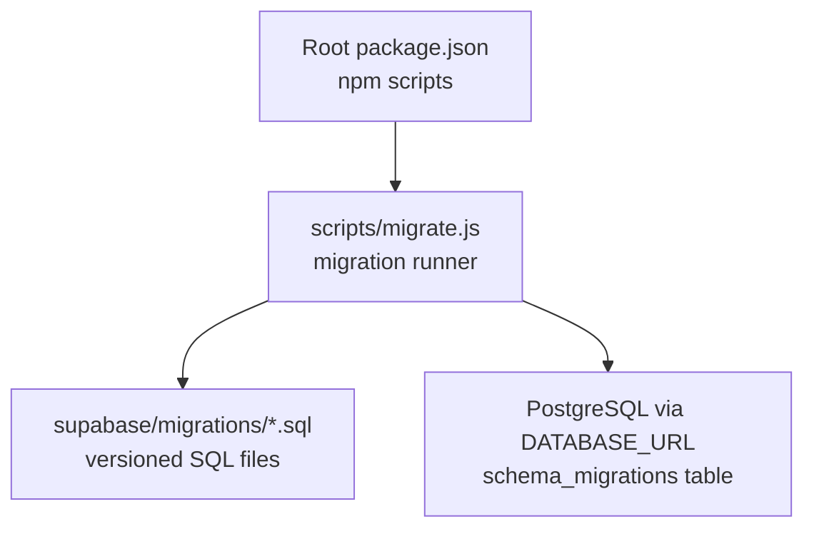
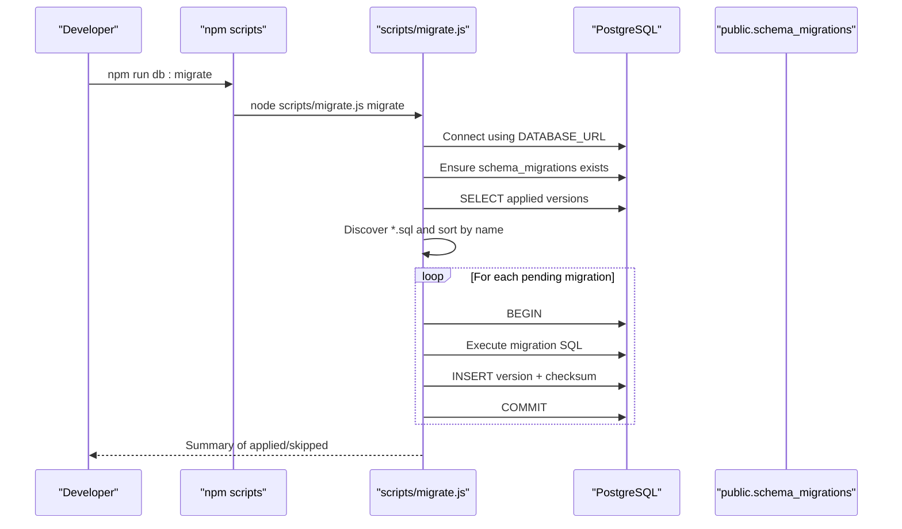
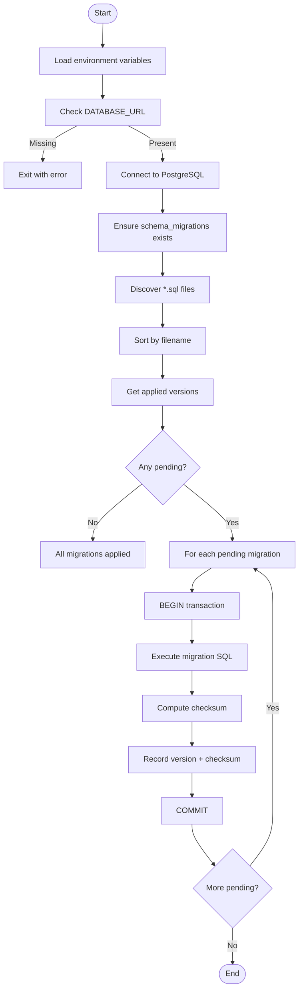
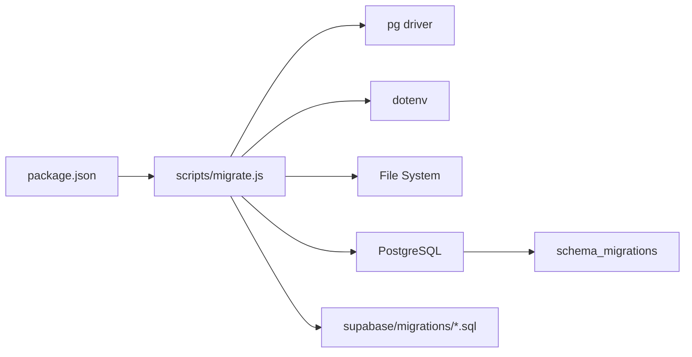

# Migrations Management

<cite>
**Referenced Files in This Document**
- [package.json](file://package.json)
- [migrate.js](file://scripts/migrate.js)
- [000_baseline_full_schema.sql](file://supabase/migrations/000_baseline_full_schema.sql)
- [001_add_project_description_and_unique_name.sql](file://supabase/migrations/001_add_project_description_and_unique_name.sql)
- [005_add_soft_delete_column.sql](file://supabase/migrations/005_add_soft_delete_column.sql)
- [008_create_field_stats_rpc.sql](file://supabase/migrations/008_create_field_stats_rpc.sql)
- [010_purge_unconfirmed_signups.sql](file://supabase/migrations/010_purge_unconfirmed_signups.sql)
- [011_create_notifications.sql](file://supabase/migrations/011_create_notifications.sql)
</cite>

## Table of Contents

1. Introduction
2. Project Structure
3. Core Components
4. Architecture Overview
5. Detailed Component Analysis
6. Dependency Analysis
7. Performance Considerations
8. Troubleshooting Guide
9. Conclusion
10. Appendices

## Introduction

This document explains the database migration system for the project, which uses numbered SQL files under supabase/migrations and a Node-based runner to apply changes safely to both fresh and existing databases. The approach is versioned, idempotent, and transactional, with a baseline migration that captures the entire schema and incremental migrations that evolve it over time. It also covers how to run, check status, bootstrap legacy databases, and create new migrations while maintaining backward compatibility.

## Project Structure

The migration system consists of:

- A baseline migration file that creates the full schema idempotently
- Incremental migration files that add or alter schema elements safely
- A Node migration runner that discovers, orders, and applies pending migrations
- npm scripts that wrap the runner for convenience

**Diagram sources**

- [package.json:6-14](file://package.json#L6-L14)
- [migrate.js:24-24](file://scripts/migrate.js#L24-L24)
- [migrate.js:46-54](file://scripts/migrate.js#L46-L54)

**Section sources**

- [package.json:6-14](file://package.json#L6-L14)
- [migrate.js:24-24](file://scripts/migrate.js#L24-L24)

## Core Components

- Baseline migration (000): Creates all tables, types, indexes, functions, triggers, and cron jobs idempotently so it can be run on any database state without side effects.
- Incremental migrations (001+): Add columns, constraints, functions, and scheduled jobs using safe patterns like IF NOT EXISTS and CREATE OR REPLACE.
- Migration runner (scripts/migrate.js): Discovers .sql files, sorts them by filename, checks applied versions via a tracking table, runs each migration inside a transaction, and records checksums.
- NPM scripts: Provide convenient commands to migrate, check status, bootstrap, backup, and restore.

Key behaviors:

- Idempotency: All SQL uses guards (IF NOT EXISTS, CREATE OR REPLACE, conditional constraint creation) to be safe to re-run.
- Ordering: Files are sorted lexicographically; numeric prefixes ensure deterministic order.
- Tracking: A schema_migrations table stores version, timestamp, and checksum to avoid reapplying unchanged migrations.
- Transactions: Each migration runs in its own transaction; failures roll back automatically.

**Section sources**

- [000_baseline_full_schema.sql:1-12](file://supabase/migrations/000_baseline_full_schema.sql#L1-L12)
- [000_baseline_full_schema.sql:16-25](file://supabase/migrations/000_baseline_full_schema.sql#L16-L25)
- [000_baseline_full_schema.sql:29-37](file://supabase/migrations/000_baseline_full_schema.sql#L29-L37)
- [000_baseline_full_schema.sql:41-66](file://supabase/migrations/000_baseline_full_schema.sql#L41-L66)
- [000_baseline_full_schema.sql:69-93](file://supabase/migrations/000_baseline_full_schema.sql#L69-L93)
- [000_baseline_full_schema.sql:97-106](file://supabase/migrations/000_baseline_full_schema.sql#L97-L106)
- [000_baseline_full_schema.sql:110-123](file://supabase/migrations/000_baseline_full_schema.sql#L110-L123)
- [000_baseline_full_schema.sql:124-138](file://supabase/migrations/000_baseline_full_schema.sql#L124-L138)
- [000_baseline_full_schema.sql:142-150](file://supabase/migrations/000_baseline_full_schema.sql#L142-L150)
- [000_baseline_full_schema.sql:154-158](file://supabase/migrations/000_baseline_full_schema.sql#L154-L158)
- [000_baseline_full_schema.sql:162-188](file://supabase/migrations/000_baseline_full_schema.sql#L162-L188)
- [000_baseline_full_schema.sql:190-215](file://supabase/migrations/000_baseline_full_schema.sql#L190-L215)
- [000_baseline_full_schema.sql:217-240](file://supabase/migrations/000_baseline_full_schema.sql#L217-L240)
- [000_baseline_full_schema.sql:242-275](file://supabase/migrations/000_baseline_full_schema.sql#L242-L275)
- [000_baseline_full_schema.sql:279-296](file://supabase/migrations/000_baseline_full_schema.sql#L279-L296)
- [000_baseline_full_schema.sql:300-305](file://supabase/migrations/000_baseline_full_schema.sql#L300-L305)
- [000_baseline_full_schema.sql:310-317](file://supabase/migrations/000_baseline_full_schema.sql#L310-L317)
- [migrate.js:31-41](file://scripts/migrate.js#L31-L41)
- [migrate.js:46-54](file://scripts/migrate.js#L46-L54)
- [migrate.js:69-94](file://scripts/migrate.js#L69-L94)
- [migrate.js:101-136](file://scripts/migrate.js#L101-L136)
- [migrate.js:141-160](file://scripts/migrate.js#L141-L160)
- [migrate.js:166-196](file://scripts/migrate.js#L166-L196)
- [migrate.js:200-250](file://scripts/migrate.js#L200-L250)
- [package.json:6-14](file://package.json#L6-L14)

## Architecture Overview

The migration architecture ensures safe, repeatable schema evolution:

**Diagram sources**

- [migrate.js:31-41](file://scripts/migrate.js#L31-L41)
- [migrate.js:46-54](file://scripts/migrate.js#L46-L54)
- [migrate.js:59-64](file://scripts/migrate.js#L59-L64)
- [migrate.js:69-94](file://scripts/migrate.js#L69-L94)
- [migrate.js:101-136](file://scripts/migrate.js#L101-L136)
- [migrate.js:200-250](file://scripts/migrate.js#L200-L250)

## Detailed Component Analysis

### Baseline Migration (000_baseline_full_schema.sql)

- Purpose: Establishes the complete schema in an idempotent way so it can be executed against any database state.
- Key elements:
  - Enum type creation guarded by existence checks
  - Tables created with IF NOT EXISTS
  - Indexes created with IF NOT EXISTS
  - Constraints added conditionally
  - Functions and triggers created with CREATE OR REPLACE
  - Backfill logic for existing auth users
  - Cron job scheduling guarded by extension availability

Idempotency highlights:

- Types and tables use existence guards
- Constraints are added only if missing
- Functions are replaced safely
- Cron jobs are unscheduled before rescheduling

**Section sources**

- [000_baseline_full_schema.sql:16-25](file://supabase/migrations/000_baseline_full_schema.sql#L16-L25)
- [000_baseline_full_schema.sql:29-37](file://supabase/migrations/000_baseline_full_schema.sql#L29-L37)
- [000_baseline_full_schema.sql:41-66](file://supabase/migrations/000_baseline_full_schema.sql#L41-L66)
- [000_baseline_full_schema.sql:69-93](file://supabase/migrations/000_baseline_full_schema.sql#L69-L93)
- [000_baseline_full_schema.sql:97-106](file://supabase/migrations/000_baseline_full_schema.sql#L97-L106)
- [000_baseline_full_schema.sql:110-123](file://supabase/migrations/000_baseline_full_schema.sql#L110-L123)
- [000_baseline_full_schema.sql:124-138](file://supabase/migrations/000_baseline_full_schema.sql#L124-L138)
- [000_baseline_full_schema.sql:142-150](file://supabase/migrations/000_baseline_full_schema.sql#L142-L150)
- [000_baseline_full_schema.sql:154-158](file://supabase/migrations/000_baseline_full_schema.sql#L154-L158)
- [000_baseline_full_schema.sql:162-188](file://supabase/migrations/000_baseline_full_schema.sql#L162-L188)
- [000_baseline_full_schema.sql:190-215](file://supabase/migrations/000_baseline_full_schema.sql#L190-L215)
- [000_baseline_full_schema.sql:217-240](file://supabase/migrations/000_baseline_full_schema.sql#L217-L240)
- [000_baseline_full_schema.sql:242-275](file://supabase/migrations/000_baseline_full_schema.sql#L242-L275)
- [000_baseline_full_schema.sql:279-296](file://supabase/migrations/000_baseline_full_schema.sql#L279-L296)
- [000_baseline_full_schema.sql:300-305](file://supabase/migrations/000_baseline_full_schema.sql#L300-L305)
- [000_baseline_full_schema.sql:310-317](file://supabase/migrations/000_baseline_full_schema.sql#L310-L317)

### Incremental Migrations

- 001: Adds optional description column to projects and enforces unique project names per user. Uses IF NOT EXISTS and conditional constraint creation.
- 005: Introduces soft delete across tables and updates related RPCs to handle deleted flags consistently.
- 008 (field stats): Provides a generic RPC to compute field statistics dynamically based on declared types or inferred types from data.
- 010: Purges unconfirmed sign-ups after a grace period and schedules nightly cleanup via pg_cron.
- 011: Implements notification system with deduplication, preference column, generator function, and hourly cycle using pg_net when available.

These migrations demonstrate safe schema evolution:

- Columns added with IF NOT EXISTS
- Functions replaced with CREATE OR REPLACE
- Constraints added conditionally
- Scheduled jobs unscheduled before rescheduling
- Optional extensions handled gracefully

**Section sources**

- [001_add_project_description_and_unique_name.sql:10-40](file://supabase/migrations/001_add_project_description_and_unique_name.sql#L10-L40)
- [005_add_soft_delete_column.sql:4-21](file://supabase/migrations/005_add_soft_delete_column.sql#L4-L21)
- [005_add_soft_delete_column.sql:23-52](file://supabase/migrations/005_add_soft_delete_column.sql#L23-L52)
- [005_add_soft_delete_column.sql:54-82](file://supabase/migrations/005_add_soft_delete_column.sql#L54-L82)
- [005_add_soft_delete_column.sql:84-108](file://supabase/migrations/005_add_soft_delete_column.sql#L84-L108)
- [008_create_field_stats_rpc.sql:23-39](file://supabase/migrations/008_create_field_stats_rpc.sql#L23-L39)
- [008_create_field_stats_rpc.sql:40-159](file://supabase/migrations/008_create_field_stats_rpc.sql#L40-L159)
- [010_purge_unconfirmed_signups.sql:28-57](file://supabase/migrations/010_purge_unconfirmed_signups.sql#L28-L57)
- [010_purge_unconfirmed_signups.sql:59-64](file://supabase/migrations/010_purge_unconfirmed_signups.sql#L59-L64)
- [011_create_notifications.sql:16-36](file://supabase/migrations/011_create_notifications.sql#L16-L36)
- [011_create_notifications.sql:38-40](file://supabase/migrations/011_create_notifications.sql#L38-L40)
- [011_create_notifications.sql:46-114](file://supabase/migrations/011_create_notifications.sql#L46-L114)
- [011_create_notifications.sql:116-152](file://supabase/migrations/011_create_notifications.sql#L116-L152)
- [011_create_notifications.sql:154-162](file://supabase/migrations/011_create_notifications.sql#L154-L162)

### Migration Runner (scripts/migrate.js)

Responsibilities:

- Environment loading from multiple .env locations
- Connection pooling to PostgreSQL
- Ensuring schema_migrations table exists
- Discovering and sorting migration files
- Running migrations in transactions
- Recording checksums to prevent reapplication
- Providing status and bootstrap commands

**Diagram sources**

- [migrate.js:200-250](file://scripts/migrate.js#L200-L250)
- [migrate.js:31-41](file://scripts/migrate.js#L31-L41)
- [migrate.js:46-54](file://scripts/migrate.js#L46-L54)
- [migrate.js:59-64](file://scripts/migrate.js#L59-L64)
- [migrate.js:69-94](file://scripts/migrate.js#L69-L94)
- [migrate.js:101-136](file://scripts/migrate.js#L101-L136)

**Section sources**

- [migrate.js:31-41](file://scripts/migrate.js#L31-L41)
- [migrate.js:46-54](file://scripts/migrate.js#L46-L54)
- [migrate.js:69-94](file://scripts/migrate.js#L69-L94)
- [migrate.js:101-136](file://scripts/migrate.js#L101-L136)
- [migrate.js:141-160](file://scripts/migrate.js#L141-L160)
- [migrate.js:166-196](file://scripts/migrate.js#L166-L196)
- [migrate.js:200-250](file://scripts/migrate.js#L200-L250)

### NPM Scripts

Convenient entry points for common operations:

- db:migrate: Run all pending migrations
- db:status: Show applied vs pending migrations
- db:bootstrap: Mark existing migrations as applied (for legacy databases)
- db:backup/db:restore: Database backup and restore utilities

**Section sources**

- [package.json:6-14](file://package.json#L6-L14)

## Dependency Analysis

The migration system has clear dependencies:

- Root package.json depends on scripts/migrate.js via npm scripts
- scripts/migrate.js depends on:
  - PostgreSQL driver (pg)
  - dotenv for environment loading
  - File system access to read migration SQL files
  - PostgreSQL connection via DATABASE_URL
- Migration SQL files depend on PostgreSQL features (functions, triggers, cron, extensions)

**Diagram sources**

- [package.json:6-14](file://package.json#L6-L14)
- [migrate.js:17-22](file://scripts/migrate.js#L17-L22)
- [migrate.js:200-250](file://scripts/migrate.js#L200-L250)

**Section sources**

- [package.json:6-14](file://package.json#L6-L14)
- [migrate.js:17-22](file://scripts/migrate.js#L17-L22)
- [migrate.js:200-250](file://scripts/migrate.js#L200-L250)

## Performance Considerations

- Transaction isolation: Each migration runs in its own transaction, ensuring atomicity and preventing partial schema changes.
- Conditional operations: Extensive use of IF NOT EXISTS and CREATE OR REPLACE minimizes overhead on repeated runs.
- Index management: Indexes are created conditionally to avoid unnecessary rebuilds.
- Checksum tracking: Prevents re-execution of unchanged migrations, reducing database load.
- Extension handling: Optional extensions (like pg_net) are handled gracefully to avoid blocking migrations.

[No sources needed since this section provides general guidance]

## Troubleshooting Guide

Common issues and resolutions:

**DATABASE_URL not set:**

- Symptom: Migration runner exits with error about missing DATABASE_URL
- Resolution: Set DATABASE_URL in environment or .env file

**Migration fails mid-execution:**

- Symptom: Specific migration shows FAILED with error message
- Resolution: Fix the SQL error, then re-run migrations (previous successful ones will be skipped due to checksum tracking)

**Legacy database needs bootstrapping:**

- Symptom: Database was manually migrated but not tracked
- Resolution: Use db:bootstrap to mark existing migrations as applied without re-running

**Extension unavailable:**

- Symptom: Some migrations may warn about missing extensions (e.g., pg_net)
- Resolution: Install required extensions or proceed with degraded functionality

**Cron job conflicts:**

- Symptom: Duplicate cron jobs or scheduling errors
- Resolution: Migrations include unschedule-before-schedule logic; verify pg_cron extension is enabled

**Section sources**

- [migrate.js:212-217](file://scripts/migrate.js#L212-L217)
- [migrate.js:127-131](file://scripts/migrate.js#L127-L131)
- [migrate.js:166-196](file://scripts/migrate.js#L166-L196)
- [011_create_notifications.sql:116-124](file://supabase/migrations/011_create_notifications.sql#L116-L124)
- [010_purge_unconfirmed_signups.sql:59-64](file://supabase/migrations/010_purge_unconfirmed_signups.sql#L59-L64)

## Conclusion

The migration system provides a robust, versioned approach to database schema management. The combination of idempotent SQL scripts, transactional execution, and checksum tracking ensures safe evolution of the database schema across development, staging, and production environments. The baseline migration enables quick setup of fresh databases, while incremental migrations allow for controlled feature additions and schema improvements.

[No sources needed since this section summarizes without analyzing specific files]

## Appendices

### Migration Naming Convention

- Format: NNN_description.sql where NNN is a zero-padded number
- Examples: 000_baseline_full_schema.sql, 001_add_project_description_and_unique_name.sql
- Ordering: Files are sorted lexicographically, ensuring numeric ordering works correctly

### Execution Order

1. Baseline migration (000) establishes the complete schema
2. Subsequent migrations (001+) apply incremental changes in numerical order
3. The runner automatically determines which migrations have been applied

### Rollback Procedures

The current system does not implement automatic rollback functionality. To revert changes:

- Create a new migration that reverses the previous change
- Use DROP statements carefully, ensuring they are wrapped in existence checks
- Test thoroughly in development before applying to production

### Creating New Migrations

Steps to create a new migration:

1. Create a new SQL file in supabase/migrations with the next sequential number
2. Make all operations idempotent (use IF NOT EXISTS, CREATE OR REPLACE)
3. Include comments explaining the purpose and any prerequisites
4. Test locally with npm run db:migrate
5. Apply to target environments using npm run db:migrate

### Applying to Different Environments

- Development: Set DATABASE_URL to development database and run npm run db:migrate
- Staging/Production: Set DATABASE_URL to target environment and run npm run db:migrate
- Always check status first with npm run db:status

### Maintenance Tasks

- Monitor schema_migrations table for applied versions
- Regularly backup databases before major schema changes
- Test migrations in isolated environments before production deployment

**Section sources**

- [migrate.js:31-41](file://scripts/migrate.js#L31-L41)
- [migrate.js:101-136](file://scripts/migrate.js#L101-L136)
- [migrate.js:141-160](file://scripts/migrate.js#L141-L160)
- [package.json:6-14](file://package.json#L6-L14)
