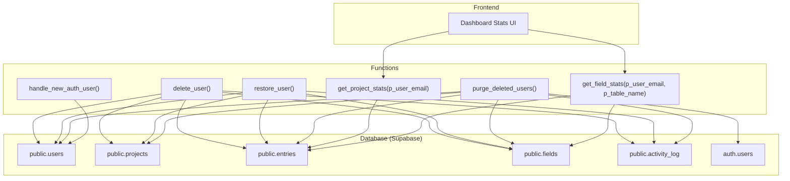
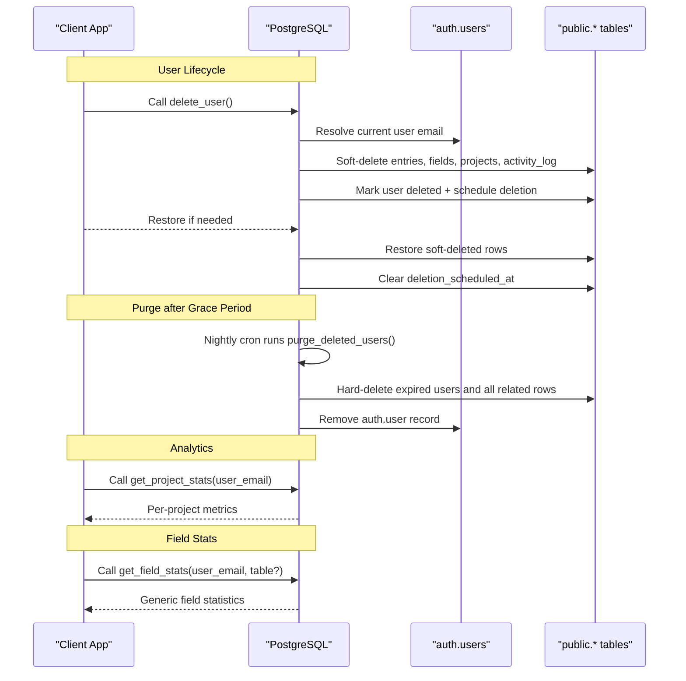
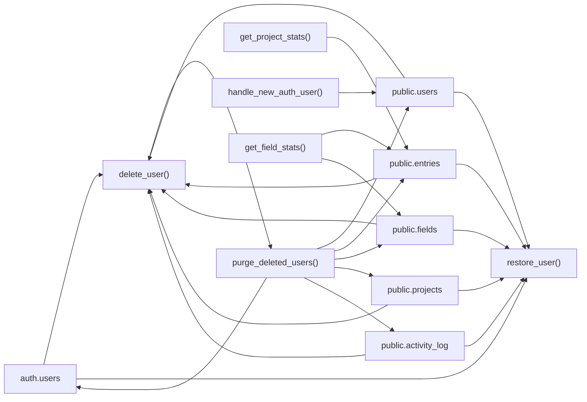

# Stored Procedures and Functions

<cite>
**Referenced Files in This Document**
- [000_baseline_full_schema.sql](file://supabase/migrations/000_baseline_full_schema.sql)
- [002_auto_provision_public_users_for_auth.sql](file://supabase/migrations/002_auto_provision_public_users_for_auth.sql)
- [004_account_deletion_grace_period.sql](file://supabase/migrations/004_account_deletion_grace_period.sql)
- [008_create_field_stats_rpc.sql](file://supabase/migrations/008_create_field_stats_rpc.sql)
- [database.md](file://docs-site/docs/Architecture/database.md)
- [stats.js](file://frontend/src/functions/dashboard/stats.js)
</cite>

## Table of Contents

1. [Introduction](#introduction)
2. [Project Structure](#project-structure)
3. [Core Components](#core-components)
4. [Architecture Overview](#architecture-overview)
5. [Detailed Component Analysis](#detailed-component-analysis)
6. [Dependency Analysis](#dependency-analysis)
7. [Performance Considerations](#performance-considerations)
8. [Troubleshooting Guide](#troubleshooting-guide)
9. [Conclusion](#conclusion)
10. [Appendices](#appendices)

## Introduction

This document provides comprehensive documentation for the stored procedures and functions that power user lifecycle management, project analytics, authentication provisioning, and field-level performance monitoring in the Codacaine database. It focuses on:

- User lifecycle with grace periods: delete_user(), restore_user(), purge_deleted_users()
- Project analytics: get_project_stats()
- Authentication provisioning trigger: handle_new_auth_user()
- Field statistics RPC: get_field_stats()

For each function, we describe parameters, return values, error handling, security model, usage examples, and how they support business logic and data integrity.

## Project Structure

The relevant database logic is defined in Supabase migrations and documented in architecture docs. The frontend consumes these functions via RPCs and renders results using shared stats utilities.

**Diagram sources**

- [000_baseline_full_schema.sql:162-275](file://supabase/migrations/000_baseline_full_schema.sql#L162-L275)
- [002_auto_provision_public_users_for_auth.sql:33-51](file://supabase/migrations/002_auto_provision_public_users_for_auth.sql#L33-L51)
- [004_account_deletion_grace_period.sql:17-109](file://supabase/migrations/004_account_deletion_grace_period.sql#L17-L109)
- [008_create_field_stats_rpc.sql:23-159](file://supabase/migrations/008_create_field_stats_rpc.sql#L23-L159)

**Section sources**

- [000_baseline_full_schema.sql:162-275](file://supabase/migrations/000_baseline_full_schema.sql#L162-L275)
- [002_auto_provision_public_users_for_auth.sql:33-51](file://supabase/migrations/002_auto_provision_public_users_for_auth.sql#L33-L51)
- [004_account_deletion_grace_period.sql:17-109](file://supabase/migrations/004_account_deletion_grace_period.sql#L17-L109)
- [008_create_field_stats_rpc.sql:23-159](file://supabase/migrations/008_create_field_stats_rpc.sql#L23-L159)

## Core Components

- User lifecycle with soft deletes and a 30-day grace period:
  - delete_user(): schedules deletion by soft-deleting related records and marking the user account.
  - restore_user(): cancels scheduled deletion and restores related records.
  - purge_deleted_users(): permanently removes accounts whose grace period has expired.
- Project analytics:
  - get_project_stats(): aggregates per-project entry counts, total duration, and in-progress counts.
- Authentication provisioning:
  - handle_new_auth_user(): ensures every auth.user gets a corresponding public.users row.
- Field statistics:
  - get_field_stats(): computes generic statistics across any owner-defined fields, including totals, groups, time series, and cross-project comparisons.

**Section sources**

- [004_account_deletion_grace_period.sql:17-109](file://supabase/migrations/004_account_deletion_grace_period.sql#L17-L109)
- [000_baseline_full_schema.sql:242-275](file://supabase/migrations/000_baseline_full_schema.sql#L242-L275)
- [002_auto_provision_public_users_for_auth.sql:33-51](file://supabase/migrations/002_auto_provision_public_users_for_auth.sql#L33-L51)
- [008_create_field_stats_rpc.sql:23-159](file://supabase/migrations/008_create_field_stats_rpc.sql#L23-L159)

## Architecture Overview

The system uses PostgreSQL functions with SECURITY DEFINER to enforce consistent permissions and encapsulate business rules. User lifecycle operations are idempotent and rely on soft-delete flags plus a scheduled timestamp to provide a grace period. Analytics and monitoring functions aggregate data efficiently using indexes and SQL-native computations.

**Diagram sources**

- [004_account_deletion_grace_period.sql:17-109](file://supabase/migrations/004_account_deletion_grace_period.sql#L17-L109)
- [000_baseline_full_schema.sql:242-275](file://supabase/migrations/000_baseline_full_schema.sql#L242-L275)
- [008_create_field_stats_rpc.sql:23-159](file://supabase/migrations/008_create_field_stats_rpc.sql#L23-L159)

## Detailed Component Analysis

### delete_user()

Purpose:

- Schedules account deletion with a 30-day grace period by soft-deleting all related data and marking the user account for deletion.

Parameters:

- None (uses authenticated context).

Return value:

- void.

Behavior:

- Resolves the authenticated user’s email from auth.users.
- Soft-deletes entries, fields, projects, and activity_log for that user.
- Inserts or updates the user row to set deleted = true and deletion_scheduled_at = now().

Error handling:

- Raises an exception if the authenticated user cannot be resolved.

Security:

- SECURITY DEFINER ensures consistent privileges when performing cross-table updates.

Usage example:

- Invoke via RPC from the client when a user requests account deletion.

Business impact:

- Enables reversible deletion during the grace period; supports compliance and user experience.

**Section sources**

- [004_account_deletion_grace_period.sql:17-45](file://supabase/migrations/004_account_deletion_grace_period.sql#L17-L45)
- [000_baseline_full_schema.sql:162-188](file://supabase/migrations/000_baseline_full_schema.sql#L162-L188)
- [database.md:262-268](file://docs-site/docs/Architecture/database.md#L262-L268)

### restore_user()

Purpose:

- Cancels a scheduled deletion within the grace period and restores all related data.

Parameters:

- None (uses authenticated context).

Return value:

- void.

Behavior:

- Resolves the authenticated user’s email from auth.users.
- Restores soft-deleted entries, fields, projects, and activity_log by setting deleted = false.
- Clears deletion_scheduled_at and sets deleted = false on the user row.

Error handling:

- Raises an exception if the authenticated user cannot be resolved.

Security:

- SECURITY DEFINER ensures consistent privileges.

Usage example:

- Invoke via RPC when a user changes their mind before the grace period ends.

Business impact:

- Provides a safety net for accidental deletions and improves user confidence.

**Section sources**

- [004_account_deletion_grace_period.sql:47-76](file://supabase/migrations/004_account_deletion_grace_period.sql#L47-L76)
- [000_baseline_full_schema.sql:190-215](file://supabase/migrations/000_baseline_full_schema.sql#L190-L215)
- [database.md:266-268](file://docs-site/docs/Architecture/database.md#L266-L268)

### purge_deleted_users()

Purpose:

- Permanently removes accounts whose 30-day grace period has expired, along with all associated data.

Parameters:

- None (runs as a background job).

Return value:

- void.

Behavior:

- Iterates over users where deleted = true and deletion_scheduled_at is older than 30 days.
- Deletes activity_log, entries, fields, projects, users, and auth.users rows for those emails.

Scheduling:

- Intended to run nightly via pg_cron at midnight UTC.

Security:

- SECURITY DEFINER allows the job to bypass Row Level Security safely.

Usage example:

- Executed automatically by the cron job; no direct client invocation required.

Business impact:

- Ensures data hygiene and compliance by removing stale accounts after the grace period.

**Section sources**

- [004_account_deletion_grace_period.sql:78-109](file://supabase/migrations/004_account_deletion_grace_period.sql#L78-L109)
- [000_baseline_full_schema.sql:217-240](file://supabase/migrations/000_baseline_full_schema.sql#L217-L240)
- [database.md:270-272](file://docs-site/docs/Architecture/database.md#L270-L272)

### get_project_stats(p_user_email TEXT)

Purpose:

- Aggregates per-project metrics for a given user to support analytics dashboards.

Parameters:

- p_user_email: The email of the user whose project stats to compute.

Return values (table):

- project_name: Name of the project.
- entry_count: Number of non-archived, non-deleted entries for the project.
- total_duration: Sum of durations computed as:
  - ended_at - started_at for completed entries
  - now() - started_at for in-progress entries
  - 0 otherwise
- in_progress: Count of entries with started_at set but ended_at null.

Behavior:

- Filters entries by user_email, archived = false, deleted = false.
- Groups by project_name and orders by total_duration descending.

Security:

- SECURITY DEFINER ensures consistent access to aggregated data.

Usage example:

- Call via RPC with the current user’s email to populate the Stats page.

Business impact:

- Provides actionable insights into time spent per project and tracks ongoing work.

**Section sources**

- [000_baseline_full_schema.sql:242-275](file://supabase/migrations/000_baseline_full_schema.sql#L242-L275)
- [database.md:274-276](file://docs-site/docs/Architecture/database.md#L274-L276)

### handle_new_auth_user()

Purpose:

- Automatically provisions a public.users row whenever a new auth.users record is created, ensuring app tables can reference a valid user.

Parameters:

- Triggered on INSERT into auth.users.

Return value:

- NEW (trigger returns the inserted row).

Behavior:

- Inserts the new user’s email into public.users, ignoring conflicts.

Security:

- SECURITY DEFINER ensures the trigger can write to public.users regardless of caller privileges.

Usage example:

- No direct invocation; executed automatically on sign-up.

Business impact:

- Eliminates foreign key constraint errors for OAuth users who skip profile creation flows.

**Section sources**

- [002_auto_provision_public_users_for_auth.sql:33-51](file://supabase/migrations/002_auto_provision_public_users_for_auth.sql#L33-L51)
- [000_baseline_full_schema.sql:279-296](file://supabase/migrations/000_baseline_full_schema.sql#L279-L296)

### get_field_stats(p_user_email TEXT, p_table_name TEXT DEFAULT NULL)

Purpose:

- Computes generic statistics for any owner-defined field(s), enabling flexible performance monitoring and analytics without hard-coding field knowledge.

Parameters:

- p_user_email: The email of the user whose data to analyze.
- p_table_name: Optional filter to restrict analysis to a specific project/table name.

Return values (table):

- field_name: Name of the analyzed field.
- data_type: Declared type from fields table or inferred (number, text, boolean, date).
- entry_count: Total entries considered for this user (and optional table filter).
- filled: Number of entries where the field has a value.
- total: Numeric sum for number-type fields; NULL otherwise.
- groups: JSONB array of [{value, count}] grouped by distinct field values.
- series: JSONB array of [{bucket, value}] daily time series (sums for numbers, counts otherwise).
- by_project: JSONB array of [{key, count, total}] comparing metrics across projects.

Behavior highlights:

- Flattens entries JSONB payloads, excluding internal keys like started_at and description.
- Resolves data types from fields table with inference fallback.
- Computes totals only for numeric-like values.
- Produces daily buckets for plotting over time.
- Compares metrics across projects for visualization.

Security:

- SECURITY DEFINER ensures consistent read access to user-scoped data.

Usage example:

- Call via RPC to render field-level insights in the dashboard, optionally scoped to a project.

Business impact:

- Supports extensible analytics for custom fields without code changes, improving observability and decision-making.

**Section sources**

- [008_create_field_stats_rpc.sql:23-159](file://supabase/migrations/008_create_field_stats_rpc.sql#L23-L159)
- [database.md:278-291](file://docs-site/docs/Architecture/database.md#L278-L291)

## Dependency Analysis

- User lifecycle functions depend on:
  - auth.users for resolving the current user.
  - public.users, public.entries, public.fields, public.projects, public.activity_log for soft/hard deletes.
- get_project_stats depends on:
  - public.entries filtered by user, archive, and delete flags.
- handle_new_auth_user depends on:
  - auth.users insert events and writes to public.users.
- get_field_stats depends on:
  - public.entries (JSONB payloads) and public.fields (type definitions).

**Diagram sources**

- [004_account_deletion_grace_period.sql:17-109](file://supabase/migrations/004_account_deletion_grace_period.sql#L17-L109)
- [000_baseline_full_schema.sql:242-275](file://supabase/migrations/000_baseline_full_schema.sql#L242-L275)
- [002_auto_provision_public_users_for_auth.sql:33-51](file://supabase/migrations/002_auto_provision_public_users_for_auth.sql#L33-L51)
- [008_create_field_stats_rpc.sql:23-159](file://supabase/migrations/008_create_field_stats_rpc.sql#L23-L159)

**Section sources**

- [004_account_deletion_grace_period.sql:17-109](file://supabase/migrations/004_account_deletion_grace_period.sql#L17-L109)
- [000_baseline_full_schema.sql:242-275](file://supabase/migrations/000_baseline_full_schema.sql#L242-L275)
- [002_auto_provision_public_users_for_auth.sql:33-51](file://supabase/migrations/002_auto_provision_public_users_for_auth.sql#L33-L51)
- [008_create_field_stats_rpc.sql:23-159](file://supabase/migrations/008_create_field_stats_rpc.sql#L23-L159)

## Performance Considerations

- Indexes:
  - Entries and projects have indexes on user_email, project_name, due_date, and archived flags to speed up filtering and grouping.
- Aggregation efficiency:
  - get_project_stats uses GROUP BY and conditional sums to minimize client-side processing.
  - get_field_stats flattens JSONB once and computes multiple views (groups, series, by_project) in a single pass.
- Time-series computation:
  - Daily bucketing uses date_trunc('day', ...) for efficient grouping.
- Soft deletes:
  - Filtering on deleted and archived flags avoids scanning purged data.

[No sources needed since this section provides general guidance]

## Troubleshooting Guide

Common issues and resolutions:

- Authenticated user not found:
  - Occurs in delete_user() and restore_user() when auth.uid() does not resolve to a known user. Ensure the client is properly authenticated and the session is valid.
- Foreign key violations on projects:
  - If public.users rows are missing for auth.users, inserts into projects may fail. Ensure handle_new_auth_user() trigger is active and backfills are applied.
- Cron job not running:
  - purge_deleted_users() relies on pg_cron being enabled. Verify extension availability and job scheduling.
- Unexpected empty stats:
  - For get_field_stats(), ensure entries JSONB contains expected fields and that fields table definitions exist or values allow inference. Check reserved keys (started_at, description) are excluded intentionally.

**Section sources**

- [004_account_deletion_grace_period.sql:17-109](file://supabase/migrations/004_account_deletion_grace_period.sql#L17-L109)
- [002_auto_provision_public_users_for_auth.sql:33-51](file://supabase/migrations/002_auto_provision_public_users_for_auth.sql#L33-L51)
- [008_create_field_stats_rpc.sql:23-159](file://supabase/migrations/008_create_field_stats_rpc.sql#L23-L159)

## Conclusion

These stored procedures and functions implement robust user lifecycle management with grace periods, accurate project analytics, automatic user provisioning, and flexible field-level statistics. They enforce data integrity through soft deletes, scheduled purges, and secure execution contexts, while providing efficient aggregation for dashboards and monitoring.

[No sources needed since this section summarizes without analyzing specific files]

## Appendices

### Usage Examples

- Schedule deletion:
  - Call delete_user() from the client after confirming user intent.
- Restore account:
  - Call restore_user() within 30 days to cancel deletion.
- View project stats:
  - Call get_project_stats(current_user_email) to retrieve per-project metrics.
- Monitor field performance:
  - Call get_field_stats(current_user_email, optional_project_name) to obtain generic field statistics for dashboards.

[No sources needed since this section provides general guidance]
