# CI/CD Pipelines

<cite>
**Referenced Files in This Document**
- [frontend-unit-tests.yml](file://.github/workflows/frontend-unit-tests.yml)
- [backend-unit-tests.yml](file://.github/workflows/backend-unit-tests.yml)
- [frontend-integration-tests.yml](file://.github/workflows/frontend-integration-tests.yml)
- [backend-integration-tests.yml](file://.github/workflows/backend-integration-tests.yml)
- [ci.yml](file://.gitea/workflows/ci.yml)
- [frontend-unit-tests.yml](file://.gitea/workflows/frontend-unit-tests.yml)
- [backend-unit-tests.yml](file://.gitea/workflows/backend-unit-tests.yml)
- [frontend-integration-tests.yml](file://.gitea/workflows/frontend-integration-tests.yml)
- [backend-integration-tests.yml](file://.gitea/workflows/backend-integration-tests.yml)
- [keep-alive.yml](file://.github/workflows/keep-alive.yml)
- [sync-test-branch.yml](file://.github/workflows/sync-test-branch.yml)
- [docs.yml](file://.github/workflows/docs.yml)
- [package.json](file://frontend/package.json)
- [vitest.config.ts](file://frontend/vitest.config.ts)
</cite>

## Table of Contents

1. Introduction
2. Project Structure
3. Core Components
4. Architecture Overview
5. Detailed Component Analysis
6. Dependency Analysis
7. Performance Considerations
8. Troubleshooting Guide
9. Conclusion

## Introduction

This document explains the Codacaine application’s continuous integration and delivery pipelines across GitHub Actions and Gitea Workflows. It covers automated testing (unit and integration), building, artifact management, triggers, job dependencies, deployment strategies, and operational maintenance tasks such as keeping services alive. It also provides guidance for local CI configuration, debugging failing pipelines, optimizing build performance, and integrating security scanning and code quality checks.

## Project Structure

Codacaine uses a multi-service backend and a single frontend with separate test suites:

- Frontend tests run via Vitest with JUnit output for reporting and artifacts.
- Backend services each have their own Jest-based unit and integration tests.
- GitHub Actions workflows provide parallelized matrix jobs per service and dedicated workflows for docs and keep-alive tasks.
- Gitea workflows mirror core CI steps for alternative CI environments.

```mermaid
graph TB
subgraph "GitHub Actions"
GH_FUT["Frontend Unit Tests"]
GH_BUT["Backend Unit Tests (matrix)"]
GH_FIT["Frontend Integration Tests"]
GH_BIT["Backend Integration Tests (matrix)"]
GH_DOCS["Deploy Docs"]
GH_KEEP["Keep Render Alive"]
GH_SYNC["Sync main to hlulani"]
end
subgraph "Gitea Workflows"
GT_CI["CI Pipeline"]
GT_FUT["Frontend Unit Tests"]
GT_BUT["Backend Unit Tests (matrix)"]
GT_FIT["Frontend Integration Tests"]
GT_BIT["Backend Integration Tests (matrix)"]
end
GH_FUT --> |JUnit XML| ART1["Artifacts: frontend-unit-test-results"]
GH_BUT --> |JUnit XML| ART2["Artifacts: *-unit-test-results"]
GH_FIT --> |JUnit XML| ART3["Artifacts: frontend-integration-test-results"]
GH_BIT --> |JUnit XML| ART4["Artifacts: *-integration-test-results"]
GH_DOCS --> Pages["GitHub Pages"]
GH_KEEP --> Render["Render Health Endpoint"]
GH_SYNC --> Branch["hlulani branch"]
GT_CI --> Build["Build & Test (Frontend + Services)"]
GT_FUT --> Build
GT_BUT --> Build
GT_FIT --> Build
GT_BIT --> Build
```

**Diagram sources**

- [frontend-unit-tests.yml:1-58](file://.github/workflows/frontend-unit-tests.yml#L1-L58)
- [backend-unit-tests.yml:1-68](file://.github/workflows/backend-unit-tests.yml#L1-L68)
- [frontend-integration-tests.yml:1-58](file://.github/workflows/frontend-integration-tests.yml#L1-L58)
- [backend-integration-tests.yml:1-68](file://.github/workflows/backend-integration-tests.yml#L1-L68)
- [docs.yml:1-31](file://.github/workflows/docs.yml#L1-L31)
- [keep-alive.yml:1-46](file://.github/workflows/keep-alive.yml#L1-L46)
- [sync-test-branch.yml:1-24](file://.github/workflows/sync-test-branch.yml#L1-L24)
- [ci.yml:1-72](file://.gitea/workflows/ci.yml#L1-L72)
- [frontend-unit-tests.yml:1-34](file://.gitea/workflows/frontend-unit-tests.yml#L1-L34)
- [backend-unit-tests.yml:1-43](file://.gitea/workflows/backend-unit-tests.yml#L1-L43)
- [frontend-integration-tests.yml:1-34](file://.gitea/workflows/frontend-integration-tests.yml#L1-L34)
- [backend-integration-tests.yml:1-43](file://.gitea/workflows/backend-integration-tests.yml#L1-L43)

**Section sources**

- [frontend-unit-tests.yml:1-58](file://.github/workflows/frontend-unit-tests.yml#L1-L58)
- [backend-unit-tests.yml:1-68](file://.github/workflows/backend-unit-tests.yml#L1-L68)
- [frontend-integration-tests.yml:1-58](file://.github/workflows/frontend-integration-tests.yml#L1-L58)
- [backend-integration-tests.yml:1-68](file://.github/workflows/backend-integration-tests.yml#L1-L68)
- [ci.yml:1-72](file://.gitea/workflows/ci.yml#L1-L72)
- [docs.yml:1-31](file://.github/workflows/docs.yml#L1-L31)
- [keep-alive.yml:1-46](file://.github/workflows/keep-alive.yml#L1-L46)
- [sync-test-branch.yml:1-24](file://.github/workflows/sync-test-branch.yml#L1-L24)

## Core Components

- Frontend unit tests: Run Vitest excluding integration tests; produce JUnit XML and upload artifacts.
- Backend unit tests: Matrix strategy runs per service; excludes integration patterns; produces JUnit XML and uploads artifacts.
- Frontend integration tests: Run Vitest against integration test directory; produce JUnit XML and upload artifacts.
- Backend integration tests: Matrix strategy runs per service; includes only integration patterns; produces JUnit XML and uploads artifacts.
- Documentation deployment: Builds and deploys docs-site to GitHub Pages on pushes to main affecting docs-site paths.
- Keep-alive: Periodically pings Render health endpoint to prevent cold starts; supports manual dispatch.
- Branch sync: Merges main into hlulani automatically on push to main.

Key behaviors:

- Triggers: Push to main and hlulani; pull requests to main (and sometimes hlulani depending on workflow).
- Caching: npm dependency cache enabled per working directory using package-lock.json.
- Reporting: dorny/test-reporter publishes results; artifacts retained for 30 days.
- Permissions: Minimal required permissions (contents read; checks and PRs write where needed).

**Section sources**

- [frontend-unit-tests.yml:1-58](file://.github/workflows/frontend-unit-tests.yml#L1-L58)
- [backend-unit-tests.yml:1-68](file://.github/workflows/backend-unit-tests.yml#L1-L68)
- [frontend-integration-tests.yml:1-58](file://.github/workflows/frontend-integration-tests.yml#L1-L58)
- [backend-integration-tests.yml:1-68](file://.github/workflows/backend-integration-tests.yml#L1-L68)
- [docs.yml:1-31](file://.github/workflows/docs.yml#L1-L31)
- [keep-alive.yml:1-46](file://.github/workflows/keep-alive.yml#L1-L46)
- [sync-test-branch.yml:1-24](file://.github/workflows/sync-test-branch.yml#L1-L24)

## Architecture Overview

The CI architecture separates concerns by test type and component, enabling fast feedback and isolation:

- Frontend and backend tests run in parallel across multiple jobs.
- Matrix strategy ensures all backend services are tested independently.
- Artifacts and test reports are published for traceability.
- Optional workflows handle documentation publishing and environment keep-alive.

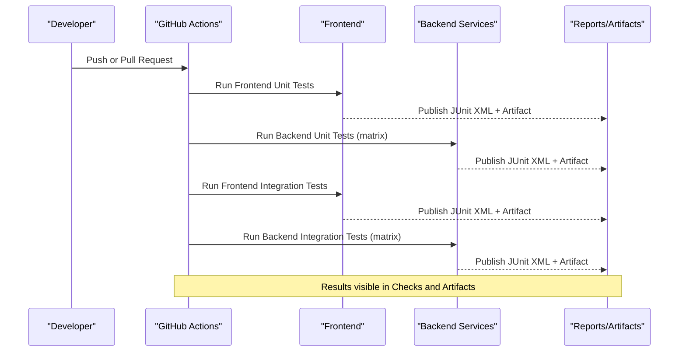

**Diagram sources**

- [frontend-unit-tests.yml:1-58](file://.github/workflows/frontend-unit-tests.yml#L1-L58)
- [backend-unit-tests.yml:1-68](file://.github/workflows/backend-unit-tests.yml#L1-L68)
- [frontend-integration-tests.yml:1-58](file://.github/workflows/frontend-integration-tests.yml#L1-L58)
- [backend-integration-tests.yml:1-68](file://.github/workflows/backend-integration-tests.yml#L1-L68)

## Detailed Component Analysis

### Frontend Unit Tests (GitHub Actions)

- Triggered on push to main/hlulani and pull requests to those branches.
- Uses Node.js 20 with npm cache keyed by frontend/package-lock.json.
- Runs Vitest excluding integration tests; outputs JUnit XML and uploads artifacts.
- Publishes test results via dorny/test-reporter.

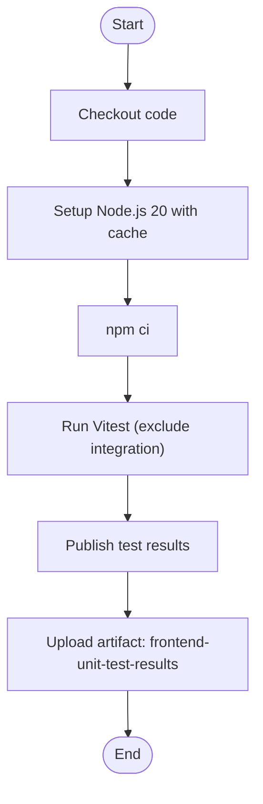

**Diagram sources**

- [frontend-unit-tests.yml:1-58](file://.github/workflows/frontend-unit-tests.yml#L1-L58)

**Section sources**

- [frontend-unit-tests.yml:1-58](file://.github/workflows/frontend-unit-tests.yml#L1-L58)
- [package.json:scripts](file://frontend/package.json)
- [vitest.config.ts:config](file://frontend/vitest.config.ts)

### Backend Unit Tests (GitHub Actions)

- Matrix strategy runs per service: auth-service, dashboard-service, profile-service, project-service.
- Each job sets working-directory to services/<service>, installs deps, and runs Jest excluding integration tests.
- Produces JUnit XML and uploads per-service artifacts.

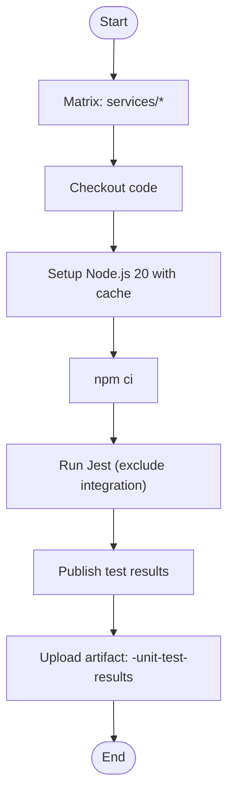

**Diagram sources**

- [backend-unit-tests.yml:1-68](file://.github/workflows/backend-unit-tests.yml#L1-L68)

**Section sources**

- [backend-unit-tests.yml:1-68](file://.github/workflows/backend-unit-tests.yml#L1-L68)

### Frontend Integration Tests (GitHub Actions)

- Runs Vitest specifically against src/**integration**/.
- Outputs JUnit XML and uploads artifacts for later review.

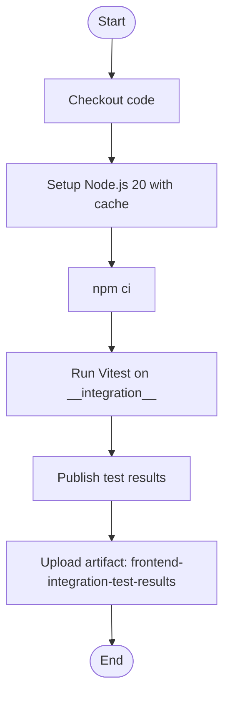

**Diagram sources**

- [frontend-integration-tests.yml:1-58](file://.github/workflows/frontend-integration-tests.yml#L1-L58)

**Section sources**

- [frontend-integration-tests.yml:1-58](file://.github/workflows/frontend-integration-tests.yml#L1-L58)

### Backend Integration Tests (GitHub Actions)

- Matrix strategy runs per service with Jest including only integration tests.
- Produces JUnit XML and uploads per-service artifacts.

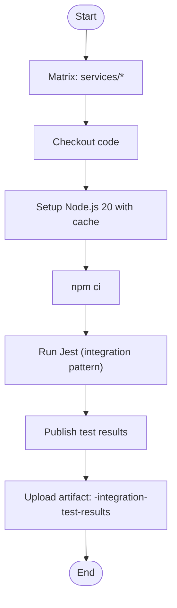

**Diagram sources**

- [backend-integration-tests.yml:1-68](file://.github/workflows/backend-integration-tests.yml#L1-L68)

**Section sources**

- [backend-integration-tests.yml:1-68](file://.github/workflows/backend-integration-tests.yml#L1-L68)

### Documentation Deployment (GitHub Actions)

- Deploys docs-site to GitHub Pages when files under docs-site change on main.
- Uses Python 3.11 and mkdocs gh-deploy.

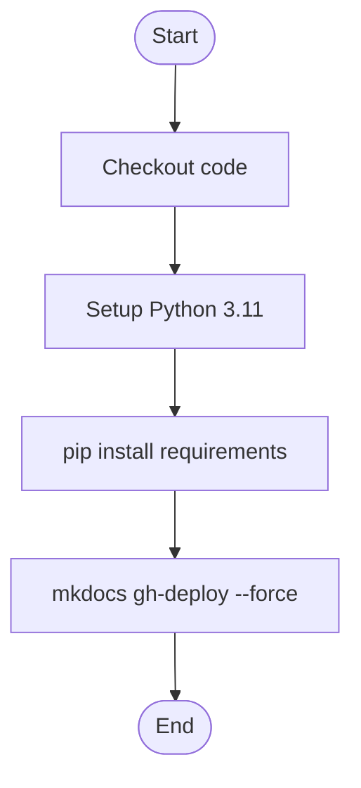

**Diagram sources**

- [docs.yml:1-31](file://.github/workflows/docs.yml#L1-L31)

**Section sources**

- [docs.yml:1-31](file://.github/workflows/docs.yml#L1-L31)

### Keep-Alive Workflow (GitHub Actions)

- Schedules every 15 minutes to ping Render health endpoint with retries.
- Skips if RENDER_URL secret is missing; logs warnings on failures.

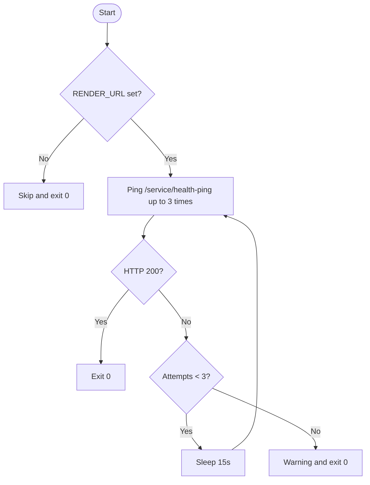

**Diagram sources**

- [keep-alive.yml:1-46](file://.github/workflows/keep-alive.yml#L1-L46)

**Section sources**

- [keep-alive.yml:1-46](file://.github/workflows/keep-alive.yml#L1-L46)

### Branch Sync Workflow (GitHub Actions)

- On push to main, merges main into hlulani branch automatically.

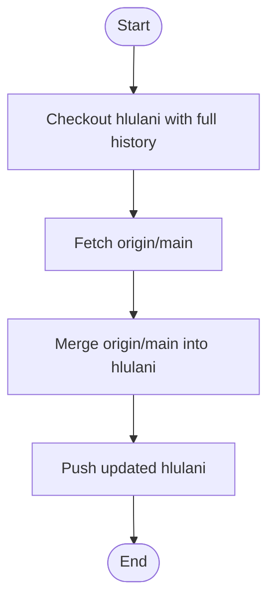

**Diagram sources**

- [sync-test-branch.yml:1-24](file://.github/workflows/sync-test-branch.yml#L1-L24)

**Section sources**

- [sync-test-branch.yml:1-24](file://.github/workflows/sync-test-branch.yml#L1-L24)

### Gitea Workflows (Alternative CI)

- CI pipeline performs formatting check, linting, testing, and building for frontend and all backend services sequentially.
- Separate workflows mirror unit and integration tests for both frontend and backend, without artifact/report publishing.

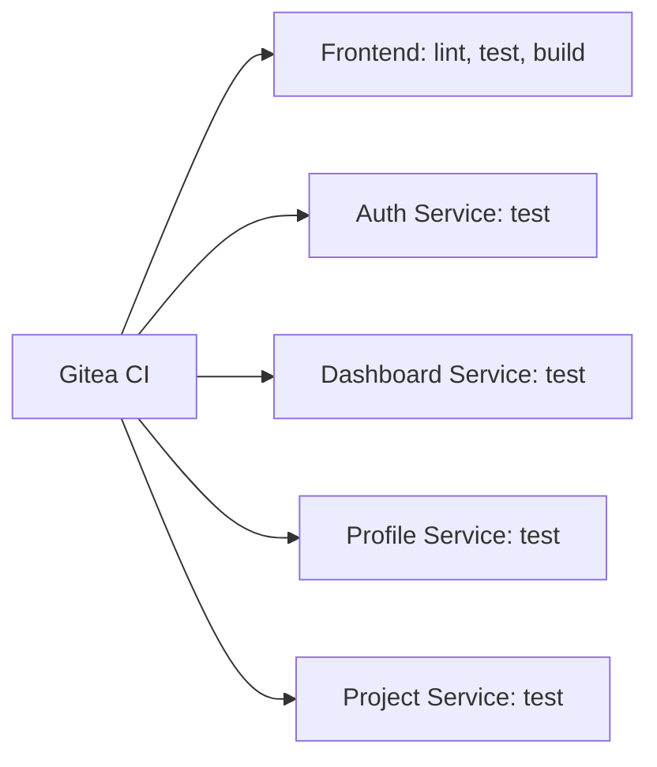

**Diagram sources**

- [ci.yml:1-72](file://.gitea/workflows/ci.yml#L1-L72)
- [frontend-unit-tests.yml:1-34](file://.gitea/workflows/frontend-unit-tests.yml#L1-L34)
- [backend-unit-tests.yml:1-43](file://.gitea/workflows/backend-unit-tests.yml#L1-L43)
- [frontend-integration-tests.yml:1-34](file://.gitea/workflows/frontend-integration-tests.yml#L1-L34)
- [backend-integration-tests.yml:1-43](file://.gitea/workflows/backend-integration-tests.yml#L1-L43)

**Section sources**

- [ci.yml:1-72](file://.gitea/workflows/ci.yml#L1-L72)
- [frontend-unit-tests.yml:1-34](file://.gitea/workflows/frontend-unit-tests.yml#L1-L34)
- [backend-unit-tests.yml:1-43](file://.gitea/workflows/backend-unit-tests.yml#L1-L43)
- [frontend-integration-tests.yml:1-34](file://.gitea/workflows/frontend-integration-tests.yml#L1-L34)
- [backend-integration-tests.yml:1-43](file://.gitea/workflows/backend-integration-tests.yml#L1-L43)

## Dependency Analysis

- Job independence: All test workflows run in parallel; no explicit job-to-job dependencies exist between test suites.
- Matrix usage: Backend workflows use a matrix to run tests concurrently per service.
- Artifact retention: Test result artifacts are retained for 30 days for auditability.
- External integrations:
  - GitHub Pages for docs deployment.
  - Render health endpoint for keep-alive.
  - Secrets: RENDER_URL must be configured for keep-alive to function.

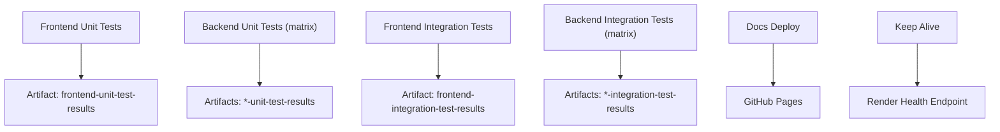

**Diagram sources**

- [frontend-unit-tests.yml:1-58](file://.github/workflows/frontend-unit-tests.yml#L1-L58)
- [backend-unit-tests.yml:1-68](file://.github/workflows/backend-unit-tests.yml#L1-L68)
- [frontend-integration-tests.yml:1-58](file://.github/workflows/frontend-integration-tests.yml#L1-L58)
- [backend-integration-tests.yml:1-68](file://.github/workflows/backend-integration-tests.yml#L1-L68)
- [docs.yml:1-31](file://.github/workflows/docs.yml#L1-L31)
- [keep-alive.yml:1-46](file://.github/workflows/keep-alive.yml#L1-L46)

**Section sources**

- [frontend-unit-tests.yml:1-58](file://.github/workflows/frontend-unit-tests.yml#L1-L58)
- [backend-unit-tests.yml:1-68](file://.github/workflows/backend-unit-tests.yml#L1-L68)
- [frontend-integration-tests.yml:1-58](file://.github/workflows/frontend-integration-tests.yml#L1-L58)
- [backend-integration-tests.yml:1-68](file://.github/workflows/backend-integration-tests.yml#L1-L68)
- [docs.yml:1-31](file://.github/workflows/docs.yml#L1-L31)
- [keep-alive.yml:1-46](file://.github/workflows/keep-alive.yml#L1-L46)

## Performance Considerations

- Use npm caching keyed by package-lock.json to speed up dependency installation across jobs.
- Prefer matrix strategies for backend services to parallelize workloads.
- Exclude integration tests from unit test jobs to reduce runtime.
- Limit artifact retention to necessary durations (currently 30 days) to manage storage.
- For local CI parity, ensure Node.js version matches workflows (Node 20) and use npm ci for deterministic installs.

[No sources needed since this section provides general guidance]

## Troubleshooting Guide

Common issues and resolutions:

- Missing secrets: The keep-alive workflow skips if RENDER_URL is not set; configure it in repository secrets.
- Slow installs: Ensure npm cache is enabled and package-lock.json is present; verify cache keys match workflow definitions.
- Flaky integration tests: Increase timeouts or isolate network-dependent tests; consider retry logic or mocking external services.
- Test report visibility: Confirm JUnit XML generation paths and that dorny/test-reporter is invoked; verify artifact uploads succeed.
- Docs deployment failures: Validate Python environment and mkdocs configuration; ensure docs-site changes trigger the workflow.

Operational tips:

- Use workflow_dispatch to manually run keep-alive or other workflows for debugging.
- Inspect artifacts for detailed test output when checks pass but results are unclear.
- Pin Node.js versions and tool versions to avoid drift between local and CI environments.

**Section sources**

- [keep-alive.yml:1-46](file://.github/workflows/keep-alive.yml#L1-L46)
- [frontend-unit-tests.yml:1-58](file://.github/workflows/frontend-unit-tests.yml#L1-L58)
- [backend-unit-tests.yml:1-68](file://.github/workflows/backend-unit-tests.yml#L1-L68)
- [frontend-integration-tests.yml:1-58](file://.github/workflows/frontend-integration-tests.yml#L1-L58)
- [backend-integration-tests.yml:1-68](file://.github/workflows/backend-integration-tests.yml#L1-L68)
- [docs.yml:1-31](file://.github/workflows/docs.yml#L1-L31)

## Conclusion

Codacaine’s CI/CD setup provides robust, parallelized testing for both frontend and backend services, with clear reporting and artifact retention. GitHub Actions workflows cover unit and integration tests, documentation deployment, and environment keep-alive, while Gitea workflows offer an alternative CI path. By following the recommended practices—caching, matrix strategies, and isolated test suites—you can maintain fast feedback loops and reliable builds. Security scanning and additional code quality gates can be added incrementally to further strengthen the pipeline.

[No sources needed since this section summarizes without analyzing specific files]
