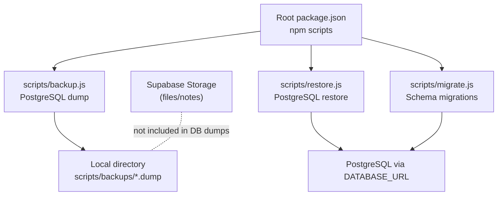
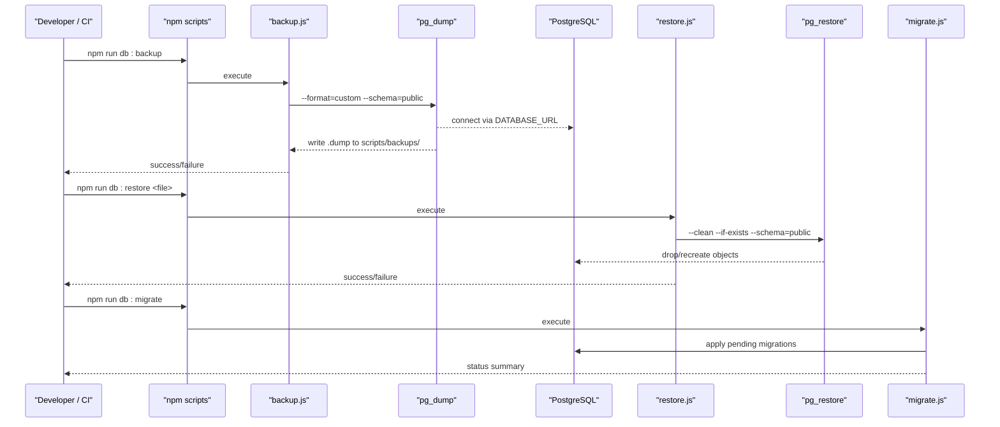
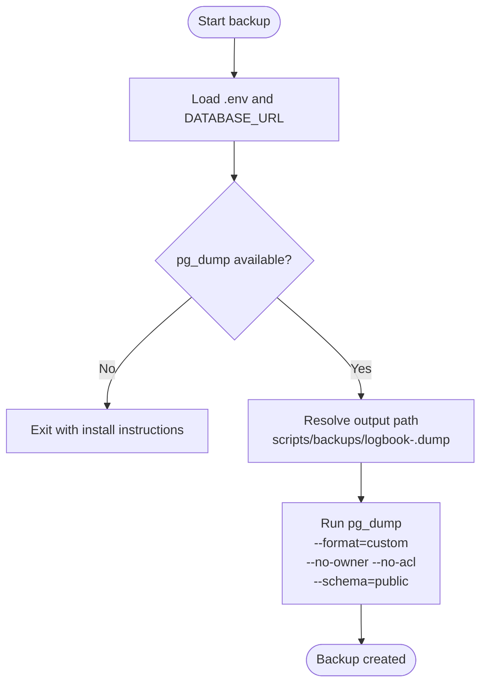
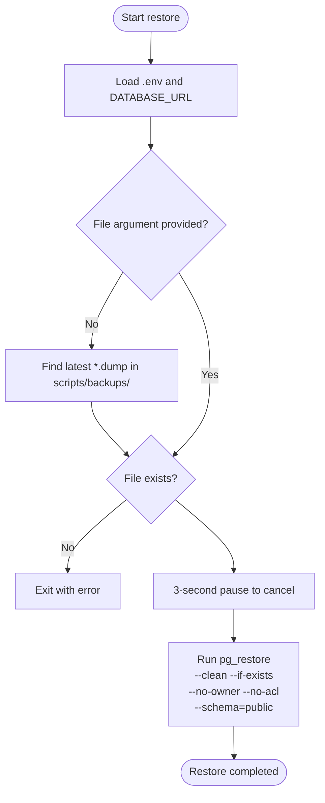
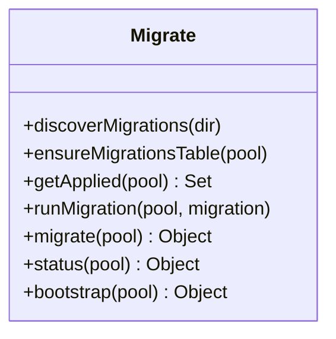
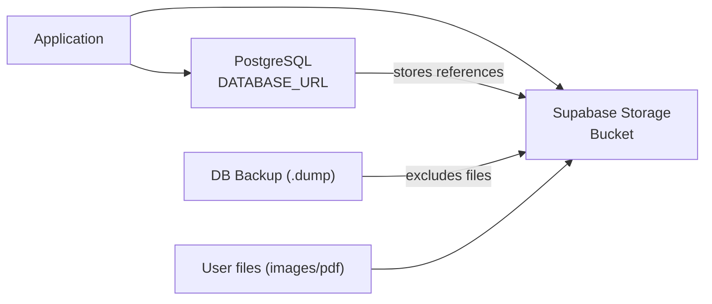
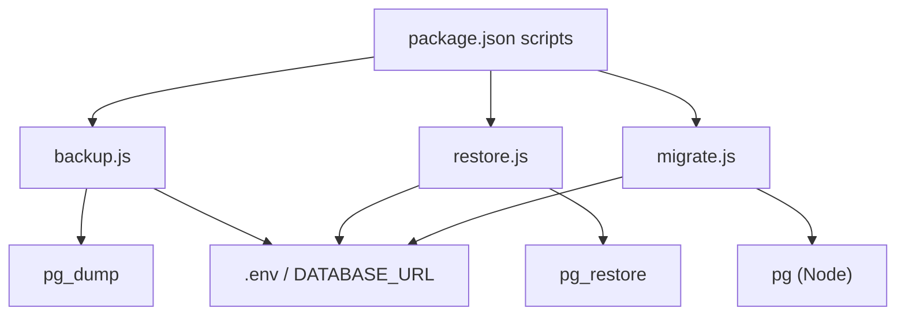

# Database Backup and Recovery

<cite>
**Referenced Files in This Document**
- [backup.js](file://scripts/backup.js)
- [restore.js](file://scripts/restore.js)
- [migrate.js](file://scripts/migrate.js)
- [package.json](file://package.json)
- [backups/.gitignore](file://scripts/backups/.gitignore)
- [store.js](file://services/project-service/src/functions/notes/store.js)
- [setup.sql](file://supabase/setup.sql)
</cite>

## Table of Contents

1. [Introduction](#introduction)
2. [Project Structure](#project-structure)
3. [Core Components](#core-components)
4. [Architecture Overview](#architecture-overview)
5. [Detailed Component Analysis](#detailed-component-analysis)
6. [Dependency Analysis](#dependency-analysis)
7. [Performance Considerations](#performance-considerations)
8. [Troubleshooting Guide](#troubleshooting-guide)
9. [Conclusion](#conclusion)
10. [Appendices](#appendices)

## Introduction

This document describes the Codacaine application’s database backup and recovery procedures, focusing on automated PostgreSQL backups, restore workflows, migration management, and disaster recovery practices. It also covers Supabase data considerations (database schema and storage), scheduling and retention guidance, encryption at rest recommendations, testing restoration, monitoring, and troubleshooting common issues.

## Project Structure

The backup and recovery tooling is implemented as Node scripts under scripts/, with npm convenience commands defined in the root package.json. Backups are stored locally under scripts/backups/ by default. The application uses a PostgreSQL-compatible database (via DATABASE_URL) and Supabase for authentication and optional file storage.

**Diagram sources**

- [package.json:10-14](file://package.json#L10-L14)
- [backup.js:52-99](file://scripts/backup.js#L52-L99)
- [restore.js:43-130](file://scripts/restore.js#L43-L130)
- [migrate.js:24-244](file://scripts/migrate.js#L24-L244)

**Section sources**

- [package.json:10-14](file://package.json#L10-L14)
- [backup.js:52-99](file://scripts/backup.js#L52-L99)
- [restore.js:43-130](file://scripts/restore.js#L43-L130)
- [migrate.js:24-244](file://scripts/migrate.js#L24-L244)

## Core Components

- Automated PostgreSQL backup using pg_dump to create compressed custom-format dumps into scripts/backups/.
- Automated PostgreSQL restore using pg_restore with safe flags and a brief confirmation pause.
- Versioned schema migrations executed against the same DATABASE_URL, with status and bootstrap helpers.
- Supabase storage integration for files (e.g., notes images/PDFs) that are not part of the database dump.

Key responsibilities:

- backup.js: Validates environment, ensures pg_dump availability, creates timestamped .dump files.
- restore.js: Locates latest or specified .dump, validates pg_restore, restores public schema only.
- migrate.js: Discovers SQL migrations, tracks applied versions, runs in transactions, supports status/bootstrap.

**Section sources**

- [backup.js:22-99](file://scripts/backup.js#L22-L99)
- [restore.js:20-130](file://scripts/restore.js#L20-L130)
- [migrate.js:26-196](file://scripts/migrate.js#L26-L196)

## Architecture Overview

The system orchestrates three primary operations:

- Backup: Exports the application schema and data from the public schema to a local .dump file.
- Restore: Re-imports a .dump into the target database, cleaning existing objects before recreation.
- Migrate: Applies pending SQL migrations in order, tracking them in a schema_migrations table.

**Diagram sources**

- [package.json:10-14](file://package.json#L10-L14)
- [backup.js:64-99](file://scripts/backup.js#L64-L99)
- [restore.js:86-130](file://scripts/restore.js#L86-L130)
- [migrate.js:101-136](file://scripts/migrate.js#L101-L136)

## Detailed Component Analysis

### Backup Process (backup.js)

- Loads environment variables from multiple locations to obtain DATABASE_URL.
- Ensures pg_dump client tools are installed and available.
- Creates a timestamped .dump file under scripts/backups/ if no path is provided.
- Uses custom format, skips ownership and ACLs, and restricts to the public schema.

**Diagram sources**

- [backup.js:22-99](file://scripts/backup.js#L22-L99)

**Section sources**

- [backup.js:22-99](file://scripts/backup.js#L22-L99)

### Restore Process (restore.js)

- Reads DATABASE_URL from environment.
- If no file argument is given, selects the most recent .dump in scripts/backups/.
- Waits briefly to allow cancellation due to destructive nature.
- Runs pg_restore with clean and safe flags, targeting only the public schema.

**Diagram sources**

- [restore.js:20-130](file://scripts/restore.js#L20-L130)

**Section sources**

- [restore.js:20-130](file://scripts/restore.js#L20-L130)

### Migration Management (migrate.js)

- Discovers versioned SQL migrations from supabase/migrations.
- Tracks applied migrations in a schema_migrations table with checksums.
- Supports commands:
  - migrate: Apply all pending migrations in transactional batches.
  - status: Show applied vs pending migrations.
  - bootstrap: Mark existing migrations as applied without running them.

**Diagram sources**

- [migrate.js:26-196](file://scripts/migrate.js#L26-L196)

**Section sources**

- [migrate.js:26-196](file://scripts/migrate.js#L26-L196)

### File Storage Considerations (Supabase)

- Notes and other user files are stored in Supabase Storage, not in the PostgreSQL dump.
- The store function uploads files to a bucket and records public URLs in the database.
- Disaster recovery must include both database dumps and object storage exports.

**Diagram sources**

- [store.js:1-108](file://services/project-service/src/functions/notes/store.js#L1-L108)

**Section sources**

- [store.js:1-108](file://services/project-service/src/functions/notes/store.js#L1-L108)

## Dependency Analysis

- Scripts depend on:
  - PostgreSQL client tools (pg_dump, pg_restore).
  - Node packages dotenv and pg (for migrations).
  - Environment variable DATABASE_URL.
- NPM scripts provide convenient entry points for backup, restore, and migration tasks.

**Diagram sources**

- [package.json:10-14](file://package.json#L10-L14)
- [backup.js:64-99](file://scripts/backup.js#L64-L99)
- [restore.js:86-130](file://scripts/restore.js#L86-L130)
- [migrate.js:219-244](file://scripts/migrate.js#L219-L244)

**Section sources**

- [package.json:10-14](file://package.json#L10-L14)
- [backup.js:64-99](file://scripts/backup.js#L64-L99)
- [restore.js:86-130](file://scripts/restore.js#L86-L130)
- [migrate.js:219-244](file://scripts/migrate.js#L219-L244)

## Performance Considerations

- Use custom-format dumps for compression and selective restore capabilities.
- Restrict to public schema to reduce size and avoid internal Supabase objects.
- Schedule backups during low-traffic windows to minimize impact.
- For large databases, consider incremental strategies or logical replication where appropriate.

[No sources needed since this section provides general guidance]

## Troubleshooting Guide

Common issues and resolutions:

- Missing DATABASE_URL: Ensure .env files are present and contain DATABASE_URL; scripts load from multiple paths.
- pg_dump/pg_restore not found: Install PostgreSQL client tools per OS instructions printed by the scripts.
- No .dump files found: Create a backup first or specify an explicit file path when restoring.
- Restore warnings: Non-fatal warnings may occur; the script continues unless actual errors are detected.
- Migration failures: Each migration runs in a transaction; fix the failing SQL and re-run.

Operational tips:

- Verify connectivity to the database before running backup/restore/migrate.
- Confirm that scripts/backups/ is writable and not ignored by version control.
- After restore, run migrations to ensure schema consistency.

**Section sources**

- [backup.js:45-76](file://scripts/backup.js#L45-L76)
- [restore.js:36-77](file://scripts/restore.js#L36-L77)
- [restore.js:117-130](file://scripts/restore.js#L117-L130)
- [migrate.js:120-136](file://scripts/migrate.js#L120-L136)

## Conclusion

Codacaine provides robust, script-driven backup and restore for its PostgreSQL database, along with versioned migrations and clear operational safeguards. To achieve full disaster recovery, combine database dumps with Supabase storage exports, implement secure offsite storage, schedule regular backups, and test restoration regularly.

[No sources needed since this section summarizes without analyzing specific files]

## Appendices

### Scheduling and Retention

- Schedule periodic backups using your platform’s scheduler (cron, GitHub Actions, Render cron, etc.) to run npm run db:backup.
- Define retention policies to rotate old .dump files (e.g., keep daily backups for 7 days, weekly for 4 weeks).
- Exclude *.dump from version control to prevent accidental commits.

**Section sources**

- [package.json:13-14](file://package.json#L13-L14)
- [backups/.gitignore:1-2](file://scripts/backups/.gitignore#L1-L2)

### Encryption at Rest and Secure Storage

- Encrypt backup files at rest using your OS or storage provider’s encryption features.
- Store backups in a secure, access-controlled location (encrypted volume, private cloud storage with strict IAM).
- Protect DATABASE_URL and any service keys in secret management systems.

[No sources needed since this section provides general guidance]

### Testing Restoration

- Periodically restore backups to a staging environment to validate integrity.
- After restore, run migrations to align schema state.
- Validate key tables and counts post-restore to confirm completeness.

**Section sources**

- [restore.js:117-130](file://scripts/restore.js#L117-L130)
- [migrate.js:101-136](file://scripts/migrate.js#L101-L136)

### Monitoring Backup Jobs

- Capture exit codes and logs from backup/restore/migrate jobs.
- Alert on failures and missing artifacts (e.g., no .dump generated).
- Track durations and sizes to detect anomalies.

[No sources needed since this section provides general guidance]

### Data Integrity Verification

- Compare row counts or checksums between source and restored databases.
- Spot-check critical entities and relationships after restore.
- Use migration status to ensure schema alignment post-restore.

**Section sources**

- [migrate.js:141-160](file://scripts/migrate.js#L141-L160)

### Supabase Setup Notes

- The setup script provisions functions and schedules relevant to account lifecycle and statistics. These are part of the database layer and will be included in database dumps when applicable.

**Section sources**

- [setup.sql:1-363](file://supabase/setup.sql#L1-L363)
