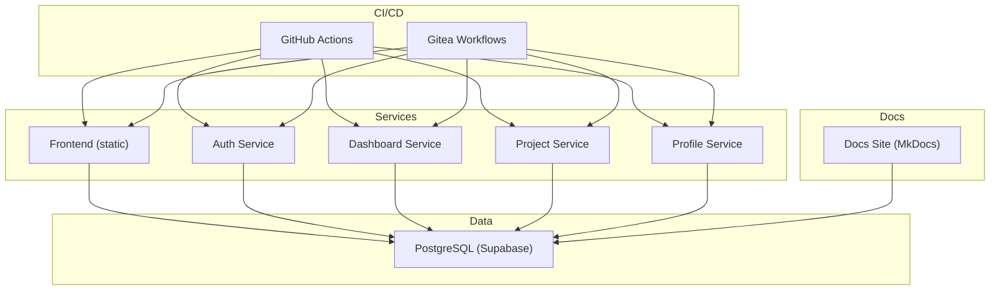
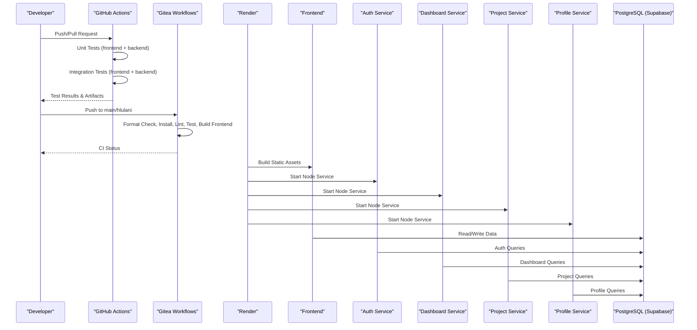
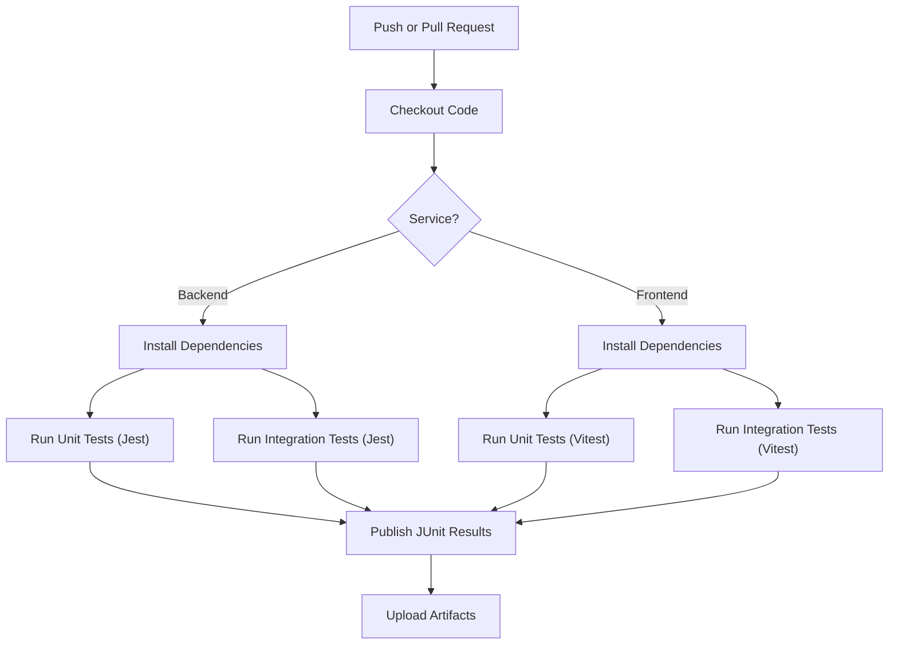
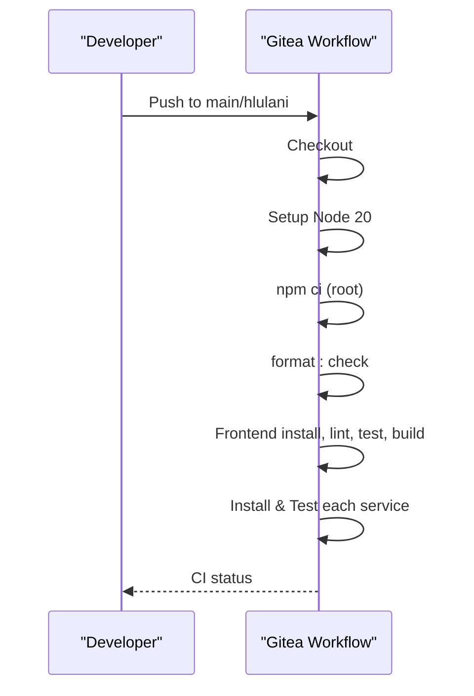
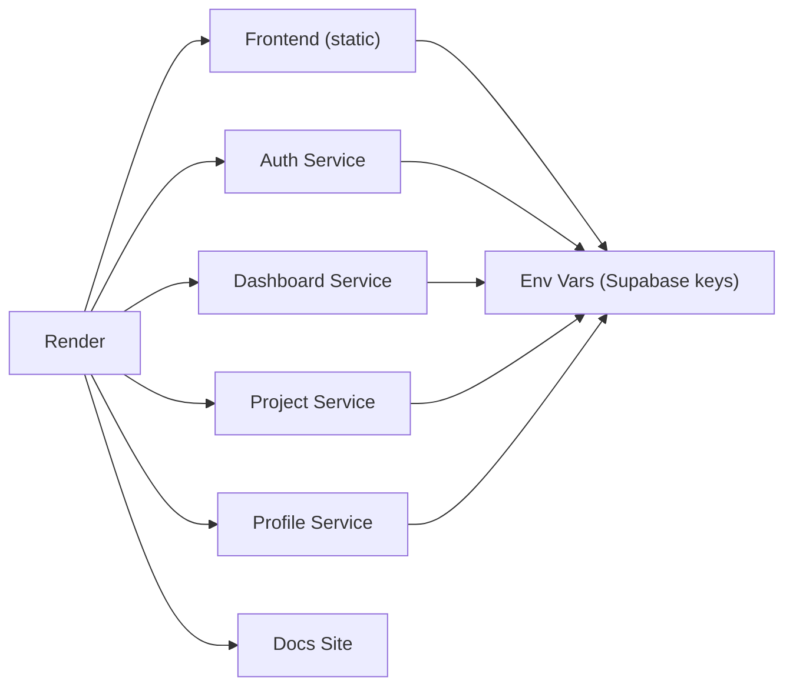
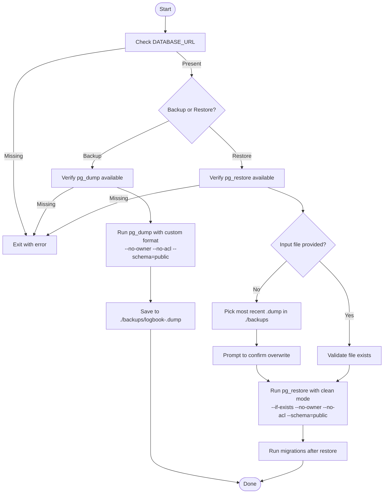
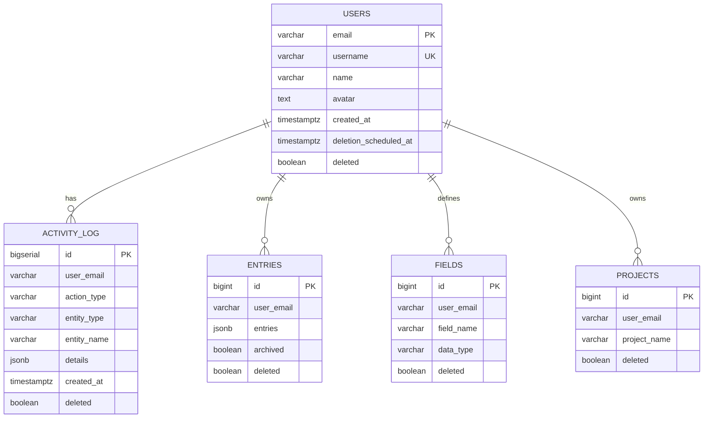
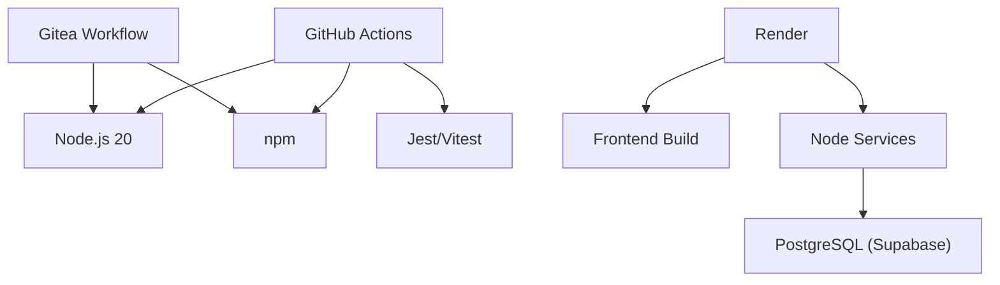

# Deployment and DevOps

<cite>
**Referenced Files in This Document**
- [render.yaml](file://render.yaml)
- [.gitea/workflows/ci.yml](file://.gitea/workflows/ci.yml)
- [.github/workflows/backend-unit-tests.yml](file://.github/workflows/backend-unit-tests.yml)
- [.github/workflows/frontend-unit-tests.yml](file://.github/workflows/frontend-unit-tests.yml)
- [.github/workflows/backend-integration-tests.yml](file://.github/workflows/backend-integration-tests.yml)
- [.github/workflows/frontend-integration-tests.yml](file://.github/workflows/frontend-integration-tests.yml)
- [.gitea/workflows/sync-hlulani.yml](file://.gitea/workflows/sync-hlulani.yml)
- [scripts/backup.js](file://scripts/backup.js)
- [scripts/restore.js](file://scripts/restore.js)
- [supabase/setup.sql](file://supabase/setup.sql)
</cite>

## Table of Contents

1. Introduction
2. Project Structure
3. Core Components
4. Architecture Overview
5. Detailed Component Analysis
6. Dependency Analysis
7. Performance Considerations
8. Troubleshooting Guide
9. Conclusion
10. Appendices

## Introduction

This document provides comprehensive deployment and DevOps guidance for the Codacaine application. It covers CI/CD pipelines using GitHub Actions and Gitea workflows, Render platform deployment configuration, database backup and restore procedures with pg_dump/pg_restore, production deployment processes, environment management, monitoring and logging strategies, error tracking, performance monitoring, alerting, security considerations (SSL, domains), and production hardening practices.

## Project Structure

The project is a multi-service Node.js application with a React frontend and a static documentation site. Services include auth, dashboard, profile, and project services. The database schema and lifecycle utilities are managed via Supabase SQL scripts. CI/CD is implemented through GitHub Actions and Gitea workflows, and deployment to Render is defined declaratively.

**Diagram sources**

- [.gitea/workflows/ci.yml:1-72](file://.gitea/workflows/ci.yml#L1-L72)
- [.github/workflows/backend-unit-tests.yml:1-68](file://.github/workflows/backend-unit-tests.yml#L1-L68)
- [.github/workflows/frontend-unit-tests.yml:1-58](file://.github/workflows/frontend-unit-tests.yml#L1-L58)
- [.github/workflows/backend-integration-tests.yml:1-68](file://.github/workflows/backend-integration-tests.yml#L1-L68)
- [.github/workflows/frontend-integration-tests.yml:1-58](file://.github/workflows/frontend-integration-tests.yml#L1-L58)
- [render.yaml:1-98](file://render.yaml#L1-L98)

**Section sources**

- [.gitea/workflows/ci.yml:1-72](file://.gitea/workflows/ci.yml#L1-L72)
- [render.yaml:1-98](file://render.yaml#L1-L98)

## Core Components

- CI/CD Pipelines:
  - GitHub Actions: unit and integration tests for frontend and backend services; test reporting and artifacts.
  - Gitea Workflows: unified CI job that checks formatting, installs dependencies, runs tests, and builds the frontend across branches.
- Deployment Target:
  - Render: declarative service definitions for static frontend, Node services, and docs site with environment variables and build/start commands.
- Database Operations:
  - Backup and restore scripts using pg_dump and pg_restore with safe defaults and clear user prompts.
  - Supabase setup script defining tables, functions, and scheduled jobs for account lifecycle and statistics.

**Section sources**

- [.github/workflows/backend-unit-tests.yml:1-68](file://.github/workflows/backend-unit-tests.yml#L1-L68)
- [.github/workflows/frontend-unit-tests.yml:1-58](file://.github/workflows/frontend-unit-tests.yml#L1-L58)
- [.github/workflows/backend-integration-tests.yml:1-68](file://.github/workflows/backend-integration-tests.yml#L1-L68)
- [.github/workflows/frontend-integration-tests.yml:1-58](file://.github/workflows/frontend-integration-tests.yml#L1-L58)
- [.gitea/workflows/ci.yml:1-72](file://.gitea/workflows/ci.yml#L1-L72)
- [render.yaml:1-98](file://render.yaml#L1-L98)
- [scripts/backup.js:1-106](file://scripts/backup.js#L1-L106)
- [scripts/restore.js:1-137](file://scripts/restore.js#L1-L137)
- [supabase/setup.sql:1-363](file://supabase/setup.sql#L1-L363)

## Architecture Overview

The system deploys a static frontend and multiple Node services on Render, all backed by a PostgreSQL database hosted by Supabase. CI/CD validates code quality and runs tests before any deployment. The docs site is built and published as a static site.

**Diagram sources**

- [.github/workflows/backend-unit-tests.yml:1-68](file://.github/workflows/backend-unit-tests.yml#L1-L68)
- [.github/workflows/frontend-unit-tests.yml:1-58](file://.github/workflows/frontend-unit-tests.yml#L1-L58)
- [.github/workflows/backend-integration-tests.yml:1-68](file://.github/workflows/backend-integration-tests.yml#L1-L68)
- [.github/workflows/frontend-integration-tests.yml:1-58](file://.github/workflows/frontend-integration-tests.yml#L1-L58)
- [.gitea/workflows/ci.yml:1-72](file://.gitea/workflows/ci.yml#L1-L72)
- [render.yaml:1-98](file://render.yaml#L1-L98)

## Detailed Component Analysis

### CI/CD Pipelines (GitHub Actions)

- Backend Unit Tests:
  - Matrix strategy runs tests per service (auth, dashboard, profile, project).
  - Uses Jest with JUnit reporter and publishes results as artifacts.
- Frontend Unit Tests:
  - Runs Vitest excluding integration tests, outputs JUnit XML, publishes results.
- Backend Integration Tests:
  - Executes integration suites per service with JUnit reporting.
- Frontend Integration Tests:
  - Runs integration suite under frontend directory with JUnit reporting.

**Diagram sources**

- [.github/workflows/backend-unit-tests.yml:1-68](file://.github/workflows/backend-unit-tests.yml#L1-L68)
- [.github/workflows/frontend-unit-tests.yml:1-58](file://.github/workflows/frontend-unit-tests.yml#L1-L58)
- [.github/workflows/backend-integration-tests.yml:1-68](file://.github/workflows/backend-integration-tests.yml#L1-L68)
- [.github/workflows/frontend-integration-tests.yml:1-58](file://.github/workflows/frontend-integration-tests.yml#L1-L58)

**Section sources**

- [.github/workflows/backend-unit-tests.yml:1-68](file://.github/workflows/backend-unit-tests.yml#L1-L68)
- [.github/workflows/frontend-unit-tests.yml:1-58](file://.github/workflows/frontend-unit-tests.yml#L1-L58)
- [.github/workflows/backend-integration-tests.yml:1-68](file://.github/workflows/backend-integration-tests.yml#L1-L68)
- [.github/workflows/frontend-integration-tests.yml:1-58](file://.github/workflows/frontend-integration-tests.yml#L1-L58)

### CI/CD Pipelines (Gitea Workflows)

- Unified CI job:
  - Checks out repository, sets up Node.js 20, installs root dependencies, checks formatting, then sequentially installs and tests each service and builds the frontend.
- Branch sync workflow:
  - Merges main into hlulani automatically on pushes to main.

**Diagram sources**

- [.gitea/workflows/ci.yml:1-72](file://.gitea/workflows/ci.yml#L1-L72)
- [.gitea/workflows/sync-hlulani.yml:1-24](file://.gitea/workflows/sync-hlulani.yml#L1-L24)

**Section sources**

- [.gitea/workflows/ci.yml:1-72](file://.gitea/workflows/ci.yml#L1-L72)
- [.gitea/workflows/sync-hlulani.yml:1-24](file://.gitea/workflows/sync-hlulani.yml#L1-L24)

### Render Platform Deployment Configuration

- Services:
  - Frontend: static site build and publish path configured; routes rewrite to index.html; environment variables for Supabase client keys.
  - Auth Service: Node service with PORT and Supabase credentials.
  - Dashboard Service: Node service with PORT and Supabase credentials.
  - Project Service: Node service with PORT, Supabase credentials, service role key, and AI provider keys.
  - Profile Service: Node service with PORT and Supabase credentials.
  - Docs Site: static site built with MkDocs.
- Environment Variables:
  - All secrets are set via Render’s env var UI; values are not synced from repo.
- Scaling:
  - Plans are set to free; adjust plan and scaling settings in Render console as needed.

**Diagram sources**

- [render.yaml:1-98](file://render.yaml#L1-L98)

**Section sources**

- [render.yaml:1-98](file://render.yaml#L1-L98)

### Database Backup and Restore Procedures

- Backup:
  - Uses pg_dump with custom format, no owner/acl flags, and public schema only.
  - Outputs timestamped .dump files under scripts/backups unless a path is provided.
  - Requires DATABASE_URL environment variable and pg_dump installed locally or in CI.
- Restore:
  - Uses pg_restore with clean mode, if-exists, no owner/acl, and public schema only.
  - Prompts user to confirm overwrite and auto-selects latest .dump if none specified.
  - Requires DATABASE_URL environment variable and pg_restore installed.

**Diagram sources**

- [scripts/backup.js:1-106](file://scripts/backup.js#L1-L106)
- [scripts/restore.js:1-137](file://scripts/restore.js#L1-L137)

**Section sources**

- [scripts/backup.js:1-106](file://scripts/backup.js#L1-L106)
- [scripts/restore.js:1-137](file://scripts/restore.js#L1-L137)

### Database Schema and Lifecycle Management

- Tables and Functions:
  - Users, activity log, and other app tables created in public schema.
  - Functions for account deletion scheduling, restoration, and purging unconfirmed users.
  - Scheduled jobs via pg_cron to purge deleted accounts and unconfirmed sign-ups nightly.
- Statistics:
  - RPCs to compute project stats and field-level statistics for dashboards.

**Diagram sources**

- [supabase/setup.sql:1-363](file://supabase/setup.sql#L1-L363)

**Section sources**

- [supabase/setup.sql:1-363](file://supabase/setup.sql#L1-L363)

### Production Deployment Processes and Environment Management

- Build and Start Commands:
  - Frontend: npm install && npm run build; static assets served from dist.
  - Services: npm install; start via npm start with PORT bound per service.
  - Docs Site: pip install requirements and mkdocs build; static site published from site.
- Environment Variables:
  - Set via Render’s environment UI; ensure Supabase URLs and keys are correct per environment.
  - For project service, configure AI provider keys as required.
- Routes:
  - Frontend routes rewritten to index.html to support SPA routing.

**Section sources**

- [render.yaml:1-98](file://render.yaml#L1-L98)

### Monitoring and Logging Strategies

- Application Logs:
  - Use structured JSON logs in services; forward to Render logs or an external logging service.
- Health Checks:
  - Expose health endpoints in services; configure Render health checks to monitor liveness/readiness.
- Metrics:
  - Emit metrics (e.g., request latency, error rates) and integrate with a metrics collector if needed.
- Alerts:
  - Configure alerts based on error rate thresholds, response time degradation, and uptime failures.

[No sources needed since this section provides general guidance]

### Error Tracking and Performance Monitoring

- Error Tracking:
  - Integrate an error tracking service (e.g., Sentry) in frontend and services to capture exceptions and stack traces.
- Performance Monitoring:
  - Add APM instrumentation to track slow endpoints and database queries.
- Observability:
  - Correlate logs, metrics, and traces to diagnose issues quickly.

[No sources needed since this section provides general guidance]

### Security Considerations, SSL Certificates, Domain Configuration, and Hardening

- Secrets Management:
  - Store all secrets (Supabase keys, API keys) in Render environment variables; never commit to repository.
- SSL and Domains:
  - Configure custom domains and enable HTTPS in Render; use automatic SSL provisioning where supported.
- CORS and Headers:
  - Restrict CORS origins to trusted domains; enforce secure headers (HSTS, CSP) at the edge or via proxy.
- Least Privilege:
  - Use minimal database permissions; avoid service role keys in frontend; restrict access to admin endpoints.
- Backups and DR:
  - Schedule regular backups; maintain offsite copies; test restore procedures periodically.

[No sources needed since this section provides general guidance]

## Dependency Analysis

- CI/CD Dependencies:
  - GitHub Actions workflows depend on Node.js 20, npm, and service-specific test runners (Jest/Vitest).
  - Gitea workflow depends on Node.js 20 and npm for formatting, testing, and building.
- Runtime Dependencies:
  - Services depend on PostgreSQL (Supabase) and optional AI provider APIs.
  - Frontend depends on Supabase client libraries.
- Deployment Dependencies:
  - Render uses render.yaml to define services, build steps, and environment variables.

**Diagram sources**

- [.github/workflows/backend-unit-tests.yml:1-68](file://.github/workflows/backend-unit-tests.yml#L1-L68)
- [.github/workflows/frontend-unit-tests.yml:1-58](file://.github/workflows/frontend-unit-tests.yml#L1-L58)
- [.github/workflows/backend-integration-tests.yml:1-68](file://.github/workflows/backend-integration-tests.yml#L1-L68)
- [.github/workflows/frontend-integration-tests.yml:1-58](file://.github/workflows/frontend-integration-tests.yml#L1-L58)
- [.gitea/workflows/ci.yml:1-72](file://.gitea/workflows/ci.yml#L1-L72)
- [render.yaml:1-98](file://render.yaml#L1-L98)

**Section sources**

- [.github/workflows/backend-unit-tests.yml:1-68](file://.github/workflows/backend-unit-tests.yml#L1-L68)
- [.github/workflows/frontend-unit-tests.yml:1-58](file://.github/workflows/frontend-unit-tests.yml#L1-L58)
- [.github/workflows/backend-integration-tests.yml:1-68](file://.github/workflows/backend-integration-tests.yml#L1-L68)
- [.github/workflows/frontend-integration-tests.yml:1-58](file://.github/workflows/frontend-integration-tests.yml#L1-L58)
- [.gitea/workflows/ci.yml:1-72](file://.gitea/workflows/ci.yml#L1-L72)
- [render.yaml:1-98](file://render.yaml#L1-L98)

## Performance Considerations

- Optimize Builds:
  - Cache npm dependencies in CI to speed up builds.
  - Use incremental builds where possible.
- Database Queries:
  - Leverage indexes and efficient queries; use stored procedures for heavy computations.
- Frontend Optimization:
  - Minimize bundle size; enable code splitting and lazy loading.
- Service Scaling:
  - Monitor resource usage; scale services horizontally if needed.

[No sources needed since this section provides general guidance]

## Troubleshooting Guide

- CI Failures:
  - Verify Node.js version and dependency installation steps in workflows.
  - Check test output artifacts for detailed failure reasons.
- Render Deploy Issues:
  - Ensure environment variables are correctly set and secrets are valid.
  - Review build logs for errors in frontend or service startup.
- Database Restore Errors:
  - Confirm pg_restore is installed and DATABASE_URL is correct.
  - Review stderr for non-fatal warnings vs actual errors.

**Section sources**

- [.github/workflows/backend-unit-tests.yml:1-68](file://.github/workflows/backend-unit-tests.yml#L1-L68)
- [.github/workflows/frontend-unit-tests.yml:1-58](file://.github/workflows/frontend-unit-tests.yml#L1-L58)
- [.github/workflows/backend-integration-tests.yml:1-68](file://.github/workflows/backend-integration-tests.yml#L1-L68)
- [.github/workflows/frontend-integration-tests.yml:1-58](file://.github/workflows/frontend-integration-tests.yml#L1-L58)
- [render.yaml:1-98](file://render.yaml#L1-L98)
- [scripts/restore.js:1-137](file://scripts/restore.js#L1-L137)

## Conclusion

Codacaine’s DevOps setup leverages robust CI/CD pipelines, declarative Render deployments, and reliable database backup/restore procedures. By following the outlined practices for environment management, monitoring, security, and performance, teams can maintain a stable, secure, and scalable production environment.

[No sources needed since this section summarizes without analyzing specific files]

## Appendices

- Quick Reference:
  - CI Triggers: push to main/hlulani; pull requests to main.
  - Render Services: frontend, auth, dashboard, project, profile, docs site.
  - Database Tools: pg_dump and pg_restore with safe defaults.
  - Supabase Jobs: nightly purges for deleted and unconfirmed users.

[No sources needed since this section provides general guidance]
