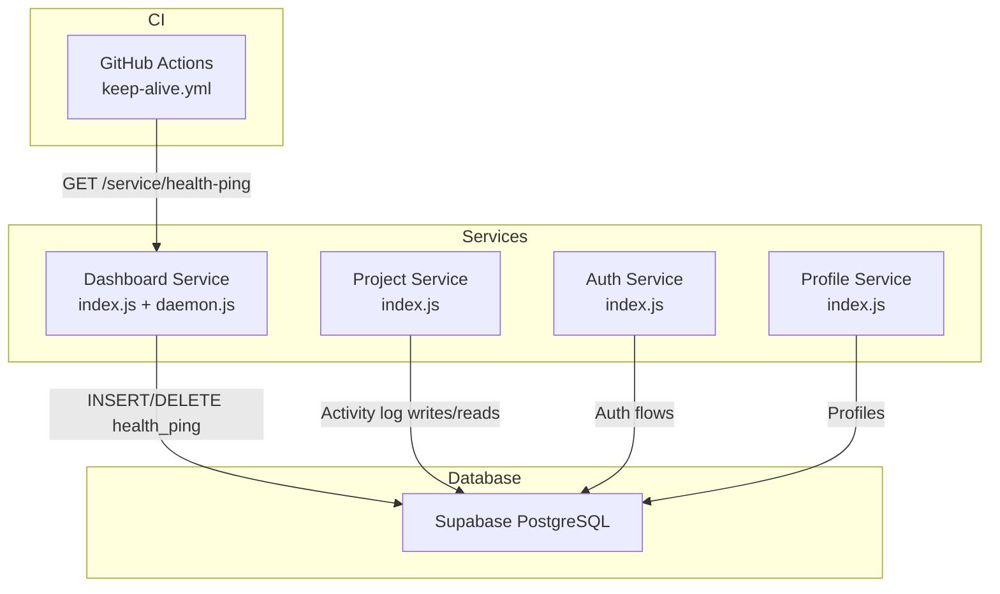
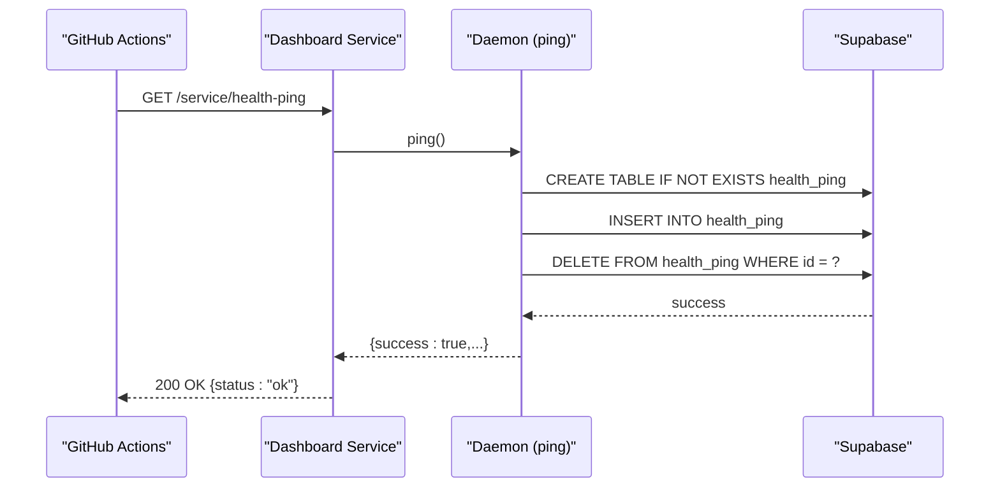
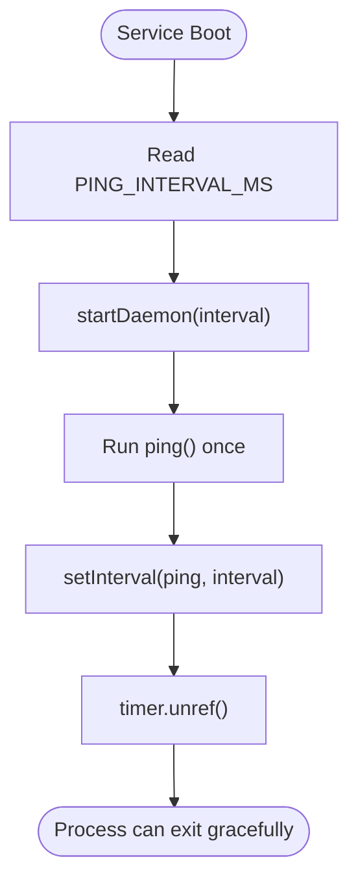
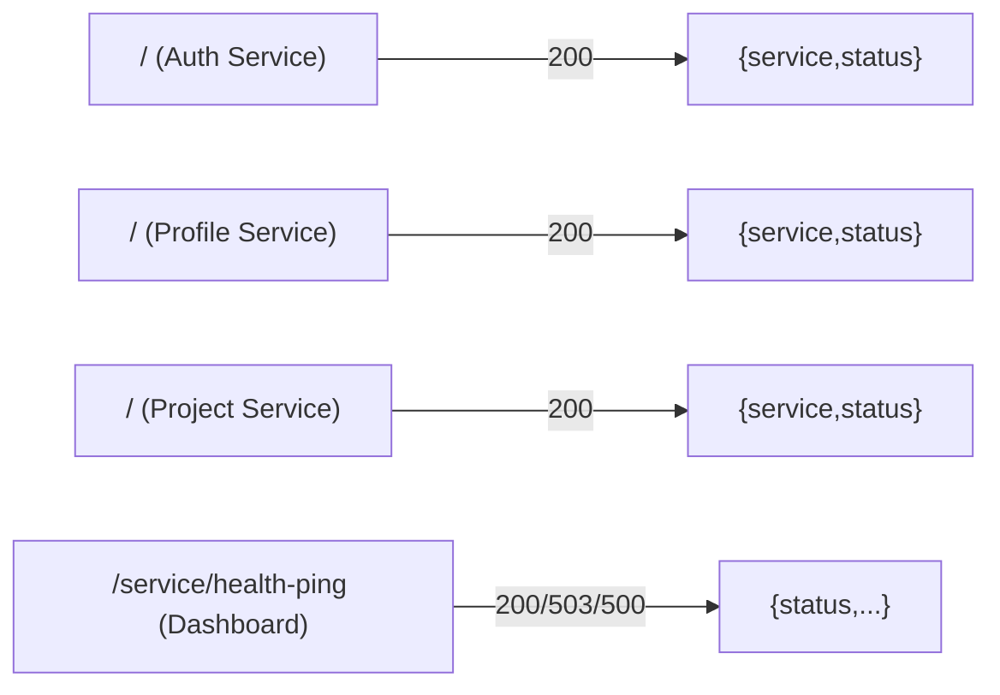
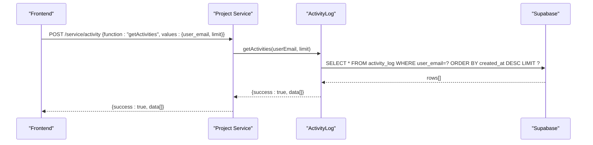
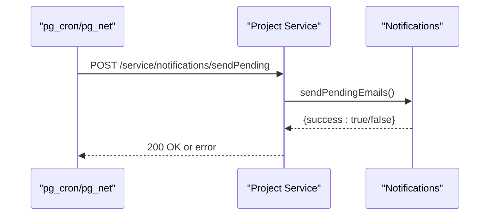
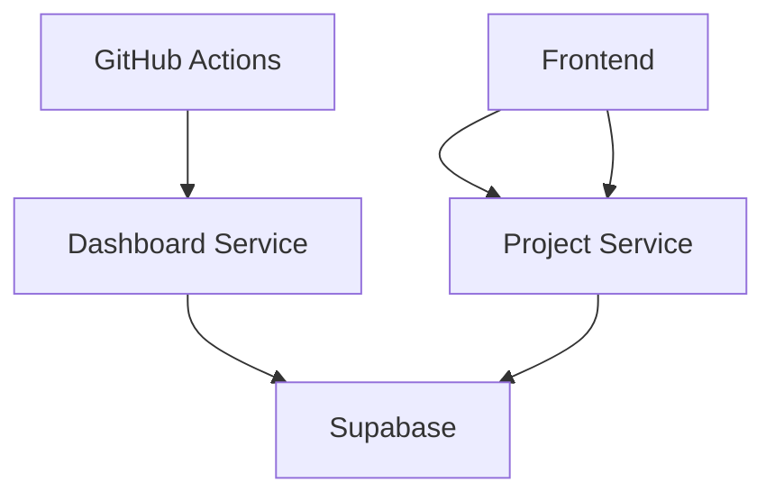

# Monitoring and Logging

<cite>
**Referenced Files in This Document**
- [keep-alive.yml](file://.github/workflows/keep-alive.yml)
- [keep-alive.yml (Gitea)](file://.gitea/workflows/keep-alive.yml)
- [dashboard-service index.js](file://services/dashboard-service/src/index.js)
- [daemon.js](file://services/dashboard-service/src/functions/daemon.js)
- [health_ping migration](file://supabase/migrations/006_create_health_ping_table.sql)
- [auth-service index.js](file://services/auth-service/src/index.js)
- [profile-service index.js](file://services/profile-service/src/index.js)
- [project-service index.js](file://services/project-service/src/index.js)
- [activityLog.js](file://services/project-service/src/functions/activityLog.js)
- [activity route](file://services/project-service/src/Routes/activity.js)
- [activity_log migration](file://supabase/migrations/003_create_activity_log_table.sql)
- [frontend activity fetch](file://frontend/src/functions/activity.js)
- [frontend ActivityFeed.tsx](file://frontend/src/components/ActivityFeed.tsx)
- [notifications route](file://services/project-service/src/Routes/notifications.js)
- [frontend notifications client](file://frontend/src/functions/project/notifications.js)
- [database docs](file://docs-site/docs/Architecture/database.md)
- [caching docs](file://docs-site/docs/Architecture/caching.md)
</cite>

## Table of Contents

1. Introduction
2. Project Structure
3. Core Components
4. Architecture Overview
5. Detailed Component Analysis
6. Dependency Analysis
7. Performance Considerations
8. Troubleshooting Guide
9. Conclusion

## Introduction

This document describes the monitoring, logging, and observability mechanisms implemented across the Codacaine application. It covers:

- Keep-alive mechanisms to prevent Render free-tier sleep and Supabase inactivity pause
- Health check endpoints exposed by each microservice
- Uptime monitoring via GitHub Actions scheduling
- Structured logging patterns and error handling in services
- Activity logging and audit trails for user actions
- Guidance for performance monitoring, request tracing, database query monitoring, and API response time tracking
- Debugging production issues and setting up dashboards

## Project Structure

The application is a set of Node.js microservices with a React frontend. Each service exposes a root health endpoint and routes under /service. The dashboard-service implements the keep-alive daemon that pings Supabase to keep it active. A GitHub Actions workflow periodically calls the dashboard-service’s health-ping endpoint to wake Render and trigger the ping.

**Diagram sources**

- [keep-alive.yml:1-46](file://.github/workflows/keep-alive.yml#L1-L46)
- [dashboard-service index.js:54-67](file://services/dashboard-service/src/index.js#L54-L67)
- [daemon.js:45-71](file://services/dashboard-service/src/functions/daemon.js#L45-L71)
- [health_ping migration:1-22](file://supabase/migrations/006_create_health_ping_table.sql#L1-L22)
- [project-service index.js:76-93](file://services/project-service/src/index.js#L76-L93)
- [auth-service index.js:50-52](file://services/auth-service/src/index.js#L50-L52)
- [profile-service index.js:50-52](file://services/profile-service/src/index.js#L50-L52)

**Section sources**

- [keep-alive.yml:1-46](file://.github/workflows/keep-alive.yml#L1-L46)
- [dashboard-service index.js:48-84](file://services/dashboard-service/src/index.js#L48-L84)
- [project-service index.js:76-103](file://services/project-service/src/index.js#L76-L103)
- [auth-service index.js:50-69](file://services/auth-service/src/index.js#L50-L69)
- [profile-service index.js:50-72](file://services/profile-service/src/index.js#L50-L72)

## Core Components

- Keep-alive system: GitHub Actions triggers a scheduled HTTP call to the dashboard-service health-ping endpoint, which performs an idempotent INSERT/DELETE on a small table to keep Supabase active and to wake Render.
- Health endpoints: Each service exposes a root path returning a minimal status object. The dashboard-service also exposes /service/health-ping for external uptime checks.
- Activity logging: The project-service records user actions into an activity_log table and provides a read endpoint for the frontend to display an activity feed.
- Error handling: Global Express error handlers ensure consistent JSON error responses and CORS headers on errors.

**Section sources**

- [dashboard-service index.js:48-84](file://services/dashboard-service/src/index.js#L48-L84)
- [daemon.js:45-71](file://services/dashboard-service/src/functions/daemon.js#L45-L71)
- [health_ping migration:1-22](file://supabase/migrations/006_create_health_ping_table.sql#L1-L22)
- [activityLog.js:10-36](file://services/project-service/src/functions/activityLog.js#L10-L36)
- [activity route:19-50](file://services/project-service/src/Routes/activity.js#L19-L50)
- [auth-service index.js:50-69](file://services/auth-service/src/index.js#L50-L69)
- [profile-service index.js:50-72](file://services/profile-service/src/index.js#L50-L72)
- [project-service index.js:94-103](file://services/project-service/src/index.js#L94-L103)

## Architecture Overview

The keep-alive flow ensures both Render and Supabase remain warm:

- A cron job runs every 15 minutes and calls the dashboard-service health-ping endpoint.
- The endpoint invokes the daemon’s ping function, which ensures the health_ping table exists, inserts a row, then deletes it immediately.
- An internal daemon in the dashboard-service also runs a fallback interval (default 12 hours) to keep Supabase active even if CI fails.

**Diagram sources**

- [keep-alive.yml:14-45](file://.github/workflows/keep-alive.yml#L14-L45)
- [dashboard-service index.js:54-67](file://services/dashboard-service/src/index.js#L54-L67)
- [daemon.js:45-71](file://services/dashboard-service/src/functions/daemon.js#L45-L71)
- [health_ping migration:7-11](file://supabase/migrations/006_create_health_ping_table.sql#L7-L11)

## Detailed Component Analysis

### Keep-Alive System (Render + Supabase)

- External trigger: A scheduled workflow calls the health-ping endpoint with retries and logs results.
- Endpoint behavior: Returns 200 on success, 503 when degraded (e.g., no pool), and 500 on unexpected errors.
- Internal fallback: The daemon starts on service boot and runs ping at a configurable interval (default 12 hours). It uses unref to avoid blocking graceful shutdown.

**Diagram sources**

- [daemon.js:77-100](file://services/dashboard-service/src/functions/daemon.js#L77-L100)

**Section sources**

- [keep-alive.yml:1-46](file://.github/workflows/keep-alive.yml#L1-L46)
- [keep-alive.yml (Gitea):1-46](file://.gitea/workflows/keep-alive.yml#L1-L46)
- [dashboard-service index.js:54-84](file://services/dashboard-service/src/index.js#L54-L84)
- [daemon.js:45-134](file://services/dashboard-service/src/functions/daemon.js#L45-L134)
- [health_ping migration:1-22](file://supabase/migrations/006_create_health_ping_table.sql#L1-L22)

### Health Check Endpoints

- Root endpoints: Each service returns a simple status object indicating service name and health.
- Dashboard-specific: /service/health-ping provides a richer status including ping details and degradation reasons.

**Diagram sources**

- [auth-service index.js:50-52](file://services/auth-service/src/index.js#L50-L52)
- [profile-service index.js:50-52](file://services/profile-service/src/index.js#L50-L52)
- [project-service index.js:76-78](file://services/project-service/src/index.js#L76-L78)
- [dashboard-service index.js:54-67](file://services/dashboard-service/src/index.js#L54-L67)

**Section sources**

- [auth-service index.js:50-69](file://services/auth-service/src/index.js#L50-L69)
- [profile-service index.js:50-72](file://services/profile-service/src/index.js#L50-L72)
- [project-service index.js:76-103](file://services/project-service/src/index.js#L76-L103)
- [dashboard-service index.js:54-67](file://services/dashboard-service/src/index.js#L54-L67)

### Activity Logging and Audit Trails

- Write path: Route handlers call a fire-and-forget logger that inserts an activity record with user email, action type, entity type/name, and optional JSONB details. Errors are caught and logged; they do not break the main operation.
- Read path: A POST /service/activity endpoint accepts a function name and values, validates the JWT-derived user email, and returns recent activities ordered newest first.
- Frontend: Calls the activity endpoint and renders an activity feed with icons and labels mapped per action type.

**Diagram sources**

- [activity route:19-50](file://services/project-service/src/Routes/activity.js#L19-L50)
- [activityLog.js:45-62](file://services/project-service/src/functions/activityLog.js#L45-L62)
- [activity_log migration:12-24](file://supabase/migrations/003_create_activity_log_table.sql#L12-L24)
- [frontend activity fetch:1-11](file://frontend/src/functions/activity.js#L1-L11)
- [frontend ActivityFeed.tsx:1-65](file://frontend/src/components/ActivityFeed.tsx#L1-L65)

**Section sources**

- [activityLog.js:10-36](file://services/project-service/src/functions/activityLog.js#L10-L36)
- [activity route:19-50](file://services/project-service/src/Routes/activity.js#L19-L50)
- [activity_log migration:12-24](file://supabase/migrations/003_create_activity_log_table.sql#L12-L24)
- [frontend activity fetch:1-11](file://frontend/src/functions/activity.js#L1-L11)
- [frontend ActivityFeed.tsx:1-65](file://frontend/src/components/ActivityFeed.tsx#L1-L65)

### Notifications and Alerts

- Notifications are exposed via POST /service/notifications with functions like get, history, markRead, markAllRead.
- A separate public endpoint POST /service/notifications/sendPending allows background jobs to send pending notification emails without a user JWT. It is idempotent and safe to call repeatedly.

**Diagram sources**

- [notifications route:81-95](file://services/project-service/src/Routes/notifications.js#L81-L95)

**Section sources**

- [notifications route:20-95](file://services/project-service/src/Routes/notifications.js#L20-L95)
- [frontend notifications client:1-73](file://frontend/src/functions/project/notifications.js#L1-L73)

### Database Connection Pooling and Startup Checks

- Services use a connection pool with a maximum number of concurrent connections to avoid exhausting Supabase limits.
- On startup, services verify connectivity and log any failures while still starting (graceful degradation).

**Section sources**

- [database docs:449-452](file://docs-site/docs/Architecture/database.md#L449-L452)

## Dependency Analysis

- CI depends on the dashboard-service health-ping endpoint being reachable and returning 200.
- The dashboard-service depends on a healthy Supabase connection to perform the ping cycle.
- The project-service depends on the activity_log table schema and indexes for efficient reads.
- Frontend components depend on stable /service/activity and /service/notifications endpoints.

**Diagram sources**

- [keep-alive.yml:14-45](file://.github/workflows/keep-alive.yml#L14-L45)
- [dashboard-service index.js:54-67](file://services/dashboard-service/src/index.js#L54-L67)
- [project-service index.js:76-93](file://services/project-service/src/index.js#L76-L93)
- [activity route:19-50](file://services/project-service/src/Routes/activity.js#L19-L50)

**Section sources**

- [keep-alive.yml:1-46](file://.github/workflows/keep-alive.yml#L1-L46)
- [dashboard-service index.js:54-84](file://services/dashboard-service/src/index.js#L54-L84)
- [project-service index.js:76-103](file://services/project-service/src/index.js#L76-L103)
- [activity route:19-50](file://services/project-service/src/Routes/activity.js#L19-L50)

## Performance Considerations

- Keep-alive cost: Each ping executes three queries (ensure table, insert, delete) and leaves no persistent data. Frequency is every 15 minutes via CI plus an internal fallback interval.
- Local-first caching: The frontend caches data locally to reduce network latency and improve perceived performance. Subsequent loads are fast and resilient offline.
- Connection pooling: Services reuse database connections to avoid exhaustion and maintain throughput under load.

[No sources needed since this section provides general guidance]

## Troubleshooting Guide

- Keep-alive failures:
  - Verify RENDER_URL secret is configured in the workflow environment.
  - Inspect workflow logs for HTTP codes and response bodies from the health-ping endpoint.
  - Confirm the dashboard-service is reachable and the /service/health-ping endpoint returns 200.
- Daemon issues:
  - If ping returns degraded/no_pool, check database connectivity and environment variables.
  - Ensure the internal daemon started on boot and is running at the configured interval.
- Activity log problems:
  - Validate the activity_log table exists and indexes are present.
  - Confirm the activity route receives a verified userEmail from the JWT middleware.
  - Check that the frontend calls the correct endpoint and handles pagination.
- Notifications:
  - Ensure sendPending endpoint is callable by background jobs and idempotent.
  - Validate that get/history/markRead functions return expected structures.

**Section sources**

- [keep-alive.yml:14-45](file://.github/workflows/keep-alive.yml#L14-L45)
- [dashboard-service index.js:54-84](file://services/dashboard-service/src/index.js#L54-L84)
- [daemon.js:45-134](file://services/dashboard-service/src/functions/daemon.js#L45-L134)
- [activity route:19-50](file://services/project-service/src/Routes/activity.js#L19-L50)
- [notifications route:81-95](file://services/project-service/src/Routes/notifications.js#L81-L95)

## Conclusion

Codacaine implements a robust keep-alive strategy using GitHub Actions and an internal daemon to keep Render and Supabase active. Each service exposes health endpoints and standardized error handling. User actions are captured in an activity log for auditing and UI feedback. For full observability, consider adding structured logging libraries, centralized log aggregation, request tracing, and metrics collection for API response times and database queries. The existing foundations provide clear integration points for these enhancements.
