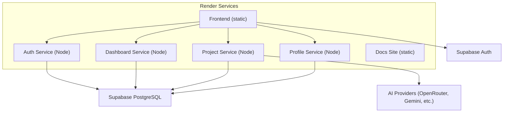
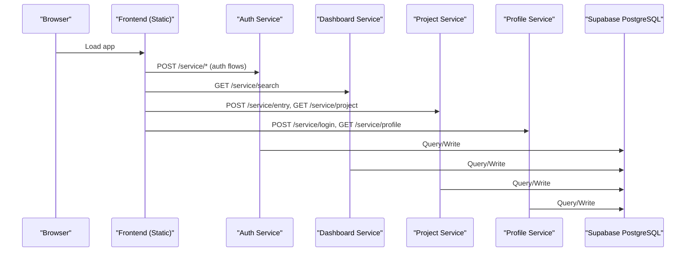
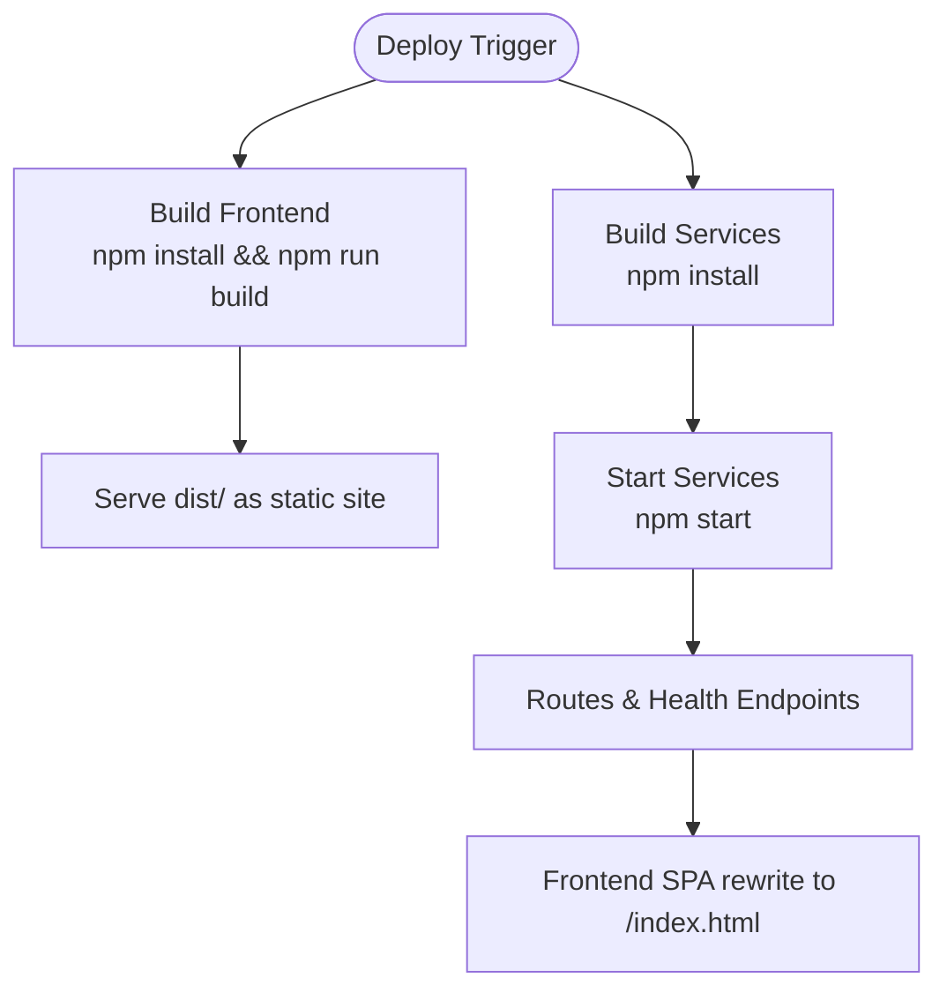
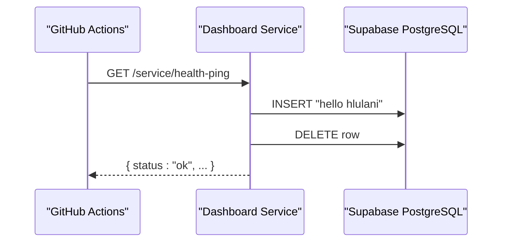
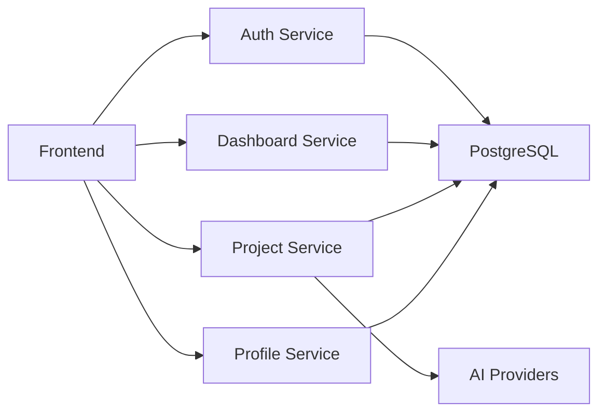

# Production Deployment

<cite>
**Referenced Files in This Document**
- [render.yaml](file://render.yaml)
- [README.md](file://README.md)
- [services/auth-service/src/index.js](file://services/auth-service/src/index.js)
- [services/dashboard-service/src/index.js](file://services/dashboard-service/src/index.js)
- [services/project-service/src/index.js](file://services/project-service/src/index.js)
- [services/profile-service/src/index.js](file://services/profile-service/src/index.js)
- [services/dashboard-service/src/functions/daemon.js](file://services/dashboard-service/src/functions/daemon.js)
- [services/dashboard-service/src/db.js](file://services/dashboard-service/src/db.js)
- [services/project-service/src/db.js](file://services/project-service/src/db.js)
- [services/profile-service/src/db.js](file://services/profile-service/src/db.js)
- [frontend/package.json](file://frontend/package.json)
- [services/auth-service/package.json](file://services/auth-service/package.json)
- [services/dashboard-service/package.json](file://services/dashboard-service/package.json)
- [services/project-service/package.json](file://services/project-service/package.json)
- [services/profile-service/package.json](file://services/profile-service/package.json)
- [docs-site/mkdocs.yml](file://docs-site/mkdocs.yml)
- [services/project-service/docs/openapi.yaml](file://services/project-service/docs/openapi.yaml)
</cite>

## Table of Contents

1. Introduction
2. Project Structure
3. Core Components
4. Architecture Overview
5. Detailed Component Analysis
6. Dependency Analysis
7. Performance Considerations
8. Troubleshooting Guide
9. Conclusion
10. Appendices

## Introduction

This document provides production deployment guidance for the Codacaine application on Render. It covers the render.yaml configuration, service definitions, environment variables, scaling and routing, SSL and custom domains, health checks, monitoring, and operational procedures such as rollbacks and zero-downtime updates. The system consists of a React static frontend, four Node.js microservices (auth, dashboard, project, profile), and a MkDocs documentation site.

## Project Structure

The repository deploys six services via a single manifest:

- Frontend static site built with Vite and published from the dist directory
- Four Node.js Express microservices listening on ports 5001–5004
- A MkDocs documentation site built and served statically

**Diagram sources**

- [render.yaml:1-98](file://render.yaml#L1-L98)
- [services/auth-service/src/index.js:1-82](file://services/auth-service/src/index.js#L1-L82)
- [services/dashboard-service/src/index.js:1-87](file://services/dashboard-service/src/index.js#L1-L87)
- [services/project-service/src/index.js:1-108](file://services/project-service/src/index.js#L1-L108)
- [services/profile-service/src/index.js:1-77](file://services/profile-service/src/index.js#L1-L77)

**Section sources**

- [render.yaml:1-98](file://render.yaml#L1-L98)
- [README.md:20-75](file://README.md#L20-L75)

## Core Components

- Frontend (static): Built with Vite; build command runs TypeScript compilation and Vite build; output is served from the dist folder.
- Auth Service: Express app on port 5001 with CORS configured and a root health endpoint.
- Dashboard Service: Express app on port 5002 exposing search routes under /service and a keep-alive health-ping endpoint.
- Project Service: Express app on port 5003 with OpenAPI/Swagger UI at /api-docs, JWT-protected routes under /service, and a public notification trigger.
- Profile Service: Express app on port 5004 with login and profile routes under /service.
- Docs Site: MkDocs Material site built to the site directory.

Environment variables are injected per service via render.yaml. Each backend service uses a shared Supabase PostgreSQL database through DATABASE_URL.

**Section sources**

- [render.yaml:1-98](file://render.yaml#L1-L98)
- [frontend/package.json:1-45](file://frontend/package.json#L1-L45)
- [services/auth-service/package.json:1-41](file://services/auth-service/package.json#L1-L41)
- [services/dashboard-service/package.json:1-43](file://services/dashboard-service/package.json#L1-L43)
- [services/project-service/package.json:1-58](file://services/project-service/package.json#L1-L58)
- [services/profile-service/package.json:1-43](file://services/profile-service/package.json#L1-L43)
- [docs-site/mkdocs.yml:1-107](file://docs-site/mkdocs.yml#L1-L107)

## Architecture Overview

The frontend communicates with each microservice over HTTPS. All services connect to Supabase PostgreSQL using connection pooling with SSL enabled. The project service integrates multiple AI providers for natural-language features. A keep-alive mechanism keeps the dashboard service warm and pings the database periodically.

**Diagram sources**

- [services/auth-service/src/index.js:1-82](file://services/auth-service/src/index.js#L1-L82)
- [services/dashboard-service/src/index.js:1-87](file://services/dashboard-service/src/index.js#L1-L87)
- [services/project-service/src/index.js:1-108](file://services/project-service/src/index.js#L1-L108)
- [services/profile-service/src/index.js:1-77](file://services/profile-service/src/index.js#L1-L77)
- [services/dashboard-service/src/db.js:1-31](file://services/dashboard-service/src/db.js#L1-L31)
- [services/project-service/src/db.js:1-31](file://services/project-service/src/db.js#L1-L31)
- [services/profile-service/src/db.js:1-31](file://services/profile-service/src/db.js#L1-L31)

## Detailed Component Analysis

### Render Manifest and Routing

- Static frontend: builds in frontend/, serves dist/, rewrites all routes to index.html for client-side routing.
- Node services: each has its own name, env type, build/start commands, and PORT.
- Docs site: builds docs-site/ with MkDocs and serves site/.

**Diagram sources**

- [render.yaml:1-98](file://render.yaml#L1-L98)

**Section sources**

- [render.yaml:1-98](file://render.yaml#L1-L98)

### Environment Variables Management

- Frontend requires Supabase URL and anon key; these are set in render.yaml for the static service.
- Backend services require DATABASE_URL and service-specific keys (e.g., SUPABASE_KEY, SUPABASE_SERVICE_ROLE_KEY, AI provider keys).
- Ports are explicitly set per service in render.yaml.

Operational notes:

- DATABASE_URL must include credentials for Supabase PostgreSQL.
- SSL is enforced by Supabase; services configure pg.Pool with SSL options.
- Keep secrets out of code; use Render’s environment variable management.

**Section sources**

- [render.yaml:13-98](file://render.yaml#L13-L98)
- [README.md:207-304](file://README.md#L207-L304)
- [services/dashboard-service/src/db.js:1-31](file://services/dashboard-service/src/db.js#L1-L31)
- [services/project-service/src/db.js:1-31](file://services/project-service/src/db.js#L1-L31)
- [services/profile-service/src/db.js:1-31](file://services/profile-service/src/db.js#L1-L31)

### SSL Certificates and Custom Domains

- Render provisions automatic HTTPS for default *.onrender.com domains.
- For custom domains, add the domain in Render and follow Render’s DNS/CNAME instructions to enable SSL.
- Ensure your frontend CORS allows the custom domain origin.

[No sources needed since this section provides general guidance]

### Service Scaling Strategies and Resource Allocation

Current manifest uses free plans for all services. Recommendations:

- Upgrade to paid plans when you need:
  - Persistent storage or higher CPU/RAM
  - Auto-scaling based on traffic
  - Private networking between services
- Use separate services per domain if you want independent scaling.
- Monitor CPU, memory, and request latency in Render dashboards.

[No sources needed since this section provides general guidance]

### Health Checks and Monitoring

- Root endpoints return JSON status for quick health checks:
  - Auth: GET / returns { service, status }
  - Dashboard: GET / returns { service, status }
  - Project: GET / returns { service, status }
  - Profile: GET / returns { service, status }
- Keep-alive: Dashboard exposes GET /service/health-ping to wake the instance and ping the database.
- Database connectivity: Services verify pool connectivity on startup and log success/failure.

**Diagram sources**

- [services/dashboard-service/src/index.js:54-67](file://services/dashboard-service/src/index.js#L54-L67)
- [services/dashboard-service/src/functions/daemon.js:41-134](file://services/dashboard-service/src/functions/daemon.js#L41-L134)

**Section sources**

- [services/auth-service/src/index.js:50-52](file://services/auth-service/src/index.js#L50-L52)
- [services/dashboard-service/src/index.js:48-67](file://services/dashboard-service/src/index.js#L48-L67)
- [services/project-service/src/index.js:76-78](file://services/project-service/src/index.js#L76-L78)
- [services/profile-service/src/index.js:50-52](file://services/profile-service/src/index.js#L50-L52)
- [services/dashboard-service/src/functions/daemon.js:41-134](file://services/dashboard-service/src/functions/daemon.js#L41-L134)
- [services/dashboard-service/src/db.js:1-31](file://services/dashboard-service/src/db.js#L1-L31)
- [services/project-service/src/db.js:1-31](file://services/project-service/src/db.js#L1-L31)
- [services/profile-service/src/db.js:1-31](file://services/profile-service/src/db.js#L1-L31)

### API Surface and Documentation

- Project service serves OpenAPI spec and Swagger UI at /api-docs.
- The spec documents paths across services including dashboard health-ping and project routes.

**Section sources**

- [services/project-service/src/index.js:58-75](file://services/project-service/src/index.js#L58-L75)
- [services/project-service/docs/openapi.yaml:911-951](file://services/project-service/docs/openapi.yaml#L911-L951)

### Frontend Build and Routing

- Build pipeline compiles TypeScript and builds assets into dist/.
- Render rewrites all routes to index.html to support client-side routing.

**Section sources**

- [frontend/package.json:6-12](file://frontend/package.json#L6-L12)
- [render.yaml:3-17](file://render.yaml#L3-L17)

### Documentation Site

- MkDocs Material theme with navigation structure defined in mkdocs.yml.
- Render builds docs-site/ and serves site/.

**Section sources**

- [docs-site/mkdocs.yml:1-107](file://docs-site/mkdocs.yml#L1-L107)
- [render.yaml:91-98](file://render.yaml#L91-L98)

## Dependency Analysis

- Frontend depends on Supabase Auth and calls backend services via HTTP.
- Backend services depend on Supabase PostgreSQL and, for the project service, external AI providers.
- The dashboard service includes a keep-alive daemon that writes to the database to prevent platform sleep.

**Diagram sources**

- [services/auth-service/src/index.js:1-82](file://services/auth-service/src/index.js#L1-L82)
- [services/dashboard-service/src/index.js:1-87](file://services/dashboard-service/src/index.js#L1-L87)
- [services/project-service/src/index.js:1-108](file://services/project-service/src/index.js#L1-L108)
- [services/profile-service/src/index.js:1-77](file://services/profile-service/src/index.js#L1-L77)
- [services/dashboard-service/src/functions/daemon.js:41-134](file://services/dashboard-service/src/functions/daemon.js#L41-L134)

**Section sources**

- [services/auth-service/package.json:18-22](file://services/auth-service/package.json#L18-L22)
- [services/dashboard-service/package.json:18-23](file://services/dashboard-service/package.json#L18-L23)
- [services/project-service/package.json:18-34](file://services/project-service/package.json#L18-L34)
- [services/profile-service/package.json:18-23](file://services/profile-service/package.json#L18-L23)

## Performance Considerations

- Connection pooling: Each service uses pg.Pool to manage connections efficiently.
- SSL: Supabase enforces SSL; ensure DATABASE_URL includes proper settings.
- Cold starts: Free-tier instances may sleep; the dashboard keep-alive reduces cold-start impact.
- Request size limits: Project service sets a larger JSON body limit for heavy payloads.
- Monitoring: Use Render logs and dashboards to track latency, errors, and resource usage.

**Section sources**

- [services/dashboard-service/src/db.js:1-31](file://services/dashboard-service/src/db.js#L1-L31)
- [services/project-service/src/index.js:56-56](file://services/project-service/src/index.js#L56-L56)
- [services/dashboard-service/src/functions/daemon.js:77-100](file://services/dashboard-service/src/functions/daemon.js#L77-L100)

## Troubleshooting Guide

Common issues and mitigations:

- Missing DATABASE_URL: Services warn or error on startup; ensure it is set in Render.
- CORS failures: Verify allowed origins include your frontend domain; services enforce an allowlist.
- Unhandled route crashes: Global error handlers attach CORS headers even on errors.
- Wrong service URLs: Ensure frontend points to correct deployed service URLs.
- Module load errors: Validate environment variables before module initialization to avoid early crashes.

Health verification:

- Check GET / on each service for basic health.
- Use GET /service/health-ping on dashboard service to confirm keep-alive and DB connectivity.

**Section sources**

- [services/auth-service/src/index.js:50-69](file://services/auth-service/src/index.js#L50-L69)
- [services/dashboard-service/src/index.js:48-78](file://services/dashboard-service/src/index.js#L48-L78)
- [services/project-service/src/index.js:76-103](file://services/project-service/src/index.js#L76-L103)
- [services/profile-service/src/index.js:50-72](file://services/profile-service/src/index.js#L50-L72)
- [services/dashboard-service/src/functions/daemon.js:41-70](file://services/dashboard-service/src/functions/daemon.js#L41-L70)

## Conclusion

Codacaine deploys cleanly on Render using a single manifest that defines a static frontend, four Node.js microservices, and a documentation site. Environment variables are managed per service, with Supabase providing both authentication and a managed PostgreSQL database. Health checks and a keep-alive mechanism improve reliability on the free tier. For production readiness, consider upgrading plans, enabling auto-scaling, configuring custom domains with SSL, and adding structured logging and alerting.

[No sources needed since this section summarizes without analyzing specific files]

## Appendices

### Service Definitions Summary

- Frontend: static, build in frontend/, serve dist/, rewrite routes to index.html
- Auth Service: Node, port 5001, Supabase keys
- Dashboard Service: Node, port 5002, Supabase keys, keep-alive endpoint
- Project Service: Node, port 5003, Supabase keys, AI provider keys, OpenAPI/Swagger
- Profile Service: Node, port 5004, Supabase keys
- Docs Site: static, build docs-site/, serve site/

**Section sources**

- [render.yaml:1-98](file://render.yaml#L1-L98)

### Rollback Procedures

- In Render, revert to a previous commit to redeploy the previous version.
- For zero-downtime updates, deploy a new service revision and switch custom domain routing after validation.
- Keep migrations backward-compatible; test schema changes against staging first.

[No sources needed since this section provides general guidance]

### Blue-Green Deployments and Zero-Downtime Updates

- Create a second service (green) alongside the current (blue).
- Route traffic to green after successful health checks.
- Switch custom domain to green; rollback by switching back to blue.

[No sources needed since this section provides general guidance]
