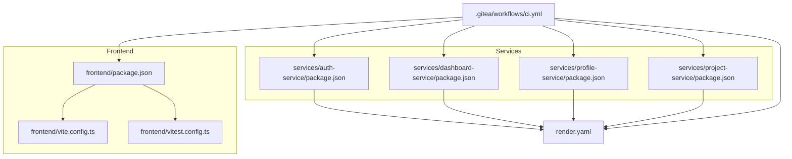
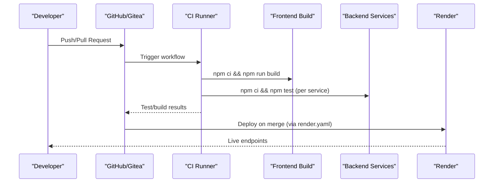
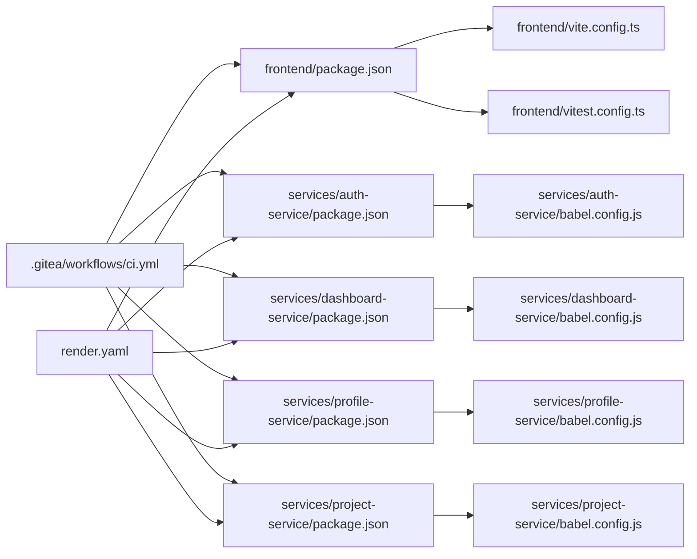

# Build Process and Deployment

<cite>
**Referenced Files in This Document**
- [vite.config.ts](file://frontend/vite.config.ts)
- [package.json](file://frontend/package.json)
- [vitest.config.ts](file://frontend/vitest.config.ts)
- [render.yaml](file://render.yaml)
- [ci.yml](file://.gitea/workflows/ci.yml)
- [babel.config.js (auth-service)](file://services/auth-service/babel.config.js)
- [babel.config.js (dashboard-service)](file://services/dashboard-service/babel.config.js)
- [babel.config.js (profile-service)](file://services/profile-service/babel.config.js)
- [babel.config.js (project-service)](file://services/project-service/babel.config.js)
- [package.json (auth-service)](file://services/auth-service/package.json)
- [package.json (dashboard-service)](file://services/dashboard-service/package.json)
- [package.json (profile-service)](file://services/profile-service/package.json)
- [package.json (project-service)](file://services/project-service/package.json)
- [index.js (auth-service)](file://services/auth-service/src/index.js)
- [index.js (dashboard-service)](file://services/dashboard-service/src/index.js)
</cite>

## Table of Contents

1. Introduction
2. Project Structure
3. Core Components
4. Architecture Overview
5. Detailed Component Analysis
6. Dependency Analysis
7. Performance Considerations
8. Troubleshooting Guide
9. Conclusion

## Introduction

This document explains the build process and deployment pipeline for the Codacaine project. It covers:

- Vite configuration and production builds for the React frontend
- Babel transpilation setup for backend services across Node.js versions
- CI/CD pipelines that automate testing, building, and deployment to Render
- Local build instructions, environment-specific configurations, and deployment verification
- Performance optimization strategies, caching approaches, and troubleshooting common issues

## Project Structure

The repository is a monorepo with a React frontend and multiple Node.js microservices. The frontend is built with Vite and TypeScript, while backend services use Express and Jest with Babel for test-time transformation. Deployment targets are defined in a single Render manifest.

**Diagram sources**

- [package.json:1-45](file://frontend/package.json#L1-L45)
- [vite.config.ts:1-16](file://frontend/vite.config.ts#L1-L16)
- [vitest.config.ts:1-18](file://frontend/vitest.config.ts#L1-L18)
- [package.json (auth-service):1-41](file://services/auth-service/package.json#L1-L41)
- [package.json (dashboard-service):1-43](file://services/dashboard-service/package.json#L1-L43)
- [package.json (profile-service):1-43](file://services/profile-service/package.json#L1-L43)
- [package.json (project-service):1-58](file://services/project-service/package.json#L1-L58)
- [render.yaml:1-98](file://render.yaml#L1-L98)
- [ci.yml:1-72](file://.gitea/workflows/ci.yml#L1-L72)

**Section sources**

- [package.json:1-45](file://frontend/package.json#L1-L45)
- [render.yaml:1-98](file://render.yaml#L1-L98)
- [ci.yml:1-72](file://.gitea/workflows/ci.yml#L1-L72)

## Core Components

- Frontend build tooling: Vite with React plugin, TypeScript build step via tsc, Vitest for tests.
- Backend services: Express-based services with Jest tests transformed by babel-jest using @babel/preset-env.
- Deployment: Render manifest defines static site publishing for the frontend and Node web services for each backend.
- CI: GitHub Actions workflow runs formatting checks, linting, tests, and builds across all components.

Key responsibilities:

- Vite config sets up React plugin, path aliasing, dev server port, and delegates production optimizations to Vite’s defaults.
- Each service’s package.json defines start/test scripts; some configure Jest transform via babel-jest.
- render.yaml declares environment variables per service and routes for SPA rewrite.

**Section sources**

- [vite.config.ts:1-16](file://frontend/vite.config.ts#L1-L16)
- [package.json:1-45](file://frontend/package.json#L1-L45)
- [package.json (auth-service):1-41](file://services/auth-service/package.json#L1-L41)
- [package.json (dashboard-service):1-43](file://services/dashboard-service/package.json#L1-L43)
- [package.json (profile-service):1-43](file://services/profile-service/package.json#L1-L43)
- [package.json (project-service):1-58](file://services/project-service/package.json#L1-L58)
- [render.yaml:1-98](file://render.yaml#L1-L98)

## Architecture Overview

High-level flow from code push to deployed artifacts:

**Diagram sources**

- [ci.yml:1-72](file://.gitea/workflows/ci.yml#L1-L72)
- [render.yaml:1-98](file://render.yaml#L1-L98)

## Detailed Component Analysis

### Frontend Build with Vite

- Build script compiles TypeScript then invokes Vite to produce optimized assets.
- Vite configuration enables React plugin, path aliases, and a local dev server on a specific port.
- Tests run with Vitest in jsdom environment with a shared setup file.

Production characteristics:

- Vite performs minification, tree-shaking, and asset optimization out of the box.
- Environment variables prefixed with VITE_ are injected at build time.

Bundle analysis:

- No bundle analyzer is configured in the current setup. To add one, integrate an official Vite plugin into the Vite configuration and run it during the build step.

Environment variables:

- Supabase URL and anon key are provided to the frontend at build time via Render environment variables.

Local development:

- Use the dev script to start the Vite dev server.
- Tests can be run in watch mode or with coverage.

**Section sources**

- [package.json:1-45](file://frontend/package.json#L1-L45)
- [vite.config.ts:1-16](file://frontend/vite.config.ts#L1-L16)
- [vitest.config.ts:1-18](file://frontend/vitest.config.ts#L1-L18)
- [render.yaml:1-98](file://render.yaml#L1-L98)

### Backend Transpilation with Babel

Each service uses Babel preset-env for test-time transformations:

- auth-service: CommonJS module style with preset-env.
- dashboard-service, profile-service, project-service: ES modules with preset-env targeting the current Node runtime.

Jest integration:

- Some services configure Jest to transform JavaScript files through babel-jest.
- Coverage collection is scoped to function directories excluding tests and mocks.

Node version compatibility:

- Targeting the current Node runtime ensures minimal polyfills and faster test execution in CI.
- For broader compatibility, adjust the targets in preset-env if needed.

**Section sources**

- [babel.config.js (auth-service):1-4](file://services/auth-service/babel.config.js#L1-L4)
- [babel.config.js (dashboard-service):1-4](file://services/dashboard-service/babel.config.js#L1-L4)
- [babel.config.js (profile-service):1-4](file://services/profile-service/babel.config.js#L1-L4)
- [babel.config.js (project-service):1-4](file://services/project-service/babel.config.js#L1-L4)
- [package.json (auth-service):1-41](file://services/auth-service/package.json#L1-L41)
- [package.json (dashboard-service):1-43](file://services/dashboard-service/package.json#L1-L43)
- [package.json (profile-service):1-43](file://services/profile-service/package.json#L1-L43)
- [package.json (project-service):1-58](file://services/project-service/package.json#L1-L58)

### CI/CD Pipeline (GitHub Actions)

The CI workflow:

- Checks out code and sets up Node.js.
- Installs root dependencies and enforces formatting.
- Runs frontend linting, tests, and build.
- Installs and tests each backend service independently.

Triggers:

- Runs on pushes to main and hlulani branches, and pull requests to main.

Artifacts:

- Builds are produced locally in CI; deployment to Render is managed separately via the Render manifest.

**Section sources**

- [ci.yml:1-72](file://.gitea/workflows/ci.yml#L1-L72)

### Deployment to Render

Render configuration:

- Static site: The frontend is published from the dist directory after running install and build commands. A rewrite route sends all paths to index.html for client-side routing.
- Web services: Each backend service is declared as a Node web app with its own root directory, start command, and environment variables.
- Docs site: Built with MkDocs and published as a static site.

Environment variables:

- Frontend receives Supabase variables at build time.
- Services receive database credentials, API keys, and ports as needed.

SPA routing:

- Rewrite rule ensures deep links resolve correctly in the browser.

**Section sources**

- [render.yaml:1-98](file://render.yaml#L1-L98)

### Service Health and CORS

- Services expose a root health endpoint returning status information.
- CORS is configured to allow specified origins and localhost variants.
- Global error handlers ensure proper headers and consistent error responses.

**Section sources**

- [index.js (auth-service):1-82](file://services/auth-service/src/index.js#L1-L82)
- [index.js (dashboard-service):1-87](file://services/dashboard-service/src/index.js#L1-L87)

## Dependency Analysis

Component relationships and build/test dependencies:

**Diagram sources**

- [package.json:1-45](file://frontend/package.json#L1-L45)
- [vite.config.ts:1-16](file://frontend/vite.config.ts#L1-L16)
- [vitest.config.ts:1-18](file://frontend/vitest.config.ts#L1-L18)
- [package.json (auth-service):1-41](file://services/auth-service/package.json#L1-L41)
- [babel.config.js (auth-service):1-4](file://services/auth-service/babel.config.js#L1-L4)
- [package.json (dashboard-service):1-43](file://services/dashboard-service/package.json#L1-L43)
- [babel.config.js (dashboard-service):1-4](file://services/dashboard-service/babel.config.js#L1-L4)
- [package.json (profile-service):1-43](file://services/profile-service/package.json#L1-L43)
- [babel.config.js (profile-service):1-4](file://services/profile-service/babel.config.js#L1-L4)
- [package.json (project-service):1-58](file://services/project-service/package.json#L1-L58)
- [babel.config.js (project-service):1-4](file://services/project-service/babel.config.js#L1-L4)
- [ci.yml:1-72](file://.gitea/workflows/ci.yml#L1-L72)
- [render.yaml:1-98](file://render.yaml#L1-L98)

**Section sources**

- [ci.yml:1-72](file://.gitea/workflows/ci.yml#L1-L72)
- [render.yaml:1-98](file://render.yaml#L1-L98)

## Performance Considerations

- Frontend build performance:
  - Vite provides fast incremental builds and production optimizations by default.
  - Consider adding a bundle analyzer plugin to identify large dependencies and optimize imports.
  - Keep dependencies updated to leverage improved bundler features.
- Caching strategies:
  - CI caches node_modules via npm ci to ensure deterministic installs and faster subsequent runs.
  - Render caches build artifacts per service to speed up deployments.
- Backend test performance:
  - Using preset-env with target current Node reduces polyfill overhead in tests.
  - Scope Jest coverage to relevant directories to reduce processing time.
- Production readiness:
  - Ensure environment variables are set only where needed to avoid unnecessary rebuilds.
  - Validate CORS and health endpoints to minimize cold-start issues on Render.

[No sources needed since this section provides general guidance]

## Troubleshooting Guide

Common issues and resolutions:

- Frontend build fails due to missing environment variables:
  - Ensure VITE_SUPABASE_URL and VITE_SUPABASE_ANON_KEY are set in Render for the static site.
- SPA routing errors after deployment:
  - Confirm the rewrite rule points all routes to index.html in the Render manifest.
- CORS errors in development:
  - Verify allowed origins include your local dev server address and that services apply CORS middleware globally.
- Service startup failures:
  - Check required environment variables (e.g., SUPABASE_URL, SUPABASE_KEY, OPENAI/HF/GEMINI/CEREBRAS/GROQ keys for project-service).
  - Inspect logs from the service’s health endpoint and global error handler output.
- CI test or build failures:
  - Run the same commands locally (npm ci, npm test, npm run build) to reproduce issues.
  - Confirm Node version matches the CI runner.

**Section sources**

- [render.yaml:1-98](file://render.yaml#L1-L98)
- [index.js (auth-service):1-82](file://services/auth-service/src/index.js#L1-L82)
- [index.js (dashboard-service):1-87](file://services/dashboard-service/src/index.js#L1-L87)
- [ci.yml:1-72](file://.gitea/workflows/ci.yml#L1-L72)

## Conclusion

Codacaine’s build and deployment pipeline leverages Vite for a fast, optimized frontend build, Babel for consistent backend test transformations, and a unified Render manifest for deploying both static and Node services. The CI workflow enforces quality gates and validates builds across all components. With careful environment configuration and optional enhancements like bundle analysis, the system supports reliable local development and efficient production deployments.

[No sources needed since this section summarizes without analyzing specific files]
