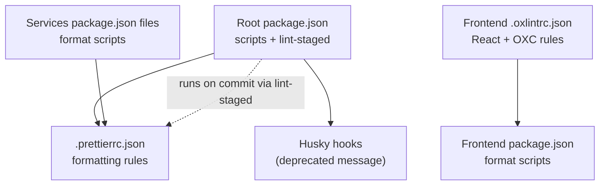
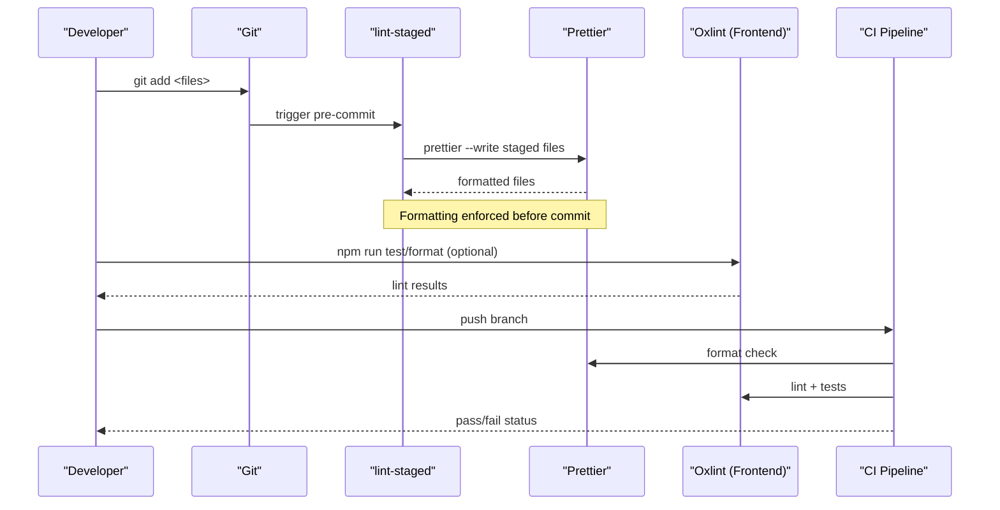
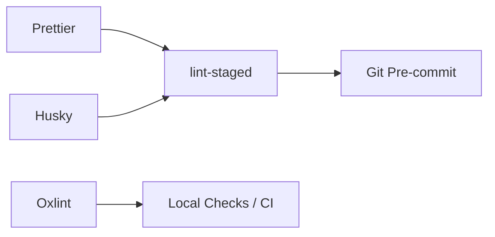

# Coding Standards and Quality

<cite>
**Referenced Files in This Document**
- [.prettierrc.json](file://.prettierrc.json)
- [package.json](file://package.json)
- [frontend/.oxlintrc.json](file://frontend/.oxlintrc.json)
- [frontend/package.json](file://frontend/package.json)
- [services/auth-service/package.json](file://services/auth-service/package.json)
- [services/dashboard-service/package.json](file://services/dashboard-service/package.json)
- [.husky/_/husky.sh](file://.husky/_/husky.sh)
</cite>

## Table of Contents

1. [Introduction](#introduction)
2. [Project Structure](#project-structure)
3. [Core Components](#core-components)
4. [Architecture Overview](#architecture-overview)
5. [Detailed Component Analysis](#detailed-component-analysis)
6. [Dependency Analysis](#dependency-analysis)
7. [Performance Considerations](#performance-considerations)
8. [Troubleshooting Guide](#troubleshooting-guide)
9. [Conclusion](#conclusion)
10. [Appendices](#appendices)

## Introduction

This document defines the coding standards and quality enforcement for the Codacaine project. It explains how formatting is standardized with Prettier, how code quality checks are configured using Oxlint (a fast ESLint-compatible linter), and how pre-commit hooks enforce consistency before changes are committed. It also provides guidelines for clean code, naming conventions, file organization, and code review best practices, along with examples and troubleshooting tips for common issues.

## Project Structure

The repository uses a monorepo layout with shared tooling at the root and per-package configurations where needed:

- Root-level Prettier configuration applies across JavaScript, TypeScript, CSS, JSON, Markdown, and YAML files.
- The frontend uses Oxlint for linting rules specific to React and OXC plugins.
- Each service includes its own package scripts for formatting and testing.
- Husky is present but currently shows a deprecation notice; integration with lint-staged is defined at the root.

**Diagram sources**

- [package.json:6-23](file://package.json#L6-L23)
- [.prettierrc.json:1-9](file://.prettierrc.json#L1-L9)
- [frontend/.oxlintrc.json:1-8](file://frontend/.oxlintrc.json#L1-L8)
- [frontend/package.json:6-14](file://frontend/package.json#L6-L14)
- [services/auth-service/package.json:6-12](file://services/auth-service/package.json#L6-L12)
- [services/dashboard-service/package.json:6-12](file://services/dashboard-service/package.json#L6-L12)

**Section sources**

- [package.json:6-23](file://package.json#L6-L23)
- [.prettierrc.json:1-9](file://.prettierrc.json#L1-L9)
- [frontend/.oxlintrc.json:1-8](file://frontend/.oxlintrc.json#L1-L8)
- [frontend/package.json:6-14](file://frontend/package.json#L6-L14)
- [services/auth-service/package.json:6-12](file://services/auth-service/package.json#L6-L12)
- [services/dashboard-service/package.json:6-12](file://services/dashboard-service/package.json#L6-L12)

## Core Components

- Prettier configuration enforces consistent formatting across JS, TS, JSX, TSX, CSS, JSON, Markdown, and YAML.
- Linting is performed by Oxlint in the frontend with React and OXC plugin rules.
- Pre-commit automation is configured via lint-staged patterns in the root package.json.
- Husky is present but currently displays a deprecation notice; hook execution may rely on other mechanisms or CI.

Key responsibilities:

- Formatting: Prettier ensures uniform style without manual effort.
- Linting: Oxlint catches potential bugs and enforces React best practices.
- Automation: lint-staged runs Prettier on staged files before commits.
- Scripts: Consistent format commands exist in multiple packages.

**Section sources**

- [.prettierrc.json:1-9](file://.prettierrc.json#L1-L9)
- [frontend/.oxlintrc.json:1-8](file://frontend/.oxlintrc.json#L1-L8)
- [package.json:6-23](file://package.json#L6-L23)
- [frontend/package.json:6-14](file://frontend/package.json#L6-L14)
- [services/auth-service/package.json:6-12](file://services/auth-service/package.json#L6-L12)
- [services/dashboard-service/package.json:6-12](file://services/dashboard-service/package.json#L6-L12)

## Architecture Overview

The quality pipeline integrates formatting and linting into development workflows:

- Developers stage changes.
- lint-staged triggers Prettier on matching file types.
- Optional local linting via Oxlint can be run manually or integrated further.
- CI pipelines can enforce checks as part of build/test steps.

**Diagram sources**

- [package.json:6-23](file://package.json#L6-L23)
- [frontend/package.json:6-14](file://frontend/package.json#L6-L14)
- [frontend/.oxlintrc.json:1-8](file://frontend/.oxlintrc.json#L1-L8)

## Detailed Component Analysis

### Prettier Configuration

- Semicolons enabled for consistent statement termination.
- Single quotes preferred for string literals.
- Tab width set to 2 spaces for readability.
- Trailing commas added where valid in ES5 contexts.
- Print width set to 100 characters to balance readability and screen real estate.
- Arrow functions always wrapped in parentheses for clarity.
- Line endings normalized to LF for cross-platform consistency.

These settings apply uniformly across supported file types through the root configuration.

**Section sources**

- [.prettierrc.json:1-9](file://.prettierrc.json#L1-L9)

### Linting with Oxlint (Frontend)

- Uses the OXC schema for configuration.
- Enables React and OXC plugins.
- Enforces React hooks rules to prevent misuse of hooks.
- Warns on non-constant exports to encourage stable module interfaces.

Run linting locally via the frontend’s scripts or integrate into your editor for instant feedback.

**Section sources**

- [frontend/.oxlintrc.json:1-8](file://frontend/.oxlintrc.json#L1-L8)
- [frontend/package.json:6-14](file://frontend/package.json#L6-L14)

### Pre-commit Hooks and Automation

- lint-staged is configured at the root to run Prettier on staged files for JS, JSX, TS, TSX, JSON, CSS, Markdown, YAML, and HTML.
- The prepare script initializes Husky.
- Husky currently prints a deprecation notice; ensure your environment supports the current version or update accordingly.

Recommended workflow:

- Stage only relevant files.
- Commit will automatically format them via lint-staged.
- If formatting fails, fix the reported issues and re-stage.

**Section sources**

- [package.json:6-23](file://package.json#L6-L23)
- [.husky/_/husky.sh:1-9](file://.husky/_/husky.sh#L1-L9)

### Service-Level Formatting

Each service exposes consistent scripts:

- format: formats all files in the service directory.
- format:check: validates formatting without writing.

Use these scripts when working within a specific service to maintain local consistency.

**Section sources**

- [services/auth-service/package.json:6-12](file://services/auth-service/package.json#L6-L12)
- [services/dashboard-service/package.json:6-12](file://services/dashboard-service/package.json#L6-L12)

### Frontend Formatting Scripts

The frontend package includes:

- format: formats all files in the frontend directory.
- format:check: validates formatting without writing.

These scripts complement the root lint-staged configuration and can be used independently during development.

**Section sources**

- [frontend/package.json:6-14](file://frontend/package.json#L6-L14)

### Code Review Best Practices

- Ensure all files pass formatting and linting before requesting reviews.
- Keep commits focused and descriptive; avoid mixing formatting changes with feature changes.
- Prefer small, incremental changes to simplify review.
- Validate that new React components follow hooks rules and export conventions.
- Use consistent naming and file organization patterns as outlined below.

[No sources needed since this section provides general guidance]

### Naming Conventions

- Variables and functions: camelCase.
- Components and classes: PascalCase.
- Constants: UPPER_SNAKE_CASE for global constants; camelCase for module-scoped constants if appropriate.
- Files:
  - Components: PascalCase.tsx (e.g., UserProfile.tsx).
  - Utilities: camelCase.js or .ts (e.g., formatDate.js).
  - Tests: colocate with source or use **tests** directories; name tests after the unit under test.

[No sources needed since this section provides general guidance]

### File Organization Patterns

- Group by feature or domain within each package (e.g., services, pages, components).
- Keep related files together (components, styles, tests).
- Avoid deep nesting; prefer flat structures for discoverability.
- Use clear, descriptive names that reflect purpose.

[No sources needed since this section provides general guidance]

### Examples of Properly Formatted Code

- Follow single quotes, semicolons, trailing commas, and 2-space indentation consistently.
- Wrap arrow function parameters in parentheses even for single parameters.
- Keep line length within the configured print width.
- Normalize line endings to LF.

To verify formatting, run the format scripts in the relevant package or rely on lint-staged during commits.

**Section sources**

- [.prettierrc.json:1-9](file://.prettierrc.json#L1-L9)
- [package.json:6-23](file://package.json#L6-L23)
- [frontend/package.json:6-14](file://frontend/package.json#L6-L14)

## Dependency Analysis

Quality tooling dependencies and their roles:

- Prettier: formatting engine applied across file types.
- lint-staged: runs Prettier on staged files to enforce formatting at commit time.
- Husky: hook manager (currently showing deprecation notice).
- Oxlint: frontend linter enforcing React and OXC rules.

**Diagram sources**

- [package.json:6-23](file://package.json#L6-L23)
- [frontend/.oxlintrc.json:1-8](file://frontend/.oxlintrc.json#L1-L8)
- [.husky/_/husky.sh:1-9](file://.husky/_/husky.sh#L1-L9)

**Section sources**

- [package.json:6-23](file://package.json#L6-L23)
- [frontend/.oxlintrc.json:1-8](file://frontend/.oxlintrc.json#L1-L8)
- [.husky/_/husky.sh:1-9](file://.husky/_/husky.sh#L1-L9)

## Performance Considerations

- Use lint-staged to limit formatting to staged files, reducing overhead during large commits.
- Run Oxlint locally for quick feedback; it is optimized for speed.
- Keep Prettier configuration minimal and centralized to avoid conflicts.
- In CI, run format checks and linting in parallel stages to reduce total build time.

[No sources needed since this section provides general guidance]

## Troubleshooting Guide

Common issues and resolutions:

- Formatting failures on commit:
  - Ensure you have staged only intended files.
  - Run the format script in the relevant package to auto-fix issues.
  - Re-stage and commit again.
- Oxlint warnings/errors:
  - Fix React hooks usage according to the rules.
  - Adjust exports to comply with constant export policy.
- Husky deprecation notice:
  - Update Husky to a supported version or adjust hook setup per documentation.
  - Verify that lint-staged still executes correctly despite the notice.

Verification steps:

- Run format checks locally before pushing.
- Use the frontend’s test and format scripts to validate changes.
- Confirm CI passes formatting and linting gates.

**Section sources**

- [package.json:6-23](file://package.json#L6-L23)
- [frontend/package.json:6-14](file://frontend/package.json#L6-L14)
- [frontend/.oxlintrc.json:1-8](file://frontend/.oxlintrc.json#L1-L8)
- [.husky/_/husky.sh:1-9](file://.husky/_/husky.sh#L1-L9)

## Conclusion

Codacaine enforces consistent code style and quality through a combination of Prettier, Oxlint, and pre-commit automation. By following the guidelines here—using the provided scripts, adhering to naming and organization conventions, and leveraging automated checks—you can maintain a clean, readable, and reliable codebase. Address linting and formatting issues early, keep commits focused, and rely on CI to catch regressions.

[No sources needed since this section summarizes without analyzing specific files]

## Appendices

### Quick Commands Reference

- Root formatting:
  - Format all files: npm run format
  - Check formatting: npm run format:check
- Frontend formatting:
  - Format all files: npm run format
  - Check formatting: npm run format:check
- Services formatting:
  - Format all files: npm run format
  - Check formatting: npm run format:check

**Section sources**

- [package.json:6-23](file://package.json#L6-L23)
- [frontend/package.json:6-14](file://frontend/package.json#L6-L14)
- [services/auth-service/package.json:6-12](file://services/auth-service/package.json#L6-L12)
- [services/dashboard-service/package.json:6-12](file://services/dashboard-service/package.json#L6-L12)
