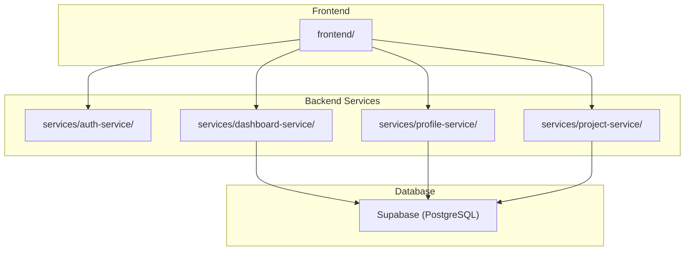
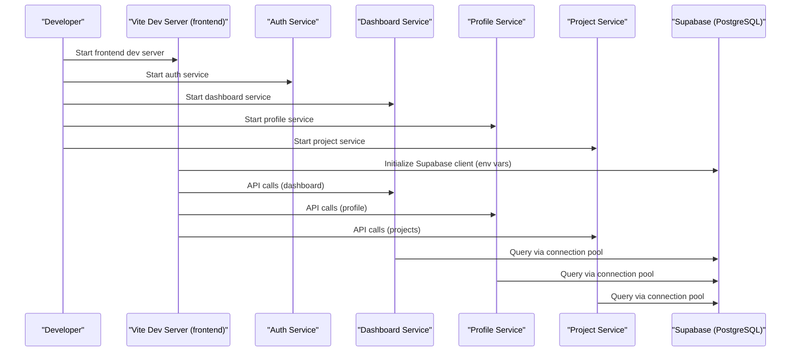
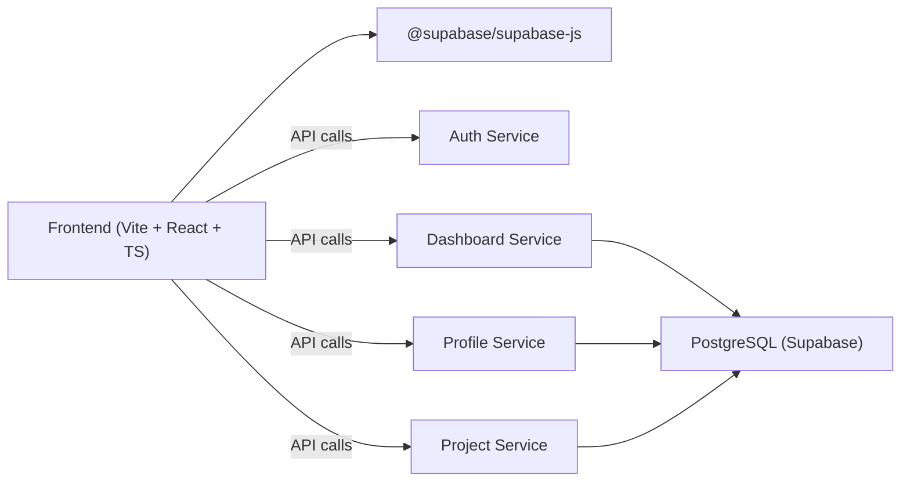

# Development Environment Setup

<cite>
**Referenced Files in This Document**
- [package.json](file://package.json)
- [frontend/package.json](file://frontend/package.json)
- [frontend/vite.config.ts](file://frontend/vite.config.ts)
- [services/auth-service/package.json](file://services/auth-service/package.json)
- [services/dashboard-service/package.json](file://services/dashboard-service/package.json)
- [services/profile-service/package.json](file://services/profile-service/package.json)
- [services/project-service/package.json](file://services/project-service/package.json)
- [services/dashboard-service/src/config.js](file://services/dashboard-service/src/config.js)
- [services/profile-service/src/config.js](file://services/profile-service/src/config.js)
- [services/project-service/src/config.js](file://services/project-service/src/config.js)
- [services/dashboard-service/src/db.js](file://services/dashboard-service/src/db.js)
- [services/profile-service/src/db.js](file://services/profile-service/src/db.js)
- [services/project-service/src/db.js](file://services/project-service/src/db.js)
- [frontend/src/lib/supabase.ts](file://frontend/src/lib/supabase.ts)
- [supabase/setup.sql](file://supabase/setup.sql)
</cite>

## Table of Contents

1. Introduction
2. Project Structure
3. Core Components
4. Architecture Overview
5. Detailed Component Analysis
6. Dependency Analysis
7. Performance Considerations
8. Troubleshooting Guide
9. Conclusion

## Introduction

This document explains how to set up a complete local development environment for the Codacaine project. It covers Node.js requirements, installing dependencies via npm workspaces, configuring environment variables for Supabase and PostgreSQL-backed services, initializing the database schema, and starting all services simultaneously. It also documents hot reload behavior for the frontend (Vite) and backend services, debugging techniques for TypeScript and JavaScript, IDE recommendations, common setup issues, and performance tips for local development.

## Project Structure

Codacaine is a monorepo with:

- A React + Vite frontend under frontend/
- Multiple Express-based microservices under services/ (auth-service, dashboard-service, profile-service, project-service)
- Database migrations and setup SQL under supabase/
- Root-level scripts for database migration and tooling

**Diagram sources**

- [frontend/package.json:1-45](file://frontend/package.json#L1-L45)
- [services/auth-service/package.json:1-41](file://services/auth-service/package.json#L1-L41)
- [services/dashboard-service/package.json:1-43](file://services/dashboard-service/package.json#L1-L43)
- [services/profile-service/package.json:1-43](file://services/profile-service/package.json#L1-L43)
- [services/project-service/package.json:1-58](file://services/project-service/package.json#L1-L58)

**Section sources**

- [package.json:1-25](file://package.json#L1-L25)
- [frontend/package.json:1-45](file://frontend/package.json#L1-L45)

## Core Components

- Frontend: React application built with Vite, using TypeScript and Supabase client for data access.
- Backend Services: Express-based microservices that connect to a PostgreSQL-compatible database (Supabase). Each service loads environment variables and initializes a connection pool.
- Database: Supabase-hosted PostgreSQL; schema and stored procedures are defined in SQL files.

Key responsibilities:

- Frontend serves UI and communicates with backend services and Supabase.
- Backend services expose APIs and interact with the database.
- Database holds user profiles, projects, entries, activity logs, and related metadata.

**Section sources**

- [frontend/src/lib/supabase.ts:1-34](file://frontend/src/lib/supabase.ts#L1-L34)
- [services/dashboard-service/src/db.js:1-32](file://services/dashboard-service/src/db.js#L1-L32)
- [services/profile-service/src/db.js:1-32](file://services/profile-service/src/db.js#L1-L32)
- [services/project-service/src/db.js:1-32](file://services/project-service/src/db.js#L1-L32)

## Architecture Overview

The development architecture connects the Vite dev server to multiple backend services, which in turn connect to a Supabase PostgreSQL instance. The frontend uses environment variables to configure the Supabase client. Backend services load environment variables at startup and initialize a pooled database connection.

**Diagram sources**

- [frontend/vite.config.ts:1-16](file://frontend/vite.config.ts#L1-L16)
- [frontend/src/lib/supabase.ts:1-34](file://frontend/src/lib/supabase.ts#L1-L34)
- [services/dashboard-service/src/db.js:1-32](file://services/dashboard-service/src/db.js#L1-L32)
- [services/profile-service/src/db.js:1-32](file://services/profile-service/src/db.js#L1-L32)
- [services/project-service/src/db.js:1-32](file://services/project-service/src/db.js#L1-L32)

## Detailed Component Analysis

### Node.js Version Requirements

- Use a modern LTS version of Node.js compatible with the project’s toolchain (TypeScript ~5.8, Vite 6.x, Express 5.x). Install via your preferred Node version manager (e.g., nvm).
- Verify installation by running the root package scripts and ensuring no engine errors occur.

[No sources needed since this section provides general guidance]

### Installing Dependencies with npm Workspaces

- The repository includes a root package.json with workspace-aware scripts for formatting and database tooling.
- Run the standard install from the repository root to bootstrap all packages and link workspaces.
- After installation, verify each service has its node_modules installed.

Commands:

- From the repository root: run the package manager install command to install all dependencies across workspaces.
- Confirm that frontend and services directories have their dependencies installed.

**Section sources**

- [package.json:1-25](file://package.json#L1-L25)
- [frontend/package.json:1-45](file://frontend/package.json#L1-L45)
- [services/auth-service/package.json:1-41](file://services/auth-service/package.json#L1-L41)
- [services/dashboard-service/package.json:1-43](file://services/dashboard-service/package.json#L1-L43)
- [services/profile-service/package.json:1-43](file://services/profile-service/package.json#L1-L43)
- [services/project-service/package.json:1-58](file://services/project-service/package.json#L1-L58)

### Environment Variables Configuration

- Frontend:
  - Set VITE_SUPABASE_URL and VITE_SUPABASE_ANON_KEY in a .env file at the frontend directory. These values are read by the Supabase client initialization module.
- Backend Services:
  - Each service loads environment variables via dotenv at startup.
  - Ensure DATABASE_URL is present for services that query the database (dashboard, profile, project). The services create a PostgreSQL connection pool using this URL and validate connectivity on startup.

Environment variable summary:

- Frontend:
  - VITE_SUPABASE_URL: Supabase project URL
  - VITE_SUPABASE_ANON_KEY: Supabase anonymous key
- Backend:
  - DATABASE_URL: PostgreSQL connection string (Supabase)

Notes:

- If DATABASE_URL is missing, services will start but database operations will fail or log warnings/errors.
- The Supabase client validates credentials and throws if not configured.

**Section sources**

- [frontend/src/lib/supabase.ts:1-34](file://frontend/src/lib/supabase.ts#L1-L34)
- [services/dashboard-service/src/config.js:1-4](file://services/dashboard-service/src/config.js#L1-L4)
- [services/profile-service/src/config.js:1-4](file://services/profile-service/src/config.js#L1-L4)
- [services/project-service/src/config.js:1-4](file://services/project-service/src/config.js#L1-L4)
- [services/dashboard-service/src/db.js:1-32](file://services/dashboard-service/src/db.js#L1-L32)
- [services/profile-service/src/db.js:1-32](file://services/profile-service/src/db.js#L1-L32)
- [services/project-service/src/db.js:1-32](file://services/project-service/src/db.js#L1-L32)

### Database Initialization with Supabase

- Apply the provided SQL setup to your Supabase project to create tables, functions, and scheduled jobs required by the application.
- The setup script defines core tables (users, activity_log), account lifecycle functions, statistics functions, and cron jobs for cleanup.

Steps:

- Open the Supabase SQL Editor and run the entire setup script once to provision the schema and functions.
- Verify that tables and functions exist after execution.

**Section sources**

- [supabase/setup.sql:1-363](file://supabase/setup.sql#L1-L363)

### Starting All Services Simultaneously

- Frontend:
  - Use the frontend dev script to start the Vite development server with hot reload enabled.
- Backend Services:
  - Each service provides a dev script that runs with nodemon for automatic restarts on code changes.
  - Start each service in separate terminals or use a process manager to run them concurrently.

Recommended workflow:

- Terminal 1: Start frontend dev server.
- Terminals 2–5: Start each backend service (auth, dashboard, profile, project).
- Ensure environment variables are set in each service’s context before starting.

Hot reload behavior:

- Frontend: Vite provides instant hot module replacement for TypeScript/React changes.
- Backend: Nodemon restarts services automatically when source files change.

**Section sources**

- [frontend/package.json:1-45](file://frontend/package.json#L1-L45)
- [frontend/vite.config.ts:1-16](file://frontend/vite.config.ts#L1-L16)
- [services/auth-service/package.json:1-41](file://services/auth-service/package.json#L1-L41)
- [services/dashboard-service/package.json:1-43](file://services/dashboard-service/package.json#L1-L43)
- [services/profile-service/package.json:1-43](file://services/profile-service/package.json#L1-L43)
- [services/project-service/package.json:1-58](file://services/project-service/package.json#L1-L58)

### Debugging Techniques

- Frontend (TypeScript + Vite):
  - Use browser developer tools to debug TypeScript directly; Vite maps sources to original TS files.
  - Configure breakpoints in VS Code with the Chrome Debugger extension; ensure launch configuration targets localhost port used by Vite.
- Backend (JavaScript + Express):
  - Use Node.js inspector with nodemon to attach a debugger in your IDE or browser.
  - Add console logging around critical paths; services log connection status and errors during startup.

Tips:

- For Supabase client issues, inspect environment variables and network requests in the browser.
- For database connectivity, check service logs for connection success/failure messages.

[No sources needed since this section provides general guidance]

### IDE Recommendations

- Visual Studio Code:
  - Extensions: ESLint, Prettier, TypeScript, Jest, Docker (if needed), GitLens.
  - Enable format-on-save and integrate with the project’s Prettier configuration.
- JetBrains WebStorm / IntelliJ IDEA:
  - Built-in support for TypeScript, Vite, Jest, and Node.js debugging.
- General:
  - Use a Node version manager (nvm) to switch between Node versions easily.
  - Keep lint-staged and Husky hooks enabled for consistent formatting and pre-commit checks.

[No sources needed since this section provides general guidance]

## Dependency Analysis

The frontend depends on Vite, React, TypeScript, and the Supabase client. Backend services depend on Express, dotenv, and pg (for PostgreSQL connections). The root package manages shared tooling and database scripts.

**Diagram sources**

- [frontend/package.json:1-45](file://frontend/package.json#L1-L45)
- [services/dashboard-service/package.json:1-43](file://services/dashboard-service/package.json#L1-L43)
- [services/profile-service/package.json:1-43](file://services/profile-service/package.json#L1-L43)
- [services/project-service/package.json:1-58](file://services/project-service/package.json#L1-L58)

**Section sources**

- [frontend/package.json:1-45](file://frontend/package.json#L1-L45)
- [services/dashboard-service/package.json:1-43](file://services/dashboard-service/package.json#L1-L43)
- [services/profile-service/package.json:1-43](file://services/profile-service/package.json#L1-L43)
- [services/project-service/package.json:1-58](file://services/project-service/package.json#L1-L58)

## Performance Considerations

- Frontend:
  - Vite’s HMR provides fast feedback; keep modules small and avoid heavy synchronous operations in render paths.
  - Use lazy loading for routes and components where appropriate.
- Backend:
  - Connection pooling is already configured; ensure DATABASE_URL points to a healthy instance.
  - Avoid unnecessary queries in hot paths; leverage indexes and stored procedures where applicable.
- Local Development:
  - Run services in separate processes to isolate resource usage.
  - Limit concurrent test runs and coverage generation to reduce CPU/memory pressure.

[No sources needed since this section provides general guidance]

## Troubleshooting Guide

Common issues and resolutions:

- Missing environment variables:
  - Frontend: Ensure VITE_SUPABASE_URL and VITE_SUPABASE_ANON_KEY are set; the Supabase client will warn or throw if absent.
  - Backend: Ensure DATABASE_URL is set; services will warn or error when attempting to connect without it.
- Database connection failures:
  - Check that DATABASE_URL is correct and SSL settings match Supabase requirements.
  - Review service logs for connection pool errors on startup.
- Port conflicts:
  - Vite defaults to port 3000; adjust if another process is using it.
- Hot reload not triggering:
  - Ensure you are running the dev scripts (not production builds).
  - Verify nodemon is installed and active for backend services.

Verification steps:

- Frontend: Open the browser console to check for Supabase client warnings or errors.
- Backend: Inspect startup logs for “PostgreSQL pool connected successfully” or failure messages.

**Section sources**

- [frontend/src/lib/supabase.ts:1-34](file://frontend/src/lib/supabase.ts#L1-L34)
- [services/dashboard-service/src/db.js:1-32](file://services/dashboard-service/src/db.js#L1-L32)
- [services/profile-service/src/db.js:1-32](file://services/profile-service/src/db.js#L1-L32)
- [services/project-service/src/db.js:1-32](file://services/project-service/src/db.js#L1-L32)
- [frontend/vite.config.ts:1-16](file://frontend/vite.config.ts#L1-L16)

## Conclusion

You now have a complete guide to setting up the Codacaine development environment: installing dependencies across workspaces, configuring environment variables for Supabase and PostgreSQL-backed services, initializing the database schema, and starting all services with hot reload. Follow the troubleshooting tips to resolve common issues and adopt the recommended debugging and IDE practices for an efficient development workflow.

[No sources needed since this section summarizes without analyzing specific files]
