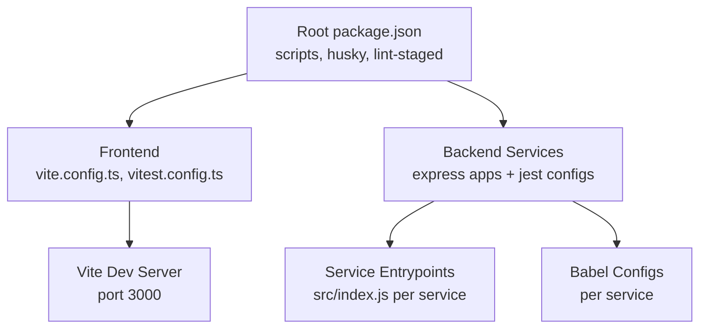
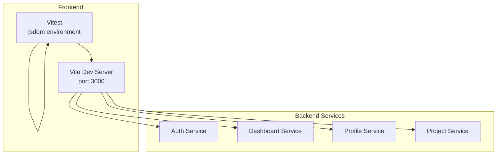
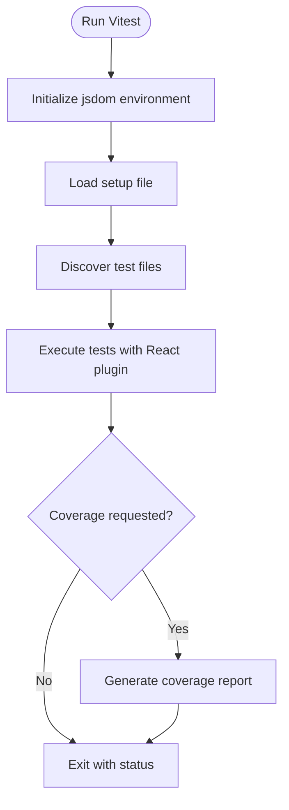
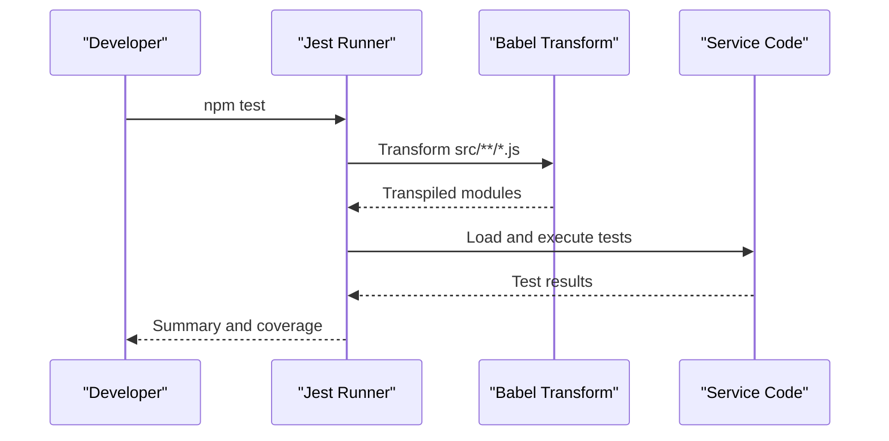
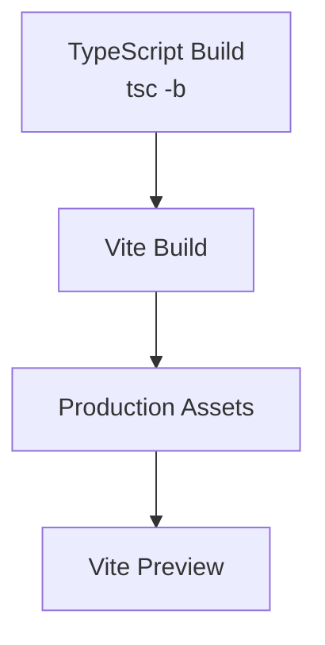
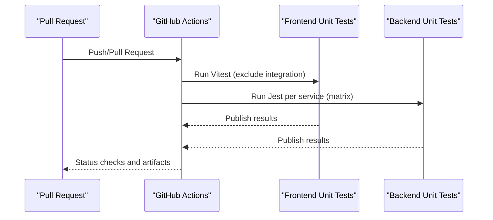
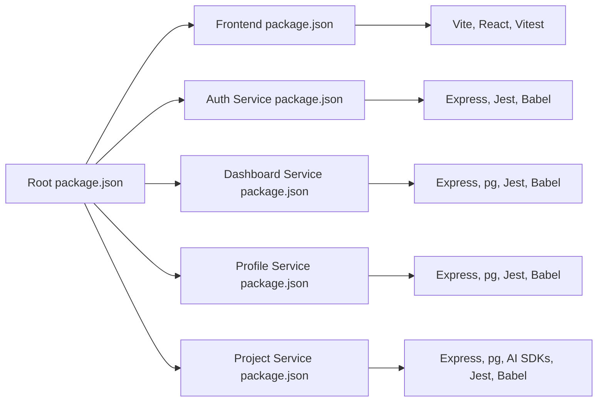

# Development Guide

<cite>
**Referenced Files in This Document**
- [package.json](file://package.json)
- [.prettierrc.json](file://.prettierrc.json)
- [frontend/package.json](file://frontend/package.json)
- [frontend/vite.config.ts](file://frontend/vite.config.ts)
- [frontend/vitest.config.ts](file://frontend/vitest.config.ts)
- [services/auth-service/package.json](file://services/auth-service/package.json)
- [services/dashboard-service/package.json](file://services/dashboard-service/package.json)
- [services/profile-service/package.json](file://services/profile-service/package.json)
- [services/project-service/package.json](file://services/project-service/package.json)
- [services/auth-service/babel.config.js](file://services/auth-service/babel.config.js)
- [services/dashboard-service/babel.config.js](file://services/dashboard-service/babel.config.js)
- [services/profile-service/babel.config.js](file://services/profile-service/babel.config.js)
- [services/project-service/babel.config.js](file://services/project-service/babel.config.js)
- [.github/workflows/frontend-unit-tests.yml](file://.github/workflows/frontend-unit-tests.yml)
- [.github/workflows/backend-unit-tests.yml](file://.github/workflows/backend-unit-tests.yml)
</cite>

## Table of Contents

1. Introduction
2. Project Structure
3. Core Components
4. Architecture Overview
5. Detailed Component Analysis
6. Dependency Analysis
7. Performance Considerations
8. Troubleshooting Guide
9. Conclusion
10. Appendices

## Introduction

This guide explains how to set up the development environment, run local servers with hot reload, configure debugging, and follow coding standards for the Codacaine monorepo. It covers testing strategies (Vitest for frontend, Jest for backend), build processes (Vite for frontend, Babel for backend), code quality tools (Prettier, Husky), and CI workflows that enforce tests on pull requests and pushes.

## Project Structure

Codacaine is a monorepo with:

- Frontend application built with Vite and React
- Backend microservices (auth, dashboard, profile, project) using Express and Node.js
- Shared configuration for formatting and linting at the repository root
- GitHub Actions workflows for automated testing

**Diagram sources**

- [package.json:6-23](file://package.json#L6-L23)
- [frontend/vite.config.ts:5-15](file://frontend/vite.config.ts#L5-L15)
- [frontend/vitest.config.ts:5-17](file://frontend/vitest.config.ts#L5-L17)
- [services/auth-service/package.json:6-13](file://services/auth-service/package.json#L6-L13)
- [services/dashboard-service/package.json:6-13](file://services/dashboard-service/package.json#L6-L13)
- [services/profile-service/package.json:6-13](file://services/profile-service/package.json#L6-L13)
- [services/project-service/package.json:6-13](file://services/project-service/package.json#L6-L13)

**Section sources**

- [package.json:6-23](file://package.json#L6-L23)
- [frontend/vite.config.ts:5-15](file://frontend/vite.config.ts#L5-L15)
- [frontend/vitest.config.ts:5-17](file://frontend/vitest.config.ts#L5-L17)
- [services/auth-service/package.json:6-13](file://services/auth-service/package.json#L6-L13)
- [services/dashboard-service/package.json:6-13](file://services/dashboard-service/package.json#L6-L13)
- [services/profile-service/package.json:6-13](file://services/profile-service/package.json#L6-L13)
- [services/project-service/package.json:6-13](file://services/project-service/package.json#L6-L13)

## Core Components

- Root scripts: formatting, database migrations, and Husky initialization
- Frontend dev/build/test: Vite server, TypeScript build, Vitest unit tests, coverage
- Backend services: Express entrypoints, nodemon for dev, Jest for unit/integration tests, Babel transpilation for tests
- Code quality: Prettier rules enforced via CLI and pre-commit hooks

Key responsibilities:

- Frontend: UI, routing, state, API integration, caching, SSE
- Backend services: REST endpoints, business logic, DB access, AI integrations (project-service)
- Quality gates: Prettier formatting, Husky pre-commit, CI test jobs

**Section sources**

- [package.json:6-23](file://package.json#L6-L23)
- [frontend/package.json:6-14](file://frontend/package.json#L6-L14)
- [services/auth-service/package.json:6-13](file://services/auth-service/package.json#L6-L13)
- [services/dashboard-service/package.json:6-13](file://services/dashboard-service/package.json#L6-L13)
- [services/profile-service/package.json:6-13](file://services/profile-service/package.json#L6-L13)
- [services/project-service/package.json:6-13](file://services/project-service/package.json#L6-L13)

## Architecture Overview

The system uses a modular architecture:

- Frontend runs locally on port 3000 with hot module replacement via Vite
- Backend services run independently with nodemon during development
- Tests are isolated per component: Vitest for frontend, Jest for backend
- CI enforces consistent test execution across branches

**Diagram sources**

- [frontend/vite.config.ts:12-15](file://frontend/vite.config.ts#L12-L15)
- [frontend/vitest.config.ts:12-16](file://frontend/vitest.config.ts#L12-L16)
- [services/auth-service/package.json:6-13](file://services/auth-service/package.json#L6-L13)
- [services/dashboard-service/package.json:6-13](file://services/dashboard-service/package.json#L6-L13)
- [services/profile-service/package.json:6-13](file://services/profile-service/package.json#L6-L13)
- [services/project-service/package.json:6-13](file://services/project-service/package.json#L6-L13)

## Detailed Component Analysis

### Development Environment Setup

- Install dependencies at the repository root and within each workspace
- Initialize Husky once after install to enable pre-commit hooks
- Configure environment variables per service as required by .env files

Local server configuration:

- Frontend: Run the Vite development server; it serves on port 3000 by default
- Backend: Use nodemon to auto-restart services on file changes

Hot reload setup:

- Frontend: Vite provides HMR out of the box
- Backend: nodemon watches source files and restarts the process

Debugging techniques:

- Frontend: Use browser developer tools and Vitest watch mode for interactive testing
- Backend: Attach debugger to Node processes started by nodemon or use console logging

**Section sources**

- [package.json:6-23](file://package.json#L6-L23)
- [frontend/package.json:6-14](file://frontend/package.json#L6-L14)
- [frontend/vite.config.ts:12-15](file://frontend/vite.config.ts#L12-L15)
- [services/auth-service/package.json:6-13](file://services/auth-service/package.json#L6-L13)
- [services/dashboard-service/package.json:6-13](file://services/dashboard-service/package.json#L6-L13)
- [services/profile-service/package.json:6-13](file://services/profile-service/package.json#L6-L13)
- [services/project-service/package.json:6-13](file://services/project-service/package.json#L6-L13)

### Coding Standards and Pre-commit Hooks

- Prettier enforces consistent formatting across JS/TS/JSON/CSS/MD/YAML/HTML
- Repository-level Prettier config defines semicolons, quotes, tab width, trailing commas, print width, arrow parens, and line endings
- Husky initializes pre-commit hooks; lint-staged formats staged files before commit

Usage:

- Format all files: use the root format script
- Check formatting without writing: use the format:check script
- Committing triggers automatic formatting of staged files

**Section sources**

- [.prettierrc.json:1-10](file://.prettierrc.json#L1-L10)
- [package.json:6-23](file://package.json#L6-L23)

### Testing Strategy

#### Frontend Testing with Vitest

- Unit tests run in jsdom environment with React plugin enabled
- Global test utilities are available via globals configuration
- A setup file initializes test fixtures and mocks

Commands:

- Run all tests: npm test
- Watch mode: npm run test:watch
- Coverage: npm run test:coverage

Integration tests:

- Integration tests are excluded from CI unit job to keep checks fast; run them locally when needed

**Diagram sources**

- [frontend/vitest.config.ts:5-17](file://frontend/vitest.config.ts#L5-L17)
- [frontend/package.json:6-14](file://frontend/package.json#L6-L14)

**Section sources**

- [frontend/vitest.config.ts:5-17](file://frontend/vitest.config.ts#L5-L17)
- [frontend/package.json:6-14](file://frontend/package.json#L6-L14)

#### Backend Testing with Jest

- Each service has its own Jest configuration
- Babel transforms JavaScript for tests using @babel/preset-env
- Coverage collection excludes test and mock directories

Commands per service:

- Run tests: npm test
- Coverage: npm run test:coverage

**Diagram sources**

- [services/auth-service/package.json:32-39](file://services/auth-service/package.json#L32-L39)
- [services/dashboard-service/package.json:32-41](file://services/dashboard-service/package.json#L32-L41)
- [services/profile-service/package.json:32-41](file://services/profile-service/package.json#L32-L41)
- [services/project-service/package.json:44-56](file://services/project-service/package.json#L44-L56)
- [services/auth-service/babel.config.js:1-4](file://services/auth-service/babel.config.js#L1-L4)
- [services/dashboard-service/babel.config.js:1-4](file://services/dashboard-service/babel.config.js#L1-L4)
- [services/profile-service/babel.config.js:1-4](file://services/profile-service/babel.config.js#L1-L4)
- [services/project-service/babel.config.js:1-4](file://services/project-service/babel.config.js#L1-L4)

**Section sources**

- [services/auth-service/package.json:6-13](file://services/auth-service/package.json#L6-L13)
- [services/dashboard-service/package.json:6-13](file://services/dashboard-service/package.json#L6-L13)
- [services/profile-service/package.json:6-13](file://services/profile-service/package.json#L6-L13)
- [services/project-service/package.json:6-13](file://services/project-service/package.json#L6-L13)
- [services/auth-service/babel.config.js:1-4](file://services/auth-service/babel.config.js#L1-L4)
- [services/dashboard-service/babel.config.js:1-4](file://services/dashboard-service/babel.config.js#L1-L4)
- [services/profile-service/babel.config.js:1-4](file://services/profile-service/babel.config.js#L1-L4)
- [services/project-service/babel.config.js:1-4](file://services/project-service/babel.config.js#L1-L4)

### Build Process

#### Frontend Build with Vite

- TypeScript compilation precedes bundling
- Vite builds optimized production assets
- Preview command serves the build locally

Commands:

- Build: npm run build
- Preview: npm run preview

**Diagram sources**

- [frontend/package.json:6-14](file://frontend/package.json#L6-L14)

**Section sources**

- [frontend/package.json:6-14](file://frontend/package.json#L6-L14)

#### Backend Transpilation with Babel

- Babel presets target current Node version for compatibility
- Jest uses babel-jest to transform source files during tests
- Production runs typically use native Node features; Babel primarily supports test environments

**Section sources**

- [services/auth-service/babel.config.js:1-4](file://services/auth-service/babel.config.js#L1-L4)
- [services/dashboard-service/babel.config.js:1-4](file://services/dashboard-service/babel.config.js#L1-L4)
- [services/profile-service/babel.config.js:1-4](file://services/profile-service/babel.config.js#L1-L4)
- [services/project-service/babel.config.js:1-4](file://services/project-service/babel.config.js#L1-L4)

### Code Review Processes and Pull Request Workflows

- CI runs frontend unit tests and backend unit tests on push and pull request events
- Frontend CI excludes integration tests to keep checks fast; run integration tests locally
- Backend CI runs unit tests across all services in parallel using a matrix strategy
- Test results are published and uploaded as artifacts for review

**Diagram sources**

- [.github/workflows/frontend-unit-tests.yml:1-58](file://.github/workflows/frontend-unit-tests.yml#L1-L58)
- [.github/workflows/backend-unit-tests.yml:1-68](file://.github/workflows/backend-unit-tests.yml#L1-L68)

**Section sources**

- [.github/workflows/frontend-unit-tests.yml:1-58](file://.github/workflows/frontend-unit-tests.yml#L1-L58)
- [.github/workflows/backend-unit-tests.yml:1-68](file://.github/workflows/backend-unit-tests.yml#L1-L68)

## Dependency Analysis

- Frontend depends on Vite, React, Supabase client, IndexedDB helpers, and testing libraries
- Backend services depend on Express, CORS, dotenv, and database drivers where applicable
- Testing tooling is isolated per workspace to avoid cross-contamination
- Formatting and hooks are centralized at the root

**Diagram sources**

- [package.json:16-23](file://package.json#L16-L23)
- [frontend/package.json:16-43](file://frontend/package.json#L16-L43)
- [services/auth-service/package.json:18-31](file://services/auth-service/package.json#L18-L31)
- [services/dashboard-service/package.json:18-31](file://services/dashboard-service/package.json#L18-L31)
- [services/profile-service/package.json:18-31](file://services/profile-service/package.json#L18-L31)
- [services/project-service/package.json:18-43](file://services/project-service/package.json#L18-L43)

**Section sources**

- [package.json:16-23](file://package.json#L16-L23)
- [frontend/package.json:16-43](file://frontend/package.json#L16-L43)
- [services/auth-service/package.json:18-31](file://services/auth-service/package.json#L18-L31)
- [services/dashboard-service/package.json:18-31](file://services/dashboard-service/package.json#L18-L31)
- [services/profile-service/package.json:18-31](file://services/profile-service/package.json#L18-L31)
- [services/project-service/package.json:18-43](file://services/project-service/package.json#L18-L43)

## Performance Considerations

- Frontend
  - Use Vite’s development server for fast HMR and incremental builds
  - Keep test suites small and focused; leverage Vitest’s parallel execution
  - Profile UI performance with browser performance tools; measure bundle size with Vite build output
- Backend
  - Use nodemon only in development; ensure efficient query patterns and connection pooling for databases
  - Profile CPU and memory usage with Node profiler or external tools; add logging for slow endpoints
  - Isolate integration tests to reduce CI time and resource contention

[No sources needed since this section provides general guidance]

## Troubleshooting Guide

- Formatting fails on commit
  - Ensure Husky is initialized and lint-staged is configured to run Prettier on staged files
  - Re-run the format script to align files with repository rules
- Tests do not find modules
  - Verify aliases are configured consistently between Vite and Vitest
  - Confirm Babel presets are correctly set for backend services
- Port conflicts
  - Change the Vite server port if 3000 is already in use
- CI failures
  - Check test reports and artifacts uploaded by GitHub Actions
  - Run relevant test commands locally to reproduce issues

**Section sources**

- [package.json:6-23](file://package.json#L6-L23)
- [frontend/vitest.config.ts:5-17](file://frontend/vitest.config.ts#L5-L17)
- [services/auth-service/babel.config.js:1-4](file://services/auth-service/babel.config.js#L1-L4)
- [services/dashboard-service/babel.config.js:1-4](file://services/dashboard-service/babel.config.js#L1-L4)
- [services/profile-service/babel.config.js:1-4](file://services/profile-service/babel.config.js#L1-L4)
- [services/project-service/babel.config.js:1-4](file://services/project-service/babel.config.js#L1-L4)
- [frontend/vite.config.ts:12-15](file://frontend/vite.config.ts#L12-L15)
- [.github/workflows/frontend-unit-tests.yml:1-58](file://.github/workflows/frontend-unit-tests.yml#L1-L58)
- [.github/workflows/backend-unit-tests.yml:1-68](file://.github/workflows/backend-unit-tests.yml#L1-L68)

## Conclusion

Codacaine provides a clear, modern development workflow: Vite-powered frontend with Vitest, Express-based backend services with Jest and Babel, and robust CI pipelines enforcing quality. Follow the scripts and configurations outlined here to maintain consistency, speed up development, and deliver reliable features.

## Appendices

### Quick Commands Reference

- Root
  - Format: npm run format
  - Check format: npm run format:check
  - Initialize hooks: npm run prepare
- Frontend
  - Dev: npm run dev
  - Build: npm run build
  - Preview: npm run preview
  - Test: npm run test
  - Test watch: npm run test:watch
  - Coverage: npm run test:coverage
- Backend (per service)
  - Start: npm start
  - Dev: npm run dev
  - Test: npm test
  - Coverage: npm run test:coverage

**Section sources**

- [package.json:6-23](file://package.json#L6-L23)
- [frontend/package.json:6-14](file://frontend/package.json#L6-L14)
- [services/auth-service/package.json:6-13](file://services/auth-service/package.json#L6-L13)
- [services/dashboard-service/package.json:6-13](file://services/dashboard-service/package.json#L6-L13)
- [services/profile-service/package.json:6-13](file://services/profile-service/package.json#L6-L13)
- [services/project-service/package.json:6-13](file://services/project-service/package.json#L6-L13)
