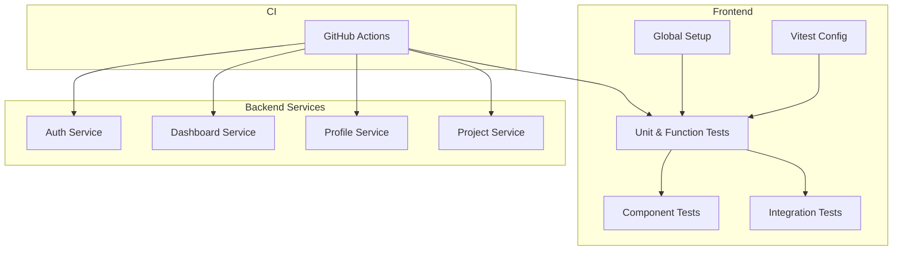
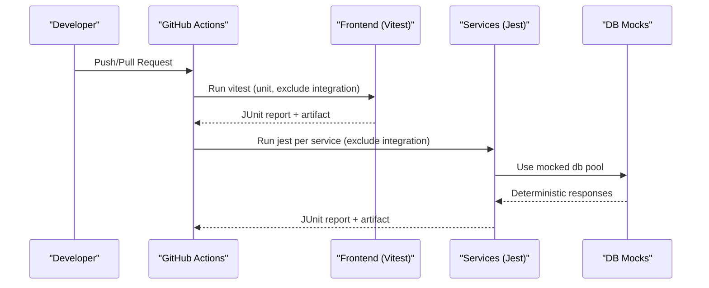
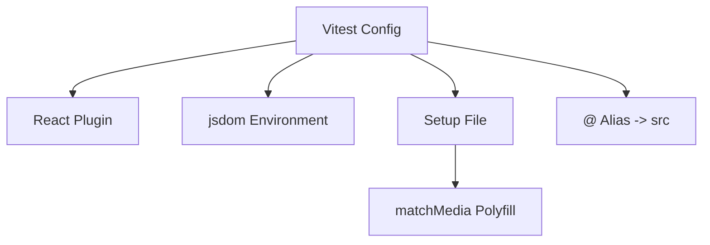
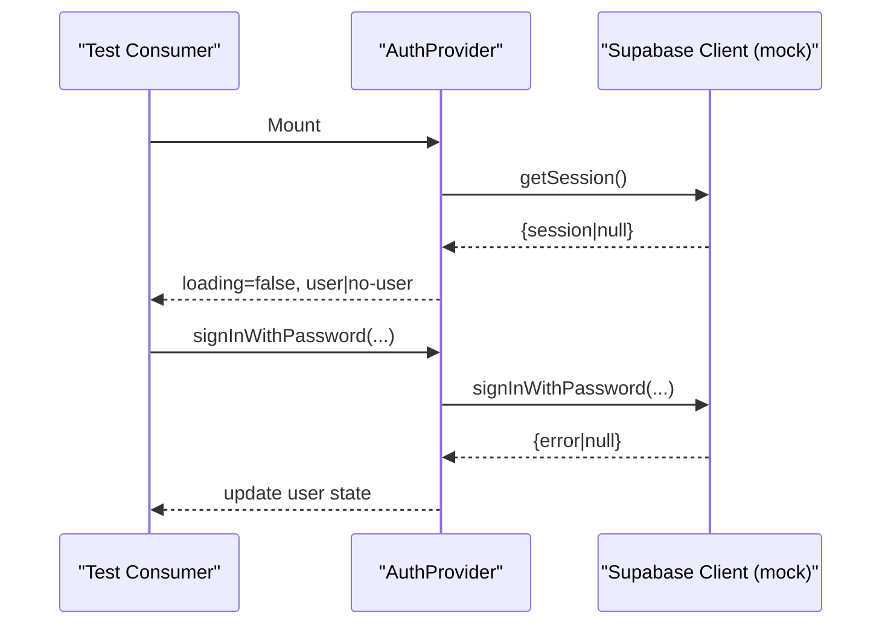
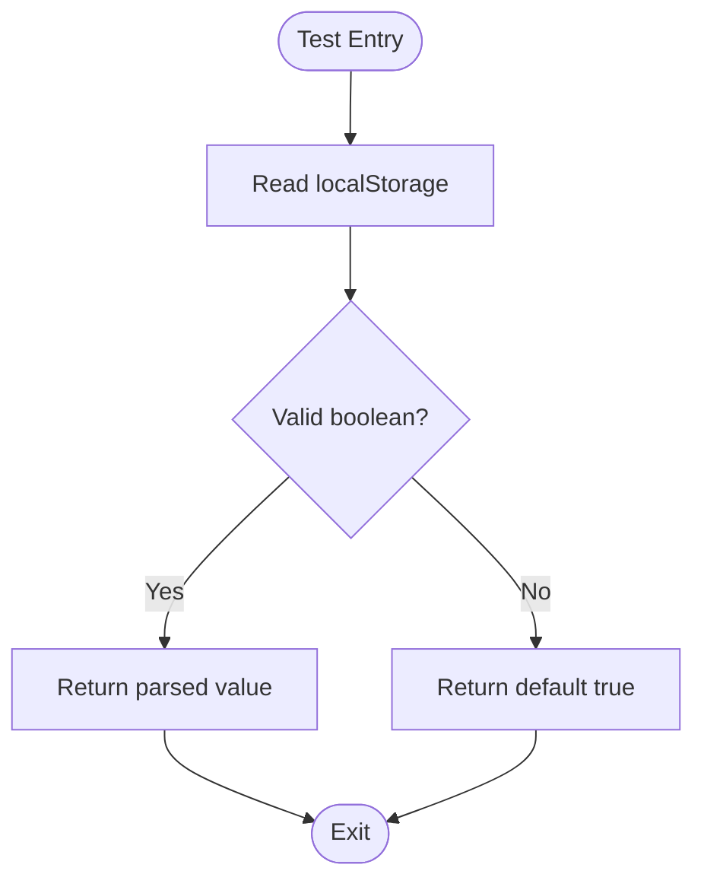
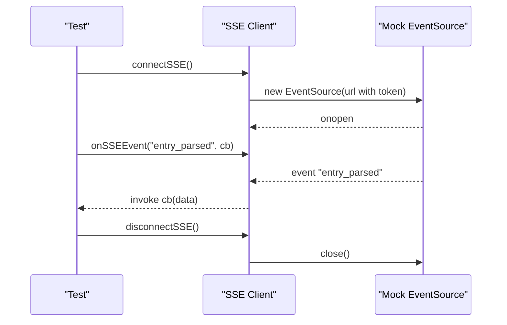
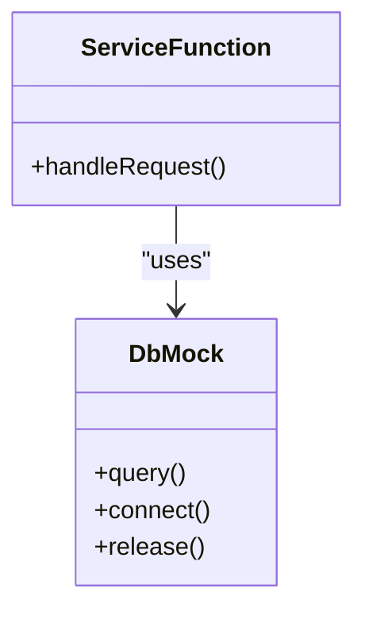
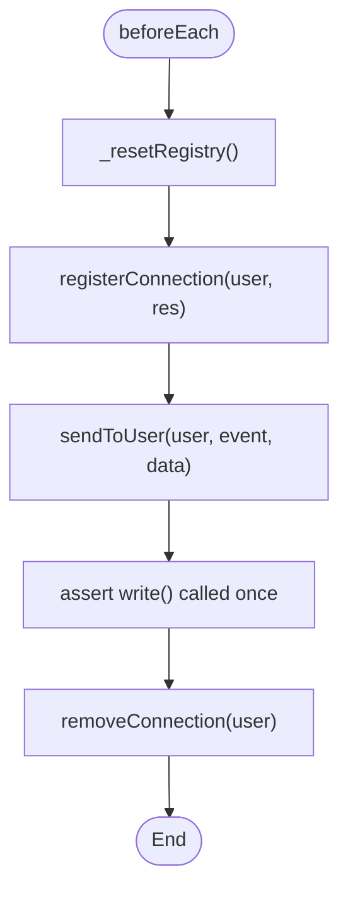
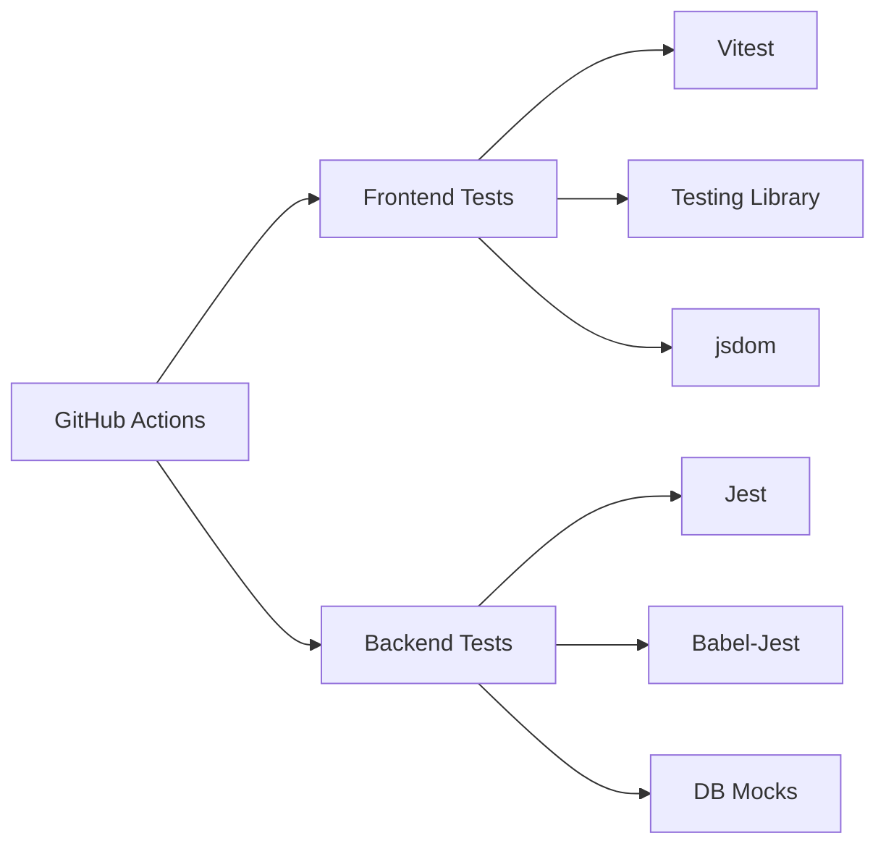

# Testing Strategy and Implementation

<cite>
**Referenced Files in This Document**
- [vitest.config.ts](file://frontend/vitest.config.ts)
- [setup.ts](file://frontend/src/test/setup.ts)
- [AuthContext.test.tsx](file://frontend/src/context/__tests__/AuthContext.test.tsx)
- [aiMessages.test.ts](file://frontend/src/functions/__tests__/aiMessages.test.ts)
- [sse.js](file://frontend/src/lib/sse.js)
- [sse.test.js](file://frontend/src/lib/__tests__/sse.test.js)
- [sse.integration.test.js](file://frontend/src/lib/__tests__/sse.integration.test.js)
- [backend-unit-tests.yml](file://.github/workflows/backend-unit-tests.yml)
- [frontend-unit-tests.yml](file://.github/workflows/frontend-unit-tests.yml)
- [package.json (auth-service)](file://services/auth-service/package.json)
- [package.json (dashboard-service)](file://services/dashboard-service/package.json)
- [package.json (profile-service)](file://services/profile-service/package.json)
- [package.json (project-service)](file://services/project-service/package.json)
- [db.js mock (project-service)](file://services/project-service/src/__mocks__/db.js)
- [db.js mock (profile-service)](file://services/profile-service/src/__mocks__/db.js)
- [sseRegistry.test.js](file://services/project-service/src/__tests__/sseRegistry.test.js)
- [sse.integration.test.js (project-service)](file://services/project-service/src/__tests__/sse.integration.test.js)
- [TESTING_IMPLEMENTATION.md](file://TESTING_IMPLEMENTATION.md)
</cite>

## Table of Contents

1. Introduction
2. Project Structure
3. Core Components
4. Architecture Overview
5. Detailed Component Analysis
6. Dependency Analysis
7. Performance Considerations
8. Troubleshooting Guide
9. Conclusion
10. Appendices

## Introduction

This document explains the multi-layered testing strategy for the Codacaine project, covering:

- Frontend unit, component, and integration tests using Vitest
- Backend microservice unit and integration tests using Jest with robust mocking strategies
- Real-time features tested via Server-Sent Events (SSE)
- Offline functionality considerations and IndexedDB-related patterns
- AI-powered feature testing approaches
- Test data management, coverage reporting, and CI workflows
- Guidelines and examples for writing effective tests across authentication flows, CRUD operations, and error handling

## Project Structure

The repository organizes tests close to their source code:

- Frontend tests live under frontend/src with dedicated directories for components, functions, context, templates, and integration tests.
- Backend services each have their own package-level test suites under services/<service>/src/**tests** and **mocks**.
- CI pipelines run frontend and backend tests in parallel per service.

**Diagram sources**

- [vitest.config.ts:1-18](file://frontend/vitest.config.ts#L1-L18)
- [setup.ts:1-17](file://frontend/src/test/setup.ts#L1-L17)
- [backend-unit-tests.yml:1-68](file://.github/workflows/backend-unit-tests.yml#L1-L68)
- [frontend-unit-tests.yml:1-58](file://.github/workflows/frontend-unit-tests.yml#L1-L58)

**Section sources**

- [vitest.config.ts:1-18](file://frontend/vitest.config.ts#L1-L18)
- [setup.ts:1-17](file://frontend/src/test/setup.ts#L1-L17)
- [backend-unit-tests.yml:1-68](file://.github/workflows/backend-unit-tests.yml#L1-L68)
- [frontend-unit-tests.yml:1-58](file://.github/workflows/frontend-unit-tests.yml#L1-L58)

## Core Components

- Frontend test runner: Vitest configured with jsdom environment, global setup, and React plugin.
- Backend test runner: Jest with Babel transformation and per-service coverage configuration.
- Mocking:
  - Frontend: vi.mock for Supabase client, fetch stubbing, MemoryRouter for routing, localStorage cleanup.
  - Backend: Module-level mocks for database pools to isolate tests from real databases.
- Real-time: SSE client library with listener registry; both unit and integration tests validate connection lifecycle, event dispatch, and reconnection behavior.
- Offline: Caching and sync utilities are covered by integration tests that simulate offline queues and synchronization.

**Section sources**

- [vitest.config.ts:1-18](file://frontend/vitest.config.ts#L1-L18)
- [package.json (auth-service):1-41](file://services/auth-service/package.json#L1-L41)
- [package.json (dashboard-service):1-43](file://services/dashboard-service/package.json#L1-L43)
- [package.json (profile-service):1-43](file://services/profile-service/package.json#L1-L43)
- [package.json (project-service):1-58](file://services/project-service/package.json#L1-L58)
- [db.js mock (project-service):1-20](file://services/project-service/src/__mocks__/db.js#L1-L20)
- [db.js mock (profile-service):1-17](file://services/profile-service/src/__mocks__/db.js#L1-L17)

## Architecture Overview

The testing architecture spans three layers:

- Unit layer: Pure functions, hooks, and small modules verified in isolation.
- Integration layer: Cross-component flows such as auth context interactions, SSE event propagation, and cache synchronization.
- CI layer: Automated runs on push/PR with JUnit reports and artifacts.

**Diagram sources**

- [frontend-unit-tests.yml:1-58](file://.github/workflows/frontend-unit-tests.yml#L1-L58)
- [backend-unit-tests.yml:1-68](file://.github/workflows/backend-unit-tests.yml#L1-L68)
- [db.js mock (project-service):1-20](file://services/project-service/src/__mocks__/db.js#L1-L20)

## Detailed Component Analysis

### Frontend Vitest Configuration and Setup

- Environment: jsdom for DOM APIs.
- Globals: Enabled for convenience in tests.
- Setup file: Provides matchMedia polyfill and common globals.
- Aliases: @ maps to src for clean imports.

**Diagram sources**

- [vitest.config.ts:1-18](file://frontend/vitest.config.ts#L1-L18)
- [setup.ts:1-17](file://frontend/src/test/setup.ts#L1-L17)

**Section sources**

- [vitest.config.ts:1-18](file://frontend/vitest.config.ts#L1-L18)
- [setup.ts:1-17](file://frontend/src/test/setup.ts#L1-L17)

### Authentication Context Tests (Frontend)

- Verifies initialization, session loading, state changes, sign-in/sign-up, OAuth flows, password reset/update, account deletion/restore, and error propagation.
- Uses vi.mock to replace Supabase client methods and a wrapper component to render within router and provider contexts.

**Diagram sources**

- [AuthContext.test.tsx:1-329](file://frontend/src/context/__tests__/AuthContext.test.tsx#L1-L329)

**Section sources**

- [AuthContext.test.tsx:1-329](file://frontend/src/context/__tests__/AuthContext.test.tsx#L1-L329)

### AI Messages Preference Tests (Frontend)

- Validates default enabled state, persistence in localStorage, toggling behavior, and resilience to invalid stored values.

**Diagram sources**

- [aiMessages.test.ts:1-55](file://frontend/src/functions/__tests__/aiMessages.test.ts#L1-L55)

**Section sources**

- [aiMessages.test.ts:1-55](file://frontend/src/functions/__tests__/aiMessages.test.ts#L1-L55)

### SSE Client Tests (Frontend)

- Connection lifecycle: connect, deduplication, JWT inclusion, disconnect.
- Event handling: register/unregister listeners, multiple listeners, error events.
- Reconnection: exponential backoff with fake timers.
- Integration: multiple listeners notified, unsubscribed listeners ignored.

**Diagram sources**

- [sse.js:136-184](file://frontend/src/lib/sse.js#L136-L184)
- [sse.test.js:71-252](file://frontend/src/lib/__tests__/sse.test.js#L71-L252)
- [sse.integration.test.js:234-303](file://frontend/src/lib/__tests__/sse.integration.test.js#L234-L303)

**Section sources**

- [sse.js:136-184](file://frontend/src/lib/sse.js#L136-L184)
- [sse.test.js:71-252](file://frontend/src/lib/__tests__/sse.test.js#L71-L252)
- [sse.integration.test.js:234-303](file://frontend/src/lib/__tests__/sse.integration.test.js#L234-L303)

### Backend Microservice Testing with Jest

- Each service defines scripts for running tests and generating coverage.
- Jest is configured with babel-jest transform and coverage collection scoped to functions.
- Database mocking:
  - Centralized mocks for pg Pool and client to return deterministic rows or errors.
  - Tests assert query calls and handle release semantics.

**Diagram sources**

- [package.json (project-service):1-58](file://services/project-service/package.json#L1-L58)
- [db.js mock (project-service):1-20](file://services/project-service/src/__mocks__/db.js#L1-L20)
- [db.js mock (profile-service):1-17](file://services/profile-service/src/__mocks__/db.js#L1-L17)

**Section sources**

- [package.json (auth-service):1-41](file://services/auth-service/package.json#L1-L41)
- [package.json (dashboard-service):1-43](file://services/dashboard-service/package.json#L1-L43)
- [package.json (profile-service):1-43](file://services/profile-service/package.json#L1-L43)
- [package.json (project-service):1-58](file://services/project-service/package.json#L1-L58)
- [db.js mock (project-service):1-20](file://services/project-service/src/__mocks__/db.js#L1-L20)
- [db.js mock (profile-service):1-17](file://services/profile-service/src/__mocks__/db.js#L1-L17)

### SSE Registry Tests (Backend)

- Validates registration, multi-connection support per user, isolation between users, sending messages, and cleanup.
- Includes a reset mechanism to avoid module-level state leakage across tests.

**Diagram sources**

- [sseRegistry.test.js:1-40](file://services/project-service/src/__tests__/sseRegistry.test.js#L1-L40)
- [sse.integration.test.js (project-service):1-48](file://services/project-service/src/__tests__/sse.integration.test.js#L1-L48)

**Section sources**

- [sseRegistry.test.js:1-40](file://services/project-service/src/__tests__/sseRegistry.test.js#L1-L40)
- [sse.integration.test.js (project-service):1-48](file://services/project-service/src/__tests__/sse.integration.test.js#L1-L48)

### Offline Functionality and IndexedDB

- The frontend includes caching and offline queue utilities; integration tests exercise cache behavior and sync flows.
- While specific IndexedDB tests are not shown here, the integration suite demonstrates queuing and synchronization patterns suitable for offline-first scenarios.

[No sources needed since this section provides general guidance]

### AI-Powered Features Testing

- Tests cover preference toggles and persistence for AI messaging features.
- For AI API calls, use dependency injection or module mocking to isolate external LLM calls and assert prompt construction and response handling.

**Section sources**

- [aiMessages.test.ts:1-55](file://frontend/src/functions/__tests__/aiMessages.test.ts#L1-L55)

## Dependency Analysis

- Frontend depends on Vitest, React Testing Library, and jsdom for environment simulation.
- Backend services depend on Jest, Babel, and supertest (where applicable), with pg clients replaced by mocks during tests.
- CI orchestrates test execution per service and publishes JUnit reports.

**Diagram sources**

- [vitest.config.ts:1-18](file://frontend/vitest.config.ts#L1-L18)
- [package.json (project-service):1-58](file://services/project-service/package.json#L1-L58)
- [backend-unit-tests.yml:1-68](file://.github/workflows/backend-unit-tests.yml#L1-L68)
- [frontend-unit-tests.yml:1-58](file://.github/workflows/frontend-unit-tests.yml#L1-L58)

**Section sources**

- [vitest.config.ts:1-18](file://frontend/vitest.config.ts#L1-L18)
- [package.json (project-service):1-58](file://services/project-service/package.json#L1-L58)
- [backend-unit-tests.yml:1-68](file://.github/workflows/backend-unit-tests.yml#L1-L68)
- [frontend-unit-tests.yml:1-58](file://.github/workflows/frontend-unit-tests.yml#L1-L58)

## Performance Considerations

- Keep unit tests fast and isolated; prefer mocks over real network or DB calls.
- Use fake timers judiciously for async behaviors like reconnection backoff.
- Exclude integration tests from fast unit runs to keep feedback loops short.
- Leverage coverage thresholds in CI to prevent regressions.

[No sources needed since this section provides general guidance]

## Troubleshooting Guide

Common issues and resolutions observed in the codebase:

- Module-level state leakage in SSE registry tests resolved by exporting a reset function and calling it in beforeEach.
- Fake timer pitfalls when advancing time around async code require careful flushing or awaiting promises alongside timer advancement.
- Ensure mocks are reset between tests to avoid cross-test pollution.

**Section sources**

- [sseRegistry.test.js:1-40](file://services/project-service/src/__tests__/sseRegistry.test.js#L1-L40)
- [sse.integration.test.js (project-service):1-48](file://services/project-service/src/__tests__/sse.integration.test.js#L1-L48)
- [TESTING_IMPLEMENTATION.md:1-185](file://TESTING_IMPLEMENTATION.md#L1-L185)

## Conclusion

Codacaine employs a comprehensive, layered testing strategy:

- Frontend: Vitest with jsdom, strong mocking, and focused unit/component/integration tests.
- Backend: Jest with per-service configuration, robust database mocks, and targeted SSE registry tests.
- CI: Automated runs with JUnit reporting and artifacts for traceability.
  Adhering to these practices ensures reliability, maintainability, and confidence across authentication flows, CRUD operations, real-time features, and offline capabilities.

[No sources needed since this section summarizes without analyzing specific files]

## Appendices

### Writing Effective Tests: Guidelines

- Arrange → Act → Assert pattern for clarity.
- Isolate side effects with mocks; never call real services in unit tests.
- Keep tests deterministic; mock time-dependent logic where necessary.
- Co-locate tests near source in **tests** directories.
- Prefer behavior-focused assertions over implementation details.

**Section sources**

- [TESTING_IMPLEMENTATION.md:99-118](file://TESTING_IMPLEMENTATION.md#L99-L118)

### Test Data Management

- Use minimal, representative fixtures for inputs and expected outputs.
- Clear shared storage (e.g., localStorage) in beforeEach to prevent leakage.
- For DB-backed tests, rely on mocks to define precise row sets and error paths.

**Section sources**

- [AuthContext.test.tsx:1-329](file://frontend/src/context/__tests__/AuthContext.test.tsx#L1-L329)
- [db.js mock (project-service):1-20](file://services/project-service/src/__mocks__/db.js#L1-L20)

### Coverage Reporting

- Frontend: Generate coverage via Vitest reporters and review in CI artifacts.
- Backend: Use Jest coverage with text-summary and json-summary reporters per service.

**Section sources**

- [package.json (auth-service):1-41](file://services/auth-service/package.json#L1-L41)
- [package.json (dashboard-service):1-43](file://services/dashboard-service/package.json#L1-L43)
- [package.json (profile-service):1-43](file://services/profile-service/package.json#L1-L43)
- [package.json (project-service):1-58](file://services/project-service/package.json#L1-L58)

### Continuous Integration Workflows

- Frontend unit tests run on push/PR with JUnit output and artifact upload.
- Backend unit tests run per service matrix, excluding integration tests, with JUnit output and artifact upload.

**Section sources**

- [frontend-unit-tests.yml:1-58](file://.github/workflows/frontend-unit-tests.yml#L1-L58)
- [backend-unit-tests.yml:1-68](file://.github/workflows/backend-unit-tests.yml#L1-L68)

### Example Scenarios

#### Authentication Flow (Frontend)

- Verify initial state, session retrieval, and state updates on auth events.
- Validate sign-in, sign-up, OAuth redirects, password reset/update, and account lifecycle actions.

**Section sources**

- [AuthContext.test.tsx:1-329](file://frontend/src/context/__tests__/AuthContext.test.tsx#L1-L329)

#### CRUD Operations (Backend)

- Use db mocks to simulate create/read/update/delete outcomes and assert handler behavior.
- Confirm proper error handling and status codes.

**Section sources**

- [db.js mock (project-service):1-20](file://services/project-service/src/__mocks__/db.js#L1-L20)
- [db.js mock (profile-service):1-17](file://services/profile-service/src/__mocks__/db.js#L1-L17)

#### Error Handling (Frontend and Backend)

- Frontend: Assert thrown errors and UI states for failed requests or RPC calls.
- Backend: Assert error responses and ensure connections/resources are cleaned up.

**Section sources**

- [AuthContext.test.tsx:244-274](file://frontend/src/context/__tests__/AuthContext.test.tsx#L244-L274)
- [sse.integration.test.js (project-service):1-48](file://services/project-service/src/__tests__/sse.integration.test.js#L1-L48)
