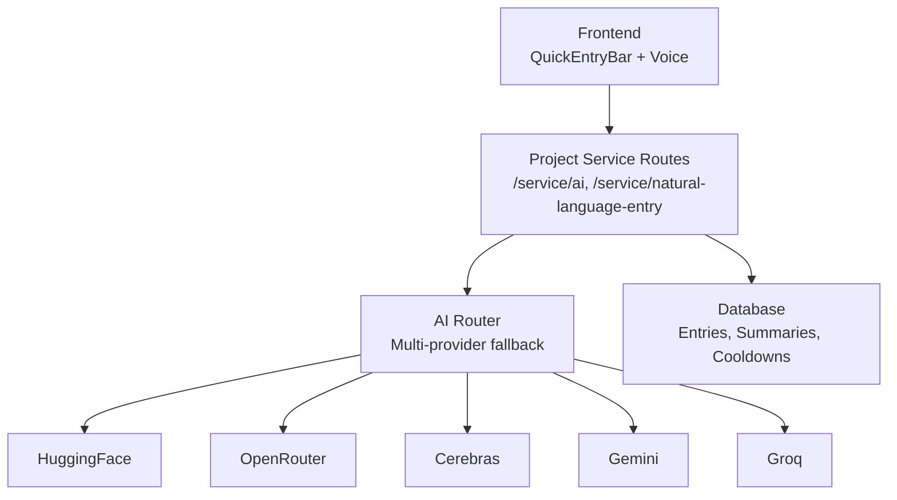
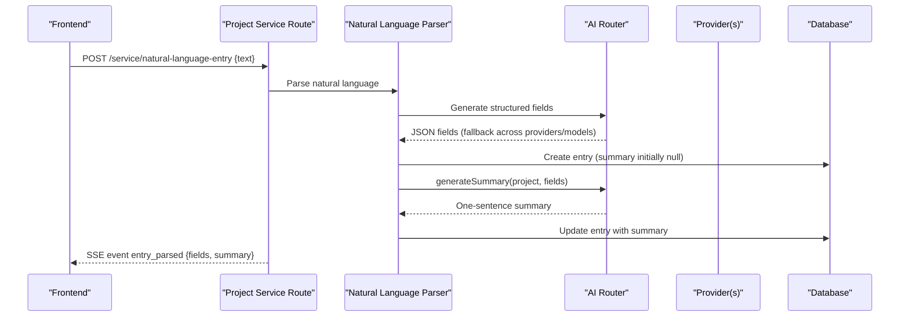
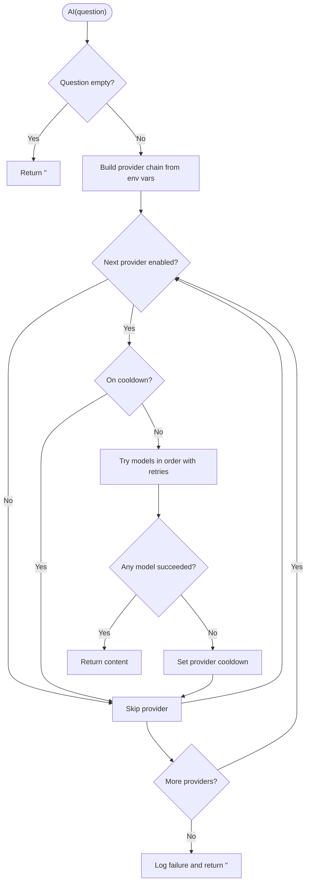
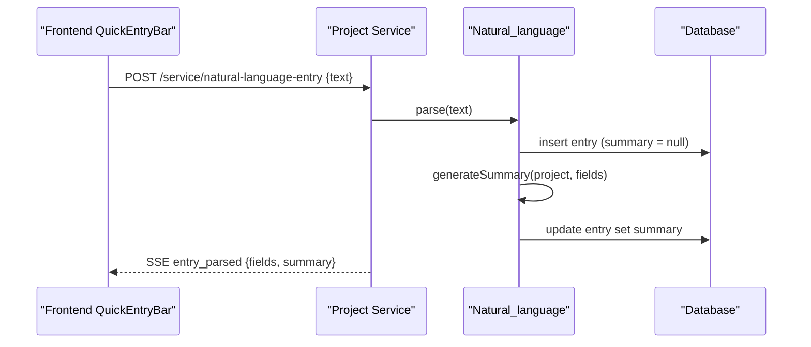
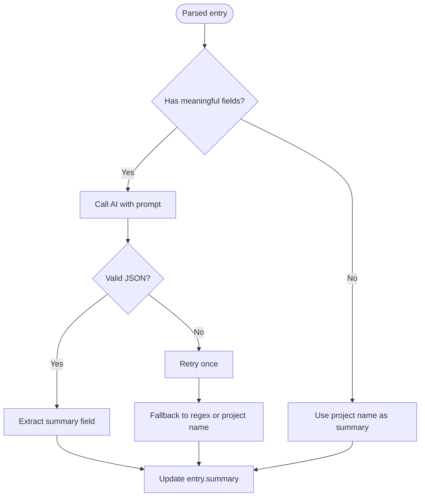
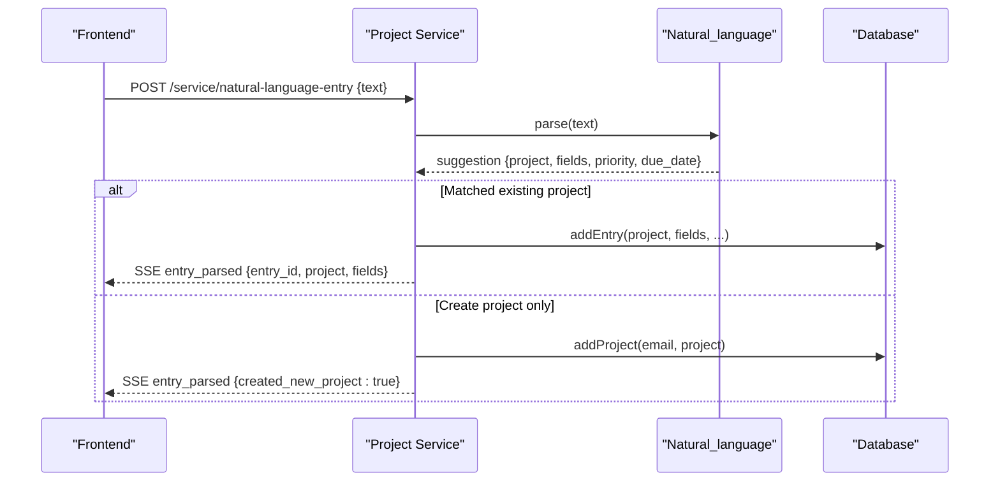
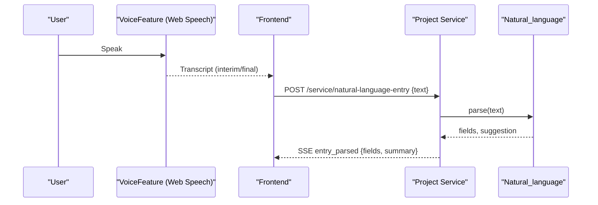
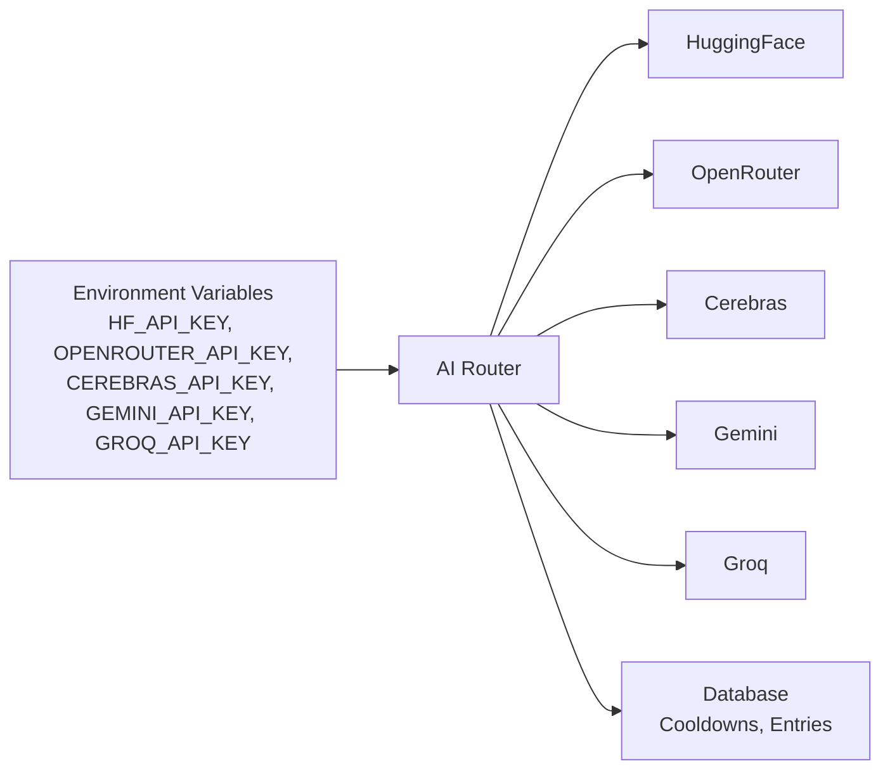

# AI Integration

<cite>
**Referenced Files in This Document**
- [ai.js](file://services/project-service/src/functions/ai.js)
- [ai.js (route)](file://services/project-service/src/Routes/ai.js)
- [natural_language.js (frontend)](file://frontend/src/functions/project/natural_language.js)
- [voicefeature.js](file://frontend/src/functions/voicefeature.js)
- [tour.ts](file://frontend/src/lib/tour.ts)
- [QuickEntryBar.tsx](file://frontend/src/components/QuickEntryBar.tsx)
- [entries.js](file://services/project-service/src/functions/entries.js)
- [entry-summaries.md](file://docs-site/docs/Architecture/entry-summigrations.md)
- [third-party.md](file://docs-site/docs/Architecture/third-party.md)
</cite>

## Table of Contents

1. Introduction
2. Project Structure
3. Core Components
4. Architecture Overview
5. Detailed Component Analysis
6. Dependency Analysis
7. Performance Considerations
8. Troubleshooting Guide
9. Conclusion

## Introduction

This document explains Codacaine’s AI-powered features: natural language task creation, automatic entry summarization, and intelligent suggestions. It details the multi-provider AI architecture that supports OpenRouter, HuggingFace, Gemini, Cerebras, and Groq with automatic fallbacks, rate-limit handling, cooldowns, and cost optimization strategies. It also documents the voice narration system for guided tours and speech synthesis integration used by quick-add workflows. Configuration options, caching strategies, and troubleshooting steps are included to help operators run a resilient, cost-aware AI layer.

## Project Structure

The AI integration spans frontend and backend layers:

- Frontend:
  - Natural language entry submission via a lightweight POST and SSE-driven updates.
  - Voice transcription using Web Speech API and quick-add integration.
  - Guided tour with browser-based speech synthesis for accessibility.
- Backend (project-service):
  - A unified AI router that calls multiple providers with model-level fallbacks and provider-level fallbacks.
  - Natural language parsing and summary generation integrated into entry creation.
  - Cooldown tracking to avoid repeated failures during outages or rate limits.

**Diagram sources**

- [ai.js (route):1-39](file://services/project-service/src/Routes/ai.js#L1-L39)
- [ai.js:403-462](file://services/project-service/src/functions/ai.js#L403-L462)
- [natural_language.js (frontend):13-43](file://frontend/src/functions/project/natural_language.js#L13-L43)
- [entries.js:642-700](file://services/project-service/src/functions/entries.js#L642-L700)

**Section sources**

- [ai.js (route):1-39](file://services/project-service/src/Routes/ai.js#L1-L39)
- [ai.js:403-462](file://services/project-service/src/functions/ai.js#L403-L462)
- [natural_language.js (frontend):13-43](file://frontend/src/functions/project/natural_language.js#L13-L43)
- [entries.js:642-700](file://services/project-service/src/functions/entries.js#L642-L700)

## Core Components

- Multi-provider AI router: Centralized orchestration across five providers with per-model fallback chains, retry on transient errors, and provider cooldowns.
- Natural language entry pipeline: Frontend submits text; backend parses fields, creates entries, and generates concise summaries asynchronously.
- Entry summarization: Lightweight AI call to produce a one-sentence summary stored with each entry and pushed via SSE.
- Voice transcription and quick-add: Browser-based speech recognition feeds natural language processing without server-side transcription costs.
- Guided tour narration: In-app tour uses browser speech synthesis for accessible, zero-cost narration with user controls.

**Section sources**

- [ai.js:403-462](file://services/project-service/src/functions/ai.js#L403-L462)
- [natural_language.js (frontend):13-43](file://frontend/src/functions/project/natural_language.js#L13-L43)
- [entries.js:642-700](file://services/project-service/src/functions/entries.js#L642-L700)
- [voicefeature.js:1-92](file://frontend/src/functions/voicefeature.js#L1-L92)
- [tour.ts:67-199](file://frontend/src/lib/tour.ts#L67-L199)

## Architecture Overview

The AI layer is designed for resilience and cost efficiency:

- Provider selection: Providers are enabled based on environment variables. The chain order prioritizes free or low-latency options first.
- Model fallbacks: Each provider has an ordered list of models; if one fails, the next is tried automatically.
- Rate limiting and retries: Transient rate limit errors trigger exponential backoff within a provider before moving to the next.
- Cooldowns: If all models fail for a provider, it is temporarily skipped for a period to reduce wasted requests.
- SSE delivery: Parsed results and summaries are pushed to the frontend as soon as they are ready.

**Diagram sources**

- [natural_language.js (frontend):13-43](file://frontend/src/functions/project/natural_language.js#L13-L43)
- [entries.js:1022-1094](file://services/project-service/src/functions/entries.js#L1022-L1094)
- [entries.js:642-700](file://services/project-service/src/functions/entries.js#L642-L700)
- [ai.js:403-462](file://services/project-service/src/functions/ai.js#L403-L462)

## Detailed Component Analysis

### Multi-Provider AI Router

The router implements:

- Provider enablement via environment variables.
- Ordered provider chain: HuggingFace → OpenRouter → Cerebras → Gemini → Groq.
- Per-provider model lists with intentional ordering for reliability and cost.
- Robust error detection for rate limits and temporary unavailability.
- Exponential backoff retries within a provider before failing over.
- Persistent cooldowns to avoid hammering unhealthy providers.

**Diagram sources**

- [ai.js:403-462](file://services/project-service/src/functions/ai.js#L403-L462)
- [ai.js:338-399](file://services/project-service/src/functions/ai.js#L338-L399)
- [ai.js:285-336](file://services/project-service/src/functions/ai.js#L285-L336)

**Section sources**

- [ai.js:403-462](file://services/project-service/src/functions/ai.js#L403-L462)
- [ai.js:338-399](file://services/project-service/src/functions/ai.js#L338-L399)
- [ai.js:285-336](file://services/project-service/src/functions/ai.js#L285-L336)

### Natural Language Processing for Task Creation

- Frontend sends a POST with the user’s natural language text.
- Backend parses into structured fields (project, task, due date, priority).
- Entries are created immediately; summaries are generated asynchronously and updated later.
- SSE pushes parsed results and summaries to the UI promptly after completion.

**Diagram sources**

- [natural_language.js (frontend):13-43](file://frontend/src/functions/project/natural_language.js#L13-L43)
- [entries.js:1022-1094](file://services/project-service/src/functions/entries.js#L1022-L1094)
- [entries.js:642-700](file://services/project-service/src/functions/entries.js#L642-L700)

**Section sources**

- [natural_language.js (frontend):13-43](file://frontend/src/functions/project/natural_language.js#L13-L43)
- [entries.js:1022-1094](file://services/project-service/src/functions/entries.js#L1022-L1094)
- [entries.js:642-700](file://services/project-service/src/functions/entries.js#L642-L700)

### Automatic Entry Summarization

- After parsing, a lightweight AI call produces a concise one-sentence summary.
- The summary is stored in the entries table and included in SSE events.
- Backfill scripts can generate summaries for existing entries in batches with rate limiting.

**Diagram sources**

- [entries.js:642-700](file://services/project-service/src/functions/entries.js#L642-L700)

**Section sources**

- [entries.js:642-700](file://services/project-service/src/functions/entries.js#L642-L700)
- [entry-summaries.md:39-178](file://docs-site/docs/Architecture/entry-summigrations.md#L39-L178)

### Intelligent Task Suggestions

- The natural language parser returns structured suggestions (e.g., matched projects, fields, priorities).
- The UI uses these suggestions to pre-fill forms or create entries directly when appropriate.
- When only a project is requested, the backend creates the project and returns confirmation data.

**Diagram sources**

- [entries.js:1022-1094](file://services/project-service/src/functions/entries.js#L1022-L1094)

**Section sources**

- [entries.js:1022-1094](file://services/project-service/src/functions/entries.js#L1022-L1094)

### Voice Narration System and Accessibility

- Speech-to-text: Browser-based transcription via Web Speech API; no backend transcription required.
- Quick-add integration: Transcribed text is sent through the same natural language pipeline as typed input.
- Guided tour narration: Uses browser speech synthesis with voice preference persistence and user controls.
- Accessibility: Tour includes aria attributes, keyboard navigation, and pause/resume behavior.

**Diagram sources**

- [voicefeature.js:1-92](file://frontend/src/functions/voicefeature.js#L1-L92)
- [natural_language.js (frontend):13-43](file://frontend/src/functions/project/natural_language.js#L13-L43)
- [tour.ts:67-199](file://frontend/src/lib/tour.ts#L67-L199)

**Section sources**

- [voicefeature.js:1-92](file://frontend/src/functions/voicefeature.js#L1-L92)
- [tour.ts:67-199](file://frontend/src/lib/tour.ts#L67-L199)
- [QuickEntryBar.tsx:38-86](file://frontend/src/components/QuickEntryBar.tsx#L38-L86)

## Dependency Analysis

- Provider SDKs:
  - OpenAI-compatible clients for OpenRouter and Groq.
  - HuggingFace Inference client.
  - Google Generative AI client for Gemini.
  - Cerebras Cloud SDK.
- Environment configuration:
  - Provider keys control enablement and routing decisions.
- Database:
  - Cooldowns tracked in a dedicated table to persist state across requests.
  - Entries store structured fields and optional summaries.

**Diagram sources**

- [ai.js:1-32](file://services/project-service/src/functions/ai.js#L1-L32)
- [ai.js:119-150](file://services/project-service/src/functions/ai.js#L119-L150)
- [ai.js:285-336](file://services/project-service/src/functions/ai.js#L285-L336)

**Section sources**

- [ai.js:1-32](file://services/project-service/src/functions/ai.js#L1-L32)
- [ai.js:119-150](file://services/project-service/src/functions/ai.js#L119-L150)
- [third-party.md:289-299](file://docs-site/docs/Architecture/third-party.md#L289-L299)

## Performance Considerations

- Cost optimization:
  - Prefer free or low-cost models first in provider chains (e.g., OpenRouter free tier).
  - Use lightweight prompts for summaries to minimize tokens.
  - Avoid unnecessary AI calls in voice flows; rely on browser transcription and direct natural language parsing.
- Latency:
  - Fastest providers (e.g., Cerebras) are positioned early in the chain for speed-sensitive operations.
  - Asynchronous summary generation avoids blocking primary entry creation.
- Resilience:
  - Exponential backoff on rate limits reduces wasted retries.
  - Provider cooldowns prevent cascading failures during outages.
- Caching strategy:
  - No in-memory cache for AI responses; rely on provider-level caching where applicable and database-backed cooldowns.
  - Frontend SSE ensures minimal re-fetching of parsed results.

[No sources needed since this section provides general guidance]

## Troubleshooting Guide

Common issues and resolutions:

- All providers unavailable:
  - Symptom: Empty response from AI calls.
  - Action: Verify environment variables for all providers; check logs for “ALL AI PROVIDERS FAILED.”
- Rate limiting:
  - Symptom: Errors indicating 429/quota/resource_exhausted.
  - Action: Allow exponential backoff to succeed; if persistent, increase cooldown window or disable overloaded providers temporarily.
- Provider cooldown not clearing:
  - Symptom: Requests skip a provider even after recovery.
  - Action: Inspect cooldown table and ensure timestamps are expiring; clear stale records if necessary.
- Summary generation failures:
  - Symptom: Entries created but summary remains null.
  - Action: Run backfill script; verify AI prompts and provider availability; check SSE events for summary inclusion.
- Voice transcription errors:
  - Symptom: Speech recognition not supported or permission denied.
  - Action: Use a supported browser (Chrome/Edge/Safari), grant microphone permissions, and ensure HTTPS context.

**Section sources**

- [ai.js:152-170](file://services/project-service/src/functions/ai.js#L152-L170)
- [ai.js:285-336](file://services/project-service/src/functions/ai.js#L285-L336)
- [entries.js:642-700](file://services/project-service/src/functions/entries.js#L642-L700)
- [voicefeature.js:1-92](file://frontend/src/functions/voicefeature.js#L1-L92)

## Conclusion

Codacaine’s AI integration delivers robust natural language task creation, automatic summarization, and intelligent suggestions through a resilient multi-provider architecture. By combining provider fallbacks, rate-limit handling, cooldowns, and asynchronous processing, the system maintains high availability while optimizing cost and latency. The voice narration system enhances accessibility and streamlines quick-add workflows using browser-native capabilities. Operators can tune provider configurations, monitor cooldowns, and leverage SSE-driven updates for a responsive user experience.

[No sources needed since this section summarizes without analyzing specific files]
