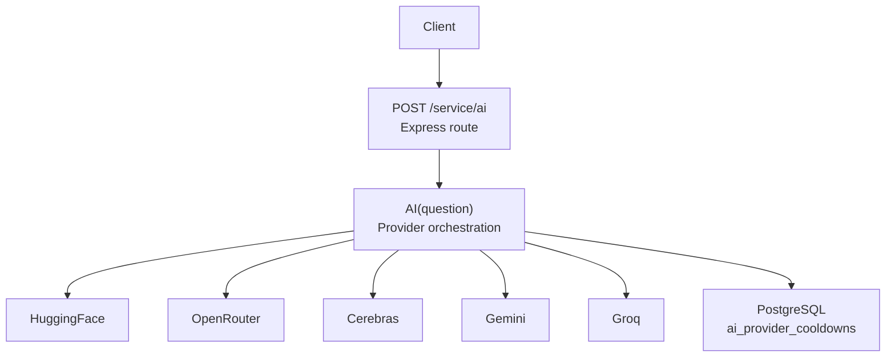
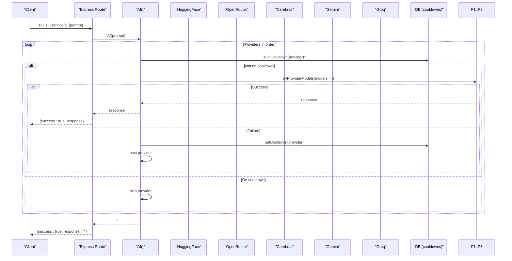
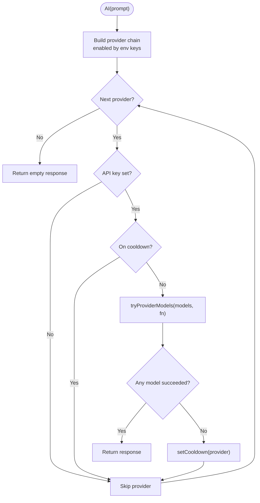
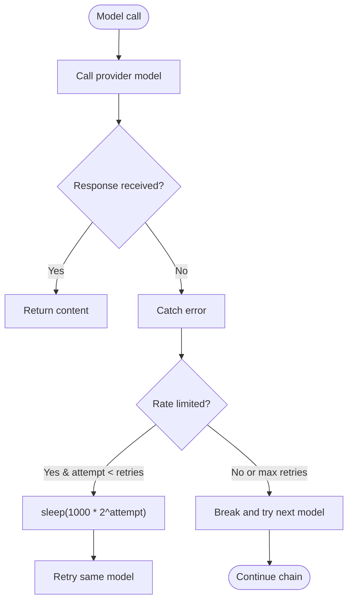
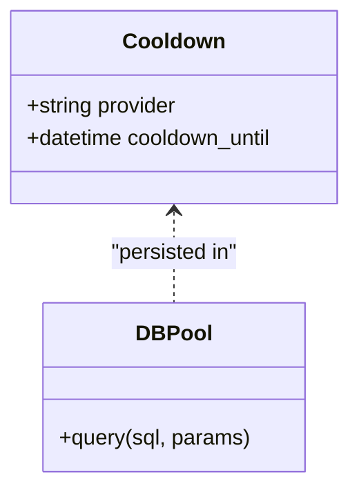
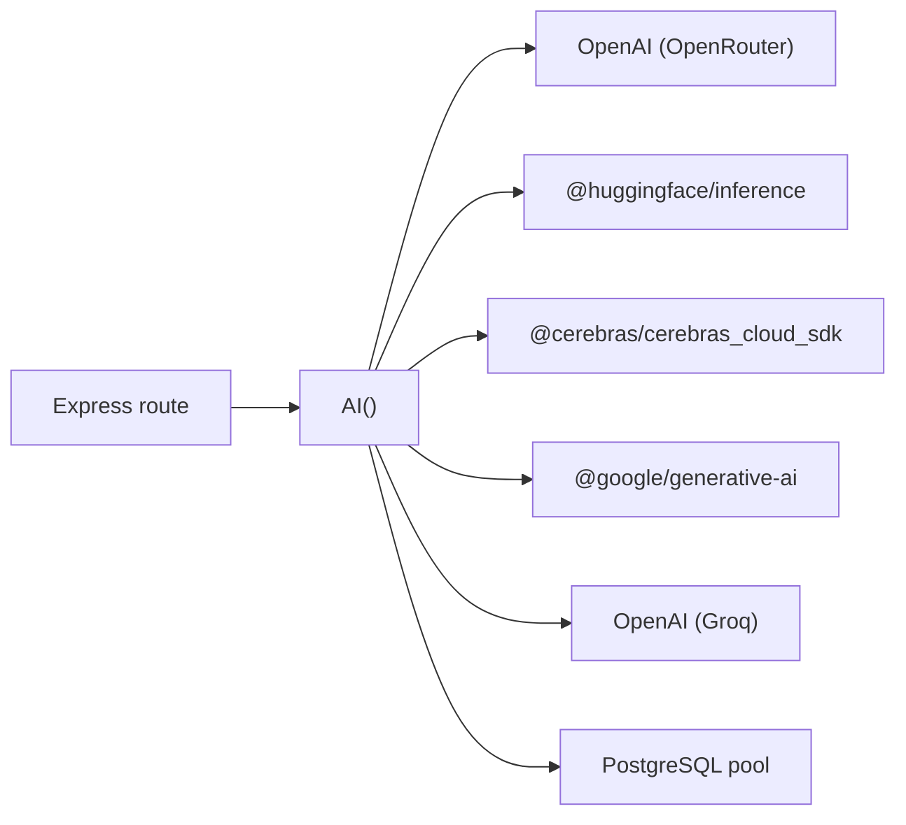

# Multi-Provider Management

<cite>
**Referenced Files in This Document**
- [ai.js](file://services/project-service/src/functions/ai.js)
- [ai.js (route)](file://services/project-service/src/Routes/ai.js)
- [db.js](file://services/project-service/src/db.js)
- [README.md](file://README.md)
- [third-party.md](file://docs-site/docs/Architecture/third-party.md)
</cite>

## Table of Contents

1. [Introduction](#introduction)
2. [Project Structure](#project-structure)
3. [Core Components](#core-components)
4. [Architecture Overview](#architecture-overview)
5. [Detailed Component Analysis](#detailed-component-analysis)
6. [Dependency Analysis](#dependency-analysis)
7. [Performance Considerations](#performance-considerations)
8. [Troubleshooting Guide](#troubleshooting-guide)
9. [Conclusion](#conclusion)

## Introduction

This document explains Codacaine’s multi-provider AI architecture that routes natural-language requests across five providers: HuggingFace, OpenRouter, Cerebras, Gemini, and Groq. It covers provider selection logic, fallback chains, automatic failover on errors or rate limits, cooldowns to prevent repeated failures, retry with exponential backoff, model arrays per provider, configuration requirements, cost optimization strategies, and troubleshooting steps for provider-specific issues.

## Project Structure

The AI routing is implemented in the project service. The HTTP route accepts a prompt and delegates to the AI function, which orchestrates provider selection and fallbacks. A PostgreSQL pool is used to persist provider cooldown state.

**Diagram sources**

- [ai.js (route):1-39](file://services/project-service/src/Routes/ai.js#L1-L39)
- [ai.js:403-462](file://services/project-service/src/functions/ai.js#L403-L462)
- [db.js:1-32](file://services/project-service/src/db.js#L1-L32)

**Section sources**

- [ai.js (route):1-39](file://services/project-service/src/Routes/ai.js#L1-L39)
- [ai.js:403-462](file://services/project-service/src/functions/ai.js#L403-L462)
- [db.js:1-32](file://services/project-service/src/db.js#L1-L32)

## Core Components

- Provider clients: Lazy instantiation per provider using SDKs or OpenAI-compatible endpoints.
- Model arrays: Ordered fallback lists per provider, prioritizing free/reliable models first.
- Error detection: Rate-limit and quota detection based on status codes and message patterns.
- Retry with backoff: Exponential backoff on transient rate-limited errors within a provider’s model list.
- Cooldown system: Per-provider cooldown persisted in PostgreSQL to avoid repeated failures for 5 minutes.
- Fallback chain: Sequential provider attempts; if one fails entirely, move to the next.

Key responsibilities are centralized in the AI module.

**Section sources**

- [ai.js:1-463](file://services/project-service/src/functions/ai.js#L1-L463)

## Architecture Overview

The request flow starts at the Express route, calls the AI orchestrator, which iterates through enabled providers in order. For each provider, it tries its model array sequentially. On success, it returns immediately. On failure, it sets a cooldown for that provider and moves to the next. If all providers fail, an empty response is returned.

**Diagram sources**

- [ai.js (route):11-35](file://services/project-service/src/Routes/ai.js#L11-L35)
- [ai.js:403-462](file://services/project-service/src/functions/ai.js#L403-L462)
- [ai.js:285-336](file://services/project-service/src/functions/ai.js#L285-L336)

## Detailed Component Analysis

### Provider Selection Logic and Fallback Chain

- Provider order: HuggingFace → OpenRouter → Cerebras → Gemini → Groq.
- Each provider is enabled only if its API key environment variable is present.
- Before attempting a provider, the system checks a database-backed cooldown; if active, the provider is skipped.
- Within a provider, the model array is tried top-to-bottom until one succeeds.

**Diagram sources**

- [ai.js:403-462](file://services/project-service/src/functions/ai.js#L403-L462)
- [ai.js:338-399](file://services/project-service/src/functions/ai.js#L338-L399)

**Section sources**

- [ai.js:403-462](file://services/project-service/src/functions/ai.js#L403-L462)

### Automatic Failover and Retry with Exponential Backoff

- Rate-limit detection: Recognizes 429/503 statuses and messages indicating rate limits, quotas, or resource exhaustion.
- Retry behavior: When a model call throws a rate-limited error, the same model is retried once after an exponential delay before moving to the next model.
- Failover: If all models in a provider fail, the provider is marked on cooldown and the chain proceeds to the next provider.

**Diagram sources**

- [ai.js:154-170](file://services/project-service/src/functions/ai.js#L154-L170)
- [ai.js:338-399](file://services/project-service/src/functions/ai.js#L338-L399)

**Section sources**

- [ai.js:154-170](file://services/project-service/src/functions/ai.js#L154-L170)
- [ai.js:338-399](file://services/project-service/src/functions/ai.js#L338-L399)

### Cooldown System

- Purpose: Prevent repeated requests to failing providers for a fixed period to reduce load and wasted retries.
- Storage: PostgreSQL table ai_provider_cooldowns with provider name and cooldown_until timestamp.
- Behavior:
  - Before trying a provider, check if currently on cooldown; if so, skip.
  - After exhausting all models for a provider, set cooldown_until to now + 5 minutes.
  - Database errors during cooldown checks are tolerated; cooldown defaults to not active on errors.

**Diagram sources**

- [ai.js:285-336](file://services/project-service/src/functions/ai.js#L285-L336)
- [db.js:1-32](file://services/project-service/src/db.js#L1-L32)

**Section sources**

- [ai.js:285-336](file://services/project-service/src/functions/ai.js#L285-L336)
- [db.js:1-32](file://services/project-service/src/db.js#L1-L32)

### Model Arrays and Performance Characteristics

Each provider has an ordered model array designed to maximize availability and cost efficiency.

- HuggingFace
  - Models include open-source options verified against supported inference tasks.
  - Free tier usage when available; good baseline for simple parsing tasks.
- OpenRouter
  - Includes multiple free variants and a catch-all router for healthy free models.
  - Aggregates many models via a single endpoint; reliable fallback.
- Cerebras
  - Fast inference endpoints; useful when free tiers are rate-limited.
- Gemini
  - Strong structured JSON output; configured to return application/json.
  - Multiple Flash tiers and a Pro option as last resort.
- Groq
  - Ultra-fast Llama-based endpoints; good JSON compliance.

These arrays are intentionally ordered from most likely to succeed to alternatives, minimizing failed round-trips.

**Section sources**

- [ai.js:56-117](file://services/project-service/src/functions/ai.js#L56-L117)
- [third-party.md:294-332](file://docs-site/docs/Architecture/third-party.md#L294-L332)

### Provider-Specific Implementations

- HuggingFace: Uses chatCompletion with low temperature for deterministic outputs.
- OpenRouter: Uses OpenAI-compatible client with custom base URL and JSON response format.
- Cerebras: Uses official SDK with chat completions and low temperature.
- Gemini: Uses GoogleGenerativeAI with JSON mime type and system instruction.
- Groq: Uses OpenAI-compatible client with custom base URL and JSON response format.

All providers receive a strict JSON-only system instruction to ensure parseable responses.

**Section sources**

- [ai.js:174-279](file://services/project-service/src/functions/ai.js#L174-L279)

## Dependency Analysis

- External SDKs:
  - OpenAI (used for OpenRouter and Groq via custom base URLs)
  - @huggingface/inference
  - @google/generative-ai
  - @cerebras/cerebras_cloud_sdk
- Internal dependencies:
  - Express route mounts the AI function
  - PostgreSQL pool for cooldown persistence

**Diagram sources**

- [ai.js (route):1-39](file://services/project-service/src/Routes/ai.js#L1-L39)
- [ai.js:1-6](file://services/project-service/src/functions/ai.js#L1-L6)
- [db.js:1-32](file://services/project-service/src/db.js#L1-L32)

**Section sources**

- [ai.js (route):1-39](file://services/project-service/src/Routes/ai.js#L1-L39)
- [ai.js:1-6](file://services/project-service/src/functions/ai.js#L1-L6)
- [db.js:1-32](file://services/project-service/src/db.js#L1-L32)

## Performance Considerations

- Prefer free-tier models first to minimize costs while maintaining availability.
- Use low temperature values to reduce variability and improve parseability.
- Leverage fast providers (Cerebras, Groq) as backups when free tiers are rate-limited.
- Cooldowns reduce redundant requests to failing providers, improving overall throughput.
- Keep model arrays curated to avoid dead-end model IDs that cause immediate failures.

[No sources needed since this section provides general guidance]

## Troubleshooting Guide

Common issues and how to diagnose them:

- Missing API keys
  - Symptom: Provider skipped; logs indicate no API key set.
  - Action: Ensure the corresponding environment variable is set for the project service.
  - Reference: Environment variables documented in README.

- Provider on cooldown
  - Symptom: Logs show provider skipped due to cooldown.
  - Action: Wait until cooldown expires or clear the cooldown record in the database.

- Rate limiting or quota exceeded
  - Symptom: Errors with status 429/503 or messages mentioning rate limit/quota/resource_exhausted.
  - Action: System will retry with exponential backoff once per model; if exhausted, provider is cooled down. Verify provider quotas and consider enabling additional providers.

- Model not supported or retired
  - Symptom: Immediate error on model call; chain moves to next model/provider.
  - Action: Update the provider’s model array to current supported models.

- Database connection issues
  - Symptom: Cooldown checks fail; logs warn about pool being NULL or query errors.
  - Action: Ensure DATABASE_URL is set and the database is reachable; cooldown checks degrade gracefully but won’t persist state.

- Empty or malformed responses
  - Symptom: Response length zero or non-JSON.
  - Action: Confirm system instruction and response_format settings; verify provider supports JSON mode.

Operational references:

- Environment variables and provider keys are listed in the repository README.
- Third-party integrations and rationale are documented in the architecture docs.

**Section sources**

- [README.md:270-285](file://README.md#L270-L285)
- [third-party.md:294-332](file://docs-site/docs/Architecture/third-party.md#L294-L332)
- [ai.js:154-170](file://services/project-service/src/functions/ai.js#L154-L170)
- [ai.js:285-336](file://services/project-service/src/functions/ai.js#L285-L336)

## Conclusion

Codacaine’s AI layer implements a robust, multi-provider fallback strategy that maximizes availability and minimizes cost. By combining ordered model arrays, rate-limit detection, exponential backoff, and a database-backed cooldown system, the service gracefully handles provider outages and quotas. Configure all desired provider keys to enable the full chain, monitor logs for provider transitions, and keep model arrays updated to reflect current provider offerings.

[No sources needed since this section summarizes without analyzing specific files]
