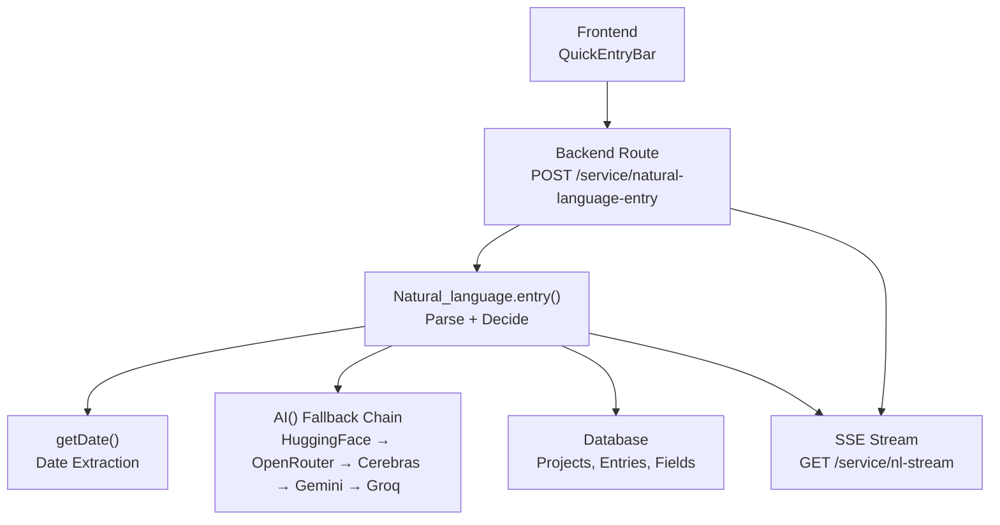
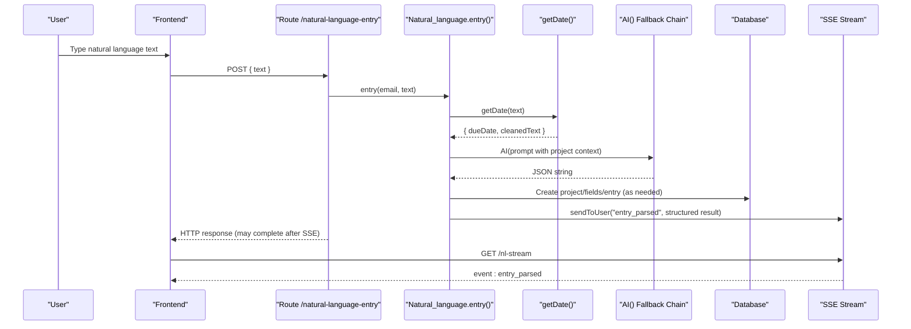
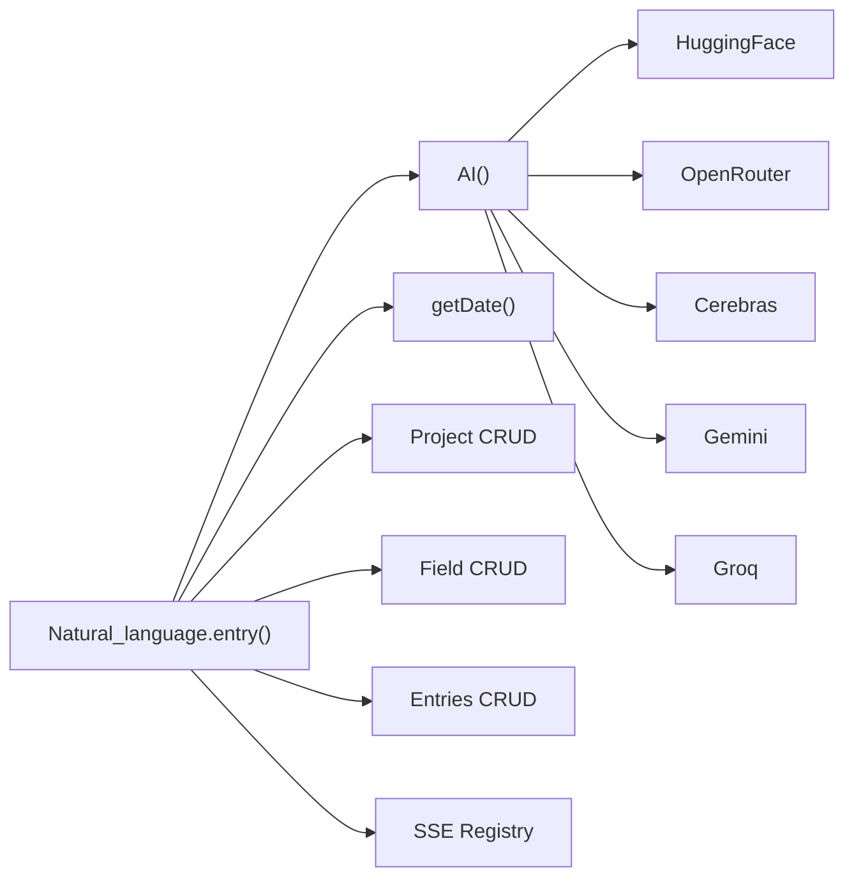

# Natural Language Processing

<cite>
**Referenced Files in This Document**
- [entries.js](file://services/project-service/src/functions/entries.js)
- [ai.js](file://services/project-service/src/functions/ai.js)
- [natural_language.js](file://frontend/src/functions/project/natural_language.js)
- [entries routes](file://services/project-service/src/Routes/entries.js)
- [Dashboard.tsx](file://frontend/src/pages/Dashboard.tsx)
- [ProjectDetailPage.tsx](file://frontend/src/pages/ProjectDetailPage.tsx)
- [third-party.md](file://docs-site/docs/Architecture/third-party.md)
- [sse.md](file://docs-site/docs/Architecture/sse.md)
- [teck-stack.md](file://docs-site/docs/Architecture/teck-stack.md)
- [natural_language.test.js](file://services/project-service/src/__tests__/natural_language.test.js)
</cite>

## Table of Contents

1. [Introduction](#introduction)
2. [Project Structure](#project-structure)
3. [Core Components](#core-components)
4. [Architecture Overview](#architecture-overview)
5. [Detailed Component Analysis](#detailed-component-analysis)
6. [Dependency Analysis](#dependency-analysis)
7. [Performance Considerations](#performance-considerations)
8. [Troubleshooting Guide](#troubleshooting-guide)
9. [Conclusion](#conclusion)
10. [Appendices](#appendices)

## Introduction

This document explains how Codacaine parses natural language input to create structured tasks, including due dates, priorities, and project associations. It covers the prompt engineering strategy that enforces strict JSON responses, the system instruction format used across AI providers, how different task descriptions are processed, supported natural language patterns for date parsing, parsing accuracy considerations, fallback mechanisms when AI processing fails, and integration with multiple AI providers.

## Project Structure

The natural language pipeline spans frontend and backend:

- Frontend sends a POST request to the project service’s natural language endpoint and relies on Server-Sent Events (SSE) to receive parsed results quickly.
- The backend orchestrates date extraction, AI prompting, provider fallbacks, project matching, entry creation, and SSE streaming.

**Diagram sources**

- [entries routes:235-325](file://services/project-service/src/Routes/entries.js#L235-L325)
- [entries.js:712-957](file://services/project-service/src/functions/entries.js#L712-L957)
- [ai.js:403-462](file://services/project-service/src/functions/ai.js#L403-L462)
- [sse.md:44-45](file://docs-site/docs/Architecture/sse.md#L44-L45)

**Section sources**

- [natural_language.js:1-44](file://frontend/src/functions/project/natural_language.js#L1-L44)
- [entries routes:235-325](file://services/project-service/src/Routes/entries.js#L235-L325)
- [entries.js:712-957](file://services/project-service/src/functions/entries.js#L712-L957)
- [ai.js:403-462](file://services/project-service/src/functions/ai.js#L403-L462)
- [sse.md:44-45](file://docs-site/docs/Architecture/sse.md#L44-L45)

## Core Components

- Natural language parser: Builds a detailed prompt with project context, field rules, splitting logic, and response schema; calls the AI layer and processes structured JSON into entries or projects.
- Date extraction: Deterministic regex-based parser for relative and absolute dates, independent of AI.
- AI provider chain: Multi-provider fallback with rate-limit detection, cooldowns, and retries.
- SSE delivery: Immediate push of parsed data to the frontend before full persistence completes.

Key responsibilities:

- Extract due dates deterministically using keyword matching and date math.
- Use AI to infer project match, fields, priority, and split multi-activity inputs.
- Enforce strict JSON via system instructions and provider-specific response formats.
- Provide robust fallbacks and user-friendly error messages.

**Section sources**

- [entries.js:409-640](file://services/project-service/src/functions/entries.js#L409-L640)
- [entries.js:642-710](file://services/project-service/src/functions/entries.js#L642-L710)
- [entries.js:712-957](file://services/project-service/src/functions/entries.js#L712-L957)
- [ai.js:38-40](file://services/project-service/src/functions/ai.js#L38-L40)
- [ai.js:174-279](file://services/project-service/src/functions/ai.js#L174-L279)
- [ai.js:338-462](file://services/project-service/src/functions/ai.js#L338-L462)

## Architecture Overview

The end-to-end flow from user input to persisted entry:

**Diagram sources**

- [entries routes:235-325](file://services/project-service/src/Routes/entries.js#L235-L325)
- [entries.js:712-957](file://services/project-service/src/functions/entries.js#L712-L957)
- [entries.js:409-640](file://services/project-service/src/functions/entries.js#L409-L640)
- [ai.js:403-462](file://services/project-service/src/functions/ai.js#L403-L462)

## Detailed Component Analysis

### Natural Language Parser: Prompt Engineering and Response Schema

- System instruction: A global constant instructs models to return valid JSON only, without markdown or extra text.
- Prompt construction: Includes today’s date, user’s existing projects with fields, cleaned text (with dates removed), step-by-step reasoning requirements, splitting rules, project matching rules, new project naming constraints, field naming/value guidelines, handling incomplete input, and a final JSON schema with examples.
- Response parsing: Strips markdown code fences, parses JSON, validates matched type, maps numeric priority to labels, and branches based on matched values (0, 1, 2, 3).

Supported matched modes:

- matched=0: New project + entry creation.
- matched=1: Entry added to an existing project.
- matched=2: Project-only creation (no entry).
- matched=3: Multiple distinct tasks across existing and/or new projects.

Error handling:

- Empty AI response triggers a friendly failure message.
- Invalid JSON returns a clear error with the raw response snippet.
- Mismatched project claims are rejected if not found among active projects.

**Section sources**

- [ai.js:38-40](file://services/project-service/src/functions/ai.js#L38-L40)
- [entries.js:753-957](file://services/project-service/src/functions/entries.js#L753-L957)
- [entries.js:990-1007](file://services/project-service/src/functions/entries.js#L990-L1007)
- [entries.js:1022-1379](file://services/project-service/src/functions/entries.js#L1022-L1379)

### Date Extraction: Deterministic Parsing

- Uses fuzzy correction for misspelled keywords via Levenshtein distance.
- Recognizes patterns like “today”, “tomorrow”, “next Monday”, “in X days/weeks”, “X days from now”, “end of week/month”, and explicit month-day formats.
- Returns both the calculated ISO date and cleaned text with date references removed so AI focuses on content rather than date math.

Supported patterns include:

- Relative: today, tomorrow, yesterday, next week, in X days/weeks, X days/weeks from now/from [day].
- Named days: next Monday/Tuesday/etc., bare day names mapped to next occurrence.
- End-of-period: end of week (next Friday), end of month.
- Explicit: month name + day, day + month name, optional year.

Complexity:

- Keyword correction is O(n*k) where n is word count and k is number of known keywords; typically small and fast.
- Regex matching runs over cleaned text once per pattern set; overall linear in text length.

**Section sources**

- [entries.js:409-640](file://services/project-service/src/functions/entries.js#L409-L640)

### AI Provider Integration and Fallback Strategy

- Providers: HuggingFace, OpenRouter, Cerebras, Gemini, Groq.
- Each provider has a model list ordered by reliability and availability.
- System instruction is injected consistently; some providers use SDK-native JSON enforcement (e.g., Gemini’s responseMimeType), others use client-level response_format flags.
- Rate limiting detection inspects status codes and messages; exponential backoff retries within a provider before moving to the next.
- Cooldown mechanism persists provider cooldowns to avoid repeated failures during outages.

Provider-specific notes:

- OpenRouter/Groq: Use response_format json_object.
- Gemini: Uses generationConfig with responseMimeType application/json and systemInstruction.
- HuggingFace/Cerebras: Low temperature for deterministic outputs.

Fallback order:

- HuggingFace → OpenRouter → Cerebras → Gemini → Groq.

**Section sources**

- [ai.js:42-117](file://services/project-service/src/functions/ai.js#L42-L117)
- [ai.js:174-279](file://services/project-service/src/functions/ai.js#L174-L279)
- [ai.js:338-462](file://services/project-service/src/functions/ai.js#L338-L462)
- [third-party.md:304-321](file://docs-site/docs/Architecture/third-party.md#L304-L321)

### SSE Delivery and Frontend Handling

- Frontend posts to /service/natural-language-entry with a short timeout; it does not wait for full persistence.
- Backend pushes parsed data immediately via SSE event “entry_parsed” before completing the full response cycle.
- Frontend listens to /service/nl-stream and updates UI upon receiving the event.
- Robust AI response parsing on the frontend handles varied JSON shapes or plain text fallbacks.

**Section sources**

- [natural_language.js:1-44](file://frontend/src/functions/project/natural_language.js#L1-L44)
- [entries routes:193-233](file://services/project-service/src/Routes/entries.js#L193-L233)
- [entries routes:235-325](file://services/project-service/src/Routes/entries.js#L235-L325)
- [Dashboard.tsx:55-98](file://frontend/src/pages/Dashboard.tsx#L55-L98)
- [ProjectDetailPage.tsx:30-71](file://frontend/src/pages/ProjectDetailPage.tsx#L30-L71)
- [sse.md:44-45](file://docs-site/docs/Architecture/sse.md#L44-L45)

### Supported Natural Language Patterns and Examples

Examples of supported inputs and expected behavior:

- “Fixed login bug for WebApp, urgent, due Aug 20” → matched=1 to existing project, due date parsed, priority mapped to label.
- “Migrated all user data to the new database” → matched=0, creates new project and fields, adds entry.
- “Create a project called WebsiteRedesign” → matched=2, project-only creation with optional fields.
- “Add login bug fix to WebApp and splash screen update to MobileApp” → matched=3, splits into two entries across existing projects.

These behaviors are validated by tests covering:

- Existing project matches and entry creation.
- New project creation with custom fields.
- Project-only creation.
- Multi-project splitting.
- Error cases such as invalid JSON, missing project names, and failed operations.

**Section sources**

- [natural_language.test.js:39-85](file://services/project-service/src/__tests__/natural_language.test.js#L39-L85)
- [natural_language.test.js:87-134](file://services/project-service/src/__tests__/natural_language.test.js#L87-L134)
- [natural_language.test.js:368-404](file://services/project-service/src/__tests__/natural_language.test.js#L368-L404)
- [natural_language.test.js:502-551](file://services/project-service/src/__tests__/natural_language.test.js#L502-L551)

### Parsing Accuracy Considerations

- Date parsing is deterministic and avoids AI for date math, improving reliability.
- Project matching requires strong domain overlap; ambiguous cases default to creating new projects to prevent misclassification.
- Field values must be paraphrased into clean, neutral descriptions without first-person pronouns.
- Splitting rules ensure distinct activities are separated into appropriate projects.
- Comment field provides transparent reasoning and user-facing messaging.

**Section sources**

- [entries.js:760-957](file://services/project-service/src/functions/entries.js#L760-L957)
- [entries.js:409-640](file://services/project-service/src/functions/entries.js#L409-L640)

### Fallback Mechanisms When AI Processing Fails

- If all providers fail or are on cooldown, the parser returns a user-friendly failure message.
- Invalid JSON responses are caught and reported with the raw snippet for debugging.
- Frontend handles timeouts gracefully; SSE still delivers results if backend succeeds.
- Provider cooldowns persist to avoid hammering failing services.

**Section sources**

- [entries.js:990-1007](file://services/project-service/src/functions/entries.js#L990-L1007)
- [ai.js:338-462](file://services/project-service/src/functions/ai.js#L338-L462)
- [natural_language.js:17-42](file://frontend/src/functions/project/natural_language.js#L17-L42)

## Dependency Analysis

The NLP pipeline depends on several modules and external services:

**Diagram sources**

- [entries.js:712-957](file://services/project-service/src/functions/entries.js#L712-L957)
- [ai.js:403-462](file://services/project-service/src/functions/ai.js#L403-L462)

**Section sources**

- [entries.js:712-957](file://services/project-service/src/functions/entries.js#L712-L957)
- [ai.js:403-462](file://services/project-service/src/functions/ai.js#L403-L462)

## Performance Considerations

- SSE reduces perceived latency by pushing parsed data immediately, decoupling UI updates from full persistence.
- Deterministic date parsing avoids expensive AI calls for date math.
- Provider fallback with retries and cooldowns improves resilience under rate limits.
- Background summary generation prevents blocking the main response path.

[No sources needed since this section provides general guidance]

## Troubleshooting Guide

Common issues and resolutions:

- All AI providers failed: Check environment keys and ai_provider_cooldowns table; verify provider endpoints and quotas.
- Invalid JSON from AI: Inspect logs for raw response; adjust prompts or try different providers.
- Project mismatch errors: Ensure project names exist and are not archived; refine matching criteria in prompts.
- SSE not delivering events: Verify connection to /service/nl-stream and keep-alive pings; check network buffering settings.

**Section sources**

- [entries.js:990-1007](file://services/project-service/src/functions/entries.js#L990-L1007)
- [ai.js:285-336](file://services/project-service/src/functions/ai.js#L285-L336)
- [entries routes:193-233](file://services/project-service/src/Routes/entries.js#L193-L233)

## Conclusion

Codacaine’s natural language processing combines deterministic date extraction with carefully engineered prompts to produce reliable, structured task data. The multi-provider AI fallback ensures high availability, while SSE delivers immediate feedback to users. Strict JSON enforcement, comprehensive validation, and robust error handling maintain consistency and usability across varying AI response qualities.

[No sources needed since this section summarizes without analyzing specific files]

## Appendices

### Supported Natural Language Patterns Summary

- Relative dates: today, tomorrow, yesterday, next week, in X days/weeks, X days/weeks from now/from [day].
- Named days: next Monday/Tuesday/etc., bare day names mapped to next occurrence.
- End-of-period: end of week (next Friday), end of month.
- Explicit dates: month name + day, day + month name, optional year.

**Section sources**

- [entries.js:409-640](file://services/project-service/src/functions/entries.js#L409-L640)

### Example Workflows Validated by Tests

- Match existing project and add entry with due date and priority.
- Create new project with custom fields and add entry.
- Create project-only (matched=2) with optional fields.
- Split multi-activity input into multiple entries across existing/new projects.
- Handle invalid JSON, missing project names, and operation failures.

**Section sources**

- [natural_language.test.js:39-85](file://services/project-service/src/__tests__/natural_language.test.js#L39-L85)
- [natural_language.test.js:87-134](file://services/project-service/src/__tests__/natural_language.test.js#L87-L134)
- [natural_language.test.js:368-404](file://services/project-service/src/__tests__/natural_language.test.js#L368-L404)
- [natural_language.test.js:502-551](file://services/project-service/src/__tests__/natural_language.test.js#L502-L551)
