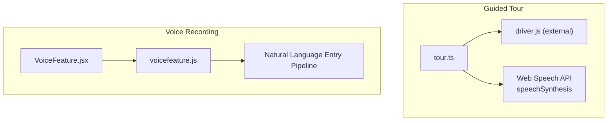
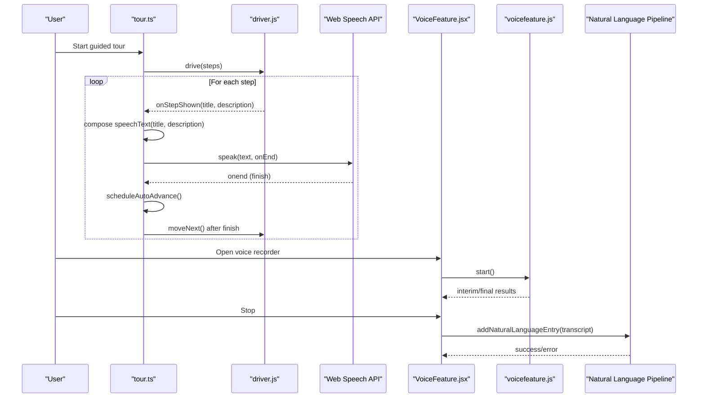
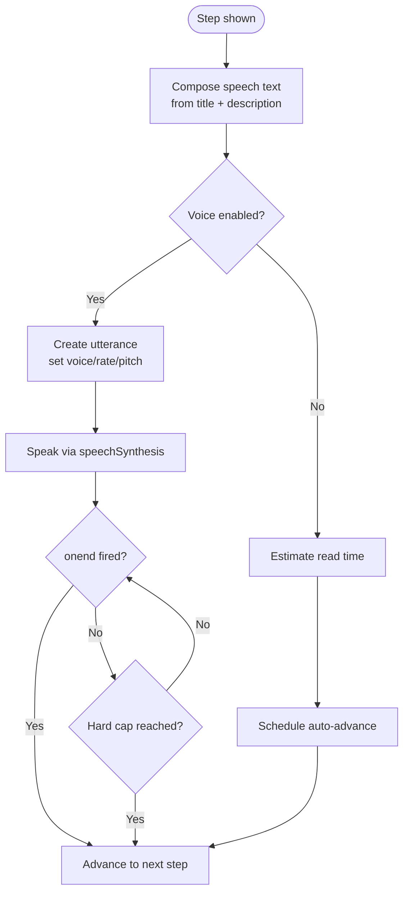
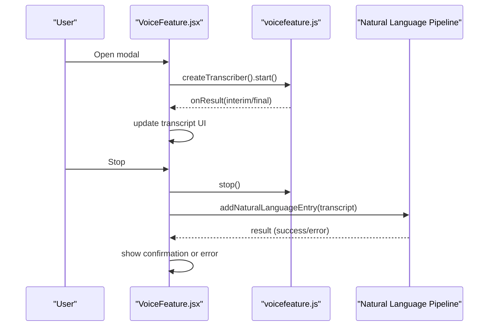
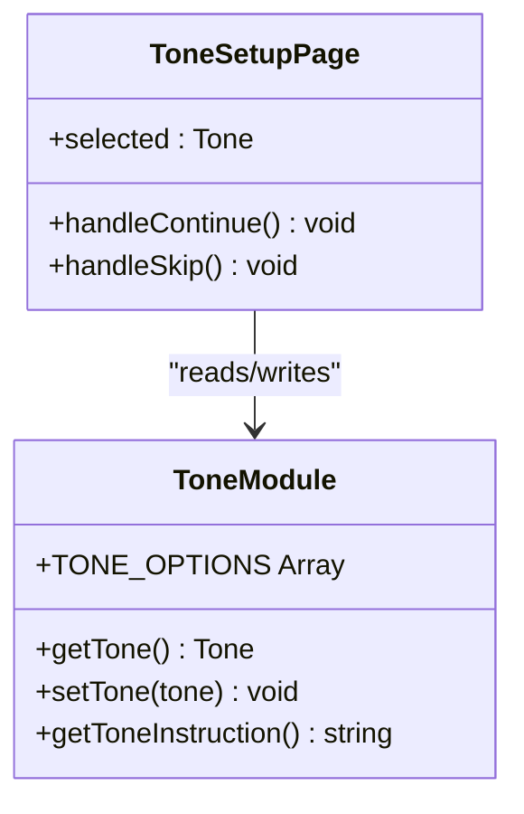
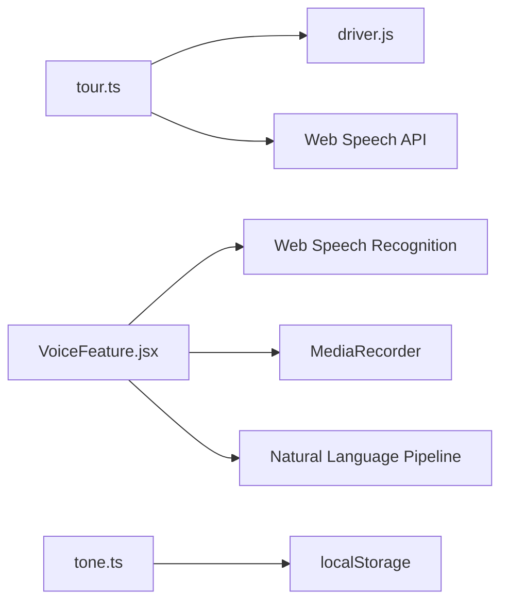

# Voice Narration & Accessibility

<cite>
**Referenced Files in This Document**
- [tour.ts](file://frontend/src/lib/tour.ts)
- [voicefeature.js](file://frontend/src/functions/voicefeature.js)
- [VoiceFeature.jsx](file://frontend/src/pages/VoiceFeature.jsx)
- [tone.ts](file://frontend/src/functions/tone.ts)
- [ToneSetup.tsx](file://frontend/src/pages/ToneSetup.tsx)
- [features.md](file://docs-site/docs/features.md)
- [issues.md](file://docs-site/docs/Project_Management/issues.md)
</cite>

## Table of Contents

1. [Introduction](#introduction)
2. [Project Structure](#project-structure)
3. [Core Components](#core-components)
4. [Architecture Overview](#architecture-overview)
5. [Detailed Component Analysis](#detailed-component-analysis)
6. [Dependency Analysis](#dependency-analysis)
7. [Performance Considerations](#performance-considerations)
8. [Troubleshooting Guide](#troubleshooting-guide)
9. [Conclusion](#conclusion)
10. [Appendices](#appendices)

## Introduction

This document explains Codacaine’s voice narration system that provides guided tours and audio feedback for accessibility. It covers:

- Speech synthesis integration using the Web Speech API for text-to-speech during guided tours
- Text-to-speech conversion and voice selection logic
- Guided tour functionality that walks users through features, navigation, and contextual help
- Tone adjustment capabilities and how they shape AI-generated messaging (distinct from speech synthesis)
- Browser compatibility considerations, voice provider fallbacks, and performance optimization for audio playback
- Privacy considerations for voice data and guidance on customizing voice experiences for different user needs

## Project Structure

The voice narration system spans two primary areas:

- Guided tour narration: implemented in a dedicated module that integrates with driver.js and uses the browser’s speech synthesis to narrate each step
- Voice recording and transcription: a full-screen modal that captures speech via the Web Speech API and converts it to entries using the natural language pipeline

**Diagram sources**

- [tour.ts:21-23](file://frontend/src/lib/tour.ts#L21-L23)
- [tour.ts:95-139](file://frontend/src/lib/tour.ts#L95-L139)
- [VoiceFeature.jsx:1-12](file://frontend/src/pages/VoiceFeature.jsx#L1-L12)
- [voicefeature.js:1-18](file://frontend/src/functions/voicefeature.js#L1-L18)

**Section sources**

- [tour.ts:1-20](file://frontend/src/lib/tour.ts#L1-L20)
- [VoiceFeature.jsx:1-12](file://frontend/src/pages/VoiceFeature.jsx#L1-L12)

## Core Components

- Guided Tour Narration Module: orchestrates steps, selects voices, speaks text, manages auto-advance pacing, and persists user preferences
- Voice Recording Modal: starts live transcription, records audio, displays transcript, and submits entries via the natural language pipeline
- Tone System: stores and applies a tone preference that shapes AI-generated messages; not directly tied to speech synthesis but part of the broader “voice experience”

Key responsibilities:

- Tour: build steps, navigate between views, open/close drawer, render popovers, integrate speech synthesis, handle hover pause/resume, persist voice preference and completion state
- Voice Feature: manage recording lifecycle, handle unsupported browsers, show live transcript, send to backend pipeline, provide retry/retake flows
- Tone: store preference, expose options, generate instruction strings for AI prompts

**Section sources**

- [tour.ts:67-139](file://frontend/src/lib/tour.ts#L67-L139)
- [tour.ts:267-417](file://frontend/src/lib/tour.ts#L267-L417)
- [VoiceFeature.jsx:15-79](file://frontend/src/pages/VoiceFeature.jsx#L15-L79)
- [voicefeature.js:9-64](file://frontend/src/functions/voicefeature.js#L9-L64)
- [tone.ts:1-74](file://frontend/src/functions/tone.ts#L1-L74)

## Architecture Overview

The guided tour uses driver.js to highlight UI elements and present contextual popovers. Each step composes spoken text from title and description, then uses speechSynthesis to narrate. Auto-advance is driven by utterance completion events rather than fixed timers, ensuring narration is never cut off. A progress bar visualizes pacing, and hovering pauses both countdown and speech.

The voice recording modal uses the Web Speech Recognition API for live transcription and a media recorder for audio capture. On stop, the final transcript is sent to the natural language entry pipeline to create entries or projects.

**Diagram sources**

- [tour.ts:267-417](file://frontend/src/lib/tour.ts#L267-L417)
- [tour.ts:419-599](file://frontend/src/lib/tour.ts#L419-L599)
- [VoiceFeature.jsx:34-79](file://frontend/src/pages/VoiceFeature.jsx#L34-L79)
- [voicefeature.js:9-64](file://frontend/src/functions/voicefeature.js#L9-L64)

## Detailed Component Analysis

### Guided Tour Narration (tour.ts)

- Step composition: builds spoken text from step title and description, decoding entities and stripping HTML tags to ensure clean speech output
- Voice selection: picks the best available English voice at runtime, preferring neural/online voices, Google voices, or known female voices, falling back to any English voice
- Speech control: creates utterances with rate and pitch tuned for clarity, cancels previous utterances before speaking new ones, and detaches event handlers to avoid stale callbacks
- Pacing: estimates reading time for muted mode and speech time for voiced mode; auto-advance waits for utterance completion with token guards to ignore stale events; includes a hard cap to prevent stuck states
- Interaction: hover pauses both countdown and speech; Back button disables auto-advance; completion and voice preference persist in localStorage

**Diagram sources**

- [tour.ts:166-199](file://frontend/src/lib/tour.ts#L166-L199)
- [tour.ts:419-505](file://frontend/src/lib/tour.ts#L419-L505)

**Section sources**

- [tour.ts:67-139](file://frontend/src/lib/tour.ts#L67-L139)
- [tour.ts:166-199](file://frontend/src/lib/tour.ts#L166-L199)
- [tour.ts:419-505](file://frontend/src/lib/tour.ts#L419-L505)
- [tour.ts:542-599](file://frontend/src/lib/tour.ts#L542-L599)

### Voice Recording Modal (VoiceFeature.jsx)

- Lifecycle: auto-starts recording and live transcription on mount; shows animated rings while recording; stops on user action or silence handling
- Transcript display: updates live transcript as recognition emits interim and final results; shows final transcript after stop
- Submission: sends transcript to the natural language entry pipeline to create entries or projects; handles single, multi-project, and project-only outcomes
- Error handling: detects unsupported browsers, microphone permission issues, and network errors; offers retry and retake actions

**Diagram sources**

- [VoiceFeature.jsx:34-79](file://frontend/src/pages/VoiceFeature.jsx#L34-L79)
- [voicefeature.js:9-64](file://frontend/src/functions/voicefeature.js#L9-L64)

**Section sources**

- [VoiceFeature.jsx:15-179](file://frontend/src/pages/VoiceFeature.jsx#L15-L179)
- [voicefeature.js:9-92](file://frontend/src/functions/voicefeature.js#L9-L92)

### Tone Adjustment (tone.ts and ToneSetup.tsx)

- Preference storage: tone is stored in localStorage under a dedicated key; defaults to a soft, encouraging tone if none is set
- Options: supports soft, tough, and cynical tones with descriptive labels and icons
- AI prompt shaping: generates instruction strings appended to AI prompts to influence message tone; this affects textual AI outputs, not speech synthesis
- UI: onboarding page lets users select tone with live preview; changes are saved and applied immediately

**Diagram sources**

- [tone.ts:1-74](file://frontend/src/functions/tone.ts#L1-L74)
- [ToneSetup.tsx:1-99](file://frontend/src/pages/ToneSetup.tsx#L1-L99)

**Section sources**

- [tone.ts:1-74](file://frontend/src/functions/tone.ts#L1-L74)
- [ToneSetup.tsx:1-99](file://frontend/src/pages/ToneSetup.tsx#L1-L99)

## Dependency Analysis

- Guided tour depends on driver.js for popover-driven steps and integrates with the browser’s speechSynthesis for narration
- Voice recording depends on Web Speech Recognition and MediaRecorder APIs; submission relies on the natural language entry pipeline
- Tone system is independent of speech synthesis and focuses on AI message tone configuration

**Diagram sources**

- [tour.ts:21-23](file://frontend/src/lib/tour.ts#L21-L23)
- [tour.ts:95-139](file://frontend/src/lib/tour.ts#L95-L139)
- [VoiceFeature.jsx:1-12](file://frontend/src/pages/VoiceFeature.jsx#L1-L12)
- [voicefeature.js:9-18](file://frontend/src/functions/voicefeature.js#L9-L18)
- [tone.ts:12-32](file://frontend/src/functions/tone.ts#L12-L32)

**Section sources**

- [tour.ts:21-23](file://frontend/src/lib/tour.ts#L21-L23)
- [voicefeature.js:9-18](file://frontend/src/functions/voicefeature.js#L9-L18)
- [tone.ts:12-32](file://frontend/src/functions/tone.ts#L12-L32)

## Performance Considerations

- Utterance-end pacing: auto-advance waits for speechSynthesis onend events to avoid cutting off narration mid-sentence; includes token guards to ignore stale callbacks from cancelled utterances
- Hard cap protection: generous upper bound prevents a stalled speech engine from hanging the tour indefinitely
- Hover pause/resume: improves UX by pausing both countdown and speech when users interact with the popover
- Voice caching: preferred voice is cached until voices change, reducing repeated lookups
- Muted mode pacing: uses a faster estimate for reading pace when voice is disabled to keep the tour responsive

[No sources needed since this section provides general guidance]

## Troubleshooting Guide

Common issues and resolutions:

- Unsupported browser for speech recognition: the modal detects missing APIs and shows an informative screen with a close option
- Microphone permission denied: surface inline error and offer retry to re-request permissions
- Transcription failures: allow retaking the recording; preserve transcript state where possible
- Network errors during quick add: show error toast and keep recording intact so users can retry
- Tour narration cut-offs: resolved by utterance-end pacing and de-duplicated step copy to avoid repeating titles; see issue notes for details

**Section sources**

- [VoiceFeature.jsx:49-58](file://frontend/src/pages/VoiceFeature.jsx#L49-L58)
- [VoiceFeature.jsx:197-220](file://frontend/src/pages/VoiceFeature.jsx#L197-L220)
- [issues.md:558-577](file://docs-site/docs/Project_Management/issues.md#L558-L577)

## Conclusion

Codacaine’s voice narration system combines a robust guided tour with accessible speech synthesis and a practical voice recording workflow. The tour leverages driver.js and the Web Speech API to narrate real UI interactions, with careful pacing and user controls to ensure a smooth experience. The voice recording modal provides hands-free entry creation via live transcription and integrates seamlessly with the natural language pipeline. Tone settings shape AI-generated messaging independently of speech synthesis, offering personalized communication styles. The implementation prioritizes privacy by keeping voice processing in-browser, respects user preferences via localStorage, and includes safeguards for unsupported environments and edge cases.

[No sources needed since this section summarizes without analyzing specific files]

## Appendices

### Browser Compatibility and Fallbacks

- Speech synthesis: checks for presence of speechSynthesis before speaking; gracefully falls back to non-voiced tour pacing when unavailable
- Speech recognition: throws a clear error if not supported; the modal surfaces an unsupported screen with guidance
- Voice provider selection: prefers neural/online voices, then Google, then known female voices, then any English voice; resets cache when voices change

**Section sources**

- [tour.ts:95-116](file://frontend/src/lib/tour.ts#L95-L116)
- [voicefeature.js:10-16](file://frontend/src/functions/voicefeature.js#L10-L16)

### Privacy Considerations

- All speech synthesis occurs locally in the browser; no audio leaves the device for narration
- Speech recognition runs in-browser; transcripts are used client-side and submitted only as text to the natural language pipeline
- Preferences (tour completion, voice toggle, tone) are stored in localStorage; no sensitive voice data is persisted

**Section sources**

- [features.md:669-678](file://docs-site/docs/features.md#L669-L678)
- [tour.ts:69-89](file://frontend/src/lib/tour.ts#L69-L89)
- [tone.ts:12-32](file://frontend/src/functions/tone.ts#L12-L32)

### Customization Guidance

- Voice toggling: users can mute/unmute narration per tour session; preference persists across sessions
- Tone selection: choose among soft, tough, and cynical tones to tailor AI messaging style
- Accessibility: ensure ARIA attributes on interactive elements (e.g., voice toggle buttons) and rely on native speech synthesis behavior for screen reader compatibility

**Section sources**

- [tour.ts:542-576](file://frontend/src/lib/tour.ts#L542-L576)
- [ToneSetup.tsx:44-77](file://frontend/src/pages/ToneSetup.tsx#L44-L77)
- [tone.ts:54-74](file://frontend/src/functions/tone.ts#L54-L74)
