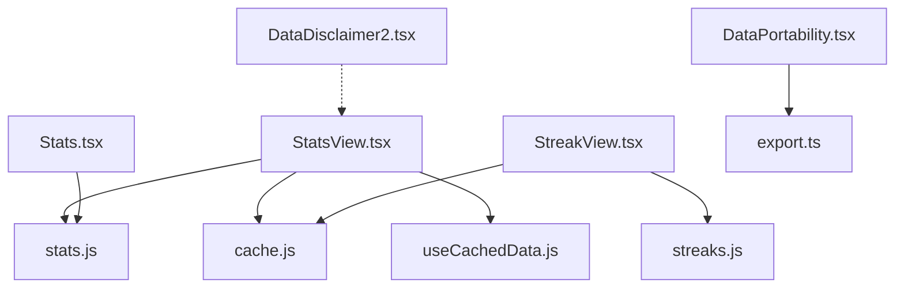
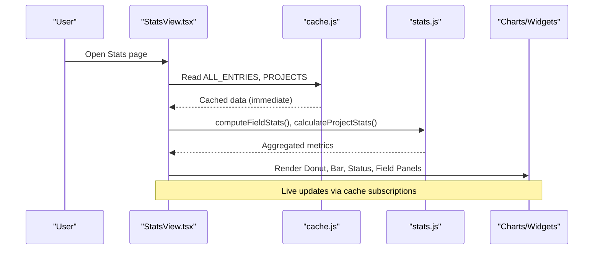
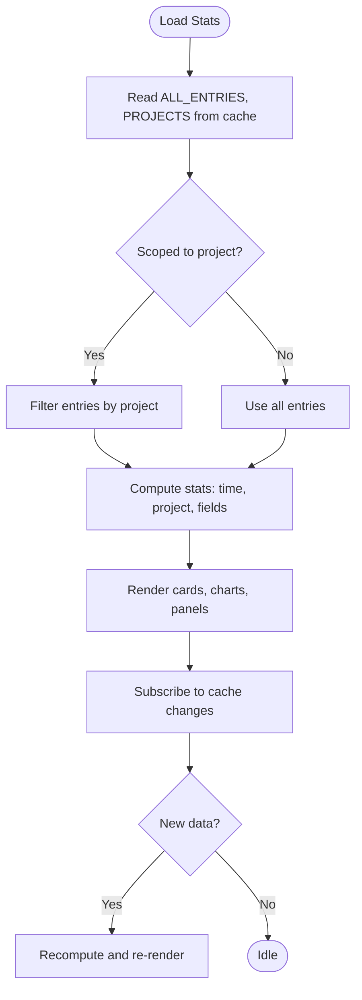
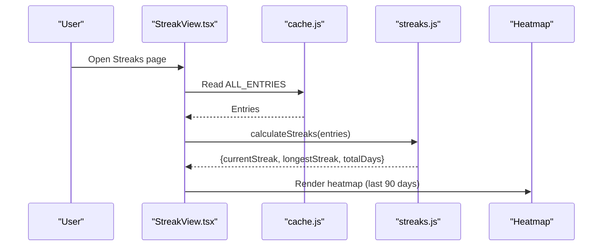
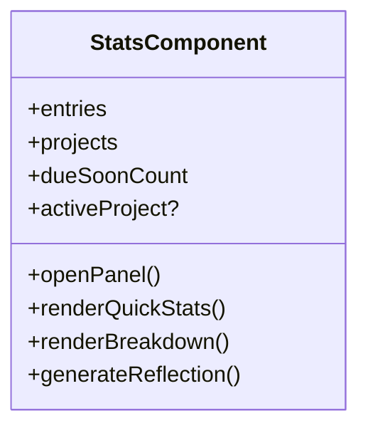
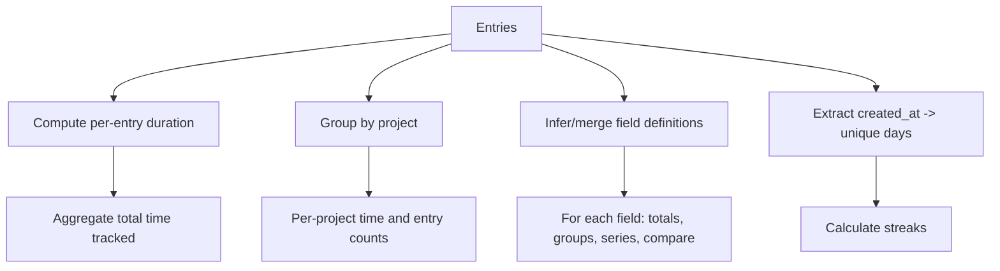
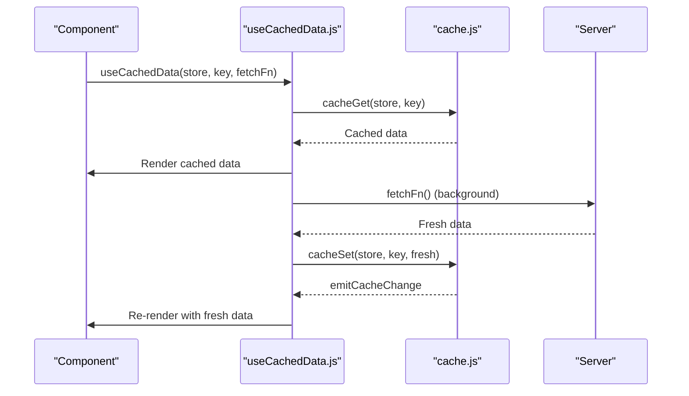
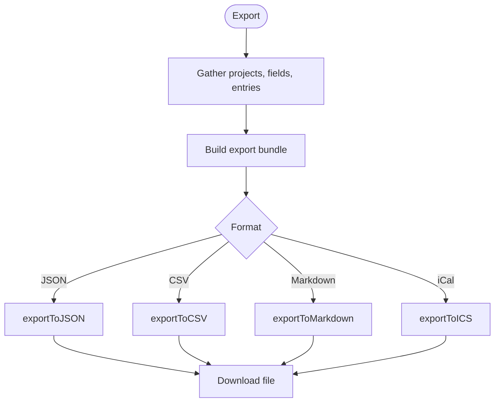
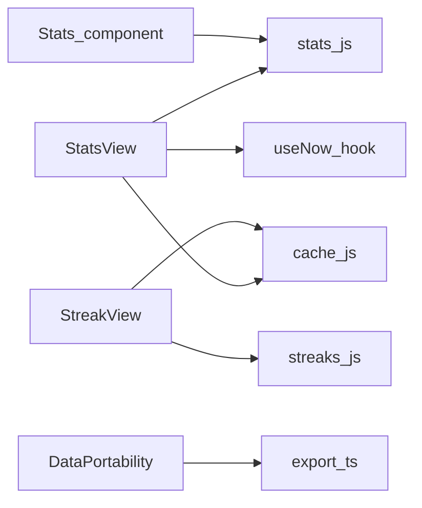

# Analytics & Statistics

<cite>
**Referenced Files in This Document**
- [StatsView.tsx](file://frontend/src/pages/StatsView.tsx)
- [StreakView.tsx](file://frontend/src/pages/StreakView.tsx)
- [Stats.tsx](file://frontend/src/components/Stats.tsx)
- [stats.js](file://frontend/src/functions/dashboard/stats.js)
- [streaks.js](file://frontend/src/functions/dashboard/streaks.js)
- [cache.js](file://frontend/src/lib/cache.js)
- [useCachedData.js](file://frontend/src/hooks/useCachedData.js)
- [export.ts](file://frontend/src/lib/export.ts)
- [DataPortability.tsx](file://frontend/src/pages/DataPortability.tsx)
- [DataDisclaimer2.tsx](file://frontend/src/pages/DataDisclaimer2.tsx)
</cite>

## Table of Contents

1. Introduction
2. Project Structure
3. Core Components
4. Architecture Overview
5. Detailed Component Analysis
6. Dependency Analysis
7. Performance Considerations
8. Troubleshooting Guide
9. Conclusion
10. Appendices

## Introduction

This document explains Codacaine’s analytics and statistics dashboard that provides insights into productivity and task completion patterns. It covers activity tracking metrics, completion streaks visualization, performance analytics, statistical calculations for productivity trends, completion rates, and time-based analysis. It also documents the dashboard components (charts, graphs, summary widgets), data aggregation strategies, caching mechanisms for performance optimization, export capabilities for external analysis, privacy considerations for personal productivity data, and customization options for metric presentation.

## Project Structure

The analytics feature spans a few key areas:

- Pages: StatsView (full stats dashboard), StreakView (streaks and heatmap), DataPortability (export/import).
- Components: Stats (quick stats panel with AI reflection).
- Functions: stats.js (time, project, and field statistics), streaks.js (streak calculations).
- Caching: cache.js (SQLite + IndexedDB local-first cache with subscriptions), useCachedData.js (React hook for cached reads).
- Export: export.ts (JSON, CSV, Markdown, iCalendar).
- Privacy: DataDisclaimer2.tsx (user rights and control messaging).

**Diagram sources**

- [StatsView.tsx:1-16](file://frontend/src/pages/StatsView.tsx#L1-L16)
- [stats.js:1-497](file://frontend/src/functions/dashboard/stats.js#L1-L497)
- [cache.js:1-389](file://frontend/src/lib/cache.js#L1-L389)
- [useCachedData.js:1-100](file://frontend/src/hooks/useCachedData.js#L1-L100)
- [StreakView.tsx:1-8](file://frontend/src/pages/StreakView.tsx#L1-L8)
- [streaks.js:1-110](file://frontend/src/functions/dashboard/streaks.js#L1-L110)
- [Stats.tsx:1-6](file://frontend/src/components/Stats.tsx#L1-L6)
- [DataPortability.tsx:1-29](file://frontend/src/pages/DataPortability.tsx#L1-L29)
- [export.ts:1-49](file://frontend/src/lib/export.ts#L1-L49)
- [DataDisclaimer2.tsx:135-175](file://frontend/src/pages/DataDisclaimer2.tsx#L135-L175)

**Section sources**

- [StatsView.tsx:1-722](file://frontend/src/pages/StatsView.tsx#L1-L722)
- [StreakView.tsx:1-265](file://frontend/src/pages/StreakView.tsx#L1-L265)
- [Stats.tsx:1-268](file://frontend/src/components/Stats.tsx#L1-L268)
- [stats.js:1-497](file://frontend/src/functions/dashboard/stats.js#L1-L497)
- [streaks.js:1-110](file://frontend/src/functions/dashboard/streaks.js#L1-L110)
- [cache.js:1-389](file://frontend/src/lib/cache.js#L1-L389)
- [useCachedData.js:1-100](file://frontend/src/hooks/useCachedData.js#L1-L100)
- [export.ts:1-409](file://frontend/src/lib/export.ts#L1-L409)
- [DataPortability.tsx:1-674](file://frontend/src/pages/DataPortability.tsx#L1-L674)
- [DataDisclaimer2.tsx:124-182](file://frontend/src/pages/DataDisclaimer2.tsx#L124-L182)

## Core Components

- StatsView: Full analytics page with overview cards, donut chart, status breakdown, bar charts per project, and field insights panels. Supports project scoping via URL query parameter to filter all metrics to one project.
- StreakView: Displays current streak, longest streak, active days, total entries, and a 90-day activity heatmap.
- Stats component: Quick stats panel used within other views; includes optional AI-generated reflection based on recent activity.
- stats.js: Computes time tracked, per-project stats, and generic field-level statistics (totals, groups, series, compare by project).
- streaks.js: Calculates streaks from entry creation dates.
- cache.js and useCachedData.js: Local-first SQLite/IndexedDB cache with event-driven subscriptions for live updates.
- export.ts and DataPortability.tsx: Export to JSON, CSV, Markdown, iCalendar; import support for portability.

**Section sources**

- [StatsView.tsx:241-722](file://frontend/src/pages/StatsView.tsx#L241-L722)
- [StreakView.tsx:15-265](file://frontend/src/pages/StreakView.tsx#L15-L265)
- [Stats.tsx:19-268](file://frontend/src/components/Stats.tsx#L19-L268)
- [stats.js:99-151](file://frontend/src/functions/dashboard/stats.js#L99-L151)
- [stats.js:163-497](file://frontend/src/functions/dashboard/stats.js#L163-L497)
- [streaks.js:54-110](file://frontend/src/functions/dashboard/streaks.js#L54-L110)
- [cache.js:1-389](file://frontend/src/lib/cache.js#L1-L389)
- [useCachedData.js:1-100](file://frontend/src/hooks/useCachedData.js#L1-L100)
- [export.ts:1-409](file://frontend/src/lib/export.ts#L1-L409)
- [DataPortability.tsx:91-215](file://frontend/src/pages/DataPortability.tsx#L91-L215)

## Architecture Overview

The analytics pipeline is client-side driven:

- Data source: Entries and projects are read from a local SQLite database persisted to IndexedDB. Subscriptions notify UI when data changes.
- Computation: Pure functions compute time totals, project breakdowns, field insights, and streaks.
- Visualization: Custom SVG-based charts render distributions, timelines, and heatmaps.
- Export: Bundles are built and serialized to multiple formats for external analysis.

**Diagram sources**

- [StatsView.tsx:260-374](file://frontend/src/pages/StatsView.tsx#L260-L374)
- [stats.js:129-151](file://frontend/src/functions/dashboard/stats.js#L129-L151)
- [stats.js:416-497](file://frontend/src/functions/dashboard/stats.js#L416-L497)
- [cache.js:179-223](file://frontend/src/lib/cache.js#L179-L223)

## Detailed Component Analysis

### StatsView: Dashboard and Metrics

- Loads entries/projects from cache, subscribes to changes, and recomputes metrics.
- Supports project scoping via URL query parameter to filter all stats to a single project.
- Uses a ticking timestamp only while tasks are running to keep in-progress durations live.
- Renders:
  - Overview cards: Total Entries, Completed or Active Projects, Due Soon, Time Tracked.
  - Donut chart: Time distribution across projects (hidden when scoped).
  - Status breakdown: Completed, In Progress, No Timer rings.
  - Bar charts: Time per project and Entries per project (hidden when scoped).
  - Field Insights: Generic panels per owner-defined field showing totals, group-by, daily sparkline, and project comparison.

**Diagram sources**

- [StatsView.tsx:260-374](file://frontend/src/pages/StatsView.tsx#L260-L374)
- [StatsView.tsx:375-722](file://frontend/src/pages/StatsView.tsx#L375-L722)

**Section sources**

- [StatsView.tsx:241-722](file://frontend/src/pages/StatsView.tsx#L241-L722)

### StreakView: Activity Heatmap and Streaks

- Reads entries from cache and computes streaks using created_at timestamps.
- Displays:
  - Current streak, longest streak, active days, total entries.
  - 90-day heatmap of daily entry counts with intensity mapping.

**Diagram sources**

- [StreakView.tsx:26-61](file://frontend/src/pages/StreakView.tsx#L26-L61)
- [streaks.js:54-98](file://frontend/src/functions/dashboard/streaks.js#L54-L98)
- [StreakView.tsx:192-262](file://frontend/src/pages/StreakView.tsx#L192-L262)

**Section sources**

- [StreakView.tsx:15-265](file://frontend/src/pages/StreakView.tsx#L15-L265)
- [streaks.js:1-110](file://frontend/src/functions/dashboard/streaks.js#L1-L110)

### Stats Component: Quick Panel and AI Reflection

- Shows quick stats for all entries or scoped to an active project.
- Optionally generates an AI reflection summarizing recent activity when opened.
- Uses a ticking timestamp to update in-progress durations live.

**Diagram sources**

- [Stats.tsx:19-268](file://frontend/src/components/Stats.tsx#L19-L268)

**Section sources**

- [Stats.tsx:1-268](file://frontend/src/components/Stats.tsx#L1-L268)

### Statistical Calculations: Productivity Trends, Completion Rates, Time-Based Analysis

- Time tracking:
  - Entry duration computed from started_at/ended_at; in-progress entries use live now to compute elapsed time.
  - Total time tracked aggregates completed and in-progress durations.
- Project stats:
  - Per-project totals of entries and time, sorted by time descending.
- Field insights:
  - For each field (owner-defined or inferred), computes:
    - Totals and averages for numeric/duration types.
    - Group-by value counts.
    - Daily series for plotting trends.
    - Compare by project (sum or count depending on type).
- Streaks:
  - Current streak counts consecutive days backwards from today/yesterday.
  - Longest streak scans sorted unique days for runs.
  - Total days counts unique active days.

**Diagram sources**

- [stats.js:72-122](file://frontend/src/functions/dashboard/stats.js#L72-L122)
- [stats.js:129-151](file://frontend/src/functions/dashboard/stats.js#L129-L151)
- [stats.js:163-497](file://frontend/src/functions/dashboard/stats.js#L163-L497)
- [streaks.js:54-98](file://frontend/src/functions/dashboard/streaks.js#L54-L98)

**Section sources**

- [stats.js:1-497](file://frontend/src/functions/dashboard/stats.js#L1-L497)
- [streaks.js:1-110](file://frontend/src/functions/dashboard/streaks.js#L1-L110)

### Data Aggregation Strategies and Caching Mechanisms

- Local-first storage:
  - SQLite database compiled to WebAssembly, persisted to IndexedDB for durability.
  - Tables mirror server schema; data stored as JSON for compatibility.
- Event-driven subscriptions:
  - Components subscribe to specific store:key pairs; writes trigger notifications and re-renders.
- Stale-while-revalidate:
  - Returns cached data immediately, then fetches fresh data in background and updates cache.
- Hooks:
  - useCachedData reads from cache first, subscribes to changes, and triggers background fetch.

**Diagram sources**

- [useCachedData.js:23-75](file://frontend/src/hooks/useCachedData.js#L23-L75)
- [cache.js:179-223](file://frontend/src/lib/cache.js#L179-L223)
- [cache.js:305-346](file://frontend/src/lib/cache.js#L305-L346)

**Section sources**

- [cache.js:1-389](file://frontend/src/lib/cache.js#L1-L389)
- [useCachedData.js:1-100](file://frontend/src/hooks/useCachedData.js#L1-L100)

### Export Capabilities for External Analysis

- Formats:
  - JSON: Versioned bundle including projects, fields, and entries (active and archived).
  - CSV: Projects block followed by entries block with standardized columns.
  - Markdown: Human-readable tables for projects and entries.
  - iCalendar: Events derived from started_at/due_date/ended_at with status/priority mapping.
- DataPortability page orchestrates export and import flows, including error reporting and success feedback.

**Diagram sources**

- [DataPortability.tsx:91-215](file://frontend/src/pages/DataPortability.tsx#L91-L215)
- [export.ts:112-238](file://frontend/src/lib/export.ts#L112-L238)
- [export.ts:323-408](file://frontend/src/lib/export.ts#L323-L408)

**Section sources**

- [export.ts:1-409](file://frontend/src/lib/export.ts#L1-L409)
- [DataPortability.tsx:91-215](file://frontend/src/pages/DataPortability.tsx#L91-L215)

### Privacy Considerations for Personal Productivity Data

- User rights and control:
  - Export all data at any time via Settings → Data Portability.
  - Delete account permanently with a grace period.
  - Data ownership statement: never sold or shared with advertisers; used only to run the app.
- Transparency:
  - Open-source code allows public audit of data handling.

**Section sources**

- [DataDisclaimer2.tsx:135-175](file://frontend/src/pages/DataDisclaimer2.tsx#L135-L175)

### Customization Options for Metric Presentation

- Project scoping:
  - StatsView supports filtering all metrics to a single project via URL query parameter, hiding cross-project visuals and focusing on project-specific insights.
- Field insights:
  - Generic panels adapt to owner-defined fields, rendering totals, groupings, and series based on declared or inferred data types.
- Visual theming:
  - Charts use theme variables for colors and opacities to ensure consistent appearance across themes.

**Section sources**

- [StatsView.tsx:241-374](file://frontend/src/pages/StatsView.tsx#L241-L374)
- [stats.js:163-497](file://frontend/src/functions/dashboard/stats.js#L163-L497)

## Dependency Analysis

- StatsView depends on:
  - stats.js for computations.
  - cache.js for data access and subscriptions.
  - useNow hook for live ticks during in-progress tasks.
- StreakView depends on:
  - streaks.js for streak calculations.
  - cache.js for data access.
- Stats component depends on:
  - stats.js for time/project stats.
  - AI integration for reflections (optional).
- DataPortability depends on:
  - export.ts for serialization.
  - API functions for fetching projects, entries, fields.

**Diagram sources**

- [StatsView.tsx:1-16](file://frontend/src/pages/StatsView.tsx#L1-L16)
- [stats.js:1-497](file://frontend/src/functions/dashboard/stats.js#L1-L497)
- [cache.js:1-389](file://frontend/src/lib/cache.js#L1-L389)
- [StreakView.tsx:1-8](file://frontend/src/pages/StreakView.tsx#L1-L8)
- [streaks.js:1-110](file://frontend/src/functions/dashboard/streaks.js#L1-L110)
- [Stats.tsx:1-6](file://frontend/src/components/Stats.tsx#L1-L6)
- [DataPortability.tsx:1-29](file://frontend/src/pages/DataPortability.tsx#L1-L29)
- [export.ts:1-49](file://frontend/src/lib/export.ts#L1-L49)

**Section sources**

- [StatsView.tsx:1-722](file://frontend/src/pages/StatsView.tsx#L1-L722)
- [StreakView.tsx:1-265](file://frontend/src/pages/StreakView.tsx#L1-L265)
- [Stats.tsx:1-268](file://frontend/src/components/Stats.tsx#L1-L268)
- [DataPortability.tsx:1-674](file://frontend/src/pages/DataPortability.tsx#L1-L674)

## Performance Considerations

- Local-first caching:
  - Immediate reads from SQLite/IndexedDB reduce latency and network calls.
  - Subscriptions enable efficient incremental updates without full reloads.
- Selective ticking:
  - Ticking timestamp only activates when there are in-progress entries, minimizing unnecessary renders.
- Efficient computations:
  - Map-based aggregations for project stats and field insights avoid repeated scans.
  - Series and groups are computed once per render cycle using memoization in components.
- Export efficiency:
  - Build a single bundle and serialize to desired format to minimize redundant processing.

[No sources needed since this section provides general guidance]

## Troubleshooting Guide

- Stats not updating:
  - Ensure cache subscriptions are active for ALL_ENTRIES and PROJECTS stores.
  - Verify that writes call cacheSet to trigger emitCacheChange.
- Incorrect time tracked:
  - Check that entries have started_at and ended_at; in-progress entries rely on a ticking now value.
- Missing field insights:
  - Confirm field definitions exist or can be inferred; ensure reserved keys are excluded.
- Export/import failures:
  - Validate input files and check import report for rejected rows and failure messages.

**Section sources**

- [cache.js:59-72](file://frontend/src/lib/cache.js#L59-L72)
- [cache.js:201-223](file://frontend/src/lib/cache.js#L201-L223)
- [stats.js:72-122](file://frontend/src/functions/dashboard/stats.js#L72-L122)
- [stats.js:190-248](file://frontend/src/functions/dashboard/stats.js#L190-L248)
- [DataPortability.tsx:219-351](file://frontend/src/pages/DataPortability.tsx#L219-L351)

## Conclusion

Codacaine’s analytics and statistics dashboard delivers comprehensive insights into productivity through robust client-side computations, local-first caching, and flexible visualizations. The system supports project-scoped analysis, field-level insights, streak tracking, and rich export capabilities. Privacy controls and transparency ensure user trust, while performance optimizations provide responsive experiences even with large datasets.

[No sources needed since this section summarizes without analyzing specific files]

## Appendices

### Key Metrics Reference

- Time Tracked: Sum of completed durations plus live elapsed for in-progress entries.
- Completion Rate: Ratio of completed entries to total entries.
- Streaks: Consecutive active days based on created_at timestamps.
- Field Insights: Per-field totals, averages, groupings, daily series, and project comparisons.

**Section sources**

- [stats.js:72-151](file://frontend/src/functions/dashboard/stats.js#L72-L151)
- [streaks.js:54-98](file://frontend/src/functions/dashboard/streaks.js#L54-L98)
- [stats.js:416-497](file://frontend/src/functions/dashboard/stats.js#L416-L497)
