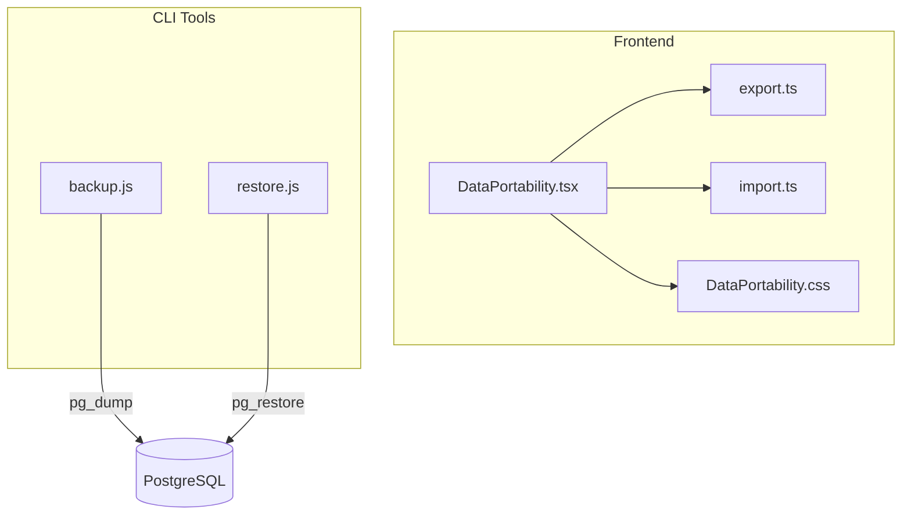
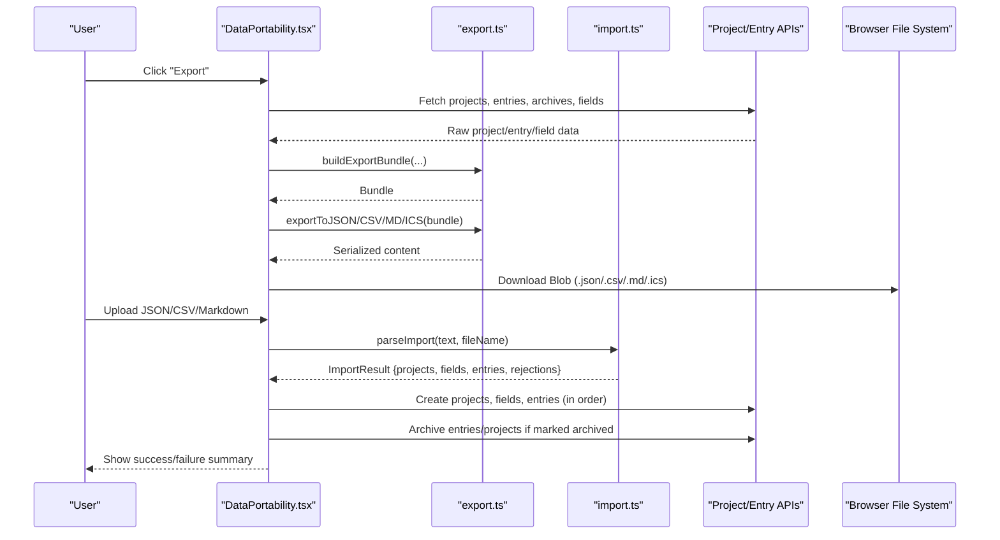
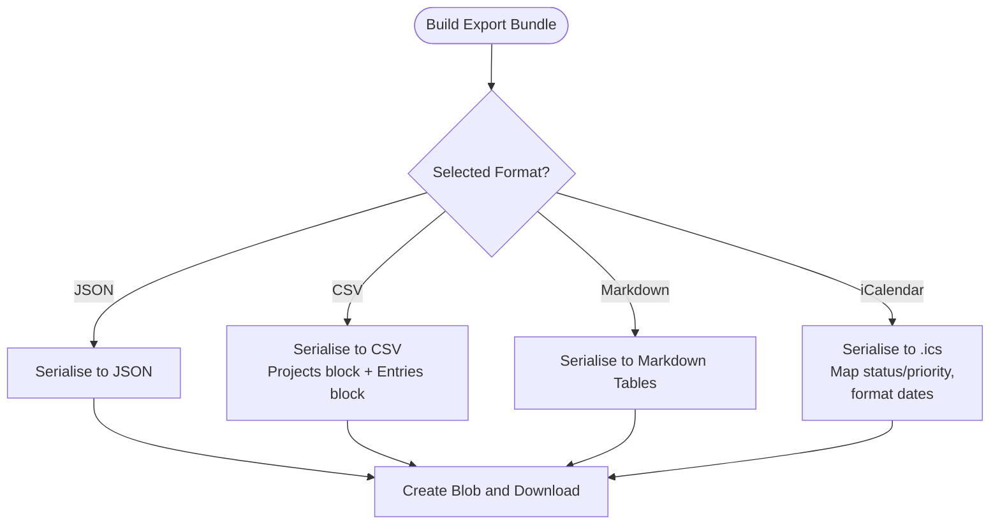
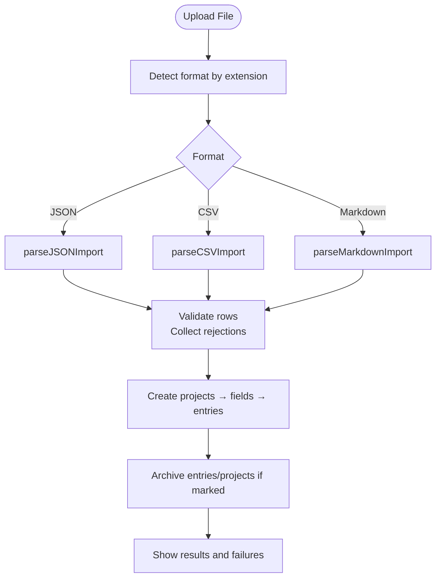
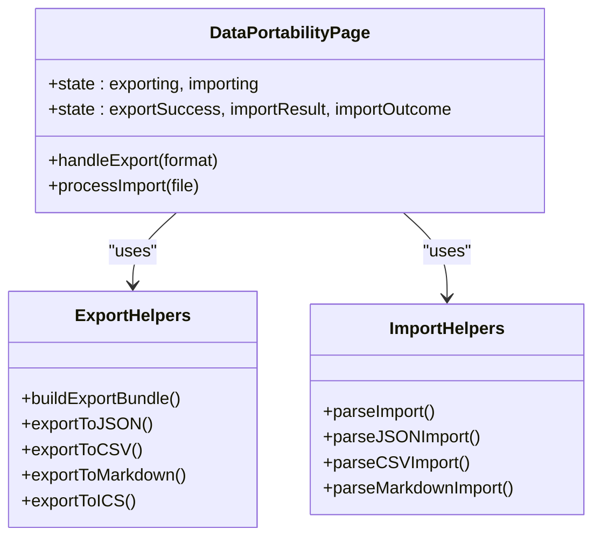
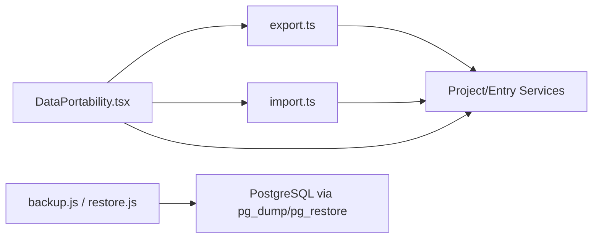

# Data Import & Export

<cite>
**Referenced Files in This Document**
- [DataPortability.tsx](file://frontend/src/pages/DataPortability.tsx)
- [export.ts](file://frontend/src/lib/export.ts)
- [import.ts](file://frontend/src/lib/import.ts)
- [DataPortability.css](file://frontend/src/pages/DataPortability.css)
- [features.md](file://docs-site/docs/features.md)
- [backup.js](file://scripts/backup.js)
- [restore.js](file://scripts/restore.js)
</cite>

## Table of Contents

1. [Introduction](#introduction)
2. [Project Structure](#project-structure)
3. [Core Components](#core-components)
4. [Architecture Overview](#architecture-overview)
5. [Detailed Component Analysis](#detailed-component-analysis)
6. [Dependency Analysis](#dependency-analysis)
7. [Performance Considerations](#performance-considerations)
8. [Troubleshooting Guide](#troubleshooting-guide)
9. [Security Considerations](#security-considerations)
10. [Best Practices for Backup and Migration](#best-practices-for-backup-and-migration)
11. [Conclusion](#conclusion)

## Introduction

This document explains Codacaine’s data portability features that enable exporting and importing application data across multiple formats, along with database backup and restore tooling. It covers:

- Export to JSON (complete, versioned backup), CSV (spreadsheet-friendly), Markdown (human-readable documentation), and iCalendar (.ics) for calendar integration.
- Import from JSON, CSV, and Markdown with bulk processing, row-level validation, and detailed error reporting.
- The user interface for performing export/import operations, including progress indicators and result summaries.
- Security considerations, file size limitations, and best practices for backups and migrations.

## Project Structure

The data portability feature spans the frontend UI, format serialization/parsing utilities, and CLI scripts for database-level backups and restores.

**Diagram sources**

- [DataPortability.tsx:93-215](file://frontend/src/pages/DataPortability.tsx#L93-L215)
- [export.ts:112-133](file://frontend/src/lib/export.ts#L112-L133)
- [import.ts:135-211](file://frontend/src/lib/import.ts#L135-L211)
- [backup.js:22-99](file://scripts/backup.js#L22-L99)
- [restore.js:20-130](file://scripts/restore.js#L20-L130)

**Section sources**

- [DataPortability.tsx:1-674](file://frontend/src/pages/DataPortability.tsx#L1-L674)
- [export.ts:1-409](file://frontend/src/lib/export.ts#L1-L409)
- [import.ts:1-438](file://frontend/src/lib/import.ts#L1-L438)
- [DataPortability.css:1-171](file://frontend/src/pages/DataPortability.css#L1-L171)
- [backup.js:1-106](file://scripts/backup.js#L1-L106)
- [restore.js:1-137](file://scripts/restore.js#L1-L137)

## Core Components

- Export bundle model: a versioned structure containing projects, fields, and entries, plus metadata such as exported timestamp and user email.
- Serializers: JSON, CSV, Markdown, and iCalendar generators that preserve archived items and map status/priority appropriately.
- Parsers and validators: robust importers for JSON, CSV, and Markdown that validate rows and report rejections with line numbers.
- UI orchestration: collects live data, builds bundles, triggers downloads, and drives the import workflow with progress and results.
- Database backup/restore: CLI tools using PostgreSQL utilities to create and apply compressed dumps.

**Section sources**

- [export.ts:13-48](file://frontend/src/lib/export.ts#L13-L48)
- [export.ts:112-133](file://frontend/src/lib/export.ts#L112-L133)
- [export.ts:164-187](file://frontend/src/lib/export.ts#L164-L187)
- [export.ts:201-238](file://frontend/src/lib/export.ts#L201-L238)
- [export.ts:323-408](file://frontend/src/lib/export.ts#L323-L408)
- [import.ts:16-28](file://frontend/src/lib/import.ts#L16-L28)
- [import.ts:135-211](file://frontend/src/lib/import.ts#L135-L211)
- [import.ts:260-322](file://frontend/src/lib/import.ts#L260-L322)
- [import.ts:348-414](file://frontend/src/lib/import.ts#L348-L414)
- [import.ts:419-437](file://frontend/src/lib/import.ts#L419-L437)
- [DataPortability.tsx:93-215](file://frontend/src/pages/DataPortability.tsx#L93-L215)
- [DataPortability.tsx:219-352](file://frontend/src/pages/DataPortability.tsx#L219-L352)

## Architecture Overview

The data portability flow is split into two main paths: export and import. Both rely on shared models and utilities.

**Diagram sources**

- [DataPortability.tsx:93-215](file://frontend/src/pages/DataPortability.tsx#L93-L215)
- [DataPortability.tsx:219-352](file://frontend/src/pages/DataPortability.tsx#L219-L352)
- [export.ts:112-133](file://frontend/src/lib/export.ts#L112-L133)
- [export.ts:164-187](file://frontend/src/lib/export.ts#L164-L187)
- [export.ts:201-238](file://frontend/src/lib/export.ts#L201-L238)
- [export.ts:323-408](file://frontend/src/lib/export.ts#L323-L408)
- [import.ts:135-211](file://frontend/src/lib/import.ts#L135-L211)
- [import.ts:260-322](file://frontend/src/lib/import.ts#L260-L322)
- [import.ts:348-414](file://frontend/src/lib/import.ts#L348-L414)
- [import.ts:419-437](file://frontend/src/lib/import.ts#L419-L437)

## Detailed Component Analysis

### Export Formats

- JSON: Versioned bundle with projects, fields, and entries; preserves all fields and archive states; ideal for round-trip safe backups.
- CSV: Two blocks separated by comment markers; entries include serialized JSONB payloads; suitable for spreadsheets.
- Markdown: Human-readable tables for projects and entries; escapes special characters to preserve table structure.
- iCalendar (.ics): RFC 5545 compliant events derived from entries with dates; maps title, description, project category, status, and priority; supports all-day and timed events.

**Diagram sources**

- [DataPortability.tsx:167-192](file://frontend/src/pages/DataPortability.tsx#L167-L192)
- [export.ts:112-133](file://frontend/src/lib/export.ts#L112-L133)
- [export.ts:164-187](file://frontend/src/lib/export.ts#L164-L187)
- [export.ts:201-238](file://frontend/src/lib/export.ts#L201-L238)
- [export.ts:323-408](file://frontend/src/lib/export.ts#L323-L408)

**Section sources**

- [export.ts:112-133](file://frontend/src/lib/export.ts#L112-L133)
- [export.ts:164-187](file://frontend/src/lib/export.ts#L164-L187)
- [export.ts:201-238](file://frontend/src/lib/export.ts#L201-L238)
- [export.ts:323-408](file://frontend/src/lib/export.ts#L323-L408)
- [DataPortability.tsx:167-192](file://frontend/src/pages/DataPortability.tsx#L167-L192)

### Import Pipeline

- Format detection: Based on file extension; fallback tries JSON, then CSV, then Markdown.
- Parsing:
  - JSON: Validates root object and version; normalizes projects, fields, entries.
  - CSV: Splits sections by comment markers; parses quoted fields; validates column counts.
  - Markdown: Parses table headers and rows; handles escaped pipes.
- Validation: Each row is validated; invalid rows are recorded with line numbers and reasons.
- Creation order: Projects first, then fields, then entries; finally, archive entries/projects as needed.

**Diagram sources**

- [import.ts:419-437](file://frontend/src/lib/import.ts#L419-L437)
- [import.ts:135-211](file://frontend/src/lib/import.ts#L135-L211)
- [import.ts:260-322](file://frontend/src/lib/import.ts#L260-L322)
- [import.ts:348-414](file://frontend/src/lib/import.ts#L348-L414)
- [DataPortability.tsx:219-352](file://frontend/src/pages/DataPortability.tsx#L219-L352)

**Section sources**

- [import.ts:135-211](file://frontend/src/lib/import.ts#L135-L211)
- [import.ts:260-322](file://frontend/src/lib/import.ts#L260-L322)
- [import.ts:348-414](file://frontend/src/lib/import.ts#L348-L414)
- [import.ts:419-437](file://frontend/src/lib/import.ts#L419-L437)
- [DataPortability.tsx:219-352](file://frontend/src/pages/DataPortability.tsx#L219-L352)

### User Interface

- Export section: Buttons for JSON, CSV, Markdown, and iCalendar; disabled during export; success message shows counts and format.
- Import section: Drag-and-drop area or file picker; accepts .json, .csv, .md, .markdown; shows loading spinner while importing.
- Results panel: Displays counts for created projects, fields, entries; lists rejected rows with line numbers; lists restore failures with details.

**Diagram sources**

- [DataPortability.tsx:93-215](file://frontend/src/pages/DataPortability.tsx#L93-L215)
- [DataPortability.tsx:219-352](file://frontend/src/pages/DataPortability.tsx#L219-L352)
- [export.ts:112-133](file://frontend/src/lib/export.ts#L112-L133)
- [import.ts:419-437](file://frontend/src/lib/import.ts#L419-L437)

**Section sources**

- [DataPortability.tsx:414-667](file://frontend/src/pages/DataPortability.tsx#L414-L667)
- [DataPortability.css:1-171](file://frontend/src/pages/DataPortability.css#L1-L171)

### iCalendar Mapping Details

- Title: Extracted from entry payload fields (title/task/name).
- Description: Concatenated from description/comment/notes.
- Category: Project name.
- Status: Maps internal statuses to iCalendar STATUS values.
- Priority: Maps internal priorities to iCalendar PRIORITY scale (1–9).
- Dates: All-day events use date-only format; timed events use ISO timestamps; defaults compute end time when missing.

**Section sources**

- [export.ts:279-317](file://frontend/src/lib/export.ts#L279-L317)
- [export.ts:323-408](file://frontend/src/lib/export.ts#L323-L408)

## Dependency Analysis

- Frontend page depends on:
  - Export helpers for building and serializing bundles.
  - Import helpers for parsing and validating uploads.
  - Project/Entry services for fetching and creating data.
- CLI tools depend on:
  - Environment configuration for database connection.
  - PostgreSQL client utilities (pg_dump/pg_restore).

**Diagram sources**

- [DataPortability.tsx:93-215](file://frontend/src/pages/DataPortability.tsx#L93-L215)
- [DataPortability.tsx:219-352](file://frontend/src/pages/DataPortability.tsx#L219-L352)
- [export.ts:112-133](file://frontend/src/lib/export.ts#L112-L133)
- [import.ts:419-437](file://frontend/src/lib/import.ts#L419-L437)
- [backup.js:22-99](file://scripts/backup.js#L22-L99)
- [restore.js:20-130](file://scripts/restore.js#L20-L130)

**Section sources**

- [DataPortability.tsx:93-352](file://frontend/src/pages/DataPortability.tsx#L93-L352)
- [export.ts:112-133](file://frontend/src/lib/export.ts#L112-L133)
- [import.ts:419-437](file://frontend/src/lib/import.ts#L419-L437)
- [backup.js:22-99](file://scripts/backup.js#L22-L99)
- [restore.js:20-130](file://scripts/restore.js#L20-L130)

## Performance Considerations

- Export performance:
  - Parallel fetching of projects, archived projects, entries, and archives reduces total latency.
  - Field retrieval per project may be numerous; consider batching or caching where possible.
  - Large datasets increase memory usage during serialization; ensure adequate browser memory headroom.
- Import performance:
  - Sequential creation ensures dependency order but can be slow for large imports; consider chunking or background jobs for very large files.
  - Row validation runs per row; malformed rows are reported without halting the entire process.
- iCalendar generation:
  - Skips entries without placable dates to avoid unnecessary event creation.
  - Date formatting and escaping are linear in number of entries.

[No sources needed since this section provides general guidance]

## Troubleshooting Guide

Common issues and resolutions:

- Invalid JSON upload:
  - Parser returns a rejection with reason indicating parse error; verify file integrity and encoding.
- Unsupported export version:
  - JSON version must be supported; upgrade or regenerate exports from compatible versions.
- CSV column mismatch:
  - Rejection includes expected vs actual column count; fix header alignment or regenerate export.
- Missing project_name:
  - Both project and entry validations require non-empty project names; correct source data.
- Duplicate project creation:
  - If project creation fails, dependent fields and entries are skipped; resolve duplicates before retrying.
- Archive failures:
  - Archived entries/projects are processed after creation; failures are listed in restore failures.

**Section sources**

- [import.ts:135-211](file://frontend/src/lib/import.ts#L135-L211)
- [import.ts:260-322](file://frontend/src/lib/import.ts#L260-L322)
- [import.ts:348-414](file://frontend/src/lib/import.ts#L348-L414)
- [DataPortability.tsx:219-352](file://frontend/src/pages/DataPortability.tsx#L219-L352)

## Security Considerations

- Data exposure:
  - Exports contain sensitive project and entry data; treat downloaded files as confidential.
- Input validation:
  - Importers validate structure and types; malformed rows are rejected with detailed reasons to prevent injection or corruption.
- Calendar safety:
  - iCalendar output escapes special characters per RFC 5545 to avoid parser issues.
- Database backups:
  - CLI tools require DATABASE_URL; ensure environment variables are protected and not committed.
  - Backups are compressed and portable; store securely and restrict access.

**Section sources**

- [export.ts:244-251](file://frontend/src/lib/export.ts#L244-L251)
- [import.ts:135-211](file://frontend/src/lib/import.ts#L135-L211)
- [backup.js:22-99](file://scripts/backup.js#L22-L99)
- [restore.js:20-130](file://scripts/restore.js#L20-L130)

## Best Practices for Backup and Migration

- Use JSON exports for complete, versioned backups; they preserve all fields and archive states and support round-trip fidelity.
- For spreadsheet workflows, prefer CSV exports; ensure headers match expected columns and handle quoted fields correctly.
- For human-readable documentation, use Markdown exports; they escape special characters to maintain table structure.
- For calendar integration, use iCalendar exports; verify that entries have dates to generate meaningful events.
- For full database backups, use the provided CLI tools:
  - Backup creates a compressed custom-format dump; restore applies it with a safety delay and schema scoping.
  - After restore, run migrations to align schema versions.
- Maintain regular backups and test restores periodically to ensure recoverability.

**Section sources**

- [features.md:282-314](file://docs-site/docs/features.md#L282-L314)
- [backup.js:22-99](file://scripts/backup.js#L22-L99)
- [restore.js:20-130](file://scripts/restore.js#L20-L130)

## Conclusion

Codacaine’s data portability suite provides robust export and import capabilities across multiple formats, ensuring users can back up, migrate, and integrate their data safely and efficiently. The UI offers clear feedback and progress indicators, while parsers and validators provide detailed error reporting. Complementary CLI tools enable reliable database backups and restores, supporting long-term data stewardship and migration scenarios.
