# Features and Functionality

<cite>
**Referenced Files in This Document**
- [Calendar.tsx](file://frontend/src/pages/Calendar.tsx)
- [Kanban.tsx](file://frontend/src/pages/Kanban.tsx)
- [Timeline.tsx](file://frontend/src/pages/Timeline.tsx)
- [Today.tsx](file://frontend/src/pages/Today.tsx)
- [calendar.ts](file://frontend/src/lib/calendar.ts)
- [kanban.ts](file://frontend/src/lib/kanban.ts)
- [timeline.ts](file://frontend/src/lib/timeline.ts)
- [today.ts](file://frontend/src/lib/today.ts)
- [cache.js](file://frontend/src/lib/cache.js)
- [syncService.js](file://frontend/src/CacheFunctions/syncService.js)
- [natural_language.js](file://frontend/src/functions/project/natural_language.js)
- [ai.js](file://frontend/src/functions/ai.js)
- [voicefeature.js](file://frontend/src/functions/voicefeature.js)
- [export.ts](file://frontend/src/lib/export.ts)
- [import.ts](file://frontend/src/lib/import.ts)
- [NotificationsBell.tsx](file://frontend/src/components/NotificationsBell.tsx)
</cite>

## Table of Contents

1. [Introduction](#introduction)
2. [Project Structure](#project-structure)
3. [Core Components](#core-components)
4. [Architecture Overview](#architecture-overview)
5. [Detailed Component Analysis](#detailed-component-analysis)
6. [Dependency Analysis](#dependency-analysis)
7. [Performance Considerations](#performance-considerations)
8. [Troubleshooting Guide](#troubleshooting-guide)
9. [Conclusion](#conclusion)
10. [Appendices](#appendices)

## Introduction

This document describes the end-user features of Codacaine with a focus on multi-view task management, AI-powered assistance, offline-first data handling, data portability, voice narration, notifications, analytics, and user preferences. It explains how each feature works at a high level and maps to concrete implementation modules so both technical and non-technical readers can understand the system’s capabilities and behavior.

## Project Structure

Codacaine is organized by feature areas:

- Pages implement user-facing views (Calendar, Kanban, Timeline, Today).
- Libraries provide pure logic for date/time, status grouping, timeline layout, and today categorization.
- Cache and sync layers provide an offline-first architecture using SQLite (via sql.js) persisted to IndexedDB, with background synchronization and derived data computation.
- AI and voice utilities integrate natural language processing and speech recognition.
- Export/import utilities support multiple formats for data portability.
- Notifications and analytics are surfaced via UI components and computed from cached data.

```mermaid
graph TB
subgraph "Views"
Calendar["Calendar Page"]
Kanban["Kanban Page"]
Timeline["Timeline Page"]
Today["Today Page"]
end
subgraph "Libraries"
CalLib["calendar.ts"]
KanbanLib["kanban.ts"]
TimeLib["timeline.ts"]
TodayLib["today.ts"]
end
subgraph "Data Layer"
Cache["cache.js (SQLite + IndexedDB)"]
Sync["syncService.js"]
end
subgraph "AI & Voice"
NL["natural_language.js"]
AI["ai.js"]
Voice["voicefeature.js"]
end
subgraph "Portability"
Export["export.ts"]
Import["import.ts"]
end
subgraph "System"
Notif["NotificationsBell.tsx"]
end
Calendar --> CalLib
Kanban --> KanbanLib
Timeline --> TimeLib
Today --> TodayLib
Calendar --> Cache
Kanban --> Cache
Timeline --> Cache
Today --> Cache
Cache < --> Sync
Voice --> NL
NL --> Sync
AI --> Sync
Export --> Cache
Import --> Cache
Notif --> Sync
```

**Diagram sources**

- [Calendar.tsx:1-516](file://frontend/src/pages/Calendar.tsx#L1-L516)
- [Kanban.tsx:1-407](file://frontend/src/pages/Kanban.tsx#L1-L407)
- [Timeline.tsx:1-398](file://frontend/src/pages/Timeline.tsx#L1-L398)
- [Today.tsx:1-275](file://frontend/src/pages/Today.tsx#L1-L275)
- [calendar.ts:1-158](file://frontend/src/lib/calendar.ts#L1-L158)
- [kanban.ts:1-130](file://frontend/src/lib/kanban.ts#L1-L130)
- [timeline.ts:1-276](file://frontend/src/lib/timeline.ts#L1-L276)
- [today.ts:1-98](file://frontend/src/lib/today.ts#L1-L98)
- [cache.js:1-389](file://frontend/src/lib/cache.js#L1-L389)
- [syncService.js:1-466](file://frontend/src/CacheFunctions/syncService.js#L1-L466)
- [natural_language.js:1-44](file://frontend/src/functions/project/natural_language.js#L1-L44)
- [ai.js:1-25](file://frontend/src/functions/ai.js#L1-L25)
- [voicefeature.js:1-92](file://frontend/src/functions/voicefeature.js#L1-L92)
- [export.ts:1-409](file://frontend/src/lib/export.ts#L1-L409)
- [import.ts:1-438](file://frontend/src/lib/import.ts#L1-L438)
- [NotificationsBell.tsx:1-211](file://frontend/src/components/NotificationsBell.tsx#L1-L211)

**Section sources**

- [Calendar.tsx:1-516](file://frontend/src/pages/Calendar.tsx#L1-L516)
- [Kanban.tsx:1-407](file://frontend/src/pages/Kanban.tsx#L1-L407)
- [Timeline.tsx:1-398](file://frontend/src/pages/Timeline.tsx#L1-L398)
- [Today.tsx:1-275](file://frontend/src/pages/Today.tsx#L1-L275)
- [cache.js:1-389](file://frontend/src/lib/cache.js#L1-L389)
- [syncService.js:1-466](file://frontend/src/CacheFunctions/syncService.js#L1-L466)

## Core Components

- Multi-view task management:
  - Calendar view supports month and week modes with drag-and-drop rescheduling.
  - Kanban board provides three-column workflow with status updates and timestamps.
  - Timeline view visualizes tasks as bars with dependency arrows and zoom controls.
  - Today view groups overdue, due today, and in-progress items.
- Offline-first data layer:
  - SQLite-backed cache persisted to IndexedDB with event-driven subscriptions.
  - Background synchronization computes derived data (stats, streaks, due-soon) locally when offline.
- AI and voice:
  - Natural language entry creation via backend processing and SSE delivery.
  - Browser-based speech transcription integrated with quick-add.
  - General AI request helper for prompts.
- Data portability:
  - Export to JSON, CSV, Markdown, and iCalendar; import from JSON, CSV, and Markdown with validation and rejections reporting.
- Notifications:
  - Polling bell component showing due-soon and overdue reminders with read/unread state.
- Analytics and preferences:
  - Derived stats and streaks computed from cached entries.
  - View preferences (e.g., calendar view mode) persisted in localStorage.

**Section sources**

- [calendar.ts:1-158](file://frontend/src/lib/calendar.ts#L1-L158)
- [kanban.ts:1-130](file://frontend/src/lib/kanban.ts#L1-L130)
- [timeline.ts:1-276](file://frontend/src/lib/timeline.ts#L1-L276)
- [today.ts:1-98](file://frontend/src/lib/today.ts#L1-L98)
- [cache.js:1-389](file://frontend/src/lib/cache.js#L1-L389)
- [syncService.js:1-466](file://frontend/src/CacheFunctions/syncService.js#L1-L466)
- [natural_language.js:1-44](file://frontend/src/functions/project/natural_language.js#L1-L44)
- [ai.js:1-25](file://frontend/src/functions/ai.js#L1-L25)
- [voicefeature.js:1-92](file://frontend/src/functions/voicefeature.js#L1-L92)
- [export.ts:1-409](file://frontend/src/lib/export.ts#L1-L409)
- [import.ts:1-438](file://frontend/src/lib/import.ts#L1-L438)
- [NotificationsBell.tsx:1-211](file://frontend/src/components/NotificationsBell.tsx#L1-L211)

## Architecture Overview

The application follows a local-first architecture:

- Views read exclusively from the local cache (SQLite stored in IndexedDB).
- Mutations update the cache optimistically and then synchronize with the server.
- A central sync service orchestrates fetching projects, entries, profile, archives, fields, and activity, while computing derived data (due-soon, stats, streaks) locally.
- Event-driven subscriptions notify views when cache changes occur, ensuring consistent UI without direct server calls.

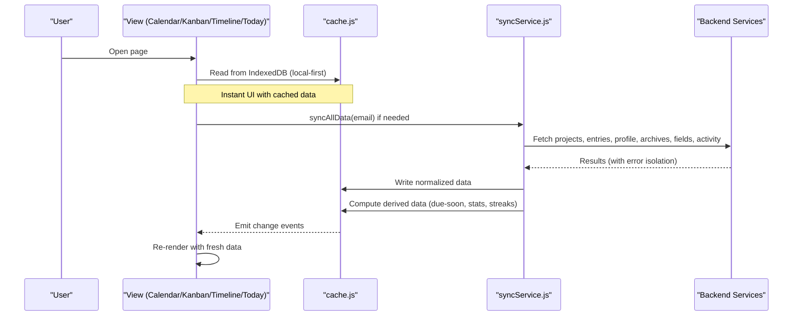

**Diagram sources**

- [syncService.js:75-101](file://frontend/src/CacheFunctions/syncService.js#L75-L101)
- [syncService.js:156-387](file://frontend/src/CacheFunctions/syncService.js#L156-L387)
- [cache.js:179-223](file://frontend/src/lib/cache.js#L179-L223)
- [cache.js:305-346](file://frontend/src/lib/cache.js#L305-L346)

**Section sources**

- [syncService.js:1-466](file://frontend/src/CacheFunctions/syncService.js#L1-L466)
- [cache.js:1-389](file://frontend/src/lib/cache.js#L1-L389)

## Detailed Component Analysis

### Calendar View

- Month and week grids built from pure date helpers; entries filtered per day.
- Drag-and-drop rescheduling updates due dates and persists via cache and sync.
- Overdue detection highlights days and entries; project colors applied via color map.
- Day click opens a modal to add or manage entries for that day.

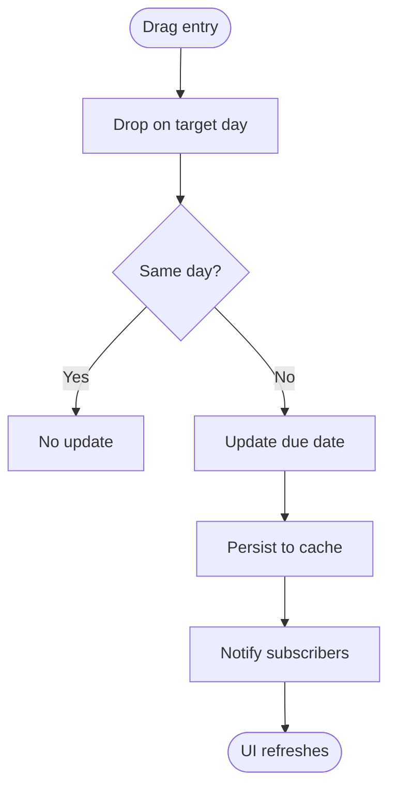

**Diagram sources**

- [Calendar.tsx:309-343](file://frontend/src/pages/Calendar.tsx#L309-L343)
- [calendar.ts:102-107](file://frontend/src/lib/calendar.ts#L102-L107)

**Section sources**

- [Calendar.tsx:1-516](file://frontend/src/pages/Calendar.tsx#L1-L516)
- [calendar.ts:1-158](file://frontend/src/lib/calendar.ts#L1-L158)

### Kanban Board

- Three columns: Up Next, In Motion, Done & Dusted.
- Drag cards between columns to update status; timestamps set automatically when moving to In Motion or Done.
- Filtering by project and free-text search; overdue and priority indicators.

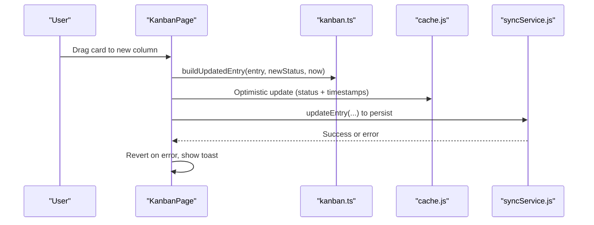

**Diagram sources**

- [Kanban.tsx:246-286](file://frontend/src/pages/Kanban.tsx#L246-L286)
- [kanban.ts:94-106](file://frontend/src/lib/kanban.ts#L94-L106)

**Section sources**

- [Kanban.tsx:1-407](file://frontend/src/pages/Kanban.tsx#L1-L407)
- [kanban.ts:1-130](file://frontend/src/lib/kanban.ts#L1-L130)

### Timeline View

- Parses entries into timeline items with start/end dates and dependencies.
- Computes row layout to avoid overlapping bars; renders SVG bars and dependency arrows.
- Zoom controls adjust day width; today marker indicates current date.

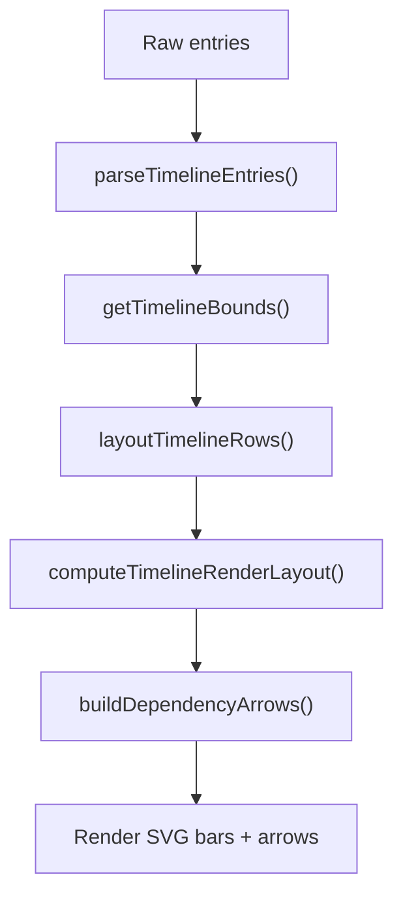

**Diagram sources**

- [timeline.ts:80-104](file://frontend/src/lib/timeline.ts#L80-L104)
- [timeline.ts:109-140](file://frontend/src/lib/timeline.ts#L109-L140)
- [timeline.ts:157-185](file://frontend/src/lib/timeline.ts#L157-L185)
- [timeline.ts:219-238](file://frontend/src/lib/timeline.ts#L219-L238)
- [timeline.ts:250-275](file://frontend/src/lib/timeline.ts#L250-L275)

**Section sources**

- [Timeline.tsx:1-398](file://frontend/src/pages/Timeline.tsx#L1-L398)
- [timeline.ts:1-276](file://frontend/src/lib/timeline.ts#L1-L276)

### Today-Focused Interface

- Groups entries into overdue, due today, and in progress sections.
- Uses timezone-aware “today” bounds to avoid UTC shifts affecting categories.
- Highlights overdue items and shows active status for in-progress work.

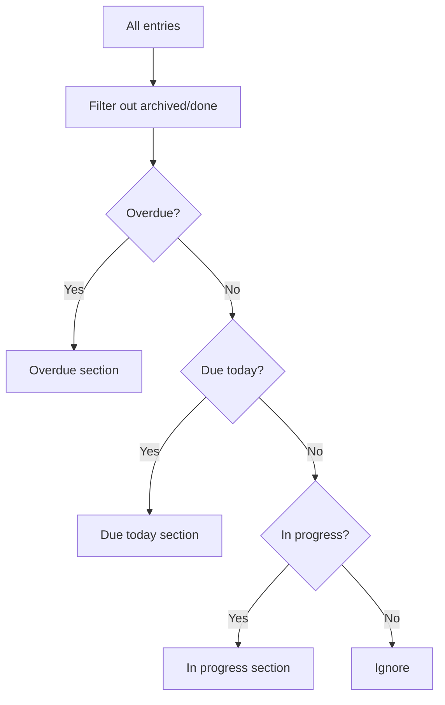

**Diagram sources**

- [today.ts:66-86](file://frontend/src/lib/today.ts#L66-L86)

**Section sources**

- [Today.tsx:1-275](file://frontend/src/pages/Today.tsx#L1-L275)
- [today.ts:1-98](file://frontend/src/lib/today.ts#L1-L98)

### AI-Powered Features

- Natural language entry creation:
  - Frontend sends text to a backend endpoint; processing is asynchronous and results arrive via server-sent events (SSE).
  - The UI treats the POST as fire-and-forget; updates appear once SSE delivers parsed data.
- General AI requests:
  - A helper function posts prompts to the AI service and returns responses or errors.
- Fallback mechanisms:
  - Network timeouts or failures return structured results indicating pending or failure states; UI can prompt manual creation while keeping quick-add functional.

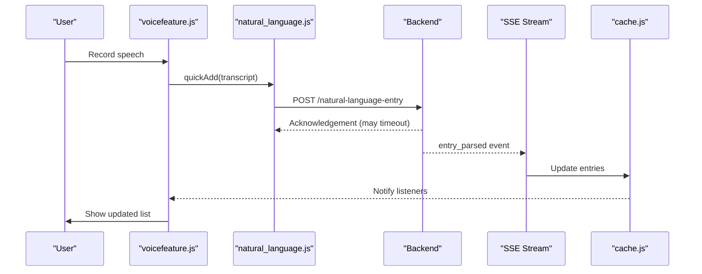

**Diagram sources**

- [voicefeature.js:89-91](file://frontend/src/functions/voicefeature.js#L89-L91)
- [natural_language.js:13-43](file://frontend/src/functions/project/natural_language.js#L13-L43)
- [ai.js:8-24](file://frontend/src/functions/ai.js#L8-L24)

**Section sources**

- [natural_language.js:1-44](file://frontend/src/functions/project/natural_language.js#L1-L44)
- [ai.js:1-25](file://frontend/src/functions/ai.js#L1-L25)
- [voicefeature.js:1-92](file://frontend/src/functions/voicefeature.js#L1-L92)

### Offline-First Functionality

- Local storage:
  - SQLite database created in memory and persisted to IndexedDB for durability.
  - Tables mirror schema: projects, entries, all_entries, profile, search, archives, fields, notes, cache_meta, offline_queue.
- Subscriptions:
  - cacheSubscribe emits updates when data changes; views listen to invalidate and re-render.
- Stale-while-revalidate:
  - Returns cached data immediately, then fetches fresh data in background and updates cache.
- Conflict resolution:
  - Sync guards against clobbering good cache with empty server responses; skips writes when server returns zero rows but cache has data.
  - Throttles full syncs to avoid redundant network calls.

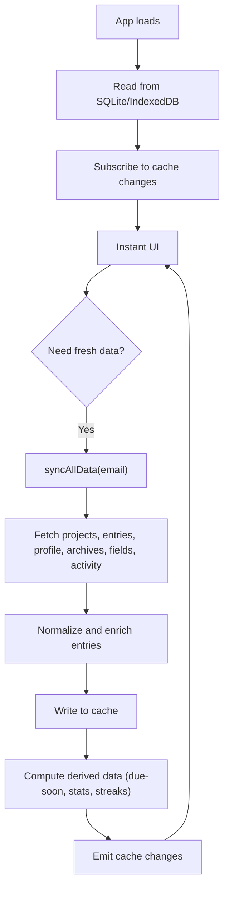

**Diagram sources**

- [cache.js:78-127](file://frontend/src/lib/cache.js#L78-L127)
- [cache.js:179-223](file://frontend/src/lib/cache.js#L179-L223)
- [cache.js:305-346](file://frontend/src/lib/cache.js#L305-L346)
- [syncService.js:75-101](file://frontend/src/CacheFunctions/syncService.js#L75-L101)
- [syncService.js:217-281](file://frontend/src/CacheFunctions/syncService.js#L217-L281)

**Section sources**

- [cache.js:1-389](file://frontend/src/lib/cache.js#L1-L389)
- [syncService.js:1-466](file://frontend/src/CacheFunctions/syncService.js#L1-L466)

### Data Portability

- Export formats:
  - JSON: structured bundle with version, timestamp, user email, projects, fields, entries.
  - CSV: blocks for projects and entries with escaped values; entries payload serialized as JSON string.
  - Markdown: human-readable tables for projects and entries.
  - iCalendar: VCALENDAR with VEVENT entries mapped from start/due/ended dates, status, and priority.
- Import formats:
  - JSON: validates version and normalizes rows; reports rejections with line numbers.
  - CSV: parses sections delimited by comment markers; validates headers and rows.
  - Markdown: parses table rows under headings; handles escaped pipes and separators.
- Validation:
  - Enforces required fields (e.g., project_name), normalizes statuses and timestamps, and rejects invalid rows with detailed reasons.

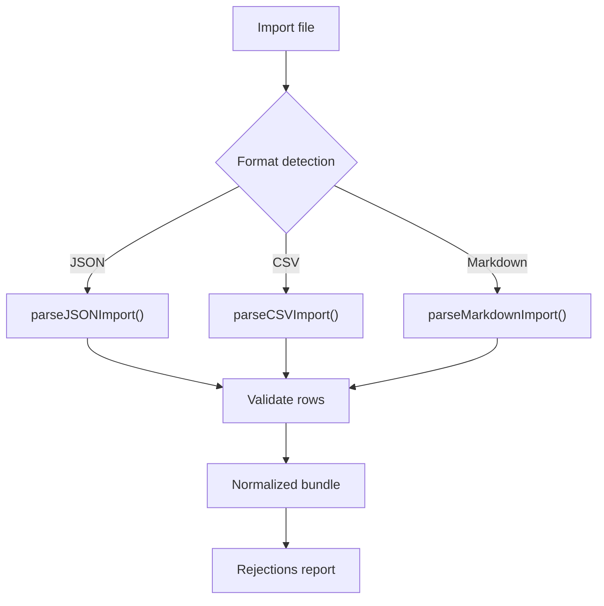

**Diagram sources**

- [export.ts:112-133](file://frontend/src/lib/export.ts#L112-L133)
- [export.ts:164-187](file://frontend/src/lib/export.ts#L164-L187)
- [export.ts:201-238](file://frontend/src/lib/export.ts#L201-L238)
- [export.ts:323-408](file://frontend/src/lib/export.ts#L323-L408)
- [import.ts:135-211](file://frontend/src/lib/import.ts#L135-L211)
- [import.ts:260-322](file://frontend/src/lib/import.ts#L260-L322)
- [import.ts:348-414](file://frontend/src/lib/import.ts#L348-L414)
- [import.ts:419-438](file://frontend/src/lib/import.ts#L419-L438)

**Section sources**

- [export.ts:1-409](file://frontend/src/lib/export.ts#L1-L409)
- [import.ts:1-438](file://frontend/src/lib/import.ts#L1-L438)

### Voice Narration and Quick Add

- Speech recognition:
  - Uses Web Speech API to transcribe live speech entirely in the browser.
  - Provides start/stop, transcript retrieval, and result callbacks for interim/final results.
- Quick add:
  - Transcribed text is sent through the natural language pipeline to create entries asynchronously.
- Guidance:
  - While not implemented here, the same transcription flow can be used to power guided tours or voice-guided instructions by mapping transcripts to actions.

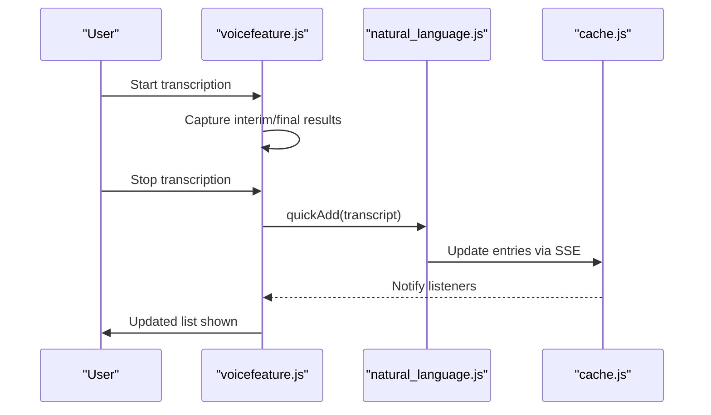

**Diagram sources**

- [voicefeature.js:9-64](file://frontend/src/functions/voicefeature.js#L9-L64)
- [voicefeature.js:89-91](file://frontend/src/functions/voicefeature.js#L89-L91)
- [natural_language.js:13-43](file://frontend/src/functions/project/natural_language.js#L13-L43)

**Section sources**

- [voicefeature.js:1-92](file://frontend/src/functions/voicefeature.js#L1-L92)
- [natural_language.js:1-44](file://frontend/src/functions/project/natural_language.js#L1-L44)

### Notification System

- Bell component polls for notifications every minute and on window focus.
- Displays unread count badge; opening an item marks it read and navigates to the related project.
- Supports marking all as read and viewing all notifications.

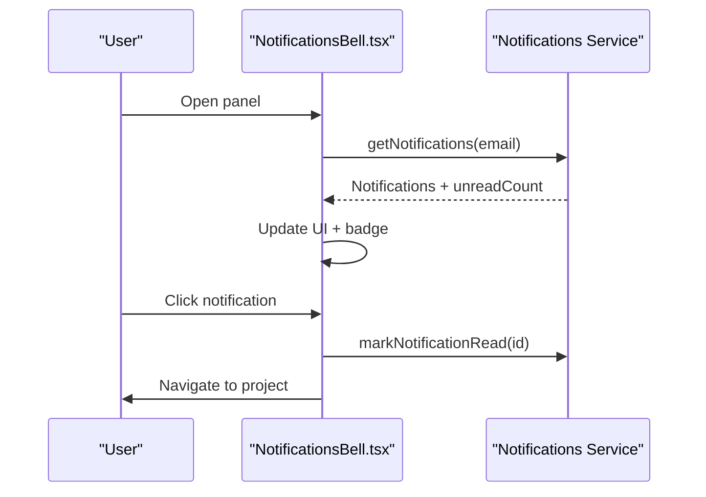

**Diagram sources**

- [NotificationsBell.tsx:61-86](file://frontend/src/components/NotificationsBell.tsx#L61-L86)
- [NotificationsBell.tsx:100-116](file://frontend/src/components/NotificationsBell.tsx#L100-L116)

**Section sources**

- [NotificationsBell.tsx:1-211](file://frontend/src/components/NotificationsBell.tsx#L1-L211)

### Analytics Dashboards and Preferences

- Analytics:
  - Stats and streaks are computed from cached entries and stored in the search store for quick access.
  - Due-soon entries are computed locally based on due dates within a defined window.
- Preferences:
  - Calendar view preference (month/week) is persisted in localStorage and respected across sessions.
  - Mobile viewport forces week view for better usability.

**Section sources**

- [syncService.js:348-383](file://frontend/src/CacheFunctions/syncService.js#L348-L383)
- [Calendar.tsx:203-215](file://frontend/src/pages/Calendar.tsx#L203-L215)

## Dependency Analysis

- Views depend on libraries for domain logic (calendar, kanban, timeline, today).
- Views rely on cache for data and subscribe to changes; they never call APIs directly.
- Sync service depends on various project functions to fetch data and compute derived metrics.
- AI and voice features integrate with natural language processing and SSE to update cache.
- Export/import utilities operate on normalized bundles and validate inputs.

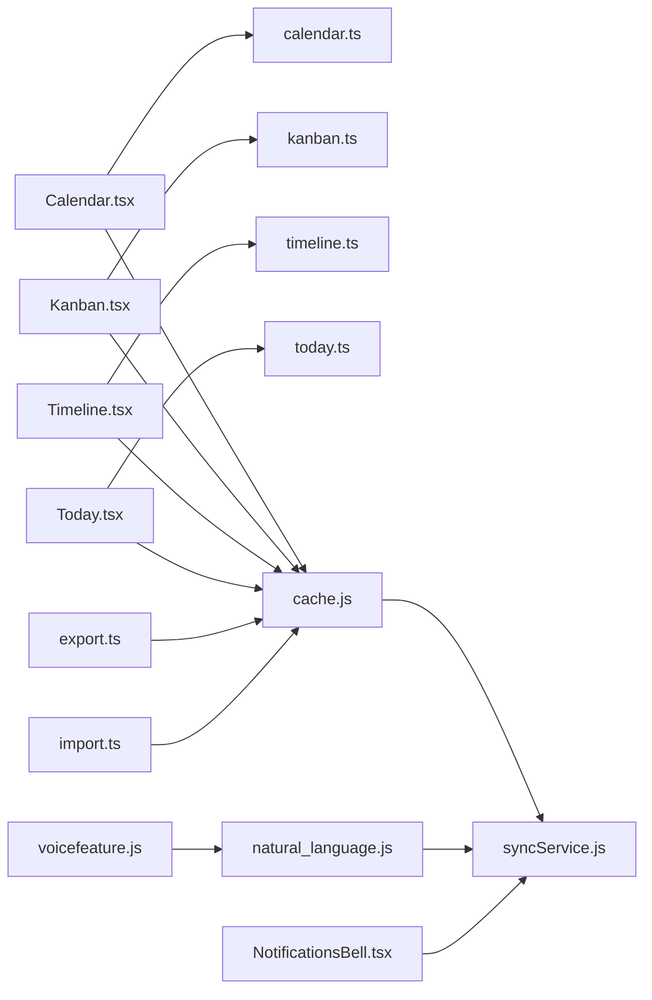

**Diagram sources**

- [Calendar.tsx:1-516](file://frontend/src/pages/Calendar.tsx#L1-L516)
- [Kanban.tsx:1-407](file://frontend/src/pages/Kanban.tsx#L1-L407)
- [Timeline.tsx:1-398](file://frontend/src/pages/Timeline.tsx#L1-L398)
- [Today.tsx:1-275](file://frontend/src/pages/Today.tsx#L1-L275)
- [calendar.ts:1-158](file://frontend/src/lib/calendar.ts#L1-L158)
- [kanban.ts:1-130](file://frontend/src/lib/kanban.ts#L1-L130)
- [timeline.ts:1-276](file://frontend/src/lib/timeline.ts#L1-L276)
- [today.ts:1-98](file://frontend/src/lib/today.ts#L1-L98)
- [cache.js:1-389](file://frontend/src/lib/cache.js#L1-L389)
- [syncService.js:1-466](file://frontend/src/CacheFunctions/syncService.js#L1-L466)
- [voicefeature.js:1-92](file://frontend/src/functions/voicefeature.js#L1-L92)
- [natural_language.js:1-44](file://frontend/src/functions/project/natural_language.js#L1-L44)
- [export.ts:1-409](file://frontend/src/lib/export.ts#L1-L409)
- [import.ts:1-438](file://frontend/src/lib/import.ts#L1-L438)
- [NotificationsBell.tsx:1-211](file://frontend/src/components/NotificationsBell.tsx#L1-L211)

**Section sources**

- [syncService.js:1-466](file://frontend/src/CacheFunctions/syncService.js#L1-L466)
- [cache.js:1-389](file://frontend/src/lib/cache.js#L1-L389)

## Performance Considerations

- Local-first reads ensure instant UI; background sync avoids blocking interactions.
- Throttled full syncs reduce unnecessary network load.
- Derived computations (stats, streaks, due-soon) run locally to minimize server round-trips.
- Stale-while-revalidate pattern balances freshness with responsiveness.
- Efficient filtering and grouping in libraries prevent heavy DOM operations.

[No sources needed since this section provides general guidance]

## Troubleshooting Guide

- AI quick-add timeouts:
  - If the POST times out, the response may indicate pending; SSE will deliver results when ready.
  - On failure, users can manually create entries while the quick-add recovers.
- Cache inconsistencies:
  - Sync guards prevent overwriting good cache with empty server responses.
  - Use clear user cache on logout or refresh scenarios to reset stale data.
- Notifications:
  - Ensure online status before polling; component skips refresh when offline.
  - Marking all read updates local state and attempts server update.

**Section sources**

- [natural_language.js:13-43](file://frontend/src/functions/project/natural_language.js#L13-L43)
- [syncService.js:217-281](file://frontend/src/CacheFunctions/syncService.js#L217-L281)
- [cache.js:265-290](file://frontend/src/lib/cache.js#L265-L290)
- [NotificationsBell.tsx:61-86](file://frontend/src/components/NotificationsBell.tsx#L61-L86)

## Conclusion

Codacaine delivers a robust, multi-view task management experience backed by an offline-first architecture. Users benefit from intuitive interfaces (Calendar, Kanban, Timeline, Today), AI-assisted workflows, voice-enabled quick add, comprehensive data portability, timely notifications, and analytics derived from local data. The design emphasizes responsiveness, resilience, and user control over data and preferences.

[No sources needed since this section summarizes without analyzing specific files]

## Appendices

- Supported export/import formats:
  - JSON, CSV, Markdown, iCalendar (export); JSON, CSV, Markdown (import).
- Key libraries:
  - Date and grid utilities (calendar.ts).
  - Status grouping and sorting (kanban.ts).
  - Timeline layout and dependency arrows (timeline.ts).
  - Today categorization (today.ts).
- Data persistence:
  - SQLite via sql.js persisted to IndexedDB with event-driven subscriptions.
- Sync orchestration:
  - Centralized sync service with error isolation and derived data computation.

[No sources needed since this section aggregates previously analyzed content]
