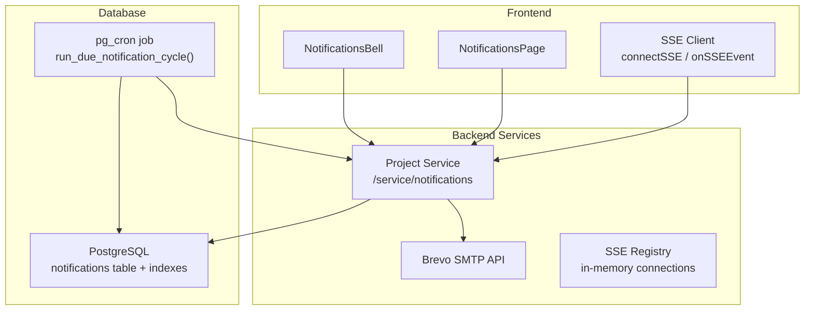
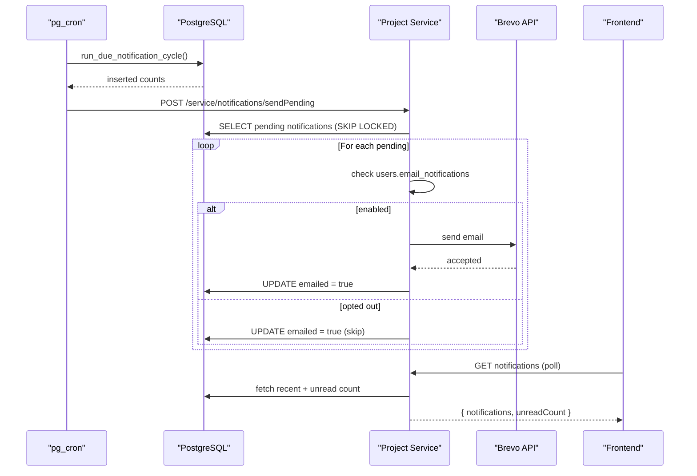
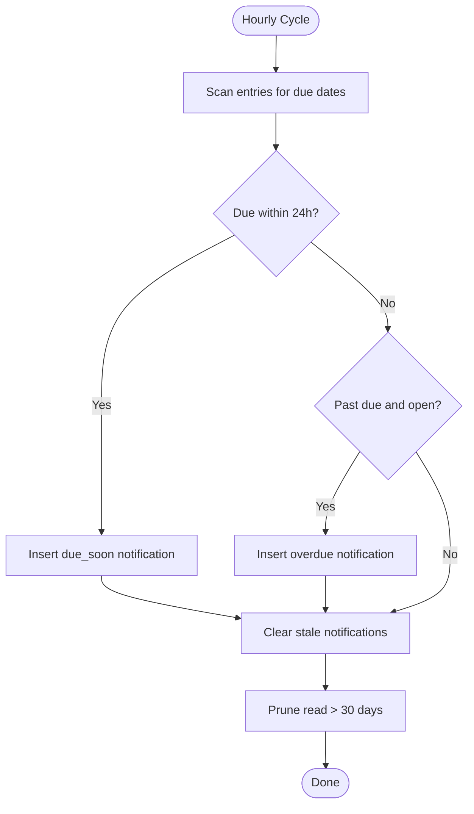
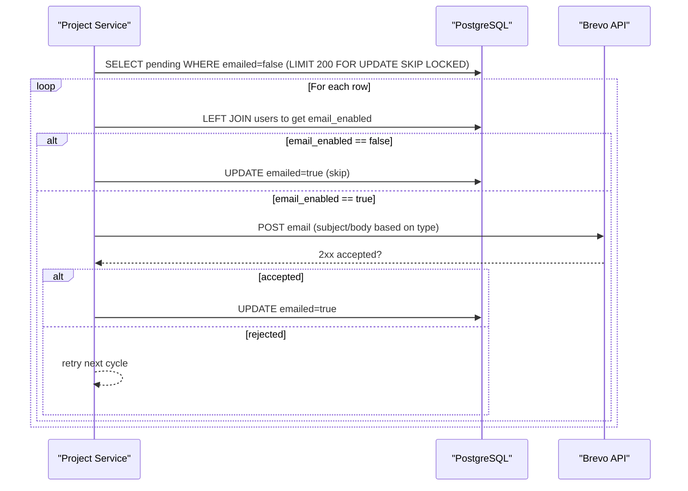
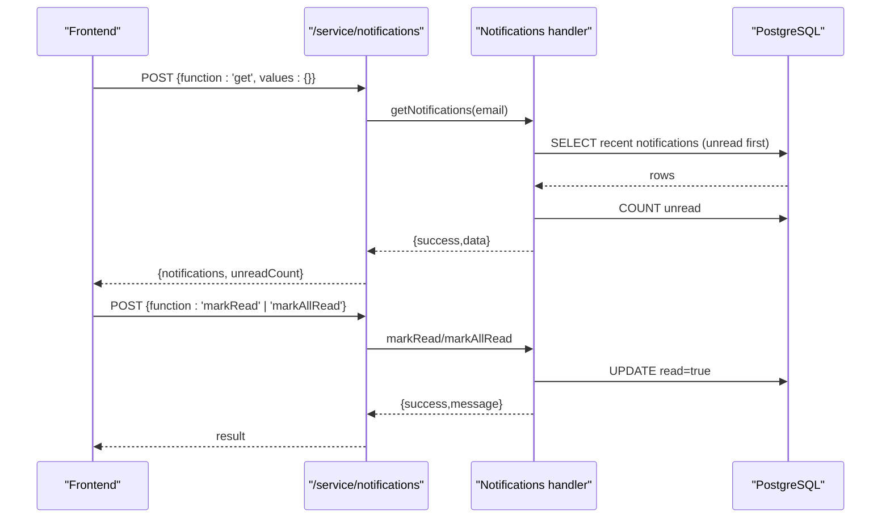
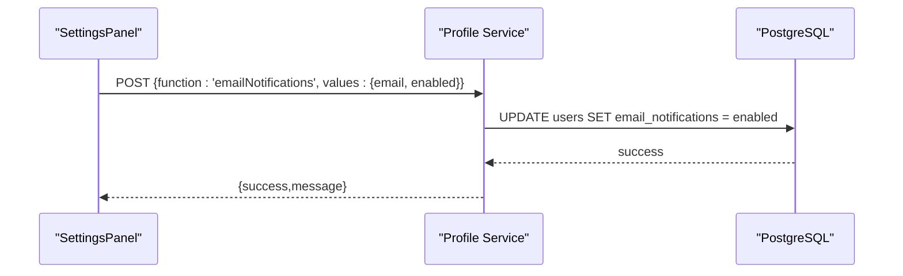
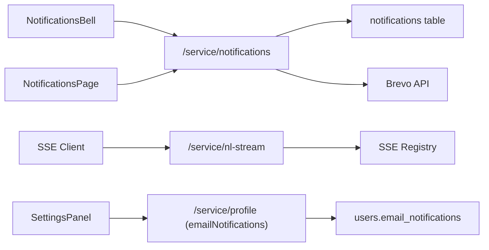

# Notifications & Alerts

<cite>
**Referenced Files in This Document**
- [011_create_notifications.sql](file://supabase/migrations/011_create_notifications.sql)
- [notifications.js (routes)](file://services/project-service/src/Routes/notifications.js)
- [notifications.js (handler)](file://services/project-service/src/functions/notifications/notifications.js)
- [profile.js (routes)](file://services/profile-service/src/Routes/profile.js)
- [profile.js (functions)](file://services/profile-service/src/functions/profile.js)
- [NotificationsBell.tsx](file://frontend/src/components/NotificationsBell.tsx)
- [NotificationsPage.tsx](file://frontend/src/pages/NotificationsPage.tsx)
- [notifications.js (frontend API)](file://frontend/src/functions/project/notifications.js)
- [sse.js](file://frontend/src/lib/sse.js)
- [sseRegistry.js](file://services/project-service/src/functions/sseRegistry.js)
- [features.md](file://docs-site/docs/features.md)
</cite>

## Table of Contents

1. Introduction
2. Project Structure
3. Core Components
4. Architecture Overview
5. Detailed Component Analysis
6. Dependency Analysis
7. Performance Considerations
8. Troubleshooting Guide
9. Conclusion

## Introduction

This document explains Codacaine’s notification system end-to-end: how due-date reminders are generated, delivered as in-app alerts and emails, persisted for history, and governed by user preferences. It also covers real-time updates via Server-Sent Events (SSE), archival policies, email template behavior, delivery reliability, and troubleshooting steps.

## Project Structure

The notification system spans database migrations, backend services, and the frontend UI:

- Database layer defines the notifications table, preference column, generator functions, and cron scheduling.
- Backend exposes RPC-style endpoints to read/write notifications and send pending emails.
- Frontend provides a bell icon with unread badge, a full history page, and an SSE-based real-time channel used elsewhere in the app.



**Diagram sources**

- [011_create_notifications.sql:16-162](file://supabase/migrations/011_create_notifications.sql#L16-L162)
- [notifications.js (routes):20-95](file://services/project-service/src/Routes/notifications.js#L20-L95)
- [notifications.js (handler):47-315](file://services/project-service/src/functions/notifications/notifications.js#L47-L315)
- [sseRegistry.js:17-74](file://services/project-service/src/functions/sseRegistry.js#L17-L74)
- [NotificationsBell.tsx:53-206](file://frontend/src/components/NotificationsBell.tsx#L53-L206)
- [NotificationsPage.tsx:56-196](file://frontend/src/pages/NotificationsPage.tsx#L56-L196)
- [sse.js:37-184](file://frontend/src/lib/sse.js#L37-L184)

**Section sources**

- [011_create_notifications.sql:1-162](file://supabase/migrations/011_create_notifications.sql#L1-L162)
- [notifications.js (routes):1-98](file://services/project-service/src/Routes/notifications.js#L1-L98)
- [notifications.js (handler):1-319](file://services/project-service/src/functions/notifications/notifications.js#L1-L319)
- [NotificationsBell.tsx:1-211](file://frontend/src/components/NotificationsBell.tsx#L1-L211)
- [NotificationsPage.tsx:1-199](file://frontend/src/pages/NotificationsPage.tsx#L1-L199)
- [sse.js:1-185](file://frontend/src/lib/sse.js#L1-L185)
- [sseRegistry.js:1-104](file://services/project-service/src/functions/sseRegistry.js#L1-L104)

## Core Components

- Notification generation and storage: PostgreSQL function creates due_soon and overdue rows per entry; unique constraint prevents duplicates.
- Email delivery: Project service sends pending emails via Brevo HTTP API when enabled by user preference; marks emailed=true only after acceptance.
- In-app feed and history: Endpoints return recent notifications and paginated history; mark-read operations update read flags.
- Preferences: Users can toggle email notifications; stored in users.email_notifications and enforced server-side.
- Real-time updates: SSE client connects to backend stream; registry tracks active connections per user.

**Section sources**

- [011_create_notifications.sql:16-114](file://supabase/migrations/011_create_notifications.sql#L16-L114)
- [notifications.js (handler):47-315](file://services/project-service/src/functions/notifications/notifications.js#L47-L315)
- [profile.js (functions):108-126](file://services/profile-service/src/functions/profile.js#L108-L126)
- [NotificationsBell.tsx:53-206](file://frontend/src/components/NotificationsBell.tsx#L53-L206)
- [NotificationsPage.tsx:56-196](file://frontend/src/pages/NotificationsPage.tsx#L56-L196)
- [sse.js:37-184](file://frontend/src/lib/sse.js#L37-L184)
- [sseRegistry.js:17-74](file://services/project-service/src/functions/sseRegistry.js#L17-L74)

## Architecture Overview

The system uses a hybrid approach:

- Scheduled generation: An hourly pg_cron job scans entries and inserts due_soon or overdue notifications.
- Delivery triggers: A background poke calls project-service to flush pending emails; app traffic also opportunistically flushes during getNotifications.
- User interaction: The bell polls for recent notifications; the history page loads paginated records; mark-read actions update state.
- Real-time channel: SSE is available for other features; the same infrastructure pattern applies.



**Diagram sources**

- [011_create_notifications.sql:126-162](file://supabase/migrations/011_create_notifications.sql#L126-L162)
- [notifications.js (routes):81-95](file://services/project-service/src/Routes/notifications.js#L81-L95)
- [notifications.js (handler):203-315](file://services/project-service/src/functions/notifications/notifications.js#L203-L315)
- [NotificationsBell.tsx:61-86](file://frontend/src/components/NotificationsBell.tsx#L61-L86)

## Detailed Component Analysis

### Notification Generation and Storage

- Table schema enforces one row per (user_email, entry_id, type) to avoid duplicate reminders.
- Generator function clears stale notifications for completed/archived/deleted entries and prunes read rows older than 30 days.
- Two types are supported: due_soon (within 24 hours) and overdue (past deadline).



**Diagram sources**

- [011_create_notifications.sql:46-114](file://supabase/migrations/011_create_notifications.sql#L46-L114)

**Section sources**

- [011_create_notifications.sql:16-114](file://supabase/migrations/011_create_notifications.sql#L16-L114)

### Email Delivery Pipeline

- Pending emails are fetched with SKIP LOCKED to allow concurrent safe sending.
- Preference check reads users.email_notifications; opted-out users are skipped but marked emailed=true to prevent backfilling later.
- Emails are sent via Brevo HTTP API; only after acceptance is emailed set to true.



**Diagram sources**

- [notifications.js (handler):203-315](file://services/project-service/src/functions/notifications/notifications.js#L203-L315)

**Section sources**

- [notifications.js (handler):203-315](file://services/project-service/src/functions/notifications/notifications.js#L203-L315)
- [profile.js (functions):108-126](file://services/profile-service/src/functions/profile.js#L108-L126)

### In-App Notifications Feed and History

- Recent feed: returns up to a fixed limit, ordered unread-first, plus unread count for the bell badge.
- History page: paginated list of all notifications (read/unread), newest first, with “Load more”.
- Mark-read: single or all at once; scoped by user email.



**Diagram sources**

- [notifications.js (routes):20-66](file://services/project-service/src/Routes/notifications.js#L20-L66)
- [notifications.js (handler):47-187](file://services/project-service/src/functions/notifications/notifications.js#L47-L187)

**Section sources**

- [notifications.js (routes):20-66](file://services/project-service/src/Routes/notifications.js#L20-L66)
- [notifications.js (handler):47-187](file://services/project-service/src/functions/notifications/notifications.js#L47-L187)
- [NotificationsBell.tsx:61-116](file://frontend/src/components/NotificationsBell.tsx#L61-L116)
- [NotificationsPage.tsx:67-112](file://frontend/src/pages/NotificationsPage.tsx#L67-L112)
- [notifications.js (frontend API):41-73](file://frontend/src/functions/project/notifications.js#L41-L73)

### User Preferences for Notifications

- Toggle “Email notifications” in SettingsPanel persists to users.email_notifications via profile service.
- Project service honors this preference before sending emails; opted-out users never receive emails even if pending rows exist.



**Diagram sources**

- [profile.js (routes):78-86](file://services/profile-service/src/Routes/profile.js#L78-L86)
- [profile.js (functions):108-126](file://services/profile-service/src/functions/profile.js#L108-L126)

**Section sources**

- [profile.js (routes):78-86](file://services/profile-service/src/Routes/profile.js#L78-L86)
- [profile.js (functions):108-126](file://services/profile-service/src/functions/profile.js#L108-L126)
- [NotificationsBell.tsx:789-813](file://frontend/src/components/SettingsPanel.tsx#L789-L813)

### Real-Time Updates via Server-Sent Events

- Frontend maintains a persistent EventSource connection with auto-reconnect and exponential backoff.
- Listeners subscribe to named events; disconnect cleans up timers and connections.
- Backend registry tracks per-user SSE responses to push events when needed.

```mermaid
sequenceDiagram
participant FE as "Frontend SSE"
participant PS as "Project Service"
participant REG as "SSE Registry"
FE->>PS : GET /service/nl-stream?token=...
PS->>REG : registerConnection(email, res)
Note over FE,PS : Stream open; keep-alive comments prevent timeouts
PS-->>FE : event : connected / entry_parsed / entry_error
FE->>FE : onSSEEvent listeners invoked
FE->>PS : disconnectSSE()
PS->>REG : removeConnection(email, res)
```

**Diagram sources**

- [sse.js:37-134](file://frontend/src/lib/sse.js#L37-L134)
- [sseRegistry.js:17-74](file://services/project-service/src/functions/sseRegistry.js#L17-L74)

**Section sources**

- [sse.js:37-184](file://frontend/src/lib/sse.js#L37-L184)
- [sseRegistry.js:17-104](file://services/project-service/src/functions/sseRegistry.js#L17-L104)

### Archival Policies

- Read notifications older than 30 days are pruned automatically by the generator function.
- Completed, archived, or deleted entries have their notifications cleared.
- This keeps the history bounded while preserving meaningful recency.

**Section sources**

- [011_create_notifications.sql:54-114](file://supabase/migrations/011_create_notifications.sql#L54-L114)

## Dependency Analysis

- Database dependencies: notifications table, users.email_notifications, indexes for unread and pending-email queries.
- Service dependencies: project-service depends on PostgreSQL and Brevo; profile-service manages user preferences.
- Frontend dependencies: bell/history pages depend on project-service endpoints; SSE client depends on backend streaming endpoint.



**Diagram sources**

- [notifications.js (routes):20-95](file://services/project-service/src/Routes/notifications.js#L20-L95)
- [notifications.js (handler):47-315](file://services/project-service/src/functions/notifications/notifications.js#L47-L315)
- [profile.js (routes):78-86](file://services/profile-service/src/Routes/profile.js#L78-L86)
- [sse.js:37-134](file://frontend/src/lib/sse.js#L37-L134)
- [sseRegistry.js:17-74](file://services/project-service/src/functions/sseRegistry.js#L17-L74)

**Section sources**

- [notifications.js (routes):20-95](file://services/project-service/src/Routes/notifications.js#L20-L95)
- [notifications.js (handler):47-315](file://services/project-service/src/functions/notifications/notifications.js#L47-L315)
- [profile.js (routes):78-86](file://services/profile-service/src/Routes/profile.js#L78-L86)
- [sse.js:37-134](file://frontend/src/lib/sse.js#L37-L134)
- [sseRegistry.js:17-74](file://services/project-service/src/functions/sseRegistry.js#L17-L74)

## Performance Considerations

- Pagination and limits: Recent feed limited to a fixed number; history supports configurable page size with clamping to prevent large payloads.
- Indexes: Unread index and pending-email index optimize frequent queries.
- Concurrency: SKIP LOCKED ensures safe concurrent email sending without duplicates.
- Polling cadence: Bell refreshes every 60 seconds and on focus to balance freshness and load.
- SSE reconnection: Exponential backoff reduces network pressure on failures.

[No sources needed since this section provides general guidance]

## Troubleshooting Guide

- No notifications appear:
  - Verify pg_cron is running and the generator function executes.
  - Confirm entries have due dates and are not completed/archived/deleted.
- Bell shows no badge:
  - Ensure getNotifications endpoint returns data and unread count.
  - Check polling interval and browser focus events.
- Emails not received:
  - Validate environment variables for Brevo are configured.
  - Check that users.email_notifications is enabled for the recipient.
  - Inspect logs for Brevo rejection or network errors; retries occur on next cycle.
- SSE not connecting:
  - Confirm token is present and backend accepts it.
  - Check for max reconnect attempts reached; review error logs.
  - Ensure registry has registered connections and writes succeed.

**Section sources**

- [011_create_notifications.sql:126-162](file://supabase/migrations/011_create_notifications.sql#L126-L162)
- [notifications.js (handler):203-315](file://services/project-service/src/functions/notifications/notifications.js#L203-L315)
- [sse.js:106-134](file://frontend/src/lib/sse.js#L106-L134)
- [sseRegistry.js:47-74](file://services/project-service/src/functions/sseRegistry.js#L47-L74)

## Conclusion

Codacaine’s notification system combines scheduled generation, robust email delivery, and a responsive in-app experience. Users control email delivery through preferences, while the bell and history pages provide immediate visibility. SSE enables real-time updates across the application. With clear archival policies and reliable retry mechanisms, the system balances timeliness, performance, and user control.

[No sources needed since this section summarizes without analyzing specific files]
