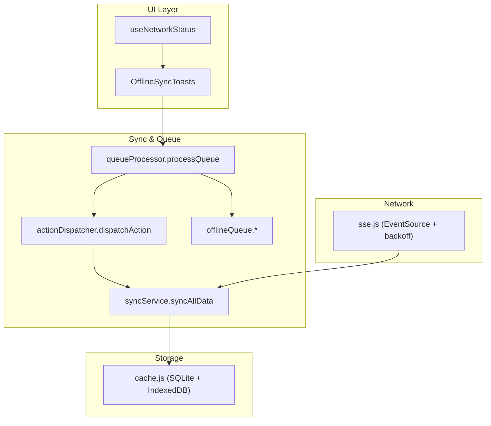
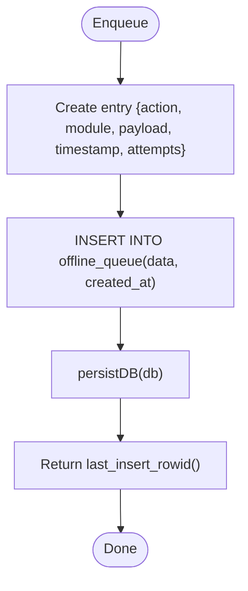
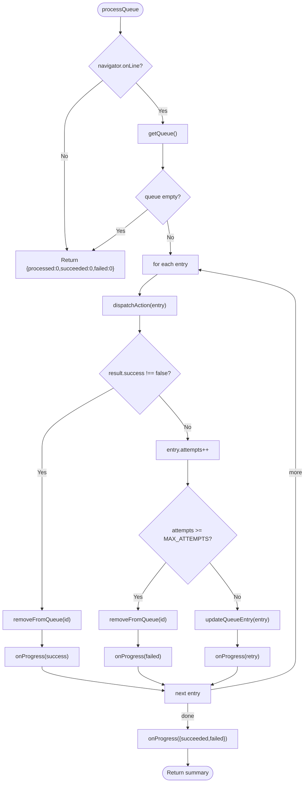
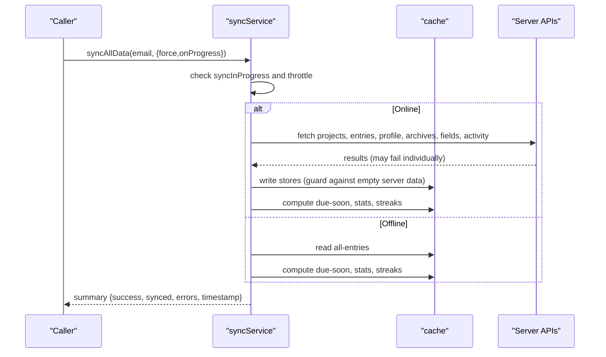
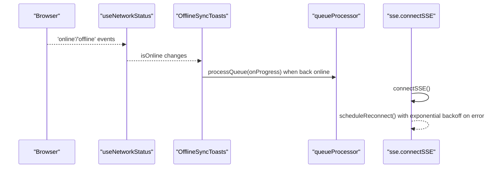
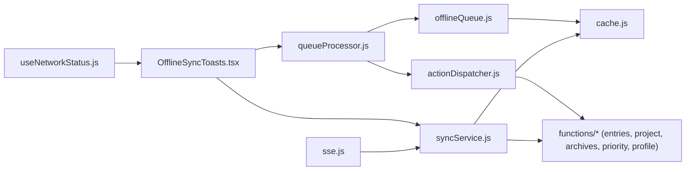

# Background Synchronization Service

<cite>
**Referenced Files in This Document**
- [offlineQueue.js](file://frontend/src/CacheFunctions/offlineQueue.js)
- [queueProcessor.js](file://frontend/src/CacheFunctions/queueProcessor.js)
- [actionDispatcher.js](file://frontend/src/CacheFunctions/actionDispatcher.js)
- [syncService.js](file://frontend/src/CacheFunctions/syncService.js)
- [index.js](file://frontend/src/CacheFunctions/index.js)
- [cache.js](file://frontend/src/lib/cache.js)
- [useNetworkStatus.js](file://frontend/src/hooks/useNetworkStatus.js)
- [OfflineSyncToasts.tsx](file://frontend/src/components/OfflineSyncToasts.tsx)
- [sse.js](file://frontend/src/lib/sse.js)
</cite>

## Table of Contents

1. [Introduction](#introduction)
2. [Project Structure](#project-structure)
3. [Core Components](#core-components)
4. [Architecture Overview](#architecture-overview)
5. [Detailed Component Analysis](#detailed-component-analysis)
6. [Dependency Analysis](#dependency-analysis)
7. [Performance Considerations](#performance-considerations)
8. [Troubleshooting Guide](#troubleshooting-guide)
9. [Conclusion](#conclusion)
10. [Appendices](#appendices)

## Introduction

This document explains the background synchronization service that enables offline-first data operations and conflict-aware reconciliation. It covers:

- The offline queue mechanism for persisting pending operations when connectivity is lost
- Queue processing with retry policies, progress callbacks, and error handling
- Conflict resolution strategies used during sync and cache updates
- Network reconnection handling, exponential backoff, and sync progress tracking
- Examples of queue operations, manual triggers, and monitoring

The system follows a local-first architecture: UI writes to a local SQLite-backed cache immediately (optimistic), then synchronizes to the server. When offline or on failure, operations are queued and retried later.

## Project Structure

The synchronization subsystem lives under frontend/src/CacheFunctions and integrates with a shared caching layer and network hooks:

- Offline queue persistence and management
- Queue processor with retries and progress reporting
- Action dispatcher mapping queued actions to concrete functions
- Sync service orchestrating full/partial data refreshes and derived computations
- Cache layer providing SQLite storage, persistence, and subscriptions
- Network status hook and toast UI for user feedback
- SSE client for real-time updates with exponential backoff



**Diagram sources**

- [OfflineSyncToasts.tsx:28-109](file://frontend/src/components/OfflineSyncToasts.tsx#L28-L109)
- [useNetworkStatus.js:14-39](file://frontend/src/hooks/useNetworkStatus.js#L14-L39)
- [queueProcessor.js:21-90](file://frontend/src/CacheFunctions/queueProcessor.js#L21-L90)
- [actionDispatcher.js:18-118](file://frontend/src/CacheFunctions/actionDispatcher.js#L18-L118)
- [offlineQueue.js:21-144](file://frontend/src/CacheFunctions/offlineQueue.js#L21-L144)
- [syncService.js:75-386](file://frontend/src/CacheFunctions/syncService.js#L75-L386)
- [cache.js:125-223](file://frontend/src/lib/cache.js#L125-L223)
- [sse.js:37-119](file://frontend/src/lib/sse.js#L37-L119)

**Section sources**

- [index.js:13-30](file://frontend/src/CacheFunctions/index.js#L13-L30)

## Core Components

- Offline queue: persistent FIFO queue stored in SQLite for operations performed while offline or when server sync fails
- Queue processor: executes queued actions in order, with retry logic and progress callbacks
- Action dispatcher: maps action names to their implementations across modules (entries, projects, archives, priority, profile)
- Sync service: central data synchronization that warms caches, computes derived data, and handles offline behavior
- Cache layer: SQLite-backed store with IndexedDB persistence, change subscriptions, and stale-while-revalidate utilities
- Network integration: online/offline detection and SSE-based real-time updates with exponential backoff

**Section sources**

- [offlineQueue.js:21-144](file://frontend/src/CacheFunctions/offlineQueue.js#L21-L144)
- [queueProcessor.js:21-156](file://frontend/src/CacheFunctions/queueProcessor.js#L21-L156)
- [actionDispatcher.js:18-127](file://frontend/src/CacheFunctions/actionDispatcher.js#L18-L127)
- [syncService.js:75-466](file://frontend/src/CacheFunctions/syncService.js#L75-L466)
- [cache.js:125-389](file://frontend/src/lib/cache.js#L125-L389)
- [useNetworkStatus.js:14-39](file://frontend/src/hooks/useNetworkStatus.js#L14-L39)
- [sse.js:37-119](file://frontend/src/lib/sse.js#L37-L119)

## Architecture Overview

The system ensures resilient, offline-capable synchronization through layered responsibilities:

- Optimistic writes update the local cache instantly
- Failed or offline mutations are enqueued for later execution
- On reconnect, the queue processor runs actions with retries and reports progress
- Full/partial syncs refresh cached data and compute derived views
- Real-time updates via SSE keep the UI current without polling

```mermaid
sequenceDiagram
participant UI as "UI"
participant Hook as "useNetworkStatus"
participant Toast as "OfflineSyncToasts"
participant Proc as "queueProcessor"
participant Q as "offlineQueue"
participant Disp as "actionDispatcher"
participant Svc as "syncService"
participant Cache as "cache"
participant SSE as "sse"
UI->>Svc : syncAllData(email, options)
Note over Svc : Throttle concurrent syncs; skip if recently synced
Svc-->>Cache : read/write stores
Svc-->>SSE : optional real-time events
UI->>Hook : track online/offline
Hook-->>Toast : online/offline changes
Toast->>Proc : processQueue(onProgress)
Proc->>Q : getQueue()
loop For each queued action
Proc->>Disp : dispatchAction(entry)
Disp-->>Proc : result {success, message}
alt success
Proc->>Q : removeFromQueue(id)
Proc-->>Toast : progress.success
else failure
Proc->>Q : updateQueueEntry(attempts++)
Proc-->>Toast : progress.retry
alt attempts >= MAX_ATTEMPTS
Proc->>Q : removeFromQueue(id)
Proc-->>Toast : progress.failed
end
end
end
Proc-->>Toast : progress.complete
Toast->>Svc : syncAllData(force=true) after successful sync
```

**Diagram sources**

- [syncService.js:75-101](file://frontend/src/CacheFunctions/syncService.js#L75-L101)
- [queueProcessor.js:21-90](file://frontend/src/CacheFunctions/queueProcessor.js#L21-L90)
- [offlineQueue.js:21-144](file://frontend/src/CacheFunctions/offlineQueue.js#L21-L144)
- [actionDispatcher.js:18-118](file://frontend/src/CacheFunctions/actionDispatcher.js#L18-L118)
- [OfflineSyncToasts.tsx:55-109](file://frontend/src/components/OfflineSyncToasts.tsx#L55-L109)
- [sse.js:37-119](file://frontend/src/lib/sse.js#L37-L119)

## Detailed Component Analysis

### Offline Queue Mechanism

Responsibilities:

- Persist operations when offline or server sync fails
- Provide FIFO ordering by creation timestamp
- Track attempt counts per operation
- Support querying, updating, and clearing the queue

Key behaviors:

- Enqueue: creates a JSON record with action, module, payload, timestamp, and attempts counter
- Query: returns all pending entries ordered by created_at
- Update: increments attempts and persists changes
- Remove: deletes successfully processed entries
- Clear: removes all entries (testing utility)



**Diagram sources**

- [offlineQueue.js:21-44](file://frontend/src/CacheFunctions/offlineQueue.js#L21-L44)

**Section sources**

- [offlineQueue.js:21-144](file://frontend/src/CacheFunctions/offlineQueue.js#L21-L144)
- [cache.js:125-171](file://frontend/src/lib/cache.js#L125-L171)

### Queue Processor

Responsibilities:

- Execute queued actions in FIFO order
- Retry failed actions up to a maximum number of attempts
- Report progress via callbacks (start, success, retry, failed, complete)
- Clean up completed or exhausted entries

Retry policy:

- Fixed maximum attempts (MAX_ATTEMPTS = 3)
- Increment attempts on failure; remove from queue after max attempts reached
- No explicit delay between retries within a single batch run



**Diagram sources**

- [queueProcessor.js:21-90](file://frontend/src/CacheFunctions/queueProcessor.js#L21-L90)

**Section sources**

- [queueProcessor.js:21-156](file://frontend/src/CacheFunctions/queueProcessor.js#L21-L156)

### Action Dispatcher

Responsibilities:

- Map action strings to concrete handler functions
- Forward payloads to appropriate modules (entries, projects, archives, priority, profile)
- Throw errors for unknown actions

Supported actions include add/update/delete for entries and projects, archive/unarchive operations, priority updates, and profile updates.

**Section sources**

- [actionDispatcher.js:18-127](file://frontend/src/CacheFunctions/actionDispatcher.js#L18-L127)

### Sync Service

Responsibilities:

- Centralized data synchronization from server to local cache
- Prevent duplicate concurrent syncs and throttle frequent syncs
- Compute derived data (due-soon, stats, streaks) locally
- Handle offline mode gracefully by computing from cache
- Safely handle empty server responses to avoid clobbering good cache

Key features:

- Concurrency guard: prevents overlapping syncAllData calls
- Throttle: skips recent syncs unless forced
- Offline path: computes derived data from existing cache
- Sequential fetches with individual error handling and batching where appropriate
- Post-sync computation of derived views



**Diagram sources**

- [syncService.js:75-386](file://frontend/src/CacheFunctions/syncService.js#L75-L386)

**Section sources**

- [syncService.js:75-466](file://frontend/src/CacheFunctions/syncService.js#L75-L466)
- [cache.js:179-223](file://frontend/src/lib/cache.js#L179-L223)

### Network Reconnection and Exponential Backoff

- useNetworkStatus provides reactive online/offline state to components
- OfflineSyncToasts triggers queue processing on offline→online transitions and shows progress toasts
- SSE client implements exponential backoff for reconnection attempts with a base delay and capped attempts



**Diagram sources**

- [useNetworkStatus.js:14-39](file://frontend/src/hooks/useNetworkStatus.js#L14-L39)
- [OfflineSyncToasts.tsx:55-109](file://frontend/src/components/OfflineSyncToasts.tsx#L55-L109)
- [queueProcessor.js:21-90](file://frontend/src/CacheFunctions/queueProcessor.js#L21-L90)
- [sse.js:37-119](file://frontend/src/lib/sse.js#L37-L119)

**Section sources**

- [useNetworkStatus.js:14-39](file://frontend/src/hooks/useNetworkStatus.js#L14-L39)
- [OfflineSyncToasts.tsx:28-109](file://frontend/src/components/OfflineSyncToasts.tsx#L28-L109)
- [sse.js:37-119](file://frontend/src/lib/sse.js#L37-L119)

### Conflict Resolution Strategies

Observed strategies in this codebase:

- Last-write-wins for cache writes: cacheSet uses INSERT OR REPLACE, so newer writes overwrite older values
- Guard against overwriting good cache with empty server responses: syncAllData checks for empty arrays and skips cache writes to preserve existing data
- Stale-while-revalidate pattern: reads return cached data immediately while background fetch updates cache asynchronously
- Rollback on mutation failures: tests demonstrate rollback to previous cache state when server returns failure

Notes:

- There is no explicit custom merge strategy for conflicting records beyond last-write-wins and guards
- Derived data (due-soon, stats, streaks) is recomputed from the latest cache contents

**Section sources**

- [cache.js:201-223](file://frontend/src/lib/cache.js#L201-L223)
- [syncService.js:217-281](file://frontend/src/CacheFunctions/syncService.js#L217-L281)
- [cache.js:305-346](file://frontend/src/lib/cache.js#L305-L346)

## Dependency Analysis

High-level dependencies among synchronization components:



**Diagram sources**

- [offlineQueue.js:9-12](file://frontend/src/CacheFunctions/offlineQueue.js#L9-L12)
- [queueProcessor.js:8-9](file://frontend/src/CacheFunctions/queueProcessor.js#L8-L9)
- [actionDispatcher.js:8-12](file://frontend/src/CacheFunctions/actionDispatcher.js#L8-L12)
- [syncService.js:39-53](file://frontend/src/CacheFunctions/syncService.js#L39-L53)
- [OfflineSyncToasts.tsx:9-11](file://frontend/src/components/OfflineSyncToasts.tsx#L9-L11)
- [useNetworkStatus.js:8-8](file://frontend/src/hooks/useNetworkStatus.js#L8-L8)
- [sse.js:10-10](file://frontend/src/lib/sse.js#L10-L10)

**Section sources**

- [index.js:13-30](file://frontend/src/CacheFunctions/index.js#L13-L30)

## Performance Considerations

- Concurrency control: syncAllData prevents duplicate concurrent syncs using a module-level flag
- Throttling: minimum interval between full syncs reduces unnecessary network usage
- Batching: archives and fields fetches are grouped to reduce round-trips
- Local computation: derived data (due-soon, stats, streaks) computed from cache avoids extra server calls
- Persistence: SQLite database persisted to IndexedDB for durability across sessions
- Error isolation: individual fetch failures do not block others; summaries capture errors

[No sources needed since this section provides general guidance]

## Troubleshooting Guide

Common issues and how to address them:

- Queue stuck or not processing:
  - Ensure the app detects online state and that OfflineSyncToasts triggers processQueue
  - Verify queue has entries and that actions are registered in the dispatcher
- Frequent retries:
  - Check server-side validation and rate limiting; consider adjusting MAX_ATTEMPTS if needed
  - Inspect logs for specific action failures
- Data not refreshing after sync:
  - Confirm post-sync force refresh is invoked after successful queue processing
  - Validate that syncAllData is not being throttled unintentionally
- SSE disconnects:
  - Review exponential backoff behavior and ensure token retrieval succeeds
  - Monitor reconnect attempts and log messages

**Section sources**

- [queueProcessor.js:21-90](file://frontend/src/CacheFunctions/queueProcessor.js#L21-L90)
- [actionDispatcher.js:112-118](file://frontend/src/CacheFunctions/actionDispatcher.js#L112-L118)
- [OfflineSyncToasts.tsx:55-109](file://frontend/src/components/OfflineSyncToasts.tsx#L55-L109)
- [syncService.js:75-101](file://frontend/src/CacheFunctions/syncService.js#L75-L101)
- [sse.js:37-119](file://frontend/src/lib/sse.js#L37-L119)

## Conclusion

The background synchronization service provides robust offline support through an SQLite-backed queue, a deterministic processor with retries, and a centralized sync service that manages concurrency, throttling, and derived data computation. Network reconnection is handled reactively with exponential backoff for real-time streams, and user feedback is provided via toast notifications. Conflict resolution relies on last-write-wins semantics with safeguards to prevent overwriting valid cache data with empty server responses.

[No sources needed since this section summarizes without analyzing specific files]

## Appendices

### Examples and Usage Patterns

- Queue operations:
  - Add an action to the queue: see addToQueue
  - Get pending actions: see getQueue
  - Remove a processed action: see removeFromQueue
  - Clear the queue: see clearQueue
  - Get queue length: see getQueueLength

- Sync status monitoring:
  - Use processQueue with onProgress to receive start, success, retry, failed, and complete events
  - Use getLastSyncTime and isSyncing to monitor sync service state

- Manual sync triggers:
  - Call syncAllData with force=true to refresh data after successful queue processing
  - Use syncProjectEntries to refresh a specific project’s entries

- Network reconnection:
  - Rely on useNetworkStatus to detect online/offline transitions
  - OfflineSyncToasts automatically processes the queue when coming back online

**Section sources**

- [offlineQueue.js:21-144](file://frontend/src/CacheFunctions/offlineQueue.js#L21-L144)
- [queueProcessor.js:21-156](file://frontend/src/CacheFunctions/queueProcessor.js#L21-L156)
- [syncService.js:75-466](file://frontend/src/CacheFunctions/syncService.js#L75-L466)
- [useNetworkStatus.js:14-39](file://frontend/src/hooks/useNetworkStatus.js#L14-L39)
- [OfflineSyncToasts.tsx:55-109](file://frontend/src/components/OfflineSyncToasts.tsx#L55-L109)
