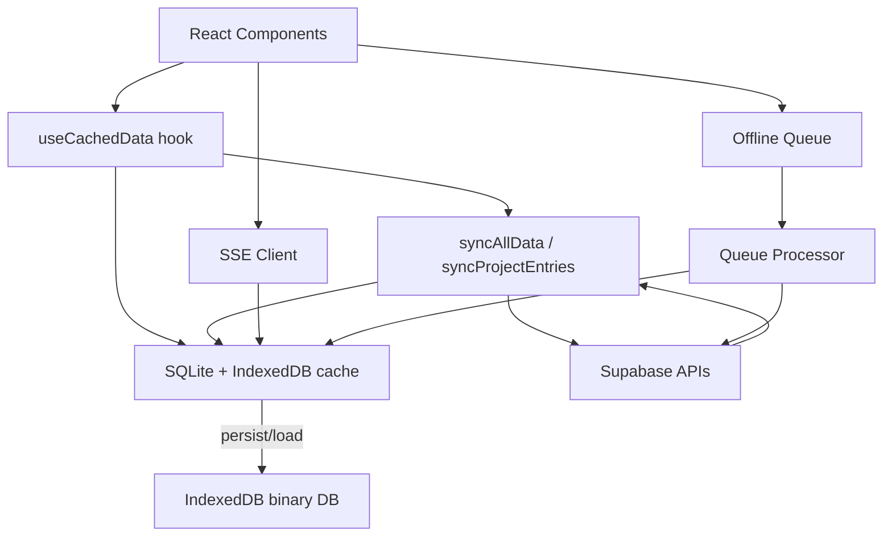
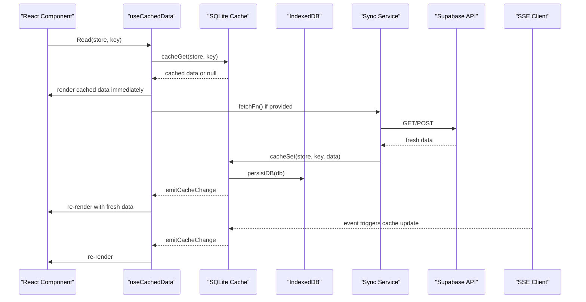
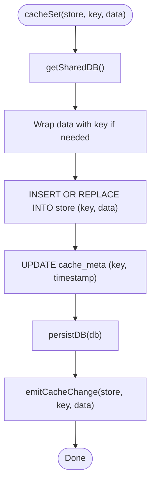
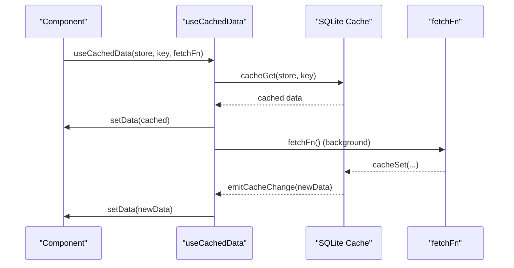
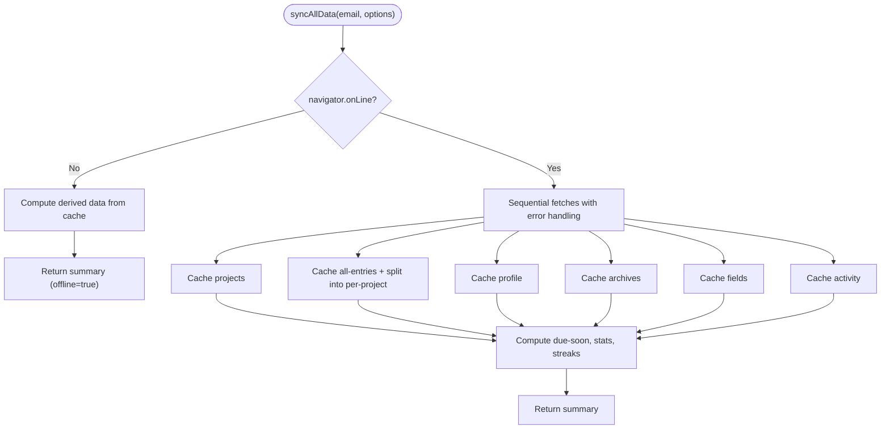
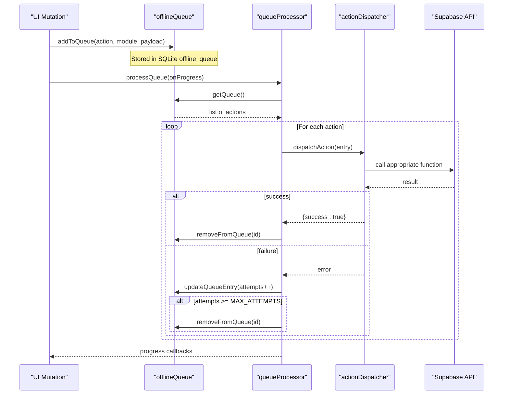
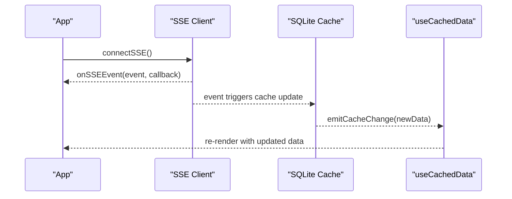
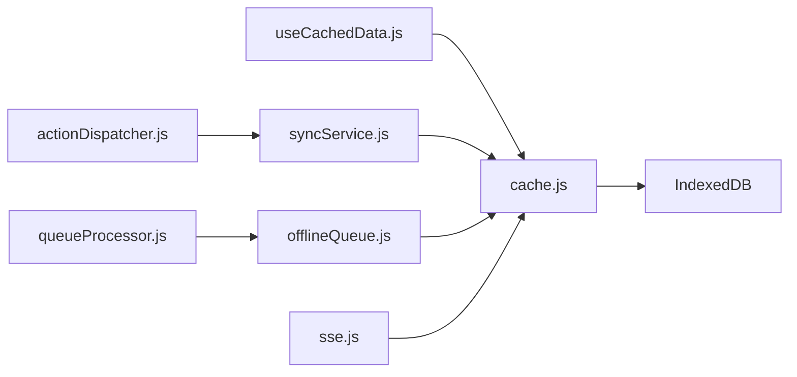

# Caching Strategy & Local Storage

<cite>
**Referenced Files in This Document**
- [cache.js](file://frontend/src/lib/cache.js)
- [useCachedData.js](file://frontend/src/hooks/useCachedData.js)
- [syncService.js](file://frontend/src/CacheFunctions/syncService.js)
- [offlineQueue.js](file://frontend/src/CacheFunctions/offlineQueue.js)
- [queueProcessor.js](file://frontend/src/CacheFunctions/queueProcessor.js)
- [actionDispatcher.js](file://frontend/src/CacheFunctions/actionDispatcher.js)
- [sse.js](file://frontend/src/lib/sse.js)
- [000_baseline_full_schema.sql](file://supabase/migrations/000_baseline_full_schema.sql)
- [database.md](file://docs-site/docs/Architecture/database.md)
</cite>

## Table of Contents

1. [Introduction](#introduction)
2. [Project Structure](#project-structure)
3. [Core Components](#core-components)
4. [Architecture Overview](#architecture-overview)
5. [Detailed Component Analysis](#detailed-component-analysis)
6. [Dependency Analysis](#dependency-analysis)
7. [Performance Considerations](#performance-considerations)
8. [Troubleshooting Guide](#troubleshooting-guide)
9. [Conclusion](#conclusion)
10. [Appendices](#appendices)

## Introduction

This document explains Codacaine’s local-first caching strategy built on SQLite via sql.js WebAssembly, with IndexedDB used as the durable persistence layer. It covers how data is stored in SQL tables that mirror the Supabase schema (with JSON blobs for compatibility), the stale-while-revalidate pattern, cache invalidation and subscription system, offline queueing, and performance optimizations. It also includes practical examples of cache operations, real-time update patterns via Server-Sent Events (SSE), memory management considerations, browser compatibility notes, storage limits, and database migration strategies for evolving the cache schema.

## Project Structure

The caching subsystem spans several modules:

- Cache core: SQLite initialization, table creation, read/write/delete, timestamps, subscriptions, and IndexedDB persistence
- Hooks: React integration to read from cache immediately and subscribe to updates
- Sync service: Orchestrates server fetches and populates the cache; computes derived data locally
- Offline queue: Stores mutations when offline and replays them online
- Queue processor: Executes queued actions with retry logic
- Action dispatcher: Maps action names to handler functions
- SSE client: Connects to real-time events and triggers cache updates

**Diagram sources**

- [cache.js:129-171](file://frontend/src/lib/cache.js#L129-L171)
- [useCachedData.js:23-76](file://frontend/src/hooks/useCachedData.js#L23-L76)
- [syncService.js:75-101](file://frontend/src/CacheFunctions/syncService.js#L75-L101)
- [offlineQueue.js:21-44](file://frontend/src/CacheFunctions/offlineQueue.js#L21-L44)
- [queueProcessor.js:21-90](file://frontend/src/CacheFunctions/queueProcessor.js#L21-L90)
- [sse.js:121-184](file://frontend/src/lib/sse.js#L121-L184)

**Section sources**

- [cache.js:1-389](file://frontend/src/lib/cache.js#L1-L389)
- [useCachedData.js:1-100](file://frontend/src/hooks/useCachedData.js#L1-L100)
- [syncService.js:1-466](file://frontend/src/CacheFunctions/syncService.js#L1-L466)
- [offlineQueue.js:1-145](file://frontend/src/CacheFunctions/offlineQueue.js#L1-L145)
- [queueProcessor.js:1-156](file://frontend/src/CacheFunctions/queueProcessor.js#L1-L156)
- [actionDispatcher.js:1-127](file://frontend/src/CacheFunctions/actionDispatcher.js#L1-L127)
- [sse.js:88-184](file://frontend/src/lib/sse.js#L88-L184)

## Core Components

- SQLite cache layer: Initializes sql.js, creates tables mirroring Supabase schema, persists to IndexedDB, provides get/set/delete/timestamp, and emits cache change events
- React hook: Reads from cache immediately, subscribes to changes, and triggers background refresh
- Sync service: Fetches data from server, writes to cache, computes derived data locally, and avoids overwriting good cache with empty server responses
- Offline queue and processor: Persist mutations offline and replay them online with retries
- SSE client: Manages real-time connection and dispatches events to subscribers

Key responsibilities:

- Local-first reads: Return cached data instantly
- Optimistic writes: Update SQLite first, then sync to server
- Stale-while-revalidate: Serve cache while refreshing in background
- Subscription model: Notify subscribers on cache changes
- Offline resilience: Queue and replay mutations

**Section sources**

- [cache.js:18-31](file://frontend/src/lib/cache.js#L18-L31)
- [cache.js:129-171](file://frontend/src/lib/cache.js#L129-L171)
- [cache.js:179-263](file://frontend/src/lib/cache.js#L179-L263)
- [useCachedData.js:23-76](file://frontend/src/hooks/useCachedData.js#L23-L76)
- [syncService.js:75-101](file://frontend/src/CacheFunctions/syncService.js#L75-L101)
- [offlineQueue.js:21-44](file://frontend/src/CacheFunctions/offlineQueue.js#L21-L44)
- [queueProcessor.js:21-90](file://frontend/src/CacheFunctions/queueProcessor.js#L21-L90)
- [sse.js:121-184](file://frontend/src/lib/sse.js#L121-L184)

## Architecture Overview

Codacaine uses a local-first architecture:

- Data is stored in an in-memory SQLite database created by sql.js
- The SQLite database is persisted as a binary blob in IndexedDB for durability across sessions
- Tables mirror the Supabase schema; values are stored as JSON strings for compatibility
- React components use hooks to read from cache immediately and subscribe to updates
- A sync service orchestrates server fetches and caches results
- Real-time updates arrive via SSE and trigger cache updates
- Offline mutations are queued and replayed when connectivity returns

**Diagram sources**

- [useCachedData.js:23-76](file://frontend/src/hooks/useCachedData.js#L23-L76)
- [cache.js:179-263](file://frontend/src/lib/cache.js#L179-L263)
- [cache.js:78-119](file://frontend/src/lib/cache.js#L78-L119)
- [syncService.js:75-101](file://frontend/src/CacheFunctions/syncService.js#L75-L101)
- [sse.js:121-184](file://frontend/src/lib/sse.js#L121-L184)

## Detailed Component Analysis

### SQLite Cache Layer

Responsibilities:

- Initialize sql.js WASM and create tables mirroring Supabase schema
- Load existing database from IndexedDB or start fresh
- Provide cacheGet, cacheSet, cacheDelete, cacheGetTimestamp, clearUserCache
- Persist SQLite database to IndexedDB after mutations
- Emit cache change events to subscribers

Schema highlights:

- Each table has a key column (primary key) and a data column storing JSON
- Additional tables include all_entries, profile, search, archives, fields, notes, offline_queue, and cache_meta for timestamps

**Diagram sources**

- [cache.js:201-223](file://frontend/src/lib/cache.js#L201-L223)
- [cache.js:78-119](file://frontend/src/lib/cache.js#L78-L119)

**Section sources**

- [cache.js:18-31](file://frontend/src/lib/cache.js#L18-L31)
- [cache.js:129-171](file://frontend/src/lib/cache.js#L129-L171)
- [cache.js:179-263](file://frontend/src/lib/cache.js#L179-L263)
- [000_baseline_full_schema.sql:41-84](file://supabase/migrations/000_baseline_full_schema.sql#L41-L84)

### React Hook: useCachedData

Behavior:

- Immediately reads from cache and renders without loading state
- Subscribes to cache changes to re-render when data updates
- Triggers background fetch via provided fetchFn
- Provides convenience hooks for projects, entries, and profile

**Diagram sources**

- [useCachedData.js:23-76](file://frontend/src/hooks/useCachedData.js#L23-L76)
- [cache.js:179-223](file://frontend/src/lib/cache.js#L179-L223)

**Section sources**

- [useCachedData.js:23-76](file://frontend/src/hooks/useCachedData.js#L23-L76)

### Sync Service

Responsibilities:

- Centralized data synchronization from server to cache
- Prevent duplicate concurrent syncs and throttle frequent full syncs
- Compute derived data locally (due-soon, stats, streaks) from cached entries
- Avoid overwriting non-empty cache with empty server responses
- Populate per-project entry caches from all-entries without extra server calls

**Diagram sources**

- [syncService.js:75-101](file://frontend/src/CacheFunctions/syncService.js#L75-L101)
- [syncService.js:106-387](file://frontend/src/CacheFunctions/syncService.js#L106-L387)

**Section sources**

- [syncService.js:75-101](file://frontend/src/CacheFunctions/syncService.js#L75-L101)
- [syncService.js:106-387](file://frontend/src/CacheFunctions/syncService.js#L106-L387)
- [syncService.js:396-407](file://frontend/src/CacheFunctions/syncService.js#L396-L407)
- [syncService.js:417-449](file://frontend/src/CacheFunctions/syncService.js#L417-L449)

### Offline Queue and Queue Processor

Responsibilities:

- Store mutations in SQLite when offline
- Process queue in FIFO order when connectivity returns
- Retry failed actions up to a maximum number of attempts
- Remove successful actions from the queue

**Diagram sources**

- [offlineQueue.js:21-44](file://frontend/src/CacheFunctions/offlineQueue.js#L21-L44)
- [queueProcessor.js:21-90](file://frontend/src/CacheFunctions/queueProcessor.js#L21-L90)
- [actionDispatcher.js:18-118](file://frontend/src/CacheFunctions/actionDispatcher.js#L18-L118)

**Section sources**

- [offlineQueue.js:21-44](file://frontend/src/CacheFunctions/offlineQueue.js#L21-L44)
- [offlineQueue.js:50-145](file://frontend/src/CacheFunctions/offlineQueue.js#L50-L145)
- [queueProcessor.js:21-90](file://frontend/src/CacheFunctions/queueProcessor.js#L21-L90)
- [actionDispatcher.js:18-118](file://frontend/src/CacheFunctions/actionDispatcher.js#L18-L118)

### Real-Time Updates via SSE

Responsibilities:

- Manage SSE connection with exponential backoff
- Register/unregister listeners for events
- Dispatch events to subscribers

Integration with cache:

- SSE events can trigger cache updates, which emit cache change events to subscribed hooks/components

**Diagram sources**

- [sse.js:121-184](file://frontend/src/lib/sse.js#L121-L184)
- [cache.js:59-72](file://frontend/src/lib/cache.js#L59-L72)

**Section sources**

- [sse.js:88-184](file://frontend/src/lib/sse.js#L88-L184)
- [cache.js:59-72](file://frontend/src/lib/cache.js#L59-L72)

## Dependency Analysis

- cache.js depends on sql.js for SQLite and IndexedDB for persistence
- useCachedData.js depends on cache.js for reading and subscribing
- syncService.js depends on cache.js and server functions to populate cache
- offlineQueue.js and queueProcessor.js depend on cache.js for shared SQLite instance
- actionDispatcher.js maps queued actions to server functions
- sse.js manages real-time events and integrates with cache updates

**Diagram sources**

- [cache.js:129-171](file://frontend/src/lib/cache.js#L129-L171)
- [useCachedData.js:23-76](file://frontend/src/hooks/useCachedData.js#L23-L76)
- [syncService.js:75-101](file://frontend/src/CacheFunctions/syncService.js#L75-L101)
- [offlineQueue.js:21-44](file://frontend/src/CacheFunctions/offlineQueue.js#L21-L44)
- [queueProcessor.js:21-90](file://frontend/src/CacheFunctions/queueProcessor.js#L21-L90)
- [actionDispatcher.js:18-118](file://frontend/src/CacheFunctions/actionDispatcher.js#L18-L118)
- [sse.js:121-184](file://frontend/src/lib/sse.js#L121-L184)

**Section sources**

- [cache.js:129-171](file://frontend/src/lib/cache.js#L129-L171)
- [useCachedData.js:23-76](file://frontend/src/hooks/useCachedData.js#L23-L76)
- [syncService.js:75-101](file://frontend/src/CacheFunctions/syncService.js#L75-L101)
- [offlineQueue.js:21-44](file://frontend/src/CacheFunctions/offlineQueue.js#L21-L44)
- [queueProcessor.js:21-90](file://frontend/src/CacheFunctions/queueProcessor.js#L21-L90)
- [actionDispatcher.js:18-118](file://frontend/src/CacheFunctions/actionDispatcher.js#L18-L118)
- [sse.js:121-184](file://frontend/src/lib/sse.js#L121-L184)

## Performance Considerations

- Local-first reads: Immediate response from SQLite without network latency
- Background refresh: Stale-while-revalidate serves cached data while fetching fresh data
- Throttled full syncs: Prevent excessive server calls with minimum interval between syncs
- Efficient data splitting: Derive per-project caches from all-entries without additional server calls
- Offline computation: Compute derived data (due-soon, stats, streaks) from cache when offline
- IndexedDB persistence: Binary blob storage reduces overhead and simplifies versioning compared to object stores

[No sources needed since this section provides general guidance]

## Troubleshooting Guide

Common issues and resolutions:

- Cache not updating: Ensure cacheSet is called after server write; verify emitCacheChange is triggered
- Duplicate syncs: Use syncAllData with throttling; check syncInProgress guard
- Empty server responses overwriting cache: Guard logic prevents clobbering good cache with empty responses
- Offline queue not processing: Verify navigator.onLine and processQueue is called when connectivity returns
- SSE disconnections: Exponential backoff reconnects automatically; ensure disconnectSSE is used appropriately

Operational tips:

- Use clearUserCache for logout or full refresh scenarios
- Monitor last sync time to understand freshness
- Inspect SQLite database via exported blob for debugging

**Section sources**

- [cache.js:201-263](file://frontend/src/lib/cache.js#L201-L263)
- [syncService.js:75-101](file://frontend/src/CacheFunctions/syncService.js#L75-L101)
- [syncService.js:218-281](file://frontend/src/CacheFunctions/syncService.js#L218-L281)
- [queueProcessor.js:21-90](file://frontend/src/CacheFunctions/queueProcessor.js#L21-L90)
- [sse.js:103-134](file://frontend/src/lib/sse.js#L103-L134)

## Conclusion

Codacaine’s caching strategy combines SQLite via sql.js with IndexedDB persistence to deliver a fast, reliable, local-first experience. The architecture supports immediate reads, optimistic writes, background refresh, real-time updates, and robust offline support through queueing and replay. By mirroring the Supabase schema and computing derived data locally, it minimizes network dependencies while maintaining consistency. Proper memory management, browser compatibility considerations, and migration strategies ensure long-term maintainability.

[No sources needed since this section summarizes without analyzing specific files]

## Appendices

### Examples of Cache Operations

- Get cached data: cacheGet(store, key)
- Set cached data: cacheSet(store, key, data)
- Delete cached data: cacheDelete(store, key)
- Clear user cache: clearUserCache(email)
- Stale-while-revalidate: staleWhileRevalidate({ store, key, fetcher, onUpdate, maxAge })
- Cached fetch wrapper: cachedFetch(store, key, fetchFn)

**Section sources**

- [cache.js:179-263](file://frontend/src/lib/cache.js#L179-L263)
- [cache.js:305-346](file://frontend/src/lib/cache.js#L305-L346)
- [cache.js:357-385](file://frontend/src/lib/cache.js#L357-L385)

### Subscription Patterns for Real-Time Updates

- Subscribe to cache changes: cacheSubscribe(store, key, callback)
- Unsubscribe: returned function from cacheSubscribe
- React integration: useCachedData automatically subscribes and re-renders on updates
- SSE integration: onSSEEvent registers listeners; events can trigger cache updates

**Section sources**

- [cache.js:45-72](file://frontend/src/lib/cache.js#L45-L72)
- [useCachedData.js:23-76](file://frontend/src/hooks/useCachedData.js#L23-L76)
- [sse.js:136-184](file://frontend/src/lib/sse.js#L136-L184)

### Memory Management Considerations

- SQLite instance is initialized once and reused
- IndexedDB persistence occurs after mutations to avoid excessive writes
- Large datasets should be paginated or filtered at query time to reduce memory usage
- Clear user cache on logout to free memory and storage

**Section sources**

- [cache.js:129-171](file://frontend/src/lib/cache.js#L129-L171)
- [cache.js:78-119](file://frontend/src/lib/cache.js#L78-L119)
- [cache.js:271-290](file://frontend/src/lib/cache.js#L271-L290)

### Browser Compatibility and Storage Limits

- sql.js requires WebAssembly support; modern browsers provide this
- IndexedDB is widely supported but may have storage quotas depending on browser and user settings
- Fallback behavior: If IndexedDB fails, cache operations log warnings and continue in-memory until persistence succeeds

**Section sources**

- [database.md:27-39](file://docs-site/docs/Architecture/database.md#L27-L39)
- [cache.js:78-119](file://frontend/src/lib/cache.js#L78-L119)

### Database Migration Strategies for Cache Schema Updates

- SQLite tables use CREATE TABLE IF NOT EXISTS to avoid conflicts during initialization
- IndexedDB versioning is simplified by storing a single binary blob, avoiding complex upgrade handlers
- For future schema evolution, consider adding migration steps within getDB to alter tables as needed

**Section sources**

- [cache.js:148-163](file://frontend/src/lib/cache.js#L148-L163)
- [database.md:27-39](file://docs-site/docs/Architecture/database.md#L27-L39)
