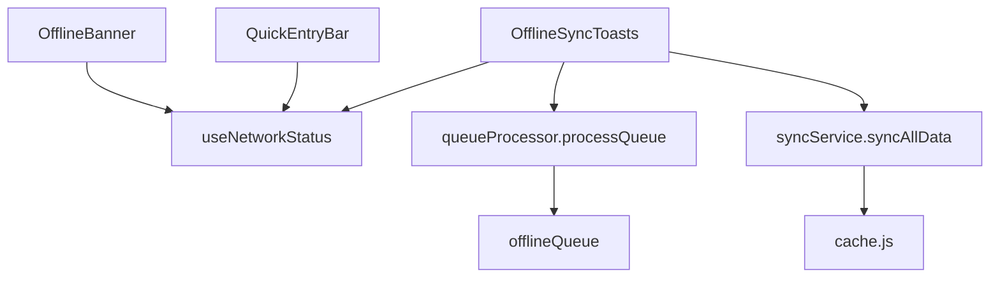
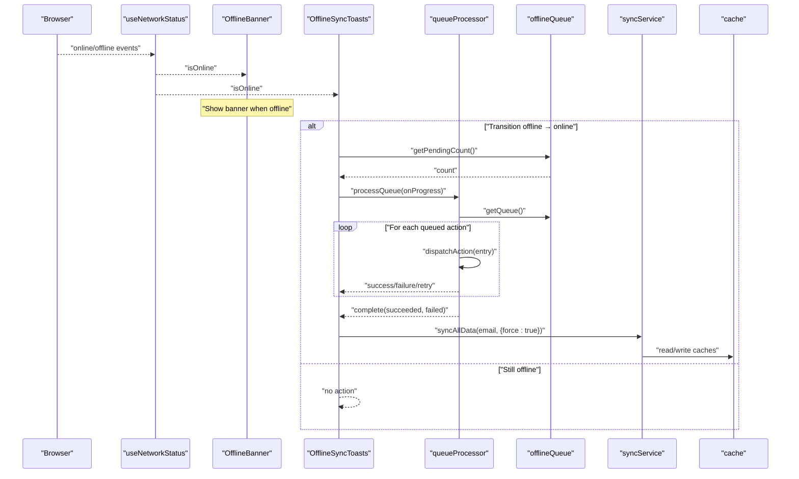
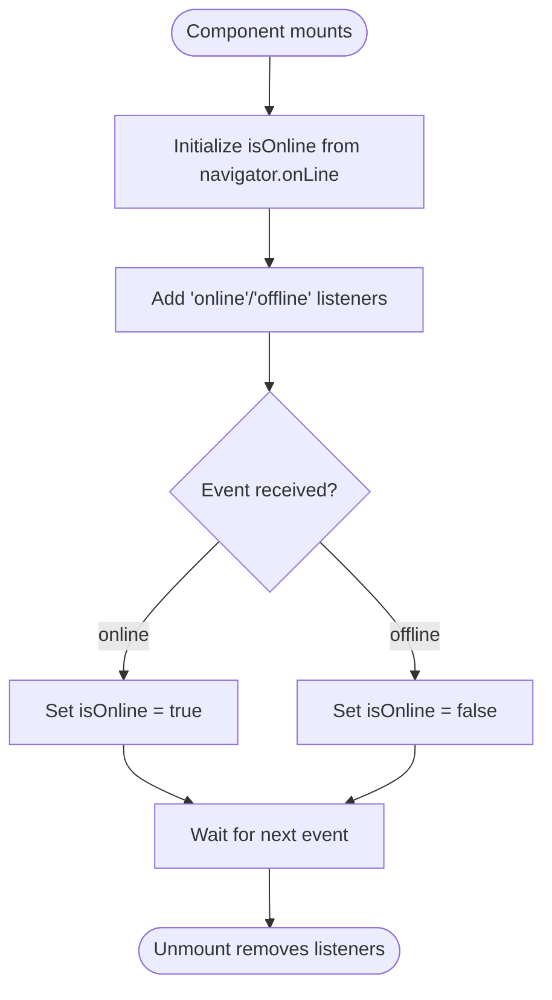
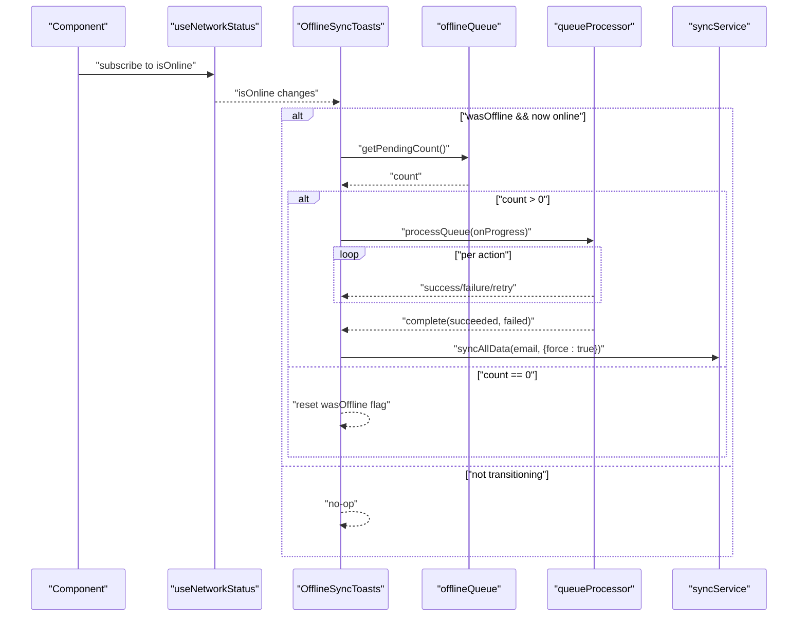
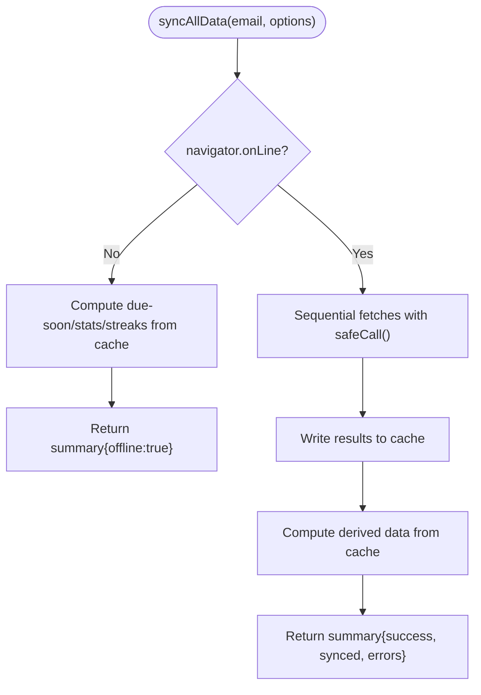
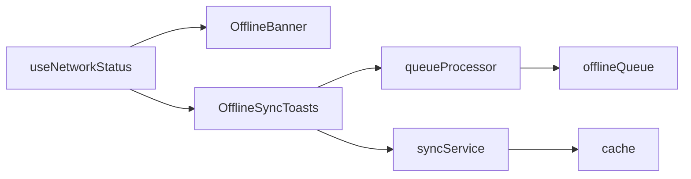

# Network Status Detection & UI Feedback

<cite>
**Referenced Files in This Document**
- [useNetworkStatus.js](file://frontend/src/hooks/useNetworkStatus.js)
- [OfflineBanner.tsx](file://frontend/src/components/OfflineBanner.tsx)
- [OfflineSyncToasts.tsx](file://frontend/src/components/OfflineSyncToasts.tsx)
- [syncService.js](file://frontend/src/CacheFunctions/syncService.js)
- [offlineQueue.js](file://frontend/src/CacheFunctions/offlineQueue.js)
- [queueProcessor.js](file://frontend/src/CacheFunctions/queueProcessor.js)
- [cache.js](file://frontend/src/lib/cache.js)
- [QuickEntryBar.tsx](file://frontend/src/components/QuickEntryBar.tsx)
</cite>

## Table of Contents

1. [Introduction](#introduction)
2. [Project Structure](#project-structure)
3. [Core Components](#core-components)
4. [Architecture Overview](#architecture-overview)
5. [Detailed Component Analysis](#detailed-component-analysis)
6. [Dependency Analysis](#dependency-analysis)
7. [Performance Considerations](#performance-considerations)
8. [Troubleshooting Guide](#troubleshooting-guide)
9. [Conclusion](#conclusion)
10. [Appendices](#appendices)

## Introduction

This document explains how the application detects network status and provides user feedback during offline scenarios. It focuses on:

- The useNetworkStatus hook that monitors browser connectivity events and exposes a reactive boolean to components.
- The OfflineBanner component that shows a persistent banner when the app is offline.
- The OfflineSyncToasts component that displays contextual progress and results for background sync operations after reconnecting.
- How these pieces integrate with the local-first cache, offline queue, and sync service to provide automatic retry logic and meaningful user guidance.

The goal is to help developers implement custom network-aware components, handle connection timeouts gracefully, and deliver clear feedback for different offline states.

## Project Structure

The network status and offline feedback system spans hooks, UI components, and caching/sync utilities:

- Hook: useNetworkStatus (reactive online/offline state)
- UI: OfflineBanner (persistent indicator), OfflineSyncToasts (progress notifications)
- Sync: syncService (full data sync with offline-safe behavior)
- Queue: offlineQueue (persisted actions), queueProcessor (FIFO processing with retries)
- Cache: cache (SQLite-backed store with event subscriptions and stale-while-revalidate)

**Diagram sources**

- [useNetworkStatus.js:14-39](file://frontend/src/hooks/useNetworkStatus.js#L14-L39)
- [OfflineBanner.tsx:1-52](file://frontend/src/components/OfflineBanner.tsx#L1-L52)
- [OfflineSyncToasts.tsx:28-109](file://frontend/src/components/OfflineSyncToasts.tsx#L28-L109)
- [queueProcessor.js:21-90](file://frontend/src/CacheFunctions/queueProcessor.js#L21-L90)
- [offlineQueue.js:21-145](file://frontend/src/CacheFunctions/offlineQueue.js#L21-L145)
- [syncService.js:75-101](file://frontend/src/CacheFunctions/syncService.js#L75-L101)
- [cache.js:179-223](file://frontend/src/lib/cache.js#L179-L223)
- [QuickEntryBar.tsx:38-200](file://frontend/src/components/QuickEntryBar.tsx#L38-L200)

**Section sources**

- [useNetworkStatus.js:14-39](file://frontend/src/hooks/useNetworkStatus.js#L14-L39)
- [OfflineBanner.tsx:1-52](file://frontend/src/components/OfflineBanner.tsx#L1-L52)
- [OfflineSyncToasts.tsx:28-109](file://frontend/src/components/OfflineSyncToasts.tsx#L28-L109)
- [syncService.js:75-101](file://frontend/src/CacheFunctions/syncService.js#L75-L101)
- [offlineQueue.js:21-145](file://frontend/src/CacheFunctions/offlineQueue.js#L21-L145)
- [queueProcessor.js:21-90](file://frontend/src/CacheFunctions/queueProcessor.js#L21-L90)
- [cache.js:179-223](file://frontend/src/lib/cache.js#L179-L223)
- [QuickEntryBar.tsx:38-200](file://frontend/src/components/QuickEntryBar.tsx#L38-L200)

## Core Components

- useNetworkStatus: A React hook that listens to window online/offline events and returns a boolean indicating connectivity. It initializes from navigator.onLine and updates reactively as the browser reports changes.
- OfflineBanner: Renders a visible banner at the top of the page when offline; hides itself when online.
- OfflineSyncToasts: Detects transitions from offline to online, checks for pending queued actions, processes them with progress callbacks, and shows toast notifications for success, failure, and retry. After successful sync, it triggers a full data refresh.
- syncService: Centralized data synchronization that safely handles offline mode by computing derived data from cache when offline and performing sequential fetches with per-call error handling when online. It also throttles full syncs to avoid excessive requests.
- offlineQueue: SQLite-backed queue manager that persists actions to be replayed when connectivity is restored. Provides add/get/remove/update/clear/count operations.
- queueProcessor: Processes the offline queue in FIFO order with retry logic (up to a maximum number of attempts) and emits progress events for UI feedback.
- cache: Local-first storage using SQLite persisted to IndexedDB. Provides get/set/delete, timestamps, and a stale-while-revalidate pattern for read operations.

**Section sources**

- [useNetworkStatus.js:14-39](file://frontend/src/hooks/useNetworkStatus.js#L14-L39)
- [OfflineBanner.tsx:1-52](file://frontend/src/components/OfflineBanner.tsx#L1-L52)
- [OfflineSyncToasts.tsx:28-109](file://frontend/src/components/OfflineSyncToasts.tsx#L28-L109)
- [syncService.js:75-101](file://frontend/src/CacheFunctions/syncService.js#L75-L101)
- [offlineQueue.js:21-145](file://frontend/src/CacheFunctions/offlineQueue.js#L21-L145)
- [queueProcessor.js:21-90](file://frontend/src/CacheFunctions/queueProcessor.js#L21-L90)
- [cache.js:179-223](file://frontend/src/lib/cache.js#L179-L223)

## Architecture Overview

The system combines real-time network detection with an offline-first data strategy:

- Components consume useNetworkStatus to adapt UI based on connectivity.
- When offline, mutations are queued locally and applied optimistically to the cache.
- On reconnection, OfflineSyncToasts triggers queue processing and a full data refresh via syncService.
- syncService avoids server calls when offline and computes derived metrics from cached entries.

**Diagram sources**

- [useNetworkStatus.js:14-39](file://frontend/src/hooks/useNetworkStatus.js#L14-L39)
- [OfflineBanner.tsx:1-52](file://frontend/src/components/OfflineBanner.tsx#L1-L52)
- [OfflineSyncToasts.tsx:28-109](file://frontend/src/components/OfflineSyncToasts.tsx#L28-L109)
- [queueProcessor.js:21-90](file://frontend/src/CacheFunctions/queueProcessor.js#L21-L90)
- [offlineQueue.js:21-145](file://frontend/src/CacheFunctions/offlineQueue.js#L21-L145)
- [syncService.js:75-101](file://frontend/src/CacheFunctions/syncService.js#L75-L101)
- [cache.js:179-223](file://frontend/src/lib/cache.js#L179-L223)

## Detailed Component Analysis

### useNetworkStatus

- Purpose: Provide a reactive boolean for online/offline state.
- Behavior: Initializes from navigator.onLine; subscribes to window online/offline events; cleans up listeners on unmount.
- Complexity: O(1) state updates; event listeners are attached once per hook instance.
- Error handling: None; relies on browser events.

**Diagram sources**

- [useNetworkStatus.js:14-39](file://frontend/src/hooks/useNetworkStatus.js#L14-L39)

**Section sources**

- [useNetworkStatus.js:14-39](file://frontend/src/hooks/useNetworkStatus.js#L14-L39)

### OfflineBanner

- Purpose: Display a persistent banner when offline.
- Behavior: Uses useNetworkStatus; renders only when isOnline is false; includes an icon and message.
- Integration: Placed near the root of the UI so users immediately see connectivity status.

**Section sources**

- [OfflineBanner.tsx:1-52](file://frontend/src/components/OfflineBanner.tsx#L1-L52)

### OfflineSyncToasts

- Purpose: Show contextual feedback while syncing queued actions after reconnecting.
- Behavior:
  - Tracks offline→online transitions to avoid redundant processing.
  - Checks pending queue count; if > 0, starts processing with progress callbacks.
  - Displays toasts for start, success, failure, retry, and completion.
  - After successful sync, triggers a full data refresh via syncService.
- Complexity: Linear in number of queued actions; toast auto-dismissal uses timers.

**Diagram sources**

- [OfflineSyncToasts.tsx:28-109](file://frontend/src/components/OfflineSyncToasts.tsx#L28-L109)
- [queueProcessor.js:21-90](file://frontend/src/CacheFunctions/queueProcessor.js#L21-L90)
- [offlineQueue.js:21-145](file://frontend/src/CacheFunctions/offlineQueue.js#L21-L145)
- [syncService.js:75-101](file://frontend/src/CacheFunctions/syncService.js#L75-L101)

**Section sources**

- [OfflineSyncToasts.tsx:28-109](file://frontend/src/components/OfflineSyncToasts.tsx#L28-L109)

### syncService (offline-aware sync)

- Purpose: Central entry point for synchronizing all user data into the local cache.
- Offline behavior: If navigator.onLine is false, skip server requests and compute derived data (due-soon, stats, streaks) from cached entries.
- Online behavior: Performs sequential fetches with individual error handling; batches archives and fields; writes to cache; computes derived data post-sync.
- Throttling: Prevents duplicate concurrent syncs and skips recent syncs unless forced.

**Diagram sources**

- [syncService.js:75-101](file://frontend/src/CacheFunctions/syncService.js#L75-L101)
- [syncService.js:106-154](file://frontend/src/CacheFunctions/syncService.js#L106-L154)
- [syncService.js:156-387](file://frontend/src/CacheFunctions/syncService.js#L156-L387)

**Section sources**

- [syncService.js:75-101](file://frontend/src/CacheFunctions/syncService.js#L75-L101)
- [syncService.js:106-154](file://frontend/src/CacheFunctions/syncService.js#L106-L154)
- [syncService.js:156-387](file://frontend/src/CacheFunctions/syncService.js#L156-L387)

### offlineQueue (persisted action queue)

- Purpose: Persist actions to be executed when connectivity is restored.
- Operations: Add, get, get by id, remove, update, clear, length.
- Storage: SQLite table managed via cache.js’s shared DB and persisted to IndexedDB.

**Section sources**

- [offlineQueue.js:21-145](file://frontend/src/CacheFunctions/offlineQueue.js#L21-L145)
- [cache.js:125-171](file://frontend/src/lib/cache.js#L125-L171)

### queueProcessor (FIFO with retries)

- Purpose: Process queued actions in order with retry logic and progress reporting.
- Behavior:
  - Skips processing if offline.
  - Executes each action via dispatchAction; on success, removes from queue; on failure, increments attempts and either retries or marks failed after max attempts.
  - Emits progress events for start, success, retry, failed, and complete.

**Section sources**

- [queueProcessor.js:21-90](file://frontend/src/CacheFunctions/queueProcessor.js#L21-L90)
- [queueProcessor.js:97-156](file://frontend/src/CacheFunctions/queueProcessor.js#L97-L156)

### QuickEntryBar (network-aware input)

- Purpose: Provide quick entry creation with network awareness.
- Behavior: Disables input and submit button when offline; shows placeholder indicating offline state; prevents submission without connectivity.

**Section sources**

- [QuickEntryBar.tsx:38-200](file://frontend/src/components/QuickEntryBar.tsx#L38-L200)

## Dependency Analysis

- useNetworkStatus has no internal dependencies beyond React and browser APIs.
- OfflineBanner depends on useNetworkStatus.
- OfflineSyncToasts depends on useNetworkStatus, queueProcessor, offlineQueue, and syncService.
- queueProcessor depends on offlineQueue and actionDispatcher (external).
- syncService depends on multiple function modules and cache utilities.
- cache depends on sql.js and IndexedDB for persistence.

**Diagram sources**

- [useNetworkStatus.js:14-39](file://frontend/src/hooks/useNetworkStatus.js#L14-L39)
- [OfflineBanner.tsx:1-52](file://frontend/src/components/OfflineBanner.tsx#L1-L52)
- [OfflineSyncToasts.tsx:28-109](file://frontend/src/components/OfflineSyncToasts.tsx#L28-L109)
- [queueProcessor.js:21-90](file://frontend/src/CacheFunctions/queueProcessor.js#L21-L90)
- [offlineQueue.js:21-145](file://frontend/src/CacheFunctions/offlineQueue.js#L21-L145)
- [syncService.js:75-101](file://frontend/src/CacheFunctions/syncService.js#L75-L101)
- [cache.js:179-223](file://frontend/src/lib/cache.js#L179-L223)

**Section sources**

- [useNetworkStatus.js:14-39](file://frontend/src/hooks/useNetworkStatus.js#L14-L39)
- [OfflineBanner.tsx:1-52](file://frontend/src/components/OfflineBanner.tsx#L1-L52)
- [OfflineSyncToasts.tsx:28-109](file://frontend/src/components/OfflineSyncToasts.tsx#L28-L109)
- [queueProcessor.js:21-90](file://frontend/src/CacheFunctions/queueProcessor.js#L21-L90)
- [offlineQueue.js:21-145](file://frontend/src/CacheFunctions/offlineQueue.js#L21-L145)
- [syncService.js:75-101](file://frontend/src/CacheFunctions/syncService.js#L75-L101)
- [cache.js:179-223](file://frontend/src/lib/cache.js#L179-L223)

## Performance Considerations

- useNetworkStatus attaches two lightweight event listeners; minimal overhead.
- OfflineSyncToasts uses timers for toast auto-dismissal; ensure not to spawn excessive timers in high-frequency scenarios.
- queueProcessor processes actions sequentially; consider batching or limiting concurrent retries if queue grows large.
- syncService throttles full syncs and prevents duplicate concurrent syncs; this reduces network load and race conditions.
- cache persists to IndexedDB after writes; batch writes where possible to reduce I/O.

[No sources needed since this section provides general guidance]

## Troubleshooting Guide

Common issues and resolutions:

- No toasts appear after reconnecting:
  - Ensure OfflineSyncToasts is mounted and listening to network changes.
  - Verify there are pending actions in the offline queue.
  - Confirm processQueue is called and progress callbacks are invoked.
- Actions fail repeatedly:
  - Check queueProcessor retry logic and maximum attempts.
  - Inspect actionDispatcher errors and network responses.
- Full sync does not refresh data:
  - Verify syncAllData is called with a valid email and force option when needed.
  - Check for throttle skipping due to recent sync; adjust interval or force refresh.
- Offline banner not showing:
  - Confirm useNetworkStatus is receiving online/offline events.
  - Ensure the component tree renders OfflineBanner when offline.

**Section sources**

- [OfflineSyncToasts.tsx:28-109](file://frontend/src/components/OfflineSyncToasts.tsx#L28-L109)
- [queueProcessor.js:21-90](file://frontend/src/CacheFunctions/queueProcessor.js#L21-L90)
- [syncService.js:75-101](file://frontend/src/CacheFunctions/syncService.js#L75-L101)
- [useNetworkStatus.js:14-39](file://frontend/src/hooks/useNetworkStatus.js#L14-L39)

## Conclusion

The application implements a robust offline-first architecture with clear network status detection and user feedback:

- useNetworkStatus provides reactive connectivity state.
- OfflineBanner offers immediate visual indication of offline mode.
- OfflineSyncToasts orchestrates background sync with contextual feedback and automatic retries.
- syncService ensures data consistency by computing derived metrics offline and performing safe, throttled syncs online.
- The offline queue persists user actions until connectivity is restored.

Developers can extend this system by adding custom network-aware components, integrating with the queue for custom actions, and leveraging syncService for reliable data synchronization.

[No sources needed since this section summarizes without analyzing specific files]

## Appendices

### Implementing Custom Network-Aware Components

- Use useNetworkStatus to conditionally enable/disable features or show messages.
- For write-heavy flows, enqueue actions via offlineQueue and rely on queueProcessor to execute them when online.
- Trigger full data refresh via syncService when appropriate (e.g., after successful queue processing).

**Section sources**

- [useNetworkStatus.js:14-39](file://frontend/src/hooks/useNetworkStatus.js#L14-L39)
- [offlineQueue.js:21-145](file://frontend/src/CacheFunctions/offlineQueue.js#L21-L145)
- [queueProcessor.js:21-90](file://frontend/src/CacheFunctions/queueProcessor.js#L21-L90)
- [syncService.js:75-101](file://frontend/src/CacheFunctions/syncService.js#L75-L101)

### Handling Connection Timeouts

- Use syncService’s safeCall pattern to wrap API calls with error handling.
- Leverage queueProcessor’s retry mechanism for transient failures.
- Consider adding explicit timeout wrappers around fetch calls if needed.

**Section sources**

- [syncService.js:156-214](file://frontend/src/CacheFunctions/syncService.js#L156-L214)
- [queueProcessor.js:21-90](file://frontend/src/CacheFunctions/queueProcessor.js#L21-L90)

### Providing Meaningful User Feedback

- Use OfflineBanner for persistent offline indicators.
- Use OfflineSyncToasts for contextual progress and outcomes during sync.
- Disable or adapt UI elements (like QuickEntryBar) when offline to prevent confusing interactions.

**Section sources**

- [OfflineBanner.tsx:1-52](file://frontend/src/components/OfflineBanner.tsx#L1-L52)
- [OfflineSyncToasts.tsx:28-109](file://frontend/src/components/OfflineSyncToasts.tsx#L28-L109)
- [QuickEntryBar.tsx:38-200](file://frontend/src/components/QuickEntryBar.tsx#L38-L200)
